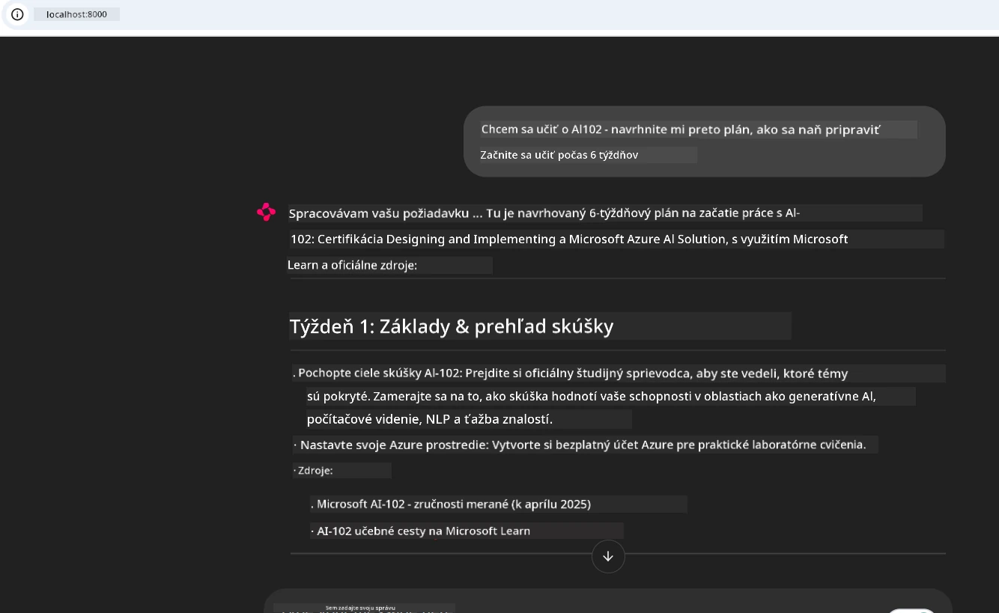
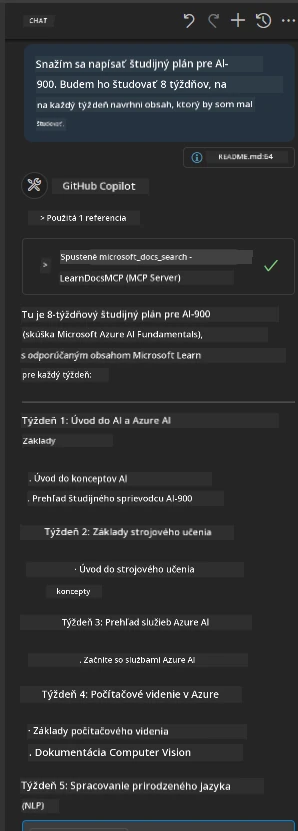

# Prípadová štúdia: Pripojenie k serveru Microsoft Learn Docs MCP zo klienta

Stalo sa vám niekedy, že ste sa pohybovali medzi stránkami dokumentácie, Stack Overflow a nekonečnými kartami vyhľadávača, pričom ste sa snažili vyriešiť problém vo vašom kóde? Možno máte druhý monitor len na dokumentáciu alebo neustále prepínate medzi IDE a prehliadačom pomocou alt-tabu. Nebolo by lepšie, keby ste mohli dokumentáciu priniesť priamo do vášho pracovného toku — integrovanú priamo v aplikáciách, v IDE alebo dokonca vo vlastných nástrojoch? V tejto prípadovej štúdii preskúmame, ako to urobiť tak, že sa priamo pripojíte k serveru Microsoft Learn Docs MCP zo svojej vlastnej klientovej aplikácie.

## Prehľad

Moderný vývoj nie je len o písaní kódu — ide o nájdenie správnych informácií v správny čas. Dokumentácia je všade, no málokedy tam, kde ju najviac potrebujete: priamo vo vašich nástrojoch a pracovných tokoch. Integráciou získavania dokumentácie priamo do vašich aplikácií môžete ušetriť čas, znížiť prepínanie kontextu a zvýšiť produktivitu. V tejto sekcii vám ukážeme, ako sa pripojiť ku klientovi na server Microsoft Learn Docs MCP, aby ste mohli pristupovať k dokumentácii v reálnom čase s vedomím kontextu bez opustenia aplikácie.

Prejdeme proces naviazania spojenia, odoslania požiadavky a efektívnej manipulácie so streamingovými odpoveďami. Tento prístup nielen zjednodušuje váš pracovný tok, ale otvára dvere k tvorbe inteligentnejších a užitočnejších nástrojov pre vývojárov.

## Ciele učenia sa

Prečo to robíme? Pretože najlepšie vývojárske skúsenosti odstraňujú zbytočné prekážky. Predstavte si svet, kde váš kódový editor, chatbot alebo webová aplikácia môžu okamžite odpovedať na vaše otázky ohľadom dokumentácie, a to pomocou najnovšieho obsahu z Microsoft Learn. Na konci tejto kapitoly budete vedieť:

- Pochopiť základy komunikácie medzi serverom MCP a klientom pre dokumentáciu
- Implementovať konzolovú alebo webovú aplikáciu na pripojenie k serveru Microsoft Learn Docs MCP
- Použiť streamingových HTTP klientov na získavanie dokumentácie v reálnom čase
- Zaznamenávať a interpretovať odpovede dokumentácie vo vašej aplikácii

Uvidíte, ako vám tieto schopnosti pomôžu vytvárať nástroje, ktoré sú nielen reaktívne, ale skutočne interaktívne a vedomé kontextu.

## Scenár 1 - Získavanie dokumentácie v reálnom čase s MCP

V tomto scenári vám ukážeme, ako pripojiť klienta k serveru Microsoft Learn Docs MCP, aby ste mohli pristupovať k dokumentácii v reálnom čase s vedomím kontextu bez opustenia aplikácie.

Poďme to vložiť do praxe. Vašou úlohou je napísať aplikáciu, ktorá sa pripojí k serveru Microsoft Learn Docs MCP, vyvolá nástroj `microsoft_docs_search` a zaznamená streamovanú odpoveď do konzoly.

### Prečo tento prístup?
Pretože je to základ pre budovanie pokročilejších integrácií — či už chcete podporiť chatbota, rozšírenie IDE alebo webový dashboard.

Kód a inštrukcie pre tento scenár nájdete v priečinku [`solution`](./solution/README.md) v rámci tejto prípadovej štúdie. Kroky vás prevedú nastavením pripojenia:
- Použite oficiálne MCP SDK a streamovací HTTP klient na pripojenie
- Zavolajte nástroj `microsoft_docs_search` s parametrom dopytu na získanie dokumentácie
- Implementujte správne zaznamenávanie a spracovanie chýb
- Vytvorte interaktívne rozhranie konzoly, ktoré umožní používateľom zadať viacero vyhľadávacích dopytov

Tento scenár demonštruje, ako:
- Pripojiť sa k Docs MCP serveru
- Odoslať dopyt
- Analyzovať a vypísať výsledky

Takto by mohol vyzerať beh riešenia:

```
Prompt> What is Azure Key Vault?
Answer> Azure Key Vault is a cloud service for securely storing and accessing secrets. ...
```

Nižšie je uvedený minimálny ukážkový príklad riešenia. Kompletný kód a podrobnosti sú k dispozícii v priečinku riešenia.

<details>
<summary>Python</summary>

```python
import asyncio
from mcp.client.streamable_http import streamablehttp_client
from mcp import ClientSession

async def main():
    async with streamablehttp_client("https://learn.microsoft.com/api/mcp") as (read_stream, write_stream, _):
        async with ClientSession(read_stream, write_stream) as session:
            await session.initialize()
            result = await session.call_tool("microsoft_docs_search", {"query": "Azure Functions best practices"})
            print(result.content)

if __name__ == "__main__":
    asyncio.run(main())
```

- Kompletnú implementáciu a zaznamenávanie nájdete v súbore [`scenario1.py`](../../../../09-CaseStudy/docs-mcp/solution/python/scenario1.py).
- Inštrukcie na inštaláciu a používanie nájdete v súbore [`README.md`](./solution/python/README.md) v tom istom priečinku.
</details>


## Scenár 2 - Interaktívna webová aplikácia generátora študijného plánu s MCP

V tomto scenári sa naučíte, ako integrovať Docs MCP do webového vývojového projektu. Cieľom je umožniť používateľom vyhľadávať dokumentáciu Microsoft Learn priamo z webového rozhrania, čím sa dokumentácia stane okamžite prístupnou vo vašej aplikácii alebo na stránke.

Uvidíte, ako:
- Nastaviť webovú aplikáciu
- Pripojiť sa k Docs MCP serveru
- Spracovať vstup používateľa a zobraziť výsledky

Takto by mohol vyzerať beh riešenia:

```
User> I want to learn about AI102 - so suggest the roadmap to get it started from learn for 6 weeks

Assistant> Here’s a detailed 6-week roadmap to start your preparation for the AI-102: Designing and Implementing a Microsoft Azure AI Solution certification, using official Microsoft resources and focusing on exam skills areas:

---
## Week 1: Introduction & Fundamentals
- **Understand the Exam**: Review the [AI-102 exam skills outline](https://learn.microsoft.com/en-us/credentials/certifications/exams/ai-102/).
- **Set up Azure**: Sign up for a free Azure account if you don't have one.
- **Learning Path**: [Introduction to Azure AI services](https://learn.microsoft.com/en-us/training/modules/intro-to-azure-ai/)
- **Focus**: Get familiar with Azure portal, AI capabilities, and necessary tools.

....more weeks of the roadmap...

Let me know if you want module-specific recommendations or need more customized weekly tasks!
```

Nižšie je uvedený minimálny ukážkový príklad riešenia. Kompletný kód a podrobnosti sú k dispozícii v priečinku riešenia.



<details>
<summary>Python (Chainlit)</summary>

Chainlit je rámec pre tvorbu konverzačných AI webových aplikácií. Umožňuje ľahko vytvárať interaktívne chatboty a asistentov, ktorí môžu volať MCP nástroje a zobrazovať výsledky v reálnom čase. Je ideálny na rýchle prototypovanie a užívateľsky prívetivé rozhrania.

```python
import chainlit as cl
import requests

MCP_URL = "https://learn.microsoft.com/api/mcp"

@cl.on_message
def handle_message(message):
    query = {"question": message}
    response = requests.post(MCP_URL, json=query)
    if response.ok:
        result = response.json()
        cl.Message(content=result.get("answer", "No answer found.")).send()
    else:
        cl.Message(content="Error: " + response.text).send()
```

- Kompletnú implementáciu nájdete v súbore [`scenario2.py`](../../../../09-CaseStudy/docs-mcp/solution/python/scenario2.py).
- Inštrukcie na nastavenie a spustenie nájdete v súbore [`README.md`](./solution/python/README.md).
</details>


## Scenár 3: Dokumentácia v editore s MCP serverom vo VS Code

Ak chcete získať Microsoft Learn Docs priamo vo VS Code (namiesto prepínania kariet prehliadača), môžete použiť MCP server vo vašom editore. To vám umožní:
- Vyhľadávať a čítať dokumentáciu vo VS Code bez opustenia prostredia pre vývoj kódu.
- Odkazovať na dokumentáciu a vkladať odkazy priamo do README alebo súborov kurzu.
- Využiť GitHub Copilot a MCP spolu pre plynulý pracovný tok dokumentácie podporovaný AI.

**Uvidíte, ako:**
- Pridať platný súbor `.vscode/mcp.json` do koreňového priečinka pracovného priestoru (príklad nižšie).
- Otvoriť MCP panel alebo použiť príkazovú paletu vo VS Code pre vyhľadávanie a vkladanie dokumentácie.
- Odkazovať na dokumentáciu priamo vo vašich markdown súboroch počas práce.
- Kombinovať tento pracovný tok s GitHub Copilot pre ešte vyššiu produktivitu.

Tu je príklad, ako nastaviť MCP server vo VS Code:

```json
{
  "servers": {
    "LearnDocsMCP": {
      "url": "https://learn.microsoft.com/api/mcp"
    }
  }
}
```

</details>

> Pre podrobný návod s obrázkami a krok za krokom, pozrite si [`README.md`](./solution/scenario3/README.md).



Tento prístup je ideálny pre každého, kto tvorí technické kurzy, píše dokumentáciu alebo vyvíja kód s častou potrebou odkazov.

## Kľúčové body

Integrácia dokumentácie priamo do vašich nástrojov nie je len pohodlie — je to revolúcia produktivity. Pripojením k serveru Microsoft Learn Docs MCP zo svojho klienta môžete:

- Eliminovať prepínanie kontextu medzi kódom a dokumentáciou
- Získať aktuálnu, kontextovo uvedomelú dokumentáciu v reálnom čase
- Vytvárať inteligentnejšie, interaktívnejšie nástroje pre vývojárov

Tieto zručnosti vám pomôžu vytvárať riešenia, ktoré nie sú len efektívne, ale aj príjemné na používanie.

## Dodatočné zdroje

Pre hlbšie pochopenie prezrite si tieto oficiálne zdroje:

- [Microsoft Learn Docs MCP Server (GitHub)](https://github.com/MicrosoftDocs/mcp)
- [Začíname s Azure MCP Serverom (mcp-python)](https://learn.microsoft.com/en-us/azure/developer/azure-mcp-server/get-started#create-the-python-app)
- [Čo je Azure MCP Server?](https://learn.microsoft.com/en-us/azure/developer/azure-mcp-server/)
- [Úvod do Model Context Protocol (MCP)](https://modelcontextprotocol.io/introduction)
- [Pridanie pluginov z MCP Servera (Python)](https://learn.microsoft.com/en-us/semantic-kernel/concepts/plugins/adding-mcp-plugins)

## Čo ďalej

- Späť na: [Prehľad prípadových štúdií](../README.md)
- Pokračovať na: [Modul 10: Zefektívnenie AI pracovných tokov pomocou AI Toolkit](../../10-StreamliningAIWorkflowsBuildingAnMCPServerWithAIToolkit/README.md)

---

<!-- CO-OP TRANSLATOR DISCLAIMER START -->
**Vyhlásenie o odmietnutí zodpovednosti**:
Tento dokument bol preložený pomocou AI prekladateľskej služby [Co-op Translator](https://github.com/Azure/co-op-translator). Aj keď sa snažíme o presnosť, majte, prosím, na pamäti, že automatické preklady môžu obsahovať chyby alebo nepresnosti. Originálny dokument v jeho pôvodnom jazyku by sa mal považovať za autoritatívny zdroj. Pre kritické informácie sa odporúča profesionálny ľudský preklad. Nie sme zodpovední za akékoľvek nedorozumenia alebo nesprávne interpretácie vyplývajúce z použitia tohto prekladu.
<!-- CO-OP TRANSLATOR DISCLAIMER END -->