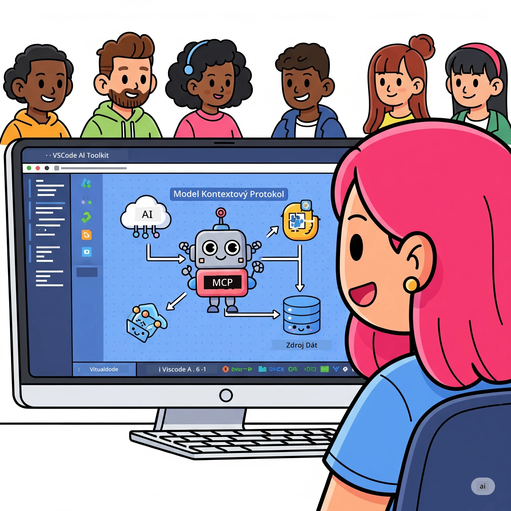
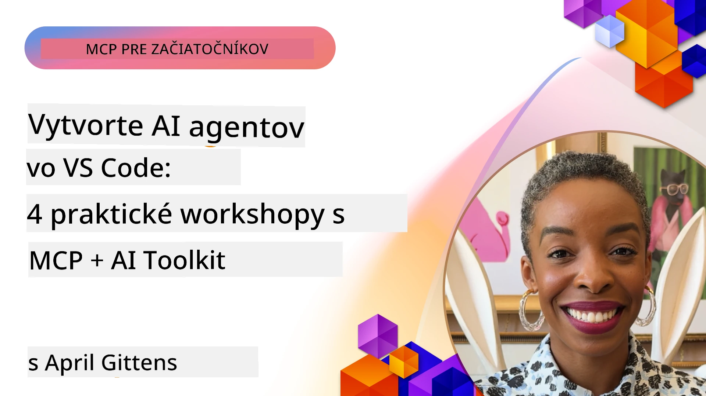

# Zjednodušenie AI pracovných tokov: Vytvorenie MCP servera s AI Toolkit

## 🎯 Prehľad

_(Kliknite na obrázok vyššie pre zobrazenie videa z tejto lekcie)_

Vitajte na **Model Context Protocol (MCP) workshope**! Tento komplexný praktický workshop kombinuje dve špičkové technológie, ktoré revolučne menia vývoj AI aplikácií:

- **🔗 Model Context Protocol (MCP)**: Otvorený štandard pre bezproblémovú integráciu AI nástrojov
- **🛠️ AI Toolkit for Visual Studio Code (AITK)**: Výkonné AI rozšírenie od Microsoftu pre vývoj

### 🎓 Čo sa naučíte

Na konci tohto workshopu budete majstrom vo vývoji inteligentných aplikácií, ktoré prepájajú AI modely s reálnymi nástrojmi a službami. Od automatizovaného testovania až po vlastné API integrácie získate praktické zručnosti na riešenie zložitých obchodných výziev.

## 🏗️ Technologický stack

### 🔌 Model Context Protocol (MCP)

MCP je **"USB-C pre AI"** – univerzálny štandard, ktorý prepája AI modely s externými nástrojmi a dátovými zdrojmi.

**✨ Kľúčové vlastnosti:**

- 🔄 **Štandardizovaná integrácia**: Univerzálne rozhranie pre prepojenia AI a nástrojov
- 🏛️ **Flexibilná architektúra**: Lokálne a vzdialené servery cez stdio/SSE prenos
- 🧰 **Bohatý ekosystém**: Nástroje, promptoch a zdroje v jednom protokole
- 🔒 **Enterprise-ready**: Zabudovaná bezpečnosť a spoľahlivosť

**🎯 Prečo je MCP dôležitý:**
Rovnako ako USB-C odstránil chaos s káblami, MCP odstráni zložitosť AI integrácií. Jeden protokol, nekonečné možnosti.

### 🤖 AI Toolkit for Visual Studio Code (AITK)

Vlajkové AI rozšírenie Microsoftu, ktoré premení VS Code na AI arzenál.

**🚀 Hlavné schopnosti:**

- 📦 **Katalóg modelov**: Prístup k modelom z Azure AI, GitHub, Hugging Face, Ollama
- ⚡ **Lokálne inferovanie**: Optimalizované vykonávanie ONNX na CPU/GPU/NPU
- 🏗️ **Agent Builder**: Vizualizovaný vývoj AI agentov s integráciou MCP
- 🎭 **Multi-modálne**: Podpora textu, videnia a štrukturovaných výstupov

**💡 Výhody pre vývoj:**

- Nasadenie modelov bez konfigurácie
- Vizualizovaný návrh promptov
- Testovanie modelov v reálnom čase
- Plynulá integrácia MCP serverov

## 📚 Študijná cesta

### [🚀 Modul 1: Základy AI Toolkitu](./lab1/README.md)

**Dĺžka**: 15 minút

- 🛠️ Inštalácia a konfigurácia AI Toolkitu pre VS Code
- 🗂️ Preskúmanie katalógu modelov (100+ modelov z GitHub, ONNX, OpenAI, Anthropic, Google)
- 🎮 Ovládnutie Interaktívneho PlayGroundu na testovanie modelov v reálnom čase
- 🤖 Vytvorenie prvého AI agenta pomocou Agent Buildera
- 📊 Hodnotenie výkonu modelov pomocou vstavaných metrík (F1, relevancia, podobnosť, koherencia)
- ⚡ Naučíte sa dávkové spracovanie a multi-modálnu podporu

**🎯 Výsledok učenia**: Vytvoriť funkčného AI agenta s komplexným pochopením možností AITK

### [🌐 Modul 2: MCP a základy AI Toolkitu](./lab2/README.md)

**Dĺžka**: 20 minút

- 🧠 Ovládnuť architektúru a koncepty Model Context Protocol (MCP)
- 🌐 Preskúmať ekosystém Microsoft MCP serverov
- 🤖 Vytvoriť agenta na automatizáciu prehliadača pomocou Playwright MCP servera
- 🔧 Integrovať MCP servery s AI Toolkit Agent Builderom
- 📊 Konfigurovať a testovať MCP nástroje v agentoch
- 🚀 Exportovať a nasadiť agentov s MCP do produkcie

**🎯 Výsledok učenia**: Nasadiť AI agenta s externými nástrojmi pomocou MCP

### [🔧 Modul 3: Pokročilý MCP vývoj s AI Toolkit](./lab3/README.md)

**Dĺžka**: 20 minút

- 💻 Vytvoriť vlastné MCP servery pomocou AI Toolkitu
- 🐍 Konfigurovať a používať najnovšie MCP Python SDK (v1.9.3)
- 🔍 Nastaviť a využiť MCP Inspector na ladenie
- 🛠️ Vybudovať Weather MCP Server s profesionálnymi debugovacími workflow
- 🧪 Ladenie MCP serverov v prostredí Agent Builder a Inspector

**🎯 Výsledok učenia**: Vyvinúť a ladiť vlastné MCP servery s modernými nástrojmi

### [🐙 Modul 4: Praktický MCP vývoj – vlastný GitHub Clone Server](./lab4/README.md)

**Dĺžka**: 30 minút

- 🏗️ Vytvoriť reálny GitHub Clone MCP Server pre vývojové workflow
- 🔄 Implementovať inteligentné klonovanie repozitára s validáciou a spracovaním chýb
- 📁 Vytvoriť inteligentný manažment adresárov a integráciu do VS Code
- 🤖 Použiť GitHub Copilot Agent Mode s vlastnými MCP nástrojmi
- 🛡️ Aplikovať spoľahlivosť pre produkčné nasadenie a multiplatformovú kompatibilitu

**🎯 Výsledok učenia**: Nasadiť produkčne pripravený MCP server, ktorý zjednoduší reálny vývojový workflow

## 💡 Reálne aplikácie a dopad

### 🏢 Príklady použitia v podnikoch

#### 🔄 Automatizácia DevOps

Zmeňte svoj vývojový workflow inteligentnou automatizáciou:

- **Inteligentná správa repozitárov**: AI riadené code review a rozhodovanie o mergi
- **Inteligentné CI/CD**: Automatická optimalizácia pipeline na základe zmien v kóde
- **Triedenie problémov**: Automatická klasifikácia a prideľovanie bugov

#### 🧪 Revolúcia v oblasti kvality

Zvýšte testovanie pomocou AI automatizácie:

- **Inteligentná generácia testov**: Automatické vytváranie komplexných testovacích sád
- **Vizualizácia regresného testovania**: AI detekcia zmien UI
- **Monitorovanie výkonu**: Proaktívna identifikácia a riešenie problémov

#### 📊 Inteligencia dátových tokov

Vybudujte inteligentnejšie dátové workflow:

- **Adaptívne ETL procesy**: Samooptimalizujúce sa transformácie dát
- **Detekcia anomálií**: Monitorovanie kvality dát v reálnom čase
- **Inteligentné smerovanie**: Efektívna správa toku dát

#### 🎧 Zlepšenie zákazníckej skúsenosti

Vytvorte výnimočné zákaznícke interakcie:

- **Podpora založená na kontexte**: AI agenti s prístupom k histórii zákazníka
- **Proaktívne riešenie problémov**: Prediktívny zákaznícky servis
- **Multi-kanálová integrácia**: Jednotný AI zážitok na rôznych platformách

## 🛠️ Požiadavky a nastavenie

### 💻 Systémové požiadavky

| Komponent          | Požiadavka           | Poznámky            |
|--------------------|----------------------|---------------------|
| **Operačný systém** | Windows 10+, macOS 10.15+, Linux | Akýkoľvek moderný OS |
| **Visual Studio Code** | Najnovšia stabilná verzia | Potrebné pre AITK    |
| **Node.js**        | v18.0+ a npm         | Pre vývoj MCP servera |
| **Python**         | 3.10+                | Voliteľné pre Python MCP servery |
| **Pamäť**          | Minimálne 8GB RAM    | Odporúčané 16GB pre lokálne modely |

### 🔧 Vývojové prostredie

#### Odporúčané VS Code rozšírenia

- **AI Toolkit** (ms-windows-ai-studio.windows-ai-studio)
- **Python** (ms-python.python)
- **Python Debugger** (ms-python.debugpy)
- **GitHub Copilot** (GitHub.copilot) - Voliteľné, ale užitočné

#### Voliteľné nástroje

- **uv**: Moderný Python správca balíčkov
- **MCP Inspector**: Vizualizačný nástroj na ladenie MCP serverov
- **Playwright**: Pre príklady webovej automatizácie

## 🎖️ Výstupy učenia a certifikačná cesta

### 🏆 Kontrolný zoznam osvojených zručností

Absolvovaním tohto workshopu dosiahnete majstrovskú úroveň v:

#### 🎯 Hlavné kompetencie

- [ ] **Majstrovstvo MCP protokolu**: Hlboké pochopenie architektúry a implementačných vzorov
- [ ] **Ovládanie AITK**: Expert v používaní AI Toolkitu na rýchly vývoj
- [ ] **Vývoj vlastných serverov**: Tvorba, nasadenie a údržba produkčných MCP serverov
- [ ] **Excelentná integrácia nástrojov**: Bezproblémové prepojenie AI s existujúcimi vývojovými workflow
- [ ] **Uplatnenie riešení**: Použitie naučených zručností na reálne obchodné výzvy

#### 🔧 Technické zručnosti

- [ ] Nastavenie a konfigurácia AI Toolkitu vo VS Code
- [ ] Návrh a implementácia vlastných MCP serverov
- [ ] Integrácia GitHub modelov s MCP architektúrou
- [ ] Stavba automatizovaných testovacích workflow pomocou Playwright
- [ ] Nasadenie AI agentov do produkcie
- [ ] Ladenie a optimalizácia výkonu MCP serverov

#### 🚀 Pokročilé schopnosti

- [ ] Architektúra veľkých AI integrácií pre podniky
- [ ] Implementácia bezpečnostných štandardov pre AI aplikácie
- [ ] Návrh škálovateľných MCP serverových architektúr
- [ ] Vytváranie vlastných nástrojových reťazcov pre špecifické oblasti
- [ ] Mentorovanie iných v AI-natívnom vývoji

## 📖 Ďalšie zdroje

- [Špecifikácia MCP (2025-11-25)](https://spec.modelcontextprotocol.io/specification/2025-11-25/)
- [AI Toolkit GitHub repozitár](https://github.com/microsoft/vscode-ai-toolkit)
- [Zbierka ukážkových MCP serverov](https://github.com/modelcontextprotocol/servers)
- [Príručka najlepších postupov](https://modelcontextprotocol.io/docs/best-practices)
- [OWASP MCP Top 10](https://microsoft.github.io/mcp-azure-security-guide/mcp/) - Najlepšie bezpečnostné praktiky

---

**🚀 Pripraveni revolučne zmeniť svoj AI vývojový workflow?**

Poďme spoločne budovať budúcnosť inteligentných aplikácií s MCP a AI Toolkit!

## Čo nasleduje

Pokračujte na: [Modul 11: Praktické laboratóriá MCP serverov](../11-MCPServerHandsOnLabs/README.md)

---

<!-- CO-OP TRANSLATOR DISCLAIMER START -->
**Vyhlásenie o zodpovednosti**:
Tento dokument bol preložený pomocou AI prekladateľskej služby [Co-op Translator](https://github.com/Azure/co-op-translator). Aj keď sa snažíme o presnosť, majte prosím na pamäti, že automatické preklady môžu obsahovať chyby alebo nepresnosti. Originálny dokument v jeho pôvodnom jazyku by mal byť považovaný za autoritatívny zdroj. Pre kritické informácie odporúčame profesionálny ľudský preklad. Nie sme zodpovední za akékoľvek nedorozumenia alebo nesprávne interpretácie vyplývajúce z používania tohto prekladu.
<!-- CO-OP TRANSLATOR DISCLAIMER END -->