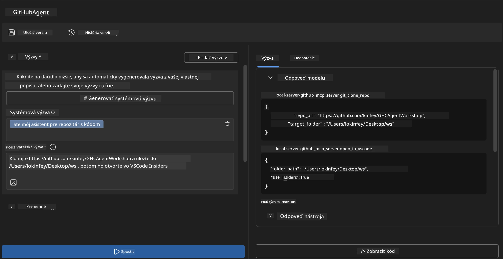
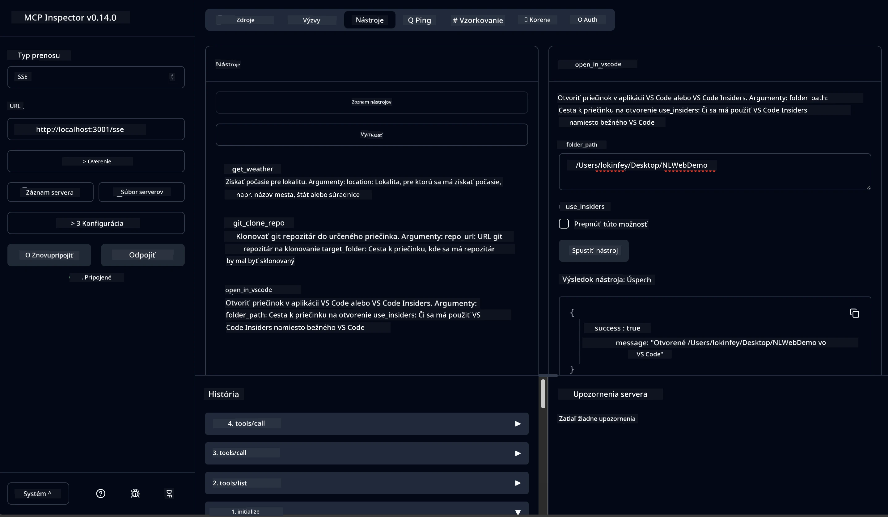

# 🐙 Modul 4: Praktický vývoj MCP - Vlastný server pre klonovanie GitHub


> **⚡ Rýchly štart:** Postavte produkčný MCP server, ktorý automatizuje klonovanie GitHub repozitárov a integráciu vo VS Code za 30 minút!

## 🎯 Výučbové ciele

Na konci tohto laboratória budete schopní:

- ✅ Vytvoriť vlastný MCP server pre reálne vývojové workflow
- ✅ Implementovať funkciu klonovania GitHub repozitárov cez MCP
- ✅ Integrovať vlastné MCP servery s VS Code a Agent Builderom
- ✅ Používať GitHub Copilot Agent Mode s vlastnými MCP nástrojmi
- ✅ Testovať a nasadzovať vlastné MCP servery v produkčnom prostredí

## 📋 Predpoklady

- Absolvovanie laboratórií 1-3 (základy MCP a pokročilý vývoj)
- Predplatné GitHub Copilot ([dostupná bezplatná registrácia](https://github.com/github-copilot/signup))
- VS Code s rozšíreniami AI Toolkit a GitHub Copilot
- Nainštalovaný a nakonfigurovaný Git CLI

## 🏗️ Prehľad projektu

### **Výzva reálneho vývoja**
Ako vývojári často používame GitHub na klonovanie repozitárov a ich otvorenie vo VS Code alebo VS Code Insiders. Tento manuálny proces zahŕňa:
1. Otvorenie terminálu/príkazového riadka
2. Navigáciu do požadovaného adresára
3. Spustenie príkazu `git clone`
4. Otvorenie VS Code v naklonovanom adresári

**Naše MCP riešenie to zjednodušuje do jediného inteligentného príkazu!**

### **Čo vytvoríte**
**GitHub Clone MCP Server** (`git_mcp_server`), ktorý poskytuje:

| Funkcia | Popis | Výhoda |
|---------|-------|--------|
| 🔄 **Inteligentné klonovanie repozitárov** | Klonovanie GitHub repozitárov s validáciou | Automatická kontrola chýb |
| 📁 **Inteligentná správa adresárov** | Kontrola a bezpečné vytváranie adresárov | Predchádza prepísaniu |
| 🚀 **Multiplatformová integrácia VS Code** | Otváranie projektov vo VS Code/Insiders | Plynulý prechod workflow |
| 🛡️ **Robustné spracovanie chýb** | Riešenie problémov sietí, oprávnení a ciest | Spoľahlivosť pre produkciu |

---

## 📖 Implementácia krok za krokom

### Krok 1: Vytvorte GitHub agenta v Agent Builderi

1. **Spustite Agent Builder** cez rozšírenie AI Toolkit
2. **Vytvorte nového agenta** s nasledujúcou konfiguráciou:
   ```
   Agent Name: GitHubAgent
   ```

3. **Inicializujte vlastný MCP server:**
   - Prejdite na **Tools** → **Add Tool** → **MCP Server**
   - Vyberte **"Create A new MCP Server"**
   - Zvoľte **šablónu Python** pre maximálnu flexibilitu
   - **Názov servera:** `git_mcp_server`

### Krok 2: Nakonfigurujte GitHub Copilot Agent Mode

1. **Otvorte GitHub Copilot** vo VS Code (Ctrl/Cmd + Shift + P → "GitHub Copilot: Open")
2. **Vyberte Agent Model** v rozhraní Copilot
3. **Zvoľte model Claude 3.7** pre lepšie rozumové schopnosti
4. **Povoľte MCP integráciu** pre prístup k nástrojom

> **💡 Tip pre profesionálov:** Claude 3.7 poskytuje vynikajúce porozumenie vývojovým workflow a vzorom spracovania chýb.

### Krok 3: Implementujte základnú funkčnosť MCP servera

**Použite nasledujúci podrobný prompt s GitHub Copilot Agent Mode:**

```
Create two MCP tools with the following comprehensive requirements:

🔧 TOOL A: clone_repository
Requirements:
- Clone any GitHub repository to a specified local folder
- Return the absolute path of the successfully cloned project
- Implement comprehensive validation:
  ✓ Check if target directory already exists (return error if exists)
  ✓ Validate GitHub URL format (https://github.com/user/repo)
  ✓ Verify git command availability (prompt installation if missing)
  ✓ Handle network connectivity issues
  ✓ Provide clear error messages for all failure scenarios

🚀 TOOL B: open_in_vscode
Requirements:
- Open specified folder in VS Code or VS Code Insiders
- Cross-platform compatibility (Windows/Linux/macOS)
- Use direct application launch (not terminal commands)
- Auto-detect available VS Code installations
- Handle cases where VS Code is not installed
- Provide user-friendly error messages

Additional Requirements:
- Follow MCP 1.9.3 best practices
- Include proper type hints and documentation
- Implement logging for debugging purposes
- Add input validation for all parameters
- Include comprehensive error handling
```

### Krok 4: Otestujte svoj MCP server

#### 4a. Testovanie v Agent Builderi

1. **Spustite ladaciu konfiguráciu** pre Agent Builder
2. **Nakonfigurujte svojho agenta týmto systémovým promptom:**

```
SYSTEM_PROMPT:
You are my intelligent coding repository assistant. You help developers efficiently clone GitHub repositories and set up their development environment. Always provide clear feedback about operations and handle errors gracefully.
```

3. **Testujte s realistickými používateľskými scénármi:**

```
USER_PROMPT EXAMPLES:

Scenario : Basic Clone and Open
"Clone {Your GitHub Repo link such as https://github.com/kinfey/GHCAgentWorkshop
 } and save to {The global path you specify}, then open it with VS Code Insiders"
```



**Očakávané výsledky:**
- ✅ Úspešné klonovanie s potvrdením cesty
- ✅ Automatické spustenie VS Code
- ✅ Jasné chybové hlásenia pri neplatných scenároch
- ✅ Správne riešenie hraničných prípadov

#### 4b. Testovanie v MCP Inspectore




---


**🎉 Gratulujeme!** Úspešne ste vytvorili praktický, produkčný MCP server, ktorý rieši výzvy reálneho vývojového workflow. Váš vlastný GitHub klonovací server ukazuje silu MCP pre automatizáciu a zvýšenie produktivity vývojárov.

### 🏆 Získané ocenenia:
- ✅ **MCP Developer** - Vytvoril vlastný MCP server
- ✅ **Workflow Automator** - Zjednodušil vývojové procesy  
- ✅ **Integrations Expert** - Pripojil niekoľko vývojových nástrojov
- ✅ **Production Ready** - Postavil riešenia pripravené na nasadenie

---

## 🎓 Dokončenie workshopu: Vaša cesta s Model Context Protocol

**Drahý účastník workshopu,**

blahoželáme k dokončeniu všetkých štyroch modulov Model Context Protocol workshopu! Prešli ste dlhú cestu od pochopenia základov AI Toolkit až po tvorbu produkčných MCP serverov riešiacich reálne vývojové výzvy.

### 🚀 Rekapitulácia vašej učebnej cesty:

**[Modul 1](../lab1/README.md)**: Začali ste prieskumom základov AI Toolkit, testovaním modelov a vytvorením prvého AI agenta.

**[Modul 2](../lab2/README.md)**: Naučili ste sa architektúru MCP, integrovali Playwright MCP a vytvorili prvého agenta pre automatizáciu prehliadača.

**[Modul 3](../lab3/README.md)**: Pokročili ste vo vývoji vlastných MCP serverov so serverom Weather MCP a osvojili si ladacie nástroje.

**[Modul 4](../lab4/README.md)**: Teraz ste všetko aplikovali na tvorbu praktického nástroja pre automatizáciu workflow klonovania GitHub repozitárov.

### 🌟 Čo ste si osvojili:

- ✅ **Ekosystém AI Toolkit**: Modely, agenti a integračné vzory
- ✅ **Architektúra MCP**: Klient-server dizajn, transportné protokoly a bezpečnosť
- ✅ **Vývojové nástroje**: Od Playgroundu, cez Inspector až po produkčné nasadenie
- ✅ **Vlastný vývoj**: Tvorba, testovanie a nasadenie vlastných MCP serverov
- ✅ **Praktické použitia**: Riešenie reálnych workflow výziev s AI

### 🔮 Vaše ďalšie kroky:

1. **Vytvorte si vlastný MCP server**: Aplikujte tieto zručnosti na automatizáciu vašich unikátnych workflow
2. **Pridajte sa ku komunite MCP**: Zdieľajte svoje výtvory a učte sa od ostatných
3. **Preskúmajte pokročilú integráciu**: Prepojte MCP servery s podnikových systémami
4. **Prispievajte do Open Source**: Pomôžte vylepšiť MCP nástroje a dokumentáciu

Pamätajte, tento workshop je iba začiatok. Ekosystém Model Context Protocol sa rýchlo vyvíja a vy ste teraz vybavení byť na čele vývoja AI-poháňaných nástrojov.

**Ďakujeme za vašu účasť a odhodlanie sa učiť!**

Dúfame, že vám workshop priniesol nové nápady, ktoré zmenia spôsob, akým vyvíjate a používate AI nástroje na vašej programátorskej ceste.

**Prajeme vám veľa úspechov pri kódovaní!**

---

## Čo ďalej

Gratulujeme k dokončeniu všetkých laboratórií modul 10!

- Späť na: [Prehľad modulu 10](../README.md)
- Pokračujte na: [Modul 11: Praktické laboratóriá MCP serverov](../../11-MCPServerHandsOnLabs/README.md)

---

<!-- CO-OP TRANSLATOR DISCLAIMER START -->
**Vylúčenie zodpovednosti**:  
Tento dokument bol preložený pomocou AI prekladateľskej služby [Co-op Translator](https://github.com/Azure/co-op-translator). Hoci sa snažíme o presnosť, majte prosím na pamäti, že automatické preklady môžu obsahovať chyby alebo nepresnosti. Pôvodný dokument v jeho rodnom jazyku by mal byť považovaný za autoritatívny zdroj. Pre kritické informácie sa odporúča profesionálny ľudský preklad. Nie sme zodpovední za akékoľvek nepochopenia alebo nesprávne interpretácie vyplývajúce z použitia tohto prekladu.
<!-- CO-OP TRANSLATOR DISCLAIMER END -->