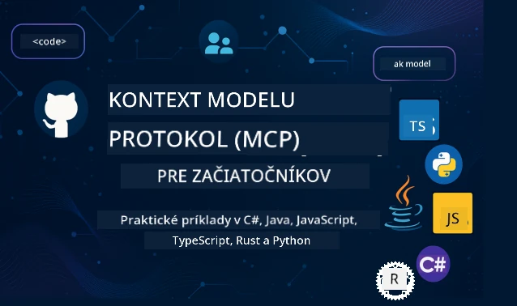

 

[](https://GitHub.com/microsoft/mcp-for-beginners/graphs/contributors)
[](https://GitHub.com/microsoft/mcp-for-beginners/issues)
[](https://GitHub.com/microsoft/mcp-for-beginners/pulls)
[](http://makeapullrequest.com)

[](https://GitHub.com/microsoft/mcp-for-beginners/watchers)
[](https://GitHub.com/microsoft/mcp-for-beginners/fork)
[](https://GitHub.com/microsoft/mcp-for-beginners/stargazers)


[](https://discord.gg/nTYy5BXMWG)

Nasledujte tieto kroky, aby ste mohli začať využívať tieto zdroje:
1. **Vytvorte Fork repozitára**: Kliknite [](https://GitHub.com/microsoft/mcp-for-beginners/fork)
2. **Klonujte repozitár**:   `git clone https://github.com/microsoft/mcp-for-beginners.git`
3. **Pridajte sa k** [](https://discord.gg/nTYy5BXMWG)


### 🌐 Podpora viacerých jazykov

#### Podporované cez GitHub Action (automatické a vždy aktuálne)

<!-- CO-OP TRANSLATOR LANGUAGES TABLE START -->
[Arabčina](../ar/README.md) | [Bengálčina](../bn/README.md) | [Bulharčina](../bg/README.md) | [Barmčina (Mjanmarsko)](../my/README.md) | [Čínština (zjednodušená)](../zh-CN/README.md) | [Čínština (tradičná, Hong Kong)](../zh-HK/README.md) | [Čínština (tradičná, Macau)](../zh-MO/README.md) | [Čínština (tradičná, Taiwan)](../zh-TW/README.md) | [Chorvátčina](../hr/README.md) | [Čeština](../cs/README.md) | [Dánčina](../da/README.md) | [Holandčina](../nl/README.md) | [Estónčina](../et/README.md) | [Fínčina](../fi/README.md) | [Francúzština](../fr/README.md) | [Nemčina](../de/README.md) | [Gréčtina](../el/README.md) | [Hebrejčina](../he/README.md) | [Hindi](../hi/README.md) | [Maďarčina](../hu/README.md) | [Indonézština](../id/README.md) | [Taliančina](../it/README.md) | [Japončina](../ja/README.md) | [Kannadčina](../kn/README.md) | [Kórejčina](../ko/README.md) | [Litovčina](../lt/README.md) | [Malajčina](../ms/README.md) | [Malayalam](../ml/README.md) | [Maráthčina](../mr/README.md) | [Nepálčina](../ne/README.md) | [Nigerijský pidžin](../pcm/README.md) | [Nórčina](../no/README.md) | [Perzština (Farsi)](../fa/README.md) | [Poľština](../pl/README.md) | [Portugalčina (Brazília)](../pt-BR/README.md) | [Portugalčina (Portugalsko)](../pt-PT/README.md) | [Pandžábčina (Gurmukhi)](../pa/README.md) | [Rumunčina](../ro/README.md) | [Ruština](../ru/README.md) | [Srbčina (cyrilika)](../sr/README.md) | [Slovenčina](./README.md) | [Slovinčina](../sl/README.md) | [Španielčina](../es/README.md) | [Svahilčina](../sw/README.md) | [Švédčina](../sv/README.md) | [Tagalog (filipínčina)](../tl/README.md) | [Tamilčina](../ta/README.md) | [Telugčina](../te/README.md) | [Thajčina](../th/README.md) | [Turečtina](../tr/README.md) | [Ukrajinčina](../uk/README.md) | [Urdu](../ur/README.md) | [Vietnamčina](../vi/README.md)

> **Radšej klonovať lokálne?**
>
> Tento repozitár obsahuje viac ako 50 jazykových prekladov, čo výrazne zvyšuje veľkosť na stiahnutie. Ak chcete klonovať bez prekladov, použite sparse checkout:
>
> **Bash / macOS / Linux:**
> ```bash
> git clone --filter=blob:none --sparse https://github.com/microsoft/mcp-for-beginners.git
> cd mcp-for-beginners
> git sparse-checkout set --no-cone '/*' '!translations' '!translated_images'
> ```
>
> **CMD (Windows):**
> ```cmd
> git clone --filter=blob:none --sparse https://github.com/microsoft/mcp-for-beginners.git
> cd mcp-for-beginners
> git sparse-checkout set --no-cone "/*" "!translations" "!translated_images"
> ```
>
> Toto vám poskytne všetko, čo potrebujete na dokončenie kurzu s oveľa rýchlejším sťahovaním.
<!-- CO-OP TRANSLATOR LANGUAGES TABLE END -->

# 🚀 Kurikulum Model Context Protocol (MCP) pre začiatočníkov

## **Naučte sa MCP s praktickými príkladmi kódu v C#, Java, JavaScript, Rust, Python a TypeScript**

## 🧠 Prehľad kurikula Model Context Protocol
Vitajte na vašej ceste za poznaním Model Context Protocol! Ak ste sa niekedy zaujímali, ako AI aplikácie komunikujú s rôznymi nástrojmi a službami, práve objavíte elegantné riešenie, ktoré mení spôsob, akým vývojári vytvárajú inteligentné systémy.

MCP si môžete predstaviť ako univerzálny prekladač pre AI aplikácie – rovnako ako USB porty umožňujú pripojiť akékoľvek zariadenie k vášmu počítaču, MCP umožňuje AI modelom pripojiť sa ku každému nástroju alebo službe štandardizovaným spôsobom. Či už tvoríte svojho prvého chatbota alebo pracujete na zložitých AI pracovných tokoch, pochopenie MCP vám dá silu vytvárať schopnejšie a flexibilnejšie aplikácie.

Toto kurikulum je navrhnuté s trpezlivosťou a starostlivosťou o vašu učebnú cestu. Začneme so základnými konceptmi, ktoré už poznáte, a postupne budeme budovať vašu odbornosť cez praktické cvičenia v obľúbenom programovacom jazyku. Každý krok obsahuje jasné vysvetlenia, praktické príklady a dostatok povzbudenia.

Keď dokončíte túto cestu, budete mať istotu vytvárať vlastné MCP servery, integrovať ich s populárnymi AI platformami a pochopíte, ako táto technológia formuje budúcnosť vývoja AI. Poďme začať túto vzrušujúcu dobrodružnú cestu spolu!

### Oficiálna dokumentácia a špecifikácie

Toto kurikulum je v súlade s **MCP špecifikáciou 2025-11-25** (najnovšie stabilné vydanie). Špecifikácia MCP používa číslovanie verzií podľa dátumu (formát RRRR-MM-DD) pre jasnú identifikáciu verzie protokolu.

Tieto zdroje budú pre vás cennejšie, ako budete viac rozumieť, ale necíťte tlak, že musíte čítať všetko naraz. Začnite od oblastí, ktoré vás zaujímajú najviac!
- 📘 [MCP dokumentácia](https://modelcontextprotocol.io/) – Toto je váš základný zdroj so sprievodcami krok za krokom a používateľskými príručkami. Dokumentácia je písaná s ohľadom na začiatočníkov a poskytuje jasné príklady, ktoré môžete sledovať vlastným tempom.
- 📜 [MCP špecifikácia](https://modelcontextprotocol.io/specification/2025-11-25) – Premýšľajte o tom ako o vašom komplexnom referenčnom manuáli. Počas práce s kurikulom sa sem budete často vracať, aby ste si vyhľadali konkrétne detaily a preskúmali pokročilé funkcie.
- 📜 [Versioning MCP špecifikácie](https://modelcontextprotocol.io/specification/versioning) – Obsahuje informácie o histórii verzií protokolu a o tom, ako MCP používa číslovanie verzií podľa dátumu (formát RRRR-MM-DD).
- 🧑‍💻 [MCP GitHub repozitár](https://github.com/modelcontextprotocol) – Tu nájdete SDK, nástroje a ukážky kódu v rôznych programovacích jazykoch. Je to akoby pokladnica praktických príkladov a pripravených komponentov.
- 🌐 [MCP komunita](https://github.com/orgs/modelcontextprotocol/discussions) – Pridajte sa k ďalším študentom a skúseným vývojárom v diskusiách o MCP. Je to podporujúca komunita, kde sú otázky vítané a poznatky sú voľne zdieľané.
  
## Ciele učenia

Po skončení tohto kurikula sa budete cítiť sebavedomo a nadšene zo svojich nových schopností. Čo dosiahnete:

• **Pochopenie základov MCP**: Pochopíte, čo je Model Context Protocol a prečo mení spôsob spolupráce AI aplikácií, pomocou analógií a príkladov, ktoré dávajú zmysel.

• **Vytvorenie prvého MCP servera**: Vytvoríte funkčný MCP server vo vašom preferovanom jazyku, začínajúc od jednoduchých príkladov a postupne sa zlepšujúc.

• **Prepojenie AI modelov s reálnymi nástrojmi**: Naučíte sa, ako premostiť priepasť medzi AI modelmi a skutočnými službami, čím dáte vašim aplikáciám nové silné schopnosti.

• **Implementácia bezpečnostných najlepších praktík**: Porozumiete, ako udržať vaše MCP implementácie bezpečné a chránené, aby ste ochránili aplikácie aj používateľov.

• **Nasadenie s istotou**: Budete vedieť, ako preniesť svoje MCP projekty z vývoja do produkcie pomocou praktických stratégií nasadenia, ktoré fungujú v reálnom svete.

• **Pripojenie k MCP komunite**: Stanete sa súčasťou rastúcej komunity vývojárov, ktorí formujú budúcnosť vývoja AI aplikácií.

## Podstatné pozadie

Predtým než sa pustíme do detailov MCP, uistime sa, že sa dobre cítite s niektorými základnými pojmami. Nebojte sa, ak v týchto oblastiach nie ste expert – všetko potrebné vysvetlíme krok za krokom!

### Pochopenie protokolov (základ)

Predstavte si protokol ako pravidlá pre konverzáciu. Keď voláte priateľovi, obaja viete, že povedáte „ahoj“ pri zdvihnutí, striedate sa v rozprávaní a na konci poviete „dovidenia“. Počítačové programy potrebujú podobné pravidlá, aby efektívne komunikovali.

MCP je protokol – súbor dohodnutých pravidiel, ktoré pomáhajú AI modelom a aplikáciám viesť produktívne „rozhovory“ s nástrojmi a službami. Rovnako ako pravidlá rozhovoru zlepšujú ľudskú komunikáciu, MCP robí komunikáciu AI aplikácií spoľahlivejšou a výkonnejšou.

### Vzťahy klient-server (ako programy spolupracujú)

Dennodenne používate vzťahy klient-server! Keď používate webový prehliadač (klient) na návštevu webovej stránky, pripájate sa k webovému serveru, ktorý vám pošle obsah stránky. Prehliadač vie, ako požadovať informácie, a server vie, ako odpovedať.

V MCP máme podobný vzťah: AI modely fungujú ako klienti, ktorí vyžadujú informácie alebo akcie, a MCP servery poskytujú tieto možnosti. Je to ako mať pomocníka (server), ktorého sa AI môže opýtať na vykonanie konkrétnych úloh.

### Prečo je štandardizácia dôležitá (aby veci fungovali spolu)

Predstavte si, že by každý výrobca áut používal iný tvar čerpadla – potrebovali by ste pre každé auto iný adaptér! Štandardizácia znamená dohodu na spoločných prístupoch, aby veci fungovali plynulo spolu.

MCP poskytuje túto štandardizáciu pre AI aplikácie. Namiesto toho, aby každý AI model potreboval vlastný kód pre každý nástroj, MCP vytvára univerzálny spôsob, ako spolu komunikovať. Vývojári tak môžu vytvoriť nástroje raz a fungujú s mnohými rôznymi AI systémami.

## 🧭 Prehľad vašej učebnej cesty

Vaša cesta MCP je starostlivo štruktúrovaná, aby postupne budovala vaše sebavedomie a zručnosti. Každá fáza predstavuje nové koncepty a zároveň upevňuje, čo ste už pochopili.

### 🌱 Základná fáza: Pochopenie základov (Moduly 0-2)

Tu začína vaše dobrodružstvo! Predstavíme vám koncepty MCP pomocou známych analógií a jednoduchých príkladov. Pochopíte, čo MCP je, prečo existuje a ako zapadá do širšieho sveta vývoja AI.

• **Modul 0 – Úvod do MCP**: Začneme skúmaním, čo MCP je a prečo je taký dôležitý pre moderné AI aplikácie. Uvidíte príklady MCP v praxi a pochopíte, ako rieši bežné problémy vývojárov.

• **Modul 1 – Vysvetlenie základných konceptov**: Tu sa naučíte hlavné stavebné prvky MCP. Použijeme množstvo analógií a vizuálnych príkladov, aby tieto koncepty vyzneli prirodzene a zrozumiteľne.

• **Modul 2 – Bezpečnosť v MCP**: Bezpečnosť môže znieť zložito, ale ukážeme vám, ako MCP zahrňuje vstavané bezpečnostné funkcie a učíme vás osvedčené postupy, ktoré chránia vaše aplikácie od začiatku.

### 🔨 Fáza výstavby: Vytváranie vašich prvých implementácií (Modul 3)

Teraz začína pravá zábava! Dostanete praktické skúsenosti s tvorbou skutočných MCP serverov a klientov. Nebojte sa – začneme jednoducho a prevedieme vás každým krokom.
Tento modul obsahuje viacero praktických návodov, ktoré vám umožnia trénovať vo vašom preferovanom programovacom jazyku. Vytvoríte svoj prvý server, zostavíte klienta na pripojenie k nemu a dokonca sa naučíte integráciu s populárnymi vývojárskymi nástrojmi ako VS Code.

Každý návod obsahuje kompletné príklady kódu, tipy na riešenie problémov a vysvetlenia, prečo robíme konkrétne dizajnové voľby. Na konci tejto fázy budete mať funkčné implementácie MCP, na ktoré môžete byť hrdí!

### 🚀 Fáza rastu: Pokročilé koncepty a aplikácie v reálnom svete (Moduly 4-5)

Po zvládnutí základov ste pripravení preskúmať sofistikovanejšie funkcie MCP. Pokryjeme praktické stratégie implementácie, techniky ladenia a pokročilé témy ako integráciu multimodálnej AI.

Naučíte sa tiež, ako škálovať vaše MCP implementácie pre produkčné použitie a integrovať ich s cloudovými platformami ako Azure. Tieto moduly vás pripravia na vytváranie MCP riešení, ktoré zvládnu požiadavky reálneho sveta.

### 🌟 Fáza majstrovstva: Komunita a špecializácia (Moduly 6-11)

Záverečná fáza je zameraná na vstup do MCP komunity a špecializáciu v oblastiach, ktoré vás najviac zaujímajú. Naučíte sa prispievať do open-source MCP projektov, implementovať pokročilé autentifikačné vzory a vytvárať komplexné riešenia integrované s databázami.

Modul 11 si zaslúži osobitnú zmienku – je to kompletná 13-laboratórna praktická cesta učenia, ktorá vás naučí vytvoriť produkčne pripravené MCP servery s integráciou PostgreSQL. Je to ako záverečný projekt, ktorý spája všetko, čo ste sa naučili!

### 📚 Kompletná štruktúra kurikula

| Modul | Téma | Popis | Odkaz |
|--------|-------|-------------|------|
| **Modul 0-3: Základy** | | | |
| 00 | Úvod do MCP | Prehľad Model Context Protocol a jeho význam v AI pipeline | [Čítať viac](./00-Introduction/README.md) |
| 01 | Vysvetlenie základných konceptov | Hlboký prieskum základných konceptov MCP | [Čítať viac](./01-CoreConcepts/README.md) |
| 02 | Bezpečnosť v MCP | Bezpečnostné hrozby a najlepšie praktiky | [Čítať viac](./02-Security/README.md) |
| 03 | Začína sa s MCP | Nastavenie prostredia, základné servery/klienti, integrácia | [Čítať viac](./03-GettingStarted/README.md) |
| **Modul 3: Budovanie prvého servera a klienta** | | | |
| 3.1 | Prvý server | Vytvorenie prvého MCP servera | [Návod](./03-GettingStarted/01-first-server/README.md) |
| 3.2 | Prvý klient | Vývoj základného MCP klienta | [Návod](./03-GettingStarted/02-client/README.md) |
| 3.3 | Klient s LLM | Integrácia veľkých jazykových modelov | [Návod](./03-GettingStarted/03-llm-client/README.md) |
| 3.4 | Integrácia VS Code | Spotrebovanie MCP serverov vo VS Code | [Návod](./03-GettingStarted/04-vscode/README.md) |
| 3.5 | stdio server | Vytvorenie serverov pomocou stdio transportu | [Návod](./03-GettingStarted/05-stdio-server/README.md) |
| 3.6 | HTTP streaming | Implementácia HTTP streamingu v MCP | [Návod](./03-GettingStarted/06-http-streaming/README.md) |
| 3.7 | AI toolkit | Použitie AI toolkitu s MCP | [Návod](./03-GettingStarted/07-aitk/README.md) |
| 3.8 | Testovanie | Testovanie implementácie MCP servera | [Návod](./03-GettingStarted/08-testing/README.md) |
| 3.9 | Nasadenie | Nasadenie MCP serverov do produkcie | [Návod](./03-GettingStarted/09-deployment/README.md) |
| 3.10 | Pokročilé použitie servera | Využitie pokročilých serverov pre pokročilé funkcie a lepšiu architektúru | [Návod](./03-GettingStarted/10-advanced/README.md) |
| 3.11 | Jednoduchá autentifikácia | Kapitola ukazujúca autentifikáciu od začiatku a RBAC | [Návod](./03-GettingStarted/11-simple-auth/README.md) |
| 3.12 | MCP hostitelia | Konfigurácia Claude Desktop, Cursor, Cline a ďalších MCP hostiteľov | [Návod](./03-GettingStarted/12-mcp-hosts/README.md) |
| 3.13 | MCP Inspector | Ladiaci a testovací nástroj pre MCP servery | [Návod](./03-GettingStarted/13-mcp-inspector/README.md) |
| **Modul 4-5: Praktické & Pokročilé** | | | |
| 04 | Praktická implementácia | SDK, ladenie, testovanie, opakovane použiteľné šablóny promptov | [Čítať viac](./04-PracticalImplementation/README.md) |
| 4.1 | Stránkovanie | Spravovanie veľkých množín výsledkov pomocou stránkovania s kurzorom | [Návod](./04-PracticalImplementation/pagination/README.md) |
| 05 | Pokročilé témy v MCP | Multimodálna AI, škálovanie, podnikové použitie | [Čítať viac](./05-AdvancedTopics/README.md) |
| 5.1 | Integrácia Azure | MCP integrácia s Azure | [Návod](./05-AdvancedTopics/mcp-integration/README.md) |
| 5.2 | Multimodalita | Práca s viacerými modalitami | [Návod](./05-AdvancedTopics/mcp-multi-modality/README.md) |
| 5.3 | OAuth2 demo | Implementácia OAuth2 autentifikácie | [Návod](./05-AdvancedTopics/mcp-oauth2-demo/README.md) |
| 5.4 | Root kontexty | Pochopenie a implementácia root kontextov | [Návod](./05-AdvancedTopics/mcp-root-contexts/README.md) |
| 5.5 | Routing | Stratégiá routovania MCP | [Návod](./05-AdvancedTopics/mcp-routing/README.md) |
| 5.6 | Sampling | Techniky sampling-u v MCP | [Návod](./05-AdvancedTopics/mcp-sampling/README.md) |
| 5.7 | Škálovanie | Škálovanie MCP implementácií | [Návod](./05-AdvancedTopics/mcp-scaling/README.md) |
| 5.8 | Bezpečnosť | Pokročilé bezpečnostné úvahy | [Návod](./05-AdvancedTopics/mcp-security/README.md) |
| 5.9 | Webové vyhľadávanie | Implementácia schopností webového vyhľadávania | [Návod](./05-AdvancedTopics/web-search-mcp/README.md) |
| 5.10 | Realtime streaming | Vytváranie funkčnosti realtime streamingu | [Návod](./05-AdvancedTopics/mcp-realtimestreaming/README.md) |
| 5.11 | Realtime vyhľadávanie | Implementácia realtime vyhľadávania | [Návod](./05-AdvancedTopics/mcp-realtimesearch/README.md) |
| 5.12 | Entra ID autentifikácia | Autentifikácia s Microsoft Entra ID | [Návod](./05-AdvancedTopics/mcp-security-entra/README.md) |
| 5.13 | Integrácia Foundry | Integrácia s Azure AI Foundry | [Návod](./05-AdvancedTopics/mcp-foundry-agent-integration/README.md) |
| 5.14 | Kontextové inžinierstvo | Techniky efektívneho kontextového inžinierstva | [Návod](./05-AdvancedTopics/mcp-contextengineering/README.md) |
| 5.15 | Vlastné transporty MCP | Implementácie vlastných transportov | [Návod](./05-AdvancedTopics/mcp-transport/README.md) |
| 5.16 | Funkcie protokolu | Notifikácie o postupe, zrušenie, šablóny zdrojov | [Návod](./05-AdvancedTopics/mcp-protocol-features/README.md) |
| **Moduly 6-10: Komunita & Najlepšie praktiky** | | | |
| 06 | Príspevky komunity | Ako prispieť do ekosystému MCP | [Návod](./06-CommunityContributions/README.md) |
| 07 | Poznatky z ranšieho používania | Príbehy o implementácii v reálnom svete | [Návod](./07-LessonsfromEarlyAdoption/README.md) |
| 08 | Najlepšie praktiky pre MCP | Výkon, odolnosť, stabilita | [Návod](./08-BestPractices/README.md) |
| 09 | Prípadové štúdie MCP | Praktické príklady implementácie | [Návod](./09-CaseStudy/README.md) |
| 10 | Praktický workshop | Budovanie MCP servera s AI toolkitom | [Laboratórium](./10-StreamliningAIWorkflowsBuildingAnMCPServerWithAIToolkit/README.md) |
| **Modul 11: MCP Server praktické laboratóriá** | | | |
| 11 | Integrácia MCP servera s databázou | Komplexná 13-lab praktická cesta učenia pre integráciu s PostgreSQL | [Laboratóriá](./11-MCPServerHandsOnLabs/README.md) |
| 11.1 | Úvod | Prehľad MCP s databázovou integráciou a prípad použitia s retail analytikou | [Lab 00](./11-MCPServerHandsOnLabs/00-Introduction/README.md) |
| 11.2 | Základná architektúra | Pochopenie architektúry MCP servera, databázové vrstvy, bezpečnostné vzory | [Lab 01](./11-MCPServerHandsOnLabs/01-Architecture/README.md) |
| 11.3 | Bezpečnosť a multi-tenancy | Row Level Security, autentifikácia a prístup k viacerým nájomcom | [Lab 02](./11-MCPServerHandsOnLabs/02-Security/README.md) |
| 11.4 | Nastavenie prostredia | Nastavenie vývojového prostredia, Docker, Azure zdroje | [Lab 03](./11-MCPServerHandsOnLabs/03-Setup/README.md) |
| 11.5 | Návrh databázy | Nastavenie PostgreSQL, návrh retail schémy a vzorových dát | [Lab 04](./11-MCPServerHandsOnLabs/04-Database/README.md) |
| 11.6 | Implementácia MCP servera | Vytváranie FastMCP servera s databázovou integráciou | [Lab 05](./11-MCPServerHandsOnLabs/05-MCP-Server/README.md) |
| 11.7 | Vývoj nástrojov | Vytváranie nástrojov na databázové dotazy a introspekciu schémy | [Lab 06](./11-MCPServerHandsOnLabs/06-Tools/README.md) |
| 11.8 | Sémantické vyhľadávanie | Implementácia vektorových embeddingov s Azure OpenAI a pgvector | [Lab 07](./11-MCPServerHandsOnLabs/07-Semantic-Search/README.md) |
| 11.9 | Testovanie a ladenie | Testovacie stratégie, ladiace nástroje a validačné prístupy | [Lab 08](./11-MCPServerHandsOnLabs/08-Testing/README.md) |
| 11.10 | Integrácia VS Code | Konfigurácia MCP integrácie vo VS Code a použitie AI chatu | [Lab 09](./11-MCPServerHandsOnLabs/09-VS-Code/README.md) |
| 11.11 | Stratégie nasadenia | Nasadenie cez Docker, Azure Container Apps a škálovacie úvahy | [Lab 10](./11-MCPServerHandsOnLabs/10-Deployment/README.md) |
| 11.12 | Monitorovanie | Application Insights, logovanie a monitorovanie výkonu | [Lab 11](./11-MCPServerHandsOnLabs/11-Monitoring/README.md) |
| 11.13 | Najlepšie praktiky | Optimalizácia výkonu, zabezpečenie a tipy pre produkciu | [Lab 12](./11-MCPServerHandsOnLabs/12-Best-Practices/README.md) |

### 💻 Ukážkové projekty s kódom

Jednou z najzaujímavejších častí učenia MCP je sledovanie, ako sa vaše schopnosti v kódovaní postupne rozvíjajú. Navrhli sme naše príklady kódu tak, aby začínali jednoducho a s rastúcim pochopením sa stávali komplexnejšími. Takto predstavujeme koncepty – s kódom, ktorý je ľahko pochopiteľný, ale demonštruje skutočné princípy MCP, pochopíte nielen to, čo tento kód robí, ale aj prečo je štruktúrovaný takto a ako zapadá do väčších MCP aplikácií.

#### Základné príklady MCP kalkulačky

| Jazyk | Popis | Odkaz |
|----------|-------------|------|
| C# | Príklad MCP servera | [Zobraziť kód](./03-GettingStarted/samples/csharp/README.md) |
| Java | MCP kalkulačka | [Zobraziť kód](./03-GettingStarted/samples/java/calculator/README.md) |
| JavaScript | MCP demo | [Zobraziť kód](./03-GettingStarted/samples/javascript/README.md) |
| Python | MCP server | [Zobraziť kód](../../03-GettingStarted/samples/python/mcp_calculator_server.py) |
| TypeScript | MCP príklad | [Zobraziť kód](./03-GettingStarted/samples/typescript/README.md) |
| Rust | MCP príklad | [Zobraziť kód](./03-GettingStarted/samples/rust/README.md) |

#### Pokročilé MCP implementácie

| Jazyk | Popis | Odkaz |
|----------|-------------|------|
| C# | Pokročilý príklad | [Zobraziť kód](./04-PracticalImplementation/samples/csharp/README.md) |
| Java so Spring | Príklad Container App | [Zobraziť kód](./04-PracticalImplementation/samples/java/containerapp/README.md) |
| JavaScript | Pokročilý príklad | [Zobraziť kód](./04-PracticalImplementation/samples/javascript/README.md) |
| Python | Komplexná implementácia | [Zobraziť kód](./04-PracticalImplementation/samples/python/README.md) |
| TypeScript | Príklad Container | [Zobraziť kód](./04-PracticalImplementation/samples/typescript/README.md) |


## 🎯 Predpoklady pre učenie MCP

Aby ste z tohto kurikula získali maximum, mali by ste mať:

- Základné znalosti programovania aspoň v jednom z nasledujúcich jazykov: C#, Java, JavaScript, Python alebo TypeScript
- Pochopenie modelu klient-server a API
- Znalosť konceptov REST a HTTP
- (Voliteľné) Pozadie v AI/ML konceptoch

- Zapojenie sa do našich komunitných diskusií pre podporu

## 📚 Študijný sprievodca a zdroje

Tento repozitár obsahuje niekoľko zdrojov, ktoré vám pomôžu efektívne sa orientovať a učiť:

### Študijný sprievodca
Komplexný [Študijný sprievodca](./study_guide.md) je k dispozícii, aby vám pomohol efektívne sa orientovať v tomto repozitári. Tento vizuálny mapový prehľad osnovy ukazuje, ako sú jednotlivé témy prepojené, a poskytuje pokyny, ako efektívne využívať ukážkové projekty. Je to obzvlášť užitočné, ak ste vizuálny typ študenta a radi vidíte celkový obraz.

Sprievodca obsahuje:
- Vizuálny mapový prehľad osnovy zobrazujúci všetky pokryté témy  
- Podrobný rozpis každej časti repozitára  
- Pokyny na použitie ukážkových projektov  
- Odporúčané učebné cesty pre rôzne úrovne zručností  
- Dodatočné zdroje na doplnenie vášho študijného procesu  

### Zmeny v obsahu

Udržiavame podrobný [Záznam zmien](./changelog.md), ktorý sleduje všetky významné aktualizácie učebných materiálov, aby ste mohli mať prehľad o najnovších vylepšeniach a doplnkoch.  
- Pridanie nového obsahu  
- Štrukturálne zmeny  
- Vylepšenia funkcií  
- Aktualizácie dokumentácie  

## 🛠️ Ako efektívne používať túto osnovu

Každá lekcia v tomto sprievodcovi obsahuje:

1. Jasné vysvetlenia konceptov MCP  
2. Živé príklady kódu v rôznych jazykoch  
3. Cvičenia na vytváranie skutočných MCP aplikácií  
4. Ďalšie zdroje pre pokročilých študentov  

### Naučme sa MCP s C# - séria tutoriálov
Poďme sa zoznámiť s Model Context Protocol (MCP), moderným rámcom navrhnutým na štandardizáciu interakcií medzi AI modelmi a klientskymi aplikáciami. Prostredníctvom tejto priateľskej lekcie pre začiatočníkov vás prevedieme MCP a pomôžeme vám vytvoriť váš prvý MCP server.  
#### C#: [https://aka.ms/letslearnmcp-csharp](https://aka.ms/letslearnmcp-csharp)  
#### Java: [https://aka.ms/letslearnmcp-java](https://aka.ms/letslearnmcp-java)  
#### JavaScript: [https://aka.ms/letslearnmcp-javascript](https://aka.ms/letslearnmcp-javascript)  
#### Python: [https://aka.ms/letslearnmcp-python](https://aka.ms/letslearnmcp-python)  

## 🎓 Vaša cesta MCP začína

Gratulujeme! Práve ste urobili prvý krok na vzrušujúcej ceste, ktorá rozšíri vaše programátorské schopnosti a priblíži vás k špičkovému vývoju AI.

### Čo ste už dosiahli

Prečítaním tejto úvodnej časti ste už začali budovať základy svojich znalostí o MCP. Rozumiete, čo je MCP, prečo je dôležité, a ako vám táto osnova pomôže počas vášho študijného postupu. Je to významný úspech a začiatok vašej odbornosti v tejto kľúčovej technológii.

### Dobrodružstvo, ktoré vás čaká

Ako budete postupovať v moduloch, pamätajte, že každý expert bol raz začiatočník. Koncepty, ktoré sa teraz môžu zdať zložité, sa vám prirodzene osvoja cvičením a aplikáciou v praxi. Každý malý krok vás priblíži k silným schopnostiam, ktoré vás budú sprevádzať počas celej vývojovej kariéry.

### Vaša podporná sieť

Pridávate sa ku komunite študentov a odborníkov, ktorí majú vášeň pre MCP a sú ochotní pomáhať ostatným uspieť. Či už vám robí problém nejaká výzva v kódovaní, alebo sa chcete podeliť o svoj pokrok, komunita je tu, aby vás podporila.

Ak sa zaseknete alebo máte otázky ohľadom tvorby AI aplikácií, pripojte sa k diskusiám s ostatnými študentmi a skúsenými vývojármi o MCP. Ide o podpornú komunitu, kde sú otázky vítané a vedomosti sa voľne zdieľajú.

[](https://discord.gg/nTYy5BXMWG)

Ak máte spätnú väzbu na produkt alebo narazíte na chyby počas vývoja, navštívte:

[](https://aka.ms/foundry/forum)

### Ste pripravení začať?

Vaše dobrodružstvo s MCP začína práve teraz! Začnite s Modulom 0 a ponorte sa do prvých praktických skúseností s MCP, alebo preskúmajte ukážkové projekty, aby ste videli, čo budete vytvárať. Pamätajte - každý expert začal presne tam, kde ste vy, a s trpezlivosťou a cvičením budete prekvapení, čo všetko môžete dosiahnuť.

Vitajte vo svete vývoja Model Context Protocol. Poďme spoločne vytvoriť niečo úžasné!

## 🤝 Príspevky do komunity učenia

Táto osnova rastie a zlepšuje sa vďaka príspevkom študentov ako ste vy! Či už opravujete preklep, navrhujete jasnejšie vysvetlenie, alebo pridávate nový príklad, vaše príspevky pomáhajú iným začiatočníkom uspieť.

Ďakujeme Microsoft Valued Professional [Shivam Goyal](https://www.linkedin.com/in/shivam2003/) za príspevok ukážkových kódov.

Proces príspevku je navrhnutý ako vítajúci a podporný. Väčšina príspevkov vyžaduje potvrdenie Dohody o licencii prispievateľa (CLA), no automatizované nástroje vás hladko prevedú celým procesom.

## 📜 Otvorený zdroj učenia

Celá táto osnova je dostupná pod licenciou MIT [LICENSE](../../LICENSE), čo znamená, že ju môžete slobodne používať, upravovať a zdieľať. Podporuje to našu misiu sprístupniť znalosti o MCP vývojárom po celom svete.

## 🤝 Pravidlá prispievania

Tento projekt vítá príspevky a návrhy. Väčšina príspevkov vyžaduje, aby ste súhlasili s
Dohodou o licencii prispievateľa (Contributor License Agreement - CLA), ktorá deklaruje, že máte právo a skutočne nám dávate
práva na použitie vášho príspevku. Pre viac informácií navštívte <https://cla.opensource.microsoft.com>.

Keď odošlete pull request, CLA bot automaticky zistí, či potrebujete
poskytnúť CLA a označí PR príslušne (napr. kontrola stavu, komentár). Jednoducho postupujte podľa pokynov
poskytnutých botom. Toto bude potrebné urobiť iba raz pre všetky repozitáre používajúce našu CLA.

Tento projekt prijal [Microsoft Open Source Code of Conduct](https://opensource.microsoft.com/codeofconduct/).
Pre viac informácií pozrite [Často kladené otázky k Kodexu správania](https://opensource.microsoft.com/codeofconduct/faq/) alebo
kontaktujte [opencode@microsoft.com](mailto:opencode@microsoft.com) s akýmikoľvek ďalšími otázkami alebo komentármi.

---

*Ste pripravení začať svoju cestu MCP? Začnite s [Modulom 00 - Úvod do MCP](./00-Introduction/README.md) a urobte prvé kroky vo svete Model Context Protocol vývoja!*


## 🎒 Ďalšie kurzy
Náš tím pripravuje aj ďalšie kurzy! Pozrite si:

<!-- CO-OP TRANSLATOR OTHER COURSES START -->
### LangChain
[](https://aka.ms/langchain4j-for-beginners)
[](https://aka.ms/langchainjs-for-beginners?WT.mc_id=m365-94501-dwahlin)
[](https://github.com/microsoft/langchain-for-beginners?WT.mc_id=m365-94501-dwahlin)
---

### Azure / Edge / MCP / Agenti
[](https://github.com/microsoft/AZD-for-beginners?WT.mc_id=academic-105485-koreyst)
[](https://github.com/microsoft/edgeai-for-beginners?WT.mc_id=academic-105485-koreyst)
[](https://github.com/microsoft/mcp-for-beginners?WT.mc_id=academic-105485-koreyst)
[](https://github.com/microsoft/ai-agents-for-beginners?WT.mc_id=academic-105485-koreyst)

---
 
### Generatívna AI séria
[](https://github.com/microsoft/generative-ai-for-beginners?WT.mc_id=academic-105485-koreyst)
[-9333EA?style=for-the-badge&labelColor=E5E7EB&color=9333EA)](https://github.com/microsoft/Generative-AI-for-beginners-dotnet?WT.mc_id=academic-105485-koreyst)
[-C084FC?style=for-the-badge&labelColor=E5E7EB&color=C084FC)](https://github.com/microsoft/generative-ai-for-beginners-java?WT.mc_id=academic-105485-koreyst)
[-E879F9?style=for-the-badge&labelColor=E5E7EB&color=E879F9)](https://github.com/microsoft/generative-ai-with-javascript?WT.mc_id=academic-105485-koreyst)

---
 
### Základné učenie
[](https://aka.ms/ml-beginners?WT.mc_id=academic-105485-koreyst)
[](https://aka.ms/datascience-beginners?WT.mc_id=academic-105485-koreyst)
[](https://aka.ms/ai-beginners?WT.mc_id=academic-105485-koreyst)
[](https://github.com/microsoft/Security-101?WT.mc_id=academic-96948-sayoung)
[](https://aka.ms/webdev-beginners?WT.mc_id=academic-105485-koreyst)
[](https://aka.ms/iot-beginners?WT.mc_id=academic-105485-koreyst)
[](https://github.com/microsoft/xr-development-for-beginners?WT.mc_id=academic-105485-koreyst)

---
 
### Séria Copilot
[](https://aka.ms/GitHubCopilotAI?WT.mc_id=academic-105485-koreyst)
[](https://github.com/microsoft/mastering-github-copilot-for-dotnet-csharp-developers?WT.mc_id=academic-105485-koreyst)
[](https://github.com/microsoft/CopilotAdventures?WT.mc_id=academic-105485-koreyst)
<!-- CO-OP TRANSLATOR OTHER COURSES END -->

---

<!-- CO-OP TRANSLATOR DISCLAIMER START -->
**Upozornenie**:  
Tento dokument bol preložený pomocou služby automatického prekladu AI [Co-op Translator](https://github.com/Azure/co-op-translator). Aj keď sa snažíme o presnosť, berte prosím na vedomie, že automatické preklady môžu obsahovať chyby alebo nepresnosti. Originálny dokument v jeho pôvodnom jazyku by sa mal považovať za rozhodujúci zdroj. Pre kritické informácie sa odporúča profesionálny ľudský preklad. Nie sme zodpovední za akékoľvek nedorozumenia alebo nesprávne interpretácie vyplývajúce z použitia tohto prekladu.
<!-- CO-OP TRANSLATOR DISCLAIMER END -->