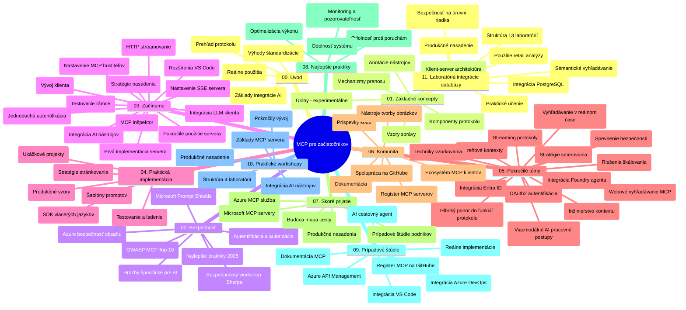

# Model Context Protocol (MCP) pre začiatočníkov - Študijný sprievodca

Tento študijný sprievodca poskytuje prehľad štruktúry úložiska a obsahu kurikula „Model Context Protocol (MCP) pre začiatočníkov“. Použite tento sprievodca na efektívnu orientáciu v úložisku a maximálne využitie dostupných zdrojov.

## Prehľad úložiska

Model Context Protocol (MCP) je štandardizovaný rámec pre interakcie medzi AI modelmi a klientskymi aplikáciami. Pôvodne vytvorený spoločnosťou Anthropic, MCP je teraz udržiavaný širšou komunitou MCP prostredníctvom oficiálnej organizácie GitHub. Toto úložisko poskytuje komplexné kurikulum s praktickými príkladmi kódu v jazykoch C#, Java, JavaScript, Python a TypeScript, určené pre AI vývojárov, systémových architektov a softvérových inžinierov.

## Vizualizácia kurikula

## Štruktúra úložiska

Úložisko je organizované do jedenástich hlavných sekcií, z ktorých každá sa zameriava na iný aspekt MCP:

1. **Úvod (00-Introduction/)**
   - Prehľad Model Context Protocol
   - Prečo je štandardizácia dôležitá v AI pipeline
   - Praktické použitia a výhody

2. **Základné pojmy (01-CoreConcepts/)**
   - Klient-server architektúra
   - Kľúčové komponenty protokolu
   - Komunikačné vzory v MCP

3. **Bezpečnosť (02-Security/)**
   - Hrozby bezpečnosti v systémoch založených na MCP
   - Najlepšie praktiky zabezpečenia implementácií
   - Stratégie autentifikácie a autorizácie
   - **Komplexná bezpečnostná dokumentácia**:
     - MCP Bezpečnostné najlepšie praktiky 2025
     - Príručka implementácie Azure Content Safety
     - MCP bezpečnostné kontroly a techniky
     - Rýchly prehľad MCP najlepších praktík
   - **Kľúčové bezpečnostné témy**:
     - Útoky na inštrukcie (prompt injection) a otravovanie nástrojov
     - Útoky na prevzatie session a problémy s „confused deputy“
     - Zraniteľnosti pri prenose tokenov
     - Nadmerné povolenia a kontrola prístupu
     - Bezpečnosť dodávateľského reťazca pre AI komponenty
     - Integrácia Microsoft Prompt Shields

4. **Začíname (03-GettingStarted/)**
   - Nastavenie prostredia a konfigurácia
   - Vytváranie základných MCP serverov a klientov
   - Integrácia do existujúcich aplikácií
   - Obsahuje sekcie pre:
     - Prvú implementáciu servera
     - Vývoj klienta
     - Integráciu LLM klienta
     - Integráciu do VS Code
     - Server-Sent Events (SSE) server
     - Pokročilé použitie servera
     - HTTP streaming
     - Integráciu AI Toolkit
     - Testovacie stratégie
     - Usmernenia pre nasadenie

5. **Praktická implementácia (04-PracticalImplementation/)**
   - Použitie SDK pre rôzne programovacie jazyky
   - Ladenie, testovanie a overovacie techniky
   - Tvorba znovupoužiteľných šablón inštrukcií a pracovných postupov
   - Ukážkové projekty s príkladmi implementácie

6. **Pokročilé témy (05-AdvancedTopics/)**
   - Techniky kontextového inžinierstva
   - Integrácia Foundry agenta
   - Multimodálne AI pracovné postupy
   - Demo autentifikácie OAuth2
   - Funkcie vyhľadávania v reálnom čase
   - Streaming v reálnom čase
   - Implementácia koreňových kontextov
   - Riešenia smerovania
   - Techniky vzorkovania
   - Prístupy k škálovaniu
   - Bezpečnostné úvahy
   - Integrácia bezpečnosti Entra ID
   - Integrácia webového vyhľadávania

7. **Príspevky komunity (06-CommunityContributions/)**
   - Ako prispievať kódom a dokumentáciou
   - Spolupráca cez GitHub
   - Komunitou riadené vylepšenia a spätná väzba
   - Používanie rôznych MCP klientov (Claude Desktop, Cline, VSCode)
   - Práca s populárnymi MCP servermi vrátane generovania obrázkov

8. **Lekcie z raného prijatia (07-LessonsfromEarlyAdoption/)**
   - Reálne implementácie a úspešné príbehy
   - Budovanie a nasadzovanie riešení založených na MCP
   - Trendy a budúca cesta
   - **Sprievodca Microsoft MCP servermi**: Komplexný prehľad 10 produkčne pripravených Microsoft MCP serverov vrátane:
     - Microsoft Learn Docs MCP Server
     - Azure MCP Server (15+ špecializovaných konektorov)
     - GitHub MCP Server
     - Azure DevOps MCP Server
     - MarkItDown MCP Server
     - SQL Server MCP Server
     - Playwright MCP Server
     - Dev Box MCP Server
     - Azure AI Foundry MCP Server
     - Microsoft 365 Agents Toolkit MCP Server

9. **Najlepšie praktiky (08-BestPractices/)**
   - Ladění výkonu a optimalizácia
   - Návrh MCP systémov odolných voči chybám
   - Testovanie a stratégie odolnosti

10. **Prípadové štúdie (09-CaseStudy/)**
    - **Sedem komplexných prípadových štúdií** demonštrujúcich všestrannosť MCP v rôznych scenároch:
    - **Azure AI Travel Agents**: Multi-agentná orchestrácia s Azure OpenAI a AI Search
    - **Integrácia Azure DevOps**: Automatizácia pracovných procesov s aktualizáciami dát z YouTube
    - **Získavanie dokumentácie v reálnom čase**: Python konzolový klient s HTTP streamingom
    - **Interaktívny generátor študijných plánov**: Chainlit webová aplikácia s konverzačnou AI
    - **Dokumentácia priamo v editore**: Integrácia VS Code s GitHub Copilot pracovnými tokmi
    - **Azure API Management**: Podniková API integrácia s tvorbou MCP servera
    - **GitHub MCP Registry**: Vývoj ekosystému a platforma pre agentnú integráciu
    - Príklady implementácie pokrývajúce podnikové integrácie, produktivitu vývojárov a rozvoj ekosystému

11. **Praktický workshop (10-StreamliningAIWorkflowsBuildingAnMCPServerWithAIToolkit/)**
    - Komplexný praktický workshop kombinujúci MCP s AI Toolkit
    - Vývoj inteligentných aplikácií prepojujúcich AI modely s reálnymi nástrojmi
    - Praktické moduly pokrývajúce základy, vývoj vlastného servera a stratégie produkčného nasadenia
    - **Štruktúra labu**:
      - Lab 1: Základy MCP servera
      - Lab 2: Pokročilý vývoj MCP servera
      - Lab 3: Integrácia AI Toolkit
      - Lab 4: Produkčné nasadenie a škálovanie
    - Vzdelávanie založené na laboratórnych cvičeniach s krok za krokom inštrukciami

12. **Laboratóriá integrácie databázy MCP servera (11-MCPServerHandsOnLabs/)**
    - **Komplexná cesta učenia so 13 laboratóriami** na tvorbu produkčne pripravených MCP serverov s integráciou PostgreSQL
    - **Reálna implementácia retailovej analytiky** s použitím prípadu Zava Retail
    - **Podnikové vzory** vrátane Row Level Security (RLS), semantického vyhľadávania a multi-tenantného prístupu k údajom
    - **Kompletná štruktúra laboratórií**:
      - **Lab 00-03: Základy** - Úvod, architektúra, bezpečnosť, nastavenie prostredia
      - **Lab 04-06: Tvorba MCP servera** - Návrh databázy, implementácia MCP servera, vývoj nástrojov
      - **Lab 07-09: Pokročilé funkcie** - Semantické vyhľadávanie, testovanie a ladenie, integrácia VS Code
      - **Lab 10-12: Produkcia a najlepšie praktiky** - Nasadenie, monitorovanie, optimalizácia
    - **Pokryté technológie**: FastMCP framework, PostgreSQL, Azure OpenAI, Azure Container Apps, Application Insights
    - **Výsledky učenia**: Produkčné MCP servery, vzory integrácie databázy, analytika podporovaná AI, podniková bezpečnosť

## Ďalšie zdroje

Úložisko obsahuje podporné zdroje:

- **Priečinok obrázkov**: Obsahuje diagramy a ilustrácie použité v kurikule
- **Preklady**: Podpora viacerých jazykov s automatizovanými prekladmi dokumentácie
- **Oficiálne MCP zdroje**:
  - [MCP Dokumentácia](https://modelcontextprotocol.io/)
  - [MCP Špecifikácia](https://spec.modelcontextprotocol.io/)
  - [MCP GitHub Úložisko](https://github.com/modelcontextprotocol)

## Ako používať toto úložisko

1. **Sekvenčné učenie**: Postupujte kapitolami v poradí (od 00 do 11) pre štruktúrované štúdium.
2. **Zameranie na konkrétny jazyk**: Ak máte záujem o konkrétny programovací jazyk, preskúmajte adresáre príkladov v preferovanom jazyku.
3. **Praktická implementácia**: Začnite sekciou „Začíname“ na nastavenie prostredia a vytvorenie prvého MCP servera a klienta.
4. **Pokročilý prieskum**: Akonáhle zvládnete základy, prejdite na pokročilé témy a rozšírte si vedomosti.
5. **Zapojenie komunity**: Pripojte sa ku komunite MCP cez diskusie na GitHube a kanály Discord na spojenie s expertmi a ďalšími vývojármi.

## MCP klienti a nástroje

Kurikulum pokrýva rôznych MCP klientov a nástrojov:

1. **Oficiálni klienti**:
   - Visual Studio Code
   - MCP vo Visual Studio Code
   - Claude Desktop
   - Claude vo VSCode
   - Claude API

2. **Klienti komunity**:
   - Cline (terminálový)
   - Cursor (kódový editor)
   - ChatMCP
   - Windsurf

3. **Nástroje na správu MCP**:
   - MCP CLI
   - MCP Manager
   - MCP Linker
   - MCP Router

## Populárne MCP servery

Úložisko predstavuje rôzne MCP servery, vrátane:

1. **Oficiálne Microsoft MCP servery**:
   - Microsoft Learn Docs MCP Server
   - Azure MCP Server (15+ špecializovaných konektorov)
   - GitHub MCP Server
   - Azure DevOps MCP Server
   - MarkItDown MCP Server
   - SQL Server MCP Server
   - Playwright MCP Server
   - Dev Box MCP Server
   - Azure AI Foundry MCP Server
   - Microsoft 365 Agents Toolkit MCP Server

2. **Oficiálne referenčné servery**:
   - Filesystem
   - Fetch
   - Memory
   - Sequential Thinking

3. **Generovanie obrázkov**:
   - Azure OpenAI DALL-E 3
   - Stable Diffusion WebUI
   - Replicate

4. **Vývojové nástroje**:
   - Git MCP
   - Terminal Control
   - Code Assistant

5. **Špecializované servery**:
   - Salesforce
   - Microsoft Teams
   - Jira & Confluence

## Príspevky

Toto úložisko víta príspevky od komunity. Pozrite sekciu Príspevky komunity pre návody, ako efektívne prispievať do ekosystému MCP.

----

*Tento študijný sprievodca bol naposledy aktualizovaný 5. februára 2026 a odráža najnovšiu MCP Špecifikáciu zo 25.11.2025 a poskytuje prehľad úložiska k tomuto dátumu. Obsah úložiska môže byť po tomto dátume aktualizovaný.*

---

<!-- CO-OP TRANSLATOR DISCLAIMER START -->
**Vyhlásenie o zodpovednosti**:  
Tento dokument bol preložený pomocou AI prekladateľskej služby [Co-op Translator](https://github.com/Azure/co-op-translator). Aj keď sa snažíme o presnosť, majte prosím na pamäti, že automatizované preklady môžu obsahovať chyby alebo nepresnosti. Originálny dokument v jeho pôvodnom jazyku by mal byť považovaný za autoritatívny zdroj. Pre kritické informácie sa odporúča profesionálny ľudský preklad. Nie sme zodpovední za akékoľvek nedorozumenia alebo nesprávne interpretácie vyplývajúce z použitia tohto prekladu.
<!-- CO-OP TRANSLATOR DISCLAIMER END -->