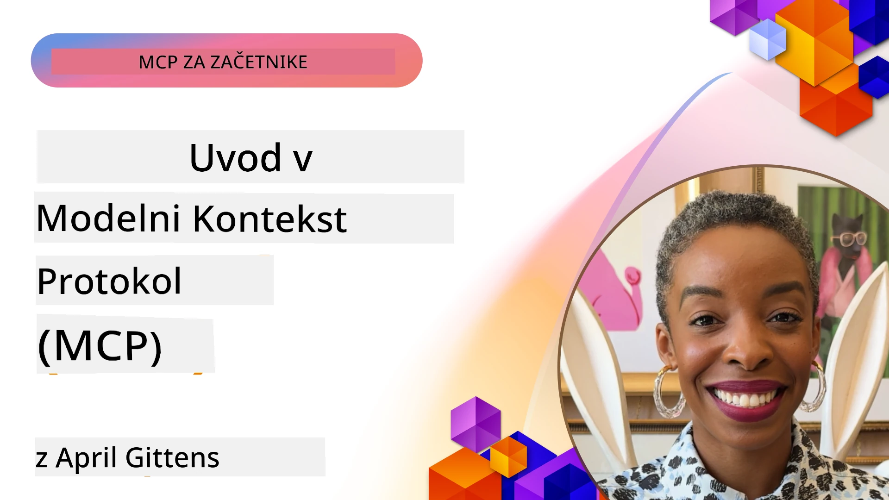
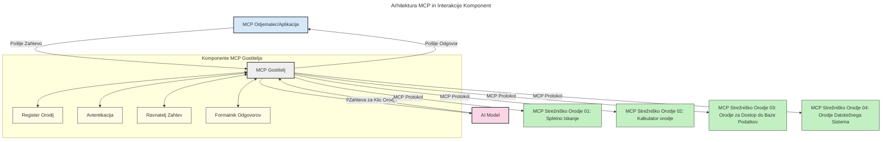

# Uvod v Model Context Protocol (MCP): Zakaj je pomemben za razširljive AI aplikacije

[](https://youtu.be/agBbdiOPLQA)

_(Kliknite na sliko zgoraj za ogled videa te lekcije)_

Aplikacije generativne AI so velik korak naprej, saj pogosto omogočajo uporabniku interakcijo z aplikacijo z uporabo naravnih jezikovnih ukazov. Vendar pa, ko se v te aplikacije vloži več časa in virov, želite zagotoviti, da lahko enostavno integrirate funkcionalnosti in vire na način, ki je enostaven za razširjanje, da vaša aplikacija lahko podpira uporabo več kot enega modela in obravnava različne kompleksnosti modelov. Na kratko, izdelava Gen AI aplikacij je sprva enostavna, vendar pa, ko te rastejo in postajajo bolj zapletene, morate začeti določati arhitekturo in najverjetneje se boste morali zanašati na standard, da zagotovite, da so vaše aplikacije zgrajene dosledno. Tu pride v poštev MCP, ki stvari organizira in zagotavlja standard.

---

## **🔍 Kaj je Model Context Protocol (MCP)?**

**Model Context Protocol (MCP)** je **odprt, standardiziran vmesnik**, ki velikim jezikovnim modelom (LLM) omogoča brezhibno interakcijo z zunanjimi orodji, API-ji in viri podatkov. Zagotavlja dosledno arhitekturo za izboljšanje funkcionalnosti AI modelov onkraj njihovih učnih podatkov, kar omogoča pametnejše, razširljivejše in odzivnejše AI sisteme.

---

## **🎯 Zakaj je standardizacija v AI pomembna**

Ko aplikacije generativne AI postajajo bolj zapletene, je bistveno sprejeti standarde, ki zagotavljajo **razširljivost, razširljivost, vzdržnost** in **izogibanje vezavi na določenega ponudnika**. MCP naslavlja te potrebe z:

- Združevanjem integracij model-orodje
- Zmanjševanjem krhkih, vnaprej prilagojenih rešitev
- Omogočanjem sožitja več modelov različnih ponudnikov znotraj enega ekosistema

**Opomba:** Čeprav se MCP oglašuje kot odprt standard, ni načrtov za standardizacijo MCP preko obstoječih standardnih organov, kot so IEEE, IETF, W3C, ISO ali kateri koli drugi organ za standarde.

---

## **📚 Cilji učenja**

Do konca tega članka boste lahko:

- Definirali **Model Context Protocol (MCP)** in njegove primere uporabe
- Razumeli, kako MCP standardizira komunikacijo med modeli in orodji
- Prepoznali ključne komponente MCP arhitekture
- Raziščete praktične uporabne primere MCP v podjetniških in razvojnih kontekstih

---

## **💡 Zakaj je Model Context Protocol (MCP) prelomnica**

### **🔗 MCP rešuje fragmentacijo v AI interakcijah**

Pred MCP je integracija modelov z orodji zahtevala:

- Prilagojeno kodo za vsak par orodje-model
- Nestandardizirane API-je za vsakega ponudnika
- Pogoste prekinitve zaradi posodobitev
- Slabo razširljivost s povečanjem števila orodij

### **✅ Prednosti standardizacije MCP**

| **Prednost**             | **Opis**                                                                      |
|--------------------------|-------------------------------------------------------------------------------|
| Interoperabilnost        | LLM brezhibno delujejo z orodji različnih ponudnikov                         |
| Konsistentnost           | Enotno vedenje na različnih platformah in orodjih                            |
| Ponovna uporabnost       | Orodja, zgrajena enkrat, se lahko uporabljajo v različnih projektih in sistemih |
| Pospešena razvojna doba  | Zmanjšajte čas razvoja z uporabo standardiziranih, plug-and-play vmesnikov   |

---

## **🧱 Pregled visokonivojske MCP arhitekture**

MCP sledi **modelu klient-strežnik**, kjer:

- **MCP gostitelji** poganjajo AI modele
- **MCP klienti** pošiljajo zahteve
- **MCP strežniki** nudijo kontekst, orodja in zmogljivosti

### **Ključne komponente:**

- **Viri** – Statični ali dinamični podatki za modele  
- **Pozivi** – Vnaprej določeni delovni postopki za vodeno generiranje  
- **Orodja** – Izvršljive funkcije, kot so iskanje, izračuni  
- **Vzorčenje** – Agentno vedenje preko rekurzivnih interakcij
- **Povpraševanje** – Zahteve, ki jih sproži strežnik za uporabniški vnos
- **Korenine** – Meje datotečnega sistema za nadzor dostopa strežnika

### **Arhitektura protokola:**

MCP uporablja dvoslojno arhitekturo:
- **Podatkovna plast**: Komunikacija temelječa na JSON-RPC 2.0 s podporo življenjskega cikla in primitivami
- **Transportna plast**: STDIO (lokalna) in Streamable HTTP s SSE (oddaljena) komunikacijska kanala

---

## Kako delujejo MCP strežniki

MCP strežniki delujejo na naslednji način:

- **Tok zahteve**:
    1. Zahtevo sproži končni uporabnik ali programska oprema, ki deluje v njegovem imenu.
    2. **MCP klient** pošlje zahtevo na **MCP gostitelja**, ki upravlja izvajanje AI modela.
    3. **AI model** prejme uporabniški poziv in lahko preko enega ali več klicev orodij zahteva dostop do zunanjih orodij ali podatkov.
    4. **MCP gostitelj**, ne model neposredno, komunicira z ustreznim **MCP strežnikom(i)** s standardiziranim protokolom.
- **Funkcionalnost MCP gostitelja**:
    - **Register orodij**: Vodi katalog razpoložljivih orodij in njihovih zmogljivosti.
    - **Avtentikacija**: Preverja dovoljenja za dostop do orodij.
    - **Obdelava zahtev**: Obdeluje vstopne zahteve orodij iz modela.
    - **Formatiranje odgovorov**: Strukturira izhode orodij v obliki, ki jo model razume.
- **Izvedba MCP strežnika**:
    - **MCP gostitelj** usmerja klice orodij do enega ali več **MCP strežnikov**, ki razkrivajo specializirane funkcije (npr. iskanje, izračuni, poizvedbe v bazo).
    - **MCP strežniki** izvajajo svoje operacije in vračajo rezultate MCP gostitelju v skladni obliki.
    - **MCP gostitelj** formatira in posreduje rezultate AI modelu.
- **Dokončanje odgovora**:
    - **AI model** vključi izhode orodij v končni odgovor.
    - **MCP gostitelj** pošlje ta odgovor nazaj **MCP klientu**, ki ga posreduje končnemu uporabniku ali klicni programski opremi.
    


## 👨‍💻 Kako zgraditi MCP strežnik (s primeri)

MCP strežniki omogočajo razširitev zmogljivosti LLM z zagotavljanjem podatkov in funkcionalnosti.

Pripravljeni za preizkus? Tukaj so programski razvojni kompleti (SDK) za različne jezike in programe s primeri ustvarjanja enostavnih MCP strežnikov v različnih jezikih/okoljih:

- **Python SDK**: https://github.com/modelcontextprotocol/python-sdk

- **TypeScript SDK**: https://github.com/modelcontextprotocol/typescript-sdk

- **Java SDK**: https://github.com/modelcontextprotocol/java-sdk

- **C#/.NET SDK**: https://github.com/modelcontextprotocol/csharp-sdk


## 🌍 Praktični primeri uporabe MCP

MCP omogoča širok spekter aplikacij z razširitvijo zmogljivosti AI:

| **Uporaba**                 | **Opis**                                                                     |
|-----------------------------|------------------------------------------------------------------------------|
| Integracija podatkov podjetja | Povezava LLM s podatkovnimi bazami, CRM-ji ali notranjimi orodji           |
| Agentni AI sistemi          | Omogočanje avtonomnih agentov z dostopom do orodij in delovnimi procesi odločanja |
| Večmodalne aplikacije       | Združevanje orodij za besedilo, sliko in zvok znotraj enotne AI aplikacije  |
| Integracija podatkov v realnem času | Vključevanje živih podatkov v AI interakcije za natančnejše, aktualne rezultate |


### 🧠 MCP = Univerzalni standard za AI interakcije

Model Context Protocol (MCP) deluje kot univerzalni standard za AI interakcije, podobno kot je USB-C standardiziral fizične povezave naprav. V svetu AI MCP zagotavlja dosleden vmesnik, ki modelom (klientom) omogoča brezhibno integracijo z zunanjimi orodji in ponudniki podatkov (strežniki). S tem odpravlja potrebo po različnih, prilagojenih protokolih za vsako API ali vir podatkov.

V okviru MCP orodje združljivo z MCP (imenovano MCP strežnik) sledi združenemu standardu. Ti strežniki lahko navajajo orodja ali dejanja, ki jih ponujajo, in izvajajo ta dejanja, kadar jih zahteva AI agent. Platforme za AI agente, ki podpirajo MCP, lahko odkrijejo razpoložljiva orodja na strežnikih in jih pokličejo preko tega standardnega protokola.

### 💡 Omogoča dostop do znanja

Poleg ponujanja orodij MCP omogoča tudi dostop do znanja. Omogoča aplikacijam, da velikim jezikovnim modelom (LLM) zagotovijo kontekst s povezavo na različne vire podatkov. Na primer, MCP strežnik lahko predstavlja arhiv dokumentov podjetja, kar agentom omogoča, da kadar koli pridobijo relevantne informacije. Drugi strežnik lahko upravlja posebna dejanja, kot so pošiljanje e-pošte ali posodabljanje zapisov. Z vidika agenta so to preprosto orodja, ki jih lahko uporablja — nekatera orodja vračajo podatke (konkretni kontekst znanja), druga izvajajo dejanja. MCP učinkovito upravlja oboje.

Agent, ki se povezuje z MCP strežnikom, samodejno spozna razpoložljive zmogljivosti strežnika in dostopne podatke preko standardizirane oblike. Ta standardizacija omogoča dinamično razpoložljivost orodij. Na primer, dodajanje novega MCP strežnika v agentov sistem takoj omogoči uporabo njegovih funkcij brez potrebe po nadaljnjih prilagoditvah agentovih navodil.

Ta poenostavljena integracija se ujema s tokom, prikazanim na naslednjem diagramu, kjer strežniki zagotavljajo tako orodja kot znanje, kar zagotavlja nemoteno sodelovanje med sistemi.

### 👉 Primer: razširljiva agentna rešitev

```mermaid
---
title: Razširljiva rešitev agenta z MCP
description: Diagram, ki prikazuje, kako uporabnik komunicira z LLM, ki je povezan z več MCP strežniki, pri čemer vsak strežnik nudi tako znanje kot orodja, kar ustvarja razširljivo arhitekturo AI sistema
---
graph TD
    User -->|Poziv| LLM
    LLM -->|Odgovor| User
    LLM -->|MCP| ServerA
    LLM -->|MCP| ServerB
    ServerA -->|Univerzalni priključek| ServerB
    ServerA --> KnowledgeA
    ServerA --> ToolsA
    ServerB --> KnowledgeB
    ServerB --> ToolsB

    subgraph Server A
        KnowledgeA[Znanje]
        ToolsA[Orodja]
    end

    subgraph Server B
        KnowledgeB[Znanje]
        ToolsB[Orodja]
    end
```Univerzalni konektor omogoča MCP strežnikom medsebojno komunikacijo in deljenje zmogljivosti, kar ServerA omogoča delegiranje nalog ServerB ali dostop do njegovih orodij in znanja. To federira orodja in podatke med strežniki, kar podpira razširljive in modularne agentne arhitekture. Ker MCP standardizira izpostavitev orodij, lahko agenti dinamično odkrivajo in usmerjajo zahteve med strežniki brez trdo kodiranih integracij.

Federacija orodij in znanja: Orodja in podatki so dostopni preko strežnikov, kar omogoča bolj razširljive in modularne agentne arhitekture.

### 🔄 Napredni scenariji MCP z integracijo LLM na strani klienta

Poleg osnovne MCP arhitekture obstajajo napredni scenariji, kjer imajo tako klient kot strežnik LLM-e, kar omogoča bolj sofisticirane interakcije. Na spodnjem diagramu je **klientska aplikacija** lahko IDE z več MCP orodji, ki jih lahko uporablja LLM:

```mermaid
---
title: Napredni MCP scenariji z integracijo LLM klient-strežnik
description: Sekvenčni diagram, ki prikazuje podroben potek interakcije med uporabnikom, odjemalsko aplikacijo, LLM klienta, več MCP strežniki in LLM strežnikom, ilustrira odkrivanje orodij, interakcijo z uporabnikom, neposredno klicanje orodij in faze pogajanj o funkcijah
---
sequenceDiagram
    autonumber
    actor User as 👤 Uporabnik
    participant ClientApp as 🖥️ Odjemalska Aplikacija
    participant ClientLLM as 🧠 Klient LLM
    participant Server1 as 🔧 MCP Strežnik 1
    participant Server2 as 📚 MCP Strežnik 2
    participant ServerLLM as 🤖 Strežniški LLM
    
    %% Discovery Phase
    rect rgb(220, 240, 255)
        Note over ClientApp, Server2: FAZA ODKRIVANJA ORODIJ
        ClientApp->>+Server1: Zahteva razpoložljiva orodja/viri
        Server1-->>-ClientApp: Vrni seznam orodij (JSON)
        ClientApp->>+Server2: Zahteva razpoložljiva orodja/viri
        Server2-->>-ClientApp: Vrni seznam orodij (JSON)
        Note right of ClientApp: Shrani združeni<br/>katalog orodij lokalno
    end
    
    %% User Interaction
    rect rgb(255, 240, 220)
        Note over User, ClientLLM: FAZA INTERAKCIJE Z UPORABNIKOM
        User->>+ClientApp: Vnesi naravni jezikovni poziv
        ClientApp->>+ClientLLM: Posreduj poziv + katalog orodij
        ClientLLM->>-ClientLLM: Analiziraj poziv & izberi orodja
    end
    
    %% Scenario A: Direct Tool Calling
    alt Neposredno klicanje orodij
        rect rgb(220, 255, 220)
            Note over ClientApp, Server1: SCENARIJ A: NEPOSREDNO KLICANJE ORODIJ
            ClientLLM->>+ClientApp: Zahtevaj izvedbo orodja
            ClientApp->>+Server1: Izvedi specifično orodje
            Server1-->>-ClientApp: Vrni rezultate
            ClientApp->>+ClientLLM: Obdelaj rezultate
            ClientLLM-->>-ClientApp: Generiraj odgovor
            ClientApp-->>-User: Prikaži končni odgovor
        end
    
    %% Scenario B: Feature Negotiation (VS Code style)
    else Pogajanje o funkcijah (stil VS Code)
        rect rgb(255, 220, 220)
            Note over ClientApp, ServerLLM: SCENARIJ B: POGAJANJE O FUNKCIJAH
            ClientLLM->>+ClientApp: Identificiraj potrebne zmogljivosti
            ClientApp->>+Server2: Pogajaj se o funkcijah/zmogljivostih
            Server2->>+ServerLLM: Zahtevaj dodatni kontekst
            ServerLLM-->>-Server2: Ponuja kontekst
            Server2-->>-ClientApp: Vrni razpoložljive funkcije
            ClientApp->>+Server2: Klic raziskanih orodij
            Server2-->>-ClientApp: Vrni rezultate
            ClientApp->>+ClientLLM: Obdelaj rezultate
            ClientLLM-->>-ClientApp: Generiraj odgovor
            ClientApp-->>-User: Prikaži končni odgovor
        end
    end
```
## 🔐 Praktične prednosti MCP

Tukaj so praktične prednosti uporabe MCP:

- **Svežina**: modeli lahko dostopajo do posodobljenih informacij onkraj učnih podatkov
- **Razširitev zmogljivosti**: modeli lahko uporabljajo specializirana orodja za naloge, za katere niso bili usposobljeni
- **Zmanjšanje halucinacij**: zunanji viri podatkov zagotavljajo dejansko osnovo
- **Zasebnost**: občutljivi podatki ostanejo znotraj varnih okolij namesto, da bi bili vdelani v pozive

## 📌 Ključni poudarki

Tu so ključni poudarki za uporabo MCP:

- **MCP** standardizira način, kako AI modeli komunicirajo z orodji in podatki
- Spodbuja **razširljivost, doslednost in interoperabilnost**
- MCP pomaga **zmanjšati razvojni čas, izboljšati zanesljivost in razširiti zmogljivosti modelov**
- Arhitektura klient-strežnik **omogoča prilagodljive, razširljive AI aplikacije**

## 🧠 Vaja

Pomislite na AI aplikacijo, ki jo želite ustvariti.

- Katera **zunanja orodja ali podatki** bi lahko izboljšali njene zmogljivosti?
- Kako bi MCP lahko naredil integracijo **enostavnejšo in bolj zanesljivo?**

## Dodatni viri

- [MCP GitHub skladišče](https://github.com/modelcontextprotocol)


## Kaj sledi

Naslednje: [Poglavje 1: Osnovni koncepti](../01-CoreConcepts/README.md)

---

<!-- CO-OP TRANSLATOR DISCLAIMER START -->
**Omejitev odgovornosti**:
Ta dokument je bil preveden z uporabo AI prevajalske storitve [Co-op Translator](https://github.com/Azure/co-op-translator). Čeprav si prizadevamo za natančnost, upoštevajte, da lahko avtomatizirani prevodi vsebujejo napake ali netočnosti. Izvirni dokument v njegovem izvirnem jeziku naj velja za avtoritativni vir. Za ključne informacije priporočamo profesionalni človeški prevod. Za morebitna nesporazume ali napačne interpretacije, ki izhajajo iz uporabe tega prevoda, ne odgovarjamo.
<!-- CO-OP TRANSLATOR DISCLAIMER END -->