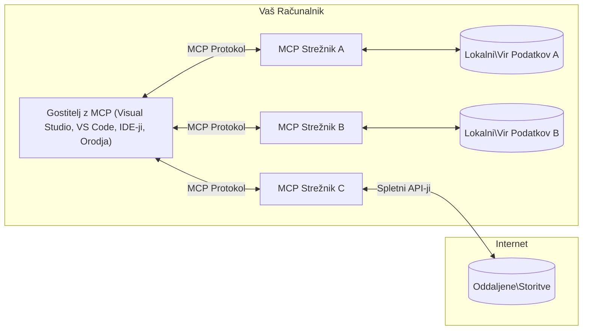

# Osnovni koncepti MCP: Obvladovanje protokola Model Context za integracijo AI

[](https://youtu.be/earDzWGtE84)

_(Kliknite zgornjo sliko za ogled videoposnetka te lekcije)_

[Model Context Protocol (MCP)](https://github.com/modelcontextprotocol) je zmogljiv standardiziran okvir, ki optimizira komunikacijo med velikimi jezikovnimi modeli (LLM) in zunanjimi orodji, aplikacijami ter viri podatkov. 
Ta vodič vas bo popeljal skozi osnovne koncepte MCP. Naučili se boste o njegovi arhitekturi odjemalec-strežnik, ključnih komponentah, mehanizmih komunikacije in najboljših praksah za implementacijo.

- **Izrecno soglasje uporabnika**: Celoten dostop do podatkov in operacije zahtevajo izrecno odobritev uporabnika pred izvedbo. Uporabniki morajo jasno razumeti, do katerih podatkov bo dostop in katere akcije bodo izvedene, s podrobnim nadzorom nad dovoljenji in pooblastili.

- **Zaščita zasebnosti podatkov**: Uporabniški podatki so izpostavljeni le z izrecnim soglasjem in jih je treba zaščititi z robustnimi kontrolami dostopa skozi celoten življenjski cikel interakcije. Implementacije morajo preprečiti nepooblaščen prenos podatkov in vzdrževati stroge meje zasebnosti.

- **Varnost izvajanja orodij**: Vsak klic orodja zahteva izrecno soglasje uporabnika s popolnim razumevanjem funkcionalnosti orodja, parametrov in možnega vpliva. Robustne varnostne meje morajo preprečiti nenamerno, nevarno ali zlonamerno izvajanje orodij.

- **Varnost transportne plasti**: Vse komunikacijske poti bi morale uporabljati primerne mehanizme šifriranja in preverjanja pristnosti. Oddaljene povezave morajo implementirati varne transportne protokole in pravilno upravljanje poverilnic.

#### Smernice za implementacijo:

- **Upravljanje dovoljenj**: Implementirajte sisteme z drobno nastavljenim nadzorom dovoljenj, ki uporabnikom omogočajo nadzor nad tem, kateri strežniki, orodja in viri so dostopni
- **Preverjanje pristnosti in avtorizacija**: Uporabite varne metode preverjanja pristnosti (OAuth, API ključi) s pravilnim upravljanjem žetonov in potekom
- **Preverjanje vhodnih podatkov**: Preverite vse parametre in vhodne podatke glede na določene sheme, da preprečite injekcijske napade
- **Zapisovanje revizijskih dnevnikov**: Vzdržujte obsežne zapise vseh operacij za varnostno spremljanje in skladnost

## Pregled

Ta lekcija raziskuje osnovno arhitekturo in komponente, ki sestavljajo ekosistem Model Context Protocol (MCP). Naučili se boste o arhitekturi odjemalec-strežnik, ključnih komponentah in mehanizmih komunikacije, ki omogočajo interakcije MCP.

## Ključni cilji učenja

Ob koncu te lekcije boste:

- Razumeli arhitekturo MCP odjemalec-strežnik.
- Prepoznali vloge in odgovornosti gostiteljev, odjemalcev in strežnikov.
- Analizirali glavne funkcije, ki naredijo MCP prilagodljivo integracijsko plast.
- Naučili se, kako poteka pretok informacij znotraj ekosistema MCP.
- Pridobili praktične vpoglede skozi primerke kode v .NET, Java, Python in JavaScript.

## Arhitektura MCP: Podroben pogled

Ekosistem MCP je zgrajen na modelu odjemalec-strežnik. Ta modularna struktura omogoča aplikacijam z umetno inteligenco učinkovito interakcijo z orodji, bazami podatkov, API-ji in kontekstualnimi viri. Razdelimo to arhitekturo na njene osnovne komponente.

V svoji srži MCP sledi arhitekturi odjemalec-strežnik, kjer lahko gostiteljska aplikacija vzpostavi povezavo z več strežniki:


- **Gostitelji MCP**: Programi, kot so VSCode, Claude Desktop, IDE-ji ali AI orodja, ki želijo dostopati do podatkov preko MCP
- **Odjemalci MCP**: Protokolni odjemalci, ki vzdržujejo 1:1 povezave s strežniki
- **Strežniki MCP**: Lahki programi, ki vsak razkrijejo specifične zmogljivosti preko standardiziranega Model Context Protocola
- **Lokalni viri podatkov**: Datoteke, baze podatkov in storitve na vašem računalniku, do katerih imajo strežniki MCP varen dostop
- **Oddaljene storitve**: Zunanji sistemi, dostopni prek interneta, s katerimi se strežniki MCP povezujejo preko API-jev.

MCP Protokol je razvijajoči se standard, ki uporablja različice z datumi (format LLLL-MM-DD). Trenutna različica protokola je **2025-11-25**. Najnovejše posodobitve lahko vidite v [specifikaciji protokola](https://modelcontextprotocol.io/specification/2025-11-25/)

### 1. Gostitelji

V Model Context Protocola (MCP) so **Gostitelji** AI aplikacije, ki služijo kot primarni vmesnik, prek katerega uporabniki komunicirajo s protokolom. Gostitelji usklajujejo in upravljajo povezave do več MCP strežnikov z ustvarjanjem namenskim MCP odjemalcev za vsako povezavo s strežnikom. Primeri gostiteljev so:

- **AI aplikacije**: Claude Desktop, Visual Studio Code, Claude Code
- **Razvojna okolja**: IDE-ji in urejevalniki kode z MCP integracijo  
- **Prilagojene aplikacije**: Namenjeni AI agenti in orodja

**Gostitelji** so aplikacije, ki usklajujejo interakcije z AI modeli. Oni:

- **Orkestracija AI modelov**: Izvajajo ali komunicirajo z LLM-ji za generiranje odzivov in usklajevanje AI delovnih tokov
- **Upravljanje povezav odjemalcev**: Ustvarjajo in vzdržujejo en MCP odjemalec na vsako MCP strežniško povezavo
- **Nadzor uporabniškega vmesnika**: Upravljajo potek pogovora, uporabniške interakcije in prikaz odzivov  
- **Izvajanje varnosti**: Nadzorujejo dovoljenja, varnostne omejitve in preverjanje pristnosti
- **Obravnava soglasja uporabnika**: Upravljajo odobritev uporabnika za deljenje podatkov in izvajanje orodij


### 2. Odjemalci

**Odjemalci** so ključne komponente, ki vzdržujejo namensko eno-na-ena povezavo med gostitelji in MCP strežniki. Vsak MCP odjemalec je ustvarjen s strani gostitelja za povezavo s specifičnim MCP strežnikom, kar zagotavlja organizirane in varne komunikacijske poti. Več odjemalcev omogoča gostiteljem, da se hkrati povežejo z več strežniki.

**Odjemalci** so povezovalne komponente znotraj gostiteljske aplikacije. Oni:

- **Komunikacija protokola**: Pošiljajo JSON-RPC 2.0 zahteve strežnikom z navodili in pozivi
- **Pogajanja o zmogljivostih**: Pogajajo o podprtih funkcijah in verzijah protokola s strežniki med inicializacijo
- **Izvajanje orodij**: Upravljajo izvedbo zahtevkov za orodja iz strani modelov ter obdelujejo odzive
- **Posodobitve v realnem času**: Obravnavajo obvestila in posodobitve od strežnikov v realnem času
- **Obdelava odgovorov**: Obdelujejo in oblikujejo strežniške odgovore za prikaz uporabnikom

### 3. Strežniki

**Strežniki** so programi, ki zagotavljajo kontekst, orodja in zmogljivosti MCP odjemalcem. Lahko se izvajajo lokalno (na istem računalniku kot gostitelj) ali oddaljeno (na zunanjih platformah), in so odgovorni za obdelavo zahtevkov odjemalcev ter zagotavljanje strukturiranih odgovorov. Strežniki izpostavljajo specifične funkcionalnosti preko standardiziranega Model Context Protocola.

**Strežniki** so storitve, ki zagotavljajo kontekst in zmogljivosti. Oni:

- **Registracija funkcionalnosti**: Registrirajo in izpostavljajo razpoložljive primitivne enote (viri, pozivi, orodja) odjemalcem
- **Obdelava zahtev**: Prejemajo in izvršujejo klice orodij, zahteve po virih in pozive od odjemalcev
- **Zagotavljanje konteksta**: Nudi kontekstualne informacije in podatke za izboljšanje odzivov modela
- **Upravljanje stanja**: Vzdržujejo stanje seje in upravljajo stanje, ko je potrebna upravljana interakcija
- **Obvestila v realnem času**: Pošiljajo obvestila o spremembah funkcionalnosti in posodobitvah povezanih odjemalcem

Strežnike lahko razvije kdorkoli za razširitev zmogljivosti modelov s specializirano funkcionalnostjo in podpirajo tako lokalno kot oddaljeno nameščanje.

### 4. Strežniške primitivne enote

Strežniki v Model Context Protocol (MCP) nudijo tri osnovne **primitivne enote**, ki definirajo temeljne gradnike za bogate interakcije med odjemalci, gostitelji in jezikovnimi modeli. Te primitivne enote določajo vrste kontekstualnih informacij in razpoložljivih dejanj preko protokola.

MCP strežniki lahko izpostavijo katerokoli kombinacijo naslednjih treh osnovnih primitivnih enot:

#### Viri

**Viri** so podatkovni viri, ki zagotavljajo kontekstualne informacije AI aplikacijam. Predstavljajo statično ali dinamično vsebino, ki lahko izboljša razumevanje modela in odločanje:

- **Kontekstualni podatki**: Struktuirane informacije in kontekst za potrošnjo s strani AI modela
- **Znanstvene baze**: Arhivi dokumentov, članki, priročniki in raziskovalni prispevki
- **Lokalni viri podatkov**: Datoteke, baze podatkov in informacije lokalnega sistema  
- **Zunanji podatki**: Odzivi API-jev, spletne storitve in podatki oddaljenih sistemov
- **Dinamične vsebine**: Podatki v realnem času, ki se posodabljajo glede na zunanje pogoje

Viri so identificirani z URI-ji in podpirajo iskanje preko metod `resources/list` in pridobivanje preko `resources/read`:

```text
file://documents/project-spec.md
database://production/users/schema
api://weather/current
```

#### Pozivi

**Pozivi** so ponovno uporabni predlogi, ki pomagajo strukturirati interakcije z jezikovnimi modeli. Zagotavljajo standardizirane vzorce interakcij in predloge delovnih tokov:

- **Interakcije na osnovi predlog**: Predstruktureirana sporočila in začetki pogovora
- **Predloge delovnih tokov**: Standardizirane zaporedja za pogoste naloge in interakcije
- **Nekaj-primerov primeri**: Predloge, ki temeljijo na primerih za usmerjanje modela
- **Sistemski pozivi**: Temeljni pozivi, ki definirajo vedenje in kontekst modela
- **Dinamične predloge**: Parametrizirani pozivi, ki se prilagajajo specifičnim kontekstom

Pozivi podpirajo zamenjavo spremenljivk in jih je mogoče poiskati z `prompts/list` ter pridobiti z `prompts/get`:

```markdown
Generate a {{task_type}} for {{product}} targeting {{audience}} with the following requirements: {{requirements}}
```

#### Orodja

**Orodja** so izvedljive funkcije, ki jih lahko AI modeli pokličejo za izvedbo specifičnih dejanj. Predstavljajo "glagole" ekosistema MCP, ki omogočajo modelom interakcijo z zunanjimi sistemi:

- **Izvedljive funkcije**: Posamezne operacije, ki jih modeli lahko kličejo s specifičnimi parametri
- **Integracija z zunanjimi sistemi**: Klici API-jev, poizvedbe v bazah, operacije z datotekami, izračuni
- **Edinstvena identiteta**: Vsako orodje ima svoje ime, opis in shemo parametrov
- **Strukturiran V/I**: Orodja sprejemajo validirane parametre in vračajo strukturirane, tipizirane odgovore
- **Zmogljivosti dejanj**: Omogočajo modelom izvajanje dejanj v resničnem svetu in pridobivanje podatkov v živo

Orodja so definirana z JSON shemo za validacijo parametrov in jih je mogoče odkriti preko `tools/list` ter izvršiti preko `tools/call`. Orodja lahko vključujejo tudi **ikone** kot dodatne metapodatke za boljšo predstavitev v UI.

**Oznake orodij**: Orodja podpirajo vedenjske oznake (npr. `readOnlyHint`, `destructiveHint`), ki opisujejo, če je orodje samo za branje ali destruktivno, kar pomaga odjemalcem pri informiranem odločanju o izvajanju orodja.

Primer definicije orodja:

```typescript
server.tool(
  "search_products", 
  {
    query: z.string().describe("Search query for products"),
    category: z.string().optional().describe("Product category filter"),
    max_results: z.number().default(10).describe("Maximum results to return")
  }, 
  async (params) => {
    // Izvedi iskanje in vrni strukturirane rezultate
    return await productService.search(params);
  }
);
```

## Odjemalske primitivne enote

V Model Context Protocol (MCP) lahko **odjemalci** izpostavijo primitivne enote, ki omogočajo strežnikom zahtevanje dodatnih zmogljivosti od gostiteljske aplikacije. Te odjemalske primitivne enote omogočajo bogatejše, bolj interaktivne strežniške implementacije, ki lahko dostopajo do zmogljivosti AI modelov in interakcij uporabnikov.

### Vzorec (Sampling)

**Vzorec** omogoča strežnikom, da zahtevajo zaključke jezikovnega modela iz AI aplikacije odjemalca. Ta primitivna enota strežnikom omogoča dostop do zmogljivosti LLM brez vgrajenih lastnih modelskih odvisnosti:

- **Neodvisen dostop do modela**: Strežniki lahko zahtevajo zaključke brez vključevanja LLM SDK-jev ali upravljanja dostopa do modela
- **AI, ki jo sproži strežnik**: Omogoča strežnikom samostojno generiranje vsebine z uporabo AI modela odjemalca
- **Rekurzivne LLM interakcije**: Podpira kompleksne scenarije, kjer strežniki potrebujejo AI pomoč za obdelavo
- **Dinamična generacija vsebine**: Omogoča strežnikom ustvarjanje kontekstualnih odgovorov z uporabo gostiteljskega modela
- **Podpora klicu orodij**: Strežniki lahko vključijo parametra `tools` in `toolChoice`, ki omogočata modelu odjemalca, da kliče orodja med vzorčenjem

Vzorčenje se sproži preko metode `sampling/complete`, kjer strežniki pošljejo zahtevke za zaključke odjemalcem.

### Korenine (Roots)

**Korenine** zagotavljajo standardiziran način za odjemalce, da strežnikom izpostavijo meje datotečnega sistema, kar pomaga strežnikom razumeti, do katerih imenikov in datotek imajo dostop:

- **Meje datotečnega sistema**: Definirajo meje, znotraj katerih lahko strežniki delujejo znotraj datotečnega sistema
- **Nadzor dostopa**: Pomagajo strežnikom razumeti, do katerih imenikov in datotek imajo dovoljenje za dostop
- **Dinamične posodobitve**: Odjemalci lahko obveščajo strežnike, ko se seznam korenin spremeni
- **Identifikacija na osnovi URI-jev**: Korenine uporabljajo URI-je `file://` za identifikacijo dostopnih imenikov in datotek

Korenine se odkrijejo preko metode `roots/list`, odjemalci pa pošljejo `notifications/roots/list_changed`, ko se korenine spremenijo.

### Povpraševanje (Elicitation)

**Povpraševanje** omogoča strežnikom, da zahtevajo dodatne informacije ali potrditev od uporabnikov preko vmesnika odjemalca:

- **Zahteve za vnose uporabnika**: Strežniki lahko zahtevajo dodatne informacije, ko so potrebne za izvajanje orodja
- **Pogovorna okna za potrditev**: Zahtevajo uporabnikovo odobritev za občutljive ali pomembne operacije
- **Interaktivni delovni tokovi**: Omogočajo strežnikom ustvarjanje interakcij po korakih z uporabniki
- **Dinamično zbiranje parametrov**: Zbiranje manjkajočih ali neobveznih parametrov med izvajanjem orodja

Zahteve za povpraševanje se pošiljajo z metodo `elicitation/request` za zbiranje uporabniških vhodov preko vmesnika odjemalca.

**URL način povpraševanja**: Strežniki lahko prav tako zahtevajo uporabniške interakcije na osnovi URL-jev, ki uporabnike usmerjajo na zunanje spletne strani za prijavo, potrditev ali vnos podatkov.

### Beleženje (Logging)

**Beleženje** omogoča strežnikom pošiljanje strukturiranih dnevniških sporočil odjemalcem za odpravljanje napak, spremljanje in operativno preglednost:

- **Podpora odpravljanju napak**: Omogoča strežnikom podrobne zapise izvajanja za odpravljanje težav
- **Operativno spremljanje**: Pošilja odjemalcem stanje in metrike učinkovitosti
- **Poročanje o napakah**: Zagotavlja podroben kontekst napak in diagnostične informacije
- **Revizijska sled**: Ustvarja celovite zapise strežniških operacij in odločitev

Dnevniška sporočila se pošiljajo odjemalcem za preglednost operacij strežnika in olajšanje odpravljanja napak.

## Pretok informacij v MCP

Model Context Protocol (MCP) določa strukturiran pretok informacij med gostitelji, odjemalci, strežniki in modeli. Razumevanje tega pretoka pomaga pojasniti, kako se obdelujejo uporabniške zahteve in kako se zunanja orodja ter podatki integrirajo v odzive modelov.

- **Gostitelj vzpostavi povezavo**  
  Gostiteljska aplikacija (kot npr. IDE ali klepetalni vmesnik) vzpostavi povezavo z MCP strežnikom, običajno preko STDIO, WebSocket ali druge podprte transportne poti.

- **Pogajanja o zmogljivostih**  
  Odjemalec (vgrajen v gostitelja) in strežnik izmenjujeta informacije o podprtih funkcijah, orodjih, virih in različicah protokola. To zagotavlja, da obe strani razumeta, katere zmogljivosti so na voljo za sejo.

- **Uporabniška zahteva**  
  Uporabnik komunicira z gostiteljem (npr. vnese poziv ali ukaz). Gostitelj zbere ta vnos in ga posreduje odjemalcu za obdelavo.

- **Uporaba vira ali orodja**  
  - Odjemalec lahko zahteva dodaten kontekst ali vire od strežnika (kot so datoteke, vnosi v bazi ali članki iz znanstvene baze), da obogati razumevanje modela.
  - Če model presodi, da je potrebno orodje (npr. za pridobitev podatkov, izvedbo izračuna ali klic API-ja), odjemalec pošlje strežniku zahtevek za klic orodja, z navedbo imena orodja in parametrov.

- **Izvajanje strežnika**  

Strežnik prejme zahtevo za vir ali orodje, izvede potrebne operacije (kot so zagon funkcije, poizvedba v bazo podatkov ali pridobitev datoteke) in vrne rezultate klientu v strukturirani obliki.

- **Generiranje odgovora**  
  Klient integrira odzive strežnika (podatke o virih, izhode orodij itd.) v tekočo interakcijo z modelom. Model uporabi te informacije za ustvarjanje celovitega in kontekstualno ustreznega odgovora.

- **Predstavitev rezultatov**  
  Gostitelj prejme končni izhod od klienta in ga predstavi uporabniku, pogosto vključujoč tako generirani tekst modela kot tudi rezultate izvajanja orodij ali iskanja virov.

Ta potek omogoča MCP podporo za napredne, interaktivne in kontekstualno zavedne AI aplikacije z nemotenim povezovanjem modelov z zunanjimi orodji in viri podatkov.

## Arhitektura in plasti protokola

MCP sestavljata dve ločeni arhitekturni plasti, ki skupaj zagotavljata celovito komunikacijsko ogrodje:

### Podatkovna plast

**Podatkovna plast** izvaja jedrni MCP protokol z uporabo **JSON-RPC 2.0** kot osnovo. Ta plast definira strukturo sporočil, semantiko in vzorce interakcije:

#### Jedrne komponente:

- **JSON-RPC 2.0 protokol**: Vsa komunikacija uporablja standardiziran format JSON-RPC 2.0 za klice metod, odgovore in obvestila
- **Upravljanje življenjskega cikla**: Obvladuje inicializacijo povezave, pogajanja o zmožnostih in prekinitev seje med klienti in strežniki
- **Primitivi strežnika**: Omogoča strežnikom zagotavljanje jedrnih funkcionalnosti preko orodij, virov in pozivov
- **Primitivi klienta**: Omogoča strežnikom zahtevanje vzorčenja iz LLM-jev, pridobivanje vnosa uporabnika in pošiljanje dnevniških sporočil
- **Obvestila v realnem času**: Podpira asinkrona obvestila za dinamične posodobitve brez čakanja

#### Ključne značilnosti:

- **Pogajanje o verziji protokola**: Uporablja verzioniranje na podlagi datuma (LLLL-MM-DD) za zagotavljanje združljivosti
- **Odkritje zmogljivosti**: Klienti in strežniki med inicializacijo izmenjajo informacije podprtih funkcij
- **Stalna stanja sej**: Ohranja stanje povezave skozi več interakcij za kontinuiteto konteksta

### Transportna plast

**Transportna plast** upravlja komunikacijske kanale, oblikovanje sporočil in avtentikacijo med udeleženci MCP:

#### Podprti transportni mehanizmi:

1. **STDIO transport**:
   - Uporablja standardne vhode/izhode za neposredno komunikacijo procesov
   - Optimiziran za lokalne procese na istem računalniku brez omrežnih stroškov
   - Pogosto uporabljen za lokalne implementacije MCP strežnikov

2. **Streamable HTTP Transport**:
   - Uporablja HTTP POST za sporočila od klienta do strežnika  
   - Izbirno Server-Sent Events (SSE) za pretakanje od strežnika do klienta
   - Omogoča komunikacijo oddaljenih strežnikov preko omrežij
   - Podpira standardno HTTP avtentikacijo (bearer tokeni, API ključi, prilagojeni headerji)
   - MCP priporoča OAuth za varno avtentikacijo na osnovi tokenov

#### Transportna abstrakcija:

Transportna plast abstrahira podrobnosti komunikacije od podatkovne plasti, omogočajoč isti format sporočil JSON-RPC 2.0 preko vseh transportnih mehanizmov. Ta abstrakcija omogoča aplikacijam brezhibno prehajanje med lokalnimi in oddaljenimi strežniki.

### Varnostni premisleki

Implementacije MCP morajo upoštevati več ključnih varnostnih načel za zagotavljanje varnih, zaupanja vrednih in zavarovanih interakcij v vseh protokolnih operacijah:

- **Soglasje in nadzor uporabnika**: Uporabniki morajo dati izrecno soglasje pred dostopom do podatkov ali izvajanjem operacij. Morajo imeti jasen nadzor nad tem, kateri podatki se delijo in katere akcije so pooblaščene, podprto z intuitivnimi uporabniškimi vmesniki za pregled in odobritev aktivnosti.

- **Zasebnost podatkov**: Podatki uporabnikov naj bodo razkriti samo z izrecnim soglasjem in morajo biti zaščiteni z ustreznimi kontrolami dostopa. Implementacije MCP morajo preprečiti nepooblaščen prenos podatkov in zagotavljati ohranjanje zasebnosti skozi vse interakcije.

- **Varnost orodij**: Pred uporabo kateregakoli orodja je potrebno izrecno soglasje uporabnika. Uporabniki morajo imeti jasen vpogled v funkcionalnosti posameznih orodij, hkrati pa morajo biti vzpostavljene robustne varnostne meje, ki preprečujejo nenamerno ali nevarno izvajanje orodij.

S spoštovanjem teh varnostnih načel MCP zagotavlja zaupanje uporabnikov, zasebnost in varnost v vseh protokolnih interakcijah ter omogoča zmogljive AI integracije.

## Primeri kode: ključne komponente

Spodaj so primeri kode v več priljubljenih programskih jezikih, ki ilustrirajo implementacijo ključnih MCP strežniških komponent in orodij.

### .NET primer: ustvarjanje preprostega MCP strežnika z orodji

Tukaj je praktičen primer kode v .NET, ki prikazuje, kako implementirati preprost MCP strežnik z naročenimi orodji. Ta primer prikazuje, kako definirati in registrirati orodja, obdelovati zahteve ter povezati strežnik z uporabo Model Context protokola.

```csharp
using System;
using System.Threading.Tasks;
using ModelContextProtocol.Server;
using ModelContextProtocol.Server.Transport;
using ModelContextProtocol.Server.Tools;

public class WeatherServer
{
    public static async Task Main(string[] args)
    {
        // Create an MCP server
        var server = new McpServer(
            name: "Weather MCP Server",
            version: "1.0.0"
        );
        
        // Register our custom weather tool
        server.AddTool<string, WeatherData>("weatherTool", 
            description: "Gets current weather for a location",
            execute: async (location) => {
                // Call weather API (simplified)
                var weatherData = await GetWeatherDataAsync(location);
                return weatherData;
            });
        
        // Connect the server using stdio transport
        var transport = new StdioServerTransport();
        await server.ConnectAsync(transport);
        
        Console.WriteLine("Weather MCP Server started");
        
        // Keep the server running until process is terminated
        await Task.Delay(-1);
    }
    
    private static async Task<WeatherData> GetWeatherDataAsync(string location)
    {
        // This would normally call a weather API
        // Simplified for demonstration
        await Task.Delay(100); // Simulate API call
        return new WeatherData { 
            Temperature = 72.5,
            Conditions = "Sunny",
            Location = location
        };
    }
}

public class WeatherData
{
    public double Temperature { get; set; }
    public string Conditions { get; set; }
    public string Location { get; set; }
}
```

### Java primer: MCP strežniške komponente

Ta primer prikazuje isto registracijo MCP strežnika in orodij kot zgornji .NET primer, vendar implementirano v Javi.

```java
import io.modelcontextprotocol.server.McpServer;
import io.modelcontextprotocol.server.McpToolDefinition;
import io.modelcontextprotocol.server.transport.StdioServerTransport;
import io.modelcontextprotocol.server.tool.ToolExecutionContext;
import io.modelcontextprotocol.server.tool.ToolResponse;

public class WeatherMcpServer {
    public static void main(String[] args) throws Exception {
        // Ustvari MCP strežnik
        McpServer server = McpServer.builder()
            .name("Weather MCP Server")
            .version("1.0.0")
            .build();
            
        // Registriraj vremensko orodje
        server.registerTool(McpToolDefinition.builder("weatherTool")
            .description("Gets current weather for a location")
            .parameter("location", String.class)
            .execute((ToolExecutionContext ctx) -> {
                String location = ctx.getParameter("location", String.class);
                
                // Pridobi vremenske podatke (poenostavljeno)
                WeatherData data = getWeatherData(location);
                
                // Vrni formatiran odgovor
                return ToolResponse.content(
                    String.format("Temperature: %.1f°F, Conditions: %s, Location: %s", 
                    data.getTemperature(), 
                    data.getConditions(), 
                    data.getLocation())
                );
            })
            .build());
        
        // Poveži strežnik z uporabo stdio transporta
        try (StdioServerTransport transport = new StdioServerTransport()) {
            server.connect(transport);
            System.out.println("Weather MCP Server started");
            // Ohrani strežnik aktiven, dokler proces ni prekinjen
            Thread.currentThread().join();
        }
    }
    
    private static WeatherData getWeatherData(String location) {
        // Implementacija bi poklicala vremenski API
        // Poenostavljeno za namen primera
        return new WeatherData(72.5, "Sunny", location);
    }
}

class WeatherData {
    private double temperature;
    private String conditions;
    private String location;
    
    public WeatherData(double temperature, String conditions, String location) {
        this.temperature = temperature;
        this.conditions = conditions;
        this.location = location;
    }
    
    public double getTemperature() {
        return temperature;
    }
    
    public String getConditions() {
        return conditions;
    }
    
    public String getLocation() {
        return location;
    }
}
```

### Python primer: gradnja MCP strežnika

Ta primer uporablja fastmcp, zato poskrbite, da ga najprej namestite:

```python
pip install fastmcp
```
Primer kode:

```python
#!/usr/bin/env python3
import asyncio
from fastmcp import FastMCP
from fastmcp.transports.stdio import serve_stdio

# Ustvari FastMCP strežnik
mcp = FastMCP(
    name="Weather MCP Server",
    version="1.0.0"
)

@mcp.tool()
def get_weather(location: str) -> dict:
    """Gets current weather for a location."""
    return {
        "temperature": 72.5,
        "conditions": "Sunny",
        "location": location
    }

# Alternativni pristop z uporabo razreda
class WeatherTools:
    @mcp.tool()
    def forecast(self, location: str, days: int = 1) -> dict:
        """Gets weather forecast for a location for the specified number of days."""
        return {
            "location": location,
            "forecast": [
                {"day": i+1, "temperature": 70 + i, "conditions": "Partly Cloudy"}
                for i in range(days)
            ]
        }

# Registriraj orodja razreda
weather_tools = WeatherTools()

# Zaženi strežnik
if __name__ == "__main__":
    asyncio.run(serve_stdio(mcp))
```

### JavaScript primer: ustvarjanje MCP strežnika

Ta primer prikazuje ustvarjanje MCP strežnika v JavaScriptu in kako registrirati dve orodji povezani z vremenskimi podatki.

```javascript
// Uporaba uradnega Model Context Protocol SDK
import { McpServer } from "@modelcontextprotocol/sdk/server/mcp.js";
import { StdioServerTransport } from "@modelcontextprotocol/sdk/server/stdio.js";
import { z } from "zod"; // Za preverjanje parametrov

// Ustvari MCP strežnik
const server = new McpServer({
  name: "Weather MCP Server",
  version: "1.0.0"
});

// Določi orodje za vreme
server.tool(
  "weatherTool",
  {
    location: z.string().describe("The location to get weather for")
  },
  async ({ location }) => {
    // To bi običajno klicalo vremenski API
    // Poenostavljeno za demonstracijo
    const weatherData = await getWeatherData(location);
    
    return {
      content: [
        { 
          type: "text", 
          text: `Temperature: ${weatherData.temperature}°F, Conditions: ${weatherData.conditions}, Location: ${weatherData.location}` 
        }
      ]
    };
  }
);

// Določi orodje za napoved
server.tool(
  "forecastTool",
  {
    location: z.string(),
    days: z.number().default(3).describe("Number of days for forecast")
  },
  async ({ location, days }) => {
    // To bi običajno klicalo vremenski API
    // Poenostavljeno za demonstracijo
    const forecast = await getForecastData(location, days);
    
    return {
      content: [
        { 
          type: "text", 
          text: `${days}-day forecast for ${location}: ${JSON.stringify(forecast)}` 
        }
      ]
    };
  }
);

// Pomožne funkcije
async function getWeatherData(location) {
  // Simuliraj klic API-ja
  return {
    temperature: 72.5,
    conditions: "Sunny",
    location: location
  };
}

async function getForecastData(location, days) {
  // Simuliraj klic API-ja
  return Array.from({ length: days }, (_, i) => ({
    day: i + 1,
    temperature: 70 + Math.floor(Math.random() * 10),
    conditions: i % 2 === 0 ? "Sunny" : "Partly Cloudy"
  }));
}

// Poveži strežnik z uporabo stdio transporta
const transport = new StdioServerTransport();
server.connect(transport).catch(console.error);

console.log("Weather MCP Server started");
```

Ta JavaScript primer prikazuje, kako ustvariti MCP klienta, ki se poveže s strežnikom, pošlje poziv in obdela odgovor, vključno z vsemi opravljenimi klici orodij.

## Varnost in pooblastila

MCP vsebuje več vgrajenih konceptov in mehanizmov za upravljanje varnosti in pooblastil skozi celoten protokol:

1. **Nadzor dovoljenj za orodja**:  
  Klienti lahko določijo, katera orodja sme model uporabljati med sejo. To zagotavlja dostop samo do izrecno pooblaščenih orodij, kar zmanjšuje tveganje nenamernih ali nevarnih operacij. Dovoljenja se lahko dinamično konfigurirajo glede na želje uporabnika, organizacijske politike ali kontekst interakcije.

2. **Avtentikacija**:  
  Strežniki lahko zahtevajo avtentikacijo pred omogočanjem dostopa do orodij, virov ali občutljivih operacij. To lahko vključuje API ključe, OAuth tokene ali druge sheme avtentikacije. Pravilna avtentikacija zagotavlja, da le zaupanja vredni klienti in uporabniki lahko kličejo storitve na strani strežnika.

3. **Validacija**:  
  Preverjanje parametrov velja za vse klice orodij. Vsako orodje definira pričakovane tipe, formate in omejitve za svoje parametre, strežnik pa preveri vhodne zahteve skladno s tem. To preprečuje, da bi nepravilni ali zlonamerni vnosi dosegli implementacijo orodij in pomaga ohranjati celovitost operacij.

4. **Omejevanje hitrosti**:  
  Za preprečevanje zlorab in zagotavljanje poštene uporabe strežniških virov lahko MCP strežniki uveljavijo omejevanje hitrosti klicev orodij in dostopa do virov. Omejitve se lahko uveljavljajo na uporabnika, na sejo ali globalno in pomagajo zaščititi pred napadi zavrnitve storitve ali pretirano porabo virov.

Z združitvijo teh mehanizmov MCP zagotavlja varno osnovo za integracijo jezikovnih modelov z zunanjimi orodji in viri podatkov ter hkrati omogoča uporabnikom in razvijalcem fino kontrolo nad dostopom in uporabo.

## Protokolna sporočila in tok komunikacije

MCP komunikacija uporablja strukturirana **JSON-RPC 2.0** sporočila za omogočanje jasnih in zanesljivih interakcij med gostitelji, klienti in strežniki. Protokol definira specifične vzorce sporočil za različne vrste operacij:

### Osnovne vrste sporočil:

#### **Inicializacijska sporočila**
- **`initialize` zahteva**: vzpostavlja povezavo in pogaja verzijo protokola ter zmogljivosti
- **`initialize` odgovor**: potrjuje podprte funkcije in informacije o strežniku  
- **`notifications/initialized`**: signalizira, da je inicializacija končana in seja pripravljena

#### **Sporazumevalna sporočila**
- **`tools/list` zahteva**: odkrije na voljo orodja na strežniku
- **`resources/list` zahteva**: izpiše na voljo vire (podatkovne vire)
- **`prompts/list` zahteva**: pridobi na voljo predloge pozivov

#### **Sporazumevalna sporočila za izvajanje**  
- **`tools/call` zahteva**: izvrši določeno orodje s podanimi parametri
- **`resources/read` zahteva**: pridobi vsebino iz določenega vira
- **`prompts/get` zahteva**: pridobi predlogo poziva s po želji parametri

#### **Klientova sporočila**
- **`sampling/complete` zahteva**: strežnik zahteva dokončanje LLM s strani klienta
- **`elicitation/request`**: strežnik zahteva vnos uporabnika preko klientovega vmesnika
- **Dnevniki**: strežnik pošilja strukturirana dnevniška sporočila klientu

#### **Obvestilna sporočila**
- **`notifications/tools/list_changed`**: strežnik obvešča klienta o spremembah orodij
- **`notifications/resources/list_changed`**: strežnik obvešča klienta o spremembah virov  
- **`notifications/prompts/list_changed`**: strežnik obvešča klienta o spremembah pozivov

### Struktura sporočil:

Vsa MCP sporočila sledijo JSON-RPC 2.0 formatu z:
- **Zahtevami**: vsebujejo `id`, `method` in izbirne `params`
- **Odgovori**: vsebujejo `id` ter bodisi `result` ali `error`  
- **Obvestili**: vsebujejo `method` in izbirne `params` (brez `id` in brez pričakovanega odgovora)

Ta strukturirana komunikacija zagotavlja zanesljive, sledljive in razširljive interakcije, ki podpirajo napredne scenarije, kot so posodobitve v realnem času, povezovanje orodij in robustno ravnanje z napakami.

### Naloge (eksperimentalno)

**Naloge** so eksperimentalna funkcionalnost, ki zagotavlja trajne ovojnike za izvajanje z omogočanjem odloženega pridobivanja rezultatov in sledenja statusu MCP zahtevkov:

- **Dolgotrajne operacije**: spremljanje zahtevnih izračunov, avtomatizacije procesov in paketnega obdelovanja
- **Odloženi rezultati**: preverjanje statusa naloge in pridobivanje rezultatov ob zaključku operacij
- **Sledenje statusu**: spremljanje napredka skozi definirane faze življenjskega cikla
- **Večstopenjske operacije**: podpora zapletenim delovnim tokom, ki vključujejo več interakcij

Naloge zavijejo standardne MCP zahteve, da omogočijo asinhrone vzorce izvajanja za operacije, ki se ne morejo zaključiti takoj.

## Ključne ugotovitve

- **Arhitektura**: MCP uporablja klient-strežniško arhitekturo, kjer gostitelji upravljajo več klientskih povezav do strežnikov
- **Udeleženci**: Ekosistem vključuje gostitelje (AI aplikacije), klient(e) (protokolne povezovalce) in strežnike (ponudnike zmogljivosti)
- **Transportni mehanizmi**: Komunikacija podpira STDIO (lokalno) in Streamable HTTP z izbirnim SSE (oddaljeno)
- **Jedrni primitivi**: Strežniki izpostavljajo orodja (izvršljive funkcije), vire (podatkovne vire) in pozive (predloge)
- **Klientovi primitivi**: Strežniki lahko zahtevajo vzorčenje (LLM dokončanja z podporo klicev orodij), pridobivanje vnosa (vključno z URL načinom), koreninska območja (omejitve datotečnega sistema) in dnevniško poročanje preko klientov
- **Eksperimentalne funkcije**: Naloge zagotavljajo trajne ovojnike za dolgotrajne operacije
- **Osnova protokola**: Temelji na JSON-RPC 2.0 z verzioniranjem po datumu (trenutno: 2025-11-25)
- **Zmožnosti v realnem času**: Podpira obvestila za dinamične posodobitve in sinhronizacijo v realnem času
- **Varnost na prvem mestu**: Izrecno soglasje uporabnika, zaščita zasebnosti podatkov in varen transport so osnovne zahteve

## Vaja

Oblikujte preprosto MCP orodje, ki bi bilo uporabno na vašem področju. Določite:
1. Kako bi se orodje imenovalo
2. Katere parametre bi sprejemalo
3. Kakšen izhod bi vrnilo
4. Kako bi model uporabljal to orodje za reševanje uporabnikovih težav


---

## Kaj sledi

Naslednje: [Poglavje 2: Varnost](../02-Security/README.md)

---

<!-- CO-OP TRANSLATOR DISCLAIMER START -->
**Opozorilo**:  
Ta dokument je bil preveden z uporabo AI prevajalske storitve [Co-op Translator](https://github.com/Azure/co-op-translator). Čeprav si prizadevamo za natančnost, prosimo, upoštevajte, da avtomatizirani prevodi lahko vsebujejo napake ali netočnosti. Izvirni dokument v maternem jeziku velja za zanesljiv in avtoritativen vir. Za pomembne informacije priporočamo strokovni človeški prevod. Nismo odgovorni za morebitna nesporazume ali napačne interpretacije, ki izhajajo iz uporabe tega prevoda.
<!-- CO-OP TRANSLATOR DISCLAIMER END -->