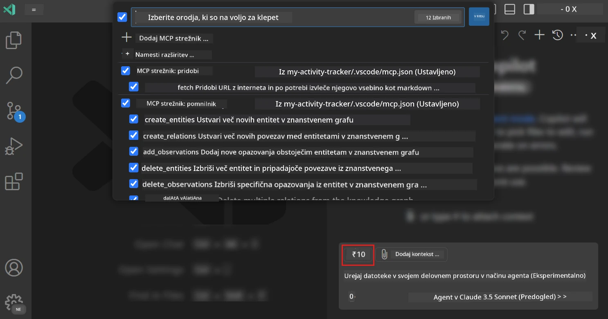
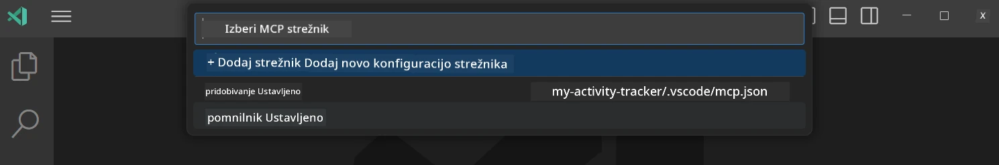
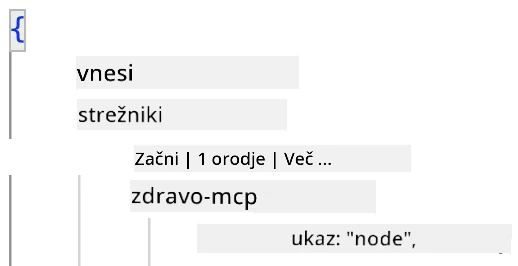
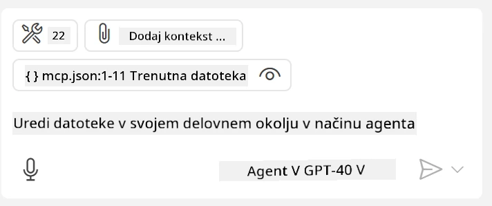
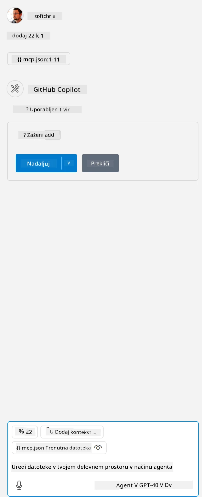

# Uporaba strežnika v načinu agenta GitHub Copilot

Visual Studio Code in GitHub Copilot lahko delujeta kot odjemalec in uporabljata MCP strežnik. Zakaj bi to želeli? No, to pomeni, da lahko vse funkcije MCP strežnika uporabljate neposredno v svojem IDE-ju. Predstavljajte si, da dodate na primer GitHubov MCP strežnik – to bi omogočilo upravljanje GitHuba prek ukazov v naravnem jeziku namesto tipkanja specifičnih ukazov v terminalu. Ali pa si zamislite karkoli, kar bi lahko izboljšalo vašo izkušnjo razvijalca, vse nadzorovano z naravnim jezikom. Zdaj vidite prednosti, kajne?

## Pregled

Ta lekcija pokriva, kako uporabljati Visual Studio Code in način agenta GitHub Copilot kot odjemalec za vaš MCP strežnik.

## Cilji učenja

Na koncu te lekcije boste lahko:

- Uporabljali MCP strežnik prek Visual Studio Code.
- Zagnali funkcionalnosti, kot so orodja, prek GitHub Copilot.
- Konfigurirali Visual Studio Code za iskanje in upravljanje vašega MCP strežnika.

## Uporaba

Svoj MCP strežnik lahko upravljate na dva različna načina:

- Uporabniški vmesnik – kako to storiti, boste videli kasneje v tem poglavju.
- Terminal – možno je upravljati stvari iz terminala z uporabo ukaza `code`:

  Za dodajanje MCP strežnika v svoj uporabniški profil uporabite ukazno vrstico z možnostjo --add-mcp in zagotovite konfiguracijo strežnika JSON v obliki {\"name\":\"server-name\",\"command\":...}.

  ```
  code --add-mcp "{\"name\":\"my-server\",\"command\": \"uvx\",\"args\": [\"mcp-server-fetch\"]}"
  ```

### Posnetki zaslona





V naslednjih razdelkih bomo podrobneje govorili o uporabi vizualnega vmesnika.

## Pristop

Tukaj je, kako se moramo lotiti tega na visoki ravni:

- Konfigurirajte datoteko za iskanje MCP strežnika.
- Zaženite/Povežite se s strežnikom, da prikaže svoje funkcionalnosti.
- Uporabljajte te funkcionalnosti prek vmesnika za klepet GitHub Copilot.

Odlično, zdaj ko razumemo potek, poskusimo uporabiti MCP strežnik prek Visual Studio Code z vajo.

## Vaja: Uporaba strežnika

V tej vaji bomo konfigurirali Visual Studio Code za iskanje vašega MCP strežnika, da ga boste lahko uporabljali prek vmesnika za klepet GitHub Copilot.

### -0- Predkorak: omogočite odkrivanje MCP strežnikov

Morda boste morali omogočiti odkrivanje MCP strežnikov.

1. Pojdite na `File -> Preferences -> Settings` v Visual Studio Code.

1. Poiščite "MCP" in omogočite `chat.mcp.discovery.enabled` v datoteki settings.json.

### -1- Ustvarite konfiguracijsko datoteko

Začnite z ustvarjanjem konfiguracijske datoteke v korenskem imeniku vašega projekta. Potrebovali boste datoteko MCP.json, ki jo postavite v mapo .vscode. Videti bi morala takole:

```text
.vscode
|-- mcp.json
```

Nato si poglejmo, kako dodati vnos strežnika.

### -2- Konfigurirajte strežnik

Dodajte naslednjo vsebino v *mcp.json*:

```json
{
    "inputs": [],
    "servers": {
       "hello-mcp": {
           "command": "node",
           "args": [
               "build/index.js"
           ]
       }
    }
}
```

Zgornji primer prikazuje, kako zagnati strežnik, napisan v Node.js. Za druge izvajalne okolje navedite ustrezen ukaz za zagon strežnika z uporabo `command` in `args`.

### -3- Zaženite strežnik

Ko ste dodali vnos, zaženite strežnik:

1. Poiščite svoj vnos v *mcp.json* in se prepričajte, da najdete ikono "play":

    

1. Kliknite ikono "play". Videti bi morali, da se število razpoložljivih orodij v ikoni orodij GitHub Copilot Chat poveča. Če kliknete to ikono orodij, boste videli seznam registriranih orodij. Vsako orodje lahko označite/odznačite, odvisno od tega, ali želite, da jih GitHub Copilot uporablja kot kontekst:

  

1. Za zagon orodja vnesite ukaz, za katerega veste, da ustreza opisu enega od vaših orodij, na primer ukaz "add 22 to 1":

  

  Videti bi morali odgovor, ki pravi 23.

## Naloga

Poskusite dodati vnos strežnika v svojo datoteko *mcp.json* in se prepričajte, da lahko zaženete/ustavite strežnik. Prav tako se prepričajte, da lahko komunicirate z orodji na vašem strežniku prek vmesnika za klepet GitHub Copilot.

## Rešitev

[Rešitev](./solution/README.md)

## Ključne točke

Ključne točke tega poglavja so naslednje:

- Visual Studio Code je odličen odjemalec, ki omogoča uporabo več MCP strežnikov in njihovih orodij.
- Vmesnik za klepet GitHub Copilot je način interakcije s strežniki.
- Uporabnika lahko pozovete k vnosu, kot so API ključi, ki jih je mogoče posredovati MCP strežniku pri konfiguriranju vnosa strežnika v datoteki *mcp.json*.

## Primeri

- [Java Kalkulator](../samples/java/calculator/README.md)
- [.Net Kalkulator](../../../../03-GettingStarted/samples/csharp)
- [JavaScript Kalkulator](../samples/javascript/README.md)
- [TypeScript Kalkulator](../samples/typescript/README.md)
- [Python Kalkulator](../../../../03-GettingStarted/samples/python)

## Dodatni viri

- [Dokumentacija Visual Studio](https://code.visualstudio.com/docs/copilot/chat/mcp-servers)

## Kaj sledi

- Naslednje: [Ustvarjanje stdio strežnika](../05-stdio-server/README.md)

---

**Omejitev odgovornosti**:  
Ta dokument je bil preveden z uporabo storitve za strojno prevajanje [Co-op Translator](https://github.com/Azure/co-op-translator). Čeprav si prizadevamo za natančnost, vas prosimo, da se zavedate, da lahko avtomatizirani prevodi vsebujejo napake ali netočnosti. Izvirni dokument v njegovem izvirnem jeziku je treba obravnavati kot avtoritativni vir. Za ključne informacije priporočamo strokovno človeško prevajanje. Ne prevzemamo odgovornosti za morebitna nesporazumevanja ali napačne razlage, ki izhajajo iz uporabe tega prevoda.