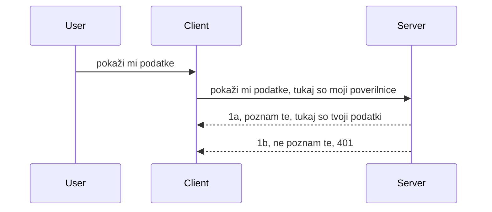

# Enostavno preverjanje pristnosti

SDK-ji MCP podpirajo uporabo OAuth 2.1, ki je pošteno rečeno precej zapleten postopek, ki vključuje koncepte, kot so avtentikacijski strežnik, strežnik virov, pošiljanje poverilnic, pridobivanje kode, zamenjava kode za žeton nosilca, dokler ne dobite podatkov o virov. Če niste navajeni na OAuth, kar je dobra praksa za implementacijo, je dobra ideja začeti z osnovnim nivojem preverjanja pristnosti in graditi proti vedno boljši varnosti. Zato obstaja ta poglavje, da vas izvede do bolj naprednega preverjanja pristnosti.

## Preverjanje pristnosti, kaj imamo v mislih?

Preverjanje pristnosti je kratica za avtentikacijo in avtorizacijo. Ideja je, da moramo narediti dve stvari:

- **Avtentikacija**, to je proces ugotavljanja, ali dovolimo osebi vstopiti v naš dom, ali ima pravico biti "tu", torej imeti dostop do našega strežnika virov, kjer živijo funkcije MCP strežnika.
- **Avtorizacija**, je proces ugotavljanja, ali uporabnik sme dostopati do teh specifičnih virov, ki jih zahteva, na primer ti naročila ali ti izdelki, ali pa sme le brati vsebino, ne pa brisati, kot je drugi primer.

## Poverilnice: kako sistemu povemo, kdo smo

Večina spletnih razvijalcev najprej pomisli v smislu zagotavljanja poverilnic strežniku, običajno skrivnosti, ki pove, če jim je dovoljeno biti tukaj "Avtentikacija". Te poverilnice so običajno base64 kodirana različica uporabniškega imena in gesla ali API ključ, ki enolično identificira določenega uporabnika.

To vključuje pošiljanje preko glave z imenom "Authorization" takole:

```json
{ "Authorization": "secret123" }
```

To se običajno imenuje osnovna avtentikacija. Kako celoten potek deluje, je na sledeč način:


Zdaj, ko razumemo, kako deluje z vidika toka, kako to implementiramo? Večina spletnih strežnikov ima koncept imenovan middleware, kos kode, ki se izvaja kot del zahteve in lahko preveri poverilnice, in če so poverilnice veljavne, dovoli zahtevi, da gre naprej. Če zahteva nima veljavnih poverilnic, dobite napako pristnosti. Poglejmo, kako to lahko implementiramo:

**Python**

```python
class AuthMiddleware(BaseHTTPMiddleware):
    async def dispatch(self, request, call_next):

        has_header = request.headers.get("Authorization")
        if not has_header:
            print("-> Missing Authorization header!")
            return Response(status_code=401, content="Unauthorized")

        if not valid_token(has_header):
            print("-> Invalid token!")
            return Response(status_code=403, content="Forbidden")

        print("Valid token, proceeding...")
       
        response = await call_next(request)
        # dodajte poljubne uporabniške glave ali na kakršen koli način spremenite odgovor
        return response


starlette_app.add_middleware(CustomHeaderMiddleware)
```

Tukaj imamo: 

- Ustvarjen middleware z imenom `AuthMiddleware`, katerega metodo `dispatch` kliče spletni strežnik.
- Dodan middleware spletnemu strežniku:

    ```python
    starlette_app.add_middleware(AuthMiddleware)
    ```

- Napisano logiko za validacijo, ki preveri, če je glava Authorization prisotna in če je poslana skrivnost veljavna:

    ```python
    has_header = request.headers.get("Authorization")
    if not has_header:
        print("-> Missing Authorization header!")
        return Response(status_code=401, content="Unauthorized")

    if not valid_token(has_header):
        print("-> Invalid token!")
        return Response(status_code=403, content="Forbidden")
    ```

    če je skrivnost prisotna in veljavna, pustimo zahtevo mimo z klicem `call_next` in vrnemo odziv.

    ```python
    response = await call_next(request)
    # dodajte morebitne uporabniške glave ali na nek način spremenite odgovor
    return response
    ```

Kako to deluje: če je web zahteva poslana proti strežniku, bo middleware poklican in glede na njegovo implementacijo bo bodisi dovolil prehod zahteve bodisi vrnil napako, ki kaže, da naročnik nima dovoljenja za nadaljevanje.

**TypeScript**

Tukaj ustvarimo middleware z uporabo priljubljenega ogrodja Express in prestrežemo zahtevo preden doseže MCP strežnik. Tukaj je koda za to:

```typescript
function isValid(secret) {
    return secret === "secret123";
}

app.use((req, res, next) => {
    // 1. Ali je prisoten glava avtentikacije?
    if(!req.headers["Authorization"]) {
        res.status(401).send('Unauthorized');
    }
    
    let token = req.headers["Authorization"];

    // 2. Preveri veljavnost.
    if(!isValid(token)) {
        res.status(403).send('Forbidden');
    }

   
    console.log('Middleware executed');
    // 3. Pošlje zahtevo v naslednji korak v procesu zahteve.
    next();
});
```

V tej kodi:

1. Preverimo, če je glava Authorization sploh prisotna, če ni, pošljemo 401 napako.
2. Preverimo, če je poverilnica/žeton veljaven, če ni, pošljemo 403 napako.
3. Nazadnje, zahtevi dovolimo nadaljevanje v zahtevnem kanalu in vrnemo zahtevani vir.

## Vaja: Implementirajmo preverjanje pristnosti

Vzeli bomo naše znanje in poskusili implementirati. Tukaj je načrt:

Strežnik

- Ustvariti spletni strežnik in MCP instanco.
- Implementirati middleware za strežnik.

Odjemalec

- Poslati spletno zahtevo, s poverilnico, preko glave.

### -1- Ustvari spletni strežnik in MCP instanco

V prvem koraku moramo ustvariti instanco spletnega strežnika in MCP strežnika.

**Python**

Tukaj ustvarimo instanco MCP strežnika, ustvarimo starlette spletno aplikacijo in jo gostimo z uvicorn.

```python
# ustvarjanje MCP strežnika

app = FastMCP(
    name="MCP Resource Server",
    instructions="Resource Server that validates tokens via Authorization Server introspection",
    host=settings["host"],
    port=settings["port"],
    debug=True
)

# ustvarjanje starlette spletne aplikacije
starlette_app = app.streamable_http_app()

# strežba aplikacije preko uvicorn
async def run(starlette_app):
    import uvicorn
    config = uvicorn.Config(
            starlette_app,
            host=app.settings.host,
            port=app.settings.port,
            log_level=app.settings.log_level.lower(),
        )
    server = uvicorn.Server(config)
    await server.serve()

run(starlette_app)
```

V tej kodi:

- Ustvarimo MCP strežnik.
- Sestavimo starlette spletno aplikacijo iz MCP strežnika `app.streamable_http_app()`.
- Gostimo in strežemo spletno aplikacijo z uvicorn `server.serve()`.

**TypeScript**

Tukaj ustvarimo MCP Server instanco.

```typescript
const server = new McpServer({
      name: "example-server",
      version: "1.0.0"
    });

    // ... nastavite strežniške vire, orodja in pozive ...
```

To ustvarjanje MCP strežnika se mora zgoditi znotraj definicije poti POST /mcp, zato vzamemo zgornjo kodo in jo premaknemo takole:

```typescript
import express from "express";
import { randomUUID } from "node:crypto";
import { McpServer } from "@modelcontextprotocol/sdk/server/mcp.js";
import { StreamableHTTPServerTransport } from "@modelcontextprotocol/sdk/server/streamableHttp.js";
import { isInitializeRequest } from "@modelcontextprotocol/sdk/types.js"

const app = express();
app.use(express.json());

// Zemljevid za shranjevanje prenosov po ID-ju seje
const transports: { [sessionId: string]: StreamableHTTPServerTransport } = {};

// Obravnavaj POST zahteve za komunikacijo klient-server
app.post('/mcp', async (req, res) => {
  // Preveri obstoječi ID seje
  const sessionId = req.headers['mcp-session-id'] as string | undefined;
  let transport: StreamableHTTPServerTransport;

  if (sessionId && transports[sessionId]) {
    // Ponovno uporabi obstoječi prenos
    transport = transports[sessionId];
  } else if (!sessionId && isInitializeRequest(req.body)) {
    // Nova zahteva za inicializacijo
    transport = new StreamableHTTPServerTransport({
      sessionIdGenerator: () => randomUUID(),
      onsessioninitialized: (sessionId) => {
        // Shrani prenos po ID-ju seje
        transports[sessionId] = transport;
      },
      // Zaščita pred DNS ponovnim vezanjem je privzeto onemogočena zaradi združljivosti z preteklimi različicami. Če poganjaš ta strežnik
      // lokalno, poskrbi, da nastaviš:
      // enableDnsRebindingProtection: true,
      // allowedHosts: ['127.0.0.1'],
    });

    // Počisti prenos, ko je zaprt
    transport.onclose = () => {
      if (transport.sessionId) {
        delete transports[transport.sessionId];
      }
    };
    const server = new McpServer({
      name: "example-server",
      version: "1.0.0"
    });

    // ... nastavi strežniške vire, orodja in pozive ...

    // Poveži se na MCP strežnik
    await server.connect(transport);
  } else {
    // Neveljavna zahteva
    res.status(400).json({
      jsonrpc: '2.0',
      error: {
        code: -32000,
        message: 'Bad Request: No valid session ID provided',
      },
      id: null,
    });
    return;
  }

  // Obravnavaj zahtevo
  await transport.handleRequest(req, res, req.body);
});

// Ponovno uporabljiv upravljalnik za GET in DELETE zahteve
const handleSessionRequest = async (req: express.Request, res: express.Response) => {
  const sessionId = req.headers['mcp-session-id'] as string | undefined;
  if (!sessionId || !transports[sessionId]) {
    res.status(400).send('Invalid or missing session ID');
    return;
  }
  
  const transport = transports[sessionId];
  await transport.handleRequest(req, res);
};

// Obravnavaj GET zahteve za obvestila strežnika klientu preko SSE
app.get('/mcp', handleSessionRequest);

// Obravnavaj DELETE zahteve za prekinitev seje
app.delete('/mcp', handleSessionRequest);

app.listen(3000);
```

Sedaj vidite, kako je bila ustvaritev MCP strežnika premaknjena znotraj `app.post("/mcp")`.

Gremo na naslednji korak ustvarjanja middleware, da lahko validiramo prihajajoče poverilnice.

### -2- Implementiraj middleware za strežnik

Zdaj bomo naredili middleware, ki išče poverilnico v glavi `Authorization` in jo validira. Če je sprejemljiva, bo zahteva nadaljevala z izvajanjem, kar potrebuje (npr. našteti orodja, prebrati vir ali katerokoli funkcionalnost MCP, ki jo klient zahteva).

**Python**

Za ustvarjanje middleware moramo ustvariti razred, ki podeduje od `BaseHTTPMiddleware`. Obstajata dve zanimivi stvari:

- Zahteva `request`, iz katere beremo informacije iz glave.
- `call_next` je povratni klic, ki ga moramo poklicati, če je prinesena poverilnica, ki jo sprejmemo.

Najprej moramo obdelati primer, če glava `Authorization` manjka:

```python
has_header = request.headers.get("Authorization")

# glava ni prisotna, napaka 401, sicer nadaljuj.
if not has_header:
    print("-> Missing Authorization header!")
    return Response(status_code=401, content="Unauthorized")
```

Tukaj pošljemo sporočilo 401 neavtoriziran, ker naročnik spodrslja pri overjanju.

Nato, če je bila predložena poverilnica, preverimo njeno veljavnost takole:

```python
 if not valid_token(has_header):
    print("-> Invalid token!")
    return Response(status_code=403, content="Forbidden")
```

Opazite, da zgoraj pošljemo 403 prepovedano sporočilo. Poglejmo cel middleware spodaj, ki implementira vse, kar smo omenili:

```python
class AuthMiddleware(BaseHTTPMiddleware):
    async def dispatch(self, request, call_next):

        has_header = request.headers.get("Authorization")
        if not has_header:
            print("-> Missing Authorization header!")
            return Response(status_code=401, content="Unauthorized")

        if not valid_token(has_header):
            print("-> Invalid token!")
            return Response(status_code=403, content="Forbidden")

        print("Valid token, proceeding...")
        print(f"-> Received {request.method} {request.url}")
        response = await call_next(request)
        response.headers['Custom'] = 'Example'
        return response

```

Super, ampak kaj pa funkcija `valid_token`? Tukaj je spodaj:
:

```python
# NE uporabljajte za produkcijo - izboljšajte to !!
def valid_token(token: str) -> bool:
    # odstranite predpono "Bearer "
    if token.startswith("Bearer "):
        token = token[7:]
        return token == "secret-token"
    return False
```

To bi seveda lahko izboljšali.

POMEMBNO: Nikoli ne smete imeti takšnih skrivnosti v kodi. Idealno je, da vrednost za primerjavo pridobite iz podatkovnega vira ali od IDP-ja (ponudnika identitet) oziroma še bolje, pustite IDP, da opravi validacijo.

**TypeScript**

Za implementacijo z Express moramo poklicati metodo `use`, ki sprejema middleware funkcije.

Potrebujemo:

- Interakcijo z objektom zahteve, da preverimo posredovano poverilnico v lastnosti `Authorization`.
- Validacijo poverilnice, in če je veljavna, dovolimo nadaljevanje zahteve in naj MCP zahteva naročnika stori, kar je treba (npr. našteti orodja, prebrati vir ali karkoli v zvezi z MCP).

Tukaj preverjamo, ali je glava `Authorization` prisotna in če ni, zaustavimo zahtevo:

```typescript
if(!req.headers["authorization"]) {
    res.status(401).send('Unauthorized');
    return;
}
```

Če glava ni poslana, prejmete 401.

Potem, preverimo, če je poverilnica veljavna, če ni, ponovno ustavimo zahtevo, a z malo drugačnim sporočilom:

```typescript
if(!isValid(token)) {
    res.status(403).send('Forbidden');
    return;
} 
```

Opazite, da zdaj dobite 403 napako.

Tukaj je celotna koda:

```typescript
app.use((req, res, next) => {
    console.log('Request received:', req.method, req.url, req.headers);
    console.log('Headers:', req.headers["authorization"]);
    if(!req.headers["authorization"]) {
        res.status(401).send('Unauthorized');
        return;
    }
    
    let token = req.headers["authorization"];

    if(!isValid(token)) {
        res.status(403).send('Forbidden');
        return;
    }  

    console.log('Middleware executed');
    next();
});
```

Nastavili smo spletni strežnik, da sprejema middleware, ki preverja poverilnico, ki jo naročnik upamo, da nam jo pošlje. Kaj pa sam odjemalec?

### -3- Pošlji spletno zahtevo s poverilnico preko glave

Moramo zagotoviti, da naročnik pošilja poverilnico preko glave. Ker bomo uporabili MCP odjemalca za to, moramo ugotoviti, kako se to naredi.

**Python**

Za odjemalca je treba poslati glavo z našo poverilnico takole:

```python
# NE trdo kodirajte vrednosti, raje jo imejte vsaj v okoljski spremenljivki ali varnejšem shranjevanju
token = "secret-token"

async with streamablehttp_client(
        url = f"http://localhost:{port}/mcp",
        headers = {"Authorization": f"Bearer {token}"}
    ) as (
        read_stream,
        write_stream,
        session_callback,
    ):
        async with ClientSession(
            read_stream,
            write_stream
        ) as session:
            await session.initialize()
      
            # TODO, kaj želite narediti na odjemalcu, npr. našteti orodja, poklicati orodja itd.
```

Opazite, kako napolnimo lastnost `headers` takole: `headers = {"Authorization": f"Bearer {token}"}`.

**TypeScript**

To lahko rešimo v dveh korakih:

1. Napolnimo konfiguracijski objekt s poverilnico.
2. Posredujemo konfiguracijski objekt transportu.

```typescript

// NE trdo kodirajte vrednosti, kot je prikazano tukaj. Najmanj kar lahko storite, je, da jo imate kot okoljsko spremenljivko in uporabite nekaj podobnega dotenv (v razvojni fazi).
let token = "secret123"

// definirajte objekt možnosti transporta za odjemalca
let options: StreamableHTTPClientTransportOptions = {
  sessionId: sessionId,
  requestInit: {
    headers: {
      "Authorization": "secret123"
    }
  }
};

// posredujte objekt možnosti transportu
async function main() {
   const transport = new StreamableHTTPClientTransport(
      new URL(serverUrl),
      options
   );
```

Tukaj zgoraj vidite, kako smo morali ustvariti objekt `options` in pod lastnost `requestInit` postaviti naše glave.

POMEMBNO: Kako to izboljšati? Trenutna implementacija ima nekaj težav. Najprej, pošiljanje poverilnice na tak način je precej tvegano, razen če imate vsaj HTTPS. Tudi takrat lahko poverilnica ukradena, zato potrebujete sistem, kjer lahko preprosto prekličete žeton in dodate dodatne kontrole, kot so od kod prihaja na svetu, ali se zahteva dogaja preveč pogosto (obnašanje bot-a), skratka, obstaja cela vrsta skrbi.

Vendar pa je za zelo preproste API-je, kjer ne želite, da kdorkoli kliče vaš API brez overjanja, to dober začetek.

Rečeno torej, poskusimo malo okrepiti varnost z uporabo standardiziranega formata, kot je JSON Web Token, znan tudi kot JWT ali "JOT" žetoni.

## JSON Web žetoni, JWT

Torej, poskušamo izboljšati stvari od pošiljanja zelo preprostih poverilnic. Kakšne so takojšnje izboljšave, ki jih dobimo z uporabo JWT?

- **Izboljšave varnosti**. Pri osnovnem preverjanju pristnosti pošiljate uporabniško ime in geslo kot base64 kodiran žeton (ali pošljete API ključ) znova in znova, kar povečuje tveganje. Z JWT pošljete uporabniško ime in geslo ter dobite žeton v zameno, ki je tudi časovno omejen, kar pomeni, da poteče. JWT omogoča enostavno uporabo zelo natančnega nadzora dostopa z vlogami, območji in dovoljenji.
- **Brezdržavnost in skalabilnost**. JWT so samostojni, nosijo vse uporabniške informacije in odpravljajo potrebo po shranjevanju seje na strežniku. Žeton se lahko validira lokalno.
- **Interoperabilnost in federacija**. JWT so osrednji del Open ID Connect in se uporabljajo z znanimi ponudniki identitet, kot so Entra ID, Google Identity in Auth0. Omogočajo tudi enotno prijavo in še mnogo več, zaradi česar so primerne za podjetja.
- **Modularnost in prilagodljivost**. JWT je mogoče uporabljati z API prehodi kot so Azure API Management, NGINX in drugi. Prav tako podpira scenarije preverjanja pristnosti in komunikacijo strežnik-storitev, vključno z impersonacijo in delegacijo.
- **Zmognost in predpomnjenje**. JWT je mogoče predpomniti po dekodiranju, kar zmanjša potrebo po razčlenjevanju. To še posebej pomaga pri aplikacijah z velikim prometom, saj izboljša prepustnost in zmanjša obremenitev infrastrukture.
- **Napredne funkcije**. Podpira tudi introspekcijo (preverjanje veljavnosti na strežniku) in preklic (za onemogočenje žetona).

Z vsemi temi prednostmi poglejmo, kako lahko svojo implementacijo pripeljemo na naslednjo raven.

## Pretvorba osnovne avtentikacije v JWT

Torej, spremembe, ki jih je treba narediti na visokem nivoju, so:

- **Naučiti se zgraditi JWT žeton** in ga pripraviti za pošiljanje od odjemalca do strežnika.
- **Validirati JWT žeton** in če je veljaven, pustiti odjemalca dostopati do naših virov.
- **Varno shranjevanje žetona**. Kako hranimo ta žeton.
- **Zaščititi poti**. Potrebno je zaščititi poti, v našem primeru poti in določene funkcije MCP.
- **Dodati osvežitvene žetone**. Zagotoviti, da ustvarimo kratkotrajne žetone, vendar dolgotrajne osvežitvene žetone, ki lahko pridobijo nove, če potečejo. Prav tako zagotoviti osvežitveni endpoint in strategijo rotacije.

### -1- Zgraditi JWT žeton

JWT žeton ima naslednje dele:

- **glava**, uporabljeni algoritem in tip žetona.
- **podatki (payload)**, trditve, kot so sub (uporabnik ali entiteta, ki jo žeton predstavlja; v scenariju avtorizacije je to običajno ID uporabnika), exp (konec veljavnosti), role (vloga)
- **podpis**, podpisan s skrivnostjo ali zasebnim ključem.

Za to bomo morali sestaviti glavo, podatke in kodiran žeton.

**Python**

```python

import jwt
import jwt
from jwt.exceptions import ExpiredSignatureError, InvalidTokenError
import datetime

# Skrivni ključ, uporabljen za podpisovanje JWT
secret_key = 'your-secret-key'

header = {
    "alg": "HS256",
    "typ": "JWT"
}

# podatki o uporabniku, njegove trditve in čas poteka
payload = {
    "sub": "1234567890",               # Predmet (ID uporabnika)
    "name": "User Userson",                # Lastna trditev
    "admin": True,                     # Lastna trditev
    "iat": datetime.datetime.utcnow(),# Izdan ob
    "exp": datetime.datetime.utcnow() + datetime.timedelta(hours=1)  # Potek
}

# kodiraj ga
encoded_jwt = jwt.encode(payload, secret_key, algorithm="HS256", headers=header)
```

V zgornji kodi smo:

- Definirali glavo z algoritmom HS256 in tipom JWT.
- Sestavili podatke, ki vsebujejo zadevnega uporabnika ali ID, uporabniško ime, vlogo, ko je bil žeton izdan in do kdaj velja, ter tako implementirali časovno omejitev, o kateri smo prej govorili.

**TypeScript**

Tukaj bomo potrebovali nekatere odvisnosti, ki nam bodo pomagale sestaviti JWT žeton.

Odvisnosti

```sh

npm install jsonwebtoken
npm install --save-dev @types/jsonwebtoken
```

Zdaj, ko imamo to na voljo, ustvarimo glavo, podatke in preko tega kodiran žeton.

```typescript
import jwt from 'jsonwebtoken';

const secretKey = 'your-secret-key'; // Uporabite okoljske spremenljivke v produkciji

// Določite vsebino podatkov
const payload = {
  sub: '1234567890',
  name: 'User usersson',
  admin: true,
  iat: Math.floor(Date.now() / 1000), // Čas izdaje
  exp: Math.floor(Date.now() / 1000) + 60 * 60 // Poteka čez 1 uro
};

// Določite glavo (opcijsko, jsonwebtoken nastavi privzete vrednosti)
const header = {
  alg: 'HS256',
  typ: 'JWT'
};

// Ustvarite žeton
const token = jwt.sign(payload, secretKey, {
  algorithm: 'HS256',
  header: header
});

console.log('JWT:', token);
```

Ta žeton je:

Podpisan z HS256
Veljavnost 1 uro
Vključuje trditve, kot so sub, name, admin, iat in exp.

### -2- Validacija žetona

Potrebovali bomo tudi validacijo žetona, to je nekaj, kar moramo opraviti na strežniku, da zagotovimo, da je tisto, kar nam klient pošilja, dejansko veljavno. Tu je veliko preverjanj, ki jih moramo narediti od validacije strukture do veljavnosti. Spodbujeni ste, da dodate še druge kontrole, kot je preverjanje, ali je uporabnik v vašem sistemu ter drugo.

Za validacijo žetona ga moramo dekodirati, da ga lahko preberemo in nato začnemo preverjati njegovo veljavnost:

**Python**

```python

# Dekodirajte in preverite JWT
try:
    decoded = jwt.decode(token, secret_key, algorithms=["HS256"])
    print("✅ Token is valid.")
    print("Decoded claims:")
    for key, value in decoded.items():
        print(f"  {key}: {value}")
except ExpiredSignatureError:
    print("❌ Token has expired.")
except InvalidTokenError as e:
    print(f"❌ Invalid token: {e}")

```

V tej kodi kliče `jwt.decode` z žetonom, skrivnim ključem in izbranim algoritmom kot vhodnimi podatki. Opazite, da uporabljamo try-catch konstrukcijo, saj neuspešna validacija povzroči sprožitev napake.

**TypeScript**

Tukaj moramo poklicati `jwt.verify`, da dobimo dekodirano različico žetona, ki jo lahko nato analiziramo. Če ta klic ne uspe, to pomeni, da je struktura žetona napačna ali ni več veljavna.

```typescript

try {
  const decoded = jwt.verify(token, secretKey);
  console.log('Decoded Payload:', decoded);
} catch (err) {
  console.error('Token verification failed:', err);
}
```

OPOMBA: kot smo že omenili, bi morali opraviti dodatne kontrole, da zagotovimo, da ta žeton identificira uporabnika v našem sistemu in zagotovi, da ima uporabnik pravice, ki jih trdi, da ima.
Nato si poglejmo nadzor dostopa na osnovi vlog, znan tudi kot RBAC.

## Dodajanje nadzora dostopa na osnovi vlog

Ideja je, da želimo izraziti, da imajo različne vloge različne pravice. Na primer, privzamemo, da lahko administrator naredi vse, običajni uporabnik ima pravice za branje/pisanje, gost pa lahko le bere. Zato so tukaj nekateri možni nivoji dovoljenj:

- Admin.Write
- User.Read
- Guest.Read

Poglejmo, kako lahko tak nadzor uvedemo z uporabo middleware. Middlewarje lahko dodamo za posamezne poti kot tudi za vse poti.

**Python**

```python
from starlette.middleware.base import BaseHTTPMiddleware
from starlette.responses import JSONResponse
import jwt

# NE imejte skrivnosti v kodi, to je samo za prikazne namene. Preberite jo iz varnega mesta.
SECRET_KEY = "your-secret-key" # postavite to v okoljsko spremenljivko
REQUIRED_PERMISSION = "User.Read"

class JWTPermissionMiddleware(BaseHTTPMiddleware):
    async def dispatch(self, request, call_next):
        auth_header = request.headers.get("Authorization")
        if not auth_header or not auth_header.startswith("Bearer "):
            return JSONResponse({"error": "Missing or invalid Authorization header"}, status_code=401)

        token = auth_header.split(" ")[1]
        try:
            decoded = jwt.decode(token, SECRET_KEY, algorithms=["HS256"])
        except jwt.ExpiredSignatureError:
            return JSONResponse({"error": "Token expired"}, status_code=401)
        except jwt.InvalidTokenError:
            return JSONResponse({"error": "Invalid token"}, status_code=401)

        permissions = decoded.get("permissions", [])
        if REQUIRED_PERMISSION not in permissions:
            return JSONResponse({"error": "Permission denied"}, status_code=403)

        request.state.user = decoded
        return await call_next(request)


```

Obstaja nekaj različnih načinov za dodajanje middleware, kot spodaj:

```python

# Alt 1: dodajte middleware med konstruiranjem starlette aplikacije
middleware = [
    Middleware(JWTPermissionMiddleware)
]

app = Starlette(routes=routes, middleware=middleware)

# Alt 2: dodajte middleware po tem, ko je starlette aplikacija že konstruirana
starlette_app.add_middleware(JWTPermissionMiddleware)

# Alt 3: dodajte middleware za posamezno pot
routes = [
    Route(
        "/mcp",
        endpoint=..., # obdelovalec
        middleware=[Middleware(JWTPermissionMiddleware)]
    )
]
```

**TypeScript**

Lahko uporabimo `app.use` in middleware, ki bo tekel za vse zahteve.

```typescript
app.use((req, res, next) => {
    console.log('Request received:', req.method, req.url, req.headers);
    console.log('Headers:', req.headers["authorization"]);

    // 1. Preverite, ali je bil poslan autorizacijski glavi

    if(!req.headers["authorization"]) {
        res.status(401).send('Unauthorized');
        return;
    }
    
    let token = req.headers["authorization"];

    // 2. Preverite, ali je žeton veljaven
    if(!isValid(token)) {
        res.status(403).send('Forbidden');
        return;
    }  

    // 3. Preverite, ali uporabnik žetona obstaja v našem sistemu
    if(!isExistingUser(token)) {
        res.status(403).send('Forbidden');
        console.log("User does not exist");
        return;
    }
    console.log("User exists");

    // 4. Preverite, ali ima žeton pravilne pravice
    if(!hasScopes(token, ["User.Read"])){
        res.status(403).send('Forbidden - insufficient scopes');
    }

    console.log("User has required scopes");

    console.log('Middleware executed');
    next();
});

```

Obstaja kar nekaj stvari, ki jih lahko naš middleware naredi in ki jih NAJ middleware naredi, in sicer:

1. Preveri, če je avtentikacijski header prisoten
2. Preveri, če je token veljaven, pokličemo `isValid`, kar je metoda, ki smo jo napisali in preverja integriteto ter veljavnost JWT tokena.
3. Preveri, če uporabnik obstaja v našem sistemu, to bi morali preveriti.

   ```typescript
    // uporabniki v podatkovni bazi
   const users = [
     "user1",
     "User usersson",
   ]

   function isExistingUser(token) {
     let decodedToken = verifyToken(token);

     // TODO, preveri, ali uporabnik obstaja v podatkovni bazi
     return users.includes(decodedToken?.name || "");
   }
   ```

   Zgoraj smo ustvarili zelo preprost seznam `users`, ki bi bil seveda v bazi podatkov.

4. Poleg tega bi morali preveriti tudi, ali ima token ustrezna dovoljenja.

   ```typescript
   if(!hasScopes(token, ["User.Read"])){
        res.status(403).send('Forbidden - insufficient scopes');
   }
   ```

   V zgornji kodi iz middleware preverjamo, ali token vsebuje dovoljenje User.Read, če ne, pošljemo napako 403. Spodaj je pomočna metoda `hasScopes`.

   ```typescript
   function hasScopes(scope: string, requiredScopes: string[]) {
     let decodedToken = verifyToken(scope);
    return requiredScopes.every(scope => decodedToken?.scopes.includes(scope));
  }
   ```

Have a think which additional checks you should be doing, but these are the absolute minimum of checks you should be doing.

Using Express as a web framework is a common choice. There are helpers library when you use JWT so you can write less code.

- `express-jwt`, helper library that provides a middleware that helps decode your token.
- `express-jwt-permissions`, this provides a middleware `guard` that helps check if a certain permission is on the token.

Here's what these libraries can look like when used:

```typescript
const express = require('express');
const jwt = require('express-jwt');
const guard = require('express-jwt-permissions')();

const app = express();
const secretKey = 'your-secret-key'; // put this in env variable

// Decode JWT and attach to req.user
app.use(jwt({ secret: secretKey, algorithms: ['HS256'] }));

// Check for User.Read permission
app.use(guard.check('User.Read'));

// multiple permissions
// app.use(guard.check(['User.Read', 'Admin.Access']));

app.get('/protected', (req, res) => {
  res.json({ message: `Welcome ${req.user.name}` });
});

// Error handler
app.use((err, req, res, next) => {
  if (err.code === 'permission_denied') {
    return res.status(403).send('Forbidden');
  }
  next(err);
});

```

Zdaj ste videli, kako se middleware lahko uporablja tako za avtentikacijo kot za avtorizacijo, ampak kaj pa MCP, ali to spremeni način, kako izvajamo avtentikacijo? Ugotovimo v naslednjem poglavju.

### -3- Dodaj RBAC k MCP

Do zdaj ste videli, kako lahko dodate RBAC s pomočjo middleware, vendar za MCP ni enostavne poti za dodajanje RBAC na nivo funkcije MCP, kaj torej storimo? Preprosto moramo dodati kodo, kot je ta, ki preverja, ali ima klient pravice klicati določen pripomoček:

Imate nekaj različnih možnosti, kako doseči RBAC na nivoju funkcije, tukaj je nekaj:

- Dodajte preverjanje za vsak pripomoček, vir, poziv, kjer morate preveriti nivo dovoljenj.

   **python**

   ```python
   @tool()
   def delete_product(id: int):
      try:
          check_permissions(role="Admin.Write", request)
      catch:
        pass # odjemalec ni uspel pri preverjanju pristnosti, sproži napako pristnosti
   ```

   **typescript**

   ```typescript
   server.registerTool(
    "delete-product",
    {
      title: Delete a product",
      description: "Deletes a product",
      inputSchema: { id: z.number() }
    },
    async ({ id }) => {
      
      try {
        checkPermissions("Admin.Write", request);
        // todo, pošlji id v productService in oddaljeni vhod
      } catch(Exception e) {
        console.log("Authorization error, you're not allowed");  
      }

      return {
        content: [{ type: "text", text: `Deletected product with id ${id}` }]
      };
    }
   );
   ```


- Uporabite napreden pristop na strežniku in upravljalnike zahtev, da zmanjšate število mest, kjer morate izvajati preverjanje.

   **Python**

   ```python
   
   tool_permission = {
      "create_product": ["User.Write", "Admin.Write"],
      "delete_product": ["Admin.Write"]
   }

   def has_permission(user_permissions, required_permissions) -> bool:
      # user_permissions: seznam dovoljenj, ki jih ima uporabnik
      # required_permissions: seznam dovoljenj, potrebnih za orodje
      return any(perm in user_permissions for perm in required_permissions)

   @server.call_tool()
   async def handle_call_tool(
     name: str, arguments: dict[str, str] | None
   ) -> list[types.TextContent]:
    # Predpostavite, da je request.user.permissions seznam dovoljenj za uporabnika
     user_permissions = request.user.permissions
     required_permissions = tool_permission.get(name, [])
     if not has_permission(user_permissions, required_permissions):
        # Vrzi napako "Nimate dovoljenja za uporabo orodja {name}"
        raise Exception(f"You don't have permission to call tool {name}")
     # nadaljuj in pokliči orodje
     # ...
   ```   
   

   **TypeScript**

   ```typescript
   function hasPermission(userPermissions: string[], requiredPermissions: string[]): boolean {
       if (!Array.isArray(userPermissions) || !Array.isArray(requiredPermissions)) return false;
       // Vrni res, če ima uporabnik vsaj eno zahtevano dovoljenje
       
       return requiredPermissions.some(perm => userPermissions.includes(perm));
   }
  
   server.setRequestHandler(CallToolRequestSchema, async (request) => {
      const { params: { name } } = request;
  
      let permissions = request.user.permissions;
  
      if (!hasPermission(permissions, toolPermissions[name])) {
         return new Error(`You don't have permission to call ${name}`);
      }
  
      // nadaljuj..
   });
   ```

   Opomba, morate zagotoviti, da vaš middleware dodeli dekodiran token lastnosti user v zahtevi, da je zgornja koda preprosta.

### Povzetek

Zdaj, ko smo razpravljali o tem, kako dodati podporo za RBAC na splošno in za MCP posebej, je čas, da poskusite varnost implementirati sami, da se prepričate, da ste razumeli predstavljene koncepte.

## Naloga 1: Zgradite mcp strežnik in mcp klient z uporabo osnovne avtentikacije

Tukaj boste uporabili, kar ste se naučili o pošiljanju poverilnic prek headerjev.

## Rešitev 1

[Rešitev 1](./code/basic/README.md)

## Naloga 2: Nadgradite rešitev iz Naloge 1 z uporabo JWT

Vzemite prvo rešitev, ampak tokrat jo izboljšajmo.

Namesto Basic Auth uporabimo JWT.

## Rešitev 2

[Rešitev 2](./solution/jwt-solution/README.md)

## Izziv

Dodajte RBAC na nivo orodja, kot opisano v razdelku "Dodaj RBAC k MCP".

## Povzetek

Upamo, da ste v tem poglavju veliko naučili, od popolne odsotnosti varnosti, do osnovne varnosti, do JWT in kako ga lahko dodamo v MCP.

Zgradili smo trdne temelje s prilagojenimi JWT-ji, a ko rastemo, se premikamo proti standardiziranemu modelu identitete. Sprejetje ponudnika identitete, kot sta Entra ali Keycloak, nam omogoča, da prenesemo izdajo, validacijo in upravljanje življenjskega cikla tokenov na zaupanja vredno platformo — kar nam omogoča, da se osredotočimo na logiko aplikacije in uporabniško izkušnjo.

Za to imamo bolj [napredno poglavje o Entri](../../05-AdvancedTopics/mcp-security-entra/README.md)

## Kaj sledi

- Naslednje: [Nastavitev MCP gostiteljev](../12-mcp-hosts/README.md)

---

<!-- CO-OP TRANSLATOR DISCLAIMER START -->
**Omejitev odgovornosti**:
Ta dokument je bil preveden z uporabo AI prevajalske storitve [Co-op Translator](https://github.com/Azure/co-op-translator). Čeprav si prizadevamo za natančnost, upoštevajte, da avtomatizirani prevodi lahko vsebujejo napake ali netočnosti. Izvirni dokument v maternem jeziku velja za avtoritativni vir. Za pomembne informacije priporočamo strokovni prevod s strani človeka. Nismo odgovorni za morebitna nesporazumevanja ali napačne interpretacije, ki izhajajo iz uporabe tega prevoda.
<!-- CO-OP TRANSLATOR DISCLAIMER END -->