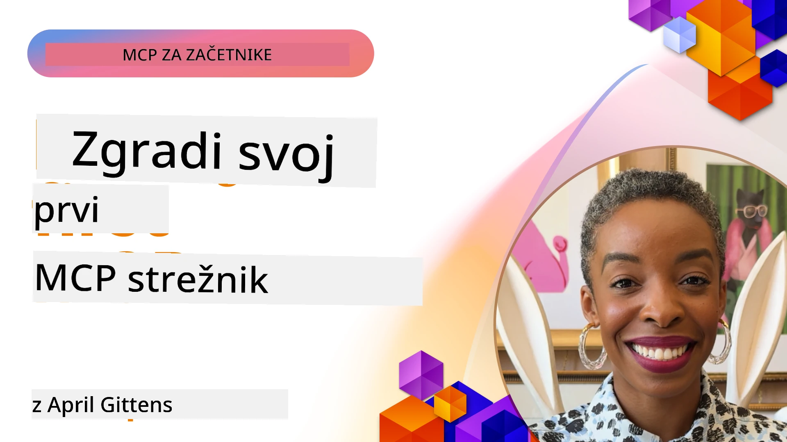

## Začetek  

_(Kliknite zgornjo sliko, da si ogledate video tega lekcijona)_

Ta razdelek vsebuje več lekcij:

- **1 Vaš prvi strežnik**, v tej prvi lekciji se boste naučili, kako ustvariti svoj prvi strežnik in ga pregledati z orodjem za inšpekcijo, dragocen način za testiranje in odpravljanje napak na strežniku, [na lekcijo](01-first-server/README.md)

- **2 Odjemalec**, v tej lekciji se boste naučili, kako napisati odjemalca, ki se lahko poveže z vašim strežnikom, [na lekcijo](02-client/README.md)

- **3 Odjemalec z LLM**, še boljši način pisanja odjemalca je z dodajanjem LLM, da lahko "pogajanja" s strežnikom o tem, kaj storiti, [na lekcijo](03-llm-client/README.md)

- **4 Uporaba načina agenta Github Copilot za strežnik v Visual Studio Code**. Tu si ogledamo zaganjanje našega MCP strežnika znotraj Visual Studio Code, [na lekcijo](04-vscode/README.md)

- **5 stdio transportni strežnik** stdio transport je priporočeni standard za lokalno komunikacijo MCP strežnik-odjemalec, ki zagotavlja varno komunikacijo podprocesov z vgrajeno izolacijo procesov [na lekcijo](05-stdio-server/README.md)

- **6 HTTP pretakanje z MCP (Streamable HTTP)**. Spoznajte sodoben HTTP transport za pretakanje (priporočeni pristop za oddaljene MCP strežnike po [MCP specifikaciji 2025-11-25](https://spec.modelcontextprotocol.io/specification/2025-11-25/basic/transports/#streamable-http)), obvestila o napredku in kako implementirati razširljive, realno-časovne MCP strežnike in odjemalce z uporabo Streamable HTTP. [na lekcijo](06-http-streaming/README.md)

- **7 Uporaba AI orodij za VSCode** za porabo in testiranje vaših MCP odjemalcev in strežnikov [na lekcijo](07-aitk/README.md)

- **8 Testiranje**. Tu se bomo še posebej osredotočili na različne načine testiranja našega strežnika in odjemalca, [na lekcijo](08-testing/README.md)

- **9 Namestitev**. Ta poglavje bo pogledalo različne načine uvajanja vaših MCP rešitev, [na lekcijo](09-deployment/README.md)

- **10 Napredna uporaba strežnika**. To poglavje pokriva naprednejšo uporabo strežnika, [na lekcijo](./10-advanced/README.md)

- **11 Avtentikacija**. To poglavje prikazuje, kako dodati preprosto avtentikacijo, od osnovne avtentikacije do uporabe JWT in RBAC. Priporočamo, da začnete tukaj, nato nadaljujete z naprednimi temami v poglavju 5 in izvedete dodatno varnostno utrjevanje po priporočilih iz poglavja 2, [na lekcijo](./11-simple-auth/README.md)

- **12 MCP gostitelji**. Konfigurirajte in uporabljajte priljubljene MCP gostiteljske odjemalce, vključno z Claude Desktop, Cursor, Cline in Windsurf. Spoznajte vrste transporta in odpravljanje težav, [na lekcijo](./12-mcp-hosts/README.md)

- **13 MCP inšpektor**. Odpravljajte napake in testirajte svoje MCP strežnike interaktivno z orodjem MCP Inspector. Naučite se odpravljati težave, vire in protokolne objave, [na lekcijo](./13-mcp-inspector/README.md)

Model Context Protocol (MCP) je odprt protokol, ki standardizira, kako aplikacije zagotavljajo kontekst za LLM-je. MCP lahko primerjamo s priključkom USB-C za AI aplikacije - omogoča standardiziran način povezave AI modelov z različnimi podatkovnimi viri in orodji.

## Cilji učenja

Na koncu tega lekcijona boste znali:

- Nastaviti razvojna okolja za MCP v C#, Javi, Pythonu, TypeScriptu in JavaScriptu
- Zgraditi in namestiti osnovne MCP strežnike s prilagojenimi funkcijami (viri, pozivi in orodja)
- Ustvariti gostiteljske aplikacije, ki se povezujejo s MCP strežniki
- Testirati in odpravljati napake MCP implementacij
- Razumeti običajne izzive pri nastavitvi in njihove rešitve
- Povezati svoje MCP implementacije s priljubljenimi LLM storitvami

## Nastavitev vašega MCP okolja

Preden začnete delati z MCP, je pomembno pripraviti razvojno okolje in razumeti osnovni potek dela. Ta razdelek vas bo vodil skozi začetne nastavitve, da zagotovite gladek začetek z MCP.

### Zahteve

Preden se lotite razvoja za MCP, poskrbite za:

- **Razvojno okolje**: Za izbrani jezik (C#, Java, Python, TypeScript ali JavaScript)
- **IDE/Urejevalnik**: Visual Studio, Visual Studio Code, IntelliJ, Eclipse, PyCharm ali kateri koli sodoben urejevalnik kode
- **Upravitelji paketov**: NuGet, Maven/Gradle, pip ali npm/yarn
- **API ključi**: Za vse AI storitve, ki jih nameravate uporabljati v svojih gostiteljskih aplikacijah

### Uradni SDK-ji

V prihodnjih poglavjih boste videli rešitve, zgrajene z uporabo Pythona, TypeScripta, Jave in .NET. Tukaj so vsi uradno podprti SDK-ji.

MCP nudi uradne SDK-je za več jezikov (usklajene z [MCP specifikacijo 2025-11-25](https://spec.modelcontextprotocol.io/specification/2025-11-25/)):
- [C# SDK](https://github.com/modelcontextprotocol/csharp-sdk) - vzdrževan v sodelovanju z Microsoftom
- [Java SDK](https://github.com/modelcontextprotocol/java-sdk) - vzdrževan v sodelovanju s Spring AI
- [TypeScript SDK](https://github.com/modelcontextprotocol/typescript-sdk) - uradna implementacija v TypeScriptu
- [Python SDK](https://github.com/modelcontextprotocol/python-sdk) - uradna implementacija v Pythonu (FastMCP)
- [Kotlin SDK](https://github.com/modelcontextprotocol/kotlin-sdk) - uradna implementacija v Kotlinu
- [Swift SDK](https://github.com/modelcontextprotocol/swift-sdk) - vzdrževan v sodelovanju z Loopwork AI
- [Rust SDK](https://github.com/modelcontextprotocol/rust-sdk) - uradna implementacija v Rustu
- [Go SDK](https://github.com/modelcontextprotocol/go-sdk) - uradna implementacija v Go

## Ključne ugotovitve

- Nastavitev razvoja MCP okolja je enostavna z jezikovno specifičnimi SDK-ji
- Gradnja MCP strežnikov vključuje ustvarjanje in registracijo orodij z jasnimi shemami
- MCP odjemalci se povezujejo s strežniki in modeli za izkoriščanje razširjenih zmogljivosti
- Testiranje in odpravljanje napak sta ključna za zanesljive MCP implementacije
- Možnosti uvajanja segajo od lokalnega razvoja do rešitev v oblaku

## Praksa

Imamo nabor primerov, ki dopolnjujejo vaje, ki jih boste videli v vseh poglavjih tega razdelka. Poleg tega ima vsako poglavje tudi svoje vaje in naloge

- [Java kalkulator](./samples/java/calculator/README.md)
- [.Net kalkulator](../../../03-GettingStarted/samples/csharp)
- [JavaScript kalkulator](./samples/javascript/README.md)
- [TypeScript kalkulator](./samples/typescript/README.md)
- [Python kalkulator](../../../03-GettingStarted/samples/python)

## Dodatni viri

- [Gradnja agentov z uporabo Model Context Protocol na Azure](https://learn.microsoft.com/azure/developer/ai/intro-agents-mcp)
- [Oddaljeni MCP z Azure Container Apps (Node.js/TypeScript/JavaScript)](https://learn.microsoft.com/samples/azure-samples/mcp-container-ts/mcp-container-ts/)
- [.NET OpenAI MCP agent](https://learn.microsoft.com/samples/azure-samples/openai-mcp-agent-dotnet/openai-mcp-agent-dotnet/)

## Kaj sledi

Začnite s prvo lekcijo: [Ustvarjanje vašega prvega MCP strežnika](01-first-server/README.md)

Ko zaključite ta modul, nadaljujte z: [Modul 4: Praktična implementacija](../04-PracticalImplementation/README.md)

---

<!-- CO-OP TRANSLATOR DISCLAIMER START -->
**Opozorilo**:
Ta dokument je bil preveden z uporabo storitve za avtomatski prevod [Co-op Translator](https://github.com/Azure/co-op-translator). Čeprav si prizadevamo za natančnost, vas opozarjamo, da avtomatski prevodi lahko vsebujejo napake ali netočnosti. Izvirni dokument v izvirnem jeziku velja za avtoritativni vir. Za pomembne informacije priporočamo strokovni človeški prevod. Ne odgovarjamo za morebitna nesporazume ali napačne interpretacije, ki izhajajo iz uporabe tega prevoda.
<!-- CO-OP TRANSLATOR DISCLAIMER END -->