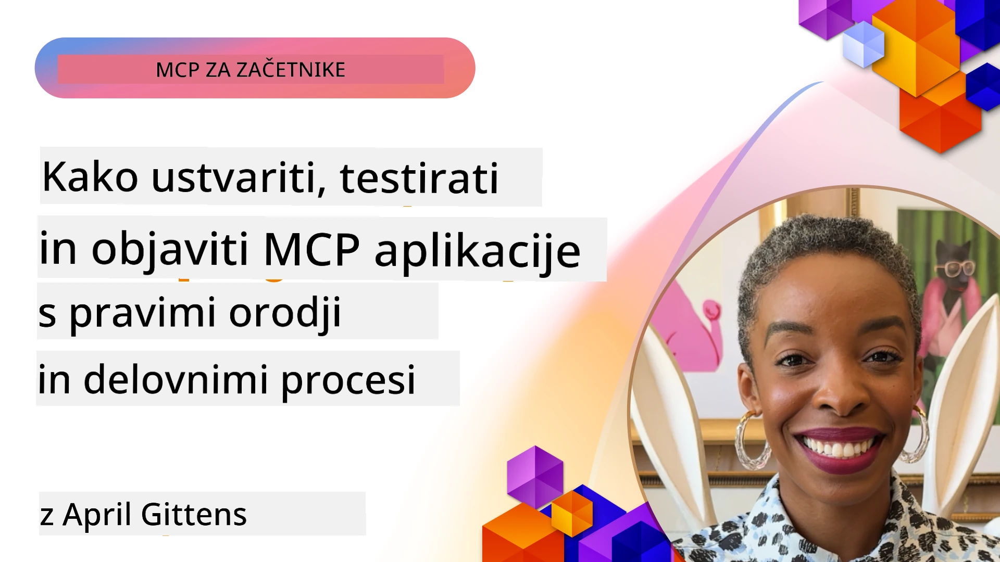
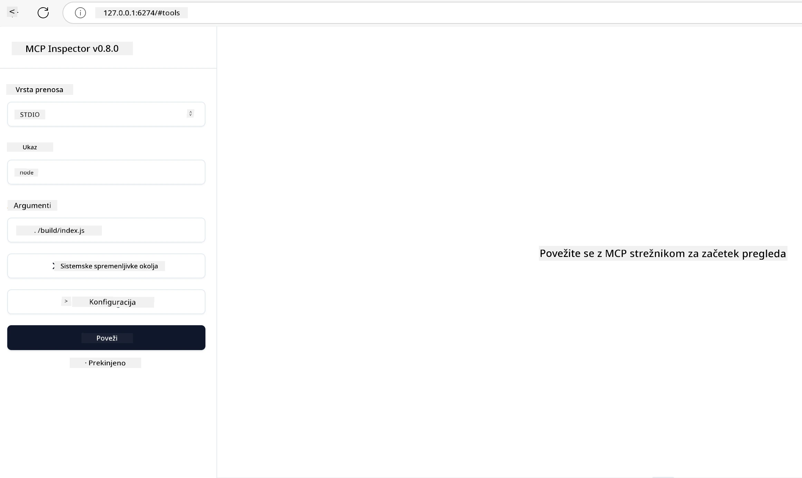

# Praktična implementacija

[](https://youtu.be/vCN9-mKBDfQ)

_(Kliknite zgornjo sliko za ogled videa te lekcije)_

Praktična implementacija je točka, kjer moč Model Context Protocol (MCP) postane otipljiva. Čeprav je razumevanje teorije in arhitekture MCP pomembno, se prava vrednost pokaže, ko te koncepte uporabite za gradnjo, testiranje in razmestitev rešitev, ki rešujejo probleme iz resničnega sveta. Ta poglavje premošča vrzel med konceptualnim znanjem in praktičnim razvojem ter vas vodi skozi proces oživljanja MCP-aplikacij.

Ne glede na to, ali razvijate inteligentne asistente, integrirate AI v poslovne delovne procese ali gradite prilagojena orodja za obdelavo podatkov, MCP nudi prilagodljivo podlago. Njegova jezikovno nevtralna zasnova in uradni SDK-ji za priljubljene programske jezike omogočajo dostop širokemu krogu razvijalcev. Z uporabo teh SDK-jev lahko hitro prototipirate, iterirate in skalirate svoje rešitve na različnih platformah in okoljih.

V nadaljevanju boste našli praktične primere, vzorčno kodo in strategije razmestitve, ki prikazujejo, kako implementirati MCP v C#, Javi s Springom, TypeScriptu, JavaScriptu in Pythonu. Naučili se boste tudi, kako razhroščevati in testirati svoje MCP strežnike, upravljati API-je in razmestiti rešitve v oblak z uporabo Azure. Ta praktična gradiva so zasnovana tako, da pospešijo vaše učenje in vam pomagajo samozavestno graditi robustne, proizvodno pripravljene MCP aplikacije.

## Pregled

Ta lekcija se osredotoča na praktične vidike implementacije MCP v različnih programskih jezikih. Raziskali bomo, kako uporabljati MCP SDK-je v C#, Javi s Springom, TypeScriptu, JavaScriptu in Pythonu za gradnjo robustnih aplikacij, razhroščevanje in testiranje MCP strežnikov ter ustvarjanje ponovno uporabnih virov, prompotov in orodij.

## Cilji učenja

Do konca te lekcije boste znali:

- Implementirati MCP rešitve z uporabo uradnih SDK-jev v različnih programskih jezikih
- Sistematično razhroščevati in testirati MCP strežnike
- Ustvarjati in uporabljati funkcije strežnika (Viri, Prompti in Orodja)
- Načrtovati učinkovite MCP delovne tokove za kompleksne naloge
- Optimizirati implementacije MCP za zmogljivost in zanesljivost

## Uradni SDK viri

Model Context Protocol nudi uradne SDK-je za več jezikov (usklajene z [MCP specifikacijo 2025-11-25](https://spec.modelcontextprotocol.io/specification/2025-11-25/)):

- [C# SDK](https://github.com/modelcontextprotocol/csharp-sdk)
- [Java s Spring SDK](https://github.com/modelcontextprotocol/java-sdk) **Opomba:** zahteva odvisnost od [Project Reactor](https://projectreactor.io). (Glej [diskusijsko temo 246](https://github.com/orgs/modelcontextprotocol/discussions/246).)
- [TypeScript SDK](https://github.com/modelcontextprotocol/typescript-sdk)
- [Python SDK](https://github.com/modelcontextprotocol/python-sdk)
- [Kotlin SDK](https://github.com/modelcontextprotocol/kotlin-sdk)
- [Go SDK](https://github.com/modelcontextprotocol/go-sdk)

## Delo z MCP SDK-ji

Ta razdelek ponuja praktične primere implementacije MCP v različnih programskih jezikih. V mapi `samples` lahko najdete vzorčno kodo po jezikih.

### Razpoložljivi vzorci

Repzitorij vključuje [primerne implementacije](../../../04-PracticalImplementation/samples) v naslednjih jezikih:

- [C#](./samples/csharp/README.md)
- [Java s Spring](./samples/java/containerapp/README.md)
- [TypeScript](./samples/typescript/README.md)
- [JavaScript](./samples/javascript/README.md)
- [Python](./samples/python/README.md)

Vsak vzorec prikazuje ključne koncepte MCP in vzorce implementacije za ta specifični jezik in ekosistem.

### Praktični vodiči

Dodatni vodiči za praktično implementacijo MCP:

- [Paginacija in velike množice rezultatov](./pagination/README.md) – Obvladovanje paginacije, ki temelji na kazalcih za orodja, vire in velike nabor podatkov

## Osnovne funkcije strežnika

MCP strežniki lahko implementirajo katerokoli kombinacijo naslednjih funkcij:

### Viri

Viri nudijo kontekst in podatke za uporabnika ali AI model:

- Dokumentarni repozitoriji
- Baze znanja
- Strukturirani podatkovni viri
- Datotečni sistemi

### Prompti

Prompti so predloge sporočil in delovnih tokov za uporabnike:

- Vnaprej določene predloge pogovorov
- Vodeni vzorci interakcij
- Specializirane strukture dialoga

### Orodja

Orodja so funkcije, ki jih izvede AI model:

- Utilitarnosti za obdelavo podatkov
- Integracije zunanjih API-jev
- Računske zmogljivosti
- Funkcionalnost iskanja

## Primer implementacije: Implementacija v C#

Uradni C# SDK repozitorij vsebuje več vzorčnih implementacij, ki prikazujejo različne vidike MCP:

- **Osnovni MCP klient**: Preprost primer, ki prikazuje, kako ustvariti MCP klienta in klicati orodja
- **Osnovni MCP strežnik**: Minimalna implementacija strežnika z osnovno registracijo orodij
- **Napredni MCP strežnik**: Polnovredno strežniško implementacijo z registracijo orodij, preverjanjem pristnosti in obravnavanjem napak
- **Integracija z ASP.NET**: Primeri uporabe z ASP.NET Core
- **Vzorec implementacije orodij**: Različni vzorci za implementacijo orodij z različnimi stopnjami kompleksnosti

C# SDK za MCP je v predogledu in se lahko API-ji spremenijo. Blog bomo redno posodabljali z razvojem SDK-ja.

### Ključne funkcije

- [C# MCP Nuget ModelContextProtocol](https://www.nuget.org/packages/ModelContextProtocol)
- Izgradnja vašega [prvega MCP strežnika](https://devblogs.microsoft.com/dotnet/build-a-model-context-protocol-mcp-server-in-csharp/).

Za popolne C# primere implementacije obiščite [uradni repozitorij C# SDK vzorcev](https://github.com/modelcontextprotocol/csharp-sdk)

## Primer implementacije: Implementacija Java s Springom

Java s Spring SDK nudi robustne možnosti implementacije MCP s funkcijami na ravni podjetij.

### Ključne funkcije

- Integracija s Spring Frameworkom
- Močna tipna varnost
- Podpora reaktivnemu programiranju
- Celovito obravnavanje napak

Za popoln primer implementacije Java s Springom glej [Java s Spring vzorec](samples/java/containerapp/README.md) v mapi vzorcev.

## Primer implementacije: Implementacija v JavaScriptu

JavaScript SDK ponuja lahkoten in prilagodljiv pristop k implementaciji MCP.

### Ključne funkcije

- Podpora za Node.js in brskalnik
- API na osnovi Promisov
- Enostavna integracija z Express in drugimi okviri
- Podpora za WebSocket za pretakanje

Za popoln primer implementacije JavaScript glej [JavaScript vzorec](samples/javascript/README.md) v mapi vzorcev.

## Primer implementacije: Implementacija v Pythonu

Python SDK nudi pythonističen pristop k implementaciji MCP z odličnimi integracijami z ML okviri.

### Ključne funkcije

- Podpora za async/await s asyncio
- Integracija FastAPI
- Enostavna registracija orodij
- Nativna integracija s priljubljenimi ML knjižnicami

Za popoln primer implementacije Python glej [Python vzorec](samples/python/README.md) v mapi vzorcev.

## Upravljanje API-jev

Azure API Management je odličen odgovor na vprašanje, kako lahko zaščitimo MCP strežnike. Ideja je, da postavite Azure API Management instanco pred vaš MCP strežnik in ji zaupate, da omogoči funkcije, kot so:

- omejevanje zahtevkov
- upravljanje žetonov
- spremljanje
- uravnoteženje obremenitev
- varnost

### Azure vzorec

Tu je Azure vzorec, ki točno to počne, tj. [ustvarja MCP strežnik in ga ščiti z Azure API Management](https://github.com/Azure-Samples/remote-mcp-apim-functions-python).

Oglejte si, kako poteka avtentikacijski potek na spodnji sliki:


Na zgornji sliki se zgodi naslednje:

- Poteka avtentikacija/avtorizacija z Microsoft Entra.
- Azure API Management deluje kot prehod in uporablja politike za usmerjanje in upravljanje prometa.
- Azure Monitor beleži vse zahteve za nadaljnjo analizo.

#### Potek avtorizacije

Poglejmo podrobneje potek avtorizacije:


#### MCP specifikacija avtorizacije

Izvedite več o [MCP specifikaciji avtorizacije](https://spec.modelcontextprotocol.io/specification/2025-11-25/basic/authorization/)

## Razmestitev oddaljenega MCP strežnika na Azure

Poglejmo, ali lahko razmestimo vzorec, ki smo ga omenili prej:

1. Klonirajte repozitorij

    ```bash
    git clone https://github.com/Azure-Samples/remote-mcp-apim-functions-python.git
    cd remote-mcp-apim-functions-python
    ```

1. Registrirajte ponudnika virov `Microsoft.App`.

   - Če uporabljate Azure CLI, zaženite `az provider register --namespace Microsoft.App --wait`.
   - Če uporabljate Azure PowerShell, zaženite `Register-AzResourceProvider -ProviderNamespace Microsoft.App`. Po določenem času za preverjanje statusa registracije zaženite `(Get-AzResourceProvider -ProviderNamespace Microsoft.App).RegistrationState`.

1. Zaženite naslednji [azd](https://aka.ms/azd) ukaz za pripravo api management storitve, funkcijske aplikacije (z kodo) in vseh drugih potrebnih Azure virov

    ```shell
    azd up
    ```

    Ta ukaz bo razmestil vse oblačne vire na Azure

### Testiranje vašega strežnika z MCP Inspector

1. V **novem terminalu**, namestite in zaženite MCP Inspector

    ```shell
    npx @modelcontextprotocol/inspector
    ```

    Videti bi morali vmesnik, podoben temu:

    

1. Kliknite s CTRL in naložite MCP Inspector spletno aplikacijo iz URL-ja, ki ga prikaže aplikacija (npr. [http://127.0.0.1:6274/#resources](http://127.0.0.1:6274/#resources))
1. Nastavite tip transporta na `SSE`
1. Nastavite URL na vaš tekoči API Management SSE endpoint, prikazan po `azd up` in kliknite **Poveži**:

    ```shell
    https://<apim-servicename-from-azd-output>.azure-api.net/mcp/sse
    ```

1. **Seznam orodij**. Kliknite na orodje in **Zaženi orodje**.

Če so vsi koraki uspeli, ste zdaj povezani s MCP strežnikom in uspelo vam je poklicati orodje.

## MCP strežniki za Azure

[Remote-mcp-functions](https://github.com/Azure-Samples/remote-mcp-functions-dotnet): Ta niz repozitorijev je hitri začetek za gradnjo in razmestitev prilagojenih oddaljenih MCP (Model Context Protocol) strežnikov z uporabo Azure Functions v Pythonu, C# .NET ali Node/TypeScript.

Vzorci nudijo popolno rešitev, ki razvijalcem omogoča:

- Graditi in zagnati lokalno: razvijanje in razhroščevanje MCP strežnika na lokalnem računalniku
- Razmestiti na Azure: enostavna razmestitev v oblak z ukazom azd up
- Povezati se iz klientov: povezava z MCP strežnikom iz različnih klientov, vključno z načinom Copilot agenta v VS Code-u in orodjem MCP Inspector

### Ključne funkcije

- Varnost po zasnovi: MCP strežnik je zaščiten z ključi in HTTPS
- Možnosti preverjanja pristnosti: podpira OAuth z vgrajenim avtentičnim sistemom in/ali API Management
- Omrežna izolacija: omogoča omrežno izolacijo z uporabo Azure Virtual Networks (VNET)
- Brezstrežniška arhitektura: uporablja Azure Functions za skalabilno, dogodkom usmerjeno izvajanje
- Lokalni razvoj: celovita podpora za lokalni razvoj in debug
- Enostavna razmestitev: poenostavljen proces razmestitve na Azure

Repozitorij vsebuje vse potrebne konfiguracijske datoteke, izvorno kodo in definicije infrastrukture za hitro začetek s proizvodno pripravljeno implementacijo MCP strežnika.

- [Azure Remote MCP Functions Python](https://github.com/Azure-Samples/remote-mcp-functions-python) – Vzorec implementacije MCP z uporabo Azure Functions in Python
- [Azure Remote MCP Functions .NET](https://github.com/Azure-Samples/remote-mcp-functions-dotnet) – Vzorec implementacije MCP z uporabo Azure Functions in C# .NET
- [Azure Remote MCP Functions Node/Typescript](https://github.com/Azure-Samples/remote-mcp-functions-typescript) – Vzorec implementacije MCP z uporabo Azure Functions in Node/TypeScript.

## Ključne ugotovitve

- MCP SDK-ji nudijo jezikovno specifična orodja za implementacijo robustnih MCP rešitev
- Proces razhroščevanja in testiranja je kritičen za zanesljive MCP aplikacije
- Ponovno uporabne predloge pozivov omogočajo konzistentne AI interakcije
- Dobro zasnovani delovni tokovi lahko orkestrirajo kompleksne naloge z uporabo več orodij
- Implementacija MCP rešitev zahteva upoštevanje varnosti, zmogljivosti in obravnave napak

## Vaja

Načrtujte praktični MCP delovni tok, ki naslavlja realen problem na vašem področju:

1. Izberite 3-4 orodja, ki bi bila koristna za rešitev tega problema
2. Ustvarite diagram delovnega toka, ki prikazuje, kako ta orodja sodelujejo
3. Implementirajte osnovno različico enega izmed orodij v izbranem jeziku
4. Ustvarite predlogo poziva, ki bi modelu pomagala učinkovito uporabljati vaše orodje

## Dodatni viri

---

## Kaj sledi

Naprej: [Napredne teme](../05-AdvancedTopics/README.md)

---

<!-- CO-OP TRANSLATOR DISCLAIMER START -->
**Omejitev odgovornosti**:
Ta dokument je bil preveden z uporabo AI prevajalske storitve [Co-op Translator](https://github.com/Azure/co-op-translator). Čeprav si prizadevamo za natančnost, prosimo, upoštevajte, da avtomatski prevodi lahko vsebujejo napake ali netočnosti. Izvirni dokument v njegovem izvirnem jeziku se šteje za avtoritativni vir. Za pomembne informacije priporočamo strokovni človeški prevod. Za morebitna nesporazume ali napačne razlage, ki izhajajo iz uporabe tega prevoda, ne prevzemamo odgovornosti.
<!-- CO-OP TRANSLATOR DISCLAIMER END -->