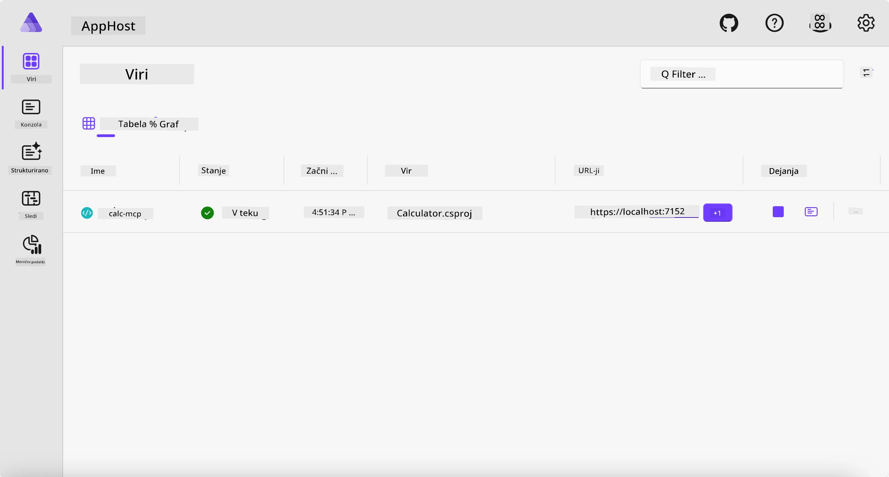
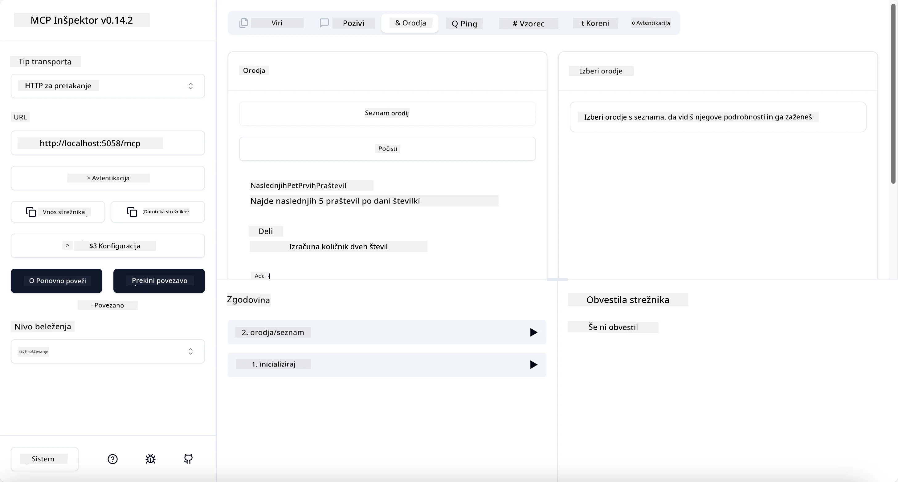
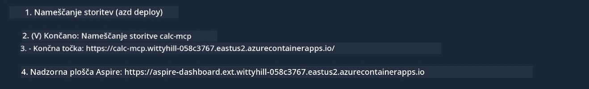

# Primer

Prejšnji primer prikazuje, kako uporabiti lokalni .NET projekt s tipom `stdio`. In kako zagnati strežnik lokalno v vsebniku. To je dobra rešitev v mnogih primerih. Vendar pa je lahko koristno, da strežnik teče na daljavo, na primer v oblaku. Tu pride v poštev tip `http`.

Če pogledamo rešitev v mapi `04-PracticalImplementation`, se lahko zdi veliko bolj zapletena kot prejšnja. A v resnici ni. Če natančno pogledate projekt `src/Calculator`, boste videli, da je večinoma ista koda kot v prejšnjem primeru. Edina razlika je, da uporabljamo drugo knjižnico `ModelContextProtocol.AspNetCore` za obdelavo HTTP zahtevkov. Prav tako spremenimo metodo `IsPrime` v zasebno, da pokažemo, da lahko imate v kodi zasebne metode. Preostanek kode je enak kot prej.

Drugi projekti so iz [.NET Aspire](https://learn.microsoft.com/dotnet/aspire/get-started/aspire-overview). Vključitev .NET Aspire v rešitev izboljša izkušnjo razvijalca med razvojem in testiranjem ter pomaga pri opazovanju. Ni nujno za zagon strežnika, vendar je dobra praksa, da ga imate v rešitvi.

## Zaženi strežnik lokalno

1. V VS Code (z razširitvijo C# DevKit) pojdite v mapo `04-PracticalImplementation/samples/csharp`.
1. Zaženite naslednji ukaz za zagon strežnika:

   ```bash
    dotnet watch run --project ./src/AppHost
   ```

1. Ko se v spletnem brskalniku odpre nadzorna plošča .NET Aspire, si zapomnite `http` URL. Moral bi biti nekaj takega kot `http://localhost:5058/`.

   

## Testirajte Streamable HTTP z MCP Inspectorjem

Če imate Node.js 22.7.5 ali novejši, lahko uporabite MCP Inspector za testiranje vašega strežnika.

Zaženite strežnik in v terminalu izvedite naslednji ukaz:

```bash
npx @modelcontextprotocol/inspector http://localhost:5058
```



- Izberite `Streamable HTTP` kot tip transporta.
- V polje Url vnesite prej zabeleženi URL strežnika in dodajte `/mcp`. Moral bi biti `http` (ne `https`), nekaj takega kot `http://localhost:5058/mcp`.
- Kliknite gumb Connect.

Lepa lastnost Inspectorja je, da omogoča dober vpogled v dogajanje.

- Poskusite izpisati razpoložljiva orodja
- Preizkusite nekaj izmed njih, delovati bi moralo kot prej.

## Testirajte MCP strežnik z GitHub Copilot Chat v VS Code

Za uporabo Streamable HTTP transporta z GitHub Copilot Chat spremenite konfiguracijo strežnika `calc-mcp`, ki ste ga ustvarili prej, tako, da bo videti takole:

```jsonc
// .vscode/mcp.json
{
  "servers": {
    "calc-mcp": {
      "type": "http",
      "url": "http://localhost:5058/mcp"
    }
  }
}
```

Naredite nekaj testov:

- Vprašajte za "3 praštevila po 6780". Opazujte, kako Copilot uporabi nova orodja `NextFivePrimeNumbers` in vrne samo prva 3 praštevila.
- Vprašajte za "7 praštevil po 111", da vidite, kaj se zgodi.
- Vprašajte "John ima 24 lizik in jih želi razdeliti med svoje 3 otroke. Koliko lizik dobi vsak otrok?", da vidite, kaj se zgodi.

## Namestite strežnik v Azure

Namestimo strežnik v Azure, da ga lahko uporablja več ljudi.

V terminalu pojdite v mapo `04-PracticalImplementation/samples/csharp` in zaženite naslednji ukaz:

```bash
azd up
```

Ko je namestitev končana, bi morali videti sporočilo, kot je to:



Vzemite URL in ga uporabite v MCP Inspectorju in GitHub Copilot Chatu.

```jsonc
// .vscode/mcp.json
{
  "servers": {
    "calc-mcp": {
      "type": "http",
      "url": "https://calc-mcp.gentleriver-3977fbcf.australiaeast.azurecontainerapps.io/mcp"
    }
  }
}
```

## Kaj sledi?

Preizkušamo različne tipe transporta in orodja za testiranje. Prav tako namestimo vaš MCP strežnik v Azure. Kaj pa, če naš strežnik potrebuje dostop do zasebnih virov? Na primer baze podatkov ali zasebnega API-ja? V naslednjem poglavju bomo videli, kako lahko izboljšamo varnost našega strežnika.

**Omejitev odgovornosti**:  
Ta dokument je bil preveden z uporabo AI prevajalske storitve [Co-op Translator](https://github.com/Azure/co-op-translator). Čeprav si prizadevamo za natančnost, vas opozarjamo, da avtomatizirani prevodi lahko vsebujejo napake ali netočnosti. Izvirni dokument v njegovem izvirnem jeziku velja za avtoritativni vir. Za ključne informacije priporočamo strokovni človeški prevod. Za morebitna nesporazume ali napačne interpretacije, ki izhajajo iz uporabe tega prevoda, ne odgovarjamo.