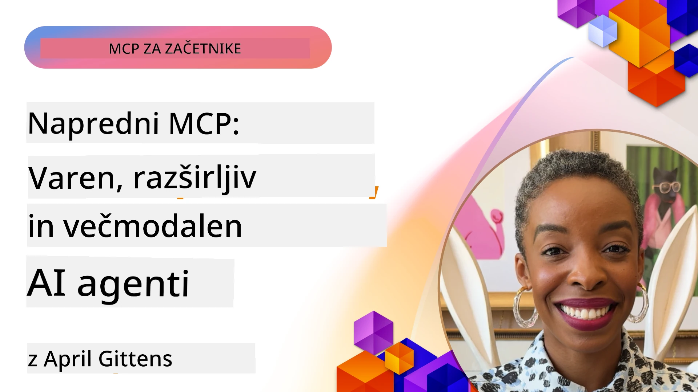

# Napredne teme v MCP

_(Kliknite sliko zgoraj za ogled videoposnetka te lekcije)_

To poglavje pokriva vrsto naprednih tem pri implementaciji protokola Model Context Protocol (MCP), vključno z multimodalno integracijo, razširljivostjo, najboljšimi praksami varnosti in integracijo v podjetjih. Te teme so ključne za gradnjo robustnih in proizvodno pripravljenih MCP aplikacij, ki lahko zadovoljijo zahteve sodobnih AI sistemov.

## Pregled

Ta lekcija raziskuje napredne koncepte implementacije protokola Model Context Protocol, osredotočena na multimodalno integracijo, razširljivost, najboljše prakse varnosti in integracijo v podjetjih. Te teme so bistvene za izdelavo MCP aplikacij proizvodnega razreda, ki lahko obvladujejo zahtevne zahteve v podjetniških okoljih.

## Cilji učenja

Do konca te lekcije boste lahko:

- Implementirali multimodalne zmožnosti znotraj MCP ogrodij
- Oblikovali razširljive MCP arhitekture za scenarije z visoko obremenitvijo
- Uporabili najboljše varnostne prakse usklajene s varnostnimi načeli MCP
- Integrirali MCP z podjetniškimi AI sistemi in ogrodji
- Optimizirali zmogljivost in zanesljivost v proizvodnih okoljih

## Lekcije in vzorčni projekti

| Povezava | Naslov | Opis |
|------|-------|-------------|
| [5.1 Integracija z Azure](./mcp-integration/README.md) | Integracija z Azure | Naučite se, kako integrirati vaš MCP strežnik na Azure |
| [5.2 Vzorčni multimodalni primer](./mcp-multi-modality/README.md) | Vzorci MCP multimodalnosti  | Vzorci za zvočne, slikovne in multimodalne odzive |
| [5.3 MCP OAuth2 primer](../../../05-AdvancedTopics/mcp-oauth2-demo) | MCP OAuth2 demo | Minimalna Spring Boot aplikacija, ki prikazuje OAuth2 z MCP, tako kot strežnik za avtentikacijo in vir. Prikazuje varno izdajo žetonov, zaščitene končne točke, namestitev Azure Container Apps in integracijo z API Management. |
| [5.4 Korenski konteksti](./mcp-root-contexts/README.md) | Korenski konteksti  | Naučite se več o korenskih kontekstih in kako jih implementirati |
| [5.5 Usmerjanje](./mcp-routing/README.md) | Usmerjanje | Naučite se različnih vrst usmerjanja |
| [5.6 Vzorčenje](./mcp-sampling/README.md) | Vzorčenje | Naučite se, kako delati z vzorčenjem |
| [5.7 Prilagajanje velikosti](./mcp-scaling/README.md) | Prilagajanje velikosti  | Naučite se o prilagajanju velikosti |
| [5.8 Varnost](./mcp-security/README.md) | Varnost  | Zagotovite varnost vašega MCP strežnika |
| [5.9 Vzorčni spletni iskalnik](./web-search-mcp/README.md) | Spletno iskanje MCP | Python MCP strežnik in odjemalec, ki se integrira z SerpAPI za iskanje v spletu, novicah, izdelkih in Q&A v realnem času. Prikazuje orkestracijo več orodij, integracijo zunanjih API-jev in robustno obravnavo napak. |
| [5.10 Pretakanje v realnem času](./mcp-realtimestreaming/README.md) | Pretakanje  | Pretakanje podatkov v realnem času je postalo bistveno v današnjem svetu, ki temelji na podatkih, kjer podjetja in aplikacije potrebujejo takojšen dostop do informacij za pravočasne odločitve.|
| [5.11 Spletno iskanje v realnem času](./mcp-realtimesearch/README.md) | Spletno iskanje | Kako MCP transformira spletno iskanje v realnem času z zagotavljanjem standardiziranega pristopa k upravljanju konteksta med AI modeli, iskalniki in aplikacijami.| 
| [5.12 Avtentikacija Entra ID za MCP strežnike](./mcp-security-entra/README.md) | Avtentikacija Entra ID | Microsoft Entra ID zagotavlja robustno identitetno in upravljanje dostopa v oblaku, kar pomaga zagotoviti, da lahko z vašim MCP strežnikom komunicirajo le pooblaščeni uporabniki in aplikacije.|
| [5.13 Integracija Azure AI Foundry agenta](./mcp-foundry-agent-integration/README.md) | Integracija Azure AI Foundry | Naučite se, kako integrirati MCP strežnike z Azure AI Foundry agenti, kar omogoča močno orkestracijo orodij in zmogljivosti podjetniške umetne inteligence s standardiziranimi povezavami do zunanjih virov podatkov.|
| [5.14 Inženiring konteksta](./mcp-contextengineering/README.md) | Inženiring konteksta | Prihodnje priložnosti tehnik inženiringa konteksta za MCP strežnike, vključno z optimizacijo konteksta, dinamičnim upravljanjem konteksta in strategijami za učinkovito načrtovanje pozivov znotraj MCP ogrodij.|
| [5.15 Prilagojeni transport MCP](./mcp-transport/README.md) | Prilagojen transport | Naučite se, kako implementirati prilagojene transportne mehanizme za specializirane komunikacijske scenarije MCP.|
| [5.16 Podroben pregled funkcij protokola](./mcp-protocol-features/README.md) | Funkcije protokola | Obvladajte napredne funkcije protokola, vključno z obvestili o napredku, preklicem zahtev, predlogami virov in vzorci za obravnavo napak.|

> **Novost v MCP specifikaciji 2025-11-25**: specifikacija sedaj vključuje eksperimentalno podporo za **Opravila** (dolgotrajne operacije s sledenjem napredka), **Oznake orodij** (metapodatki o vedenju orodja za varnost), **URL način izklicevanja** (zahtevanje specifične vsebine URL od odjemalcev) in izboljšane **Korenine** (za upravljanje konteksta delovnega prostora). Za podrobnosti glejte [Dnevnik sprememb MCP specifikacije](https://spec.modelcontextprotocol.io/).

## Dodatni viri

Za najnovejše informacije o naprednih temah MCP, si oglejte:  
- [Dokumentacija MCP](https://modelcontextprotocol.io/)  
- [Specifikacija MCP (2025-11-25)](https://spec.modelcontextprotocol.io/specification/2025-11-25/)  
- [GitHub repozitorij](https://github.com/modelcontextprotocol)  
- [OWASP MCP Top 10](https://microsoft.github.io/mcp-azure-security-guide/mcp/) - varnostna tveganja in ublažitve  
- [Delavnica MCP varnostnega vrha (Sherpa)](https://azure-samples.github.io/sherpa/) - praktična varnostna usposabljanja

## Ključne ugotovitve

- Multimodalne implementacije MCP razširjajo AI zmožnosti onkraj obdelave besedila  
- Razširljivost je bistvena za podjetniške namestitve in jo je mogoče reševati z vodoravnim in navpičnim prilagajanjem  
- Celoviti varnostni ukrepi ščitijo podatke in zagotavljajo ustrezen nadzor dostopa  
- Podjetniška integracija s platformami, kot so Azure OpenAI in Microsoft AI Foundry, izboljšuje zmogljivosti MCP  
- Napredne izvedbe MCP koristijo od optimiziranih arhitektur in previdnega upravljanja virov

## Vaja

Oblikujte podjetniško implementacijo MCP za specifičen primer uporabe:

1. Prepoznajte multimodalne zahteve za vaš primer uporabe  
2. Opišite potrebne varnostne kontrole za zaščito občutljivih podatkov  
3. Oblikujte razširljivo arhitekturo, ki lahko obvladuje spremenljivo obremenitev  
4. Načrtujte integracijske točke s podjetniškimi AI sistemi  
5. Dokumentirajte potencialne ozka grla glede zmogljivosti in strategije za njihovo preprečevanje

## Dodatni viri

- [Dokumentacija Azure OpenAI](https://learn.microsoft.com/en-us/azure/ai-services/openai/)  
- [Dokumentacija Microsoft AI Foundry](https://learn.microsoft.com/en-us/ai-services/)  

---

## Kaj sledi

Raziščite lekcije v tem modulu, začenši z: [5.1 MCP integracija](./mcp-integration/README.md)

Ko zaključite ta modul, nadaljujte na: [Modul 6: Prispevki skupnosti](../06-CommunityContributions/README.md)

---

<!-- CO-OP TRANSLATOR DISCLAIMER START -->
**Izjava o omejitvi odgovornosti**:
Ta dokument je bil preveden z uporabo AI prevajalske storitve [Co-op Translator](https://github.com/Azure/co-op-translator). Čeprav si prizadevamo za natančnost, vas opozarjamo, da lahko avtomatizirani prevodi vsebujejo napake ali netočnosti. Izvirni dokument v njegovem izvirnem jeziku velja za avtoritativni vir. Za kritične informacije priporočamo strokovni človeški prevod. Za kakršne koli nesporazume ali napačne interpretacije, ki izhajajo iz uporabe tega prevoda, ne prevzemamo odgovornosti.
<!-- CO-OP TRANSLATOR DISCLAIMER END -->