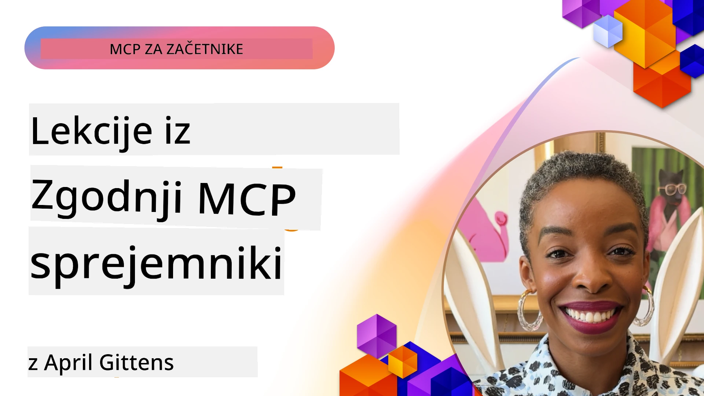

# 🌟 Lekcije zgodnjih uporabnikov

[](https://youtu.be/jds7dSmNptE)

_(Kliknite na zgornjo sliko za ogled videa te lekcije)_

## 🎯 Kaj ta modul pokriva

Ta modul raziskuje, kako resnične organizacije in razvijalci uporabljajo Model Context Protocol (MCP) za reševanje dejanskih izzivov in spodbujanje inovacij. S pomočjo podrobnih študij primerov, praktičnih projektov in primerov boste odkrili, kako MCP omogoča varno, razširljivo integracijo AI, ki povezuje jezikovne modele, orodja in poslovne podatke.

### 📚 Oglejte si MCP v akciji

Želite videti, kako te principe uporabiti v proizvodnih orodjih? Oglejte si naš [**10 Microsoft MCP strežnikov, ki spreminjajo produktivnost razvijalcev**](microsoft-mcp-servers.md), ki prikazuje resnične Microsoft MCP strežnike, ki jih lahko uporabite danes.

## Pregled

Ta lekcija raziskuje, kako so zgodnji uporabniki izkoristili Model Context Protocol (MCP) za reševanje resničnih izzivov in spodbujanje inovacij v različnih panogah. S pomočjo podrobnih študij primerov in praktičnih projektov boste videli, kako MCP omogoča standardizirano, varno in razširljivo integracijo AI — povezovanje velikih jezikovnih modelov, orodij in poslovnih podatkov v enotnem okviru. Pridobili boste praktične izkušnje z načrtovanjem in gradnjo rešitev na osnovi MCP, se naučili preizkušenih vzorcev implementacije ter odkrili najboljše prakse za uvajanje MCP v proizvodno okolje. Lekcija prav tako izpostavlja nastajajoče trende, prihodnje smernice in odprtokodne vire, ki vam bodo pomagali ostati na čelu tehnologije MCP in njenega razvijajočega se ekosistema.

## Cilji učenja

- Analizirati izvedbe MCP v resničnem svetu v različnih panogah  
- Načrtovati in zgraditi celovite aplikacije na osnovi MCP  
- Raziskati nastajajoče trende in prihodnje smernice tehnologije MCP  
- Uporabiti najboljše prakse v dejanskih razvojnih scenarijih

## Izvedbe MCP v resničnem svetu

### Študija primera 1: Avtomatizacija podpore strankam v podjetju

Multinacionalno podjetje je uvedlo rešitev na osnovi MCP za standardizacijo interakcij AI v njihovih sistemih za podporo strankam. To jim je omogočilo:

- Ustvariti enoten vmesnik za več ponudnikov LLM  
- Ohranjati dosledno upravljanje pozivov v različnih oddelkih  
- Izvajati stroge varnostne in skladnostne kontrole  
- Enostavno preklapljati med različnimi AI modeli glede na posebne potrebe  

**Tehnična implementacija:**

```python
# Izvedba MCP strežnika v Pythonu za podporo strankam
import logging
import asyncio
from modelcontextprotocol import create_server, ServerConfig
from modelcontextprotocol.server import MCPServer
from modelcontextprotocol.transports import create_http_transport
from modelcontextprotocol.resources import ResourceDefinition
from modelcontextprotocol.prompts import PromptDefinition
from modelcontextprotocol.tool import ToolDefinition

# Konfiguriraj beleženje
logging.basicConfig(level=logging.INFO)

async def main():
    # Ustvari konfiguracijo strežnika
    config = ServerConfig(
        name="Enterprise Customer Support Server",
        version="1.0.0",
        description="MCP server for handling customer support inquiries"
    )
    
    # Inicializiraj MCP strežnik
    server = create_server(config)
    
    # Registriraj vire baze znanja
    server.resources.register(
        ResourceDefinition(
            name="customer_kb",
            description="Customer knowledge base documentation"
        ),
        lambda params: get_customer_documentation(params)
    )
    
    # Registriraj predloge za pozive
    server.prompts.register(
        PromptDefinition(
            name="support_template",
            description="Templates for customer support responses"
        ),
        lambda params: get_support_templates(params)
    )
    
    # Registriraj podporna orodja
    server.tools.register(
        ToolDefinition(
            name="ticketing",
            description="Create and update support tickets"
        ),
        handle_ticketing_operations
    )
    
    # Zaženi strežnik s HTTP prenosom
    transport = create_http_transport(port=8080)
    await server.run(transport)

if __name__ == "__main__":
    asyncio.run(main())
```
  
**Rezultati:** 30 % znižanje stroškov modelov, 45 % izboljšanje konsistence odgovorov in izboljšana skladnost v globalnih operacijah.

### Študija primera 2: Diagnostični pomočnik v zdravstvu

Zdravstveni izvajalec je razvil infrastrukturo MCP za integracijo več specializiranih medicinskih AI modelov ob hkratnem zagotavljanju zaščite občutljivih podatkov pacientov:

- Brezhibno preklapljanje med splošnimi in specialističnimi medicinskimi modeli  
- Strogi nadzor zasebnosti in revizijske sledi  
- Integracija z obstoječimi sistemi elektronskih zdravstvenih kartonov (EHR)  
- Dosledna zasnova pozivov za medicinsko terminologijo  

**Tehnična implementacija:**

```csharp
// C# MCP host application implementation in healthcare application
using Microsoft.Extensions.DependencyInjection;
using ModelContextProtocol.SDK.Client;
using ModelContextProtocol.SDK.Security;
using ModelContextProtocol.SDK.Resources;

public class DiagnosticAssistant
{
    private readonly MCPHostClient _mcpClient;
    private readonly PatientContext _patientContext;
    
    public DiagnosticAssistant(PatientContext patientContext)
    {
        _patientContext = patientContext;
        
        // Configure MCP client with healthcare-specific settings
        var clientOptions = new ClientOptions
        {
            Name = "Healthcare Diagnostic Assistant",
            Version = "1.0.0",
            Security = new SecurityOptions
            {
                Encryption = EncryptionLevel.Medical,
                AuditEnabled = true
            }
        };
        
        _mcpClient = new MCPHostClientBuilder()
            .WithOptions(clientOptions)
            .WithTransport(new HttpTransport("https://healthcare-mcp.example.org"))
            .WithAuthentication(new HIPAACompliantAuthProvider())
            .Build();
    }
    
    public async Task<DiagnosticSuggestion> GetDiagnosticAssistance(
        string symptoms, string patientHistory)
    {
        // Create request with appropriate resources and tool access
        var resourceRequest = new ResourceRequest
        {
            Name = "patient_records",
            Parameters = new Dictionary<string, object>
            {
                ["patientId"] = _patientContext.PatientId,
                ["requestingProvider"] = _patientContext.ProviderId
            }
        };
        
        // Request diagnostic assistance using appropriate prompt
        var response = await _mcpClient.SendPromptRequestAsync(
            promptName: "diagnostic_assistance",
            parameters: new Dictionary<string, object>
            {
                ["symptoms"] = symptoms,
                patientHistory = patientHistory,
                relevantGuidelines = _patientContext.GetRelevantGuidelines()
            });
            
        return DiagnosticSuggestion.FromMCPResponse(response);
    }
}
```
  
**Rezultati:** Izboljšani diagnostični predlogi za zdravnike ob polni skladnosti s HIPAA ter znatno zmanjšanje preklapljanja med sistemi.

### Študija primera 3: Analiza tveganj v finančnih storitvah

Finančna ustanova je implementirala MCP za standardizacijo procesov analize tveganj v različnih oddelkih:

- Ustvarjen enoten vmesnik za modele tveganj kreditov, odkrivanja prevar in investicijskih tveganj  
- Izvedeni strogi nadzori dostopa in različice modelov  
- Zagotovljena revizijska sled vseh AI priporočil  
- Ohranjena dosledna oblikovanja podatkov med različnimi sistemi  

**Tehnična implementacija:**

```java
// Java MCP strežnik za ocenjevanje finančnega tveganja
import org.mcp.server.*;
import org.mcp.security.*;

public class FinancialRiskMCPServer {
    public static void main(String[] args) {
        // Ustvari MCP strežnik z lastnostmi finančne skladnosti
        MCPServer server = new MCPServerBuilder()
            .withModelProviders(
                new ModelProvider("risk-assessment-primary", new AzureOpenAIProvider()),
                new ModelProvider("risk-assessment-audit", new LocalLlamaProvider())
            )
            .withPromptTemplateDirectory("./compliance/templates")
            .withAccessControls(new SOCCompliantAccessControl())
            .withDataEncryption(EncryptionStandard.FINANCIAL_GRADE)
            .withVersionControl(true)
            .withAuditLogging(new DatabaseAuditLogger())
            .build();
            
        server.addRequestValidator(new FinancialDataValidator());
        server.addResponseFilter(new PII_RedactionFilter());
        
        server.start(9000);
        
        System.out.println("Financial Risk MCP Server running on port 9000");
    }
}
```
  
**Rezultati:** Izboljšana zakonodajna skladnost, 40 % hitrejši cikli uvajanja modelov in izboljšana konsistentnost ocenjevanja tveganj med oddelki.

### Študija primera 4: Microsoft Playwright MCP strežnik za avtomatizacijo brskalnika

Microsoft je razvil [Playwright MCP strežnik](https://github.com/microsoft/playwright-mcp), ki omogoča varno, standardizirano avtomatizacijo brskalnika preko Model Context Protocol. Ta proizvodno pripravljen strežnik omogoča agentom AI in LLM-jem interakcijo z brskalniki na nadzorovan, reviziran in razširljiv način — omogoča primere uporabe, kot so avtomatizirano spletno testiranje, izločanje podatkov in celoviti poteki dela.

> **🎯 Proizvodno pripravljeno orodje**  
>  
> Ta študija primera prikazuje resnični MCP strežnik, ki ga lahko uporabite danes! Več o Playwright MCP strežniku in devetih drugih proizvodno pripravljenih Microsoft MCP strežnikih si preberite v našem [**Vodniku Microsoft MCP strežnikov**](microsoft-mcp-servers.md#8--playwright-mcp-server).

**Glavne značilnosti:**  
- Izpostavlja zmogljivosti avtomatizacije brskalnika (navigacija, izpolnjevanje obrazcev, zajem zaslonskih posnetkov itd.) kot MCP orodja  
- Izvaja stroge kontrole dostopa in peskovnik za preprečevanje nepooblaščenih dejanj  
- Zagotavlja podrobne revizijske zapise vseh interakcij z brskalnikom  
- Podpira integracijo z Azure OpenAI in drugimi ponudniki LLM za avtomatizacijo, ki jo upravljajo agenti  
- Poganja GitHub Copilot Coding Agenta z zmogljivostmi spletnega brskanja

**Tehnična implementacija:**

```typescript
// TypeScript: Registracija Playwright orodij za avtomatizacijo brskalnika v MCP strežniku
import { createServer, ToolDefinition } from 'modelcontextprotocol';
import { launch } from 'playwright';

const server = createServer({
  name: 'Playwright MCP Server',
  version: '1.0.0',
  description: 'MCP server for browser automation using Playwright'
});

// Registrirajte orodje za navigacijo do URL-ja in zajem zaslona
server.tools.register(
  new ToolDefinition({
    name: 'navigate_and_screenshot',
    description: 'Navigate to a URL and capture a screenshot',
    parameters: {
      url: { type: 'string', description: 'The URL to visit' }
    }
  }),
  async ({ url }) => {
    const browser = await launch();
    const page = await browser.newPage();
    await page.goto(url);
    const screenshot = await page.screenshot();
    await browser.close();
    return { screenshot };
  }
);

// Zaženite MCP strežnik
server.listen(8080);
```
  
**Rezultati:**

- Omogočena varna, programska avtomatizacija brskalnikov za AI agente in LLM-je  
- Zmanjšani ročni testi in izboljšano pokritje testov za spletne aplikacije  
- Zagotovljen ponovno uporaben, razširljiv okvir integracije orodij na osnovi brskalnika v poslovnih okoljih  
- Poganja zmogljivosti spletnega brskanja GitHub Copilot

**Reference:**

- [GitHub repozitorij Playwright MCP strežnika](https://github.com/microsoft/playwright-mcp)  
- [Microsoft rešitve za AI in avtomatizacijo](https://azure.microsoft.com/en-us/products/ai-services/)

### Študija primera 5: Azure MCP – Podjetniška izvedba Model Context Protocol kot storitve

Azure MCP strežnik ([https://aka.ms/azmcp](https://aka.ms/azmcp)) je upravljana, podjetniška izvedba Model Context Protocol, ki omogoča skalabilne, varne in skladne zmogljivosti MCP strežnikov kot oblačne storitve. Azure MCP omogoča organizacijam hitro uvajanje, upravljanje in integracijo MCP strežnikov z Azure AI, podatkovnimi in varnostnimi storitvami, zmanjšuje operativno breme in pospešuje uporabo AI.

> **🎯 Proizvodno pripravljeno orodje**  
>  
> To je resnični MCP strežnik, ki ga lahko uporabite danes! Več o Azure AI Foundry MCP strežniku si preberite v našem [**Vodniku Microsoft MCP strežnikov**](microsoft-mcp-servers.md).

- Popolnoma upravljano gostovanje MCP strežnikov z vgrajenim skaliranjem, nadzorom in varnostjo  
- Naravna integracija z Azure OpenAI, Azure AI Search in drugimi Azure storitvami  
- Podjetniška avtentikacija in avtorizacija preko Microsoft Entra ID  
- Podpora za lastna orodja, predloge pozivov in povezovalce virov  
- Skladnost s podjetniškimi varnostnimi in regulatornimi zahtevami  

**Tehnična implementacija:**

```yaml
# Example: Azure MCP server deployment configuration (YAML)
apiVersion: mcp.microsoft.com/v1
kind: McpServer
metadata:
  name: enterprise-mcp-server
spec:
  modelProviders:
    - name: azure-openai
      type: AzureOpenAI
      endpoint: https://<your-openai-resource>.openai.azure.com/
      apiKeySecret: <your-azure-keyvault-secret>
  tools:
    - name: document_search
      type: AzureAISearch
      endpoint: https://<your-search-resource>.search.windows.net/
      apiKeySecret: <your-azure-keyvault-secret>
  authentication:
    type: EntraID
    tenantId: <your-tenant-id>
  monitoring:
    enabled: true
    logAnalyticsWorkspace: <your-log-analytics-id>
```
  
**Rezultati:**  
- Zmanjšan čas do vrednosti za podjetniške AI projekte s zagotavljanjem takoj uporabne, skladne MCP strežniške platforme  
- Poenostavljena integracija LLM-jev, orodij in podjetniških virov podatkov  
- Izboljšana varnost, opaznost in operativna učinkovitost za MCP naloge  
- Izboljšana kakovost kode z najboljšimi praksami Azure SDK in sodobnimi avtentikacijskimi vzorci

**Reference:**  
- [Dokumentacija Azure MCP](https://aka.ms/azmcp)  
- [GitHub repozitorij Azure MCP strežnika](https://github.com/Azure/azure-mcp)  
- [Azure AI storitve](https://azure.microsoft.com/en-us/products/ai-services/)  
- [Microsoft MCP Center](https://mcp.azure.com)

## Študija primera 6: NLWeb  
MCP (Model Context Protocol) je nastajajoči protokol za klepetalne bote in AI asistente za interakcijo z orodji. Vsak primer NLWeb je tudi MCP strežnik, ki podpira eno osnovno metodo, ask, ki se uporablja za postavljanje vprašanj spletnim mestom v naravnem jeziku. Vrnjen odgovor uporablja schema.org, široko uporabljan nabor izrazov za opis spletnih podatkov. Sprostano rečeno, MCP je NLWeb kot HTTP je za HTML. NLWeb združuje protokole, formate schema.org in vzorčno kodo za hitro ustvarjanje teh končnih točk, kar koristi tako ljudem preko pogovornih vmesnikov kot strojem preko naravne interakcije agent-agent.

NLWeb ima dve različni komponenti.  
- Protokol, zelo preprost za začetek, za vmesnik s spletno stranjo v naravnem jeziku in format, ki uporablja json in schema.org za vrnjen odgovor. Več podrobnosti najdete v dokumentaciji REST API.  
- Enostavna implementacija (1), ki uporablja obstoječo označevanje za spletna mesta, ki jih je mogoče povzemati kot sezname predmetov (izdelki, recepti, znamenitosti, ocene itd.). Skupaj z naborom uporabniških vmesnikov lahko spletna mesta enostavno zagotovijo pogovorne vmesnike za svojo vsebino. Več podrobnosti o življenju poizvedbe v klepetu najdete v dokumentaciji.

**Reference:**  
- [Dokumentacija Azure MCP](https://aka.ms/azmcp)  
- [NLWeb](https://github.com/microsoft/NlWeb)

### Študija primera 7: Azure AI Foundry MCP strežnik – Integracija podjetniških AI agentov

Azure AI Foundry MCP strežniki prikazujejo, kako se MCP lahko uporablja za orkestracijo in upravljanje AI agentov ter potekov dela v podjetniških okoljih. Z integracijo MCP z Azure AI Foundry lahko organizacije standardizirajo interakcije agentov, izkoristijo upravljanje potekov dela Foundry in zagotovijo varne, razširljive uvajanja.

> **🎯 Proizvodno pripravljeno orodje**  
>  
> To je resnični MCP strežnik, ki ga lahko uporabite danes! Več o Azure AI Foundry MCP strežniku si preberite v našem [**Vodniku Microsoft MCP strežnikov**](microsoft-mcp-servers.md#9--azure-ai-foundry-mcp-server).

**Glavne značilnosti:**  
- Celovit dostop do Azure AI ekosistema, vključno s katalozi modelov in upravljanjem uvajanja  
- Indeksiranje znanja z Azure AI Search za RAG aplikacije  
- Orodja za evalvacijo AI modelov in zagotavljanje kakovosti  
- Integracija z Azure AI Foundry katalogom in laboratoriji za najnovejše raziskovalne modele  
- Upravljanje agentov in možnosti evalvacije za proizvodne scenarije

**Rezultati:**  
- Hitro prototipiranje in robustno spremljanje potekov dela AI agentov  
- Brezhibna integracija z Azure AI storitvami za napredne scenarije  
- Enoten vmesnik za gradnjo, uvajanje in spremljanje agentovih potekov  
- Izboljšana varnost, skladnost in operativna učinkovitost za podjetja  
- Pospešena uporaba AI ob ohranitvi nadzora nad kompleksnimi procesi, ki jih upravljajo agenti

**Reference:**  
- [GitHub repozitorij Azure AI Foundry MCP strežnika](https://github.com/azure-ai-foundry/mcp-foundry)  
- [Integracija Azure AI agentov z MCP (Microsoft Foundry Blog)](https://devblogs.microsoft.com/foundry/integrating-azure-ai-agents-mcp/)

### Študija primera 8: Foundry MCP Playground – Eksperimentiranje in prototipiranje

Foundry MCP Playground nudi okolje, pripravljeno za uporabo, za eksperimentiranje s MCP strežniki in integracijo Azure AI Foundry. Razvijalci lahko hitro prototipirajo, testirajo in ocenjujejo AI modele ter poteke agentov z viri iz Azure AI Foundry kataloga in laboratorijev. Playground poenostavlja namestitev, ponuja vzorčne projekte in podpira sodelovalni razvoj, kar omogoča enostavno raziskovanje najboljših praks in novih scenarijev z minimalnim stroškom. Posebej je uporaben za ekipe, ki želijo potrditi ideje, deliti eksperimente in pospešiti učenje brez potrebe po kompleksni infrastrukturi. Zniža ovire za vstop ter spodbuja inovacije in prispevke skupnosti v MCP in Azure AI Foundry ekosistemu.

**Reference:**

- [GitHub repozitorij Foundry MCP Playground](https://github.com/azure-ai-foundry/foundry-mcp-playground)

### Študija primera 9: Microsoft Learn Docs MCP strežnik – Dostop do dokumentacije z AI

Microsoft Learn Docs MCP strežnik je oblačna storitev, ki AI asistentom omogoča dostop v realnem času do uradne Microsoft dokumentacije prek Model Context Protocol. Ta proizvodno pripravljen strežnik se povezuje s celovitim Microsoft Learn ekosistemom in omogoča semantično iskanje prek vseh uradnih Microsoft virov.

> **🎯 Proizvodno pripravljeno orodje**  
>  
> To je resnični MCP strežnik, ki ga lahko uporabite danes! Več o Microsoft Learn Docs MCP strežniku si preberite v našem [**Vodniku Microsoft MCP strežnikov**](microsoft-mcp-servers.md#1--microsoft-learn-docs-mcp-server).

**Glavne značilnosti:**  
- Dostop v realnem času do uradne Microsoft dokumentacije, Azure dokumentacije in Microsoft 365 dokumentacije  
- Napredne zmogljivosti semantičnega iskanja, ki razumeta kontekst in namen  
- Vedno posodobljene informacije, saj se vsebine Microsoft Learn sproti objavljajo  
- Celovito pokritje skozi Microsoft Learn, Azure dokumentacijo in Microsoft 365 vire  
- Vračanje do 10 kakovostnih vsebinskih izsekov z naslovi člankov in URL-ji

**Zakaj je to ključno:**  
- Rešuje problem "zastarelega znanja AI" za Microsoftove tehnologije  
- Zagotavlja AI asistentom dostop do najnovejših funkcij .NET, C#, Azure in Microsoft 365  
- Nudi avtoritativne, zanesljive informacije za natančno generiranje kode  
- Nujno za razvijalce, ki delajo z hitro razvijajočimi se Microsoft tehnologijami

**Rezultati:**  
- Drastično izboljšana natančnost AI-generirane kode za Microsoftove tehnologije  
- Zmanjšan čas iskanja aktualne dokumentacije in najboljših praks  
- Izboljšana produktivnost razvijalcev z dostopom do kontekstualno ozaveščene dokumentacije  
- Brezšivna integracija v razvojne tokove brez zapuščanja IDE

**Reference:**  
- [GitHub repozitorij Microsoft Learn Docs MCP strežnika](https://github.com/MicrosoftDocs/mcp)  
- [Microsoft Learn dokumentacija](https://learn.microsoft.com/)

## Praktični projekti

### Projekt 1: Zgradite MCP strežnik z več ponudniki

**Cilj:** Ustvariti MCP strežnik, ki lahko usmerja zahteve do več ponudnikov AI modelov glede na določena merila.

**Zahteve:**  

- Podpora vsaj trem različnim ponudnikom modelov (npr. OpenAI, Anthropic, lokalni modeli)  
- Implementacija mehanizma usmerjanja na podlagi metapodatkov zahtevka  
- Ustvarjanje konfiguracijskega sistema za upravljanje poverilnic ponudnikov  
- Dodajanje predpomnjenja za optimizacijo zmogljivosti in stroškov  
- Izgradnja preprostega nadzornega panela za spremljanje uporabe  

**Koraki implementacije:**  

1. Postavitev osnovne infrastrukture MCP strežnika  
2. Implementacija adapterjev ponudnikov za vsako storitev AI modelov  
3. Ustvarjanje logike usmerjanja na podlagi atributov zahtevka  
4. Dodajanje mehanizmov predpomnjenja za pogosto uporabljene zahtevke  
5. Razvoj nadzornega panela za spremljanje  
6. Testiranje z različnimi vzorci zahtevkov  

**Tehnologije:** Izberite med Python (.NET/Java/Python glede na vašo željo), Redis za predpomnjenje in preprost spletni okvir za nadzorni panel.

### Projekt 2: Podjetniški sistem upravljanja pozivov
**Cilj:** Razviti sistem na osnovi MCP za upravljanje, verzioniranje in uvajanje predlog pozivov v organizaciji.

**Zahteve:**

- Ustvariti osrednji repozitorij za predloge pozivov
- Implementirati verzioniranje in odobritvene delovne tokove
- Zgraditi zmogljivosti testiranja predlog z vzorčnimi vnosi
- Razviti nadzore dostopa na podlagi vlog
- Ustvariti API za pridobivanje in uvajanje predlog

**Koraki implementacije:**

1. Oblikovati shemo baze podatkov za shranjevanje predlog
2. Ustvariti osnovni API za operacije CRUD s predlogami
3. Implementirati sistem verzioniranja
4. Zgraditi odobritveni delovni tok
5. Razviti testni okvir
6. Ustvariti preprosto spletno vmesnik za upravljanje
7. Integrirati s strežnikom MCP

**Tehnologije:** Vaša izbira ogrodja za zaledje, SQL ali NoSQL baza podatkov in ogrodje za spletni vmesnik za upravljanje.

### Projekt 3: Plattform za generiranje vsebin na osnovi MCP

**Cilj:** Zgraditi platformo za generiranje vsebin, ki izkorišča MCP za zagotavljanje doslednih rezultatov za različne vrste vsebin.

**Zahteve:**

- Podpora za več vsebinskih formatov (blogi, družbena omrežja, marketinški teksti)
- Implementacija generiranja na osnovi predlog z možnostmi prilagoditve
- Ustvariti sistem pregleda vsebin in povratnih informacij
- Spremljati metrike uspešnosti vsebin
- Podpora verzioniranju in iteracijam vsebin

**Koraki implementacije:**

1. Nastaviti infrastrukturo MCP odjemalca
2. Ustvariti predloge za različne vrste vsebin
3. Zgraditi cevovod za generiranje vsebin
4. Implementirati sistem za pregled
5. Razviti sistem za spremljanje metrik
6. Ustvariti uporabniški vmesnik za upravljanje predlog in generiranje vsebin

**Tehnologije:** Vaš izbrani programski jezik, spletno ogrodje in sistem baze podatkov.

## Prihodnje smernice za tehnologijo MCP

### Pojavnih trendov

1. **Večmodalni MCP**
   - Razširitev MCP za standardizacijo interakcij z modeli slik, zvoka in videa
   - Razvoj zmožnosti medmodalnega sklepanje
   - Standardizirani formati pozivov za različne modalitete

2. **Federirana infrastruktura MCP**
   - Distribuirana MCP omrežja, ki lahko delijo vire med organizacijami
   - Standardizirani protokoli za varno deljenje modelov
   - Tehnike izračunov za varovanje zasebnosti

3. **Tržnice MCP**
   - Ekosistemi za deljenje in monetizacijo MCP predlog in vtičnikov
   - Procesi zagotavljanja kakovosti in certificiranja
   - Integracija s tržnicami modelov

4. **MCP za robno računalništvo**
   - Prilagoditev MCP standardov za robne naprave z omejenimi viri
   - Optimizirani protokoli za okolja z nizko prepustnostjo
   - Specializirane implementacije MCP za IoT ekosisteme

5. **Regulatorni okvirji**
   - Razvoj razširitev MCP za skladnost z zakonodajo
   - Standardizirani revizijski sledovi in vmesniki za razložljivost
   - Integracija z nastajajočimi okviri za upravljanje umetne inteligence

### Rešitve MCP podjetja Microsoft

Microsoft in Azure sta razvila več odprtokodnih repozitorijev za pomoč razvijalcem pri implementaciji MCP v različnih scenarijih:

#### Microsoft Organizacija

1. [playwright-mcp](https://github.com/microsoft/playwright-mcp) - Playwright MCP strežnik za avtomatizacijo in testiranje brskalnika
2. [files-mcp-server](https://github.com/microsoft/files-mcp-server) - OneDrive MCP strežnik za lokalno testiranje in prispevke skupnosti
3. [NLWeb](https://github.com/microsoft/NlWeb) - NLWeb je zbirka odprtih protokolov in povezanih odprtokodnih orodij. Njegov glavni fokus je vzpostavitev temeljne plasti za AI splet

#### Azure-Samples Organizacija

1. [mcp](https://github.com/Azure-Samples/mcp) - Povezave do vzorcev, orodij in virov za gradnjo in integracijo MCP strežnikov na Azure z več programskimi jeziki
2. [mcp-auth-servers](https://github.com/Azure-Samples/mcp-auth-servers) - Referenčni MCP strežniki, ki prikazujejo avtentikacijo z uporabo trenutne specifikacije Model Context Protocol
3. [remote-mcp-functions](https://github.com/Azure-Samples/remote-mcp-functions) - Uvodna stran za implementacije oddaljenih MCP strežnikov v Azure Functions z povezavami do repozitorijev za posamezne jezike
4. [remote-mcp-functions-python](https://github.com/Azure-Samples/remote-mcp-functions-python) - Predloga za hitro začetek gradnje in uvajanja prilagojenih oddaljenih MCP strežnikov v Azure Functions s Pythonom
5. [remote-mcp-functions-dotnet](https://github.com/Azure-Samples/remote-mcp-functions-dotnet) - Predloga za hitro začetek gradnje in uvajanja prilagojenih oddaljenih MCP strežnikov v Azure Functions z .NET/C#
6. [remote-mcp-functions-typescript](https://github.com/Azure-Samples/remote-mcp-functions-typescript) - Predloga za hitro začetek gradnje in uvajanja prilagojenih oddaljenih MCP strežnikov v Azure Functions s TypeScriptom
7. [remote-mcp-apim-functions-python](https://github.com/Azure-Samples/remote-mcp-apim-functions-python) - Azure API Management kot AI prehod do oddaljenih MCP strežnikov s Pythonom
8. [AI-Gateway](https://github.com/Azure-Samples/AI-Gateway) - Eksperimenti APIM ❤️ AI vključujoč funkcionalnosti MCP, integracijo z Azure OpenAI in AI Foundry

Ti repozitoriji ponujajo različne implementacije, predloge in vire za delo s Model Context Protocol v različnih programskih jezikih in Azure storitvah. Pokrivajo širok spekter primerov uporabe od osnovnih implementacij strežnikov do avtentikacije, uvajanja v oblaku in scenarijev integracije za podjetja.

#### MCP imenik virov

[Imenik MCP virov](https://github.com/microsoft/mcp/tree/main/Resources) v uradnem Microsoftovem MCP repozitoriju nudi skrbno izbrano zbirko vzorčnih virov, predlog pozivov in definicij orodij za uporabo s strežniki Model Context Protocol. Ta imenik je zasnovan za pomoč razvijalcem, da hitro začnejo z MCP s ponujanjem ponovno uporabnih gradnikov in primerov najboljših praks za:

- **Predloge pozivov:** Pripravljenih za uporabo predlog pozivov za pogoste AI naloge in scenarije, ki jih je mogoče prilagoditi za lastne implementacije MCP strežnikov.
- **Definicije orodij:** Primerne schemas in metapodatki orodij za standardizacijo integracije in klica orodij med različnimi MCP strežniki.
- **Vzorčni viri:** Primerne definicije virov za povezovanje z viri podatkov, API-ji in zunanjimi storitvami znotraj strukture MCP.
- **Referenčne implementacije:** Praktični primeri, ki prikazujejo, kako strukturirati in organizirati vire, pozive in orodja v resničnih MCP projektih.

Ti viri pospešujejo razvoj, spodbujajo standardizacijo in pomagajo zagotoviti najboljše prakse pri gradnji in uvajanju rešitev na osnovi MCP.

#### MCP imenik virov

- [MCP viri (vzorec pozivov, orodij in definicij virov)](https://github.com/microsoft/mcp/tree/main/Resources)

### Raziskovalne priložnosti

- Učinkovite tehnike optimizacije pozivov znotraj MCP okvirov
- Varnostni modeli za večnajemniške MCP uvajanja
- Primerjalno merjenje učinkovitosti med različnimi MCP implementacijami
- Formalne metode preverjanja za MCP strežnike

## Zaključek

Model Context Protocol (MCP) hitro oblikuje prihodnost standardizirane, varne in interoperabilne integracije umetne inteligence med industrijami. Skozi študije primerov in praktične projekte v tej lekciji ste videli, kako zgodnji uporabniki — vključno z Microsoftom in Azuro — uporabljajo MCP za reševanje resničnih izzivov, pospeševanje sprejetja AI ter zagotavljanje skladnosti, varnosti in razširljivosti. Modularni pristop MCP omogoča organizacijam povezovanje velikih jezikovnih modelov, orodij in podatkov podjetij v združeni, preverljivi okvir. Ko se MCP še naprej razvija, bo ključnega pomena, da ostanete aktivno vključeni v skupnost, raziskujete odprtokodne vire in uporabljate najboljše prakse za gradnjo robustnih, prihodnosti pripravljenih AI rešitev.

## Dodatni viri

- [MCP Foundry GitHub repozitorij](https://github.com/azure-ai-foundry/mcp-foundry)
- [Foundry MCP Playground](https://github.com/azure-ai-foundry/foundry-mcp-playground)
- [Integracija Azure AI agentov z MCP (Microsoft Foundry Blog)](https://devblogs.microsoft.com/foundry/integrating-azure-ai-agents-mcp/)
- [MCP GitHub repozitorij (Microsoft)](https://github.com/microsoft/mcp)
- [MCP imenik virov (vzorec pozivov, orodij in definicij virov)](https://github.com/microsoft/mcp/tree/main/Resources)
- [Skupnost in dokumentacija MCP](https://modelcontextprotocol.io/introduction)
- [Specifikacija MCP (2025-11-25)](https://spec.modelcontextprotocol.io/specification/2025-11-25/)
- [Azure MCP dokumentacija](https://aka.ms/azmcp)
- [OWASP MCP Top 10](https://microsoft.github.io/mcp-azure-security-guide/mcp/) - Varnostne najboljše prakse
- [Playwright MCP strežnik GitHub repozitorij](https://github.com/microsoft/playwright-mcp)
- [Files MCP strežnik (OneDrive)](https://github.com/microsoft/files-mcp-server)
- [Azure-Samples MCP](https://github.com/Azure-Samples/mcp)
- [MCP Auth strežniki (Azure-Samples)](https://github.com/Azure-Samples/mcp-auth-servers)
- [Remote MCP Functions (Azure-Samples)](https://github.com/Azure-Samples/remote-mcp-functions)
- [Remote MCP Functions Python (Azure-Samples)](https://github.com/Azure-Samples/remote-mcp-functions-python)
- [Remote MCP Functions .NET (Azure-Samples)](https://github.com/Azure-Samples/remote-mcp-functions-dotnet)
- [Remote MCP Functions TypeScript (Azure-Samples)](https://github.com/Azure-Samples/remote-mcp-functions-typescript)
- [Remote MCP APIM Functions Python (Azure-Samples)](https://github.com/Azure-Samples/remote-mcp-apim-functions-python)
- [AI-Gateway (Azure-Samples)](https://github.com/Azure-Samples/AI-Gateway)
- [Microsoft AI in avtomatizacijske rešitve](https://azure.microsoft.com/en-us/products/ai-services/)

## Vaje

1. Analizirajte eno izmed študij primerov in predlagajte alternativni pristop implementacije.
2. Izberite enega izmed projektnih idej in ustvarite podrobno tehnično specifikacijo.
3. Raziskujte industrijo, ki ni pokrita v študijah primerov, in opišite, kako bi MCP lahko naslovil njene specifične izzive.
4. Raziščite eno izmed prihodnjih smernic in ustvarite koncept nove MCP razširitve za podporo temu.

## Kaj sledi

Raziščite več: [Microsoft MCP strežniki](./microsoft-mcp-servers.md)

Nadaljujte na: [Modul 8: Najboljše prakse](../08-BestPractices/README.md)

---

<!-- CO-OP TRANSLATOR DISCLAIMER START -->
**Izjava o omejitvi odgovornosti**:  
Ta dokument je bil preveden z uporabo AI prevajalske storitve [Co-op Translator](https://github.com/Azure/co-op-translator). Čeprav si prizadevamo za natančnost, vas opozarjamo, da avtomatizirani prevodi lahko vsebujejo napake ali nepravilnosti. Izvirni dokument v njegovem izvorni jezik velja za avtoritativni vir. Za pomembne informacije priporočamo strokovni človeški prevod. Za morebitne napačne razlage ali napačne interpretacije, ki izhajajo iz uporabe tega prevoda, ne odgovarjamo.
<!-- CO-OP TRANSLATOR DISCLAIMER END -->