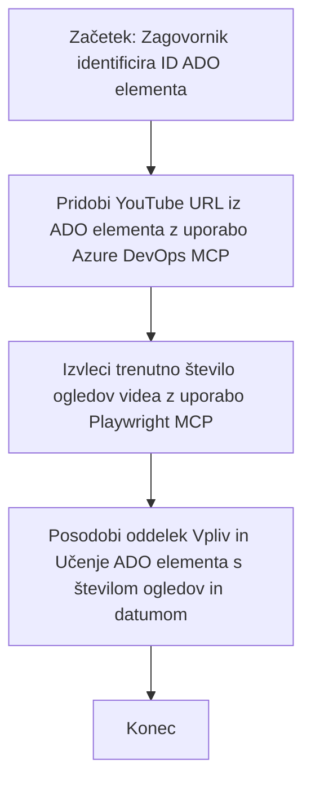

# Študija primera: Posodabljanje elementov Azure DevOps z YouTube podatki z MCP

> **Omejitev odgovornosti:** Obstajajo obstoječa spletna orodja in poročila, ki lahko avtomatizirajo postopek posodabljanja elementov Azure DevOps s podatki s platform, kot je YouTube. Naslednji scenarij je podan zgolj kot vzorčni primer za prikaz, kako je mogoče orodja MCP uporabiti za avtomatizacijo in integracijske naloge.

## Pregled

Ta študija primera prikazuje en primer, kako se lahko Model Context Protocol (MCP) in njegova orodja uporabijo za avtomatizacijo postopka posodabljanja delovnih elementov Azure DevOps (ADO) z informacijami, pridobljenimi s spletnih platform, kot je YouTube. Opisan scenarij je le ena ponazoritev širših zmožnosti teh orodij, ki jih je mogoče prilagoditi mnogim podobnim avtomatizacijskim potrebam.

V tem primeru zagovornik spremlja spletne seje z uporabo elementov ADO, kjer vsak element vsebuje URL video posnetka na YouTubu. Z uporabo orodij MCP lahko zagovornik ohrani elemente ADO ažurne z najnovejšimi meritvami videoposnetka, na primer številom ogledov, na ponovljiv in avtomatiziran način. Ta pristop je mogoče posplošiti na druge primere, kjer je treba informacije iz spletnih virov integrirati v ADO ali druge sisteme.

## Scenarij

Zagovornik je odgovoren za spremljanje vpliva spletnih sej in vključenosti skupnosti. Vsaka seja je zabeležena kot delovni element ADO v projektu 'DevRel', delovni element pa vsebuje polje z URL-jem YouTube videa. Da bi natančno poročal o dosegu seje, mora zagovornik posodobiti element ADO s trenutnim številom ogledov videa in datumom pridobitve teh informacij.

## Uporabljena orodja

- [Azure DevOps MCP](https://github.com/microsoft/azure-devops-mcp): Omogoča programski dostop in posodobitve delovnih elementov ADO prek MCP.
- [Playwright MCP](https://github.com/microsoft/playwright-mcp): Avtomatizira brskalne akcije za pridobivanje živega podatka s spletnih strani, kot so statistike YouTube videov.

## Korak za korakom potek dela

1. **Identificirajte element ADO**: Začnite z ID delovnega elementa ADO (npr. 1234) v projektu 'DevRel'.
2. **Pridobite URL YouTube**: Uporabite orodje Azure DevOps MCP za pridobitev YouTube URL-ja iz delovnega elementa.
3. **Izvlecite število ogledov videa**: Uporabite orodje Playwright MCP za navigacijo do URL-ja YouTube in pridobitev trenutnega števila ogledov.
4. **Posodobite element ADO**: Zapišite najnovejše število ogledov in datum pridobitve v razdelek 'Vpliv in spoznanja' delovnega elementa ADO z uporabo orodja Azure DevOps MCP.

## Primer poziva

```bash
- Work with the ADO Item ID: 1234
- The project is '2025-Awesome'
- Get the YouTube URL for the ADO item
- Use Playwright to get the current views from the YouTube video
- Update the ADO item with the current video views and the updated date of the information
```

## Mermaid diagram poteka


## Tehnična implementacija

- **Orkestracija MCP**: Potek dela orkestrira MCP strežnik, ki usklajuje uporabo orodij Azure DevOps MCP in Playwright MCP.
- **Avtomatizacija**: Postopek se lahko sproži ročno ali pa se ga načrtuje za izvajanje v rednih intervalih, da so elementi ADO vedno ažurni.
- **Razširljivost**: Enak vzorec je mogoče razširiti za posodabljanje elementov ADO z drugimi spletnimi metričnimi podatki (npr. všečki, komentarji) ali z drugih platform.

## Rezultati in vpliv

- **Učinkovitost**: Zmanjšuje ročni trud zagovornikov z avtomatizacijo pridobivanja in posodabljanja video meritev.
- **Natančnost**: Zagotavlja, da elementi ADO odražajo najbolj aktualne podatke, ki so na voljo iz spletnih virov.
- **Ponovljivost**: Ponuja ponovno uporabljiv potek dela za podobne scenarije z drugimi viri podatkov ali meritvami.

## Reference

- [Azure DevOps MCP](https://github.com/microsoft/azure-devops-mcp)
- [Playwright MCP](https://github.com/microsoft/playwright-mcp)
- [Model Context Protocol (MCP)](https://modelcontextprotocol.io/)

## Kaj sledi

- Nazaj na: [Pregled študij primerov](./README.md)
- Naprej: [Pridobivanje dokumentacije v realnem času z MCP](./docs-mcp/README.md)

---

<!-- CO-OP TRANSLATOR DISCLAIMER START -->
**Omejitev odgovornosti**:
Ta dokument je bil preveden z uporabo storitve za strojno prevajanje AI [Co-op Translator](https://github.com/Azure/co-op-translator). Čeprav si prizadevamo za natančnost, vas opozarjamo, da avtomatizirani prevodi lahko vsebujejo napake ali netočnosti. Izvirni dokument v izvirnem jeziku velja za avtoritativni vir. Za kritične informacije priporočamo strokovni človeški prevod. Nismo odgovorni za kakršnekoli nesporazume ali napačne interpretacije, ki lahko nastanejo zaradi uporabe tega prevoda.
<!-- CO-OP TRANSLATOR DISCLAIMER END -->