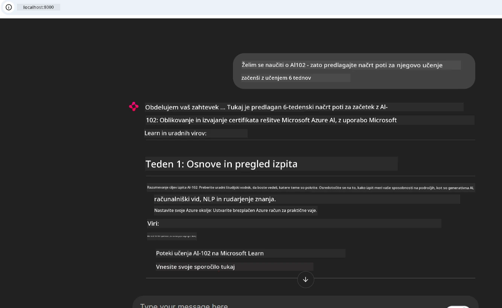
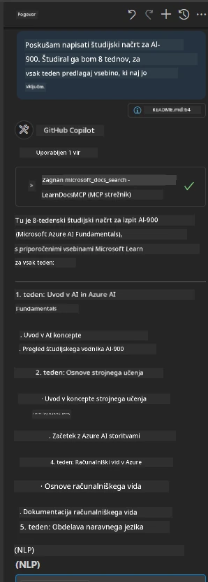

# Študija primera: Povezava s strežnikom Microsoft Learn Docs MCP iz odjemalske aplikacije

Ste se kdaj znašli v situaciji, ko preklapljate med dokumentacijskimi spletnimi mesti, Stack Overflow in neskončnimi zavihki iskalnikov, vse to med reševanjem težave v vaši kodi? Morda imate drug monitor samo za dokumentacijo ali pa ves čas uporabljate alt-tab med vašim IDE in brskalnikom. Ali ne bi bilo bolje, če bi lahko dokumentacijo prinesli neposredno v svoj potek dela—integrirano v vaše aplikacije, vaš IDE ali celo lastna orodja? V tej študiji primera bomo raziskali, kako točno to narediti z neposredno povezavo na strežnik Microsoft Learn Docs MCP iz lastne odjemalske aplikacije.

## Pregled

Sodobni razvoj ni le pisanje kode—gre za iskanje pravih informacij ob pravem času. Dokumentacija je povsod, a redko tam, kjer jo najbolj potrebujete: znotraj vaših orodij in potekov dela. Z integracijo iskanja dokumentacije neposredno v vaše aplikacije lahko prihranite čas, zmanjšate menjavo konteksta in povečate produktivnost. V tem razdelku vam bomo prikazali, kako povezati odjemalsko aplikacijo s strežnikom Microsoft Learn Docs MCP, da boste lahko dostopali do dokumentacije v realnem času, zavedajoče se konteksta, ne da bi morali zapustiti svojo aplikacijo.

Pregledali bomo postopek vzpostavitve povezave, pošiljanja zahtev in učinkovite obdelave pretočnih odgovorov. Ta pristop ne samo poenostavi vaš potek dela, ampak tudi odpre vrata za izgradnjo pametnejših, bolj uporabnih razvojnih orodij.

## Cilji učenja

Zakaj to počnemo? Ker so najboljše izkušnje za razvijalce tiste, ki odstranjujejo ovire. Predstavljajte si svet, kjer vaš urejevalnik kode, chatbot ali spletna aplikacija lahko takoj odgovarjajo na vaša vprašanja o dokumentaciji, z uporabo najnovejše vsebine iz Microsoft Learn. Do konca tega poglavja boste znali:

- Razumeti osnove komunikacije med strežnikom in odjemalcem MCP za dokumentacijo
- Uvesti konzolno ali spletno aplikacijo za povezavo s strežnikom Microsoft Learn Docs MCP
- Uporabiti pretočne HTTP odjemalce za iskanje dokumentacije v realnem času
- Beležiti in interpretirati odgovore dokumentacije v svoji aplikaciji

Videli boste, kako vam te veščine pomagajo graditi orodja, ki niso le reaktivna, ampak resnično interaktivna in zavedajoča se konteksta.

## Scenarij 1 - Iskanje dokumentacije v realnem času z MCP

V tem scenariju vam bomo pokazali, kako povezati odjemalca s strežnikom Microsoft Learn Docs MCP, da boste lahko dostopali do dokumentacije v realnem času, zavedajoče se konteksta, ne da bi morali zapustiti svojo aplikacijo.

Pojdimo v prakso. Vaša naloga je napisati aplikacijo, ki se poveže s strežnikom Microsoft Learn Docs MCP, pokliče orodje `microsoft_docs_search` in zabeleži pretočni odgovor v konzolo.

### Zakaj ta pristop?
Ker predstavlja osnovo za gradnjo naprednejših integracij—ali želite poganjati chatbota, razširitev IDE ali spletno nadzorno ploščo.

Kodo in navodila za ta scenarij boste našli v mapi [`solution`](./solution/README.md) znotraj te študije primera. Koraki vas bodo vodili skozi vzpostavitev povezave:
- Uporabite uradni MCP SDK in pretočnega HTTP odjemalca za povezavo
- Pokličite orodje `microsoft_docs_search` z iskalnim parametrom, da pridobite dokumentacijo
- Uvedite ustrezno beleženje in obravnavo napak
- Ustvarite interaktivni konzolni vmesnik, ki uporabnikom omogoča vnos več iskalnih poizvedb

Ta scenarij prikazuje, kako:
- Povezati se s strežnikom Docs MCP
- Poslati poizvedbo
- Analyzirati in izpisati rezultate

Tako bi lahko izgledalo izvajanje rešitve:

```
Prompt> What is Azure Key Vault?
Answer> Azure Key Vault is a cloud service for securely storing and accessing secrets. ...
```

Spodaj je minimalen primer rešitve. Celotna koda in podrobnosti so na voljo v mapi z rešitvijo.

<details>
<summary>Python</summary>

```python
import asyncio
from mcp.client.streamable_http import streamablehttp_client
from mcp import ClientSession

async def main():
    async with streamablehttp_client("https://learn.microsoft.com/api/mcp") as (read_stream, write_stream, _):
        async with ClientSession(read_stream, write_stream) as session:
            await session.initialize()
            result = await session.call_tool("microsoft_docs_search", {"query": "Azure Functions best practices"})
            print(result.content)

if __name__ == "__main__":
    asyncio.run(main())
```

- Za popolno implementacijo in beleženje glejte [`scenario1.py`](../../../../09-CaseStudy/docs-mcp/solution/python/scenario1.py).
- Za navodila za namestitev in uporabo glejte datoteko [`README.md`](./solution/python/README.md) v isti mapi.
</details>


## Scenarij 2 - Interaktivna spletna aplikacija za generiranje študijskega načrta z MCP

V tem scenariju se boste naučili, kako integrirati Docs MCP v spletni razvojni projekt. Cilj je uporabnikom omogočiti iskanje dokumentacije Microsoft Learn neposredno iz spletnega vmesnika, kar omogoča takojšen dostop do dokumentacije znotraj vaše aplikacije ali strani.

Videli boste, kako:
- Nastaviti spletno aplikacijo
- Povezati se s strežnikom Docs MCP
- Obravnavati uporabniški vnos in prikazati rezultate

Tako bi lahko izgledalo izvajanje rešitve:

```
User> I want to learn about AI102 - so suggest the roadmap to get it started from learn for 6 weeks

Assistant> Here’s a detailed 6-week roadmap to start your preparation for the AI-102: Designing and Implementing a Microsoft Azure AI Solution certification, using official Microsoft resources and focusing on exam skills areas:

---
## Week 1: Introduction & Fundamentals
- **Understand the Exam**: Review the [AI-102 exam skills outline](https://learn.microsoft.com/en-us/credentials/certifications/exams/ai-102/).
- **Set up Azure**: Sign up for a free Azure account if you don't have one.
- **Learning Path**: [Introduction to Azure AI services](https://learn.microsoft.com/en-us/training/modules/intro-to-azure-ai/)
- **Focus**: Get familiar with Azure portal, AI capabilities, and necessary tools.

....more weeks of the roadmap...

Let me know if you want module-specific recommendations or need more customized weekly tasks!
```

Spodaj je minimalen primer rešitve. Celotna koda in podrobnosti so na voljo v mapi z rešitvijo.



<details>
<summary>Python (Chainlit)</summary>

Chainlit je ogrodje za gradnjo konverzacijskih AI spletnih aplikacij. Omogoča enostavno ustvarjanje interaktivnih chatbotov in pomočnikov, ki lahko kličejo MCP orodja in prikazujejo rezultate v realnem času. Idealen je za hitro prototipiranje in uporabniško prijazne vmesnike.

```python
import chainlit as cl
import requests

MCP_URL = "https://learn.microsoft.com/api/mcp"

@cl.on_message
def handle_message(message):
    query = {"question": message}
    response = requests.post(MCP_URL, json=query)
    if response.ok:
        result = response.json()
        cl.Message(content=result.get("answer", "No answer found.")).send()
    else:
        cl.Message(content="Error: " + response.text).send()
```

- Za popolno implementacijo glejte [`scenario2.py`](../../../../09-CaseStudy/docs-mcp/solution/python/scenario2.py).
- Za navodila za namestitev in zagon glejte [`README.md`](./solution/python/README.md).
</details>


## Scenarij 3: Dokumentacija znotraj urejevalnika z MCP strežnikom v VS Code

Če želite Microsoft Learn Docs direktno znotraj VS Code (namesto preklapljanja med zavihki brskalnika), lahko uporabite MCP strežnik v svojem urejevalniku. To vam omogoča:
- Iskanje in branje dokumentacije v VS Code, ne da bi zapustili razvojno okolje.
- Referenciranje dokumentacije in vstavljanje povezav neposredno v vaše README ali datoteke z vajami.
- Uporabo GitHub Copilot in MCP skupaj za brezhiben potek dela dokumentacije, ki ga poganja AI.

**Videli boste, kako:**
- Dodati veljavno datoteko `.vscode/mcp.json` v korenovni direktorij delovnega prostora (glejte primer spodaj).
- Odpreti MCP ploščo ali uporabiti ukazno paleto v VS Code za iskanje in vstavljanje dokumentacije.
- Referencirati dokumentacijo neposredno v markdown datotekah med delom.
- Kombinirati ta potek dela z GitHub Copilot za še večjo produktivnost.

Tukaj je primer, kako nastaviti MCP strežnik v VS Code:

```json
{
  "servers": {
    "LearnDocsMCP": {
      "url": "https://learn.microsoft.com/api/mcp"
    }
  }
}
```

</details>

> Za podroben vodnik s posnetki zaslona in navodili korak-po-korak glejte [`README.md`](./solution/scenario3/README.md).



Ta pristop je idealen za vsakogar, ki gradi tehnične tečaje, piše dokumentacijo ali razvija kodo s pogostimi potrebami po referencah.

## Ključne ugotovitve

Integracija dokumentacije neposredno v vaša orodja ni le udobje—je revolucija za produktivnost. Z neposredno povezavo na strežnik Microsoft Learn Docs MCP iz vašega odjemalca lahko:

- Odpravite menjavo konteksta med kodo in dokumentacijo
- Pridobite ažurno, kontekstno zavedajočo se dokumentacijo v realnem času
- Gradite pametnejša, bolj interaktivna razvojna orodja

Te veščine vam bodo pomagale ustvariti rešitve, ki niso le učinkovite, ampak tudi prijetne za uporabo.

## Dodatni viri

Za poglobitev razumevanja raziščite te uradne vire:

- [Microsoft Learn Docs MCP Server (GitHub)](https://github.com/MicrosoftDocs/mcp)
- [Začetek z Azure MCP strežnikom (mcp-python)](https://learn.microsoft.com/en-us/azure/developer/azure-mcp-server/get-started#create-the-python-app)
- [Kaj je Azure MCP strežnik?](https://learn.microsoft.com/en-us/azure/developer/azure-mcp-server/)
- [Uvod v Model Context Protocol (MCP)](https://modelcontextprotocol.io/introduction)
- [Dodajanje vtičnikov iz MCP strežnika (Python)](https://learn.microsoft.com/en-us/semantic-kernel/concepts/plugins/adding-mcp-plugins)

## Kaj sledi

- Nazaj na: [Pregled študij primerov](../README.md)
- Nadaljujte z: [Modul 10: Poenostavitev AI potekov dela z AI Toolkit](../../10-StreamliningAIWorkflowsBuildingAnMCPServerWithAIToolkit/README.md)

---

<!-- CO-OP TRANSLATOR DISCLAIMER START -->
**Omejitev odgovornosti**:
Ta dokument je bil preveden z uporabo storitve za avtomatski prevod AI [Co-op Translator](https://github.com/Azure/co-op-translator). Čeprav si prizadevamo za natančnost, vas opozarjamo, da lahko avtomatizirani prevodi vsebujejo napake ali netočnosti. Izvirni dokument v njegovem prvotnem jeziku velja za avtoritativni vir. Za pomembne informacije priporočamo strokovni prevod s strani človeka. Za kakršnekoli nesporazume ali napačne razlage, ki izhajajo iz uporabe tega prevoda, ne prevzemamo odgovornosti.
<!-- CO-OP TRANSLATOR DISCLAIMER END -->