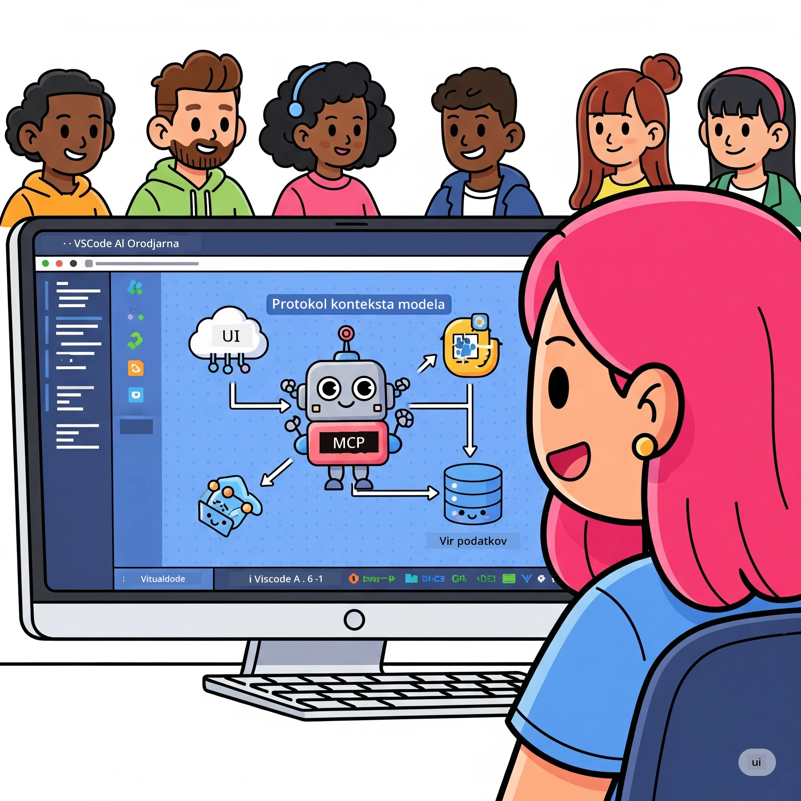
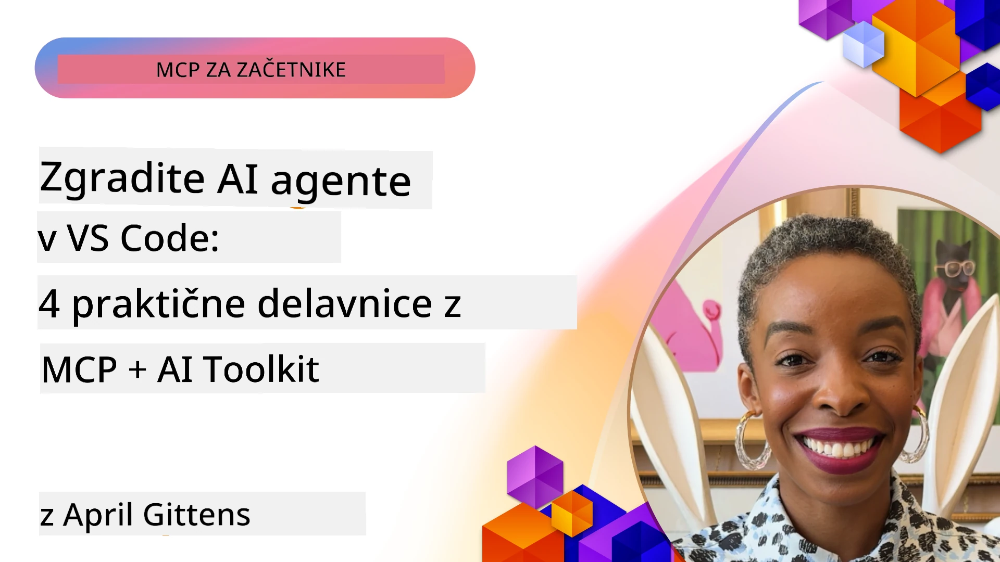

# Poenostavljanje AI delovnih tokov: Izgradnja MCP strežnika z AI orodji

## 🎯 Pregled

_(Kliknite na zgornjo sliko za ogled videa tega lekcija)_

Dobrodošli na **Model Context Protocol (MCP) delavnici**! Ta obsežna praktična delavnica združuje dve najsodobnejši tehnologiji za revolucijo razvoja AI aplikacij:

- **🔗 Model Context Protocol (MCP)**: odprt standard za brezhibno integracijo AI orodij
- **🛠️ AI Toolkit za Visual Studio Code (AITK)**: močna Microsoftova razširitev za razvoj AI

### 🎓 Kaj se boste naučili

Ob koncu delavnice boste obvladali umetnost gradnje inteligentnih aplikacij, ki povezujejo AI modele z resničnimi orodji in storitvami. Od avtomatiziranega testiranja do prilagojenih integracij API-jev boste pridobili praktične spretnosti za reševanje kompleksnih poslovnih izzivov.

## 🏗️ Tehnološki sklop

### 🔌 Model Context Protocol (MCP)

MCP je **"USB-C za AI"** – univerzalni standard, ki povezuje AI modele z zunanjimi orodji in podatkovnimi viri.

**✨ Ključne lastnosti:**

- 🔄 **Standardizirana integracija**: univerzalni vmesnik za povezave AI-orodij
- 🏛️ **Fleksibilna arhitektura**: lokalni in oddaljeni strežniki prek stdio/SSE transporta
- 🧰 **Bogat ekosistem**: orodja, pozivi in viri v enem protokolu
- 🔒 **Pripravljen za podjetja**: vgrajena varnost in zanesljivost

**🎯 Zakaj je MCP pomemben:**
Tako kot je USB-C odpravil zmedo s kabli, MCP poenostavlja integracije AI. En protokol, neskončne možnosti.

### 🤖 AI Toolkit za Visual Studio Code (AITK)

Microsoftova vodilna razširitev za razvoj AI, ki spremeni VS Code v AI močnico.

**🚀 Osnovne zmogljivosti:**

- 📦 **Katalog modelov**: dostop do modelov iz Azure AI, GitHub, Hugging Face, Ollama
- ⚡ **Lokalna inferenca**: ONNX optimizirano izvajanje na CPU/GPU/NPU
- 🏗️ **Agent Builder**: vizualni razvoj AI agentov z integracijo MCP
- 🎭 **Večmodalnost**: podpora besedilu, vidu in strukturiranemu izhodu

**💡 Prednosti razvoja:**

- Nastavitev modela brez konfiguracije
- Vizualno oblikovanje pozivov
- Igralna površina za sprotno testiranje
- Brezhibna integracija MCP strežnika

## 📚 Učna pot

### [🚀 Modul 1: Osnove AI Toolkit](./lab1/README.md)

**Trajanje**: 15 minut

- 🛠️ Namestitev in konfiguracija AI Toolkit za VS Code
- 🗂️ Raziskovanje kataloga modelov (100+ modelov iz GitHub, ONNX, OpenAI, Anthropic, Google)
- 🎮 Obvladovanje interaktivne igralne površine za sprotno testiranje modelov
- 🤖 Izgradnja prvega AI agenta z Agent Builder
- 📊 Vrednotenje zmogljivosti modelov z vgrajenimi metričnimi podatki (F1, relevantnost, podobnost, skladnost)
- ⚡ Učenje zmogljivosti grupne obdelave in večmodalne podpore

**🎯 Učni izid**: Ustvarite funkcionalnega AI agenta s poglobljenim razumevanjem zmogljivosti AITK

### [🌐 Modul 2: MCP z osnovami AI Toolkit](./lab2/README.md)

**Trajanje**: 20 minut

- 🧠 Obvladovanje arhitekture in konceptov Model Context Protocol (MCP)
- 🌐 Raziskovanje Microsoftovega MCP ekosistema strežnikov
- 🤖 Izgradnja agenta za avtomatizacijo brskalnika z uporabo Playwright MCP strežnika
- 🔧 Integracija MCP strežnikov z AI Toolkit Agent Builderjem
- 📊 Konfiguracija in testiranje MCP orodij v vaših agentih
- 🚀 Izvoz in uvajanje agentov, podprtih z MCP, za produkcijsko uporabo

**🎯 Učni izid**: Uvedite AI agenta, z dodatno močjo zunanjih orodij prek MCP

### [🔧 Modul 3: Napredni MCP razvoj z AI Toolkit](./lab3/README.md)

**Trajanje**: 20 minut

- 💻 Ustvarjanje prilagojenih MCP strežnikov z AI Toolkit
- 🐍 Konfiguracija in uporaba najnovejše MCP Python SDK (v1.9.3)
- 🔍 Nastavitev in uporaba MCP Inspectorja za odpravljanje napak
- 🛠️ Izgradnja Weather MCP strežnika s profesionalnimi delovnimi tokovi za odpravljanje napak
- 🧪 Odpravljanje napak MCP strežnikov tako v Agent Builderju kot v okolju Inspector

**🎯 Učni izid**: Razvijajte in odpravljajte napake na prilagojenih MCP strežnikih z modernimi orodji

### [🐙 Modul 4: Praktični MCP razvoj - Prilagojen GitHub Clone strežnik](./lab4/README.md)

**Trajanje**: 30 minut

- 🏗️ Izgradnja resničnega GitHub Clone MCP strežnika za razvojne delovne tokove
- 🔄 Implementacija pametnega podvajanja repozitorijev z validacijo in ravnanjem z napakami
- 📁 Ustvarjanje inteligentnega upravljanja imenikov in integracija z VS Code
- 🤖 Uporaba GitHub Copilot Agent Mode z lastnimi MCP orodji
- 🛡️ Uporaba zanesljivosti primerne za produkcijo in združljivosti med platformami

**🎯 Učni izid**: Uvedite produkcijsko pripravljen MCP strežnik, ki poenostavi resnične razvojne delovne tokove

## 💡 Resnični primeri in vplivi

### 🏢 Primeri uporabe v podjetjih

#### 🔄 Avtomatizacija DevOps

Preoblikujte svoj razvojni delovni tok z inteligentno avtomatizacijo:

- **Pametno upravljanje repozitorijev**: AI-podprt pregled kode in odločitve o združevanju
- **Inteligentni CI/CD**: avtomatska optimizacija pipeline na podlagi sprememb kode
- **Triage težav**: samodejna klasifikacija in dodeljevanje napak

#### 🧪 Revolucija zagotavljanja kakovosti

Izboljšajte testiranje z AI-podprto avtomatizacijo:

- **Inteligentna generacija testov**: samodejno ustvarjanje celovitih testnih kompletov
- **Vizualno regresijsko testiranje**: AI-podprt zaznavanje sprememb UI
- **Nadzor zmogljivosti**: proaktivno odkrivanje in reševanje težav

#### 📊 Inteligenca podatkovnih procesov

Ustvarite pametnejše delovne tokove za obdelavo podatkov:

- **Adaptivni ETL procesi**: samonastavljive transformacije podatkov
- **Zaznavanje anomalij**: spremljanje kakovosti podatkov v realnem času
- **Inteligentno usmerjanje**: pametno upravljanje podatkovnih tokov

#### 🎧 Izboljšanje izkušnje strank

Ustvarite izjemne interakcije s strankami:

- **Podpora, ki razume kontekst**: AI agenti z dostopom do zgodovine strank
- **Proaktivna rešitev težav**: napovedna storitev za stranke
- **Integracija več kanalov**: enotna AI izkušnja na različnih platformah

## 🛠️ Zahteve in namestitev

### 💻 Sistemske zahteve

| Komponenta | Zahteva | Opombe |
|-----------|-------------|-------|
| **Operacijski sistem** | Windows 10+, macOS 10.15+, Linux | Katerekoli sodobni OS |
| **Visual Studio Code** | Najnovejša stabilna verzija | Potrebno za AITK |
| **Node.js** | v18.0+ in npm | Za razvoj MCP strežnikov |
| **Python** | 3.10+ | Izbirno za Python MCP strežnike |
| **Pomnilnik** | vsaj 8GB RAM | Priporočeno 16GB za lokalne modele |

### 🔧 Razvojno okolje

#### Priporočene razširitve za VS Code

- **AI Toolkit** (ms-windows-ai-studio.windows-ai-studio)
- **Python** (ms-python.python)
- **Python Debugger** (ms-python.debugpy)
- **GitHub Copilot** (GitHub.copilot) - Izbirno, a koristno

#### Izbirna orodja

- **uv**: sodoben upravljalec Python paketov
- **MCP Inspector**: vizualno orodje za odpravljanje napak na MCP strežnikih
- **Playwright**: za primere spletne avtomatizacije

## 🎖️ Učni cilji in potrditev

### 🏆 Seznam obvladovanja veščin

S zaključkom te delavnice boste dosegli obvladovanje:

#### 🎯 Jedrne kompetence

- [ ] **Obvladovanje MCP protokola**: poglobljeno razumevanje arhitekture in vzorcev implementacije
- [ ] **Strokovnost za AITK**: ekspertna uporaba AI Toolkit za hitro razvijanje
- [ ] **Razvoj prilagojenih strežnikov**: izgradnja, uvajanje in vzdrževanje produkcijskih MCP strežnikov
- [ ] **Odličnost integracije orodij**: brezhibna povezava AI z obstoječimi razvojnimi procesi
- [ ] **Uporaba za reševanje problemov**: uporaba pridobljenih znanj za resnične poslovne izzive

#### 🔧 Tehnične sposobnosti

- [ ] Namestitev in konfiguracija AI Toolkit v VS Code
- [ ] Oblikovanje in izvajanje prilagojenih MCP strežnikov
- [ ] Integracija GitHub modelov z MCP arhitekturo
- [ ] Izgradnja avtomatiziranih testnih delovnih tokov s Playwright
- [ ] Uvajanje AI agentov za produkcijsko uporabo
- [ ] Odpravljanje napak in optimizacija MCP strežniške zmogljivosti

#### 🚀 Napredne zmožnosti

- [ ] Arhitektura integracij AI na ravni podjetja
- [ ] Izvajanje najboljših praks varnosti za AI aplikacije
- [ ] Oblikovanje razširljivih MCP strežniških arhitektur
- [ ] Ustvarjanje prilagojenih orodnih verig za specifična področja
- [ ] Mentorstvo pri razvoju naravnemu AI

## 📖 Dodatni viri

- [MCP specifikacija (2025-11-25)](https://spec.modelcontextprotocol.io/specification/2025-11-25/)
- [AI Toolkit GitHub repozitorij](https://github.com/microsoft/vscode-ai-toolkit)
- [Zbirka vzorčnih MCP strežnikov](https://github.com/modelcontextprotocol/servers)
- [Vodnik najboljših praks](https://modelcontextprotocol.io/docs/best-practices)
- [OWASP MCP Top 10](https://microsoft.github.io/mcp-azure-security-guide/mcp/) - varnostne najboljše prakse

---

**🚀 Pripravljeni na revolucijo svojega AI razvojnega procesa?**

Zgradimo skupaj prihodnost inteligentnih aplikacij z MCP in AI Toolkit!

## Kaj sledi

Nadaljujte na: [Modul 11: MCP Server praktične delavnice](../11-MCPServerHandsOnLabs/README.md)

---

<!-- CO-OP TRANSLATOR DISCLAIMER START -->
**Omejitev odgovornosti**:
Ta dokument je bil preveden z uporabo storitve za avtomatski prevod [Co-op Translator](https://github.com/Azure/co-op-translator). Čeprav si prizadevamo za natančnost, vas prosimo, da upoštevate, da lahko avtomatski prevodi vsebujejo napake ali netočnosti. Izvirni dokument v izvirnem jeziku velja za avtoritativni vir. Za kritične informacije priporočamo strokoven človeški prevod. Ne odgovarjamo za morebitna nesporazume ali napačne interpretacije, ki izhajajo iz uporabe tega prevoda.
<!-- CO-OP TRANSLATOR DISCLAIMER END -->