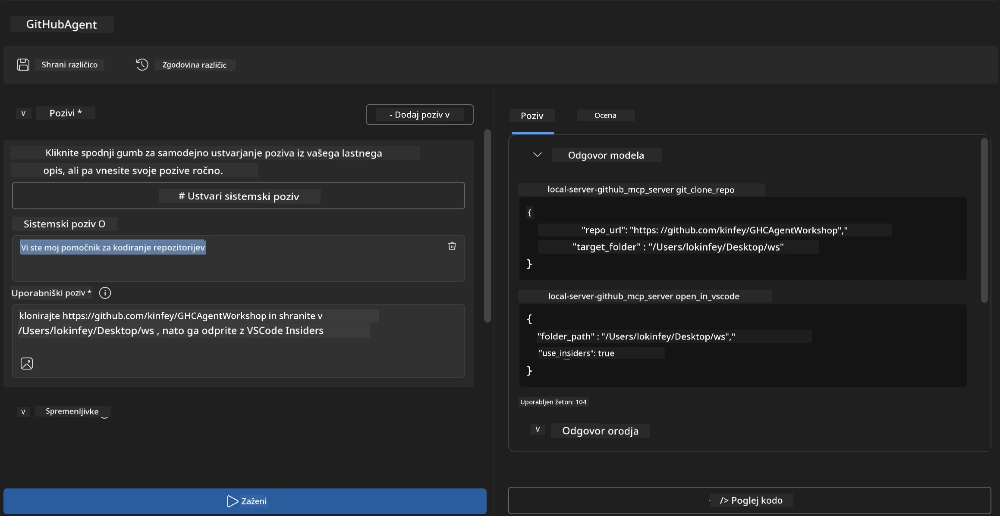
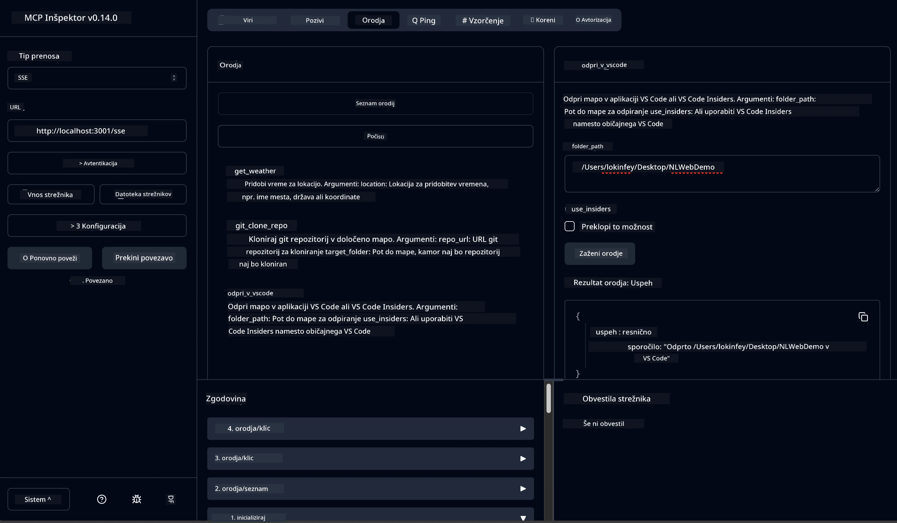

# 🐙 Modul 4: Praktičen razvoj MCP - Po meri narejen GitHub klonski strežnik


> **⚡ Hiter začetek:** Zgradite MCP strežnik pripravljen za produkcijo, ki avtomatizira kloniranje GitHub repozitorijev in integracijo z VS Code v samo 30 minutah!

## 🎯 Cilji učenja

Ob koncu te delavnice boste lahko:

- ✅ Ustvarili lasten MCP strežnik za razvojne delovne tokove v resničnem svetu
- ✅ Implementirali funkcionalnost kloniranja GitHub repozitorijev preko MCP
- ✅ Integrirali lastne MCP strežnike z VS Code in Agent Builderjem
- ✅ Uporabljali GitHub Copilot Agent Mode z lastnimi MCP orodji
- ✅ Testirali in uvajali lastne MCP strežnike v produkcijska okolja

## 📋 Predpogoji

- Zaključena Lab 1–3 (osnove MCP in napredni razvoj)
- Naročnina na GitHub Copilot ([na voljo brezplačna prijava](https://github.com/github-copilot/signup))
- VS Code z razširitvami AI Toolkit in GitHub Copilot
- Nameščen in konfiguriran Git CLI

## 🏗️ Pregled projekta

### **Razvojni izziv iz resničnega sveta**
Kot razvijalci pogosto uporabljamo GitHub za kloniranje repozitorijev in odpiranje v VS Code ali VS Code Insiders. Ta ročni postopek vključuje:
1. Odprtje terminala/ukazne vrstice
2. Navigacijo do želene mape
3. Zažene ukaz `git clone`
4. Odpri VS Code v klonirani mapi

**Naša MCP rešitev to poenostavi v eno pametno ukazno vrstico!**

### **Kaj boste zgradili**
**GitHub Clone MCP strežnik** (`git_mcp_server`), ki ponuja:

| Funkcija | Opis | Korist |
|---------|-------------|---------|
| 🔄 **Pametno kloniranje repozitorijev** | Kloniranje GitHub repozitorijev z validacijo | Samodejno preverjanje napak |
| 📁 **Pametno upravljanje map** | Preverjanje in varno ustvarjanje map | Preprečuje prepisovanje |
| 🚀 **Multiplastformska integracija z VS Code** | Odpiranje projektov v VS Code/Insiders | Brezhiben prehod delovnih tokov |
| 🛡️ **Robustno ravnanje z napakami** | Reševanje težav z omrežjem, dovoljenji in potmi | Zanesljivost pripravljenosti za produkcijo |

---

## 📖 Korak za korakom implementacija

### Korak 1: Ustvarite GitHub agenta v Agent Builderju

1. **Zaženite Agent Builder** preko razširitve AI Toolkit
2. **Ustvarite novega agenta** z naslednjo konfiguracijo:
   ```
   Agent Name: GitHubAgent
   ```

3. **Inicializirajte lasten MCP strežnik:**
   - Pojdite na **Orodja** → **Dodaj orodje** → **MCP strežnik**
   - Izberite **"Ustvari nov MCP strežnik"**
   - Izberite **Python predlogo** za največjo prilagodljivost
   - **Ime strežnika:** `git_mcp_server`

### Korak 2: Nastavite GitHub Copilot Agent Mode

1. **Odprite GitHub Copilot** v VS Code (Ctrl/Cmd + Shift + P → "GitHub Copilot: Open")
2. **Izberite Agent model** v vmesniku Copilot
3. **Izberite model Claude 3.7** za boljše razumevanje in logično sklepanje
4. **Omogočite MCP integracijo** za dostop do orodij

> **💡 Namig za profesionalce:** Claude 3.7 ponuja vrhunsko razumevanje razvojnih delovnih tokov in vzorcev ravnanja z napakami.

### Korak 3: Implementirajte osnovno MCP strežniško funkcionalnost

**Uporabite naslednji podroben poziv z GitHub Copilot Agent Mode:**

```
Create two MCP tools with the following comprehensive requirements:

🔧 TOOL A: clone_repository
Requirements:
- Clone any GitHub repository to a specified local folder
- Return the absolute path of the successfully cloned project
- Implement comprehensive validation:
  ✓ Check if target directory already exists (return error if exists)
  ✓ Validate GitHub URL format (https://github.com/user/repo)
  ✓ Verify git command availability (prompt installation if missing)
  ✓ Handle network connectivity issues
  ✓ Provide clear error messages for all failure scenarios

🚀 TOOL B: open_in_vscode
Requirements:
- Open specified folder in VS Code or VS Code Insiders
- Cross-platform compatibility (Windows/Linux/macOS)
- Use direct application launch (not terminal commands)
- Auto-detect available VS Code installations
- Handle cases where VS Code is not installed
- Provide user-friendly error messages

Additional Requirements:
- Follow MCP 1.9.3 best practices
- Include proper type hints and documentation
- Implement logging for debugging purposes
- Add input validation for all parameters
- Include comprehensive error handling
```

### Korak 4: Preizkusite svoj MCP strežnik

#### 4a. Test v Agent Builderju

1. **Zaženite debug konfiguracijo** v Agent Builderju
2. **Konfigurirajte svojega agenta s tem sistemskim pozivom:**

```
SYSTEM_PROMPT:
You are my intelligent coding repository assistant. You help developers efficiently clone GitHub repositories and set up their development environment. Always provide clear feedback about operations and handle errors gracefully.
```

3. **Testirajte z realističnimi uporabniškimi scenariji:**

```
USER_PROMPT EXAMPLES:

Scenario : Basic Clone and Open
"Clone {Your GitHub Repo link such as https://github.com/kinfey/GHCAgentWorkshop
 } and save to {The global path you specify}, then open it with VS Code Insiders"
```



**Pričakovani rezultati:**
- ✅ Uspešno kloniranje z potrdilom poti
- ✅ Samodejno zagon VS Code
- ✅ Jasna sporočila o napakah pri nepravilnih situacijah
- ✅ Pravilno ravnanje z robnimi primeri

#### 4b. Test v MCP Inspectorju




---


**🎉 Čestitke!** Uspešno ste ustvarili praktičen, produkcijsko pripravljen MCP strežnik, ki rešuje izzive resničnih razvojnih delovnih tokov. Vaš po meri narejeni GitHub klonski strežnik prikazuje moč MCP za avtomatizacijo in izboljšanje produktivnosti razvijalcev.

### 🏆 Dosežek pridobljen:
- ✅ **MCP razvijalec** - Ustvarjen lasten MCP strežnik
- ✅ **Avtomatizator delovnih tokov** - Poenostavljeni razvojni procesi  
- ✅ **Strokovnjak za integracijo** - Povezana več razvojnih orodij
- ✅ **Pripravljen za produkcijo** - Zgrajene rešitve za implementacijo

---

## 🎓 Zaključek delavnice: Vaša pot z Model Context Protocol

**Spoštovani udeleženec delavnice,**

Čestitke za uspešno opravljanje vseh štirih modulov delavnice Model Context Protocol! Prehodili ste dolgo pot od razumevanja osnov AI Toolkit konceptov do gradnje produkcijsko pripravljenih MCP strežnikov, ki rešujejo razvojne izzive iz resničnega sveta.

### 🚀 Povzetek vaše učne poti:

**[Modul 1](../lab1/README.md)**: Začeli ste z raziskovanjem osnov AI Toolkita, testiranjem modelov in izdelavo prvega AI agenta.

**[Modul 2](../lab2/README.md)**: Naučili ste se MCP arhitekture, integracije Playwright MCP in izdelali prvega agenta za avtomatizacijo brskalnika.

**[Modul 3](../lab3/README.md)**: Napredovali ste do razvoja lastnih MCP strežnikov s strežnikom Weather MCP in obvladali orodja za razhroščevanje.

**[Modul 4](../lab4/README.md)**: Sedaj ste uporabili vse do sedaj za ustvarjanje praktičnega orodja za avtomatizacijo delovnih tokov GitHub repozitorijev.

### 🌟 Kaj ste osvojili:

- ✅ **Ekosistem AI Toolkit**: modeli, agenti in vzorci integracije
- ✅ **MCP arhitekturo**: klient-strežniško zasnovo, transportne protokole in varnost
- ✅ **Razvojna orodja**: od Playgrounda do Inspectorja in produkcijske uvedbe
- ✅ **Lastni razvoj**: gradnja, testiranje in uvajanje lastnih MCP strežnikov
- ✅ **Praktične uporabe**: reševanje resničnih izzivov delovnih tokov z AI

### 🔮 Vaši naslednji koraki:

1. **Zgradite svoj lasten MCP strežnik**: uporabite te veščine za avtomatizacijo vaših edinstvenih delovnih tokov
2. **Pridružite se MCP skupnosti**: delite vaše stvaritve in se učite od drugih
3. **Raziskujte napredne integracije**: povežite MCP strežnike z enterpriznimi sistemi
4. **Prispevajte v odprto kodo**: pomagajte izboljšati MCP orodja in dokumentacijo

Zapomnite si, da je ta delavnica šele začetek. Ekosistem Model Context Protocol hitro napreduje in zdaj ste opremljeni, da ste na čelu AI-podprtih razvojnih orodij.

**Hvala za vašo udeležbo in predanost učenju!**

Upamo, da vam je ta delavnica dala ideje, ki bodo spremenile način, kako gradite in uporabljate AI orodja na vaši razvojni poti.

**Srečno kodiranje!**

---

## Kaj sledi

Čestitke za zaključek vseh vaj v Modulu 10!

- Nazaj na: [Pregled Modula 10](../README.md)
- Nadaljujte na: [Modul 11: MCP Server Hands-On Labs](../../11-MCPServerHandsOnLabs/README.md)

---

<!-- CO-OP TRANSLATOR DISCLAIMER START -->
**Omejitev odgovornosti**:
Ta dokument je bil preveden s pomočjo storitve za prevajanje z uporabo umetne inteligence [Co-op Translator](https://github.com/Azure/co-op-translator). Čeprav si prizadevamo za natančnost, vas prosimo, da upoštevate, da lahko avtomatizirani prevodi vsebujejo napake ali netočnosti. Izvirni dokument v njegovem izvorni jezik je treba obravnavati kot avtoritativni vir. Za kritične informacije priporočamo strokoven prevod s strani človeka. Za kakršnekoli nesporazume ali napačne interpretacije, ki izhajajo iz uporabe tega prevoda, ne prevzemamo odgovornosti.
<!-- CO-OP TRANSLATOR DISCLAIMER END -->