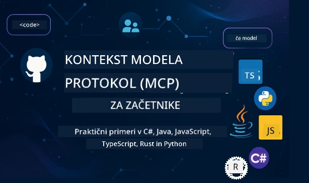

 

[](https://GitHub.com/microsoft/mcp-for-beginners/graphs/contributors)
[](https://GitHub.com/microsoft/mcp-for-beginners/issues)
[](https://GitHub.com/microsoft/mcp-for-beginners/pulls)
[](http://makeapullrequest.com)

[](https://GitHub.com/microsoft/mcp-for-beginners/watchers)
[](https://GitHub.com/microsoft/mcp-for-beginners/fork)
[](https://GitHub.com/microsoft/mcp-for-beginners/stargazers)


[](https://discord.gg/nTYy5BXMWG)

Sledite tem korakom, da začnete uporabljati te vire:
1. **Naredite Fork repozitorija**: Kliknite [](https://GitHub.com/microsoft/mcp-for-beginners/fork)
2. **Klonirajte repozitorij**:   `git clone https://github.com/microsoft/mcp-for-beginners.git`
3. **Pridružite se** [](https://discord.gg/nTYy5BXMWG)


### 🌐 Podpora za več jezikov

#### Podprto preko GitHub Action (Avtomatizirano in vedno posodobljeno)

<!-- CO-OP TRANSLATOR LANGUAGES TABLE START -->
[Arabic](../ar/README.md) | [Bengali](../bn/README.md) | [Bulgarian](../bg/README.md) | [Burmese (Myanmar)](../my/README.md) | [Chinese (Simplified)](../zh-CN/README.md) | [Chinese (Traditional, Hong Kong)](../zh-HK/README.md) | [Chinese (Traditional, Macau)](../zh-MO/README.md) | [Chinese (Traditional, Taiwan)](../zh-TW/README.md) | [Croatian](../hr/README.md) | [Czech](../cs/README.md) | [Danish](../da/README.md) | [Dutch](../nl/README.md) | [Estonian](../et/README.md) | [Finnish](../fi/README.md) | [French](../fr/README.md) | [German](../de/README.md) | [Greek](../el/README.md) | [Hebrew](../he/README.md) | [Hindi](../hi/README.md) | [Hungarian](../hu/README.md) | [Indonesian](../id/README.md) | [Italian](../it/README.md) | [Japanese](../ja/README.md) | [Kannada](../kn/README.md) | [Korean](../ko/README.md) | [Lithuanian](../lt/README.md) | [Malay](../ms/README.md) | [Malayalam](../ml/README.md) | [Marathi](../mr/README.md) | [Nepali](../ne/README.md) | [Nigerian Pidgin](../pcm/README.md) | [Norwegian](../no/README.md) | [Persian (Farsi)](../fa/README.md) | [Polish](../pl/README.md) | [Portuguese (Brazil)](../pt-BR/README.md) | [Portuguese (Portugal)](../pt-PT/README.md) | [Punjabi (Gurmukhi)](../pa/README.md) | [Romanian](../ro/README.md) | [Russian](../ru/README.md) | [Serbian (Cyrillic)](../sr/README.md) | [Slovak](../sk/README.md) | [Slovenian](./README.md) | [Spanish](../es/README.md) | [Swahili](../sw/README.md) | [Swedish](../sv/README.md) | [Tagalog (Filipino)](../tl/README.md) | [Tamil](../ta/README.md) | [Telugu](../te/README.md) | [Thai](../th/README.md) | [Turkish](../tr/README.md) | [Ukrainian](../uk/README.md) | [Urdu](../ur/README.md) | [Vietnamese](../vi/README.md)

> **Raje klonirate lokalno?**
>
> Ta repozitorij vključuje več kot 50 jezikovnih prevodov, kar znatno poveča velikost prenosa. Če želite klonirati brez prevodov, uporabite sparsni checkout:
>
> **Bash / macOS / Linux:**
> ```bash
> git clone --filter=blob:none --sparse https://github.com/microsoft/mcp-for-beginners.git
> cd mcp-for-beginners
> git sparse-checkout set --no-cone '/*' '!translations' '!translated_images'
> ```
>
> **CMD (Windows):**
> ```cmd
> git clone --filter=blob:none --sparse https://github.com/microsoft/mcp-for-beginners.git
> cd mcp-for-beginners
> git sparse-checkout set --no-cone "/*" "!translations" "!translated_images"
> ```
>
> Tako dobite vse potrebno za dokončanje tečaja z bistveno hitrejšim prenosom.
<!-- CO-OP TRANSLATOR LANGUAGES TABLE END -->

# 🚀 Kurikulum Model Context Protocol (MCP) za začetnike

## **Naučite se MCP s praktičnimi primeri kode v C#, Java, JavaScript, Rust, Python in TypeScript**

## 🧠 Pregled kurikuluma Model Context Protocol
Dobrodošli na vaši poti v svet Model Context Protocol! Če ste se kdaj spraševali, kako AI aplikacije komunicirajo z različnimi orodji in storitvami, boste odkrili elegantno rešitev, ki spreminja način, kako razvijalci ustvarjajo inteligentne sisteme.

Pomislite na MCP kot na univerzalnega prevajalca za AI aplikacije – tako kot USB priključki omogočajo povezavo katere koli naprave z računalnikom, MCP omogoča AI modelom povezavo z katerim koli orodjem ali storitvijo na standardiziran način. Ne glede na to, ali gradite svojega prvega klepetalnega bota ali delate na zapletenih AI potekih dela, boste z razumevanjem MCP pridobili moč za ustvarjanje bolj zmogljivih in prilagodljivih aplikacij.

Ta kurikulum je zasnovan z vztrajnostjo in skrbjo za vaše učno potovanje. Začeli bomo z enostavnimi koncepti, ki jih že poznate, in postopoma gradili vašo strokovnost skozi praktične vaje v vašem najljubšem programskem jeziku. Vsak korak vključuje jasna pojasnila, praktične primere in veliko spodbud.

Do konca te poti boste samozavestni pri ustvarjanju lastnih MCP strežnikov, njihovi integraciji s priljubljenimi AI platformami in razumeli boste, kako ta tehnologija preoblikuje prihodnost razvoja AI. Začnimo to vznemirljivo dogodivščino skupaj!

### Uradna dokumentacija in specifikacije

Ta kurikulum je usklajen z **MCP specifikacijo 2025-11-25** (najnovejša stabilna različica). Specifikacija MCP uporablja verzioniranje na osnovi datuma (format LLLL-MM-DD) za jasen pregled verzij protokola.

Ti viri postajajo dragocenejši, ko raste vaše razumevanje, vendar ne čutite pritiska, da morate takoj prebrati vse. Začnite z območji, ki vas najbolj zanimajo!
- 📘 [MCP Dokumentacija](https://modelcontextprotocol.io/) – To je vaš glavni vir za postopne vodiče in uporabniške priročnike. Dokumentacija je napisana z mislijo na začetnike in ponuja jasne primere, ki jih lahko spremljate v svojem tempu.
- 📜 [MCP Specifikacija](https://modelcontextprotocol.io/specification/2025-11-25) – To lahko razumete kot vaš obsežen referenčni priročnik. Med delom skozi kurikulum se boste vračali sem, da poiščete posebne podrobnosti in raziskujete napredne funkcije.
- 📜 [MCP Verzicioniranje specifikacije](https://modelcontextprotocol.io/specification/versioning) – Tu so informacije o zgodovini verzij protokola in o tem, kako MCP uporablja verzioniranje na osnovi datuma (format LLLL-MM-DD).
- 🧑‍💻 [MCP GitHub Repozitorij](https://github.com/modelcontextprotocol) – Tukaj boste našli SDK-je, orodja in primere kode v več programskih jezikih. Je kot zakladnica praktičnih primerov in komponent, pripravljenih za uporabo.
- 🌐 [MCP Skupnost](https://github.com/orgs/modelcontextprotocol/discussions) – Pridružite se drugim učencem in izkušenim razvijalcem v razpravah o MCP. To je podpirajoča skupnost, kjer so vprašanja dobrodošla in znanje se prostovoljno deli.
  
## Cilji učenja

Do konca tega kurikuluma boste samozavestni in navdušeni nad svojimi novimi sposobnostmi. Tukaj so vaše dosežke:

• **Razumeti osnove MCP**: Spoznali boste, kaj je Model Context Protocol in zakaj spreminja način sodelovanja AI aplikacij skozi analogije in primere, ki imajo smisel.

• **Ustvariti svoj prvi MCP strežnik**: Izdelali boste delujoč MCP strežnik v izbranem programskem jeziku, začeli z enostavnimi primeri in postopoma nadgrajevali svoje veščine.

• **Povezati AI modele z resničnimi orodji**: Naučili se boste, kako povezati AI modele z dejanskimi storitvami, s čimer boste svojim aplikacijam dali močne nove zmožnosti.

• **Izvajati najboljše prakse za varnost**: Razumeli boste, kako zagotoviti varnost svojih MCP implementacij, ščititi tako aplikacije kot uporabnike.

• **Zagotovo uvajati rešitve**: Spoznali boste, kako premakniti svoje MCP projekte iz razvoja v produkcijo, z uporabnimi strategijami uvajanja, ki delujejo v resničnem svetu.

• **Pridružiti se MCP skupnosti**: Postali boste del rastoče skupnosti razvijalcev, ki oblikujejo prihodnost razvoja AI aplikacij.

## Potrebno osnovno znanje

Preden se poglobimo v podrobnosti MCP, se prepričajmo, da ste udobni z nekaterimi osnovnimi pojmi. Ne skrbite, če niste strokovnjak na teh področjih – razložili vam bomo vse, kar morate vedeti, medtem ko napredujemo!

### Razumevanje protokolov (Temelj)

Pomislite na protokol kot pravila za pogovor. Ko pokličete prijatelja, oba veste, da rečete "živjo", ko odgovorite, govorite izmenično in na koncu rečete "nasvidenje". Računalniški programi potrebujejo podobna pravila, da učinkovito komunicirajo.

MCP je protokol – niz dogovorjenih pravil, ki pomagajo AI modelom in aplikacijam imeti produktivne "pogovore" z orodji in storitvami. Tako kot pravila pogovora olajšajo človeško komunikacijo, MCP zagotavlja zanesljivejšo in močnejšo komunikacijo AI aplikacij.

### Odnosi med klientom in strežnikom (Kako programi sodelujejo)

Vsak dan uporabljate odnose klient-strežnik! Ko uporabljate spletni brskalnik (klient) za ogled spletne strani, se povežete s spletnim strežnikom, ki vam pošlje vsebino strani. Brskalnik ve, kako zahtevati podatke, strežnik pa, kako odgovoriti.

V MCP imamo podoben odnos: AI modeli so klienti, ki zahtevajo informacije ali ukaze, MCP strežniki pa zagotavljajo te zmogljivosti. To je kot da bi imeli pomočnika (strežnik), ki ga AI lahko prosi, da opravi določena opravila.

### Zakaj je standardizacija pomembna (Sodelovanje različnih sistemov)

Predstavljajte si, da bi vsak proizvajalec avtomobilov uporabljal drugačne oblike polnilnih priključkov – za vsak avto bi potrebovali drugačen adapter! Standardizacija pomeni dogovor o skupnih pristopih, da sistemi nemoteno sodelujejo.

MCP zagotavlja to standardizacijo za AI aplikacije. Namesto da bi vsak AI model potreboval posebno kodo za vsako orodje, MCP ustvarja univerzalni način komunikacije. Razvijalci tako lahko orodja razvijejo enkrat in delujejo z mnogimi različnimi AI sistemi.

## 🧭 Pregled vaše učne poti

Vaša pot z MCP je skrbno strukturirana, da postopoma gradi vašo samozavest in spretnosti. Vsaka faza uvaja nove koncepte in krepi že pridobljeno znanje.

### 🌱 Fazna osnova: Razumevanje osnov (Moduli 0-2)

Tukaj se začne vaša dogodivščina! Predstavili vam bomo koncept MCP z znanimi analogijami in preprostimi primeri. Razumeli boste, kaj je MCP, zakaj obstaja in kako se vključuje v širši svet razvoja AI.

• **Modul 0 – Uvod v MCP**: Začeli bomo z raziskovanjem, kaj je MCP in zakaj je tako pomemben za sodobne AI aplikacije. Videli boste primere MCP v praksi in razumeli, kako rešuje pogoste težave razvijalcev.

• **Modul 1 – Razlaga ključnih konceptov**: Spoznali boste osnovne gradnike MCP. Uporabili bomo veliko analogij in vizualnih primerov, da bodo ti koncepti enostavni in razumljivi.

• **Modul 2 – Varnost v MCP**: Varnost se morda zdi zahtevna, a pokazali vam bomo, kako MCP vključuje vgrajene varnostne funkcije ter vas naučili najboljših praks za zaščito vaših aplikacij od začetka.

### 🔨 Faza izdelave: Ustvarjanje prvih implementacij (Modul 3)

Zdaj se začne pravi užitek! Pridobili boste praktične izkušnje z izdelavo dejanskih MCP strežnikov in klientov. Brez skrbi – začeli bomo preprosto in vas vodili skozi vsak korak.
Ta modul vključuje več praktičnih vodičev, ki vam omogočajo, da vadite v svojem priljubljenem programskem jeziku. Ustvarili boste svoj prvi strežnik, zgradili odjemalca za povezavo z njim in celo integrirali priljubljena razvojna orodja, kot je VS Code.

Vsak vodič vključuje popolne primere kode, nasvete za odpravljanje težav in pojasnila, zakaj sprejemamo določene oblikovalske odločitve. Ob koncu te faze boste imeli delujoče implementacije MCP, na katere boste lahko ponosni!

### 🚀 Faza rasti: Napredni koncepti in uporaba v resničnem svetu (moduli 4-5)

Ko obvladate osnove, ste pripravljeni raziskati bolj sofisticirane funkcije MCP. Pokrili bomo praktične strategije implementacije, tehnike odpravljanja napak in napredne teme, kot je večmodalna integracija AI.

Naučili se boste tudi, kako skalirati svoje implementacije MCP za proizvodno rabo in se integrirati s platformami v oblaku, kot je Azure. Ti moduli vas pripravijo na ustvarjanje MCP rešitev, ki lahko obvladujejo zahteve resničnega sveta.

### 🌟 Faza mojstrstva: Skupnost in specializacija (moduli 6-11)

Zadnja faza je osredotočena na priključitev skupnosti MCP in specializacijo na področjih, ki vas najbolj zanimajo. Naučili se boste, kako prispevati k odprtokodnim MCP projektom, implementirati napredne vzorce overjanja in zgraditi celovite rešitve z integracijo podatkovnih baz.

Modul 11 si zasluži posebno omembo – gre za celotno praktično učni načrt s 13 delavnicami, ki vas nauči graditi produkcijsko pripravljene MCP strežnike z integracijo PostgreSQL. Je kot zaključni projekt, ki združuje vse, kar ste se naučili!

### 📚 Celotna struktura učnega načrta

| Modul | Tema | Opis | Povezava |
|--------|-------|-------------|------|
| **Moduli 0-3: Osnove** | | | |
| 00 | Uvod v MCP | Pregled Model Context Protocol in njegov pomen v AI potokih | [Preberi več](./00-Introduction/README.md) |
| 01 | Razlaga osnovnih konceptov | Poglobljena raziskava osnovnih konceptov MCP | [Preberi več](./01-CoreConcepts/README.md) |
| 02 | Varnost v MCP | Varnostne grožnje in priporočene prakse | [Preberi več](./02-Security/README.md) |
| 03 | Začetek z MCP | Nastavitev okolja, osnovni strežniki/odjemalci, integracija | [Preberi več](./03-GettingStarted/README.md) |
| **Modul 3: Gradnja prvega strežnika in odjemalca** | | | |
| 3.1 | Prvi strežnik | Ustvarite svoj prvi MCP strežnik | [Vodič](./03-GettingStarted/01-first-server/README.md) |
| 3.2 | Prvi odjemalec | Razvijte osnovnega MCP odjemalca | [Vodič](./03-GettingStarted/02-client/README.md) |
| 3.3 | Odjemalec z LLM | Integrirajte velike jezikovne modele | [Vodič](./03-GettingStarted/03-llm-client/README.md) |
| 3.4 | Integracija VS Code | Uporaba MCP strežnikov v VS Code | [Vodič](./03-GettingStarted/04-vscode/README.md) |
| 3.5 | stdio strežnik | Ustvarite strežnike z uporabo stdio transporta | [Vodič](./03-GettingStarted/05-stdio-server/README.md) |
| 3.6 | HTTP pretakanje | Implementirajte HTTP pretakanje v MCP | [Vodič](./03-GettingStarted/06-http-streaming/README.md) |
| 3.7 | AI orodjarna | Uporaba AI orodjarne z MCP | [Vodič](./03-GettingStarted/07-aitk/README.md) |
| 3.8 | Testiranje | Testirajte implementacijo svojega MCP strežnika | [Vodič](./03-GettingStarted/08-testing/README.md) |
| 3.9 | Nameščanje | Namestitev MCP strežnikov v produkcijo | [Vodič](./03-GettingStarted/09-deployment/README.md) |
| 3.10 | Napredna uporaba strežnika | Uporaba naprednih strežnikov za napredne funkcije in izboljšano arhitekturo | [Vodič](./03-GettingStarted/10-advanced/README.md) |
| 3.11 | Preprosto overjanje | Poglavje o začetku overjanja in RBAC-u | [Vodič](./03-GettingStarted/11-simple-auth/README.md) |
| 3.12 | MCP gostitelji | Konfiguracija Claude Desktop, Cursor, Cline in drugih MCP gostiteljev | [Vodič](./03-GettingStarted/12-mcp-hosts/README.md) |
| 3.13 | MCP inšpektor | Odpravljanje napak in testiranje MCP strežnikov z orodjem Inspector | [Vodič](./03-GettingStarted/13-mcp-inspector/README.md) |
| **Moduli 4-5: Praktično in napredno** | | | |
| 04 | Praktična implementacija | SDK-ji, odpravljanje napak, testiranje, ponovno uporabne predloge pozivov | [Preberi več](./04-PracticalImplementation/README.md) |
| 4.1 | Straničenje | Upravljanje velikih rezultatov z osnovanim na kazalcih straničenjem | [Vodič](./04-PracticalImplementation/pagination/README.md) |
| 05 | Napredne teme v MCP | Večmodalna AI, skaliranje, uporaba v podjetjih | [Preberi več](./05-AdvancedTopics/README.md) |
| 5.1 | Integracija Azure | Integracija MCP z Azure | [Vodič](./05-AdvancedTopics/mcp-integration/README.md) |
| 5.2 | Večmodalnost | Delo z različnimi modalnostmi | [Vodič](./05-AdvancedTopics/mcp-multi-modality/README.md) |
| 5.3 | Prikaz OAuth2 | Implementacija overjanja OAuth2 | [Vodič](./05-AdvancedTopics/mcp-oauth2-demo/README.md) |
| 5.4 | Korenski konteksti | Razumevanje in implementacija korenskih kontekstov | [Vodič](./05-AdvancedTopics/mcp-root-contexts/README.md) |
| 5.5 | Usmerjanje | Strategije usmerjanja MCP | [Vodič](./05-AdvancedTopics/mcp-routing/README.md) |
| 5.6 | Vzorec vzorčenja | Vzorčne tehnike v MCP | [Vodič](./05-AdvancedTopics/mcp-sampling/README.md) |
| 5.7 | Skaliranje | Skalirajte implementacije MCP | [Vodič](./05-AdvancedTopics/mcp-scaling/README.md) |
| 5.8 | Varnost | Napredna varnostna razmišljanja | [Vodič](./05-AdvancedTopics/mcp-security/README.md) |
| 5.9 | Iskanje po spletu | Implementacija zmogljivosti spletnega iskanja | [Vodič](./05-AdvancedTopics/web-search-mcp/README.md) |
| 5.10 | Pretakanje v realnem času | Gradnja funkcionalnosti pretakanja v živo | [Vodič](./05-AdvancedTopics/mcp-realtimestreaming/README.md) |
| 5.11 | Iskanje v realnem času | Implementacija iskanja v realnem času | [Vodič](./05-AdvancedTopics/mcp-realtimesearch/README.md) |
| 5.12 | Overjanje Entra ID | Overjanje z Microsoft Entra ID | [Vodič](./05-AdvancedTopics/mcp-security-entra/README.md) |
| 5.13 | Integracija Foundry | Integracija z Azure AI Foundry | [Vodič](./05-AdvancedTopics/mcp-foundry-agent-integration/README.md) |
| 5.14 | Inženiring konteksta | Tehnike za učinkovito oblikovanje konteksta | [Vodič](./05-AdvancedTopics/mcp-contextengineering/README.md) |
| 5.15 | MCP prilagojen transport | Implementacije prilagojenega transporta | [Vodič](./05-AdvancedTopics/mcp-transport/README.md) |
| 5.16 | Funkcije protokola | Obvestila o napredku, preklic, predloge virov | [Vodič](./05-AdvancedTopics/mcp-protocol-features/README.md) |
| **Moduli 6-10: Skupnost in dobre prakse** | | | |
| 06 | Prispevki skupnosti | Kako prispevati v MCP ekosistem | [Vodič](./06-CommunityContributions/README.md) |
| 07 | Izkušnje zgodnjih uporabnikov | Zgodbe o implementaciji v realnem svetu | [Vodič](./07-LessonsfromEarlyAdoption/README.md) |
| 08 | Najboljše prakse za MCP | Uspešnost, odpornost proti napakam, odpornost | [Vodič](./08-BestPractices/README.md) |
| 09 | MG študije primerov | Praktični primeri implementacije | [Vodič](./09-CaseStudy/README.md) |
| 10 | Praktična delavnica | Gradnja MCP strežnika z AI orodjarno | [Delavnica](./10-StreamliningAIWorkflowsBuildingAnMCPServerWithAIToolkit/README.md) |
| **Modul 11: MCP strežnik - praktične delavnice** | | | |
| 11 | Integracija MCP strežnika s podatkovno bazo | Celovit učni načrt s 13 delavnicami za integracijo PostgreSQL | [Delavnice](./11-MCPServerHandsOnLabs/README.md) |
| 11.1 | Uvod | Pregled MCP z integracijo baze podatkov in primer uporabe trgovinske analitike | [Delavnica 00](./11-MCPServerHandsOnLabs/00-Introduction/README.md) |
| 11.2 | Osnovna arhitektura | Razumevanje arhitekture MCP strežnika, plasti baze podatkov in varnostnih vzorcev | [Delavnica 01](./11-MCPServerHandsOnLabs/01-Architecture/README.md) |
| 11.3 | Varnost in večnajemnost | Varnost na ravni vrstic, overjanje in dostop do večnajemniških podatkov | [Delavnica 02](./11-MCPServerHandsOnLabs/02-Security/README.md) |
| 11.4 | Nastavitev okolja | Nastavitev razvojnega okolja, Docker, Azure viri | [Delavnica 03](./11-MCPServerHandsOnLabs/03-Setup/README.md) |
| 11.5 | Oblikovanje baze podatkov | Nastavitev PostgreSQL, zasnova prodajne sheme in vzorčni podatki | [Delavnica 04](./11-MCPServerHandsOnLabs/04-Database/README.md) |
| 11.6 | Implementacija MCP strežnika | Gradnja FastMCP strežnika z integracijo baze podatkov | [Delavnica 05](./11-MCPServerHandsOnLabs/05-MCP-Server/README.md) |
| 11.7 | Razvoj orodij | Ustvarjanje orodij za poizvedbe v bazi in pregled sheme | [Delavnica 06](./11-MCPServerHandsOnLabs/06-Tools/README.md) |
| 11.8 | Semantično iskanje | Implementacija vektorskih vdelav z Azure OpenAI in pgvector | [Delavnica 07](./11-MCPServerHandsOnLabs/07-Semantic-Search/README.md) |
| 11.9 | Testiranje in odpravljanje napak | Strategije testiranja, orodja za debugging in pristopi k validaciji | [Delavnica 08](./11-MCPServerHandsOnLabs/08-Testing/README.md) |
| 11.10 | Integracija VS Code | Konfiguracija integracije MCP v VS Code in uporaba AI klepeta | [Delavnica 09](./11-MCPServerHandsOnLabs/09-VS-Code/README.md) |
| 11.11 | Strategije nameščanja | Nameščanje z Docker, Azure Container Apps in razmisleki o skaliranju | [Delavnica 10](./11-MCPServerHandsOnLabs/10-Deployment/README.md) |
| 11.12 | Nadzor | Application Insights, beleženje, spremljanje učinkovitosti | [Delavnica 11](./11-MCPServerHandsOnLabs/11-Monitoring/README.md) |
| 11.13 | Najboljše prakse | Optimizacija zmogljivosti, utrjevanje varnosti in nasveti za produkcijo | [Delavnica 12](./11-MCPServerHandsOnLabs/12-Best-Practices/README.md) |

### 💻 Vzorčni projektni primeri kode

Ena najbolj vznemirljivih delov učenja MCP je, da vidite svoje sposobnosti kodiranja postopno rasti. Naše primere kode smo zasnovali tako, da začnejo preprosto in postanejo bolj sofisticirani, ko se vaše razumevanje poglobi. Tako predstavljamo koncepte – s kodo, ki je preprosta za razumevanje, a prikazuje resnične MCP principe, boste razumeli ne le, kaj koda počne, temveč tudi zakaj je strukturirana tako in kako se prilega večjim MCP aplikacijam.

#### Osnovni primeri MCP kalkulatorja

| Jezik | Opis | Povezava |
|----------|-------------|------|
| C# | Primer MCP strežnika | [Ogled kode](./03-GettingStarted/samples/csharp/README.md) |
| Java | MCP kalkulator | [Ogled kode](./03-GettingStarted/samples/java/calculator/README.md) |
| JavaScript | MCP demo | [Ogled kode](./03-GettingStarted/samples/javascript/README.md) |
| Python | MCP strežnik | [Ogled kode](../../03-GettingStarted/samples/python/mcp_calculator_server.py) |
| TypeScript | MCP primer | [Ogled kode](./03-GettingStarted/samples/typescript/README.md) |
| Rust | MCP primer | [Ogled kode](./03-GettingStarted/samples/rust/README.md) |

#### Napredne MCP implementacije

| Jezik | Opis | Povezava |
|----------|-------------|------|
| C# | Napredni primer | [Ogled kode](./04-PracticalImplementation/samples/csharp/README.md) |
| Java s Springom | Primer aplikacije na kontejnerju | [Ogled kode](./04-PracticalImplementation/samples/java/containerapp/README.md) |
| JavaScript | Napredni primer | [Ogled kode](./04-PracticalImplementation/samples/javascript/README.md) |
| Python | Kompleksna implementacija | [Ogled kode](./04-PracticalImplementation/samples/python/README.md) |
| TypeScript | Primer kontejnerja | [Ogled kode](./04-PracticalImplementation/samples/typescript/README.md) |


## 🎯 Predpogoji za učenje MCP

Za najboljši izkoristek tega učnega načrta bi morali imeti:

- Osnovno znanje programiranja v vsaj enem izmed naslednjih jezikov: C#, Java, JavaScript, Python ali TypeScript
- Razumevanje modela odjemalec-strežnik in API-jev
- Poznavanje REST in HTTP konceptov
- (Neobvezno) Ozadje v AI/ML konceptih

- Pridruževanje razpravam v naši skupnosti za podporo

## 📚 Vodnik za učenje in viri

Ta repozitorij vključuje več virov, ki vam pomagajo učinkovito usmerjati učenje:

### Vodnik za učenje
Celovit [študijski vodnik](./study_guide.md) je na voljo, da vam pomaga učinkovito krmariti po tem repozitoriju. Ta vizualna karta kurikuluma prikazuje, kako so vse teme povezane, in ponuja navodila o tem, kako učinkovito uporabljati vzorčne projekte. Še posebej je koristen za vizualne učence, ki radi vidijo celotno sliko.

Vodnik vključuje:
- Vizualno karto kurikuluma, ki prikazuje vse obravnavane teme
- Podroben razčlenitev vsakega dela repozitorija
- Navodila o uporabi vzorčnih projektov
- Priporočene učne poti za različne ravni znanja
- Dodatne vire, ki dopolnjujejo vaš učni proces

### Dnevnik sprememb

Vzdržujemo podroben [dnevnik sprememb](./changelog.md), ki spremlja vse pomembne posodobitve učnega gradiva, tako da boste vedno na tekočem z najnovejšimi izboljšavami in dopolnitvami.
- Dodajanje novih vsebin
- Strukturne spremembe
- Izboljšave funkcij
- Posodobitve dokumentacije

## 🛠️ Kako učinkovito uporabljati ta kurikulum

Vsaka lekcija v tem vodniku vključuje:

1. Jasna razlaga konceptov MCP  
2. Žive kode primere v več jezikih  
3. Vaje za ustvarjanje pravih MCP aplikacij  
4. Dodatne vire za napredne učence

### Naučimo se MCP z jezikom C# - serija vodičev
Naučimo se o Model Context Protocol (MCP), naprednem okviru, zasnovanem za standardizacijo interakcij med AI modeli in odjemalskimi aplikacijami. V tej začetniški seji vas bomo uvedli v MCP in vas vodili skozi ustvarjanje vašega prvega MCP strežnika.
#### C#: [https://aka.ms/letslearnmcp-csharp](https://aka.ms/letslearnmcp-csharp)
#### Java: [https://aka.ms/letslearnmcp-java](https://aka.ms/letslearnmcp-java)
#### JavaScript: [https://aka.ms/letslearnmcp-javascript](https://aka.ms/letslearnmcp-javascript)
#### Python: [https://aka.ms/letslearnmcp-python](https://aka.ms/letslearnmcp-python)

## 🎓 Začetek tvoje MCP poti

Čestitamo! Pravkar ste naredili prvi korak na razburljivi poti, ki bo razširila vaše programerske zmožnosti in vas povezala z najnovejšo tehnologijo na področju razvoja AI.

### Kaj ste že dosegli

Z branjem tega uvoda ste že začeli graditi svoje znanje o MCP. Razumete, kaj MCP je, zakaj je pomemben in kako vam bo ta kurikulum pomagal na vaši učni poti. To je pomemben dosežek in začetek vaše strokovnosti v tej pomembni tehnologiji.

### Pustolovščina, ki prihaja

Ko boste napredovali skozi module, se spomnite, da je vsak strokovnjak nekdaj bil začetnik. Koncepti, ki se vam zdaj morda zdijo zapleteni, bodo postali samoumevni z vajami in uporabo. Vsak majhen korak gradi zmogljivosti, ki vam bodo služile skozi vašo razvojno kariero.

### Vaša podporna mreža

Pridružujete se skupnosti učencev in strokovnjakov, ki so navdušeni nad MCP in željni pomagati drugim, da uspejo. Ne glede na to, ali ste obtičali pri kodiranju ali pa ste navdušeni nad novim odkritjem, je skupnost tukaj, da vam pomaga na vaši poti.

Če naletite na težave ali imate vprašanja o gradnji AI aplikacij, se pridružite drugim učencem in izkušenim razvijalcem v razpravah o MCP. To je podporna skupnost, kjer vprašanja dobrodošla in kjer se znanje prosto deli.

[](https://discord.gg/nTYy5BXMWG)

Če imate povratne informacije o izdelku ali napake med gradnjo, obiščite:

[](https://aka.ms/foundry/forum)

### Ste pripravljeni začeti?

Vaša MCP pustolovščina se začne zdaj! Začnite z Modulom 0, da se lotite svojih prvih praktičnih izkušenj z MCP, ali pa si oglejte vzorčne projekte, da vidite, kaj boste razvijali. Ne pozabite - vsak strokovnjak je začel natanko tam, kjer ste zdaj vi, in s potrpežljivostjo ter vajo boste navdušeni nad tem, kar lahko dosežete.

Dobrodošli v svet razvoja Model Context Protocol. Zgradimo nekaj izjemnega skupaj!

## 🤝 Prispevanje v učno skupnost

Ta kurikulum raste in se krepko zahvaljujoč prispevkom učencev, kot ste vi! Ne glede na to, ali popravljate tipkarsko napako, predlagate jasnejšo razlago ali dodajate nov primer, vaši prispevki pomagajo drugim začetnikom do uspeha.

Zahvaljujemo se Microsoftovemu cenjenemu strokovnjaku [Shivamu Goyalu](https://www.linkedin.com/in/shivam2003/) za prispevek vzorčnih kod.

Postopek prispevanja je zasnovan tako, da je prijazen in podporen. Večina prispevkov zahteva podpis pogodbe o licenciranju prispevkov (CLA), vendar vas avtomatska orodja gladko vodijo skozi ta postopek.

## 📜 Učno gradivo odprte kode

Celotni kurikulum je na voljo pod licenco MIT [LICENSE](../../LICENSE), kar pomeni, da ga lahko prosto uporabljate, spreminjate in delite. To podpira našo misijo, da znanje o MCP naredimo dostopno razvijalcem po vsem svetu.

## 🤝 Smernice za prispevke

Ta projekt sprejema prispevke in predloge. Večina prispevkov zahteva, da se strinjate s
pogodbo o licenciranju prispevkov (CLA), s katero izjavljate, da imate pravico in dejansko podeljujete
pravice za uporabo vašega prispevka. Za podrobnosti obiščite <https://cla.opensource.microsoft.com>.

Ko oddate zahtevo za združitev (pull request), bo bot za CLA samodejno preveril, ali morate zagotoviti
CLA in ustrezno okrasil PR (npr. statusni pregled, komentar). Preprosto sledite navodilom,
ki jih poda bot. To boste morali storiti samo enkrat za vse repozitorije, ki uporabljajo naš CLA.

Ta projekt je sprejel [Microsoftov kodeks ravnanja za odprto kodo](https://opensource.microsoft.com/codeofconduct/).
Za več informacij si oglejte [pogosta vprašanja o kodeksu ravnanja](https://opensource.microsoft.com/codeofconduct/faq/) ali
kontaktirajte [opencode@microsoft.com](mailto:opencode@microsoft.com) za dodatna vprašanja ali pripombe.

---

*Pripravljeni na začetek svoje MCP poti? Začnite z [Modulom 00 - Uvod v MCP](./00-Introduction/README.md) in naredite prve korake v svet razvoja Model Context Protocol!*


## 🎒 Drugi tečaji
Naša ekipa pripravlja tudi druge tečaje! Oglejte si:

<!-- CO-OP TRANSLATOR OTHER COURSES START -->
### LangChain
[](https://aka.ms/langchain4j-for-beginners)
[](https://aka.ms/langchainjs-for-beginners?WT.mc_id=m365-94501-dwahlin)
[](https://github.com/microsoft/langchain-for-beginners?WT.mc_id=m365-94501-dwahlin)
---

### Azure / Edge / MCP / Agentje
[](https://github.com/microsoft/AZD-for-beginners?WT.mc_id=academic-105485-koreyst)
[](https://github.com/microsoft/edgeai-for-beginners?WT.mc_id=academic-105485-koreyst)
[](https://github.com/microsoft/mcp-for-beginners?WT.mc_id=academic-105485-koreyst)
[](https://github.com/microsoft/ai-agents-for-beginners?WT.mc_id=academic-105485-koreyst)

---
 
### Serija Generativne AI
[](https://github.com/microsoft/generative-ai-for-beginners?WT.mc_id=academic-105485-koreyst)
[-9333EA?style=for-the-badge&labelColor=E5E7EB&color=9333EA)](https://github.com/microsoft/Generative-AI-for-beginners-dotnet?WT.mc_id=academic-105485-koreyst)
[-C084FC?style=for-the-badge&labelColor=E5E7EB&color=C084FC)](https://github.com/microsoft/generative-ai-for-beginners-java?WT.mc_id=academic-105485-koreyst)
[-E879F9?style=for-the-badge&labelColor=E5E7EB&color=E879F9)](https://github.com/microsoft/generative-ai-with-javascript?WT.mc_id=academic-105485-koreyst)

---
 
### Osnovno učenje
[](https://aka.ms/ml-beginners?WT.mc_id=academic-105485-koreyst)
[](https://aka.ms/datascience-beginners?WT.mc_id=academic-105485-koreyst)
[](https://aka.ms/ai-beginners?WT.mc_id=academic-105485-koreyst)
[](https://github.com/microsoft/Security-101?WT.mc_id=academic-96948-sayoung)
[](https://aka.ms/webdev-beginners?WT.mc_id=academic-105485-koreyst)
[](https://aka.ms/iot-beginners?WT.mc_id=academic-105485-koreyst)
[](https://github.com/microsoft/xr-development-for-beginners?WT.mc_id=academic-105485-koreyst)

---
 
### Serija Copilot
[](https://aka.ms/GitHubCopilotAI?WT.mc_id=academic-105485-koreyst)
[](https://github.com/microsoft/mastering-github-copilot-for-dotnet-csharp-developers?WT.mc_id=academic-105485-koreyst)
[](https://github.com/microsoft/CopilotAdventures?WT.mc_id=academic-105485-koreyst)
<!-- CO-OP TRANSLATOR OTHER COURSES END -->

---

<!-- CO-OP TRANSLATOR DISCLAIMER START -->
**Izjava o omejitvi odgovornosti**:  
Ta dokument je bil preveden z uporabo storitve za avtomatski prevod AI [Co-op Translator](https://github.com/Azure/co-op-translator). Čeprav si prizadevamo za natančnost, vas opozarjamo, da lahko avtomatizirani prevodi vsebujejo napake ali netočnosti. Izvirni dokument v njegovem izvirnem jeziku velja za avtoritativni vir. Za pomembne informacije priporočamo strokovni človeški prevod. Za morebitne nesporazume ali napačne razlage, ki izhajajo iz uporabe tega prevoda, ne prevzemamo odgovornosti.
<!-- CO-OP TRANSLATOR DISCLAIMER END -->