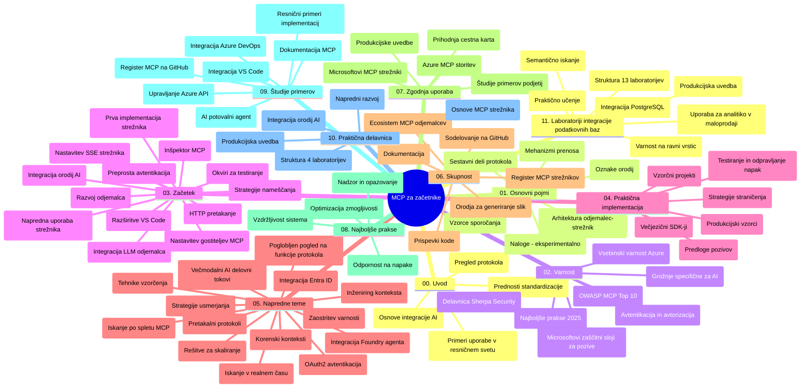

# Protokol konteksta modela (MCP) za začetnike - študijski vodič

Ta študijski vodič ponuja pregled strukture skladišča in vsebine učnega načrta "Protokol konteksta modela (MCP) za začetnike". Uporabite ta vodič za učinkovito krmarjenje po skladišču in izkoriščanje razpoložljivih virov.

## Pregled skladišča

Protokol konteksta modela (MCP) je standardiziran okvir za interakcije med AI modeli in odjemalskimi aplikacijami. Sprva ga je ustvaril Anthropic, sedaj pa MCP vzdržuje širša skupnost MCP prek uradne organizacije na GitHubu. To skladišče nudi celovit učni načrt s praktičnimi primeri kode v C#, Javi, JavaScriptu, Pythonu in TypeScriptu, zasnovan za razvijalce AI, sistemske arhitekte in programske inženirje.

## Vizualna karta učnega načrta

## Struktura skladišča

Skladišče je organizirano v enajst glavnih razdelkov, vsak se osredotoča na različne vidike MCP:

1. **Uvod (00-Introduction/)**
   - Pregled protokola konteksta modela
   - Zakaj je standardizacija pomembna v AI potekih
   - Praktični primeri uporabe in koristi

2. **Osnovni pojmi (01-CoreConcepts/)**
   - Arhitektura odjemalec-strežnik
   - Ključne komponente protokola
   - Vzorce sporočanja v MCP

3. **Varnost (02-Security/)**
   - Varnostne grožnje v sistemih, ki temeljijo na MCP
   - Najboljše prakse za varovanje implementacij
   - Strategije avtentikacije in avtorizacije
   - **Celovita dokumentacija o varnosti**:
     - MCP varnostne najboljše prakse 2025
     - Vodnik za implementacijo varnosti vsebin Azure
     - MCP varnostni nadzor in tehnike
     - Hitri referenčni pregled najboljših praks MCP
   - **Ključne varnostne teme**:
     - Napadi z vbrizgavanjem pozivov in zastrupljanjem orodij
     - Ovdajanje sej in problemi z zmedenimi zaupniki
     - Ranljivosti prehoda žetonov
     - Prekomerne pravice in nadzor dostopa
     - Varnost dobavne verige za AI komponente
     - Integracija Microsoft Prompt Shields

4. **Začetek dela (03-GettingStarted/)**
   - Nastavitev okolja in konfiguracija
   - Ustvarjanje osnovnih MCP strežnikov in odjemalcev
   - Integracija z obstoječimi aplikacijami
   - Vsebuje razdelke za:
     - Prvo implementacijo strežnika
     - Razvoj odjemalca
     - Integracijo LLM odjemalca
     - Integracijo z VS Code
     - Strežnik s Server-Sent Events (SSE)
     - Napredno rabo strežnika
     - HTTP pretakanje
     - Integracijo AI Toolkit
     - Strategije testiranja
     - Smernice za nameščanje

5. **Praktična implementacija (04-PracticalImplementation/)**
   - Uporaba SDK-jev v različnih programskih jezikih
   - Tehnike odpravljanja napak, testiranja in validacije
   - Oblikovanje ponovno uporabnih predlog pozivov in potekov dela
   - Vzorčni projekti s primeri implementacije

6. **Napredne teme (05-AdvancedTopics/)**
   - Tehnike inženiringa konteksta
   - Integracija agenta Foundry
   - Večvzorčni AI poteki dela
   - Demonstracije OAuth2 avtentikacije
   - Možnosti iskanja v realnem času
   - Pretakanje v realnem času
   - Implementacija osnovnih kontekstov (root contexts)
   - Strategije usmerjanja (routing)
   - Tehnike vzorčenja
   - Pristopi skaliranja
   - Varnostne premisleke
   - Integracija varnosti Entra ID
   - Integracija spletnega iskanja

7. **Prispevki skupnosti (06-CommunityContributions/)**
   - Kako prispevati kodo in dokumentacijo
   - Sodelovanje prek GitHuba
   - Izboljšave, ki jih vodi skupnost, in povratne informacije
   - Uporaba različnih MCP odjemalcev (Claude Desktop, Cline, VSCode)
   - Delo z priljubljenimi MCP strežniki, vključno z generiranjem slik

8. **Lekcije iz zgodnjega uvajanja (07-LessonsfromEarlyAdoption/)**
   - Realne implementacije in zgodbe o uspehu
   - Gradnja in nameščanje rešitev na osnovi MCP
   - Trend in prihodnja razvojna pot
   - **Vodnik za Microsoft MCP strežnike**: celovit vodič za 10 Microsoft MCP strežnikov pripravljenih za produkcijo, vključno z:
     - Microsoft Learn Docs MCP strežnik
     - Azure MCP strežnik (15+ specializiranih priključkov)
     - GitHub MCP strežnik
     - Azure DevOps MCP strežnik
     - MarkItDown MCP strežnik
     - SQL Server MCP strežnik
     - Playwright MCP strežnik
     - Dev Box MCP strežnik
     - Azure AI Foundry MCP strežnik
     - Microsoft 365 Agents Toolkit MCP strežnik

9. **Najboljše prakse (08-BestPractices/)**
   - Nastavitev zmogljivosti in optimizacija
   - Oblikovanje sistemov MCP odpornih proti napakam
   - Strategije testiranja in odpornosti

10. **Primeri uporabe (09-CaseStudy/)**
    - **Sedem celovitih primerov uporabe**, ki prikazujejo vsestranskost MCP v različnih scenarijih:
    - **Azure AI Travel Agents**: večagentna orkestracija z Azure OpenAI in AI Search
    - **Integracija Azure DevOps**: avtomatizacija procesov poteka dela z YouTube podatkovnimi posodobitvami
    - **Pridobivanje dokumentacije v realnem času**: Python konzolni odjemalec s HTTP pretakanjem
    - **Interaktivni generator študijskih načrtov**: Chainlit spletna aplikacija z konverzacijskim AI
    - **Dokumentacija v urejevalniku**: integracija VS Code s poteki dela GitHub Copilot
    - **Azure API Management**: integracija podjetniških API-jev z ustvarjanjem MCP strežnika
    - **GitHub MCP Registracija**: razvoj ekosistema in platforma za agentno integracijo
    - Primeri implementacij, ki pokrivajo podjetniško integracijo, produktivnost razvijalcev in razvoj ekosistema

11. **Praktična delavnica (10-StreamliningAIWorkflowsBuildingAnMCPServerWithAIToolkit/)**
    - Celovita praktična delavnica, ki združuje MCP z AI Toolkit
    - Izgradnja inteligentnih aplikacij, ki povezujejo AI modele s praktičnimi orodji
    - Praktični moduli, ki pokrivajo osnove, razvoj prilagojenih strežnikov in strategije produkcijske uporabe
    - **Struktura laboratorija**:
      - Laboratorij 1: Osnove MCP strežnika
      - Laboratorij 2: Napredni razvoj MCP strežnika
      - Laboratorij 3: Integracija AI Toolkit
      - Laboratorij 4: Produkcijsko nameščanje in skaliranje
    - Pristop učenja skozi laboratorije s podrobnimi navodili

12. **Laboratoriji za integracijo baze podatkov MCP strežnika (11-MCPServerHandsOnLabs/)**
    - **Celovit 13-laboratorijski učni načrt** za gradnjo produkcijsko pripravljenih MCP strežnikov z integracijo PostgreSQL
    - **Implementacija resničnih maloprodajnih analiz** z uporabo primera Zava Retail
    - **Vzorci podjetniške kakovosti**, vključno z nadzorom na ravni vrstic (Row Level Security - RLS), semantičnim iskanjem in dostopom multi-tenant do podatkov
    - **Popolna struktura laboratorijev**:
      - **Laboratoriji 00-03: Temelji** - Uvod, arhitektura, varnost, nastavitev okolja
      - **Laboratoriji 04-06: Gradnja MCP strežnika** - Oblikovanje baze podatkov, implementacija MCP strežnika, razvoj orodij
      - **Laboratoriji 07-09: Napredne funkcije** - Semantično iskanje, testiranje in odpravljanje napak, integracija VS Code
      - **Laboratoriji 10-12: Produkcija in najboljše prakse** - Namestitev, nadzor, optimizacija
    - **Tehnologije**: FastMCP framework, PostgreSQL, Azure OpenAI, Azure Container Apps, Application Insights
    - **Naučeni cilji**: Produkcijsko pripravljeni MCP strežniki, vzorci integracije baz podatkov, analitika na osnovi AI, varnost na podjetniški ravni

## Dodatni viri

Skladišče vključuje podporne vire:

- **Mapa slik**: vsebuje diagrame in ilustracije, uporabljene skozi učni načrt
- **Prevodi**: večjezična podpora z avtomatiziranimi prevodi dokumentacije
- **Uradni MCP viri**:
  - [MCP dokumentacija](https://modelcontextprotocol.io/)
  - [MCP specifikacija](https://spec.modelcontextprotocol.io/)
  - [GitHub skladišče MCP](https://github.com/modelcontextprotocol)

## Kako uporabljati to skladišče

1. **Vodeno učenje**: sledite poglavjem po vrsti (od 00 do 11) za strukturirano učno izkušnjo.
2. **Osredotočenost na jezik**: če vas zanima določen programski jezik, si oglejte imenike vzorcev za implementacije v vašem izbranem jeziku.
3. **Praktična implementacija**: začnite z razdelkom "Začetek dela" za nastavitev okolja in ustvarjanje prvega MCP strežnika in odjemalca.
4. **Napredno raziskovanje**: ko boste seznanjeni z osnovami, se poglobite v napredne teme za širitev znanja.
5. **Vključenost skupnosti**: pridružite se skupnosti MCP prek GitHub razprav in Discord kanalov za povezovanje z ekspertizami in drugimi razvijalci.

## MCP odjemalci in orodja

Učni načrt pokriva različne MCP odjemalce in orodja:

1. **Uradni odjemalci**:
   - Visual Studio Code
   - MCP v Visual Studio Code
   - Claude Desktop
   - Claude v VSCode
   - Claude API

2. **Odjemalci skupnosti**:
   - Cline (terminalski)
   - Cursor (urejevalnik kode)
   - ChatMCP
   - Windsurf

3. **Orodja za upravljanje MCP**:
   - MCP CLI
   - MCP Manager
   - MCP Linker
   - MCP Router

## Priljubljeni MCP strežniki

Skladišče predstavlja različne MCP strežnike, vključno z:

1. **Uradni Microsoft MCP strežniki**:
   - Microsoft Learn Docs MCP strežnik
   - Azure MCP strežnik (15+ specializiranih priključkov)
   - GitHub MCP strežnik
   - Azure DevOps MCP strežnik
   - MarkItDown MCP strežnik
   - SQL Server MCP strežnik
   - Playwright MCP strežnik
   - Dev Box MCP strežnik
   - Azure AI Foundry MCP strežnik
   - Microsoft 365 Agents Toolkit MCP strežnik

2. **Uradni referenčni strežniki**:
   - Datotečni sistem
   - Fetch
   - Memory
   - Sequential Thinking

3. **Generiranje slik**:
   - Azure OpenAI DALL-E 3
   - Stable Diffusion WebUI
   - Replicate

4. **Razvojna orodja**:
   - Git MCP
   - Terminal Control
   - Code Assistant

5. **Specializirani strežniki**:
   - Salesforce
   - Microsoft Teams
   - Jira & Confluence

## Prispevanje

To skladišče sprejema prispevke skupnosti. Za usmeritve o učinkovitem prispevanju v MCP ekosistem si oglejte razdelek Prispevki skupnosti.

----

*Ta študijski vodič je bil nazadnje posodobljen 5. februarja 2026, kar odraža najnovejšo MCP specifikacijo z dne 2025-11-25 in ponuja pregled skladišča do tega datuma. Vsebina skladišča se lahko po tem datumu posodobi.*

---

<!-- CO-OP TRANSLATOR DISCLAIMER START -->
**Izjava o omejitvi odgovornosti**:
Ta dokument je bil preveden z uporabo AI prevajalske storitve [Co-op Translator](https://github.com/Azure/co-op-translator). Čeprav si prizadevamo za natančnost, vas prosimo, da upoštevate, da lahko avtomatizirani prevodi vsebujejo napake ali netočnosti. Izvirni dokument v njegovem izvor­nem jeziku je treba obravnavati kot avtoritativni vir. Za ključne informacije priporočamo strokovni človeški prevod. Ne odgovarjamo za morebitna nesporazume ali napačne interpretacije, ki izhajajo iz uporabe tega prevoda.
<!-- CO-OP TRANSLATOR DISCLAIMER END -->