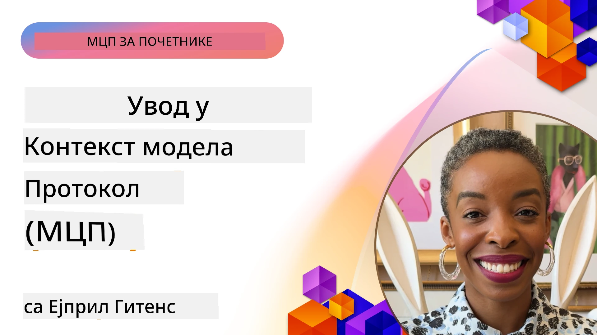
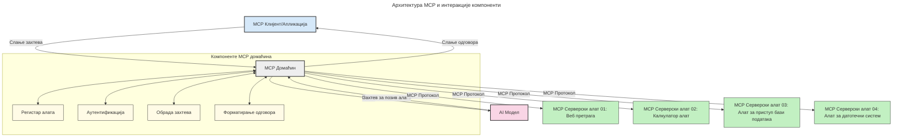

# Увод у Model Context Protocol (MCP): Зашто је важан за скалабилне AI апликације

[](https://youtu.be/agBbdiOPLQA)

_(Кликните на слику изнад да бисте гледали видео о овој лекцији)_

Генеративне AI апликације представљају значајан напредак јер корисницима омогућавају интеракцију са апликацијом коришћењем природних језичких упита. Међутим, како се више времена и ресурса улаже у такве апликације, потребно је осигурати да се функционалности и ресурси могу лако интегрисати на начин који омогућава проширење, да апликација може да ругује више модела и управља различитим сложеностима модела. Укратко, прављење генеративних AI апликација је лако да се започне, али како расту и постају сложеније, мораћете да дефинишете архитектуру и вероватно ћете морати да се ослоните на стандард да бисте обезбедили да су апликације изграђене на конзистентан начин. Управо овде MCP улази у игру да организује ствари и пружи стандард.

---

## **🔍 Шта је Model Context Protocol (MCP)?**

**Model Context Protocol (MCP)** је **отворени, стандардизовани интерфејс** који омогућава великим језичким моделима (LLM) да несметано комуницирају са спољним алатима, API-јима и изворима података. Он обезбеђује конзистентну архитектуру која проширује функционалност AI модела изван њихових података за обуку, омогућавајући паметније, скалабилније и брже AI системе.

---

## **🎯 Зашто је стандардизација у AI важна**

Како генерисане AI апликације постају сложеније, неопходно је усвојити стандарде који обезбеђују **скалабилност, проширивост, одрживост** и **избегавање закључавања код једног добављача**. MCP решава ове потребе тако што:

- Јединификује интеграције модела и алата
- Смањује крхке, једнократне прилагођене решења
- Омогућава истовремен рад више модела од различитих добављача у једном екосистему

**Напомена:** Иако се MCP промовише као отворени стандард, нема планова да се стандардизује кроз постојећа стандардна тела као што су IEEE, IETF, W3C, ISO или било које друго тело за стандардизацију.

---

## **📚 Циљеви учења**

До краја овог чланка моћи ћете да:

- Дефинишете **Model Context Protocol (MCP)** и његове употребе
- Разумете како MCP стандардизује комуникацију између модела и алата
- Идентификујете основне компоненте MCP архитектуре
- Истражите стварне примере употребе MCP у пословним и развојним контекстима

---

## **💡 Зашто је Model Context Protocol (MCP) револуција**

### **🔗 MCP решава фрагментацију у AI интеракцијама**

Пре MCP, интеграција модела са алатима захтевала је:

- Прилагођени код за сваки пар алат-модел
- Нестандардне API-је за сваког добављача
- Честа прекида услед ажурирања
- Лошу скалабилност са повећањем броја алата

### **✅ Предности стандардизације MCP-а**

| **Предност**             | **Опис**                                                                     |
|--------------------------|-------------------------------------------------------------------------------|
| Интероперабилност        | LLM ради несметано са алатима различитих добављача                           |
| Конзистентност           | Једнообразно понашање на платформама и код алата                            |
| Поновна употреба         | Алати изграђени једном могу се користити у више пројеката и система         |
| Убрзани развој           | Скратити време развоја коришћењем стандардизованих, plug-and-play интерфејса|

---

## **🧱 Преглед високог нивоа MCP архитектуре**

MCP следи модел **клијент-сервер**, где:

- **MCP хостови** покрећу AI моделе
- **MCP клијенти** иницирају захтеве
- **MCP сервери** служе контекст, алате и могућности

### **Кључне компоненте:**

- **Ресурси** – статички или динамички подаци за моделе  
- **Промптови** – унапред дефинисани токови за вођену генерацију  
- **Алате** – извршне функције као претрага, калкулације  
- **Семплинг** – агентско понашање преко рекурзивних интеракција  
- **Изазивање** – захтеви које иницира сервер за унос корисника  
- **Роотс** – границе фајл система за контролу приступа серверу  

### **Протокол архитектура:**

MCP користи двослојну архитектуру:  
- **Слој података**: комуникација заснована на JSON-RPC 2.0 са управљањем животним циклусом и примитивима  
- **Транспортни слој**: STDIO (локални) и Streamable HTTP са SSE (даљински) канали комуникације  

---

## Како MCP сервери раде

MCP сервери раде на следећи начин:

- **Ток захтева**:  
    1. Захтев иницира крајњи корисник или софтвер који делује у његовом име.  
    2. **MCP клијент** шаље захтев MCP хосту који управља AI моделом у извршењу.  
    3. **AI модел** прими упит корисника и може затражити приступ спољним алатима или подацима преко једног или више позива алатима.  
    4. **MCP хост**, а не сам модел директно, комуницира са одговарајућим **MCP сервер(има)** користећи стандардизовани протокол.  
- **Функционалности MCP хоста**:  
    - **Регистр алата**: одржава каталог доступних алата и њихове могућности.  
    - **Аутентификација**: верификује дозволе за приступ алатима.  
    - **Обрада захтева**: обрађује долазне захтеве за алате од модела.  
    - **Форматирање одговора**: структурије излазе алата у формату који модел може разумети.  
- **Извршење MCP сервера**:  
    - **MCP хост** прослеђује позиве алата једном или више **MCP сервера**, од којих сваки објављује специјализоване функције (нпр. претрага, калкулације, упити према бази података).  
    - **MCP сервери** извршавају своје операције и враћају резултате MCP хосту у конзистентном формату.  
    - **MCP хост** форматира и прослеђује ове резултате AI моделу.  
- **Завршетак одговора**:  
    - **AI модел** укључује излаз алата у коначни одговор.  
    - **MCP хост** шаље овај одговор назад MCP клијенту, који га доставља крајњем кориснику или позивајућем софтверу.  


## 👨‍💻 Како изградити MCP сервер (са примерима)

MCP сервери вам омогућавају да проширите могућности LLM-а тако што обезбеђују податке и функционалност.

Спремни да пробате? Ево језичких и/или стек специфичних SDK-ова са примерима креирања једноставних MCP сервера на разним језицима/стековима:

- **Python SDK**: https://github.com/modelcontextprotocol/python-sdk

- **TypeScript SDK**: https://github.com/modelcontextprotocol/typescript-sdk

- **Java SDK**: https://github.com/modelcontextprotocol/java-sdk

- **C#/.NET SDK**: https://github.com/modelcontextprotocol/csharp-sdk


## 🌍 Стварни случајеви употребе MCP-а

MCP омогућава широк спектар апликација проширујући AI могућности:

| **Апликација**              | **Опис**                                                                                  |
|----------------------------|--------------------------------------------------------------------------------------------|
| Корпоративна интеграција података | Повезивање LLM-а са базама података, CRM-овима или интерним алатима                 |
| Агентски AI системи         | Омогућава аутономне агенте са приступом алатима и токовима одлучивања                      |
| Мултимодалне апликације     | Комбинују текст, слику и аудио алате у јединственој AI апликацији                          |
| Интеграција података у реалном времену | Уносе живе податке у AI интеракције ради прецизнијих и актуелних резултата          |


### 🧠 MCP = Универзални стандард за AI интеракције

Model Context Protocol (MCP) делује као универзални стандард за AI интеракције, слично као што је USB-C стандардизовао физичке конекције за уређаје. У свету AI, MCP обезбеђује конзистентан интерфејс, омогућавајући моделима (клијентима) интеграцију са спољним алатима и добављачима података (серверима). Ово елиминише потребу за различитим, прилагођеним протоколима за сваки API или извор података.

По MCP-у, алат компатибилан са MCP-ом (познат као MCP сервер) прати унифицирани стандард. Ови сервери могу да наведу алате или радње које нуде и извршавају те радње када их AI агент затражи. Платформе AI агената које подржавају MCP могу да пронађу доступне алате на серверима и позову их преко овог стандардног протокола.

### 💡 Олакшава приступ знању

Поред нудења алата, MCP такође олакшава приступ знању. Омогућава апликацијама да пруже контекст великим језичким моделима (LLM) повезујући их са различитим изворима података. На пример, MCP сервер може представљати докуменатцију компаније, омогућавајући агентима да по потреби преузму релевантне информације. Други сервер може обављати специфичне радње као што су слање имејлова или ажурирање евиденција. Из перспекитве агента, ово су једноставно алати које може користити — неки враћају податке (контекст знања), а други извршавају акције. MCP успешно управља обома.

Агент који се повезује на MCP сервер аутоматски учи доступне могућности и приступачне податке сервера кроз стандардни формат. Ова стандардизација омогућава динамичку доступност алата. На пример, додавање новог MCP сервера у систем агента чини његове функције одмах корисним без потребе за додатним прилагођавањем упутстава агента.

Ова уједначена интеграција се поклапа са током приказаним у следећем дијаграму, где сервери обезбеђују и алате и знање, осигуравајући несметану сарадњу између система.

### 👉 Пример: Скалабилно агентско решење

```mermaid
---
title: Решење скалабилног агента са МЦП-ом
description: Дијаграм који илуструје како корисник комуницира са ЛЛМ-ом који се повезује са више МЦП сервера, при чему сваки сервер пружа и знање и алате, креирајући архитектуру скалабилног АИ система
---
graph TD
    User -->|Подстицај| LLM
    LLM -->|Одговор| User
    LLM -->|МЦП| ServerA
    LLM -->|МЦП| ServerB
    ServerA -->|Универзални конектор| ServerB
    ServerA --> KnowledgeA
    ServerA --> ToolsA
    ServerB --> KnowledgeB
    ServerB --> ToolsB

    subgraph Server A
        KnowledgeA[Знање]
        ToolsA[Алати]
    end

    subgraph Server B
        KnowledgeB[Знање]
        ToolsB[Алати]
    end
```Универзални конектор омогућава MCP серверима да комуницирају и деле могућности међу собом, дозвољавајући ServerA да делегира задатке ServerB-у или приступи његовим алатима и знању. Ово федерализује алате и податке између сервера, подржавајући скалабилне и модуларне агентске архитектуре. Пошто MCP стандардизује излагање алата, агенти могу динамички открити и усмеравати захтеве између сервера без уграђених интеграција.

Федерација алата и знања: Алати и подаци могу се приступити преко више сервера, омогућавајући скалабилније и модуларније агентске архитектуре.

### 🔄 Напредни MCP сценарији са интеграцијом LLM-a на клијентској страни

Поред основне MCP архитектуре, постоје напредни сценарији где и клијент и сервер садрже LLM-ове, омогућавајући софистицираније интеракције. На следећем дијаграму, **Client App** може бити IDE са неколико MCP алата доступних LLM-у за коришћење:

```mermaid
---
title: Напредни МЦП сценарији са интеграцијом клијент-сервер ЛЛМ
description: Дијаграм секвенци који приказује детаљан ток интеракције између корисника, клијент апликације, клијент ЛЛМ-а, више МЦП сервера и сервер ЛЛМ-а, илуструјући фазе откривања алата, корисничке интеракције, директног позивања алата и преговора о функцијама
---
sequenceDiagram
    autonumber
    actor User as 👤 Корисник
    participant ClientApp as 🖥️ Клијент апликација
    participant ClientLLM as 🧠 Клијент ЛЛМ
    participant Server1 as 🔧 МЦП сервер 1
    participant Server2 as 📚 МЦП сервер 2
    participant ServerLLM as 🤖 Сервер ЛЛМ
    
    %% Discovery Phase
    rect rgb(220, 240, 255)
        Note over ClientApp, Server2: ФАЗА ОТКРИВАЊА АЛАТА
        ClientApp->>+Server1: Захтевај расположиве алате/ресурсе
        Server1-->>-ClientApp: Враћа листу алата (JSON)
        ClientApp->>+Server2: Захтевај расположиве алате/ресурсе
        Server2-->>-ClientApp: Враћа листу алата (JSON)
        Note right of ClientApp: Локално сачувај<br/>комбиновани каталог алата
    end
    
    %% User Interaction
    rect rgb(255, 240, 220)
        Note over User, ClientLLM: ФАЗА КОРИСНИЧКЕ ИНТЕРАКЦИЈЕ
        User->>+ClientApp: Унеси упит природним језиком
        ClientApp->>+ClientLLM: Проследи упит + каталог алата
        ClientLLM->>-ClientLLM: Анализирај упит и изабери алате
    end
    
    %% Scenario A: Direct Tool Calling
    alt Direct Tool Calling
        rect rgb(220, 255, 220)
            Note over ClientApp, Server1: СЦЕНАРИО А: ДИРЕКТНО ПОЗИВАЊЕ АЛАТА
            ClientLLM->>+ClientApp: Захтева извршење алата
            ClientApp->>+Server1: Изврши одређени алат
            Server1-->>-ClientApp: Врати резултате
            ClientApp->>+ClientLLM: Обради резултате
            ClientLLM-->>-ClientApp: Генериши одговор
            ClientApp-->>-User: Прикажи коначни одговор
        end
    
    %% Scenario B: Feature Negotiation (VS Code style)
    else Feature Negotiation (VS Code style)
        rect rgb(255, 220, 220)
            Note over ClientApp, ServerLLM: СЦЕНАРИО Б: ПРЕГОВОР О ФУНКЦИЈАМА
            ClientLLM->>+ClientApp: Идентификуј потребне могућности
            ClientApp->>+Server2: Преговарај о функцијама/могућностима
            Server2->>+ServerLLM: Захтева додатни контекст
            ServerLLM-->>-Server2: Обезбеди контекст
            Server2-->>-ClientApp: Врати расположиве функције
            ClientApp->>+Server2: Позови договорене алате
            Server2-->>-ClientApp: Врати резултате
            ClientApp->>+ClientLLM: Обради резултате
            ClientLLM-->>-ClientApp: Генериши одговор
            ClientApp-->>-User: Прикажи коначни одговор
        end
    end
```
## 🔐 Практичне предности MCP-а

Ево практичних предности коришћења MCP-а:

- **Актуелност**: Модели могу приступити ажурираним информацијама ван података за обуку  
- **Проширење могућности**: Модели могу користити специјализоване алате за задатке за које нису обучени  
- **Смањење халуцинација**: Спољашњи извори података обезбеђују чињеничну подлогу  
- **Приваматност**: Осетљиви подаци могу остати у безбедном окружењу уместо у уграђеним упитима  

## 📌 Кључне поуке

Ево кључних поука за коришћење MCP-а:

- **MCP** стандардизује како AI модели комуницирају са алатима и подацима  
- Промовише **проширивост, конзистентност и интероперабилност**  
- MCP помаже да се **скрати време развоја, побољша поузданост и прошире могућности модела**  
- Архитектура клијент-сервер омогућава флексибилне, прошириве AI апликације  

## 🧠 Вежба

Размислите о AI апликацији коју желите да направите.

- Који **спољни алати или подаци** би могли побољшати њене могућности?  
- Како MCP може учинити интеграцију **једноставнијом и поузданијом?**  

## Додатни ресурси

- [MCP GitHub репозиторијум](https://github.com/modelcontextprotocol)


## Шта следи

Следеће: [Поглавље 1: Основни појмови](../01-CoreConcepts/README.md)

---

<!-- CO-OP TRANSLATOR DISCLAIMER START -->
**Изјава о одрицању одговорности**:
Овај документ је преведен помоћу AI сервиса за превођење [Co-op Translator](https://github.com/Azure/co-op-translator). Иако тежимо прецизности, имајте у виду да аутоматски преводи могу садржати грешке или нетачности. Изворни документ на његовом оригиналном језику треба сматрати ауторитетним. За критичне информације препоручује се професионални превод од стране људског преводиоца. Није нам могуће одговарати за било какве неспоразуме или погрешне тумачења настале употребом овог превода.
<!-- CO-OP TRANSLATOR DISCLAIMER END -->