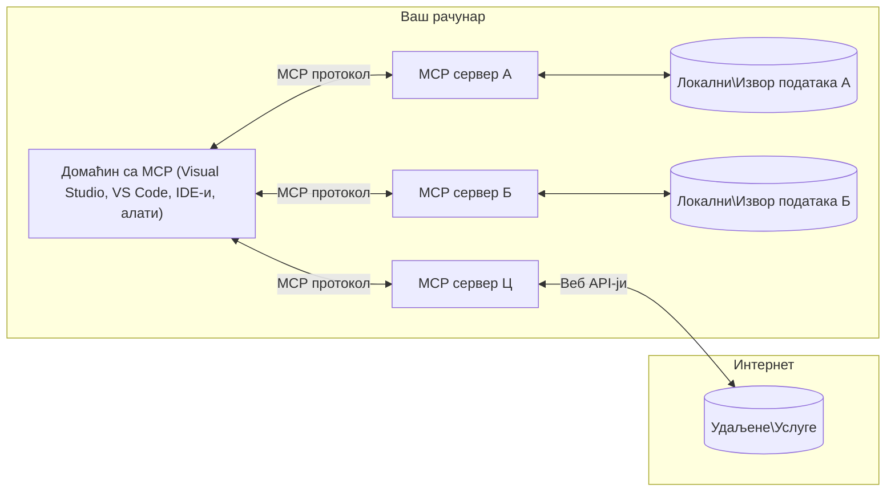

# MCP Основни Концепти: Савладавање Протокола Контекста Модела за AI Интеграцију

[](https://youtu.be/earDzWGtE84)

_(Кликните на слику изнад да бисте погледали видео о овој лекцији)_

[Model Context Protocol (MCP)](https://github.com/modelcontextprotocol) је моћан, стандардизован оквир који оптимизује комуникацију између великих језичких модела (LLM) и спољних алата, апликација и извора података.  
Овај водич ће вас провести кроз основне концепте MCP-а. Учићете о његовој клијент-сервер архитектури, битним компонентама, механизмима комуникације и најбољим праксама имплементације.

- **Јасна сагласност корисника**: Сав приступ подацима и операције захтевају изричиту корисничку дозволу пре извођења. Корисници морају јасно разумети који ће подаци бити приступљени и које ће се радње извршити, са детаљном контролом над дозволама и овлашћењима.

- **Заштита приватности података**: Кориснички подаци се откривају само уз изричиту сагласност и морају бити заштићени робусним контролама приступа током целог животног циклуса интеракције. Имплементације морају спречити неовлашћену трансмисију података и одржавати строге границе приватности.

- **Безбедност извођења алата**: Свака иницијација алата захтева изричиту корисничку сагласност са јасним разумевањем функционалности алата, параметара и потенцијалног утицаја. Јаке сигурносне границе морају спречити нежељено, небезбедно или злонамерно извршење алата.

- **Сигурност транспорта**: Сви канали комуникације треба да користе одговарајуће механизме шифровања и аутентификације. Удаљене везе треба да имплементирају сигурне протоколе транспорта и правилно управљају акредитивима.

#### Упутства за имплементацију:

- **Управљање дозволама**: Имплементирати системе детаљних дозвола који омогућавају корисницима да контролишу којим серверима, алатима и ресурсима имају приступ  
- **Аутентификација и овлашћење**: Користити сигурне методе аутентификације (OAuth, API кључеви) са одговарајућим управљањем и истеком токена  
- **Валидација уноса**: Валидација свих параметара и уноса података у складу са дефинисаним шемама ради спречавања инјекционих напада  
- **Рачуноводствени записници**: Одржавање свеобухватних логова свих операција за надзор безбедности и усаглашеност

## Преглед

Ова лекција истражује основну архитектуру и компоненте које чине екосистем Модел Контекст Протокола (MCP). Учићете о клијент-сервер архитектури, кључним компонентама и механизмима комуникације који покрећу MCP интеракције.

## Кључни циљеви учења

До краја ове лекције, ви ћете:

- Разумети MCP клијент-сервер архитектуру.
- Идентификовати улоге и одговорности Host-ова, Client-ова и Server-ова.
- Анализирати језгровне карактеристике које чине MCP флексибилним интеграционим слојем.
- Упознати се са током информација унутар MCP екосистема.
- Стећи практична знања кроз примере кода у .NET, Јава, Пајтон и ЈаваСкрипт.

## MCP Архитектура: Детаљнији Поглед

MCP екосистем је изграђен на модулу клијент-сервер модела. Ова модуларна структура омогућава AI апликацијама да ефикасно комуницирају са алатима, базама података, API-јевима и контекстуалним ресурсима. Хајде да разложимо ову архитектуру на њене основне компоненте.

У свом језгру, MCP следи клијент-сервер архитектуру где Хост апликација може да се повеже са више сервера:


- **MCP Hosts**: Програми као што су VSCode, Claude Desktop, IDE-ови или AI алати који желе приступ подацима кроз MCP  
- **MCP Clients**: Клијенти протокола који одржавају 1:1 везе са серверима  
- **MCP Servers**: Лака програма која свака посебно излажу специфичне могућности кроз стандардизовани Model Context Protocol  
- **Локални извори података**: Фајлови, базе података и сервиси на вашем рачунару до којих MCP сервери могу сигурно приступити  
- **Удаљене услуге**: Спољни системи доступни преко интернета са којима се MCP сервери могу повезати путем API-ја.

MCP протокол је еволутивни стандард користећи верзионисање базирано на датуму (формат ГГГГ-ММ-ДД). Тренутна верзија протокола је **2025-11-25**. Можете видети најновија ажурирања на [спецификацији протокола](https://modelcontextprotocol.io/specification/2025-11-25/)

### 1. Hosts

У Model Context Protocol (MCP), **Hosts** су AI апликације које служе као примарни интерфејс кроз који корисници комуницирају са протоколом. Hosts координирају и управљају везама према више MCP сервера креирајући посебне MCP клијенте за сваку серверску везу. Примери Host-ова укључују:

- **AI апликације**: Claude Desktop, Visual Studio Code, Claude Code  
- **Развојна окружења**: IDE-ови и уредници кода са MCP интеграцијом  
- **Прилагођене апликације**: Намјенски AI агенти и алати

**Hosts** су апликације које координирају интеракцију AI модела. Они:

- **Оркестрација AI модела**: Извршавају или комуницирају са LLM како би генерисали одговоре и координирали AI радне токове  
- **Управљање клијент везама**: Креирају и одржавају по једног MCP клијента за сваку сервер везу  
- **Контрола корисничког интерфејса**: Руководе током разговора, корисничким интеракцијама и приказом одговора  
- **Примена безбедности**: Контролишу дозволе, безбедносне ограничења и аутентификацију  
- **Руковање корисничком сагласношћу**: Управљају одобрењем корисника за дељење података и извршавање алата

### 2. Клијенти

**Клијенти** су есенцијалне компоненте које одржавају посвећене један на један везе између Host-ова и MCP сервера. Сваки MCP клијент се инстанцира од стране Host-а да се повеже са специфичним MCP сервером, обезбеђујући организоване и сигурне комуникационе канале. Више клијената омогућава Host-у да истовремено комуницира са више сервера.

**Клијенти** су конекторске компоненте унутар Host апликације. Они:

- **Комуникација протоколом**: Слање JSON-RPC 2.0 захтева ка серверима са упитима и инструкцијама  
- **Неговање могућности**: Преговарају подржане функције и верзије протокола са сервером током иницијализације  
- **Извршење алата**: Управљају захтевима за извршење алата од стране модела и процесуирају одговоре  
- **Ажурирања у реалном времену**: Руководе нотификацијама и ажурирањима сервера у реалном времену  
- **Обработка одговора**: Процесуирају и форматирају серверске одговоре за приказ корисницима

### 3. Сервери

**Сервери** су програми који пружају контекст, алате и могућности MCP клијентима. Они могу радити локално (на истом рачунару као Host) или удаљено (на спољним платформама), и одговарају за обраду захтева клијената и пружање структурираних одговора. Сервери излажу специфичну функционалност кроз стандардизовани Model Context Protocol.

**Сервери** су сервиси који пружају контекст и могућности. Они:

- **Регистрација функција**: Региструју и излажу доступне примитиве (ресурсе, упите, алате) клијентима  
- **Обрада захтева**: Примају и извршавају позиве алата, захтеве за ресурсима и упите од клијената  
- **Обезбеђење контекста**: Пружају контекстуалне информације и податке за побољшање одговора модела  
- **Управљање стањем**: Одржавају стање сесије и руковође интеракцијама које захтевају стање  
- **Нотификације у реалном времену**: Шаљу обавештења о променама могућности и ажурирања повезаним клијентима

Сервере може развијати било ко ради проширења могућности модела специјализованом функционалношћу, и подржавају оба сценарија локалне и удаљене примене.

### 4. Серверски примитиви

Сервери у Model Context Protocol-у (MCP) пружају три основна **примитива** која дефинишу фундаменталне блокове за богате интеракције између клијената, host-ова и језичких модела. Ови примитиви одређују типове контекстуалних информација и акција доступних кроз протокол.

MCP сервери могу излагати било коју комбинацију следећа три основна примитива:

#### Ресурси

**Ресурси** су извори података који пружају контекстуалне информације AI апликацијама. Они представљају статичке или динамичке садржаје који могу побољшати разумевање модела и доношење одлука:

- **Контекстуални подаци**: Структуриране информације и контекст за коришћење од стране AI модела  
- **Базе знања**: Репозиторијуми докумената, чланци, приручници и истраживачки радови  
- **Локални извори података**: Фајлови, базе података и информације локалног система  
- **Спољашњи подаци**: API одговори, веб сервиси и подаци удаљених система  
- **Динамички садржај**: Подаци у реалном времену који се ажурирају на основу спољних услова

Ресурси су идентификовани URI-јевима и подржавају откривање преко `resources/list` и приступ преко `resources/read` метода:

```text
file://documents/project-spec.md
database://production/users/schema
api://weather/current
```

#### Упити

**Упити** су поново искоришћиви шаблони који помажу структуирању интеракција са језичким моделима. Они пружају стандардизоване образце интеракције и шаблонизоване радне токове:

- **Интеракције засноване на шаблонима**: Унапред структуиране поруке и иницијатори разговора  
- **Шаблони радних токова**: Стандардизовани низови за уобичајене задатке и интеракције  
- **Примери са мањим бројем узорака**: Шаблони засновани на примерима за инструкције модела  
- **Системски упити**: Основни упити који дефинишу понашање и контекст модела  
- **Динамички шаблони**: Параметризовани упити који се прилагођавају специфичним контекстима

Упити подржавају замену варијабли и могу се открити преко `prompts/list` и преузети помоћу `prompts/get`:

```markdown
Generate a {{task_type}} for {{product}} targeting {{audience}} with the following requirements: {{requirements}}
```

#### Алатке

**Алатке** су извршне функције које AI модели могу позивати да изврше специфичне радње. Оне представљају "глаголе" MCP екосистема, омогућавајући моделима интеракцију са спољним системима:

- **Извршније функције**: Дискретне операције које модели могу покренути са специфичним параметрима  
- **Интеграција са спољним системима**: API позиви, упити база података, операције са фајловима, прорачуни  
- **Јединствени идентитет**: Свакој алатки припада јединствено име, опис и шема параметара  
- **Структурисани улаз-излаз**: Алатке примају валидиране параметре и враћају структуиране, типизиране одговоре  
- **Могућности извршења акција**: Омогућавају моделима да изврше радње у стварном свету и прикупе живе податке

Алатке се дефинишу путем JSON шеме за валидацију параметара и откривају преко `tools/list`, а извршавају путем `tools/call`. Алатке такође могу укључивати **иконе** као додатне метаподатке за бољи приказ у UI.

**Анотације алата**: Алатке подржавају бихејвиоралне анотације (нпр. `readOnlyHint`, `destructiveHint`) које описују да ли је алатка само за читање или деструктивна, помажући клијентима у информисаном одлучивању приликом извођења алата.

Пример дефиниције алатке:

```typescript
server.tool(
  "search_products", 
  {
    query: z.string().describe("Search query for products"),
    category: z.string().optional().describe("Product category filter"),
    max_results: z.number().default(10).describe("Maximum results to return")
  }, 
  async (params) => {
    // Изврши претрагу и врати структуиране резултате
    return await productService.search(params);
  }
);
```

## Клијентски примитиви

У Model Context Protocol (MCP), **клијенти** могу излагати примитиве који омогућавају серверима да захтевају додатне могућности од host апликације. Ови клиентски примитиви омогућавају богатије, интерактивније имплементације серверских служби које имају приступ могућностима AI модела и корисничким интеракцијама.

### Sampling

**Sampling** омогућава серверима да захтевају комплетирање језичког модела од клијентове AI апликације. Овај примитив омогућава серверима приступ LLM могућностима без уграђивања сопствених зависности модела:

- **Независан приступ моделу**: Сервери могу тражити комплетирања без укључивања LLM SDK-а или управљања приступом моделу  
- **AI иницијатива од стране сервера**: Омогућава серверима аутономно генерисање садржаја користећи AI модел клијента  
- **Рекурзивне LLM интеракције**: Подржава сложене сценарије где сервери захтевају AI помоћ за обраду  
- **Динамичка генерација садржаја**: Омогућава серверима да креирају контекстуалне одговоре користећи модел хоста  
- **Подршка позива алата**: Сервери могу укључити `tools` и `toolChoice` параметре да омогуће моделу клијента позив алата током sampling-а

Sampling се иницира путем `sampling/complete` методе, где сервери шаљу захтеве за комплетирање клијентима.

### Roots

**Roots** пружају стандардизован начин за клијенте да изложe границе фајл система серверима, помажући серверима да разумеју којим директоријумима и фајловима имају приступ:

- **Границе фајл система**: Дефинишу границе унутар којих сервери могу радити у фајл систему  
- **Контрола приступа**: Помажу серверима да разумеју коме имају дозволу приступа  
- **Динамичка ажурирања**: Клијенти могу обавештавати сервере о променама у листи roots  
- **Идентификација заснована на URI-ју**: Roots користе `file://` URI-је за идентификацију доступних директоријума и фајлова

Roots се откривају методом `roots/list`, а клијенти шаљу `notifications/roots/list_changed` када дође до промене.

### Elicitation

**Elicitation** омогућава серверима да користећи клијентов интерфејс захтевају додатне информације или потврду од корисника:

- **Захтеви за корисничким уносом**: Сервери могу тражити додатне информације кад су потребне за извршење алата  
- **Дијалози потврде**: Захтевају одобрење корисника за осетљиве или важне радње  
- **Интерактивни радни токови**: Омогућавају серверима да креирају корак по корак корисничке интеракције  
- **Динамичко прикупљање параметара**: Прикупљање недостајућих или опционих параметара током извршења алата

Захтеви elicitations се праве коришћењем методе `elicitation/request` ради прикупљања корисничких уноса преко интерфејса клијента.

**URL Mode Elicitation**: Сервери могу тражити и URL базиране корисничке интеракције, омогућавајући им да усмере кориснике на спољне веб странице за аутентификацију, потврду или унос података.

### Логовање

**Логовање** омогућава серверима да шаљу структуиране поруке лога клијентима ради дебаговања, надзора и прегледности рада:

- **Подршка за дебаговање**: Омогућава серверима да пруже детаљне записе извршења за решавање проблема  
- **Оперативни надзор**: Слање статусних ажурирања и метрика перформанси клијентима  
- **Извештавање о грешкама**: Пружање детаљног контекста грешака и дијагностике  
- **Аудиторски записи**: Креирање свеобухватних логова операција и одлука сервера

Поруке логова се шаљу клијентима како би пружиле транспарентност у раду сервера и олакшале дебаговање.

## Ток информација у MCP

Model Context Protocol (MCP) дефинише структуриран ток информација између host-ова, клијената, сервера и модела. Разумевање овог тока помаже јаснијем разумевању како се кориснички захтеви обрађују и како се спољни алати и подаци интегришу у одговоре модела.

- **Хост иницира везу**  
  Host апликација (као што је IDE или интерфејс за разговор) успоставља везу са MCP сервером, обично преко STDIO, WebSocket-а или другог подржаног транспорта.

- **Неговање могућности**  
  Клијент (уграђен у host) и сервер размењују информације о подржаним функцијама, алатима, ресурсима и верзијама протокола. Ово обезбеђује обострано разумевање доступних могућности за сесију.

- **Кориснички захтев**  
  Корисник комуницира са host-ом (нпр. уноси упит или команду). Host прикупља овај унос и прослеђује га клијенту на обраду.

- **Коришћење ресурса или алата**  
  - Клијент може захтевати додатни контекст или ресурсе од сервера (као што су фајлови, записи из базе података или чланци из базе знања) ради обогаћења разумевања модела.  
  - Ако модел одлучи да је потребан алат (нпр. за преузимање података, извођење прорачуна или позив API-ја), клијент шаље захтев за покретање алатке серверу, са именом алатке и параметрима.

- **Извршење сервера**  

Сервер прима захтев за ресурс или алат, извршава неопходне операције (као што су покретање функције, упит у базу података или преузимање датотеке) и враћа резултате клијенту у структурираном формату.

- **Генерисање одговора**  
  Клијент интегрише одговоре сервера (подаци о ресурсима, излази алата итд.) у текућу интеракцију са моделом. Модел користи те информације да би генерисао свеобухватан и контекстуално релевантан одговор.

- **Приказ резултата**  
  Домаћин прима коначни излаз од клијента и представља га кориснику, често укључујући и текст генерисан моделом као и резултате извршења алата или претраге ресурса.

Овај ток омогућава MCP подршку напредним, интерактивним и контекстуално свесним AI апликацијама тако што неприметно повезује моделе са спољним алаткама и изворима података.

## Архитектура протокола и слојеви

MCP се састоји из два јасно дефинисана архитектонска слоја која раде заједно да пруже комплетан оквир за комуникацију:

### Слој података

**Слој података** имплементира основни MCP протокол користећи **JSON-RPC 2.0** као основу. Овај слој дефинише структуру порука, семантику и обрасце интеракције:

#### Основне компоненте:

- **JSON-RPC 2.0 протокол**: Сва комуникација користи стандардизовани JSON-RPC 2.0 формат порука за позиве метода, одговоре и нотификације  
- **Управљање животним циклусом**: Обрађује иницијализацију везе, преговор о могућностима и завршетак сесије између клијената и сервера  
- **Примитиви сервера**: Омогућавају серверима да пруже основну функцију кроз алате, ресурсе и упите  
- **Примитиви клијента**: Омогућавају серверима да захтевају узорковање од LLM-а, прикупљање уноса корисника и слање лог порука  
- **Нотификације у реалном времену**: Подржавају асинхроне нотификације за динамичке исправке без потребе за упитима

#### Кључне карактеристике:

- **Преговор верзије протокола**: Коришћење верзионисања заснованог на датуму (ГГГГ-ММ-ДД) ради осигурања компатибилности  
- **Откривање могућности**: Клијенти и сервери размењују информације о подржаним функцијама приликом иницијализације  
- **Сесије са стањем**: Одржавају стање везе кроз више интеракција ради континуитета контекста

### Транспортни слој

**Транспортни слој** управља каналима комуникације, форматирањем порука и аутентификацијом између учесника MCP протокола:

#### Подржани транспортни механизми:

1. **STDIO транспорт**:  
   - Користи стандардне улазно/излазне токове за директну комуникацију процеса  
   - Оптималан за локалне процесе на истом рачунару без мрежног оптерећења  
   - Често се користи за локалне имплементације MCP сервера

2. **Streamable HTTP транспорт**:  
   - Користи HTTP POST за поруке од клијента до сервера  
   - Опционо користи Server-Sent Events (SSE) за стримовање од сервера ка клијенту  
   - Омогућава удаљену комуникацију са сервером преко мреже  
   - Подржава стандардну HTTP аутентификацију (bearer токени, API кључеви, прилагођени заглавља)  
   - MCP препоручује OAuth за безбедну аутентификацију засновану на токенима

#### Апстракција транспорта:

Транспортни слој апстрахује детаље комуникације од слоја података, омогућавајући исти JSON-RPC 2.0 формат порука преко свих транспортних механизама. Ова апстракција омогућава апликацијама лако пребацивање између локалних и удаљених сервера.

### Безбедносне разматрања

Имплементације MCP морају се придржавати неколико критичних безбедносних начела како би обезбедиле безбедне, поуздане и сигурне интеракције у свим операцијама протокола:

- **Сагласност и контролa корисника**: Корисници морају дати јасну сагласност пре приступа било којим подацима или извршавања операција. Треба да имају јасну контролу над тим који се подаци деле и које су акције овлашћене, уз интуитивне корисничке интерфејсе за преглед и одобрење активности.

- **Приватност података**: Подaци корисника треба да буду изложени само уз изричиту сагласност и морају бити заштићени одговарајућим контролама приступа. MCP имплементације морају се штитити од неовлашћеног преноса података и обезбедити очување приватности у свим интеракцијама.

- **Безбедност алата**: Пре позива било ког алата, неопходна је изричита корисничка сагласност. Корисници треба да имају јасно разумевање функционалности сваког алата, а морају се примењивати чврсте безбедносне границе како би се спречило нежелјено или несигурно извршавање алата.

Пратећи ова безбедносна начела, MCP осигурава поверење корисника, приватност и безбедност у свим интеракцијама протокола уз омогућавање снажних AI интеграција.

## Примери кода: Кључне компоненте

Испод су примери кода у неколико популарних програмских језика који илуструју како имплементирати кључне MCP серверске компоненте и алате.

### Пример у .NET: Креирање једноставног MCP сервера са алатима

Ево практичног .NET примера који показује како реализовати једноставан MCP сервер са прилагођеним алатима. Овај пример приказује како дефинисати и регистровати алате, обрадити захтеве и повезати сервер коришћењем Model Context Protocol.

```csharp
using System;
using System.Threading.Tasks;
using ModelContextProtocol.Server;
using ModelContextProtocol.Server.Transport;
using ModelContextProtocol.Server.Tools;

public class WeatherServer
{
    public static async Task Main(string[] args)
    {
        // Create an MCP server
        var server = new McpServer(
            name: "Weather MCP Server",
            version: "1.0.0"
        );
        
        // Register our custom weather tool
        server.AddTool<string, WeatherData>("weatherTool", 
            description: "Gets current weather for a location",
            execute: async (location) => {
                // Call weather API (simplified)
                var weatherData = await GetWeatherDataAsync(location);
                return weatherData;
            });
        
        // Connect the server using stdio transport
        var transport = new StdioServerTransport();
        await server.ConnectAsync(transport);
        
        Console.WriteLine("Weather MCP Server started");
        
        // Keep the server running until process is terminated
        await Task.Delay(-1);
    }
    
    private static async Task<WeatherData> GetWeatherDataAsync(string location)
    {
        // This would normally call a weather API
        // Simplified for demonstration
        await Task.Delay(100); // Simulate API call
        return new WeatherData { 
            Temperature = 72.5,
            Conditions = "Sunny",
            Location = location
        };
    }
}

public class WeatherData
{
    public double Temperature { get; set; }
    public string Conditions { get; set; }
    public string Location { get; set; }
}
```

### Пример у Јави: MCP серверске компоненте

Овај пример приказује исти MCP сервер и регистрацију алата као у претходном .NET примеру, али имплементиран у Јави.

```java
import io.modelcontextprotocol.server.McpServer;
import io.modelcontextprotocol.server.McpToolDefinition;
import io.modelcontextprotocol.server.transport.StdioServerTransport;
import io.modelcontextprotocol.server.tool.ToolExecutionContext;
import io.modelcontextprotocol.server.tool.ToolResponse;

public class WeatherMcpServer {
    public static void main(String[] args) throws Exception {
        // Креирај MCP сервер
        McpServer server = McpServer.builder()
            .name("Weather MCP Server")
            .version("1.0.0")
            .build();
            
        // Региструј алат за време
        server.registerTool(McpToolDefinition.builder("weatherTool")
            .description("Gets current weather for a location")
            .parameter("location", String.class)
            .execute((ToolExecutionContext ctx) -> {
                String location = ctx.getParameter("location", String.class);
                
                // Преузми податке о времену (поједностављено)
                WeatherData data = getWeatherData(location);
                
                // Врати форматиран одговор
                return ToolResponse.content(
                    String.format("Temperature: %.1f°F, Conditions: %s, Location: %s", 
                    data.getTemperature(), 
                    data.getConditions(), 
                    data.getLocation())
                );
            })
            .build());
        
        // Повежи сервер користећи stdio транспорт
        try (StdioServerTransport transport = new StdioServerTransport()) {
            server.connect(transport);
            System.out.println("Weather MCP Server started");
            // Држи сервер у раду докле год процес не буде завршен
            Thread.currentThread().join();
        }
    }
    
    private static WeatherData getWeatherData(String location) {
        // Имплементација би позивала Временски API
        // Пojедностављено за пример
        return new WeatherData(72.5, "Sunny", location);
    }
}

class WeatherData {
    private double temperature;
    private String conditions;
    private String location;
    
    public WeatherData(double temperature, String conditions, String location) {
        this.temperature = temperature;
        this.conditions = conditions;
        this.location = location;
    }
    
    public double getTemperature() {
        return temperature;
    }
    
    public String getConditions() {
        return conditions;
    }
    
    public String getLocation() {
        return location;
    }
}
```

### Пример у Пајтону: Изградња MCP сервера

Овај пример користи fastmcp, па вас молимо да га прво инсталирате:

```python
pip install fastmcp
```
  
Пример кода:

```python
#!/usr/bin/env python3
import asyncio
from fastmcp import FastMCP
from fastmcp.transports.stdio import serve_stdio

# Креирај FastMCP сервер
mcp = FastMCP(
    name="Weather MCP Server",
    version="1.0.0"
)

@mcp.tool()
def get_weather(location: str) -> dict:
    """Gets current weather for a location."""
    return {
        "temperature": 72.5,
        "conditions": "Sunny",
        "location": location
    }

# Алтернативни приступ коришћењем класе
class WeatherTools:
    @mcp.tool()
    def forecast(self, location: str, days: int = 1) -> dict:
        """Gets weather forecast for a location for the specified number of days."""
        return {
            "location": location,
            "forecast": [
                {"day": i+1, "temperature": 70 + i, "conditions": "Partly Cloudy"}
                for i in range(days)
            ]
        }

# Региструј алатке класе
weather_tools = WeatherTools()

# Покрени сервер
if __name__ == "__main__":
    asyncio.run(serve_stdio(mcp))
```

### Пример у Јаваскрипту: Креирање MCP сервера

Овај пример показује креирање MCP сервера у Јаваскрипту и како регистровати два алата везана за временске услове.

```javascript
// Коришћење званичног Model Context Protocol SDK
import { McpServer } from "@modelcontextprotocol/sdk/server/mcp.js";
import { StdioServerTransport } from "@modelcontextprotocol/sdk/server/stdio.js";
import { z } from "zod"; // За валидацију параметара

// Креирај MCP сервер
const server = new McpServer({
  name: "Weather MCP Server",
  version: "1.0.0"
});

// Дефиниши алат за временску прогнозу
server.tool(
  "weatherTool",
  {
    location: z.string().describe("The location to get weather for")
  },
  async ({ location }) => {
    // Обично би позивао API за временску прогнозу
    // Поједностављено за демонстрацију
    const weatherData = await getWeatherData(location);
    
    return {
      content: [
        { 
          type: "text", 
          text: `Temperature: ${weatherData.temperature}°F, Conditions: ${weatherData.conditions}, Location: ${weatherData.location}` 
        }
      ]
    };
  }
);

// Дефиниши алат за прогнозу
server.tool(
  "forecastTool",
  {
    location: z.string(),
    days: z.number().default(3).describe("Number of days for forecast")
  },
  async ({ location, days }) => {
    // Обично би позивао API за временску прогнозу
    // Поједностављено за демонстрацију
    const forecast = await getForecastData(location, days);
    
    return {
      content: [
        { 
          type: "text", 
          text: `${days}-day forecast for ${location}: ${JSON.stringify(forecast)}` 
        }
      ]
    };
  }
);

// Помоћне функције
async function getWeatherData(location) {
  // Симулирај позив API-ја
  return {
    temperature: 72.5,
    conditions: "Sunny",
    location: location
  };
}

async function getForecastData(location, days) {
  // Симулирај позив API-ја
  return Array.from({ length: days }, (_, i) => ({
    day: i + 1,
    temperature: 70 + Math.floor(Math.random() * 10),
    conditions: i % 2 === 0 ? "Sunny" : "Partly Cloudy"
  }));
}

// Повежи сервер користећи stdio транспорт
const transport = new StdioServerTransport();
server.connect(transport).catch(console.error);

console.log("Weather MCP Server started");
```
  
Овај пример у Јаваскрипту демонстрира како направити MCP клијента који се повезује са сервером, шаље упит и обрађује одговор укључујући све позиве алата који су направљени.

## Безбедност и ауторизација

MCP укључује неколико уграђених појмова и механизама за управљање безбедношћу и ауторизацијом током читавог протокола:

1. **Контрола дозвола за алате**:  
   Клијенти могу дефинисати које алате модел има право да користи током сесије. Ово осигурава да су доступни само експлицитно овлашћени алати, смањујући ризик од нежељених или несигурних операција. Дозволе се могу конфигурисати динамички на основу корисничких преференција, организационих политика или контекста интеракције.

2. **Аутентикација**:  
   Сервери могу захтевати аутентификацију пре приступа алатима, ресурсима или осетљивим операцијама. Ово може укључивати API кључеве, OAuth токене или друге шеме аутентикације. Правилна аутентикација осигурава да само поуздани клијенти и корисници могу позивати серверске могућности.

3. **Валидација**:  
   Валидација параметара је обавезна за све позиве алата. Сваки алат дефинише очекиване типове, формате и ограничења за своје параметре, а сервер валидира долазне захтеве у складу са тим. Ово спречава да укључени неисправни или злонамерни уноси допру до имплементација алата и помаже у одржавању интегритета операција.

4. **Ограничење брзине позива (rate limiting)**:  
   Да би се спречиле злоупотребе и обезбедила фер употреба ресурса сервера, MCP сервери могу применити ограничења брзине позива алата и приступа ресурсима. Ограничења могу бити по кориснику, по сесији или глобално, и помажу у заштити од напада онемогућавања услуге или прекомерне потрошње ресурса.

Комбинујући ове механизме, MCP пружа сигурну основу за интеграцију језичких модела са спољним алаткама и изворима података, пружајући корисницима и програмерима фино подешену контролу приступа и коришћења.

## Протокол поруке и ток комуникације

MCP комуникација користи структуиране **JSON-RPC 2.0** поруке за олакшавање јасних и поузданих интеракција између домаћина, клијената и сервера. Протокол дефинише специфичне обрасце порука за различите типове операција:

### Основне врсте порука:

#### **Поруке за иницијализацију**
- **`initialize` захтев**: Успоставља везу и преговара верзију протокола и могућности  
- **`initialize` одговор**: Потврђује подржане функције и информације о серверу  
- **`notifications/initialized`**: Сигнализира да је иницијализација завршена и да је сесија спремна

#### **Поруке за откривање**
- **`tools/list` захтев**: Открива доступне алате на серверу  
- **`resources/list` захтев**: Наводи расположиве ресурсе (изворе података)  
- **`prompts/list` захтев**: Преузима расположиве шаблоне упита

#### **Поруке за извршење**  
- **`tools/call` захтев**: Извршава одређени алат са датим параметрима  
- **`resources/read` захтев**: Преузима садржај одређеног ресурса  
- **`prompts/get` захтев**: Преузима шаблон упита са опционим параметрима

#### **Поруке са клијентске стране**
- **`sampling/complete` захтев**: Сервер тражи комплетирање LLM од клијента  
- **`elicitation/request`**: Сервер тражи унос корисника преко клијентског интерфејса  
- **Поруке за логовање**: Сервер шаље структуриран лог клијенту

#### **Нотификационе поруке**
- **`notifications/tools/list_changed`**: Сервер обавештава клијента о променама у листи алата  
- **`notifications/resources/list_changed`**: Сервер обавештава клијента о променама у листи ресурса  
- **`notifications/prompts/list_changed`**: Сервер обавештава клијента о променама у листи упита

### Структура порука:

Све MCP поруке прате JSON-RPC 2.0 формат са:  
- **Захтевне поруке**: Садрже `id`, `method` и опционални `params`  
- **Одговорне поруке**: Садрже `id` и или `result` или `error`  
- **Нотификационе поруке**: Садрже `method` и опционални `params` (немају `id` нити се очекује одговор)

Ова структура комуникације обезбеђује поуздане, пратљиве и прошириве интеракције које подржавају напредне сценарије као што су ажурирања у реалном времену, ланци алата и робусно руковање грешкама.

### Задаци (експериментално)

**Задаци** су експериментална функција која пружа издржљиве омотаче за извођење који омогућавају одложено преузимање резултата и праћење статуса MCP захтева:

- **Дуготрајне операције**: Праћење скупих прорачуна, аутоматизација радних токова и обрада у пакетима  
- **Одложени резултати**: Прати статус задатка и преузима резултате када се операције заврше  
- **Праћење статуса**: Надгледа напредак задатка кроз дефинисане стадијуме животног циклуса  
- **Вишестепене операције**: Подржава сложене радне токове који обухватају више интеракција

Задаци омотавају стандардне MCP захтеве како би омогућили асинхроно извршавање операција које се не могу одмах завршити.

## Кључне поуке

- **Архитектура**: MCP користи клијент-сервер архитектуру у којој домаћини управљају вишеструким клијентским везама ка серверима  
- **Учесници**: Екосистем укључује домаћине (AI апликације), клијенте (протокол конектори) и сервере (пружаоце могућности)  
- **Транспортни механизми**: Комуникација подржава STDIO (локални) и стримовано HTTP са опционим SSE (удалјени)  
- **Основне примитиве**: Сервери објављују алате (извршне функције), ресурсе (изворе података) и упите (шаблоне)  
- **Примитиви клијента**: Сервери могу тражити узорковање (LLM комплетирања са подршком за позив алата), прикупљање (унос корисника укључујући режим URL), корене (границе фајл система) и логовање од клијената  
- **Експерименталне карактеристике**: Задаци пружају издржљиве омотаче за дуготрајне операције  
- **Основ протокола**: Изграђен на JSON-RPC 2.0 са верзионисањем заснованим на датуму (тренутна: 2025-11-25)  
- **Карактеристике у реалном времену**: Подржава нотификације за динамичка ажурирања и синхронизацију у реалном времену  
- **Безбедност на првом месту**: Изричита корисничка сагласност, заштита приватности података и сигуран транспорт су основни захтеви

## Вежба

Осмислите једноставан MCP алат који би био користан у вашој области. Дефинишите:  
1. Како би се алат звао  
2. Које параметре би прихватао  
3. Који излаз би враћао  
4. Како би модел могао користити овај алат за решавање корисничких проблема

---

## Шта следи

Следеће: [Поглавље 2: Безбедност](../02-Security/README.md)

---

<!-- CO-OP TRANSLATOR DISCLAIMER START -->
**Одрицање од одговорности**:
Овај документ је преведен коришћењем AI сервиса за превођење [Co-op Translator](https://github.com/Azure/co-op-translator). Иако тежимо тачности, молимо вас да имате у виду да аутоматски преводи могу садржати грешке или нетачности. Изворни документ на његовом изворном језику треба сматрати ауторитетним извором. За критичне информације препоруучује се професионални људски превод. Нисмо одговорни за било каква неспоразуми или погрешне интерпретације настале коришћењем овог превода.
<!-- CO-OP TRANSLATOR DISCLAIMER END -->