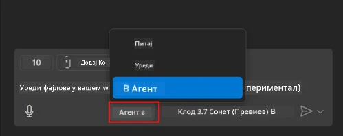
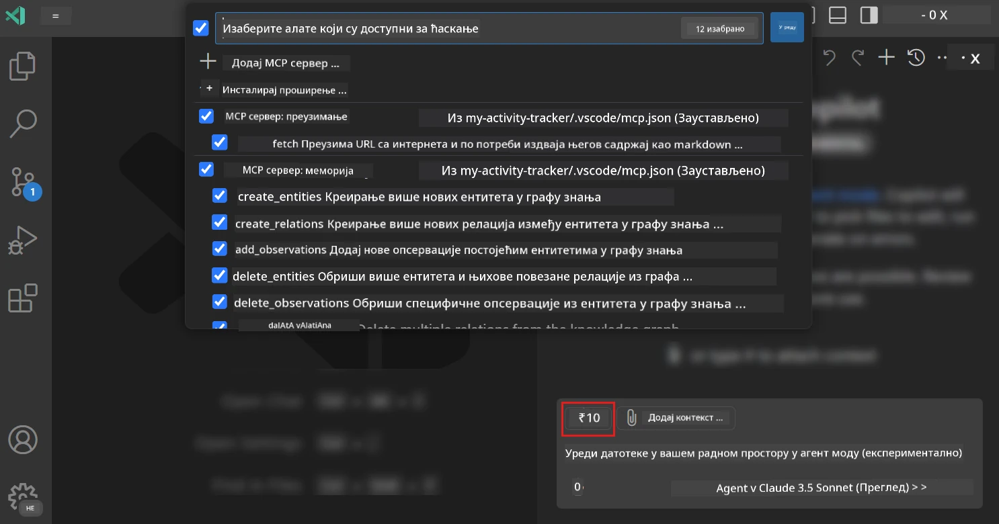
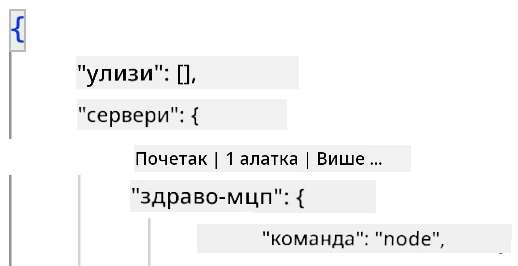
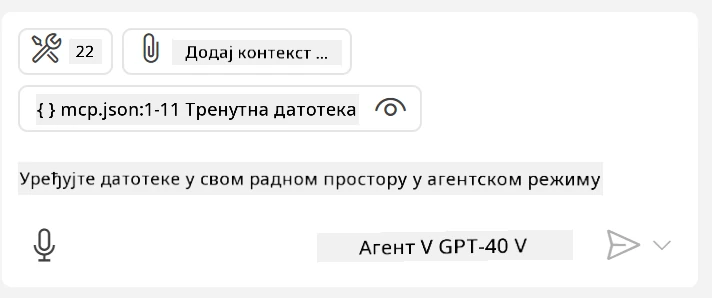
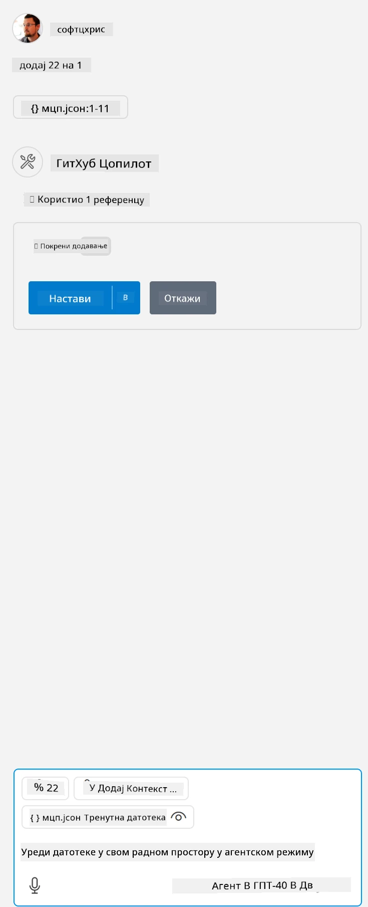

# Конзумирање сервера из режима агента GitHub Copilot-а

Visual Studio Code и GitHub Copilot могу да функционишу као клијент и конзумирају MCP сервер. Зашто бисмо то желели, питате се? Па, то значи да све функције које MCP сервер има сада могу бити коришћене директно из вашег IDE-а. Замислите да, на пример, додате GitHub-ов MCP сервер, што би вам омогућило да контролишете GitHub преко упита уместо куцања специфичних команди у терминалу. Или замислите било шта што би могло побољшати ваше искуство као програмера, све контролисано природним језиком. Сада видите предност, зар не?

## Преглед

Ова лекција покрива како да користите Visual Studio Code и режим агента GitHub Copilot-а као клијента за ваш MCP сервер.

## Циљеви учења

На крају ове лекције, моћи ћете да:

- Конзумирате MCP сервер преко Visual Studio Code-а.
- Покрећете функције као што су алати преко GitHub Copilot-а.
- Конфигуришете Visual Studio Code да пронађе и управља вашим MCP сервером.

## Коришћење

Вашим MCP сервером можете управљати на два различита начина:

- Кориснички интерфејс, видећете како се то ради касније у овом поглављу.
- Терминал, могуће је управљати стварима из терминала користећи `code` извршни фајл:

  Да бисте додали MCP сервер у ваш кориснички профил, користите командну опцију --add-mcp и наведите JSON конфигурацију сервера у облику {\"name\":\"server-name\",\"command\":...}.

  ```
  code --add-mcp "{\"name\":\"my-server\",\"command\": \"uvx\",\"args\": [\"mcp-server-fetch\"]}"
  ```

### Снимци екрана





Хајде да више разговарамо о томе како користимо визуелни интерфејс у наредним одељцима.

## Приступ

Ево како треба да приступимо овоме на високом нивоу:

- Конфигуришите фајл да пронађе ваш MCP сервер.
- Покрените/повежите се са сервером да би он приказао своје могућности.
- Користите те могућности преко интерфејса GitHub Copilot Chat-а.

Одлично, сада када разумемо ток, хајде да пробамо да користимо MCP сервер преко Visual Studio Code-а кроз вежбу.

## Вежба: Конзумирање сервера

У овој вежби, конфигурисаћемо Visual Studio Code да пронађе ваш MCP сервер како би могао да се користи преко интерфејса GitHub Copilot Chat-а.

### -0- Претходни корак, омогућите откривање MCP сервера

Можда ћете морати да омогућите откривање MCP сервера.

1. Идите на `File -> Preferences -> Settings` у Visual Studio Code-у.

1. Претражите "MCP" и омогућите `chat.mcp.discovery.enabled` у фајлу settings.json.

### -1- Креирајте конфигурациони фајл

Почните креирањем конфигурационог фајла у корену вашег пројекта, потребан вам је фајл MCP.json који треба да поставите у фасциклу .vscode. Требало би да изгледа овако:

```text
.vscode
|-- mcp.json
```

Следеће, хајде да видимо како можемо да додамо унос за сервер.

### -2- Конфигуришите сервер

Додајте следећи садржај у *mcp.json*:

```json
{
    "inputs": [],
    "servers": {
       "hello-mcp": {
           "command": "node",
           "args": [
               "build/index.js"
           ]
       }
    }
}
```

Ево једноставног примера како да покренете сервер написан у Node.js-у, за друге окружења наведите одговарајућу команду за покретање сервера користећи `command` и `args`.

### -3- Покрените сервер

Сада када сте додали унос, хајде да покренемо сервер:

1. Пронађите ваш унос у *mcp.json* и уверите се да видите икону "play":

    

1. Кликните на икону "play", требало би да видите да се број доступних алата у икони алата GitHub Copilot Chat-а повећава. Ако кликнете на ту икону алата, видећете листу регистрованих алата. Можете означити/поништити сваки алат у зависности од тога да ли желите да GitHub Copilot користи те алате као контекст:

  

1. Да бисте покренули алат, унесите упит за који знате да ће одговарати опису једног од ваших алата, на пример упит као што је "додај 22 на 1":

  

  Требало би да видите одговор који каже 23.

## Задатак

Покушајте да додате унос за сервер у ваш *mcp.json* фајл и уверите се да можете да покренете/зауставите сервер. Уверите се да можете да комуницирате са алатима на вашем серверу преко интерфејса GitHub Copilot Chat-а.

## Решење

[Решење](./solution/README.md)

## Кључни закључци

Кључни закључци из овог поглавља су следећи:

- Visual Studio Code је одличан клијент који вам омогућава да конзумирате више MCP сервера и њихових алата.
- Интерфејс GitHub Copilot Chat-а је начин на који комуницирате са серверима.
- Можете затражити од корисника уносе као што су API кључеви који се могу проследити MCP серверу приликом конфигурисања уноса у *mcp.json* фајлу.

## Примери

- [Java калкулатор](../samples/java/calculator/README.md)
- [.Net калкулатор](../../../../03-GettingStarted/samples/csharp)
- [JavaScript калкулатор](../samples/javascript/README.md)
- [TypeScript калкулатор](../samples/typescript/README.md)
- [Python калкулатор](../../../../03-GettingStarted/samples/python)

## Додатни ресурси

- [Документација за Visual Studio](https://code.visualstudio.com/docs/copilot/chat/mcp-servers)

## Шта следи

- Следеће: [Креирање stdio сервера](../05-stdio-server/README.md)

---

**Одрицање од одговорности**:  
Овај документ је преведен коришћењем услуге за превођење помоћу вештачке интелигенције [Co-op Translator](https://github.com/Azure/co-op-translator). Иако се трудимо да превод буде тачан, молимо вас да имате у виду да аутоматизовани преводи могу садржати грешке или нетачности. Оригинални документ на његовом изворном језику треба сматрати меродавним извором. За критичне информације препоручује се професионални превод од стране људи. Не преузимамо одговорност за било каква погрешна тумачења или неспоразуме који могу настати услед коришћења овог превода.