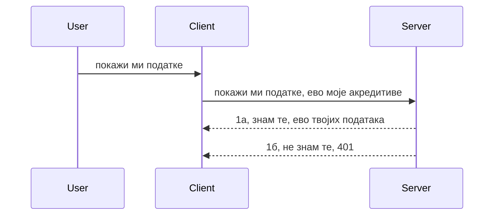

# Једноставна аутентификација

MCP SDK-ови подржавају коришћење OAuth 2.1 што је, да будемо искрени, прилично сложен процес који укључује концепте као што су auth сервер, resource сервер, слање акредитација, добијање кода, размена кода за bearer token док коначно не добијете своје податке ресурсa. Ако нисте упознати са OAuth-ом, што је сјајна ствар за имплементирати, добра је идеја да започнете са неким основним нивоом аутентификације и изграђујете га до све боље и боље безбедности. Зато овај поглавље постоји, да вас припреми за напреднију аутентификацију.

## Аутентикација, шта то значи?

Аутент и ауторизација су скраћено аутх. Идеја је да треба да урадимо две ствари:

- **Аутентификација**, што је процес утврђивања да ли човек има право да уђе у нашу кућу, да ли има право да буде "овде", односно да има приступ нашем ресурс серверу где живе наше функције MCP сервера.
- **Ауторизација**, процес проналажења да ли корисник треба да има приступ овим конкретним ресурсима за које тражи приступ, на пример ови налози или ови производи или да ли имају дозволу да читају садржај али не и да бришу као други пример.

## Акредитације: како кажемо систему ко смо

Па, већина веб програмера почиње да размишља у смислу да обезбеди акредитацију серверу, обично неки тајни кључ који каже да ли им је дозвољено да буду овде "Аутентикација". Ова акредитација је обично base64 кодирана верзија корисничког имена и лозинке или API кључ који јединствено идентификује одређеног корисника.

Ово подразумева слање преко заглавља под називом "Authorization" овако:

```json
{ "Authorization": "secret123" }
```

Ово се обично назива основна аутентификација. Како укупни ток функционише описано је на следећи начин:


Сада када разумемо како то функционише из угла тока, како то имплементирати? Па, већина веб сервера има концепт који се зове middleware, део кода који се покреће као део захтева и може да верификује акредитације, и ако су акредитације важеће дозвољава пролаз захтева. Ако захтев нема важеће акредитације добија се грешка аутентификације. Да видимо како се ово може имплементирати:

**Python**

```python
class AuthMiddleware(BaseHTTPMiddleware):
    async def dispatch(self, request, call_next):

        has_header = request.headers.get("Authorization")
        if not has_header:
            print("-> Missing Authorization header!")
            return Response(status_code=401, content="Unauthorized")

        if not valid_token(has_header):
            print("-> Invalid token!")
            return Response(status_code=403, content="Forbidden")

        print("Valid token, proceeding...")
       
        response = await call_next(request)
        # додајте било какве корисничке заглавља или промените на неки начин одговор
        return response


starlette_app.add_middleware(CustomHeaderMiddleware)
```

Овде имамо:

- Креиран middleware под називом `AuthMiddleware` где се његова метода `dispatch` позива од стране веб сервера.
- Додат middleware веб серверу:

    ```python
    starlette_app.add_middleware(AuthMiddleware)
    ```

- Исписана логика валидности која проверава да ли је Authorization заглавље присутно и да ли је тајна која се шаље валидна:

    ```python
    has_header = request.headers.get("Authorization")
    if not has_header:
        print("-> Missing Authorization header!")
        return Response(status_code=401, content="Unauthorized")

    if not valid_token(has_header):
        print("-> Invalid token!")
        return Response(status_code=403, content="Forbidden")
    ```

    ако је тајна присутна и важећа, онда дозвољавамо пролаз захтева позивајући `call_next` и враћамо одговор.

    ```python
    response = await call_next(request)
    # додати било какве корисничке заглавља или на неки начин изменити одговор
    return response
    ```

Како ради: ако се направи веб захтев ка серверу, middleware ће бити позван и дато његово имплементирање или ће пустити захтев да прође или ће вратити грешку која указује да клијент нема дозволу да настави.

**TypeScript**

Овде креирамо middleware са популарним Express оквиром и пресрећемо захтев пре него што стигне до MCP сервера. Ево кода за то:

```typescript
function isValid(secret) {
    return secret === "secret123";
}

app.use((req, res, next) => {
    // 1. Да ли постоји заглавље овлашћења?
    if(!req.headers["Authorization"]) {
        res.status(401).send('Unauthorized');
    }
    
    let token = req.headers["Authorization"];

    // 2. Провери ваљаност.
    if(!isValid(token)) {
        res.status(403).send('Forbidden');
    }

   
    console.log('Middleware executed');
    // 3. Преноси захтев у следећи корак у ланцу захтева.
    next();
});
```

У овом коду ми:

1. Проверавамо да ли Authorization заглавље уопште постоји, ако не постоји шаљемо грешку 401.
2. Убедимо се да је акредитација/токен важећи, ако није шаљемо грешку 403.
3. Коначно прослеђује захтев даље по линији захтева и враћа тражени ресурс.

## Вежба: Имплементирај аутентификацију

Хајде да искористимо наше знање и покушамо да то имплементирамо. План је следећи:

Сервер

- Креирај веб сервер и MCP инстанцу.
- Имплементирај middleware за сервер.

Клијент

- Пошаљи веб захтев са акредитацијом, преко заглавља.

### -1- Креирај веб сервер и MCP инстанцу

У првом кораку, треба да креирамо инстанцу веб сервера и MCP сервера.

**Python**

Овде креирамо MCP сервер инстанцу, креирамо starlette веб апликацију и хостирамо је користећи uvicorn.

```python
# креирање MCP сервера

app = FastMCP(
    name="MCP Resource Server",
    instructions="Resource Server that validates tokens via Authorization Server introspection",
    host=settings["host"],
    port=settings["port"],
    debug=True
)

# креирање starlette веб апликације
starlette_app = app.streamable_http_app()

# сервирање апликације преко uvicorn-а
async def run(starlette_app):
    import uvicorn
    config = uvicorn.Config(
            starlette_app,
            host=app.settings.host,
            port=app.settings.port,
            log_level=app.settings.log_level.lower(),
        )
    server = uvicorn.Server(config)
    await server.serve()

run(starlette_app)
```

У овом коду:

- Креирамо MCP сервер.
- Конструишемо starlette веб апликацију из MCP сервера, `app.streamable_http_app()`.
- Хостирамо и серверамо веб апликацију користећи uvicorn `server.serve()`.

**TypeScript**

Овде креирамо једну MCP сервер инстанцу.

```typescript
const server = new McpServer({
      name: "example-server",
      version: "1.0.0"
    });

    // ... подешавање сервера, алата и упита ...
```

Ова пружања MCP сервера мора се десити у дефиницији руте POST /mcp, па хајде да узмемо горњи код и преместимо га овако:

```typescript
import express from "express";
import { randomUUID } from "node:crypto";
import { McpServer } from "@modelcontextprotocol/sdk/server/mcp.js";
import { StreamableHTTPServerTransport } from "@modelcontextprotocol/sdk/server/streamableHttp.js";
import { isInitializeRequest } from "@modelcontextprotocol/sdk/types.js"

const app = express();
app.use(express.json());

// Мапа за чување транспорта по ИД сесије
const transports: { [sessionId: string]: StreamableHTTPServerTransport } = {};

// Обрада POST захтева за комуникацију од клијента ка серверу
app.post('/mcp', async (req, res) => {
  // Провера постојећег ИД-а сесије
  const sessionId = req.headers['mcp-session-id'] as string | undefined;
  let transport: StreamableHTTPServerTransport;

  if (sessionId && transports[sessionId]) {
    // Поновна употреба постојећег транспорта
    transport = transports[sessionId];
  } else if (!sessionId && isInitializeRequest(req.body)) {
    // Нови захтев за иницијализацију
    transport = new StreamableHTTPServerTransport({
      sessionIdGenerator: () => randomUUID(),
      onsessioninitialized: (sessionId) => {
        // Чување транспорта по ИД-у сесије
        transports[sessionId] = transport;
      },
      // Заштита од DNS ребајнинга је подразумевано онемогућена ради уназадне компатибилности. Ако покрећете овај сервер
      // локално, обавезно подесите:
      // enableDnsRebindingProtection: true,
      // allowedHosts: ['127.0.0.1'],
    });

    // Чишћење транспорта када се затвори
    transport.onclose = () => {
      if (transport.sessionId) {
        delete transports[transport.sessionId];
      }
    };
    const server = new McpServer({
      name: "example-server",
      version: "1.0.0"
    });

    // ... подешавање серверских ресурса, алата и упита ...

    // Повезивање на MCP сервер
    await server.connect(transport);
  } else {
    // Неважећи захтев
    res.status(400).json({
      jsonrpc: '2.0',
      error: {
        code: -32000,
        message: 'Bad Request: No valid session ID provided',
      },
      id: null,
    });
    return;
  }

  // Обрада захтева
  await transport.handleRequest(req, res, req.body);
});

// Поновно употребљиви обрадник за GET и DELETE захтеве
const handleSessionRequest = async (req: express.Request, res: express.Response) => {
  const sessionId = req.headers['mcp-session-id'] as string | undefined;
  if (!sessionId || !transports[sessionId]) {
    res.status(400).send('Invalid or missing session ID');
    return;
  }
  
  const transport = transports[sessionId];
  await transport.handleRequest(req, res);
};

// Обрада GET захтева за обавештења са сервера ка клијенту преко SSE
app.get('/mcp', handleSessionRequest);

// Обрада DELETE захтева за завршетак сесије
app.delete('/mcp', handleSessionRequest);

app.listen(3000);
```

Сада видите како је креирање MCP сервера премештено унутар `app.post("/mcp")`.

Прелазимо на следећи корак, креирање middleware-а да бисмо валидирали долазне акредитације.

### -2- Имплементирај middleware за сервер

Хајде да преместимо на део middleware-а следеће. Креираћемо middleware који тражи акредитацију у `Authorization` заглављу и верификује је. Ако је прихватљиво, захтев ће се наставити радити оно што треба (нпр. приказати алате, читати ресурс или било коју MCP функционалност коју клијент тражи).

**Python**

Да креирамо middleware, потребно је направити класу која наследи `BaseHTTPMiddleware`. Постоје два значајна дела:

- Захтев `request`, из којег читамо информације из заглавља.
- `call_next` је позив који морамо извршити ако клијент донесе акредитацију коју прихватамо.

Прво, морамо обрадити случај ако `Authorization` заглавље недостаје:

```python
has_header = request.headers.get("Authorization")

# нема заглавља, неуспех са 401, у супротном наставити.
if not has_header:
    print("-> Missing Authorization header!")
    return Response(status_code=401, content="Unauthorized")
```

Овде шаљемо 401 поруку неовлашћеног приступа јер клијент није успешно аутентификован.

Затим, ако је акредитација послата, морамо проверити њену валидност овако:

```python
 if not valid_token(has_header):
    print("-> Invalid token!")
    return Response(status_code=403, content="Forbidden")
```

Обратите пажњу како шаљемо поруку 403 забрањено. Хајде да видимо целокупан middleware који имплементира све горе поменуто:

```python
class AuthMiddleware(BaseHTTPMiddleware):
    async def dispatch(self, request, call_next):

        has_header = request.headers.get("Authorization")
        if not has_header:
            print("-> Missing Authorization header!")
            return Response(status_code=401, content="Unauthorized")

        if not valid_token(has_header):
            print("-> Invalid token!")
            return Response(status_code=403, content="Forbidden")

        print("Valid token, proceeding...")
        print(f"-> Received {request.method} {request.url}")
        response = await call_next(request)
        response.headers['Custom'] = 'Example'
        return response

```

Сјајно, али шта је са функцијом `valid_token`? Ево је овде:
:

```python
# НЕ користите за производњу - побољшајте то !!
def valid_token(token: str) -> bool:
    # уклоните префикс "Bearer "
    if token.startswith("Bearer "):
        token = token[7:]
        return token == "secret-token"
    return False
```

Ово је наравно могуће побољшати.

ВАЖНО: НИКАДА не бисте требали чувати тајне као што је ова у коду. Најбоље би било да вредност за поређење добијете из извора података или од IDP-а (пробављач идентитета) или још боље, дозволите IDP-у да изврши валидацију.

**TypeScript**

Да бисмо ово имплементирали са Express-ом, морамо позвати `use` метод који прихвата middleware функције.

Треба да:

- Радимо са променљивом захтева да проверимо прослеђену акредитацију у својству `Authorization`.
- Валидација акредитације, и ако је у реду, оставимо захтев да настави тако да MCP захтев клијента ради шта треба (нпр. прикажи алате, читај ресурс или било шта друго везано за MCP).

Овде проверавамо да ли `Authorization` заглавље постоји, и ако не, заустављамо захтев даље пролазак:

```typescript
if(!req.headers["authorization"]) {
    res.status(401).send('Unauthorized');
    return;
}
```

Ако заглавље уопште није послато добијате 401.

Затим проверавамо валидност акредитације, и ако није важећа, поново заустављамо захтев али са мало другачијом поруком:

```typescript
if(!isValid(token)) {
    res.status(403).send('Forbidden');
    return;
} 
```

Обратите пажњу да сада добијате 403 грешку.

Ево целокупног кода:

```typescript
app.use((req, res, next) => {
    console.log('Request received:', req.method, req.url, req.headers);
    console.log('Headers:', req.headers["authorization"]);
    if(!req.headers["authorization"]) {
        res.status(401).send('Unauthorized');
        return;
    }
    
    let token = req.headers["authorization"];

    if(!isValid(token)) {
        res.status(403).send('Forbidden');
        return;
    }  

    console.log('Middleware executed');
    next();
});
```

Подесили смо веб сервер да прихвати middleware који проверава акредитацију коју клијент, надамо се, шаље. А шта је са самим клијентом?

### -3- Пошаљи веб захтев са акредитацијом преко заглавља

Треба да обезбедимо да клијент прослеђује акредитацију кроз заглавље. Пошто ћемо користити MCP клијента за то, треба да научимо како се то ради.

**Python**

За клијента, треба да проследимо заглавље са нашом акредитацијом овако:

```python
# НЕ убацујте вредност директно у код, имајте је најмање у променљивој окружења или у безбеднијем складишту
token = "secret-token"

async with streamablehttp_client(
        url = f"http://localhost:{port}/mcp",
        headers = {"Authorization": f"Bearer {token}"}
    ) as (
        read_stream,
        write_stream,
        session_callback,
    ):
        async with ClientSession(
            read_stream,
            write_stream
        ) as session:
            await session.initialize()
      
            # ПОРАДИ, шта желите да клијент уради, нпр. приказ алата, позив алата итд.
```

Обратите пажњу како попуњавамо својство `headers` овако ` headers = {"Authorization": f"Bearer {token}"}`.

**TypeScript**

Ово можемо решити у два корака:

1. Попунити конфигурациони објекат са нашом акредитацијом.
2. Проследити конфигурациони објекат транспортном слоју.

```typescript

// НЕМојте убацивати вредност као овде. Најмање треба да буде као окружна променљива и да се користи нешто попут dotenv (у развојном режиму).
let token = "secret123"

// дефиниши опцију објекта транспорта клијента
let options: StreamableHTTPClientTransportOptions = {
  sessionId: sessionId,
  requestInit: {
    headers: {
      "Authorization": "secret123"
    }
  }
};

// проследи опције објекта транспорту
async function main() {
   const transport = new StreamableHTTPClientTransport(
      new URL(serverUrl),
      options
   );
```

Овде горе видите како смо морали да креирамо објекат `options` и смештамо наша заглавља под својство `requestInit`.

ВАЖНО: Како да то побољшамо од овде? Па, садашња имплементација има неке проблеме. Прво, слање акредитације на овај начин је веома ризично осим ако немате HTTPS. Чак и онда, акредитација може бити украдена па вам треба систем где можете лако повући токен и додати додатне провере као што су одакле долази захтев, да ли се захтев јавља превише често (бихејвијер сличан боту), укратко, постоји цела гама проблема.

Међутим, треба рећи да је за врло једноставне API-је где не желите да неко позива ваш API без аутентификације, оно што имамо овде добар почетак.

Са тим речима, покушајмо да јачамо безбедност користећи стандардизован формат као што је JSON Web Token, познат и као JWT или "ЈОТ" токени.

## JSON Web Tokens, JWT

Дакле, покушавамо да побољшамо ствари од слања веома једноставних акредитација. Које су тренутне предности усвајања JWT?

- **Побољшања безбедности**. У основном auth-у, шаљете корисничко име и лозинку као base64 кодирани токен (или шаљете API кључ) изнова и изнова што повећава ризик. Са JWT-ом, шаљете корисничко име и лозинку и добијате токен у замену, а он је и временски ограничен, значи истиче. JWT омогућава лаку употребу фино подешене контроле приступа коришћењем улога, опсега и дозвола.
- **Бездржавност и скалабилност**. JWT-ови су самостални, носе све информације о кориснику и елиминишу потребу за чувањем сесије на серверу. Токен такође може бити верификован локално.
- **Интероперабилност и федерација**. JWT-ови су централни за Open ID Connect и користе се са познатим провајдерима идентитета као што су Entra ID, Google Identity и Auth0. Такође омогућавају коришћење једноставног пријављивања (single sign on) и много више, што их чини погодним за корпоративне средине.
- **Модуларност и флексибилност**. JWT се такође може користити са API Gateway-има као што су Azure API Management, NGINX и други. Подржава сценарије аутентификације и комуникацију сервер-сервис укључујући имперсонацију и сценарије делегације.
- **Перформансе и кеширање**. JWT се може кеширати после декодирања што смањује потребу за парсирањем. Ово посебно помаже код апликација са великим саобраћајем јер побољшава пропусност и смањује оптерећење изабране инфраструктуре.
- **Напредне функције**. Такође подржава интроспекцију (провера валидности на серверу) и повлачење (онаквим чини токен неважећим).

Са свим овим предностима, хајде да видимо како можемо донети нашу имплементацију на виши ниво.

## Прелазак са basic auth на JWT

Дакле, промене које треба да направимо на високом нивоу су:

- **Научити како се конструише JWT токен** и како га послати са клијента ка серверу.
- **Валидирати JWT токен**, и ако је валидан, омогућити клијенту приступ нашим ресурсима.
- **Безбедан начин чувања токена**. Како чувати овај токен.
- **Заштитити руте**. Треба заштитити руте, у нашем случају заштитити руте и одређене MCP функције.
- **Додати refresh токене**. Осигурати да креирамо токене кратког века трајања али и refresh токене дугог века трајања који се могу користити за добијање нових токена ако истекну. Такође обезбедити refresh endpoint и стратегију ротације.

### -1- Конструиши JWT токен

Прво, JWT токен има следеће делове:

- **заглавље (header)**, алгоритам који се користи и тип токена.
- **подаци (payload)**, tvrdnje, као што су sub (корисник или ентитет који токен представља, у auth сценарију обично userid), exp (кada истиче), role (улога)
- **потпис (signature)**, потписан са тајним кључем или приватним кључем.

За ово ћемо морати да конструишемо заглавље, payload и кодирани токен.

**Python**

```python

import jwt
import jwt
from jwt.exceptions import ExpiredSignatureError, InvalidTokenError
import datetime

# Тајни кључ који се користи за потписивање JWT-а
secret_key = 'your-secret-key'

header = {
    "alg": "HS256",
    "typ": "JWT"
}

# информације о кориснику, његове тврђења и време истека
payload = {
    "sub": "1234567890",               # Субјекат (ID корисника)
    "name": "User Userson",                # Прилагођено тврђење
    "admin": True,                     # Прилагођено тврђење
    "iat": datetime.datetime.utcnow(),# Време издавања
    "exp": datetime.datetime.utcnow() + datetime.timedelta(hours=1)  # Време истека
}

# енкодирај то
encoded_jwt = jwt.encode(payload, secret_key, algorithm="HS256", headers=header)
```

У горњем коду смо:

- Дефинисали header користећи алгоритам HS256 и тип као JWT.
- Конструисали payload који садржи субјекат или ид корисника, корисничко име, улогу, време издавања и крај важења што имплементира временски ограничен аспект који смо раније споменули.

**TypeScript**

Овде ће нам требати неке зависности које ће нам помоћи да конструишемо JWT токен.

Зависности

```sh

npm install jsonwebtoken
npm install --save-dev @types/jsonwebtoken
```

Сада када то имамо, хајде да направимо header, payload и кроз то креирамо кодирани токен.

```typescript
import jwt from 'jsonwebtoken';

const secretKey = 'your-secret-key'; // Користите променљиве окружења у продукцији

// Дефинишите садржај поруке
const payload = {
  sub: '1234567890',
  name: 'User usersson',
  admin: true,
  iat: Math.floor(Date.now() / 1000), // Издато у
  exp: Math.floor(Date.now() / 1000) + 60 * 60 // Истиче за 1 сат
};

// Дефинишите заглавље (опционо, jsonwebtoken подешава подразумевано)
const header = {
  alg: 'HS256',
  typ: 'JWT'
};

// Креирајте токен
const token = jwt.sign(payload, secretKey, {
  algorithm: 'HS256',
  header: header
});

console.log('JWT:', token);
```

Овај токен је:

Потписан коришћењем HS256
Важи 1 сат
Укључује тврдње као субјект (sub), име (name), админстаратор (admin), време издавања (iat) и истека (exp).

### -2- Валидирај токен

Такође ћемо морати да валидирамо токен, ово је нешто што треба да радимо на серверу како бисмо били сигурни да је оно што клијент шаље валидно. Постоји много провера које треба да урадимо, од верификације структуре до валидности. Препоручује се и додавање других провера да се утврди да ли корисник постоји у вашем систему и више.

Да валидирамо токен, потребно га је декодирати да бисмо га могли прочитати и онда почети проверавање валидности:

**Python**

```python

# Декодирајте и проверите JWT
try:
    decoded = jwt.decode(token, secret_key, algorithms=["HS256"])
    print("✅ Token is valid.")
    print("Decoded claims:")
    for key, value in decoded.items():
        print(f"  {key}: {value}")
except ExpiredSignatureError:
    print("❌ Token has expired.")
except InvalidTokenError as e:
    print(f"❌ Invalid token: {e}")

```

У овом коду позивамо `jwt.decode` користећи токен, тајни кључ и одабрани алгоритам као улазне параметре. Обратите пажњу на try-catch конструкцију јер неуспешна валидација доводи до грешке.

**TypeScript**

Овде треба да позовемо `jwt.verify` да добијемо декодирани токен који можемо да анализирамо даље. Ако овај позив не успе, значи да структура токена није исправна или није више валидан.

```typescript

try {
  const decoded = jwt.verify(token, secretKey);
  console.log('Decoded Payload:', decoded);
} catch (err) {
  console.error('Token verification failed:', err);
}
```

НАПОМЕНА: као што је раније поменуто, треба извршити додатне провере да се осигура да овај токен указује на корисника у нашем систему и да корисник има права која тврди да има.
Следеће, погледајмо контролу приступа засновану на улогама, познату и као RBAC.

## Додавање контроле приступа засноване на улогама

Идеја је да желимо да изразимо да различите улоге имају различите дозволе. На пример, претпостављамо да администратор може све, да нормални корисници могу читати/писати, а да гости могу само читати. Стога, ево неколико могућих нивоа дозвола:

- Admin.Write
- User.Read
- Guest.Read

Погледајмо како можемо имплементирати такву контролу помоћу middleware-а. Middleware-и могу бити додати по рутама као и за све руте.

**Python**

```python
from starlette.middleware.base import BaseHTTPMiddleware
from starlette.responses import JSONResponse
import jwt

# НЕ држите тајну у коду као што је ово, ово је само за демонстрационо коришћење. Прочитајте је из безбедног места.
SECRET_KEY = "your-secret-key" # ставите ово у env променљиву
REQUIRED_PERMISSION = "User.Read"

class JWTPermissionMiddleware(BaseHTTPMiddleware):
    async def dispatch(self, request, call_next):
        auth_header = request.headers.get("Authorization")
        if not auth_header or not auth_header.startswith("Bearer "):
            return JSONResponse({"error": "Missing or invalid Authorization header"}, status_code=401)

        token = auth_header.split(" ")[1]
        try:
            decoded = jwt.decode(token, SECRET_KEY, algorithms=["HS256"])
        except jwt.ExpiredSignatureError:
            return JSONResponse({"error": "Token expired"}, status_code=401)
        except jwt.InvalidTokenError:
            return JSONResponse({"error": "Invalid token"}, status_code=401)

        permissions = decoded.get("permissions", [])
        if REQUIRED_PERMISSION not in permissions:
            return JSONResponse({"error": "Permission denied"}, status_code=403)

        request.state.user = decoded
        return await call_next(request)


```

Постоји неколико различитих начина да се додели middleware као у наставку:

```python

# Алт 1: додати middleware током конструисања starlette апликације
middleware = [
    Middleware(JWTPermissionMiddleware)
]

app = Starlette(routes=routes, middleware=middleware)

# Алт 2: додати middleware након што је starlette апликација већ конструисана
starlette_app.add_middleware(JWTPermissionMiddleware)

# Алт 3: додати middleware по рути
routes = [
    Route(
        "/mcp",
        endpoint=..., # обрађивач
        middleware=[Middleware(JWTPermissionMiddleware)]
    )
]
```

**TypeScript**

Можемо користити `app.use` и middleware који ће се покрeтати за све захтеве.

```typescript
app.use((req, res, next) => {
    console.log('Request received:', req.method, req.url, req.headers);
    console.log('Headers:', req.headers["authorization"]);

    // 1. Провери да ли је ауторизацијски заглавље послато

    if(!req.headers["authorization"]) {
        res.status(401).send('Unauthorized');
        return;
    }
    
    let token = req.headers["authorization"];

    // 2. Провери да ли је токен важећи
    if(!isValid(token)) {
        res.status(403).send('Forbidden');
        return;
    }  

    // 3. Провери да ли корисник токена постоји у нашем систему
    if(!isExistingUser(token)) {
        res.status(403).send('Forbidden');
        console.log("User does not exist");
        return;
    }
    console.log("User exists");

    // 4. Верификуј да ли токен има одговарајућа овлашћења
    if(!hasScopes(token, ["User.Read"])){
        res.status(403).send('Forbidden - insufficient scopes');
    }

    console.log("User has required scopes");

    console.log('Middleware executed');
    next();
});

```

Постоји доста ствари које можемо дозволити нашем middleware-у и које НАШ middleware ТРЕБА да ради, наиме:

1. Проверити да ли је заглавље за ауторизацију присутно
2. Проверити да ли је токен валидан, зовемо `isValid` што је метода коју смо написали и која проверава интегритет и валидност JWT токена.
3. Потврдити да корисник постоји у нашем систему, то бисмо требали проверити.

   ```typescript
    // корисници у бази података
   const users = [
     "user1",
     "User usersson",
   ]

   function isExistingUser(token) {
     let decodedToken = verifyToken(token);

     // TODO, провери да ли корисник постоји у бази података
     return users.includes(decodedToken?.name || "");
   }
   ```

    Горе смо креирали једноставну листу `users`, која би наравно требала бити у бази података.

4. Поред тога, требало би да проверимо да ли токен има одговарајуће дозволе.

   ```typescript
   if(!hasScopes(token, ["User.Read"])){
        res.status(403).send('Forbidden - insufficient scopes');
   }
   ```

    У овом коду из middleware-а проверили смо да ли токен садржи дозволу User.Read, ако не пошаљемо грешку 403. Испод је помоћна метода `hasScopes`.

   ```typescript
   function hasScopes(scope: string, requiredScopes: string[]) {
     let decodedToken = verifyToken(scope);
    return requiredScopes.every(scope => decodedToken?.scopes.includes(scope));
  }
   ```

Have a think which additional checks you should be doing, but these are the absolute minimum of checks you should be doing.

Using Express as a web framework is a common choice. There are helpers library when you use JWT so you can write less code.

- `express-jwt`, helper library that provides a middleware that helps decode your token.
- `express-jwt-permissions`, this provides a middleware `guard` that helps check if a certain permission is on the token.

Here's what these libraries can look like when used:

```typescript
const express = require('express');
const jwt = require('express-jwt');
const guard = require('express-jwt-permissions')();

const app = express();
const secretKey = 'your-secret-key'; // put this in env variable

// Decode JWT and attach to req.user
app.use(jwt({ secret: secretKey, algorithms: ['HS256'] }));

// Check for User.Read permission
app.use(guard.check('User.Read'));

// multiple permissions
// app.use(guard.check(['User.Read', 'Admin.Access']));

app.get('/protected', (req, res) => {
  res.json({ message: `Welcome ${req.user.name}` });
});

// Error handler
app.use((err, req, res, next) => {
  if (err.code === 'permission_denied') {
    return res.status(403).send('Forbidden');
  }
  next(err);
});

```

Сада сте видели како middleware може да се користи и за аутентикацију и за ауторизацију, али шта је са MCP-ом, да ли мења начин на који радимо аутентификацију? Хајде да сазнамо у следећем одељку.

### -3- Додавање RBAC-а на MCP

До сада сте видели како можете додати RBAC преко middleware-а, међутим, за MCP нема лаког начина да се дода RBAC по појединачној MCP функцији, па шта радимо? Па, само морамо додати код као овај који проверaва у овом случају да ли клијент има права да позове одређени алат:

Имамо неколико различитих опција како да остваримо RBAC по појединачној функцији, ево неких:

- Додати проверу за сваки алат, ресурс, упит где треба проверити ниво дозволе.

   **python**

   ```python
   @tool()
   def delete_product(id: int):
      try:
          check_permissions(role="Admin.Write", request)
      catch:
        pass # клијент није успео у ауторизацији, пријавити грешку ауторизације
   ```

   **typescript**

   ```typescript
   server.registerTool(
    "delete-product",
    {
      title: Delete a product",
      description: "Deletes a product",
      inputSchema: { id: z.number() }
    },
    async ({ id }) => {
      
      try {
        checkPermissions("Admin.Write", request);
        // уради, пошаљи ид у productService и удаљени улаз
      } catch(Exception e) {
        console.log("Authorization error, you're not allowed");  
      }

      return {
        content: [{ type: "text", text: `Deletected product with id ${id}` }]
      };
    }
   );
   ```


- Користити напредни серверски приступ и request handlere како бисте свели број места где треба направити проверу на минимум.

   **Python**

   ```python
   
   tool_permission = {
      "create_product": ["User.Write", "Admin.Write"],
      "delete_product": ["Admin.Write"]
   }

   def has_permission(user_permissions, required_permissions) -> bool:
      # user_permissions: листа дозвола које корисник има
      # required_permissions: листа дозвола потребних за алат
      return any(perm in user_permissions for perm in required_permissions)

   @server.call_tool()
   async def handle_call_tool(
     name: str, arguments: dict[str, str] | None
   ) -> list[types.TextContent]:
    # Претпостави да је request.user.permissions листа дозвола за корисника
     user_permissions = request.user.permissions
     required_permissions = tool_permission.get(name, [])
     if not has_permission(user_permissions, required_permissions):
        # Покрени грешку "Немате дозволу за позив алата {name}"
        raise Exception(f"You don't have permission to call tool {name}")
     # настави и позови алат
     # ...
   ```   


   **TypeScript**

   ```typescript
   function hasPermission(userPermissions: string[], requiredPermissions: string[]): boolean {
       if (!Array.isArray(userPermissions) || !Array.isArray(requiredPermissions)) return false;
       // Врати истину ако корисник има бар једно потребно дозволу
       
       return requiredPermissions.some(perm => userPermissions.includes(perm));
   }
  
   server.setRequestHandler(CallToolRequestSchema, async (request) => {
      const { params: { name } } = request;
  
      let permissions = request.user.permissions;
  
      if (!hasPermission(permissions, toolPermissions[name])) {
         return new Error(`You don't have permission to call ${name}`);
      }
  
      // настави..
   });
   ```

   Напомена, мораћете да осигурате да ваш middleware додели декодирани токен својству user у request-у како би код горе био једноставнији.

### Резиме

Сада када смо разговарали о томе како додати подршку за RBAC уопштено и за MCP посебно, време је да покушате да сами имплементирате сигурност како бисте били сигурни да сте разумели понуђене концепте.

## Задатак 1: Креирајте MCP сервер и MCP клијент користећи основну аутентикацију

Овде ћете применити оно што сте научили у смислу слања акредитива преко заглавља.

## Решење 1

[Решење 1](./code/basic/README.md)

## Задатак 2: Унапредите решење из Задатка 1 да користи JWT

Узмите прво решење али овог пута га побољшајте.

Уместо коришћења Basic Auth, користимо JWT.

## Решење 2

[Решење 2](./solution/jwt-solution/README.md)

## Изазов

Додајте RBAC по алату како смо описали у одељку "Додавање RBAC-а на MCP".

## Резиме

Надамо се да сте много научили у овом поглављу, од потпуног недостатка безбедности, преко основне заштите, до JWT-а и како се он може додати у MCP.

Изградили смо чврст темељ са прилагођеним JWT-овима, али како се шири систем, крећемо се ка стандардизованом моделу идентитета. Примена IdP-а као што су Entra или Keycloak дозвољава нам да препустимо издавање токенa, валидaцију и управљање животним циклусом платформи у којој верујемо — ослобађајући нас да се фокусирамо на логику апликације и корисничко искуство.

За то имамо напредније [поглавље о Entra](../../05-AdvancedTopics/mcp-security-entra/README.md)

## Шта следи

- Следеће: [Подешавање MCP Host-ова](../12-mcp-hosts/README.md)

---

<!-- CO-OP TRANSLATOR DISCLAIMER START -->
**Одрицање од одговорности**:  
Овај документ је преведен коришћењем АИ услуге превођења [Co-op Translator](https://github.com/Azure/co-op-translator). Иако се трудимо да превод буде тачан, имајте у виду да аутоматизовани преводи могу садржати грешке или нетачности. Оригинални документ на матерњем језику треба сматрати ауторитетним извором. За критичне информације препоручује се професионални људски превод. Нисмо одговорни за било каква неспоразуми или погрешне интерпретације које произилазе из коришћења овог превода.
<!-- CO-OP TRANSLATOR DISCLAIMER END -->