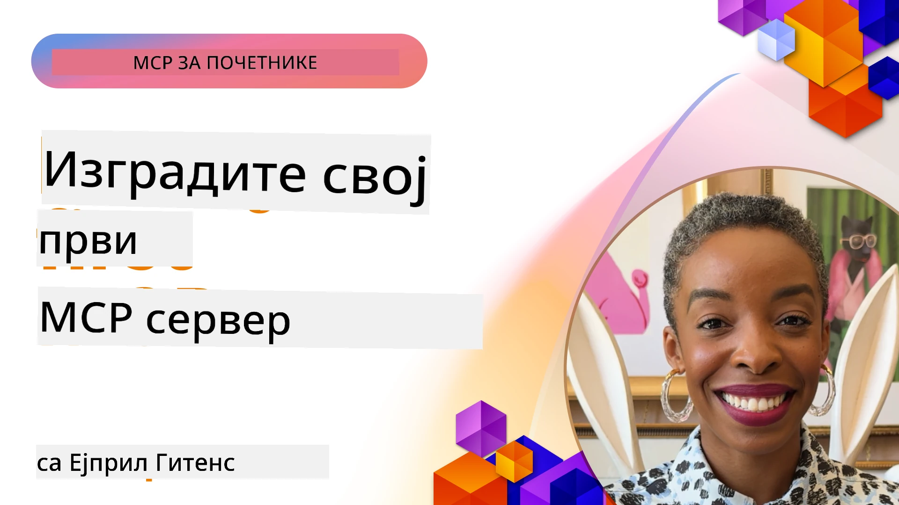

## Почетак  

_(Кликните на слику изнад да бисте погледали видео овог часа)_

Овај одељак се састоји од неколико лекција:

- **1 Ваш први сервер**, у овој првој лекцији научићете како да креирате свој први сервер и како да га испитате помоћу алата инспектора, вредног начина да тестирате и решавате проблеме на свом серверу, [ка лекцији](01-first-server/README.md)

- **2 Клијент**, у овој лекцији научићете како да напишете клијента који може да се повеже са вашим сервером, [ка лекцији](02-client/README.md)

- **3 Клијент са LLM-ом**, још бољи начин писања клијента је додавање LLM-а како би он могао да „преговара“ са вашим сервером шта да ради, [ка лекцији](03-llm-client/README.md)

- **4 Коришћење сервера GitHub Copilot агента у Visual Studio Code-у**. Овде посматрамо како покренути наш MCP сервер из Visual Studio Code-а, [ка лекцији](04-vscode/README.md)

- **5 stdio Пренос сервера** stdio пренос је препоручени стандард за локалну MCP комуникацију између сервера и клијента, обезбеђујући сигурну комуникацију базирану на подпроцесима са унакрсном изолацијом процеса [ка лекцији](05-stdio-server/README.md)

- **6 HTTP стриминг са MCP-ом (Streamable HTTP)**. Научите о модерном HTTP стриминг преносу (препоручени приступ за удаљене MCP сервере према [MCP Спецификацији 2025-11-25](https://spec.modelcontextprotocol.io/specification/2025-11-25/basic/transports/#streamable-http)), обавештењима о напретку и како имплементирати скалабилне, реалтајм MCP сервере и клијенте користећи Streamable HTTP. [ка лекцији](06-http-streaming/README.md)

- **7 Користећи AI Toolkit за VSCode** за коришћење и тестирање ваших MCP клијената и сервера [ка лекцији](07-aitk/README.md)

- **8 Тестирање**. Овде ћемо се посебно фокусирати како можемо тестирати наш сервер и клијента на различите начине, [ка лекцији](08-testing/README.md)

- **9 Деплој**. Овај поглавље ће разматрати различите начине постављања ваших MCP решења, [ка лекцији](09-deployment/README.md)

- **10 Напредна употреба сервера**. Ово поглавље покрива напредну употребу сервера, [ка лекцији](./10-advanced/README.md)

- **11 Аутентификација**. Ово поглавље објашњава како додати једноставну аутентификацију, од Basic Auth до коришћења JWT и RBAC. Препоручује се да започнете овде, а затим погледате Напредне Теме у Поглављу 5 и извршите додатна безбедносна ојачања по препорукама из Поглавља 2, [ка лекцији](./11-simple-auth/README.md)

- **12 MCP хостови**. Конфигуришите и користите популарне MCP хост клијенте укључујући Claude Desktop, Cursor, Cline и Windsurf. Научите типове транспорта и решавање проблема, [ка лекцији](./12-mcp-hosts/README.md)

- **13 MCP инспектор**. Решавајте проблеме и тестирајте ваше MCP сервере интерактивно користећи MCP инспектор алат. Научите о алатима за решавање проблема, ресурсима и протоколским порукама, [ка лекцији](./13-mcp-inspector/README.md)

Протокол контекста модела (MCP) је отворени протокол који стандардизује како апликације пружају контекст LLM-овима. Можете замислити MCP као USB-C порт за AI апликације - пружа стандардизован начин повезивања AI модела са различитим изворима података и алатима.

## Циљеви учења

До краја ове лекције моћи ћете да:

- Подесите развојне средине за MCP у C#, Јава, Питон, TypeScript и ЈаваСкрипт
- Креирате и деплојујете основне MCP сервере са прилагођеним функцијама (ресурси, упити и алати)
- Креирате хост апликације које се повезују са MCP серверима
- Тестирате и решавате проблеме у MCP имплементацијама
- Разумете често препознате проблеме у подешавању и њихова решења
- Повежете ваше MCP имплементације са популарним LLM сервисима

## Постављање MCP окружења

Пре него што почнете рад са MCP, важно је да припремите своју развојну средину и разумете основни ток рада. Овај одсек ће вас водити кроз почетне кораке како бисте обезбедили глатак почетак рада са MCP.

### Претпоставке

Пре него што започнете развој са MCP-ом, обезбедите:

- **Развојно окружење**: За изабрани језик (C#, Јава, Питон, TypeScript или ЈаваСкрипт)
- **IDE/Уређивач**: Visual Studio, Visual Studio Code, IntelliJ, Eclipse, PyCharm или било који модеран уређивач кода
- **Управљање пакетима**: NuGet, Maven/Gradle, pip или npm/yarn
- **API кључеви**: За било које AI сервисе које планирате да користите у вашим хост апликацијама

### Званични SDK-ови

У наредним поглављима видећете решења направљена користећи Python, TypeScript, Јава и .NET. Ево свих званично подржаних SDK-ова.

MCP пружа званичне SDK-ове за више језика (усклађених са [MCP Спецификацијом 2025-11-25](https://spec.modelcontextprotocol.io/specification/2025-11-25/)):
- [C# SDK](https://github.com/modelcontextprotocol/csharp-sdk) - Одржава се у сарадњи са Microsoft-ом
- [Java SDK](https://github.com/modelcontextprotocol/java-sdk) - Одржава се у сарадњи са Spring AI
- [TypeScript SDK](https://github.com/modelcontextprotocol/typescript-sdk) - Званична TypeScript имплементација
- [Python SDK](https://github.com/modelcontextprotocol/python-sdk) - Званична Python имплементација (FastMCP)
- [Kotlin SDK](https://github.com/modelcontextprotocol/kotlin-sdk) - Званична Kotlin имплементација
- [Swift SDK](https://github.com/modelcontextprotocol/swift-sdk) - Одржава се у сарадњи са Loopwork AI
- [Rust SDK](https://github.com/modelcontextprotocol/rust-sdk) - Званична Rust имплементација
- [Go SDK](https://github.com/modelcontextprotocol/go-sdk) - Званична Go имплементација

## Кључне поуке

- Постављање MCP развојне средине је једноставно уз специфичне SDK-ове за језик
- Креирање MCP сервера подразумева креирање и регистрацију алата са јасним шемама
- MCP клијенти се повезују са серверима и моделима како би искористили проширене могућности
- Тестирање и решавање проблема су битни за поуздане MCP имплементације
- Опције за деплој крећу се од локалног развоја до решења заснованих на облаку

## Вежбање

Имамо низ примера који допуњују вежбе које ћете видети у свим поглављима у овом одељку. Поред тога, свако поглавље има и своје вежбе и задатке

- [Јава Калкулатор](./samples/java/calculator/README.md)
- [.Net Калкулатор](../../../03-GettingStarted/samples/csharp)
- [ЈаваСкрипт Калкулатор](./samples/javascript/README.md)
- [TypeScript Калкулатор](./samples/typescript/README.md)
- [Питон Калкулатор](../../../03-GettingStarted/samples/python)

## Додатни ресурси

- [Изградња агената коришћењем Model Context Protocol на Azure](https://learn.microsoft.com/azure/developer/ai/intro-agents-mcp)
- [Удаљени MCP са Azure Container Apps (Node.js/TypeScript/JavaScript)](https://learn.microsoft.com/samples/azure-samples/mcp-container-ts/mcp-container-ts/)
- [.NET OpenAI MCP Agent](https://learn.microsoft.com/samples/azure-samples/openai-mcp-agent-dotnet/openai-mcp-agent-dotnet/)

## Шта следи

Почните са првом лекцијом: [Креирање вашег првог MCP сервера](01-first-server/README.md)

Када завршите овај модул, наставите са: [Модул 4: Практична имплементација](../04-PracticalImplementation/README.md)

---

<!-- CO-OP TRANSLATOR DISCLAIMER START -->
**Одрицање од одговорности**:
Овај документ је преведен коришћењем AI преводилачке услуге [Co-op Translator](https://github.com/Azure/co-op-translator). Иако тежимо прецизности, молимо имајте у виду да аутоматски преводи могу садржати грешке или нетачности. Оригинални документ на његовом изворном језику треба сматрати ауторитетним извором. За критичне информације препоручује се професионалан људски превод. Нисмо одговорни за било каква неспоразума или погрешна тумачења настала коришћењем овог превода.
<!-- CO-OP TRANSLATOR DISCLAIMER END -->