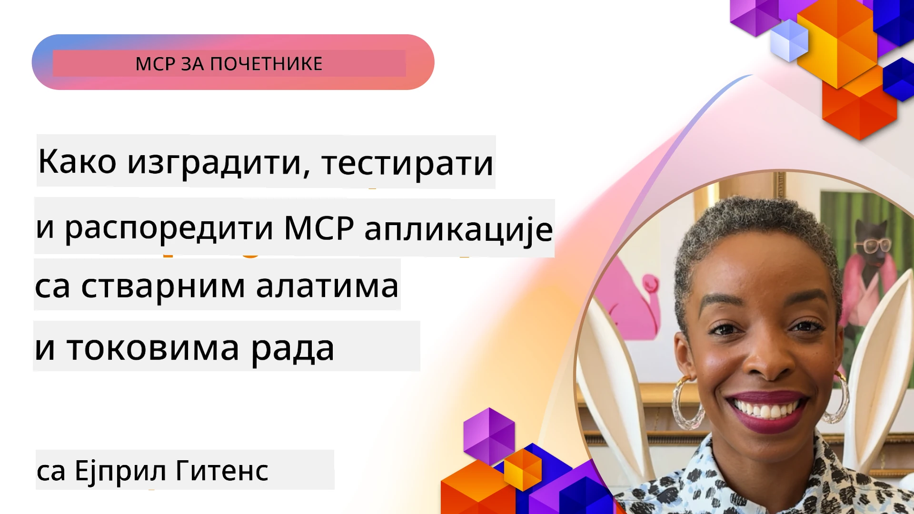
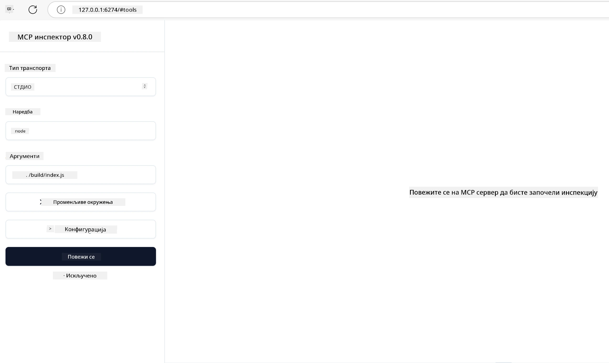

# Практична имплементација

[](https://youtu.be/vCN9-mKBDfQ)

_(Кликните на слику изнад да бисте погледали видео ове лекције)_

Практична имплементација је место где моћ Протокола Модела Контекста (MCP) постаје опипљива. Док је разумевање теорије и архитектуре која стоји иза MCP важно, права вредност се појављује када примените ове концепте да бисте изградили, тестирали и објавили решења која решавају стварне проблеме. Ово поглавље прелази празнину између концептуалног знања и практичног развоја, водећи вас кроз процес оживљавања апликација заснованих на MCP.

Било да развијате интелигентне асистенте, интегришете вештачку интелигенцију у пословне радне токове или правите прилагођене алате за обраду података, MCP пружа флексибилну основу. Његов језички независан дизајн и званични SDK-ови за популарне програмске језике чине га приступачним широком спектру програмера. Коришћењем ових SDK-ова можете брзо да креирате прототипове, правите итерације и скалирате ваша решења на различитим платформама и окружењима.

У следећим одељцима пронаћи ћете практичне примере, узорни код и стратегије објављивања које демонстрирају како се MCP имплементира у C#, Java са Spring, TypeScript, JavaScript и Python. Такође ћете научити како да отклањате грешке и тестирате MCP сервере, управљате API-јима и објављујете решења у облаку користећи Azure. Ови практични ресурси дизајнирани су да убрзају ваше учење и помогну вам да са поверењем изградите поуздане, производно спремне MCP апликације.

## Преглед

Ова лекција се фокусира на практичне аспекте имплементације MCP у више програмских језика. Истражићемо како да користите MCP SDK-ове у C#, Java са Spring, TypeScript, JavaScript и Python за изградњу поузданих апликација, отклањање грешака и тестирање MCP сервера, и креирање поново употребљивих ресурса, шаблона и алата.

## Циљеви учења

На крају ове лекције бићете у стању да:

- Имплементирате MCP решења користећи званичне SDK-ове на различитим програмским језицима
- Систематски отклањате грешке и тестирате MCP сервере
- Креирате и користите функције сервера (Ресурсе, Шаблоне и Алате)
- Дизајнирате ефикасне MCP радне токове за сложене задатке
- Оптимизујете MCP имплементације за перформансе и поузданост

## Званични SDK ресурси

Протокол Модела Контекста нуди званичне SDK-ове за више језика (усклађено са [MCP спецификацијом 2025-11-25](https://spec.modelcontextprotocol.io/specification/2025-11-25/)):

- [C# SDK](https://github.com/modelcontextprotocol/csharp-sdk)
- [Java са Spring SDK](https://github.com/modelcontextprotocol/java-sdk) **Напомена:** захтева зависност од [Project Reactor](https://projectreactor.io). (Погледај [дискусиону тему 246](https://github.com/orgs/modelcontextprotocol/discussions/246).)
- [TypeScript SDK](https://github.com/modelcontextprotocol/typescript-sdk)
- [Python SDK](https://github.com/modelcontextprotocol/python-sdk)
- [Kotlin SDK](https://github.com/modelcontextprotocol/kotlin-sdk)
- [Go SDK](https://github.com/modelcontextprotocol/go-sdk)

## Рад са MCP SDK-овима

Овај одељак пружа практичне примере имплементације MCP у више програмских језика. Узорни код можете пронаћи у директоријуму `samples` организованом по језицима.

### Расположиви узорци

Репозиторијум укључује [примере имплементација](../../../04-PracticalImplementation/samples) на следећим језицима:

- [C#](./samples/csharp/README.md)
- [Java са Spring](./samples/java/containerapp/README.md)
- [TypeScript](./samples/typescript/README.md)
- [JavaScript](./samples/javascript/README.md)
- [Python](./samples/python/README.md)

Сваки узорак демонстрира кључне MCP концепте и обрасце имплементације за тај конкретни језик и екосистем.

### Практични водичи

Додатни водичи за практичну MCP имплементацију:

- [Пагинација и велики скуп резултата](./pagination/README.md) - Обрада пагинације засноване на курсору за алате, ресурсе и велике скупове података

## Кључне функције сервера

MCP сервери могу имплементирати било коју комбинацију ових функција:

### Ресурси

Ресурси обезбеђују контекст и податке за корисника или AI модел да користи:

- Репозиторијуми докумената
- Базе знања
- Структурирани извори података
- Фајл системи

### Шаблони

Шаблони су шаблонизоване поруке и радни токови за кориснике:

- Претходно дефинисани шаблони разговора
- Вођени образци интеракције
- Специјализоване структуре дијалога

### Алатке

Алатке су функције које AI модел извршава:

- Утилити за обраду података
- Интеграције са екстерним API-јима
- Рачунарске могућности
- Функционалност претраге

## Узорне имплементације: Имплементација у C#

Званични репозиторијум C# SDK-а садржи неколико примера имплементација које демонстрирају различите аспекте MCP:

- **Основни MCP клијент**: Једноставан пример који показује како направити MCP клијента и позивати алатке
- **Основни MCP сервер**: Минимална имплементација сервера са основном регистрацијом алата
- **Напредни MCP сервер**: Пуна имплементација сервера са регистрацијом алата, аутентификацијом и руковањем грешкама
- **ASP.NET интеграција**: Примери који показују интеграцију са ASP.NET Core
- **Обрасци имплементације алатки**: Различити обрасци за имплементацију алата са различитим нивоима сложености

MCP C# SDK је у прелиминарном издању и API-ји могу да се мењају. Континуирано ћемо ажурирати овај блог како SDK буде еволуирао.

### Кључне функције

- [C# MCP Nuget ModelContextProtocol](https://www.nuget.org/packages/ModelContextProtocol)
- Прављење вашег [првог MCP сервера](https://devblogs.microsoft.com/dotnet/build-a-model-context-protocol-mcp-server-in-csharp/).

За потпуне примерке имплементације у C# посетите [званични репозиторијум узорака C# SDK-а](https://github.com/modelcontextprotocol/csharp-sdk)

## Узорна имплементација: Имплементација у Java са Spring

Java са Spring SDK нуди робусне опције за имплементацију MCP са функцијама корпоративног нивоа.

### Кључне функције

- Интеграција са Spring Framework
- Јака типска сигурност
- Подршка за реактивно програмирање
- Комплетно руковање грешкама

За потпун узорак имплементације Java са Spring, погледајте [Java са Spring узорак](samples/java/containerapp/README.md) у директоријуму узорака.

## Узорна имплементација: Имплементација у JavaScript

JavaScript SDK пружа лаган и флексибилан приступ имплементацији MCP.

### Кључне функције

- Подршка за Node.js и прегледаче
- API заснован на Promise-овима
- Лака интеграција са Express и другим фрејмворцима
- Подршка за WebSocket за стреаминг

За потпун узорак имплементације JavaScript, погледајте [JavaScript узорак](samples/javascript/README.md) у директоријуму узорака.

## Узорна имплементација: Имплементација у Python

Python SDK нуди Python-на начин имплементације MCP са одличним интеграцијама ML фрејмворка.

### Кључне функције

- Подршка async/await са asyncio
- Интеграција са FastAPI
- Једноставна регистрација алата
- Нативна интеграција са популарним ML библиотекама

За потпун узорак имплементације Python, погледајте [Python узорак](samples/python/README.md) у директоријуму узорака.

## Управљање API-јима

Azure API Management је одличан одговор на питање како можемо обезбедити MCP сервере. Идеја је да се постави Azure API Management инстанца испред вашег MCP сервера и да она управља функцијама које ћете вероватно желети као што су:

- ограничење брзине
- управљање токенима
- надгледање
- балансирање оптерећења
- безбедност

### Azure узорак

Ево Azure узорка који ради управо то, односно [прави MCP сервер и обезбеђује га помоћу Azure API Management](https://github.com/Azure-Samples/remote-mcp-apim-functions-python).

Погледајте како се ауторизациони ток одвија на слици испод:


На претходној слици дешава се следеће:

- Аутентификација/Ауторизација се обавља коришћењем Microsoft Entra.
- Azure API Management делује као пролаз и користи политике за усмеравање и управљање саобраћајем.
- Azure Monitor бележи све захтеве за даљу анализу.

#### Ауторизациони ток

Погледајмо ауторизациони ток детаљније:


#### MCP спецификација ауторизације

Сазнајте више о [MCP спецификацији ауторизације](https://spec.modelcontextprotocol.io/specification/2025-11-25/basic/authorization/)

## Објављивање удаљеног MCP сервера на Azure

Хајде да видимо да ли можемо да објавимо поменути узорак:

1. Клонирајте репозиторијум

    ```bash
    git clone https://github.com/Azure-Samples/remote-mcp-apim-functions-python.git
    cd remote-mcp-apim-functions-python
    ```

1. Региструјте `Microsoft.App` ресурс провајдер.

   - Ако користите Azure CLI, покрените `az provider register --namespace Microsoft.App --wait`.
   - Ако користите Azure PowerShell, покрените `Register-AzResourceProvider -ProviderNamespace Microsoft.App`. Затим након неког времена проверите стање регистрације командом `(Get-AzResourceProvider -ProviderNamespace Microsoft.App).RegistrationState`.

1. Покрените ову [azd](https://aka.ms/azd) команду да бисте обезбедили сервис управљања API-јима, функцијски апликацију (са кодом) и све друге потребне Azure ресурсе

    ```shell
    azd up
    ```

    Ова команда би требало да објави све ресурсе у облаку на Azure

### Тестирање вашег сервера са MCP Inspektor-ом

1. У **новом терминал прозору**, инсталирајте и покрените MCP Inspektor

    ```shell
    npx @modelcontextprotocol/inspector
    ```

    Требало би да видите интерфејс сличан овоме:

    

1. CTRL клик да учитате MCP Inspektor веб апликацију са URL-а који апликација приказује (нпр. [http://127.0.0.1:6274/#resources](http://127.0.0.1:6274/#resources))
1. Подесите тип транспорта на `SSE`
1. Подесите URL на ваш тренутно покренути API Management SSE крај за везу приказан након `azd up` и **Повежите се**:

    ```shell
    https://<apim-servicename-from-azd-output>.azure-api.net/mcp/sse
    ```

1. **Листа алата**. Кликните на алат и **Покрените алат**.

Ако су сви кораци прошли успешно, сада бисте требали бити повезани на MCP сервер и бити у могућности да позовете алат.

## MCP сервери за Azure

[Remote-mcp-functions](https://github.com/Azure-Samples/remote-mcp-functions-dotnet): Овај скуп репозиторијума су брзи шаблони за изградњу и постављање прилагођених удаљених MCP (Model Context Protocol) сервера користећи Azure Functions са Python, C# .NET или Node/TypeScript.

Примери пружају комплетно решење које омогућава програмерима да:

- Граде и покрећу локално: Развлаче и отклањају грешке MCP сервер на локалној машини
- Објављују на Azure: Лако објављују у облак са једноставном azd up командом
- Повезују се са клијентима: Повезују се на MCP сервер из различитих клијената укључујући VS Code-ов Copilot agent mode и MCP Inspektor алат

### Кључне функције

- Безбедност као дизајн: MCP сервер је обезбеђен коришћењем кључева и HTTPS-а
- Опције аутентификације: Подржава OAuth користећи уграђени аутент и/или API Management
- Изолација мреже: Омогућава изолацију мреже користећи Azure Virtual Networks (VNET)
- Архитектура без сервера: Користи Azure Functions за скалабилно, на догађаје засновано извршавање
- Локални развој: Комплетна подршка за локални развој и отклањање грешака
- Једноставно објављивање: Поједностављен процес објављивања на Azure

Репозиторијум укључује све потребне конфигурационе датотеке, изворни код и дефиниције инфраструктуре да брзо започнете са производно спремном MCP сервер имплементацијом.

- [Azure Remote MCP Functions Python](https://github.com/Azure-Samples/remote-mcp-functions-python) - Пример имплементације MCP користећи Azure Functions са Python-ом

- [Azure Remote MCP Functions .NET](https://github.com/Azure-Samples/remote-mcp-functions-dotnet) - Пример имплементације MCP користећи Azure Functions са C# .NET

- [Azure Remote MCP Functions Node/Typescript](https://github.com/Azure-Samples/remote-mcp-functions-typescript) - Пример имплементације MCP користећи Azure Functions са Node/TypeScript.

## Главне поуке

- MCP SDK-ови пружају језички специфичне алате за имплементацију робусних MCP решења
- Процес отклањања грешака и тестирања је кључан за поуздане MCP апликације
- Поново употребљиви шаблони подстицаја омогућавају доследне AI интеракције
- Добро осмишљени радни токови могу да оркестрирају сложене задатке користећи више алата
- Имплементација MCP решења захтева разматрање безбедности, перформанси и руковања грешкама

## Вежба

Дизајнирајте практичан MCP радни ток који решава стварни проблем у вашем домену:

1. Идентификујте 3-4 алатке које би биле корисне за решавање овог проблема
2. Креирајте дијаграм радног тока који показује како се ове алатке међусобно повезују
3. Имплементирајте основну верзију једног од алата користећи ваш омиљени језик
4. Креирајте шаблон подстицаја који ће помоћи моделу да ефикасно користи ваш алат

## Додатни ресурси

---

## Шта следи

Следеће: [Напредне теме](../05-AdvancedTopics/README.md)

---

<!-- CO-OP TRANSLATOR DISCLAIMER START -->
**Одрицање од одговорности**:
Овај документ је преведен помоћу AI преводилачке услуге [Co-op Translator](https://github.com/Azure/co-op-translator). Иако се трудимо да превод буде прецизан, молимо вас да имате у виду да аутоматизовани преводи могу садржати грешке или нетачности. Оригинални документ на његовом изворном језику треба сматрати званичним извором. За критичне информације препоручује се професионалан људски превод. Не преузимамо одговорност за било каква неспоразума или погрешна тумачења која произилазе из коришћења овог превода.
<!-- CO-OP TRANSLATOR DISCLAIMER END -->