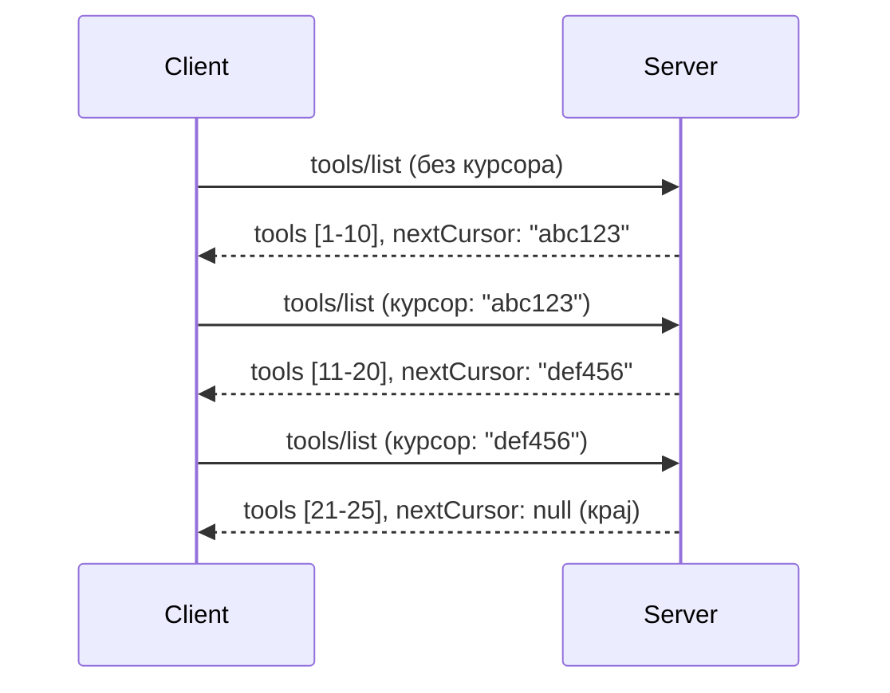

# Пагинација и Велики Сетови Резултата у MCP

Када ваш MCP сервер обрађује велике скупове података - било да листате хиљаде фајлова, базе података или резултате претраге - потребна вам је пагинација да бисте ефикасно управљали меморијом и пружили кориснички одзиван интерфејс. Овај водич покрива како имплементирати и користити пагинацију у MCP.

## Зашто је Пагинација Важна

Без пагинације, велики одговори могу изазвати:

- **Истекање меморије** - Учитавање милиона записа одједном
- **Спори одговори** - Корисници чекају док се сви подаци учитају
- **Грешке због истека времена** - Захтеви прекорачују временска ограничења
- **Лоша AI перформанса** - LLM-и имају потешкоћа са огромним контекстом

MCP користи **пагинацију засновану на курсору** за поуздано и конзистентно странирање кроз скуп резултата.

---

## Како MCP Пагинација Ради

### Концепт Курсора

**Курсор** је непрозирни низ карактера који означава вашу позицију у скупу резултата. Замислите га као обележивач у дугој књизи.


### Пагинација у MCP Методама

Ове MCP методе подржавају пагинацију:

| Метод | Враћа | Подршка за Курсор |
|--------|---------|----------------|
| `tools/list` | Дефиниције алата | ✅ |
| `resources/list` | Дефиниције ресурса | ✅ |
| `prompts/list` | Дефиниције упита | ✅ |
| `resources/templates/list` | Шаблони ресурса | ✅ |

---

## Имплементација на Серверу

### Python (FastMCP)

```python
from mcp.server import Server
from mcp.types import Tool, ListToolsResult
import math

app = Server("paginated-server")

# Симулирани велики скуп података
ALL_TOOLS = [
    Tool(name=f"tool_{i}", description=f"Tool number {i}", inputSchema={})
    for i in range(100)
]

PAGE_SIZE = 10

@app.list_tools()
async def list_tools(cursor: str | None = None) -> ListToolsResult:
    """List tools with pagination support."""
    
    # Декодирај курсор да би добио почетни индекс
    start_index = 0
    if cursor:
        try:
            start_index = int(cursor)
        except ValueError:
            start_index = 0
    
    # Узми страницу резултата
    end_index = min(start_index + PAGE_SIZE, len(ALL_TOOLS))
    page_tools = ALL_TOOLS[start_index:end_index]
    
    # Израчунај следећи курсор
    next_cursor = None
    if end_index < len(ALL_TOOLS):
        next_cursor = str(end_index)
    
    return ListToolsResult(
        tools=page_tools,
        nextCursor=next_cursor
    )
```

### TypeScript

```typescript
import { Server } from "@modelcontextprotocol/sdk/server/index.js";
import { ListToolsResultSchema } from "@modelcontextprotocol/sdk/types.js";

const server = new Server({
  name: "paginated-server",
  version: "1.0.0"
});

// Симулирани велики скуп података
const ALL_TOOLS = Array.from({ length: 100 }, (_, i) => ({
  name: `tool_${i}`,
  description: `Tool number ${i}`,
  inputSchema: { type: "object", properties: {} }
}));

const PAGE_SIZE = 10;

server.setRequestHandler(ListToolsResultSchema, async (request) => {
  // Декодирај курсор
  let startIndex = 0;
  if (request.params?.cursor) {
    startIndex = parseInt(request.params.cursor, 10) || 0;
  }
  
  // Узми страницу резултата
  const endIndex = Math.min(startIndex + PAGE_SIZE, ALL_TOOLS.length);
  const pageTools = ALL_TOOLS.slice(startIndex, endIndex);
  
  // Израчунај следећи курсор
  const nextCursor = endIndex < ALL_TOOLS.length ? String(endIndex) : undefined;
  
  return {
    tools: pageTools,
    nextCursor
  };
});
```

### Java (Spring MCP)

```java
@Service
public class PaginatedToolService {
    
    private static final int PAGE_SIZE = 10;
    private final List<Tool> allTools;
    
    public PaginatedToolService() {
        // Иницијализуј велики скуп података
        this.allTools = IntStream.range(0, 100)
            .mapToObj(i -> new Tool("tool_" + i, "Tool number " + i, Map.of()))
            .collect(Collectors.toList());
    }
    
    @McpMethod("tools/list")
    public ListToolsResult listTools(@Param("cursor") String cursor) {
        // Декодирај курсор
        int startIndex = 0;
        if (cursor != null && !cursor.isEmpty()) {
            try {
                startIndex = Integer.parseInt(cursor);
            } catch (NumberFormatException e) {
                startIndex = 0;
            }
        }
        
        // Узми страницу резултата
        int endIndex = Math.min(startIndex + PAGE_SIZE, allTools.size());
        List<Tool> pageTools = allTools.subList(startIndex, endIndex);
        
        // Израчунај следећи курсор
        String nextCursor = endIndex < allTools.size() ? String.valueOf(endIndex) : null;
        
        return new ListToolsResult(pageTools, nextCursor);
    }
}
```

---

## Клијент Имплементација

### Python Клијент

```python
from mcp import ClientSession

async def get_all_tools(session: ClientSession) -> list:
    """Fetch all tools using pagination."""
    all_tools = []
    cursor = None
    
    while True:
        result = await session.list_tools(cursor=cursor)
        all_tools.extend(result.tools)
        
        if result.nextCursor is None:
            break
        cursor = result.nextCursor
    
    return all_tools

# Употреба
async with client_session as session:
    tools = await get_all_tools(session)
    print(f"Found {len(tools)} tools")
```

### TypeScript Клијент

```typescript
import { Client } from "@modelcontextprotocol/sdk/client/index.js";

async function getAllTools(client: Client): Promise<Tool[]> {
  const allTools: Tool[] = [];
  let cursor: string | undefined = undefined;
  
  do {
    const result = await client.listTools({ cursor });
    allTools.push(...result.tools);
    cursor = result.nextCursor;
  } while (cursor);
  
  return allTools;
}

// Употреба
const tools = await getAllTools(client);
console.log(`Found ${tools.length} tools`);
```

### Образац Лењог Учитавања

За веома велике скупове података, учитавајте странице по потреби:

```python
class PaginatedToolIterator:
    """Lazily iterate through paginated tools."""
    
    def __init__(self, session: ClientSession):
        self.session = session
        self.cursor = None
        self.buffer = []
        self.exhausted = False
    
    async def __anext__(self):
        # Врати из бафера ако је доступно
        if self.buffer:
            return self.buffer.pop(0)
        
        # Провери да ли смо прошли све странице
        if self.exhausted:
            raise StopAsyncIteration
        
        # Учитај следећу страницу
        result = await self.session.list_tools(cursor=self.cursor)
        self.buffer = list(result.tools)
        self.cursor = result.nextCursor
        
        if self.cursor is None:
            self.exhausted = True
        
        if not self.buffer:
            raise StopAsyncIteration
        
        return self.buffer.pop(0)
    
    def __aiter__(self):
        return self

# Употреба - ефикасно коришћење меморије за велике скупове података
async for tool in PaginatedToolIterator(session):
    process_tool(tool)
```

---

## Пагинација за Ресурсе

Често је потребна пагинација за фасцикле или велике скупове података:

```python
from mcp.server import Server
from mcp.types import Resource, ListResourcesResult
import os

app = Server("file-server")

@app.list_resources()
async def list_resources(cursor: str | None = None) -> ListResourcesResult:
    """List files in directory with pagination."""
    
    directory = "/data/files"
    all_files = sorted(os.listdir(directory))
    
    # Декодирај курсор (индекс фајла)
    start_index = int(cursor) if cursor else 0
    page_size = 20
    end_index = min(start_index + page_size, len(all_files))
    
    # Креирај листу ресурса за ову страницу
    resources = []
    for filename in all_files[start_index:end_index]:
        filepath = os.path.join(directory, filename)
        resources.append(Resource(
            uri=f"file://{filepath}",
            name=filename,
            mimeType="application/octet-stream"
        ))
    
    # Израчунај следећи курсор
    next_cursor = str(end_index) if end_index < len(all_files) else None
    
    return ListResourcesResult(
        resources=resources,
        nextCursor=next_cursor
    )
```

---

## Стратегије Дизајна Курсора

### Стратегија 1: Индексна (Једноставна)

```python
# Курсор је само индекс
cursor = "50"  # Почни од ставке 50
```

**Предности:** Једноставна, бездржавна  
**Недостаци:** Резултати се могу померити ако се додају/уклоне ставки

### Стратегија 2: Заснована на ИД-у (Стабилна)

```python
# Курсор је последњи виђени ИД
cursor = "item_abc123"  # Почни након овог предмета
```

**Предности:** Стабилна чак и ако се ставки мењају  
**Недостаци:** Захтева наручене ИД-ове

### Стратегија 3: Кодирано Стање (Комплексна)

```python
import base64
import json

def encode_cursor(state: dict) -> str:
    return base64.b64encode(json.dumps(state).encode()).decode()

def decode_cursor(cursor: str) -> dict:
    return json.loads(base64.b64decode(cursor).decode())

# Курсор садржи више поља стања
cursor = encode_cursor({
    "offset": 50,
    "filter": "active",
    "sort": "name"
})
```

**Предности:** Може кодирати комплексно стање  
**Недостаци:** Сложенија, већи низови курсора

---

## Најбоље Практике

### 1. Изаберите Одговарајућу Величину Стране

```python
# Размотрите величину података
PAGE_SIZE_SMALL_ITEMS = 100   # Једноставан метаподатак
PAGE_SIZE_MEDIUM_ITEMS = 20   # Богатији објекти
PAGE_SIZE_LARGE_ITEMS = 5     # Комплексни садржај
```

### 2. Руковати Неважећим Курсорима Поуздано

```python
@app.list_tools()
async def list_tools(cursor: str | None = None) -> ListToolsResult:
    try:
        start_index = int(cursor) if cursor else 0
        if start_index < 0 or start_index >= len(ALL_TOOLS):
            start_index = 0  # Ресетуј на почетак
    except (ValueError, TypeError):
        start_index = 0  # Неважећи курсор, почни изнова
    # ...
```

### 3. Укључите Укупни Број (Опционо)

```python
return ListToolsResult(
    tools=page_tools,
    nextCursor=next_cursor,
    # Неки имплементације укључују укупно за UI прогрес
    _meta={"total": len(ALL_TOOLS)}
)
```

### 4. Тестирајте Крајње Случајеве

```python
async def test_pagination():
    # Празан скуп резултата
    result = await session.list_tools()
    assert result.tools == []
    assert result.nextCursor is None
    
    # Једна страница
    result = await session.list_tools()
    assert len(result.tools) <= PAGE_SIZE
    
    # Неважећи курсор
    result = await session.list_tools(cursor="invalid")
    assert result.tools  # Тревало би да врати прву страницу
```

---

## Чести Проблеми

### ❌ Враћање Свијх Резултата, Затим Пагинација на Клијенту

```python
# ЛОШЕ: Учитава све у меморију
@app.list_tools()
async def list_tools() -> ListToolsResult:
    all_tools = load_all_tools()  # 1 милион алата!
    return ListToolsResult(tools=all_tools)
```

### ✅ Пагинација на Извору Података

```python
# ДОБРО: Учитава само оно што је потребно
@app.list_tools()
async def list_tools(cursor: str | None = None) -> ListToolsResult:
    offset = int(cursor) if cursor else 0
    tools = await db.query_tools(offset=offset, limit=PAGE_SIZE)
    return ListToolsResult(tools=tools, nextCursor=...)
```

---

## Шта Следи

- [Модул 5.14 - Инжењеринг Контекста](../../05-AdvancedTopics/mcp-contextengineering/README.md)
- [Модул 8 - Најбоље Практике](../../08-BestPractices/README.md)
- [3.8 - Тестирање Вашег MCP Серверa](../../03-GettingStarted/08-testing/README.md)

---

## Додатни Ресурси

- [MCP Спецификација - Пагинација](https://spec.modelcontextprotocol.io/specification/2025-11-25/)
- [Објашњење Пагинације Засноване на Курсору](https://slack.engineering/evolving-api-pagination-at-slack/)
- [Python SDK тестови пагинације](https://github.com/modelcontextprotocol/python-sdk/blob/main/tests/client/test_list_methods_cursor.py)

---

<!-- CO-OP TRANSLATOR DISCLAIMER START -->
**Одрицање од одговорности**:
Овај документ је преведен помоћу АИ преводилачке услуге [Co-op Translator](https://github.com/Azure/co-op-translator). Иако се трудимо да превод буде тачан, молимо имајте у виду да аутоматски преводи могу садржати грешке или нетачности. Оригинални документ на његовом матичном језику треба сматрати званичним извором. За критичне информације, препоручује се професионални превод од стране човека. Нисмо одговорни за било каква неспоразума или погрешне тумачења настала коришћењем овог превода.
<!-- CO-OP TRANSLATOR DISCLAIMER END -->