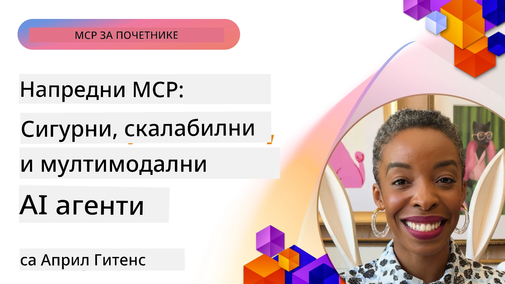

# Напредне теме у MCP

_(Кликните на слику изнад да бисте погледали видео о овој лекцији)_

Ова глава покрива низ напредних тема у имплементацији Протокола контекста модела (MCP), укључујући мултимодалну интеграцију, скалабилност, најбоље безбедносне праксе и интеграцију у предузећима. Ове теме су кључне за изградњу робусних и производњи спремних MCP апликација које могу да испуне захтеве савремених AI система.

## Преглед

Ова лекција истражује напредне концепте у имплементацији Протокола контекста модела са фокусом на мултимодалну интеграцију, скалабилност, најбоље безбедносне праксе и интеграцију у предузећима. Ове теме су неопходне за изградњу MCP апликација производног нивоа које могу да обраде сложене захтеве у пословним окружењима.

## Циљеви учења

До краја ове лекције моћи ћете да:

- Имплементирате мултимодалне капацитете у оквиру MCP оквира
- Дизајнирате скалабилне MCP архитектуре за сценарије са великим захтевима
- Примените најбоље безбедносне праксе у складу са безбедносним принципима MCP-а
- Интегришете MCP са пословним AI системима и оквирима
- Оптимизујете перформансе и поузданост у производним окружењима

## Лекције и узорци пројеката

| Линк | Наслов | Опис |
|------|--------|-------|
| [5.1 Интеграција са Azure](./mcp-integration/README.md) | Интеграција са Azure | Научите како да интегришете свој MCP сервер на Azure |
| [5.2 Узорак мултимодалности](./mcp-multi-modality/README.md) | MCP мултимодални узорци | Узорци за аудио, слику и мултимодалне одговоре |
| [5.3 MCP OAuth2 узорак](../../../05-AdvancedTopics/mcp-oauth2-demo) | MCP OAuth2 демо | Минимална Spring Boot апликација која показује OAuth2 са MCP, као овлашћивач и сервер ресурса. Демонстрира безбедно издавање токена, заштићене крајње тачке, Azure Container Apps имплементацију и интеграцију API Management-а. |
| [5.4 Коренски контексти](./mcp-root-contexts/README.md) | Коренски контексти | Сазнајте више о коренском контексту и како га имплементирати |
| [5.5 Роутинг](./mcp-routing/README.md) | Роутинг | Научите различите типове рутације |
| [5.6 Узорковање](./mcp-sampling/README.md) | Узорковање | Научите како да радите са узорковањем |
| [5.7 Скалабилност](./mcp-scaling/README.md) | Скалабилност | Научите о скалабилности |
| [5.8 Безбедност](./mcp-security/README.md) | Безбедност | Осигурајте свој MCP сервер |
| [5.9 MCP претрага на вебу](./web-search-mcp/README.md) | Претрага веба MCP | Python MCP сервер и клијент интегрисани са SerpAPI за претрагу веба, вести, производа и питања/одговора у реалном времену. Демонстрира мулти-алатску оркестрацију, интеграцију спољних API-ја и робусно руковање грешкама. |
| [5.10 Стреаминг у реалном времену](./mcp-realtimestreaming/README.md) | Стреаминг | Стреаминг података у реалном времену постаје неопходан у данашњем свету вођеном подацима, где предузећа и апликације захтевају непосредан приступ информацијама за правовремене одлуке. |
| [5.11 Реал-тиме веб претрага](./mcp-realtimesearch/README.md) | Претрага веба | Како MCP трансформише претрагу веба у реалном времену обезбеђујући стандаризован приступ управљању контекстом преко AI модела, претраживача и апликација. | 
| [5.12 Entra ID аутентификација за MCP сервере](./mcp-security-entra/README.md) | Entra ID аутентификација | Microsoft Entra ID пружа робусно решение за управљање идентитетом и приступом у облаку, помажући да само овлашћени корисници и апликације могу комуницирати са вашим MCP сервером. |
| [5.13 Интеграција Azure AI Foundry агента](./mcp-foundry-agent-integration/README.md) | Интеграција Azure AI Foundry | Научите како да интегришете MCP сервере са Azure AI Foundry агентима, омогућавајући моћну оркестрацију алата и капацитете предузећног AI-а са стандардизованим спољним изворима података. |
| [5.14 Инжењеринг контекста](./mcp-contextengineering/README.md) | Инжењеринг контекста | Будуће могућности техника инжењеринга контекста за MCP сервере, укључујући оптимизацију контекста, динамичко управљање контекстом и стратегије за ефикасно креирање упита у оквиру MCP оквира. |
| [5.15 Прилагођени транспорт](./mcp-transport/README.md) | Прилагођени транспорт | Научите како да имплементирате прилагођене транспортне механизме за специјализоване сценарије комуникације MCP-а. |
| [5.16 Детаљна анализа функција протокола](./mcp-protocol-features/README.md) | Функције протокола | Савладајте напредне функције протокола укључујући обавештења о напретку, отказивање захтева, шаблоне ресурса и обрасце руковања грешкама. |

> **Ново у MCP спецификацији 2025-11-25**: Спецификација сада укључује експерименталну подршку за **Задатке** (дугорочне операције са праћењем напретка), **Анотације алата** (метаподаци о понашању алата ради безбедности), **Елицирање режима URL-а** (захтев за одређени садржај URL-а од клијената), и побољшане **Корене** (за управљање контекстом радног простора). Погледајте [MCP спецификацијски преглед промена](https://spec.modelcontextprotocol.io/) за детаље.

## Додатне референце

За најновије информације о напредним темама MCP-а, погледајте:
- [MCP документација](https://modelcontextprotocol.io/)
- [MCP спецификација (2025-11-25)](https://spec.modelcontextprotocol.io/specification/2025-11-25/)
- [GitHub репозиторијум](https://github.com/modelcontextprotocol)
- [OWASP MCP Топ 10](https://microsoft.github.io/mcp-azure-security-guide/mcp/) - Безбедносни ризици и ублажавања
- [MCP Security Summit радионица (Sherpa)](https://azure-samples.github.io/sherpa/) - Практична безбедносна обука

## Кључне поуке

- Мултимодалне MCP имплементације проширују AI капацитете изван обраде текста
- Скалабилност је од суштинског значаја за предузећа и може се остварити хоризонталним и вертикалним скалирањем
- Комплексне безбедносне мере штите податке и обезбеђују правилну контролу приступа
- Интеграција предузећа са платформама као што су Azure OpenAI и Microsoft AI Foundry побољшава MCP капацитете
- Напредне MCP имплементације имају користи од оптимизованих архитектура и пажљивог управљања ресурсима

## Задатак

Осмислите MCP имплементацију нивоа предузећа за конкретан случај употребе:

1. Идентификујте мултимодалне захтеве за ваш случај употребе
2. Оквирите безбедносне контроле потребне за заштиту осетљивих података
3. Дизајнирајте скалабилну архитектуру која може да поднесе варијабилно оптерећење
4. Планирајте интеграционе тачке са предузетничким AI системима
5. Документујте потенцијалне уска грла у перформансама и стратегије ублажавања

## Додатни ресурси

- [Azure OpenAI документација](https://learn.microsoft.com/en-us/azure/ai-services/openai/)
- [Microsoft AI Foundry документација](https://learn.microsoft.com/en-us/ai-services/)

---

## Шта следи

Истражите лекције у овом модулу почевши са: [5.1 MCP интеграција](./mcp-integration/README.md)

Када завршите овај модул, наставите на: [Модул 6: Заједнички доприноси](../06-CommunityContributions/README.md)

---

<!-- CO-OP TRANSLATOR DISCLAIMER START -->
**Одрицање од одговорности**:  
Овај документ је преведен помоћу AI сервиса за превођење [Co-op Translator](https://github.com/Azure/co-op-translator). Иако настојимо да превод буде прецизан, молимо вас да имате у виду да аутоматски преводи могу садржати грешке или нетачности. Оригинални документ на изворном језику треба сматрати ауторитетним извором. За критичне информације препоручује се професионални људски превод. Нисмо одговорни за било какве неспоразуме или погрешна тумачења која произилазе из коришћења овог превода.
<!-- CO-OP TRANSLATOR DISCLAIMER END -->