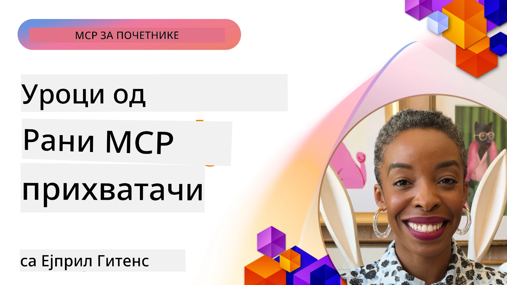

# 🌟 Искуства раних усвајача

[](https://youtu.be/jds7dSmNptE)

_(Кликните на слику изнад да бисте погледали видео о овој лекцији)_

## 🎯 О чему говори овај модул

Овај модул истражује како праве организације и програмери користе Протокол контекста модела (MCP) да реше стварне изазове и покрећу иновације. Кроз детаљне студије случаја, практичне пројекте и примере, открићете како MCP омогућава безбедну, скалабилну интеграцију вештачке интелигенције која повезује језичке моделе, алате и предузетничке податке.

### 📚 Погледајте MCP у акцији

Желите да видите како се ови принципи примењују на алате спремне за продукцију? Погледајте наш [**10 Microsoft MCP сервера који трансформишу продуктивност програмера**](microsoft-mcp-servers.md), који приказује праве Microsoft MCP сервере које можете користити данас.

## Преглед

Ова лекција истражује како су рани усвајачи искористили Протокол контекста модела (MCP) да реше изазове из стварног света и покрену иновације у различитим индустријама. Кроз детаљне студије случаја и практичне пројекте, видећете како MCP омогућава стандардизовану, безбедну и скалабилну интеграцију вештачке интелигенције — повезујући велике језичке моделе, алате и предузетничке податке у јединственом оквиру. Стекнућете практично искуство у дизајнирању и изградњи решења заснованих на MCP-у, научити из проверених образаца имплементације и открити најбоље праксе за примењивање MCP-а у продукцијским окружењима. Лекција такође истиче нове трендове, будуће правце и ресурсе отвореног кода који ће вам помоћи да останете на самом врху технологије MCP и њеног развијајућег екосистема.

## Циљеви учења

- Анализирати реалне имплементације MCP-а у различитим индустријама
- Дизајнирати и изградити комплетне апликације засноване на MCP-у
- Истражити нове трендове и будуће правце MCP технологије
- Примењивати најбоље праксе у стварним развојним сценаријима

## Реалне имплементације MCP-а

### Студија случаја 1: Аутоматизација корисничке подршке у предузећима

Мултинационална корпорација је имплементирала решење засновано на MCP-у како би стандардизовала AI интеракције у својим системима корисничке подршке. Ово им је омогућило:

- Креирање јединственог интерфејса за више провајдера LLM
- Одржавање конзистентног управљања упутствима у различитим одељењима
- Имплементацију робусних безбедносних и усаглашенских контрола
- Лаку промену између различитих AI модела на основу специфичних потреба

**Техничка имплементација:**

```python
# Имплементација Python MCP сервера за корисничку подршку
import logging
import asyncio
from modelcontextprotocol import create_server, ServerConfig
from modelcontextprotocol.server import MCPServer
from modelcontextprotocol.transports import create_http_transport
from modelcontextprotocol.resources import ResourceDefinition
from modelcontextprotocol.prompts import PromptDefinition
from modelcontextprotocol.tool import ToolDefinition

# Конфигуриши логовање
logging.basicConfig(level=logging.INFO)

async def main():
    # Креирај конфигурацију сервера
    config = ServerConfig(
        name="Enterprise Customer Support Server",
        version="1.0.0",
        description="MCP server for handling customer support inquiries"
    )
    
    # Иницијализуј MCP сервер
    server = create_server(config)
    
    # Региструј ресурсе базе знања
    server.resources.register(
        ResourceDefinition(
            name="customer_kb",
            description="Customer knowledge base documentation"
        ),
        lambda params: get_customer_documentation(params)
    )
    
    # Региструј шаблоне упита
    server.prompts.register(
        PromptDefinition(
            name="support_template",
            description="Templates for customer support responses"
        ),
        lambda params: get_support_templates(params)
    )
    
    # Региструј алате за подршку
    server.tools.register(
        ToolDefinition(
            name="ticketing",
            description="Create and update support tickets"
        ),
        handle_ticketing_operations
    )
    
    # Покрени сервер са HTTP преносом
    transport = create_http_transport(port=8080)
    await server.run(transport)

if __name__ == "__main__":
    asyncio.run(main())
```
  
**Резултати:** Смањење трошкова модела за 30%, побољшање доследности одговора за 45% и ојачано усаглашавање у глобалним операцијама.

### Студија случаја 2: Дијагностички асистент у здравству

Здравствена установа је развила MCP инфраструктуру за интеграцију више специјализованих медицинских AI модела уз обезбеђење заштите осетљивих података пацијената:

- Беспрекорно пребацивање између генералних и специјалистичких медицинских модела
- Строге контроле приватности и евидентирање
- Интеграција са постојећим системима електронских здравствених евиденција (EHR)
- Конзистентно инжењерство упита за медицинску терминологију

**Техничка имплементација:**

```csharp
// C# MCP host application implementation in healthcare application
using Microsoft.Extensions.DependencyInjection;
using ModelContextProtocol.SDK.Client;
using ModelContextProtocol.SDK.Security;
using ModelContextProtocol.SDK.Resources;

public class DiagnosticAssistant
{
    private readonly MCPHostClient _mcpClient;
    private readonly PatientContext _patientContext;
    
    public DiagnosticAssistant(PatientContext patientContext)
    {
        _patientContext = patientContext;
        
        // Configure MCP client with healthcare-specific settings
        var clientOptions = new ClientOptions
        {
            Name = "Healthcare Diagnostic Assistant",
            Version = "1.0.0",
            Security = new SecurityOptions
            {
                Encryption = EncryptionLevel.Medical,
                AuditEnabled = true
            }
        };
        
        _mcpClient = new MCPHostClientBuilder()
            .WithOptions(clientOptions)
            .WithTransport(new HttpTransport("https://healthcare-mcp.example.org"))
            .WithAuthentication(new HIPAACompliantAuthProvider())
            .Build();
    }
    
    public async Task<DiagnosticSuggestion> GetDiagnosticAssistance(
        string symptoms, string patientHistory)
    {
        // Create request with appropriate resources and tool access
        var resourceRequest = new ResourceRequest
        {
            Name = "patient_records",
            Parameters = new Dictionary<string, object>
            {
                ["patientId"] = _patientContext.PatientId,
                ["requestingProvider"] = _patientContext.ProviderId
            }
        };
        
        // Request diagnostic assistance using appropriate prompt
        var response = await _mcpClient.SendPromptRequestAsync(
            promptName: "diagnostic_assistance",
            parameters: new Dictionary<string, object>
            {
                ["symptoms"] = symptoms,
                patientHistory = patientHistory,
                relevantGuidelines = _patientContext.GetRelevantGuidelines()
            });
            
        return DiagnosticSuggestion.FromMCPResponse(response);
    }
}
```
  
**Резултати:** Побољшани дијагностички предлози за лекаре уз пуно поштовање HIPAA стандарда и значајно смањење пребацивања контекста између система.

### Студија случаја 3: Анализа ризика у финансијским услугама

Финансијска институција је имплементирала MCP да стандардизује процесе анализе ризика у различитим одељењима:

- Креиран јединствени интерфејс за кредитни ризик, откривање преваре и моделе инвестиционог ризика
- Имплементиране строге контроле приступа и верзионисање модела
- Обезбеђена ревизија свих AI препорука
- Одржавано доследно форматирање података у различитим системима

**Техничка имплементација:**

```java
// Java MCP сервер за процену финансијских ризика
import org.mcp.server.*;
import org.mcp.security.*;

public class FinancialRiskMCPServer {
    public static void main(String[] args) {
        // Креирај MCP сервер са функцијама финансијске усаглашености
        MCPServer server = new MCPServerBuilder()
            .withModelProviders(
                new ModelProvider("risk-assessment-primary", new AzureOpenAIProvider()),
                new ModelProvider("risk-assessment-audit", new LocalLlamaProvider())
            )
            .withPromptTemplateDirectory("./compliance/templates")
            .withAccessControls(new SOCCompliantAccessControl())
            .withDataEncryption(EncryptionStandard.FINANCIAL_GRADE)
            .withVersionControl(true)
            .withAuditLogging(new DatabaseAuditLogger())
            .build();
            
        server.addRequestValidator(new FinancialDataValidator());
        server.addResponseFilter(new PII_RedactionFilter());
        
        server.start(9000);
        
        System.out.println("Financial Risk MCP Server running on port 9000");
    }
}
```
  
**Резултати:** Побољшана регулаторна усаглашеност, 40% бржи циклуси постављања модела и побољшана доследност процене ризика у одељењима.

### Студија случаја 4: Microsoft Playwright MCP сервер за аутоматизацију прегледача

Microsoft је развио [Playwright MCP сервер](https://github.com/microsoft/playwright-mcp) који омогућава безбедну, стандардизовану аутоматизацију прегледача преко Протокола контекста модела. Овај сервер спреман за продукцију омогућава AI агентима и LLM-овима да у контролисаном, аутентичном и проширивом окружењу интерагују са веб прегледачима — омогућавајући сценарије као што су аутоматизовано тестирање веба, екстракција података и комплетни токови рада.

> **🎯 Алатка спремна за продукцију**
> 
> Ова студија случаја приказује прави MCP сервер који можете користити одмах! Сазнајте више о Playwright MCP серверу и још 9 других MCP сервера компаније Microsoft у нашем [**Водичу кроз Microsoft MCP сервере**](microsoft-mcp-servers.md#8--playwright-mcp-server).

**Кључне карактеристике:**
- Излагање могућности аутоматизације прегледача (навигација, попуњавање формулара, снимање екрана и др.) као MCP алата
- Имплементација строгих контрола приступа и изолације ради спречавања неовлашћених радњи
- Пружање детаљних логова за све интеракције са прегледачем
- Подржава интеграцију са Azure OpenAI и другим LLM провајдерима за аутоматизацију базирану на агентима
- Покреће GitHub Copilot Coding Агент са могућностима прегледа на вебу

**Техничка имплементација:**

```typescript
// TypeScript: Регистрација алата за аутоматизацију прегледача Playwright у MCP серверу
import { createServer, ToolDefinition } from 'modelcontextprotocol';
import { launch } from 'playwright';

const server = createServer({
  name: 'Playwright MCP Server',
  version: '1.0.0',
  description: 'MCP server for browser automation using Playwright'
});

// Региструјте алат за навигацију до URL-а и прављење снимка екрана
server.tools.register(
  new ToolDefinition({
    name: 'navigate_and_screenshot',
    description: 'Navigate to a URL and capture a screenshot',
    parameters: {
      url: { type: 'string', description: 'The URL to visit' }
    }
  }),
  async ({ url }) => {
    const browser = await launch();
    const page = await browser.newPage();
    await page.goto(url);
    const screenshot = await page.screenshot();
    await browser.close();
    return { screenshot };
  }
);

// Покрените MCP сервер
server.listen(8080);
```
  
**Резултати:**

- Омогућена безбедна, програмска аутоматизација прегледача за AI агенте и LLM-ове
- Смањен ручни напор при тестирању и побољшан обухват тестова веб апликација
- Пружен репродуцирабилан и проширив оквир за интеграцију алата заснованих на прегледачу у предузећима
- Покреће функције GitHub Copilot-а за претраживање веба

**Референце:**

- [Playwright MCP Server GitHub Репозиторијум](https://github.com/microsoft/playwright-mcp)
- [Microsoft AI и решења за аутоматизацију](https://azure.microsoft.com/en-us/products/ai-services/)

### Студија случаја 5: Azure MCP – Предузетнички MCP као услуга

Azure MCP Сервер ([https://aka.ms/azmcp](https://aka.ms/azmcp)) је управљана предузетничка имплементација Протокола контекста модела компаније Microsoft, дизајнирана да пружи скалабилне, безбедне и усаглашене могућности MCP сервера као облачну услугу. Azure MCP омогућава организацијама брзо постављање, управљање и интеграцију MCP сервера са Azure AI, подацима и безбедносним услугама, смањујући оперативна оптерећења и убрзавајући усвајање AI технологија.

> **🎯 Алатка спремна за продукцију**
> 
> Ово је прави MCP сервер који можете користити одмах! Сазнајте више о Azure AI Foundry MCP серверу у нашем [**Водичу кроз Microsoft MCP сервере**](microsoft-mcp-servers.md).

- Потпуно управљани хостинг MCP сервера са уграђеним скалирањем, мониторингом и безбедношћу
- Нативна интеграција са Azure OpenAI, Azure AI Search и другим Azure услугама
- Предузетничка аутентификација и ауторизација преко Microsoft Entra ID-a
- Подршка за прилагођене алате, шаблоне упита и конекторе ресурса
- Усаглашеност са предузетничким безбедносним и регулаторним захтевима

**Техничка имплементација:**

```yaml
# Example: Azure MCP server deployment configuration (YAML)
apiVersion: mcp.microsoft.com/v1
kind: McpServer
metadata:
  name: enterprise-mcp-server
spec:
  modelProviders:
    - name: azure-openai
      type: AzureOpenAI
      endpoint: https://<your-openai-resource>.openai.azure.com/
      apiKeySecret: <your-azure-keyvault-secret>
  tools:
    - name: document_search
      type: AzureAISearch
      endpoint: https://<your-search-resource>.search.windows.net/
      apiKeySecret: <your-azure-keyvault-secret>
  authentication:
    type: EntraID
    tenantId: <your-tenant-id>
  monitoring:
    enabled: true
    logAnalyticsWorkspace: <your-log-analytics-id>
```
  
**Резултати:**  
- Скратио време до вредности за предузетничке AI пројекте пружајући спремну MCP сервер платформу у складу са захтевима  
- Једноставнија интеграција LLM-ова, алата и предузетничких извора података  
- Побољшана безбедност, уочљивост и оперативна ефикасност за радне оптерећења MCP-а  
- Побољшани квалитет кода уз најбоље праксе Azure SDK-а и актуелне обрасце аутентификације  

**Референце:**  
- [Azure MCP документација](https://aka.ms/azmcp)  
- [Azure MCP сервер GitHub репозиторијум](https://github.com/Azure/azure-mcp)  
- [Azure AI услуге](https://azure.microsoft.com/en-us/products/ai-services/)  
- [Microsoft MCP Центар](https://mcp.azure.com)  

## Студија случаја 6: NLWeb  
MCP (Протокол контекста модела) је нови протокол за Чатботове и AI асистенте за интеракцију са алатима. Сваки NLWeb инстанца је такође MCP сервер, који подржава једну основну методу, ask, којом се поставља питање веб сајту на природном језику. Одговор се ослања на schema.org, широко коришћени речник за опис веб података. Условно речено, MCP је NLWeb као што је HTTP према HTML-у. NLWeb комбинује протоколе, формате Schema.org и пример кода да помогне сајтовима да брзо креирају овакве крајње тачке, што користи и људима кроз конверзацијске интерфејсе и машинама кроз природну интеракцију агената.

Постоје две јасне компоненте NLWeb-а.
- Протокол, врло једноставан за почетак, за интерфејс са сајтом на природном језику и формат који користи json и schema.org за повратни одговор. Погледајте документацију о REST API-ју за више детаља.
- Једноставна имплементација (1) која користи постојећи markup, за сајтове које је могуће апстраховати као листе ставки (производи, рецепти, атракције, рецензије и сл.). Уз сет корисничких видгета, сајтови могу лако пружити конверзацијске интерфејсе за свој садржај. Погледајте документацију о Life of a chat query за више информација како ово функционише.

**Референце:**  
- [Azure MCP документација](https://aka.ms/azmcp)  
- [NLWeb](https://github.com/microsoft/NlWeb)

### Студија случаја 7: Azure AI Foundry MCP сервер – Интеграција предузетничких AI агената

Azure AI Foundry MCP сервери показују како се MCP може користити за оркестрацију и управљање AI агентима и токовима рада у предузетничким окружењима. Интегрисањем MCP-а са Azure AI Foundry, организације могу стандардизовати интеракције агената, искористити Foundry менаџмент токова рада и обезбедити безбедна, скалабилна постављања.

> **🎯 Алатка спремна за продукцију**
> 
> Ово је прави MCP сервер који можете користити одмах! Сазнајте више о Azure AI Foundry MCP серверу у нашем [**Водичу кроз Microsoft MCP сервере**](microsoft-mcp-servers.md#9--azure-ai-foundry-mcp-server).

**Кључне карактеристике:**
- Комплетан приступ Azure AI екосистему, укључујући каталог модела и управљање постављањем
- Индексирање знања уз Azure AI Search за RAG апликације
- Алати за оцењивање перформанси AI модела и осигурање квалитета
- Интеграција са Azure AI Foundry Catalog и Labs за најмодерније истраживачке моделе
- Управљање агентима и оцене за продукцијске сценарије

**Резултати:**
- Брзо прототиповање и робусно праћење тока рада AI агената
- Беспрекорна интеграција са Azure AI услугама за напредне сценарије
- Јединствени интерфејс за изградњу, постављање и праћење агенских цевовода
- Побољшана безбедност, усаглашеност и оперативна ефикасност за предузећа
- Убрзано усвајање AI-а уз контролу сложених процеса вођених агенатима

**Референце:**
- [Azure AI Foundry MCP Server GitHub Репозиторијум](https://github.com/azure-ai-foundry/mcp-foundry)
- [Интеграција Azure AI агената са MCP (Microsoft Foundry блог)](https://devblogs.microsoft.com/foundry/integrating-azure-ai-agents-mcp/)

### Студија случаја 8: Foundry MCP Playground – Експериментисање и прототипизација

Foundry MCP Playground нуди спремно окружење за експериментисање са MCP серверима и Azure AI Foundry интеграцијама. Програмери могу брзо прототиповати, тестирати и оценити AI моделе и токове рада агената користећи ресурсе из Azure AI Foundry каталога и лабараторија. Овај playground поједностављује припрему, пружа пример пројекте и подржава колаборативни развој, олакшавајући истраживање најбољих пракси и нових сценарија уз минималан напор. Посебно је користан за тимове који желе да валидацију и деле експерименте и убрзају учење без потребе за сложеном инфраструктуром. Смањењем приступачног прага, овај playground помаже у унапређењу иновација и доприноса заједнице у MCP и Azure AI Foundry екосистему.

**Референце:**

- [Foundry MCP Playground GitHub Репозиторијум](https://github.com/azure-ai-foundry/foundry-mcp-playground)

### Студија случаја 9: Microsoft Learn Docs MCP сервер – Приступ документацији уз помоћ AI

Microsoft Learn Docs MCP сервер је облачна услуга која омогућава AI асистентима приступ у реалном времену службеној Microsoft документацији преко Протокола контекста модела. Овај сервер спреман за продукцију повезује се са свеобухватним Microsoft Learn екосистемом и омогућава семантичко претраживање кроз све званичне Microsoft изворе.

> **🎯 Алатка спремна за продукцију**
> 
> Ово је прави MCP сервер који можете користити одмах! Сазнајте више о Microsoft Learn Docs MCP серверу у нашем [**Водичу кроз Microsoft MCP сервере**](microsoft-mcp-servers.md#1--microsoft-learn-docs-mcp-server).

**Кључне карактеристике:**
- Приступ званичној Microsoft документацији, Azure документацији и Microsoft 365 документацији у реалном времену
- Напредне семантичке претраживачке могућности које разумеју контекст и намеру
- Увек ажуриране информације јер се Microsoft Learn садржај објављује континуирано
- Свеобухватна покривеност Microsoft Learn, Azure документације и извора Microsoft 365
- Враћа до 10 висококвалитетних делова садржаја са насловима чланака и URL адресама

**Зашто је критично:**
- Решава "застарелу AI базу знања" за Microsoft технологије
- Обезбеђује да AI асистенти имају приступ најновијим функцијама .NET, C#, Azure и Microsoft 365
- Пружа ауторитетне, оригиналне информације за прецизну генерисање кода
- Неопходно програмерима који раде са брзо мењајућим Microsoft технологијама

**Резултати:**
- Драматично побољшана тачност AI-генерисаног кода за Microsoft технологије
- Смањено време тражења актуелне документације и најбољих пракси
- Побољшана продуктивност програмера уз контекстуализовану документацију
- Интеграција у развојне радне токове без напуштања IDE-а

**Референце:**
- [Microsoft Learn Docs MCP Server GitHub Репозиторијум](https://github.com/MicrosoftDocs/mcp)
- [Microsoft Learn документација](https://learn.microsoft.com/)

## Практични пројекти

### Пројекат 1: Изградите MCP сервер са више провајдера

**Циљ:** Креирање MCP сервера који може усмерити захтеве ка више провајдера AI модела на основу одређених критеријума.

**Захтеви:**

- Подршка најмање три различита провајдера модела (нпр. OpenAI, Anthropic, локални модели)
- Имплементација механизма усмеравања заснованог на метаподацима захтева
- Креирање система за управљање акредитивима провајдера
- Додавање кеширања за оптимизацију перформанси и трошкова
- Изградња једноставне контролне табле за праћење коришћења

**Кораци за имплементацију:**

1. Подесити базичну MCP сервер инфраструктуру  
2. Имплементирати адаптере провајдера за сваку AI модел услугу  
3. Креирати логику усмеравања на основу атрибута захтева  
4. Додати механизме кеширања за често постављене захтеве  
5. Развити контролну таблу за мониторинг  
6. Тестирати са разним образцима захтева  

**Технологије:** Изаберите Python (.NET/Java/Python по вашем избору), Redis за кеширање и једноставан веб оквир за контролну таблу.

### Пројекат 2: Систем управљања упитима у предузећима
**Cilj:** Razviti MCP-bazirani sistem za upravljanje, verzionisanje i implementaciju šablona za upite širom organizacije.

**Zahtevi:**

- Kreirati centralizovani repozitorijum za šablone upita
- Implementirati verzionisanje i tokove odobravanja
- Izgraditi mogućnosti testiranja šablona sa uzorcima ulaza
- Razviti kontrolu pristupa zasnovanu na korisničkim ulogama
- Kreirati API za preuzimanje i implementaciju šablona

**Koraci implementacije:**

1. Dizajnirati šemu baze podataka za skladištenje šablona  
2. Kreirati osnovni API za CRUD operacije nad šablonima  
3. Implementirati sistem verzionisanja  
4. Izgraditi tok odobravanja  
5. Razviti okvir za testiranje  
6. Kreirati jednostavan web interfejs za upravljanje  
7. Integrisati sa MCP serverom

**Tehnologije:** Izbor backend okvira, SQL ili NoSQL baza podataka, i frontend okvir za upravljački interfejs.

### Projekat 3: MCP-bazirana platforma za generisanje sadržaja

**Cilj:** Izgraditi platformu za generisanje sadržaja koja koristi MCP za pružanje konzistentnih rezultata u različitim tipovima sadržaja.

**Zahtevi:**

- Podrška za više formata sadržaja (blog postovi, društvene mreže, marketinški tekstovi)  
- Implementacija generisanja zasnovanog na šablonima sa opcijama prilagođavanja  
- Kreirati sistem za pregled i povratne informacije o sadržaju  
- Pratiti metrike performansi sadržaja  
- Podržati verzionisanje i iteraciju sadržaja

**Koraci implementacije:**

1. Postaviti MCP klijentsku infrastrukturu  
2. Kreirati šablone za različite tipove sadržaja  
3. Izgraditi cevovod za generisanje sadržaja  
4. Implementirati sistem pregleda  
5. Razviti sistem praćenja metrika  
6. Kreirati korisnički interfejs za upravljanje šablonima i generisanje sadržaja

**Tehnologije:** Vaš omiljeni programski jezik, web okvir i sistem baze podataka.

## Budući pravci za MCP tehnologiju

### Nova usmerenja

1. **Višemodalni MCP**  
   - Proširenje MCP za standardizaciju interakcija sa modelima za slike, zvuk i video  
   - Razvijanje sposobnosti rezonovanja između modaliteta  
   - Standardizovani formati upita za različite modalitete

2. **Federisana MCP infrastruktura**  
   - Distribuirane MCP mreže koje mogu deliti resurse između organizacija  
   - Standardizovani protokoli za sigurnu razmenu modela  
   - Tehnike računanja očuvanja privatnosti

3. **MCP tržišta**  
   - Ekosistemi za deljenje i monetizaciju MCP šablona i dodataka  
   - Procesi provere kvaliteta i sertifikacije  
   - Integracija sa tržištima modela

4. **MCP za Edge Computing**  
   - Prilagođavanje MCP standarda za uređaje sa ograničenim resursima  
   - Optimizovani protokoli za okruženja sa niskom propusnošću  
   - Specijalizovane MCP implementacije za IoT ekosisteme

5. **Regulatorni okviri**  
   - Razvoj MCP ekstenzija za usklađenost sa regulativama  
   - Standardizovani auditori zapisa i interfejsi za objašnjivost  
   - Integracija sa novim okvirima za upravljanje AI

### MCP rešenja iz Microsoft-a

Microsoft i Azure su razvili nekoliko open-source repozitorijuma koji pomažu programerima da implementiraju MCP u različitim scenarijima:

#### Microsoft organizacija

1. [playwright-mcp](https://github.com/microsoft/playwright-mcp) - Playwright MCP server za automatizaciju pretraživača i testiranje  
2. [files-mcp-server](https://github.com/microsoft/files-mcp-server) - OneDrive MCP server implementacija za lokalno testiranje i doprinos zajednice  
3. [NLWeb](https://github.com/microsoft/NlWeb) - NLWeb je kolekcija otvorenih protokola i povezanih alata otvorenog koda. Glavni fokus je uspostavljanje osnovnog sloja za AI web

#### Azure-Samples organizacija

1. [mcp](https://github.com/Azure-Samples/mcp) - Linkovi do primera, alata i resursa za izgradnju i integraciju MCP servera na Azure koristeći više jezika  
2. [mcp-auth-servers](https://github.com/Azure-Samples/mcp-auth-servers) - Referentni MCP serveri koji demonstriraju autentifikaciju sa trenutnom specifikacijom Model Context Protocol  
3. [remote-mcp-functions](https://github.com/Azure-Samples/remote-mcp-functions) - Početna stranica za implementacije Remote MCP servera u Azure Functions sa linkovima do repozitorijuma za različite jezike  
4. [remote-mcp-functions-python](https://github.com/Azure-Samples/remote-mcp-functions-python) - Predložak za brzo pokretanje za izgradnju i implementaciju prilagođenih Remote MCP servera koristeći Azure Functions i Python  
5. [remote-mcp-functions-dotnet](https://github.com/Azure-Samples/remote-mcp-functions-dotnet) - Predložak za brzo pokretanje za izgradnju i implementaciju prilagođenih Remote MCP servera korišćenjem Azure Functions i .NET/C#  
6. [remote-mcp-functions-typescript](https://github.com/Azure-Samples/remote-mcp-functions-typescript) - Predložak za brzo pokretanje za izgradnju i implementaciju prilagođenih Remote MCP servera koristeći Azure Functions i TypeScript  
7. [remote-mcp-apim-functions-python](https://github.com/Azure-Samples/remote-mcp-apim-functions-python) - Azure API Management kao AI Gateway ka Remote MCP serverima koristeći Python  
8. [AI-Gateway](https://github.com/Azure-Samples/AI-Gateway) - APIM ❤️ AI eksperimenti uključujući MCP funkcionalnosti, integraciju sa Azure OpenAI i AI Foundry

Ovi repozitorijumi pružaju različite implementacije, predloške i resurse za rad sa Model Context Protocolom u različitim programskim jezicima i Azure servisima. Obuhvataju upotrebu od osnovnih implementacija servera do autentifikacije, cloud deploy-a i enterprise integracionih scenarija.

#### MCP direktorijum resursa

[Direktorijum MCP Resources](https://github.com/microsoft/mcp/tree/main/Resources) u zvaničnom Microsoft MCP repozitorijumu pruža kuriranu kolekciju primera resursa, šablona upita i definicija alata za upotrebu sa Model Context Protocol serverima. Ovaj direktorijum je dizajniran da pomogne programerima da brzo započnu sa MCP-om nudeći ponovo upotrebljive gradivne blokove i najbolje prakse primerima za:

- **Šabloni upita:** Spremni za korišćenje šabloni upita za uobičajene AI zadatke i scenarije koje možete prilagoditi za sopstvene MCP implementacije servera.  
- **Definicije alata:** Primeri shema alata i metapodataka za standardizaciju integracije i pozivanja alata kroz različite MCP servere.  
- **Resursni primeri:** Primer definicija resursa za povezivanje sa izvorima podataka, API-jima i eksternim servisima unutar MCP okvira.  
- **Referentne implementacije:** Praktični primeri koji pokazuju kako strukturirati i organizovati resurse, upite i alate u realnim MCP projektima.

Ovi resursi ubrzavaju razvoj, promovišu standardizaciju i pomažu u obezbeđivanju najboljih praksi prilikom izgradnje i implementacije MCP-baziranih rešenja.

#### MCP direktorijum resursa

- [MCP Resources (primeri promptova, alati i definicije resursa)](https://github.com/microsoft/mcp/tree/main/Resources)

### Mogućnosti istraživanja

- Efikasne tehnike optimizacije promptova unutar MCP okvira  
- Sigurnosni modeli za multi-tenant MCP implementacije  
- Benchmarking performansi različitih MCP implementacija  
- Formalne metode verifikacije MCP servera

## Zaključak

Model Context Protocol (MCP) brzo oblikuje budućnost standardizovane, sigurne i interoperabilne AI integracije u različitim industrijama. Kroz studije slučaja i praktične projekte u ovom poglavlju, videli ste kako rani korisnici — uključujući Microsoft i Azure — koriste MCP za rešavanje stvarnih izazova, ubrzavanje usvajanja AI, i obezbeđivanje usklađenosti, sigurnosti i skalabilnosti. Modularni pristup MCP-a omogućava organizacijama da povežu velike jezičke modele, alate i enterprise podatke u jedinstven, auditan okvir. Kako se MCP bude dalje razvijao, uključivanje u zajednicu, istraživanje open-source resursa i primena najboljih praksi biće ključni za izgradnju robusnih, budućnosti spremnih AI rešenja.

## Dodatni resursi

- [MCP Foundry GitHub Repozitorijum](https://github.com/azure-ai-foundry/mcp-foundry)  
- [Foundry MCP Playground](https://github.com/azure-ai-foundry/foundry-mcp-playground)  
- [Integracija Azure AI agenata sa MCP (Microsoft Foundry Blog)](https://devblogs.microsoft.com/foundry/integrating-azure-ai-agents-mcp/)  
- [MCP GitHub Repozitorijum (Microsoft)](https://github.com/microsoft/mcp)  
- [MCP Resources Directory (Primeri promptova, alati i definicije resursa)](https://github.com/microsoft/mcp/tree/main/Resources)  
- [MCP Zajednica i Dokumentacija](https://modelcontextprotocol.io/introduction)  
- [MCP Specifikacija (2025-11-25)](https://spec.modelcontextprotocol.io/specification/2025-11-25/)  
- [Azure MCP Dokumentacija](https://aka.ms/azmcp)  
- [OWASP MCP Top 10](https://microsoft.github.io/mcp-azure-security-guide/mcp/) - Najbolje prakse bezbednosti  
- [Playwright MCP Server GitHub Repozitorijum](https://github.com/microsoft/playwright-mcp)  
- [Files MCP Server (OneDrive)](https://github.com/microsoft/files-mcp-server)  
- [Azure-Samples MCP](https://github.com/Azure-Samples/mcp)  
- [MCP Auth Servers (Azure-Samples)](https://github.com/Azure-Samples/mcp-auth-servers)  
- [Remote MCP Functions (Azure-Samples)](https://github.com/Azure-Samples/remote-mcp-functions)  
- [Remote MCP Functions Python (Azure-Samples)](https://github.com/Azure-Samples/remote-mcp-functions-python)  
- [Remote MCP Functions .NET (Azure-Samples)](https://github.com/Azure-Samples/remote-mcp-functions-dotnet)  
- [Remote MCP Functions TypeScript (Azure-Samples)](https://github.com/Azure-Samples/remote-mcp-functions-typescript)  
- [Remote MCP APIM Functions Python (Azure-Samples)](https://github.com/Azure-Samples/remote-mcp-apim-functions-python)  
- [AI-Gateway (Azure-Samples)](https://github.com/Azure-Samples/AI-Gateway)  
- [Microsoft AI i Automation Solutions](https://azure.microsoft.com/en-us/products/ai-services/)

## Vežbe

1. Analizirajte jednu od studija slučaja i predložite alternativni pristup implementaciji.  
2. Odaberite jedan od projekata i napravite detaljnu tehničku specifikaciju.  
3. Istražite industriju koja nije pokrivena studijama slučaja i opišite kako bi MCP mogao rešiti njene specifične izazove.  
4. Istražite jedan od budućih pravaca i osmislite koncept nove MCP ekstenzije koja bi ga podržala.

## Šta sledi

Istražite više: [Microsoft MCP Servers](./microsoft-mcp-servers.md)

Nastavite na: [Modul 8: Najbolje prakse](../08-BestPractices/README.md)

---

<!-- CO-OP TRANSLATOR DISCLAIMER START -->
**Изјава о одрицању одговорности**:
Овај документ је преведен помоћу AI сервиса за превођење [Co-op Translator](https://github.com/Azure/co-op-translator). Иако настојимо да превод буде прецизан, молимо имајте у виду да аутоматизовани преводи могу садржати грешке или нетачности. Изворни документ на његовом матичном језику треба сматрати ауторитетом. За критичне информације препоручује се професионални људски превод. Нисмо одговорни за било каква неспоразума или погрешне тумачења настала коришћењем овог превода.
<!-- CO-OP TRANSLATOR DISCLAIMER END -->