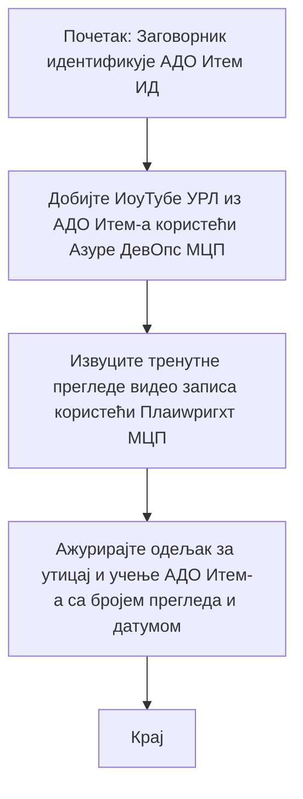

# Студија случаја: Ажурирање Azure DevOps ставки са YouTube подацима уз MCP

> **Одрицање од одговорности:** Постоје постојећи алати и извештаји на мрежи који могу аутоматизовати процес ажурирања Azure DevOps ставки са подацима са платформи као што је YouTube. Следећи сценарио је дат искључиво као пример примене како се MCP алати могу користити за аутоматизацију и интеграционе задатке.

## Преглед

Ова студија случаја демонстрира један пример како се Model Context Protocol (MCP) и његови алати могу користити за аутоматизацију процеса ажурирања Azure DevOps (ADO) радних ставки са информацијама преузетим са онлајн платформи, као што је YouTube. Описани сценарио је само илустрација ширих могућности ових алата, који се могу прилагодити многим сличним потребама аутоматизације.

У овом примеру, адвокат прати онлајн сесије користећи ADO ставке, где свака ставка укључује URL YouTube видеа. Коришћењем MCP алата, адвокат може одржавати ADO ставке ажурним са најновијим метричким подацима видеа, као што су број прегледа, на репродуциран и аутоматизован начин. Овај приступ се може општије применити на друге случајеве где је потребно интегрисати информације са онлајн извора у ADO или друге системе.

## Сценарио

Адвокат је одговоран за праћење утицаја онлајн сесија и ангажмана заједнице. Свака сесија се евидентира као ADO радна ставка у пројекту 'DevRel', а радна ставка садржи поље са URL-ом YouTube видеа. Да би тачно пријавио досег сесије, адвокат мора ажурирати ADO ставку са тренутним бројем прегледа видеа и датумом када су ти подаци преузети.

## Коришћени алати

- [Azure DevOps MCP](https://github.com/microsoft/azure-devops-mcp): Омогућава програмски приступ и ажурирање ADO радних ставки преко MCP.
- [Playwright MCP](https://github.com/microsoft/playwright-mcp): Аутоматизује радње претраживача за извлачење живих података са веб страница, као што су статистике YouTube видеа.

## Радни ток корак по корак

1. **Идентификација ADO ставке**: Почните са ID-јем ADO радне ставке (нпр. 1234) у пројекту 'DevRel'.
2. **Преузимање YouTube URL-а**: Користите Azure DevOps MCP алат да бисте добили YouTube URL из радне ставке.
3. **Извлачење броја прегледа видеа**: Користите Playwright MCP алат да посетите YouTube URL и издвојите тренутни број прегледа.
4. **Ажурирање ADO ставке**: Унесите најновији број прегледа и датум преузимања у одељак „Impact and Learnings“ у ADO радној ставки користећи Azure DevOps MCP алат.

## Пример упита

```bash
- Work with the ADO Item ID: 1234
- The project is '2025-Awesome'
- Get the YouTube URL for the ADO item
- Use Playwright to get the current views from the YouTube video
- Update the ADO item with the current video views and the updated date of the information
```

## Mermaid Flowchart


## Техничка имплементација

- **MCP оркестрација**: Радни ток је оркестриран од стране MCP сервера, који координише коришћење Azure DevOps MCP и Playwright MCP алата.
- **Аутоматизација**: Процес се може покренути ручно или планирати да се извршава у редовним интервалима како би ADO ставке биле увек ажурне.
- **Проширивост**: Иста шема се може проширити за ажурирање ADO ставки са другим онлајн метрикама (нпр. лајкови, коментари) или са других платформи.

## Резултати и утицај

- **Ефикасност**: Смањује ручни рад адвоката аутоматизујући преузимање и ажурирање видео метрика.
- **Тачност**: Осигурава да ADO ставке одражавају најсвежије доступне податке са онлајн извора.
- **Поновљивост**: Обезбеђује поновљив радни ток за сличне сценарије који укључују друге изворе података или метрике.

## Референце

- [Azure DevOps MCP](https://github.com/microsoft/azure-devops-mcp)
- [Playwright MCP](https://github.com/microsoft/playwright-mcp)
- [Model Context Protocol (MCP)](https://modelcontextprotocol.io/)

## Шта следи

- Назад на: [Case Studies Overview](./README.md)
- Следеће: [Real-Time Documentation Retrieval with MCP](./docs-mcp/README.md)

---

<!-- CO-OP TRANSLATOR DISCLAIMER START -->
**Одрицање од одговорности**:
Овај документ је преведен коришћењем AI сервиса за превођење [Co-op Translator](https://github.com/Azure/co-op-translator). Иако тежимо прецизности, молимо имајте у виду да аутоматизовани преводи могу садржавати грешке или нетачности. Оригинални документ на његовом изворном језику треба сматрати ауторитетним извором. За критичне информације препоруучује се професионални превод од стране људи. Нисмо одговорни за било каква неспоразума или погрешна тумачења која произилазе из употребе овог превода.
<!-- CO-OP TRANSLATOR DISCLAIMER END -->