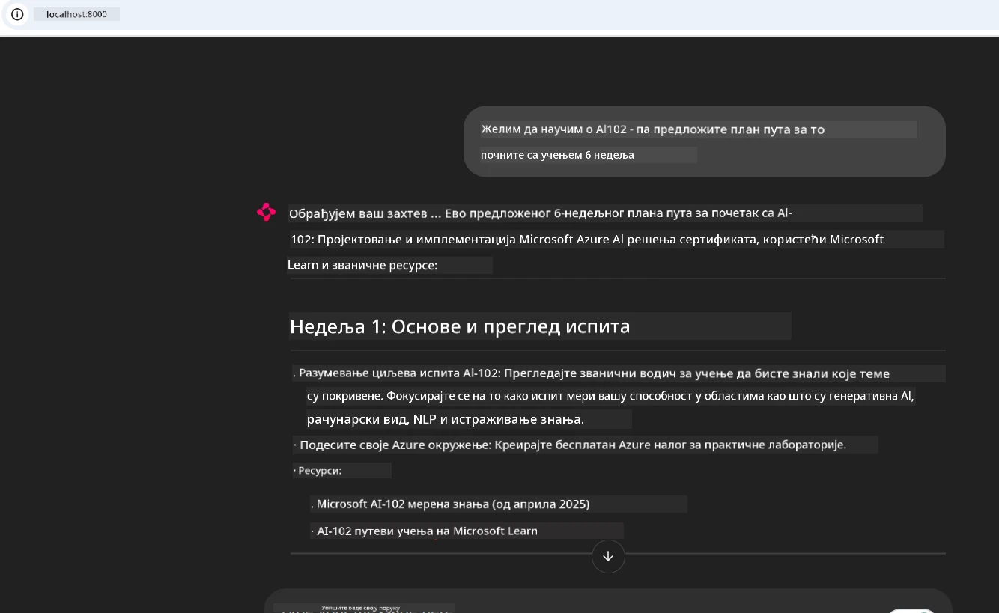
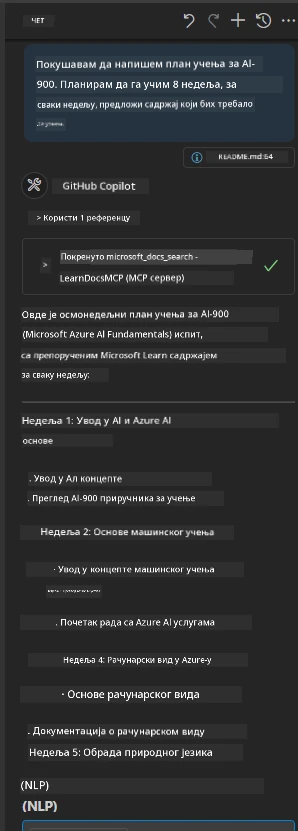

# Студија случаја: Повезивање са Microsoft Learn Docs MCP сервером из клијент апликације

Да ли сте икада налазили себе како балансирате између сајтова са документацијом, Stack Overflow-а и бескрајних картица претраживача, све док покушавате да решите проблем у свом коду? Можда држите други монитор само за документацију, или стално пребацујете између IDE и прегледача. Зар не би било боље да документацију имате директно у свом радном току — интегрисану у апликације, IDE или чак своје прилагођене алате? У овој студији случаја, истражићемо како то управо урадити, повезујући се директно са Microsoft Learn Docs MCP сервером из ваше сопствене клијент апликације.

## Преглед

Модерни развој није само писање кода — ради се о проналажењу правих информација у право време. Документација је свуда, али ретко тамо где вам је најпотребнија: унутар ваших алата и радних токова. Интегришући приступ документацији директно у апликације, можете уштедети време, смањити пребацивање контекста и повећати продуктивност. У одељку ћемо вам показати како да повежете клијент са Microsoft Learn Docs MCP сервером, како бисте имали приступ документацији у реалном времену и контексту без икаквог напуштања апликације.

Проћи ћемо кроз процес успостављања везе, слања захтева и ефикасног руковања стриминг одговорима. Овим приступом не само да поједностављујете радни ток, већ отварате врата ка прављењу паметнијих и кориснијих развојних алата.

## Циљеви учења

Зашто ово радимо? Јер најбоља корисничка искуства за развојне програмере су она која уклањају препреке. Замислите свет у којем ваш уређивач кода, чатбот или веб апликација могу одмах одговорити на питања о документацији, користећи најновији садржај са Microsoft Learn. На крају овог поглавља научићете како да:

- Разумете основе комуникације између MCP сервера и клијента за документацију
- Имплементирате конзолну или веб апликацију за повезивање са Microsoft Learn Docs MCP сервером
- Користите стриминг HTTP клијенте за приступ документацији у реалном времену
- Логујете и тумачите одговоре са документације у својој апликацији

Видео ћете како ове вештине могу помоћи у изградњи алата који нису само реактивни, већ и истински интерактивни и свесни контекста.

## Сценарио 1 - Приступ документацији у реалном времену са MCP

У овом сценарију, показаћемо вам како да повежете клијент са Microsoft Learn Docs MCP сервером, тако да имате приступ документацији у реалном времену и контексту без напуштања апликације.

Хајде да ово применимо у пракси. Ваш задатак је да напишете апликацију која се повезује на Microsoft Learn Docs MCP сервер, позива алат `microsoft_docs_search` и логује стриминг одговор на конзоли.

### Зашто овај приступ?
Зато што је он основа за креирање напреднијих интеграција — било да желите да покрећете чатбот, екстензију за IDE или веб контролну таблу.

Код и упутства за овај сценарио налазе се у фолдеру [`solution`](./solution/README.md) у оквиру ове студије случаја. Кораци ће вас провести кроз подешавање везе:
- Користите званични MCP SDK и стриминг HTTP клијент за повезивање
- Позовите алат `microsoft_docs_search` са параметром упита за добијање документације
- Имплементирајте правилно логовање и руковање грешкама
- Направите интерактивни конзолни интерфејс који омогућава корисницима да уносе више захтева за претрагу

Овај сценарио демонстрира како да:
- Повежете се са Docs MCP сервером
- Пошаљете упит
- Парсирате и испишете резултате

Ево како би покретање решења могло изгледати:

```
Prompt> What is Azure Key Vault?
Answer> Azure Key Vault is a cloud service for securely storing and accessing secrets. ...
```

Испод је минимални пример решења. Комплетан код и детаљи доступни су у фолдеру решења.

<details>
<summary>Python</summary>

```python
import asyncio
from mcp.client.streamable_http import streamablehttp_client
from mcp import ClientSession

async def main():
    async with streamablehttp_client("https://learn.microsoft.com/api/mcp") as (read_stream, write_stream, _):
        async with ClientSession(read_stream, write_stream) as session:
            await session.initialize()
            result = await session.call_tool("microsoft_docs_search", {"query": "Azure Functions best practices"})
            print(result.content)

if __name__ == "__main__":
    asyncio.run(main())
```

- За комплетну имплементацију и логовање, видите [`scenario1.py`](../../../../09-CaseStudy/docs-mcp/solution/python/scenario1.py).
- За упутства о инсталацији и коришћењу, погледајте датотеку [`README.md`](./solution/python/README.md) у истом фолдеру.
</details>


## Сценарио 2 - Веб апликација за интерактивни план студија са MCP

У овом сценарију научићете како да интегришете Docs MCP у веб развојни пројекат. Циљ је омогућити корисницима да претражују Microsoft Learn документацију директно из веб интерфејса, чинећи документацију тренутно доступном у вашој апликацији или сајту.

Видећете како да:
- Подесите веб апликацију
- Повежете се са Docs MCP сервером
- Обрадите кориснички унос и прикажете резултате

Ево како би покретање решења могло изгледати:

```
User> I want to learn about AI102 - so suggest the roadmap to get it started from learn for 6 weeks

Assistant> Here’s a detailed 6-week roadmap to start your preparation for the AI-102: Designing and Implementing a Microsoft Azure AI Solution certification, using official Microsoft resources and focusing on exam skills areas:

---
## Week 1: Introduction & Fundamentals
- **Understand the Exam**: Review the [AI-102 exam skills outline](https://learn.microsoft.com/en-us/credentials/certifications/exams/ai-102/).
- **Set up Azure**: Sign up for a free Azure account if you don't have one.
- **Learning Path**: [Introduction to Azure AI services](https://learn.microsoft.com/en-us/training/modules/intro-to-azure-ai/)
- **Focus**: Get familiar with Azure portal, AI capabilities, and necessary tools.

....more weeks of the roadmap...

Let me know if you want module-specific recommendations or need more customized weekly tasks!
```

Испод је минимални пример решења. Комплетан код и детаљи доступни су у фолдеру решења.



<details>
<summary>Python (Chainlit)</summary>

Chainlit је фрејмворк за креирање веб апликација са разговорним вештачким интелигенцијама. Омогућава лако креирање интерактивних чатботова и асистената који могу позивати MCP алате и приказивати резултате у реалном времену. Идеалан је за брзо прототиписање и кориснички пријатељске интерфејсе.

```python
import chainlit as cl
import requests

MCP_URL = "https://learn.microsoft.com/api/mcp"

@cl.on_message
def handle_message(message):
    query = {"question": message}
    response = requests.post(MCP_URL, json=query)
    if response.ok:
        result = response.json()
        cl.Message(content=result.get("answer", "No answer found.")).send()
    else:
        cl.Message(content="Error: " + response.text).send()
```

- За комплетну имплементацију, погледајте [`scenario2.py`](../../../../09-CaseStudy/docs-mcp/solution/python/scenario2.py).
- За упутства о подешавању и покретању, видите [`README.md`](./solution/python/README.md).
</details>


## Сценарио 3: Документација у уређивачу са MCP сервером у VS Code

Ако желите да добијете Microsoft Learn Docs директно унутар вашег VS Code редактора (уместо да мењате картице у прегледачу), можете користити MCP сервер у уређивачу. Ово вам омогућава да:
- Претражујете и читате документацију у VS Code без напуштања окружења за програмирање.
- Референцирате документацију и убацујете линкове директно у README или курсне датотеке.
- Комбинујете GitHub Copilot и MCP за беспрекорни радни ток документације покретан вештачком интелигенцијом.

**Показаћемо вам како да:**
- Додате валидан `.vscode/mcp.json` фајл у корен радног простора (пример испод).
- Отворите MCP панел или користите командну палету у VS Code за претрагу и убацивање документације.
- Референцирате документацију директно у вашим markdown датотекама током рада.
- Комбинујете овај радни ток са GitHub Copilot-ом за још већу продуктивност.

Ево примера како да подесите MCP сервер у VS Code:

```json
{
  "servers": {
    "LearnDocsMCP": {
      "url": "https://learn.microsoft.com/api/mcp"
    }
  }
}
```

</details>

> За детаљно објашњење са снимцима и упутствима корак по корак, видите [`README.md`](./solution/scenario3/README.md).



Овај приступ је идеалан за све који праве техничке курсеве, пишу документацију или развијају код са честим потребама за референцама.

## Кључне поуке

Интеграција документације директно у ваше алате није само погодност — она је револуција за продуктивност. Повезивањем са Microsoft Learn Docs MCP сервером из вашег клијента, можете:

- Уклонити пребацивање између кода и документације
- Добијати ажуриране, контекстуално свесне документације у реалном времену
- Правити паметније, интерактивније развојне алате

Ове вештине ће вам помоћи да креирате решења која су не само ефикасна, већ и пријатна за коришћење.

## Додатни ресурси

Да бисте продубили знање, истражите ове званичне ресурсе:

- [Microsoft Learn Docs MCP Server (GitHub)](https://github.com/MicrosoftDocs/mcp)
- [Започните са Azure MCP Server-ом (mcp-python)](https://learn.microsoft.com/en-us/azure/developer/azure-mcp-server/get-started#create-the-python-app)
- [Шта је Azure MCP Server?](https://learn.microsoft.com/en-us/azure/developer/azure-mcp-server/)
- [Увод у Model Context Protocol (MCP)](https://modelcontextprotocol.io/introduction)
- [Додавање плагина са MCP сервера (Python)](https://learn.microsoft.com/en-us/semantic-kernel/concepts/plugins/adding-mcp-plugins)

## Шта следи

- Назад на: [Преглед студија случаја](../README.md)
- Наставите на: [Модул 10: Убрзавање АИ радних токова са AI Toolkit-ом](../../10-StreamliningAIWorkflowsBuildingAnMCPServerWithAIToolkit/README.md)

---

<!-- CO-OP TRANSLATOR DISCLAIMER START -->
**Одрицање од одговорности**:  
Овај документ је преведен помоћу АИ услуге за превођење [Co-op Translator](https://github.com/Azure/co-op-translator). Иако тежимо прецизности, молимо имајте у виду да аутоматски преводи могу садржати грешке или нетачности. Оригинални документ на његовом изворном језику треба сматрати ауторитетним извором. За критичне информације препоручује се професионални људски превод. Нисмо одговорни за било каква неспоразума или погрешне тумачења настале употребом овог превода.
<!-- CO-OP TRANSLATOR DISCLAIMER END -->