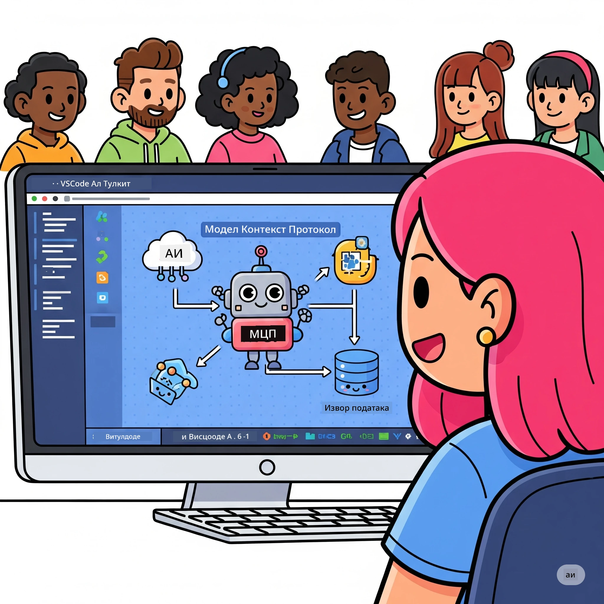
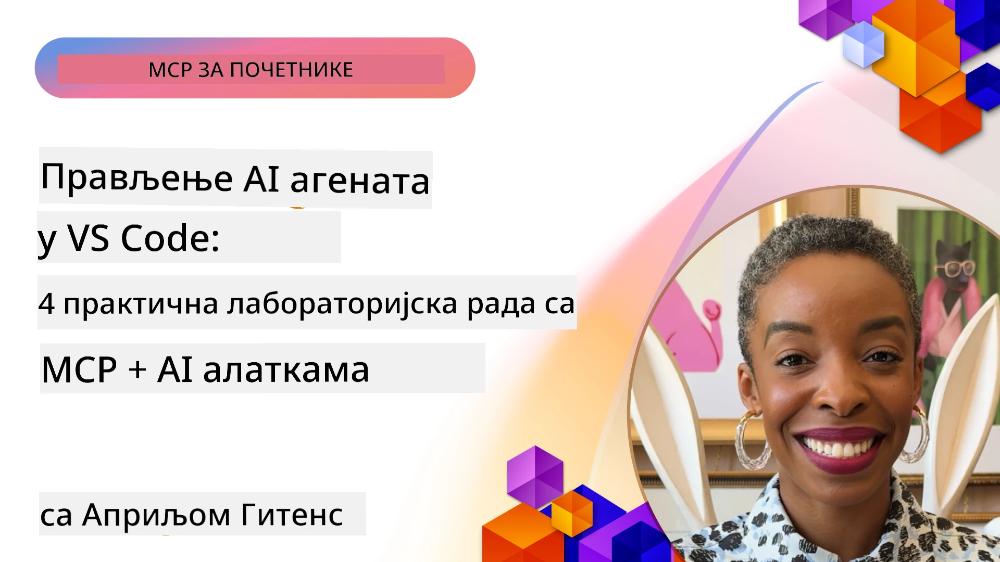

# Унапређење АИ радних токова: Израда MCP сервера са AI Toolkit-ом

## 🎯 Преглед

_(Кликните слику изнад да бисте гледали видео овог часа)_

Добродошли у **Радионицу о Протоколу Модел Контекста (MCP)**! Ова свеобухватна практична радионица комбинује две најмодерније технологије за револуционарни развој АИ апликација:

- **🔗 Протокол Модел Контекста (MCP)**: Отворени стандард за беспрекорну интеграцију АИ алата
- **🛠️ AI Toolkit за Visual Studio Code (AITK)**: Моћни АИ развојни додатак компаније Microsoft

### 🎓 Шта ћете научити

До краја ове радионице овладаћете уметношћу изградње интелигентних апликација које повезују АИ моделе са реалним алатима и сервисима. Од аутоматског тестирања до прилагођених API интеграција, стекаћете практичне вештине за решавање сложених пословних изазова.

## 🏗️ Технолошки стек

### 🔌 Протокол Модел Контекста (MCP)

MCP је **„USB-C за АИ“** — универзални стандард који повезује АИ моделе са спољним алатима и изворима података.

**✨ Кључне карактеристике:**

- 🔄 **Стандаризована интеграција**: Универзалан интерфејс за повезивање АИ алата
- 🏛️ **Флексибилна архитектура**: Локални и удаљени сервери преко stdio/SSE транспорта
- 🧰 **Богат екосистем**: Алатке, упити и ресурси у једном протоколу
- 🔒 **Спреман за компанијску употребу**: Уграђена безбедност и поузданост

**🎯 Зашто је MCP важан:**
Као што је USB-C поједноставио хаос са кабловима, MCP појачава сложеност АИ интеграција. Један протокол, бескрајне могућности.

### 🤖 AI Toolkit за Visual Studio Code (AITK)

Microsoft-ов водећи АИ развојни додатак који претвара VS Code у АИ центар.

**🚀 Основне могућности:**

- 📦 **Каталог модела**: Приступ моделима са Azure AI, GitHub, Hugging Face, Ollama
- ⚡ **Локално извршавање**: ONNX-оптимизована CPU/GPU/NPU извршавања
- 🏗️ **Изградња агената**: Визуелни развој АИ агената са MCP интеграцијом
- 🎭 **Мулти-модално**: Подршка за текст, визуелне и структуриране излазе

**💡 Предности развоја:**

- Деплој без конфигурације модела
- Визуелно креирање упита
- Тестирање у реалном времену
- Беспрекорна интеграција MCP сервера

## 📚 Пут учења

### [🚀 Модул 1: Основе AI Toolkita](./lab1/README.md)

**Трајање**: 15 минута

- 🛠️ Инсталирање и конфигурисање AI Toolkit-а за VS Code
- 🗂️ Истраживање Каталога модела (100+ модела са GitHub-а, ONNX-а, OpenAI-а, Anthropic-а, Google-а)
- 🎮 Савладавање Интерактивног игралишта за тестирање модела у реалном времену
- 🤖 Израда првог АИ агента уз Agent Builder
- 📊 Процена перформанси модела уз уграђене метрике (F1, релевантност, сличност, кохеренција)
- ⚡ Учење о серијској обради и могућностима мулти-модалности

**🎯 Резултат учења**: Креирајте функционалног АИ агента са свеобухватним разумевањем AITK могућности

### [🌐 Модул 2: Основа MCP-а са AI Toolkit-ом](./lab2/README.md)

**Трајање**: 20 минута

- 🧠 Савладајте архитектуру и концепте Протокола Модел Контекста (MCP)
- 🌐 Истражите Microsoft-ов MCP серверски екосистем
- 🤖 Израдите агента за аутоматизацију браузера користећи Playwright MCP сервер
- 🔧 Интегришите MCP сервере са Agent Builder-ом AI Toolkita
- 📊 Конфигуришите и тестирајте MCP алате у вашим агентима
- 🚀 Извезите и деплојујте MCP-подржане агенте за производну употребу

**🎯 Резултат учења**: Деплојте АИ агента појачаног спољним алатима преко MCP-а

### [🔧 Модул 3: Напредни развој MCP-а са AI Toolkit-ом](./lab3/README.md)

**Трајање**: 20 минута

- 💻 Креирајте прилагођене MCP сервере уз AI Toolkit
- 🐍 Конфигуришите и користите најновији MCP Python SDK (v1.9.3)
- 🔍 Поставите и користите MCP Inspector за дебаговање
- 🛠️ Изградите Weather MCP сервер са професионалним дебаг радним токовима
- 🧪 Дебагујте MCP сервере у Agent Builder-у и Inspector окружењима

**🎯 Резултат учења**: Развијајте и дебагујте прилагођене MCP сервере уз савремени алат

### [🐙 Модул 4: Практични развој MCP-а - Прилагођени GitHub Clone сервер](./lab4/README.md)

**Трајање**: 30 минута

- 🏗️ Изградите реални GitHub Clone MCP сервер за развојне токове
- 🔄 Имплементирајте паметно клонирање репозиторијума са валидацијом и руковањем грешкама
- 📁 Креирајте интелигентно управљање директоријумима и интеграцију са VS Code
- 🤖 Користите GitHub Copilot Agent режим са прилагођеним MCP алатима
- 🛡️ Примените поузданост спремну за производњу и крос-платформску компатибилност

**🎯 Резултат учења**: Деплојте производно спреман MCP сервер који унапређује стварне развојне токове

## 💡 Практичне примене и утицај

### 🏢 Кориснички случајеви у предузећима

#### 🔄 Аутоматизација DevOps-a

Трансформишите свој развојни ток помоћу интелигентне аутоматизације:

- **Паметно управљање репозиторијумима**: АИ вођене одлуке о прегледу и спајању кода
- **Интелигентни CI/CD**: Аутоматска оптимизација цевовода базирана на променама кода
- **Триажа проблема**: Аутоматска класификација и додела грешака

#### 🧪 Револуција у осигурању квалитета

Побољшајте тестирање аутоматизацијом помоћу АИ:

- **Паметна генерација тестова**: Аутоматско креирање опсежних тест пакета
- **Визуелно тестирање регресије**: Детекција промена интерфејса уз помоћ АИ
- **Праћење перформанси**: Проактивно откривање и решавање проблема

#### 📊 Интелигенција токова података

Изградите паметније токове обраде података:

- **Адаптивни ETL процеси**: Самооптимизујуће трансформације података
- **Откривање аномалија**: Надзор квалитета података у реалном времену
- **Интелигентно руковање током података**: Паметно управљање протоком података

#### 🎧 Побољшање корисничког искуства

Креирајте изузетну сарадњу са корисницима:

- **Подршка свесна контекста**: АИ агенти са приступом историјату корисника
- **Проактивно решавање проблема**: Предиктивна корисничка подршка
- **Интеграција преко више канала**: Јединствено АИ искуство на свим платформама

## 🛠️ Претпоставке и подешавање

### 💻 Захтеви система

| Компонента               | Захтев        | Напомене                |
|-------------------------|--------------|------------------------|
| **Оперативни систем**    | Windows 10+, macOS 10.15+, Linux | Било који модерни ОС      |
| **Visual Studio Code**   | Најновија стабилна верзија | Потребно за AITK          |
| **Node.js**              | v18.0+ и npm | За развој MCP сервера    |
| **Python**               | 3.10+        | Опционо за Python MCP сервере |
| **Рам меморија**         | Минимум 8GB  | Препоручено 16GB за локалне моделе |

### 🔧 Развојно окружење

#### Препоручени додатци за VS Code

- **AI Toolkit** (ms-windows-ai-studio.windows-ai-studio)
- **Python** (ms-python.python)
- **Python Debugger** (ms-python.debugpy)
- **GitHub Copilot** (GitHub.copilot) - Опционо али корисно

#### Опционо

- **uv**: Модеран менаџер пакета за Python
- **MCP Inspector**: Визуелни алат за дебаговање MCP сервера
- **Playwright**: За примерe веб аутоматизације

## 🎖️ Резултати учења и пут ка сертификату

### 🏆 Контрола знања

Завршетком ове радионице остварићете мастерски ниво у:

#### 🎯 Основне компетенције

- [ ] **Мастер MCP протокола**: Дубоко разумевање архитектуре и обрасца имплементације
- [ ] **Снага AITK-а**: Експертско коришћење AI Toolkit-а за брз развој
- [ ] **Развој појединачних сервера**: Креирање, деплој и одржавање MCP сервера за производњу
- [ ] **Одличност у интеграцији алата**: Беспрекорно повезивање АИ са постојећим развојним токовима
- [ ] **Примена у решавању проблема**: Коришћење стечених вештина за реалне пословне изазове

#### 🔧 Техничке вештине

- [ ] Подешавање и конфигурација AI Toolkita у VS Code-у
- [ ] Дизајн и имплементација прилагођених MCP сервера
- [ ] Интеграција GitHub модела са MCP архитектуром
- [ ] Изградња аутоматизованих токова тестирања уз Playwright
- [ ] Деплој АИ агената за производну употребу
- [ ] Дебаговање и оптимизација перформанси MCP сервера

#### 🚀 Напредне могућности

- [ ] Архитектура интеграција АИ на нивоу предузећа
- [ ] Имплементација најбољих безбедносних пракси за АИ апликације
- [ ] Дизајн скалабилних MCP серверских архитектура
- [ ] Креирање прилагођених ланаца алата за специфичне области
- [ ] Менторство у АИ-племенитом развоју

## 📖 Додатни ресурси

- [MCP спецификација (2025-11-25)](https://spec.modelcontextprotocol.io/specification/2025-11-25/)
- [AI Toolkit GitHub Репозиторијум](https://github.com/microsoft/vscode-ai-toolkit)
- [Колекција примера MCP сервера](https://github.com/modelcontextprotocol/servers)
- [Водич најбољих пракси](https://modelcontextprotocol.io/docs/best-practices)
- [OWASP MCP Топ 10](https://microsoft.github.io/mcp-azure-security-guide/mcp/) - Најбоље праксе за безбедност

---

**🚀 Спремни да револуционишете свој АИ развојни ток?**

Изградимо заједно будућност интелигентних апликација уз MCP и AI Toolkit!

## Шта следи

Наставите са: [Модул 11: Практичне вежбе MCP сервера](../11-MCPServerHandsOnLabs/README.md)

---

<!-- CO-OP TRANSLATOR DISCLAIMER START -->
**Одрицање одговорности**:
Овај документ је преведен коришћењем AI сервиса за превођење [Co-op Translator](https://github.com/Azure/co-op-translator). Иако се трудимо да превод буде прецизан, молимо вас да имате у виду да аутоматски преводи могу садржати грешке или нетачности. Изворни документ на његовом матерњем језику треба сматрати званичним извором. За критичне информације препоручује се професионални људски превод. Нисмо одговорни за било какве неспоразуме или неправилна тумачења која произилазе из коришћења овог превода.
<!-- CO-OP TRANSLATOR DISCLAIMER END -->