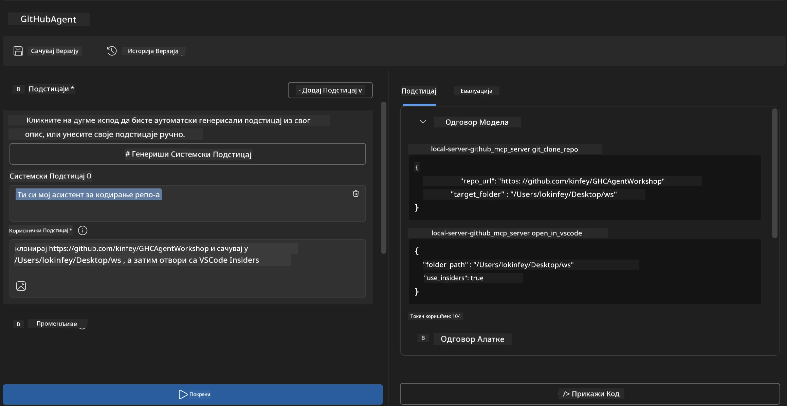
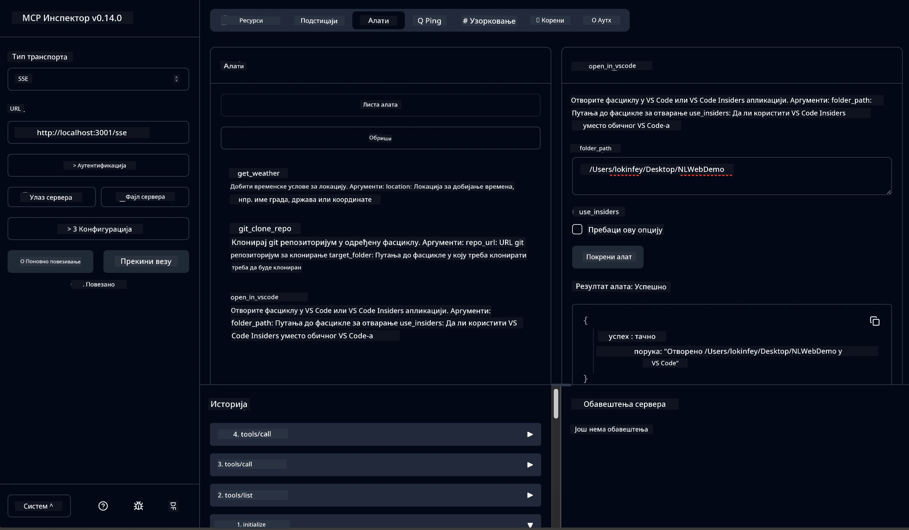

# 🐙 Модул 4: Практични развој MCP - Прилагођени GitHub клон сервер


> **⚡ Брз почетак:** Изградите MCP сервер спреман за продукцију који аутоматизује клонирање GitHub репозиторијума и интеграцију са VS Code за само 30 минута!

## 🎯 Циљеви учења

До краја овог лабораторијског задатка, моћи ћете да:

- ✅ Креирате прилагођени MCP сервер за развојне токове у стварном свету
- ✅ Имплементирате функцију клонирања GitHub репозиторијума преко MCP
- ✅ Интегришете прилагођене MCP сервере са VS Code и Agent Builder-ом
- ✅ Користите GitHub Copilot Agent Mode са прилагођеним MCP алатима
- ✅ Тестирајте и распоредите прилагођене MCP сервере у продукционе средине

## 📋 Претпоставке

- Завршетак лабораторија 1-3 (основе и напредни развој MCP-а)
- Претплата на GitHub Copilot ([доступна бесплатна регистрација](https://github.com/github-copilot/signup))
- VS Code са екстензијама AI Toolkit и GitHub Copilot
- Инсталиран и конфигурисан Git CLI

## 🏗️ Преглед пројекта

### **Изазов развоја у стварном свету**
Као програмери, често користимо GitHub да клонирамо репозиторијуме и отварамо их у VS Code или VS Code Insiders. Овај ручни процес укључује:
1. Отварање терминала/командне линије
2. Навигацију до жељеног директоријума
3. Извршавање команде `git clone`
4. Отварање VS Code-а у клонираној фасцикли

**Наш MCP решење ово претвара у једну интелигентну команду!**

### **Шта ћете изградити**
**GitHub Clone MCP сервер** (`git_mcp_server`) који пружа:

| Карактеристика | Опис | Предност |
|---------|-------------|---------|
| 🔄 **Интелигентно клонирање репозиторијума** | Клонирање GitHub репозиторијума са валидацијом | Аутоматизована провера грешака |
| 📁 **Интелигентно управљање директоријумима** | Проверa и безбедно креирање директоријума | Спрема од преписивања постојећих података |
| 🚀 **Крос-платформска интеграција са VS Code-ом** | Отварање пројеката у VS Code/Insiders | Беспрекорни прелазак у развојни ток |
| 🛡️ **Снажна обрада грешака** | Обрада мрежних, дозволних и путањских проблема | Поузданост спремна за производњу |

---

## 📖 Корак по корак имплементација

### Корак 1: Креирајте GitHub агента у Agent Builder-у

1. **Покрените Agent Builder** преко AI Toolkit екстензије
2. **Креирајте новог агента** са следећом конфигурацијом:
   ```
   Agent Name: GitHubAgent
   ```

3. **Иницијализујте прилагођени MCP сервер:**
   - Идите на **Tools** → **Add Tool** → **MCP Server**
   - Изаберите **"Create A new MCP Server"**
   - Одаберите **Python шаблон** за максималну флексибилност
   - **Име сервера:** `git_mcp_server`

### Корак 2: Конфигуришите GitHub Copilot Agent Mode

1. **Отворите GitHub Copilot** у VS Code-у (Ctrl/Cmd + Shift + P → "GitHub Copilot: Open")
2. **Изаберите Agent Model** у Copilot интерфејсу
3. **Одаберите Claude 3.7 модел** за побољшане способности резоновања
4. **Омогућите MCP интеграцију** за приступ алатима

> **💡 Профессионални савет:** Claude 3.7 пружа боље разумевање развојних токова и образаца обраде грешака.

### Корак 3: Имплементирајте кључну функционалност MCP сервера

**Користите следећи детаљни упит са GitHub Copilot Agent Mode:**

```
Create two MCP tools with the following comprehensive requirements:

🔧 TOOL A: clone_repository
Requirements:
- Clone any GitHub repository to a specified local folder
- Return the absolute path of the successfully cloned project
- Implement comprehensive validation:
  ✓ Check if target directory already exists (return error if exists)
  ✓ Validate GitHub URL format (https://github.com/user/repo)
  ✓ Verify git command availability (prompt installation if missing)
  ✓ Handle network connectivity issues
  ✓ Provide clear error messages for all failure scenarios

🚀 TOOL B: open_in_vscode
Requirements:
- Open specified folder in VS Code or VS Code Insiders
- Cross-platform compatibility (Windows/Linux/macOS)
- Use direct application launch (not terminal commands)
- Auto-detect available VS Code installations
- Handle cases where VS Code is not installed
- Provide user-friendly error messages

Additional Requirements:
- Follow MCP 1.9.3 best practices
- Include proper type hints and documentation
- Implement logging for debugging purposes
- Add input validation for all parameters
- Include comprehensive error handling
```

### Корак 4: Тестирање вашег MCP сервера

#### 4a. Тестирање у Agent Builder-у

1. **Покрените debug конфигурацију** у Agent Builder-у
2. **Конфигуришите вашег агента са овим системским упитом:**

```
SYSTEM_PROMPT:
You are my intelligent coding repository assistant. You help developers efficiently clone GitHub repositories and set up their development environment. Always provide clear feedback about operations and handle errors gracefully.
```

3. **Тестирајте реалистичне корисничке сценарије:**

```
USER_PROMPT EXAMPLES:

Scenario : Basic Clone and Open
"Clone {Your GitHub Repo link such as https://github.com/kinfey/GHCAgentWorkshop
 } and save to {The global path you specify}, then open it with VS Code Insiders"
```



**Очекујeми резултати:**
- ✅ Успешно клонирање са потврдом путање
- ✅ Аутоматско покретање VS Code-а
- ✅ Јасне поруке о грешци за неважеће сценарије
- ✅ Правилна обрада ивица случајева

#### 4b. Тестирање у MCP Inspector-у




---


**🎉 Честитамо!** Успешно сте креирали практичан MCP сервер спреман за производњу који решава стварне изазове у развоју. Ваш прилагођени GitHub клон сервер демонстрира снагу MCP-а за аутоматизацију и побољшање продуктивности програмера.

### 🏆 Остварени резултати:
- ✅ **MCP Developer** - Креиране прилагођене MCP сервере
- ✅ **Workflow Automator** - Поједностављени развојни процеси  
- ✅ **Integration Expert** - Повезивање више развојних алата
- ✅ **Production Ready** - Изграђена решења спремна за имплементацију

---

## 🎓 Завршетак радионице: Ваш пут са Model Context Protocol

**Драги учесниче радионице,**

Честитамо на завршетку свих четири модула радионице Model Context Protocol! Прешли сте дуг пут од разумевања основа AI Toolkit-а до изградње продукционих MCP сервера који решавају стварне изазове у развоју.

### 🚀 Подсетник вашег пута учења:

**[Модул 1](../lab1/README.md)**: Почели сте истраживањем основа AI Toolkit-а, тестирањем модела и креирањем првог AI агента.

**[Модул 2](../lab2/README.md)**: Научили сте MCP архитектуру, интегрисали Playwright MCP и израдили првог агента за аутоматизацију прегледача.

**[Модул 3](../lab3/README.md)**: Напредовали сте ка развоју прилагођених MCP сервера са Weather MCP сервером и савладали алате за дебаговање.

**[Модул 4](../lab4/README.md)**: Сада сте све применили да бисте направили практичан алат за аутоматизацију GitHub радних токова.

### 🌟 Шта сте савладали:

- ✅ **AI Toolkit екосистем**: Модели, агенти и обрасци интеграције
- ✅ **MCP архитектуру**: Клијент-сервер дизајн, транспортни протоколи и безбедност
- ✅ **Алатке за програмере**: Од Playground-а до Inspector-а и производног распореда
- ✅ **Прилагођени развој**: Изградња, тестирање и распоређивање сопствених MCP сервера
- ✅ **Практичне примене**: Решење стварних изазова радних токова коришћењем AI

### 🔮 Ваши следећи кораци:

1. **Изградите свој MCP сервер**: Примените ове вештине да аутоматизујете ваше јединствене токове рада
2. **Придружите се MCP заједници**: Поделите своја остварења и учите од других
3. **Истражите напредну интеграцију**: Повежите MCP сервере са пословним системима
4. **Доприносите отвореном коду**: Помозите у унапређењу MCP алата и документације

Запамтите, ова радионица је само почетак. Model Context Protocol екосистем се брзо развија и сада сте опремљени да будете на челу AI-подржаних алата за развој.

**Хвала вам на учешћу и посвећености учењу!**

Надамо се да је ова радионица покренула идеје које ће трансформисати начин на који градите и комуницирате са AI алатима у вашем развојном путовању.

**Срећан кодинг!**

---

## Шта следи

Честитамо на завршетку свих лабораторијских вежби у Модулу 10!

- Назад на: [Преглед Модула 10](../README.md)
- Наставите на: [Модул 11: MCP Server Hands-On Labs](../../11-MCPServerHandsOnLabs/README.md)

---

<!-- CO-OP TRANSLATOR DISCLAIMER START -->
**Одрицање од одговорности**:
Овај документ је преведен помоћу услуге за аутоматски превод [Co-op Translator](https://github.com/Azure/co-op-translator). Иако тежимо прецизности, имајте на уму да аутоматски преводи могу садржати грешке или нетачности. Оригинални документ на његовом изворном језику треба сматрати ауторитетом. За критичне информације препоручује се професионални превод од стране људи. Нисмо одговорни за било каква непоразумевања или погрешне интерпретације које произилазе из коришћења овог превода.
<!-- CO-OP TRANSLATOR DISCLAIMER END -->