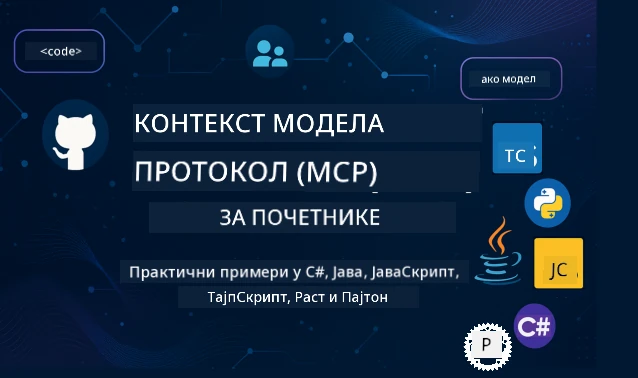

 

[](https://GitHub.com/microsoft/mcp-for-beginners/graphs/contributors)
[](https://GitHub.com/microsoft/mcp-for-beginners/issues)
[](https://GitHub.com/microsoft/mcp-for-beginners/pulls)
[](http://makeapullrequest.com)

[](https://GitHub.com/microsoft/mcp-for-beginners/watchers)
[](https://GitHub.com/microsoft/mcp-for-beginners/fork)
[](https://GitHub.com/microsoft/mcp-for-beginners/stargazers)


[](https://discord.gg/nTYy5BXMWG)

Пратите ове кораке да бисте почели да користите ове ресурсе:
1. **Направите форк репозиторијума**: Кликните [](https://GitHub.com/microsoft/mcp-for-beginners/fork)
2. **Клонирајте репозиторијум**: `git clone https://github.com/microsoft/mcp-for-beginners.git`
3. **Придружите се** [](https://discord.gg/nTYy5BXMWG)


### 🌐 Подршка више језика

#### Подржано кроз GitHub акцију (Аутоматски и Увек ажурирано)

<!-- CO-OP TRANSLATOR LANGUAGES TABLE START -->
[Arabic](../ar/README.md) | [Bengali](../bn/README.md) | [Bulgarian](../bg/README.md) | [Burmese (Myanmar)](../my/README.md) | [Chinese (Simplified)](../zh-CN/README.md) | [Chinese (Traditional, Hong Kong)](../zh-HK/README.md) | [Chinese (Traditional, Macau)](../zh-MO/README.md) | [Chinese (Traditional, Taiwan)](../zh-TW/README.md) | [Croatian](../hr/README.md) | [Czech](../cs/README.md) | [Danish](../da/README.md) | [Dutch](../nl/README.md) | [Estonian](../et/README.md) | [Finnish](../fi/README.md) | [French](../fr/README.md) | [German](../de/README.md) | [Greek](../el/README.md) | [Hebrew](../he/README.md) | [Hindi](../hi/README.md) | [Hungarian](../hu/README.md) | [Indonesian](../id/README.md) | [Italian](../it/README.md) | [Japanese](../ja/README.md) | [Kannada](../kn/README.md) | [Korean](../ko/README.md) | [Lithuanian](../lt/README.md) | [Malay](../ms/README.md) | [Malayalam](../ml/README.md) | [Marathi](../mr/README.md) | [Nepali](../ne/README.md) | [Nigerian Pidgin](../pcm/README.md) | [Norwegian](../no/README.md) | [Persian (Farsi)](../fa/README.md) | [Polish](../pl/README.md) | [Portuguese (Brazil)](../pt-BR/README.md) | [Portuguese (Portugal)](../pt-PT/README.md) | [Punjabi (Gurmukhi)](../pa/README.md) | [Romanian](../ro/README.md) | [Russian](../ru/README.md) | [Serbian (Cyrillic)](./README.md) | [Slovak](../sk/README.md) | [Slovenian](../sl/README.md) | [Spanish](../es/README.md) | [Swahili](../sw/README.md) | [Swedish](../sv/README.md) | [Tagalog (Filipino)](../tl/README.md) | [Tamil](../ta/README.md) | [Telugu](../te/README.md) | [Thai](../th/README.md) | [Turkish](../tr/README.md) | [Ukrainian](../uk/README.md) | [Urdu](../ur/README.md) | [Vietnamese](../vi/README.md)

> **Волите да клонирате локално?**
>
> Овај репозиторијум садржи преводе на преко 50 језика што значајно повећава величину преузимања. Да бисте клонирали без превода, користите sparse checkout:
>
> **Bash / macOS / Linux:**
> ```bash
> git clone --filter=blob:none --sparse https://github.com/microsoft/mcp-for-beginners.git
> cd mcp-for-beginners
> git sparse-checkout set --no-cone '/*' '!translations' '!translated_images'
> ```
>
> **CMD (Windows):**
> ```cmd
> git clone --filter=blob:none --sparse https://github.com/microsoft/mcp-for-beginners.git
> cd mcp-for-beginners
> git sparse-checkout set --no-cone "/*" "!translations" "!translated_images"
> ```
>
> Ово вам даје све што вам је потребно да завршите курс знатно брже.
<!-- CO-OP TRANSLATOR LANGUAGES TABLE END -->

# 🚀 Курикулум за Model Context Protocol (MCP) за почетнике

## **Научите MCP уз практичне примере кода у C#, Java, JavaScript, Rust, Python и TypeScript**

## 🧠 Преглед курикулума Model Context Protocol
Добродошли на ваше путовање у Model Context Protocol! Ако сте се икада питали како АИ апликације комуницирају са различитим алатима и услугама, управо ћете открити елегантно решење које трансформише начин на који програмери граде интелигентне системе.

Замислите MCP као универзалног преводиоца за АИ апликације - баш како вам УСБ портови омогућавају да повежете било који уређај са вашим рачунаром, MCP омогућава да АИ модели комуницирају са било којим алатом или услугом на стандардизован начин. Без обзира да ли правите свог првог чатбота или радите на сложеним АИ радним токовима, разумевање MCP даће вам моћ да креирате способније и флексибилније апликације.

Овај курикулум је осмишљен са стрпљењем и пажњом за ваше учење. Почећемо са једноставним концептима које већ разумете и постепено ћемо градити ваше вештине кроз практичне вежбе на вашем омиљеном програмском језику. Сваки корак укључује јасна објашњења, практичне примере и доста подршке током пута.

Када завршите ово путовање, имаћете самопоуздање да направите своје MCP сервере, интегришете их са популарним АИ платформама и разумете како ова технологија обликује будућност развоја АИ-а. Хајде да заједно започнемо ову узбудљиву авантуру!

### Званична документација и спецификације

Овај курикулум је усклађен са **MCP спецификацијом 2025-11-25** (најновија стабилна верзија). MCP користи верзионисање базирано на датуму (формат ГГГГ-ММ-ДД) како би се осигурало јасно праћење верзије протокола.

Ови ресурси ће вам постајати све драгоценији како ваше разумевање буде расло, али не треба да се осећате притиснуто да одмах прочитате све. Почните са темама које вас највише занимају!
- 📘 [MCP документација](https://modelcontextprotocol.io/) – Ово је ваш кључни ресурс за туторијале корак-по-корак и водиче за кориснике. Документација је написана имајући у виду почетнике, пружајући јасне примере које можете пратити својим темпом.
- 📜 [MCP спецификација](https://modelcontextprotocol.io/specification/2025-11-25) – Размислите о овоме као о вашем свеобухватном референтном приручнику. Док радите кроз курикулум, често ћете овде долазити да погледате специфичне детаље и истражите напредне карактеристике.
- 📜 [Верзионисање MCP спецификације](https://modelcontextprotocol.io/specification/versioning) – Овде се налазе информације о историјату верзија протокола и како MCP користи формат верзионисања заснован на датуму (ГГГГ-ММ-ДД).
- 🧑‍💻 [MCP GitHub репозиторијум](https://github.com/modelcontextprotocol) – Овде ћете наћи SDK-ове, алате и примерке кода на више програмских језика. То је као ризница практичних примера и готових компоненти.
- 🌐 [MCP заједница](https://github.com/orgs/modelcontextprotocol/discussions) – Придружите се другим ученицима и искусним програмерима у дискусијама о MCP. То је подршка и заједница у којој су питања добродошла а знање се слободно дели.
  
## Циљеви учења

До краја овог курикулума, осећаћете се сигурно и узбуђено због својих нових способности. Ево шта ћете постићи:

• **Разумевање основа MCP:** Разумећете шта је Model Context Protocol и зашто револуционише начин на који АИ апликације сарађују, користећи аналогије и примере који имају смисла.

• **Прављење свог првог MCP сервера:** Направићете функционални MCP сервер на жељеном програмском језику, почевши од једноставних примера и постепено уживајући у сваком кораку унапређења.

• **Повезивање АИ модела са стварним алатима:** Научићете како да повежете АИ моделе са реалним услугама, дајући својим апликацијама моћне нове могућности.

• **Примена најбољих безбедносних пракси:** Разумете како да својим MCP имплементацијама обезбедите сигурност и заштиту, штитећи и апликације и кориснике.

• **Деплојовање са самопоуздањем:** Знаћете како да своје MCP пројекте из развоја пребаците у продукцију, са практичним стратегијама постављања које раде у стварном свету.

• **Придруживање MCP заједници:** Постаћете део растуће заједнице програмера која обликује будућност развоја АИ апликација.

## Неопходна основа

Пре него што уроните у MCP специфичности, хајде да се уверимо да сте упознати са неким основним концептима. Не брините ако нисте експерт у овим областима - све ћемо објаснити како будемо напредовали!

### Разумевање протокола (Основа)

Протокол замислите као правила за разговор. Када зовете пријатеља, обојице знате да треба да рекнете „здрао“ када се јавите, да се смењујете у говору и да кажете „довиђења“ кад је крај. Компјутерски програми имају слична правила да би ефикасно комуницирали.

MCP је протокол - скуп договорених правила која помажу АИ моделима и апликацијама да воде продуктивне „разговоре“ са алатима и услугама. Баш као што правила разговора олакшавају људску комуникацију, MCP чини комуникацију АИ апликација много поузданијом и моћнијом.

### Односи клијент-сервер (Како програми сарађују)

Већ користите односе клијент-сервер сваки дан! Када користите веб прегледач (клијент) за приступ сајту, повезујете се са веб сервером који вам шаље садржај странице. Прегледач зна како да тражи информације, а сервер зна како да одговори.

У MCP-у имамо сличан однос: АИ модели делују као клијенти који захтевају информације или акције, док MCP сервери пружају те могућности. То је као да имате помоћника (сервер) којем АИ може да затражи одређене задатке.

### Зашто стандардизација значи (Чини ствари компатибилним)

Замислите да сваки произвођач аутомобила користи другачији облик пумпе за гориво - морали бисте сваки пут да користите другачији адаптер! Стандардизација значи договор о заједничким приступима тако да ствари функционишу без проблема.

MCP обезбеђује ову стандардизацију за АИ апликације. Уместо да сваки АИ модел мора да има прилагођени код за сваки алат, MCP ствара универзалан начин комуникације. То значи да програмери могу једном направити алате и омогућити им рад са многим различитим АИ системима.

## 🧭 Преглед вашег пута учења

Ваш MCP пут је пажљиво структуриран да постепено гради ваше самопоуздање и вештине. Свака фаза уводи нове концепте уз понављање већ научених.

### 🌱 Фаза основе: Разумевање основа (Модули 0-2)

Овде почиње ваша авантура! Упознаћемо вас са MCP концептима користећи познате аналогије и једноставне примере. Разумећете шта је MCP, зашто постоји и како се уклапа у шири свет АИ развоја.

• **Модул 0 - Увод у MCP:** Почећемо истраживањем шта је MCP и зашто је тако важан за модерне АИ апликације. Видећете праве примере MCP у акцији и разумети како решава уобичајене проблеме са којима се програмери сусрећу.

• **Модул 1 - Објашњени основни концепти:** Овде ћете научити кључне грађевне блокове MCP-а. Користићемо пуно аналогија и визуелних примера да бисте лако и природно разумели те концепте.

• **Модул 2 - Безбедност у MCP:** Безбедност можда звуче застрашујуће, али показћемо вам како MCP садржи уграђене безбедносне функције и научићемо вас најбољим праксама које штите ваше апликације од самог почетка.

### 🔨 Фаза изградње: Креирање ваших првих имплементација (Модул 3)

Сада почиње права забава! Добићете практично искуство прављења стварних MCP сервера и клијената. Не брините - почећемо једноставно и водићемо вас кроз сваки корак.
Овај модул укључује више практичних водича који вам омогућавају да вежбате у вашем омиљеном програмском језику. Направићете свој први сервер, изградити клијента који ће се повезивати са њим, и чак интегрисати са популарним алатима за развој као што је VS Code.

Сваки водич садржи потпуне примере кода, савете за решавање проблема и објашњења зашто доносимо одређене дизајнерске одлуке. До краја ове фазе имаћете радне MCP имплементације на које можете бити поносни!

### 🚀 Фаза раста: Напредни концепти и примена у стварном свету (Модули 4-5)

Након што савладате основе, спремни сте да истражите сложеније MCP функције. Покриваћемо практичне стратегије имплементације, технике отклањања грешака и напредне теме као што је мултимодална интеграција вештачке интелигенције.

Такође ћете научити како да скалирате своје MCP имплементације за производну употребу и интегришете их са облачним платформама као што је Azure. Ови модули вас припремају за изградњу MCP решења која могу да задовоље захтеве стварног света.

### 🌟 Фаза савладавања: Заједница и специјализација (Модули 6-11)

Последња фаза фокусира се на учлањење у MCP заједницу и специјализацију у областима које вас највише занимају. Научићете како да допринесете отвореним MCP пројектима, имплементирате напредне аутентификационе шаблоне и градите комплетна решења интегрисана са базама података.

Модул 11 заслужује посебну пажњу – то је комплетан 13-лабораторијски практичан пут учења који вас учи како да правите производно спремне MCP сервере са интеграцијом PostgreSQL. То је као завршни пројекат који повезује све што сте научили!

### 📚 Комплетна структура наставног плана

| Модул | Тема | Опис | Линк |
|--------|-------|-------------|------|
| **Модул 0-3: Основе** | | | |
| 00 | Увод у MCP | Преглед протокола Model Context Protocol и његов значај у AI пипелинима | [Прочитај више](./00-Introduction/README.md) |
| 01 | Објашњење основних концепата | Детаљно истраживање основних MCP концепата | [Прочитај више](./01-CoreConcepts/README.md) |
| 02 | Безбедност у MCP | Прети и најбоље праксе безбедности | [Прочитај више](./02-Security/README.md) |
| 03 | Почетак рада са MCP | Постављање окружења, основни сервери/клијенти, интеграција | [Прочитај више](./03-GettingStarted/README.md) |
| **Модул 3: Изградња вашег првог сервера и клијента** | | | |
| 3.1 | Први сервер | Направите свој први MCP сервер | [Водич](./03-GettingStarted/01-first-server/README.md) |
| 3.2 | Први клијент | Развијте основни MCP клијент | [Водич](./03-GettingStarted/02-client/README.md) |
| 3.3 | Клијент са LLM | Интегришите моделе великих језика | [Водич](./03-GettingStarted/03-llm-client/README.md) |
| 3.4 | Интеграција у VS Code | Користите MCP сервере у VS Code | [Водич](./03-GettingStarted/04-vscode/README.md) |
| 3.5 | stdio сервер | Креирајте сервере користећи stdio транспорт | [Водич](./03-GettingStarted/05-stdio-server/README.md) |
| 3.6 | HTTP стриминг | Имплементирајте HTTP стриминг у MCP | [Водич](./03-GettingStarted/06-http-streaming/README.md) |
| 3.7 | AI алатни сет | Користите AI Toolkit са MCP | [Водич](./03-GettingStarted/07-aitk/README.md) |
| 3.8 | Тестирање | Тестирајте своју MCP имплементацију сервера | [Водич](./03-GettingStarted/08-testing/README.md) |
| 3.9 | Деплојмент | Поставите MCP сервере у производњу | [Водич](./03-GettingStarted/09-deployment/README.md) |
| 3.10 | Напредна употреба сервера | Користите напредне сервере за напредне функције и побољшану архитектуру | [Водич](./03-GettingStarted/10-advanced/README.md) |
| 3.11 | Једноставна аутентификација | Поглавље које вам показује аутентификацију од почетка и RBAC | [Водич](./03-GettingStarted/11-simple-auth/README.md) |
| 3.12 | MCP хостови | Конфигуришите Claude Desktop, Cursor, Cline и друге MCP хостове | [Водич](./03-GettingStarted/12-mcp-hosts/README.md) |
| 3.13 | MCP инспектор | Дебагујте и тестирајте MCP сервере помоћу алата Inspector | [Водич](./03-GettingStarted/13-mcp-inspector/README.md) |
| **Модул 4-5: Практично и напредно** | | | |
| 04 | Практична имплементација | SDK-ови, дебаговање, тестирање, поновно употребљиви шаблони за упите | [Прочитај више](./04-PracticalImplementation/README.md) |
| 4.1 | Пагинација | Обрада великих скупова резултата са пагинацијом заснованом на курсору | [Водич](./04-PracticalImplementation/pagination/README.md) |
| 05 | Напредне теме у MCP | Мултимодални AI, скалирање, коришћење у предузећима | [Прочитај више](./05-AdvancedTopics/README.md) |
| 5.1 | Интеграција са Azure | MCP интеграција са Azure | [Водич](./05-AdvancedTopics/mcp-integration/README.md) |
| 5.2 | Мултимодалност | Рад са више модалитета | [Водич](./05-AdvancedTopics/mcp-multi-modality/README.md) |
| 5.3 | Демо OAuth2 | Имплементација OAuth2 аутентификације | [Водич](./05-AdvancedTopics/mcp-oauth2-demo/README.md) |
| 5.4 | Рот контексти | Разумевање и имплементација рот контекста | [Водич](./05-AdvancedTopics/mcp-root-contexts/README.md) |
| 5.5 | Роутинги | MCP рутиншке стратегије | [Водич](./05-AdvancedTopics/mcp-routing/README.md) |
| 5.6 | Узораковање | Технике узорковања у MCP | [Водич](./05-AdvancedTopics/mcp-sampling/README.md) |
| 5.7 | Скалирање | Скалирање MCP имплементација | [Водич](./05-AdvancedTopics/mcp-scaling/README.md) |
| 5.8 | Безбедност | Напредна безбедносна разматрања | [Водич](./05-AdvancedTopics/mcp-security/README.md) |
| 5.9 | Веб претрага | Имплементација функционалности веб претраге | [Водич](./05-AdvancedTopics/web-search-mcp/README.md) |
| 5.10 | Риалтиме стриминг | Изградња функционалности за риалтиме стриминг | [Водич](./05-AdvancedTopics/mcp-realtimestreaming/README.md) |
| 5.11 | Риалтиме претрага | Имплементација претраге у реалном времену | [Водич](./05-AdvancedTopics/mcp-realtimesearch/README.md) |
| 5.12 | Аутентификација са Entra ID | Аутентификација помоћу Microsoft Entra ID | [Водич](./05-AdvancedTopics/mcp-security-entra/README.md) |
| 5.13 | Интеграција Foundry | Интеграција са Azure AI Foundry | [Водич](./05-AdvancedTopics/mcp-foundry-agent-integration/README.md) |
| 5.14 | Инжењеринг контекста | Технике за ефективан инжењеринг контекста | [Водич](./05-AdvancedTopics/mcp-contextengineering/README.md) |
| 5.15 | Прилагођени Transport MCP-а | Прилагођене транспортне имплементације | [Водич](./05-AdvancedTopics/mcp-transport/README.md) |
| 5.16 | Карактеристике протокола | Обавештења о напретку, отказивање, шаблони ресурса | [Водич](./05-AdvancedTopics/mcp-protocol-features/README.md) |
| **Модул 6-10: Заједница и најбоље праксе** | | | |
| 06 | Доприноси заједници | Како допринети MCP екосистему | [Водич](./06-CommunityContributions/README.md) |
| 07 | Увид из ране примене | Приче о примени у стварном свету | [Водич](./07-LessonsfromEarlyAdoption/README.md) |
| 08 | Најбоље праксе за MCP | Перформансе, толеранција грешака, отпорност | [Водич](./08-BestPractices/README.md) |
| 09 | Студије случаја MCP | Практични примери имплементације | [Водич](./09-CaseStudy/README.md) |
| 10 | Радионица | Изградња MCP сервера са AI Toolkit-ом | [Лаб](./10-StreamliningAIWorkflowsBuildingAnMCPServerWithAIToolkit/README.md) |
| **Модул 11: Практична лабораторија MCP сервера** | | | |
| 11 | Интеграција MCP сервера са базом података | Комплетан 13-лабораторијски практичан пут учења за PostgreSQL интеграцију | [Лабс](./11-MCPServerHandsOnLabs/README.md) |
| 11.1 | Увод | Преглед MCP-а са интеграцијом базе и случај употребе у малопродаји | [Лаб 00](./11-MCPServerHandsOnLabs/00-Introduction/README.md) |
| 11.2 | Основна архитектура | Разумевање архитектуре MCP сервера, слојева базе и безбедносних шаблона | [Лаб 01](./11-MCPServerHandsOnLabs/01-Architecture/README.md) |
| 11.3 | Безбедност и вишекориснички приступ | Безбедност на нивоу редова, аутентификација и приступ многокорисничким подацима | [Лаб 02](./11-MCPServerHandsOnLabs/02-Security/README.md) |
| 11.4 | Постављање окружења | Постављање развојног окружења, Docker, Azure ресурси | [Лаб 03](./11-MCPServerHandsOnLabs/03-Setup/README.md) |
| 11.5 | Дизајн базе података | Постављање PostgreSQL-а, дизајн малопродајне шеме и пример података | [Лаб 04](./11-MCPServerHandsOnLabs/04-Database/README.md) |
| 11.6 | Имплементација MCP сервера | Изградња FastMCP сервера са интеграцијом базе | [Лаб 05](./11-MCPServerHandsOnLabs/05-MCP-Server/README.md) |
| 11.7 | Развој алата | Креирање алата за упите у базу и интроспекцију шеме | [Лаб 06](./11-MCPServerHandsOnLabs/06-Tools/README.md) |
| 11.8 | Семантичка претрага | Имплементација векторских уграђивања са Azure OpenAI и pgvector | [Лаб 07](./11-MCPServerHandsOnLabs/07-Semantic-Search/README.md) |
| 11.9 | Тестирање и дебаговање | Стратегије тестирања, алати за отклањање грешака и приступи валидацији | [Лаб 08](./11-MCPServerHandsOnLabs/08-Testing/README.md) |
| 11.10 | Интеграција VS Code | Конфигурисање MCP интеграције у VS Code и коришћење AI Чета | [Лаб 09](./11-MCPServerHandsOnLabs/09-VS-Code/README.md) |
| 11.11 | Стратегије деплојмента | Docker деплојмент, Azure Container Apps и разматрања скалирања | [Лаб 10](./11-MCPServerHandsOnLabs/10-Deployment/README.md) |
| 11.12 | Мониторинг | Application Insights, логовање, мониторинг перформанси | [Лаб 11](./11-MCPServerHandsOnLabs/11-Monitoring/README.md) |
| 11.13 | Најбоље праксе | Оптимизација перформанси, учвршћивање безбедности и савети за производњу | [Лаб 12](./11-MCPServerHandsOnLabs/12-Best-Practices/README.md) |

### 💻 Примери пројеката са кодом

Један од најузбудљивијих делова учења MCP-а је праћење развоја ваших програмских вештина корак по корак. Дизајнирали смо наше примере кода тако да почну једноставно и постају сложенији како ваше разумевање напредује. Ево како уводимо концепте – са кодом који је лак за разумевање али показује праве принципе MCP-а, разумете не само шта овај код ради, већ и зашто је структуриран тако и како се уклапа у веће MCP апликације.

#### Основни примери MCP калкулатора

| Језик | Опис | Линк |
|----------|-------------|------|
| C# | Пример MCP сервера | [Погледај код](./03-GettingStarted/samples/csharp/README.md) |
| Java | MCP калкулатор | [Погледај код](./03-GettingStarted/samples/java/calculator/README.md) |
| JavaScript | MCP демо | [Погледај код](./03-GettingStarted/samples/javascript/README.md) |
| Python | MCP сервер | [Погледај код](../../03-GettingStarted/samples/python/mcp_calculator_server.py) |
| TypeScript | MCP пример | [Погледај код](./03-GettingStarted/samples/typescript/README.md) |
| Rust | MCP пример | [Погледај код](./03-GettingStarted/samples/rust/README.md) |

#### Напредне MCP имплементације

| Језик | Опис | Линк |
|----------|-------------|------|
| C# | Напредни пример | [Погледај код](./04-PracticalImplementation/samples/csharp/README.md) |
| Java са Spring | Пример Container App | [Погледај код](./04-PracticalImplementation/samples/java/containerapp/README.md) |
| JavaScript | Напредни пример | [Погледај код](./04-PracticalImplementation/samples/javascript/README.md) |
| Python | Комплексна имплементација | [Погледај код](./04-PracticalImplementation/samples/python/README.md) |
| TypeScript | Пример контејнера | [Погледај код](./04-PracticalImplementation/samples/typescript/README.md) |


## 🎯 Предуслови за учење MCP-а

Да бисте максимално искористили овај наставни план, требало би да имате:

- Основно знање програмирања у најмање једном од следећих језика: C#, Java, JavaScript, Python или TypeScript
- Разумевање клијент-сервер модела и API-ја
- Познавање REST и HTTP концепата
- (Опционално) Позадина у AI/ML концептима

- Учествовање у нашим дискусијама за подршку

## 📚 Наставни водич и ресурси

Ово складиште садржи неколико ресурса који ће вам помоћи да се кретате и учите ефикасно:

### Наставни водич
Свеобухватан [Водич за учење](./study_guide.md) је доступан да вам помогне да ефикасно користите овај репозиторijум. Ова визуелна мапа курикулума показује како су све теме повезане и пружа смернице како да ефикасно користите пример пројекте. Посебно је корисна ако сте визуелни ученик који воли да види широку слику.

Водич укључује:
- Визуелну мапу курикулума која приказује све обухваћене теме
- Детаљан преглед сваког дела репозиторјума
- Упутства како да користите пример пројекте
- Препоручене путеве учења за различите нивое знања
- Додатне ресурсе који допуњују ваше учење

### Дневник промена

Одржавамо детаљан [Дневник промена](./changelog.md) који прати све значајне исправке у материјалима курикулума, тако да можете бити у току са најновијим побољшањима и додацима.
- Додаци новог садржаја
- Структурне промене
- Побољшања функција
- Ажурирања документације

## 🛠️ Како ефикасно користити овај курикулум

Свака лекција у овом водичу укључује:

1. Јасна објашњења MCP концепата  
2. Примере кода уживо на више језика  
3. Вежбе за израду стварних MCP апликација  
4. Додатне ресурсе за напредне ученике

### Хајде да учимо MCP са C# - серија туторијала  
Упознајмо се са Model Context Protocol (MCP), савременим оквиром дизајнираним да стандардизује интеракције између AI модела и клијент апликација. Кроз овај сесију прилагођену почетницима, упознаћемо вас са MCP-ом и водити вас кроз креирање вашег првог MCP сервера.  
#### C#: [https://aka.ms/letslearnmcp-csharp](https://aka.ms/letslearnmcp-csharp)  
#### Java: [https://aka.ms/letslearnmcp-java](https://aka.ms/letslearnmcp-java)  
#### JavaScript: [https://aka.ms/letslearnmcp-javascript](https://aka.ms/letslearnmcp-javascript)  
#### Python: [https://aka.ms/letslearnmcp-python](https://aka.ms/letslearnmcp-python)  

## 🎓 Ваш MCP пут почиње

Честитамо! Управо сте направили први корак на узбудљивом путу који ће проширити ваше програмерске способности и повезати вас са најновијим достигнућима у развоју вештачке интелигенције.

### Шта сте већ постигли

Читајући овај увод, већ сте почели да градите темеље свог знања о MCP-у. Разумете шта је MCP, зашто је важан и како ће вам овај курикулум помоћи у учењу. То је значајан успех и почетак вашег стручног знања у овој важној технологији.

### Авантуре које следе

Док напредујете кроз модуле, имајте на уму да је сваки стручњак некада био почетник. Концепти који вам сада могу деловати сложено постаће друга природа када их увежбате и примените. Свак корак гради моћне могућности које ће вам служити током ваше развојне каријере.

### Ваша мрежа подршке

Придружујете се заједници ученика и стручњака који су страствени према MCP-у и вољни да помогну другима да успеју. Без обзира да ли сте запели на неком задатку у коду или желите да поделите неки пробој, заједница је ту да подржи ваш пут.

Ако запнете или имате питања у вези са израдом AI апликација, придружите се другим ученицима и искусним програмерима у дискусијама о MCP-у. То је подршка заједница где су питања добродошла, а знање се слободно дели.

[](https://discord.gg/nTYy5BXMWG)

Ако имате повратну информацију о производу или наиђете на грешке током израде, посетите:

[](https://aka.ms/foundry/forum)

### Спремни да почнете?

Ваша MCP авантура почиње сада! Почните са Модулом 0 за прво практично искуство са MCP-ом, или истражите пример пројекте да видите шта ћете градити. Запамтите – сваки стручњак је почео баш тамо где сте ви сад, и уз стрпљење и вежбу, бићете изненађени оним што све можете постићи.

Добродошли у свет развоја Model Context Protocol-а. Хајде да направимо нешто невероватно заједно!

## 🤝 Допринос заједници за учење

Овај курикулум јача уз доприносе ученика као што сте ви! Без обзира да ли исправљате типографску грешку, предлажете јасније објашњење или додате нови пример, ваши доприноси помажу другим почетницима да успеју.

Захваљујемо Microsoft Valued Professional-у [Shivam Goyal](https://www.linkedin.com/in/shivam2003/) на доприносу примера кода.

Процес доприноса је дизајниран да буде гостопримљив и подржавајућ. Већина доприноса захтева Contributor License Agreement (CLA), али аутоматизовани алати ће вас глатко водити кроз поступак.

## 📜 Отворено учење

Цео овај курикулум доступан је под MIT [LICENSE](../../LICENSE), што значи да га можете користити, модификовати и делити слободно. Ово подржава нашу мисију да учинимо MCP знање приступачним свим програмерима.

## 🤝 Упутства за допринос

Овај пројекат прихвата доприносе и предлоге. Већина доприноса захтева да се сложите са Contributor License Agreement (CLA) којим изјављујете да имате право и уствари дајете нам права да користимо ваш допринос. За детаље посетите <https://cla.opensource.microsoft.com>.

Када пошаљете захтев за повлачење (pull request), CLA бот ће аутоматски одредити да ли треба да обезбедите CLA и означити PR у складу са тим (нпр. провера статуса, коментар). Једноставно пратите упутства бота. Ово ћете морати урадити само једном за све репозиторијуме који користе наш CLA.

Овај пројекат је усвојио [Microsoft Open Source Code of Conduct](https://opensource.microsoft.com/codeofconduct/). За више информација погледајте [Code of Conduct FAQ](https://opensource.microsoft.com/codeofconduct/faq/) или контактирајте [opencode@microsoft.com](mailto:opencode@microsoft.com) за додатна питања или коментаре.

---

*Спремни сте да започнете своју MCP авантуру? Почните са [Модул 00 - Увод у MCP](./00-Introduction/README.md) и направите прве кораке у свету развоја Model Context Protocol-а!*

## 🎒 Остали курсови  
Наш тим производи и друге курсеве! Погледајте:

<!-- CO-OP TRANSLATOR OTHER COURSES START -->
### LangChain  
[](https://aka.ms/langchain4j-for-beginners)  
[](https://aka.ms/langchainjs-for-beginners?WT.mc_id=m365-94501-dwahlin)  
[](https://github.com/microsoft/langchain-for-beginners?WT.mc_id=m365-94501-dwahlin)  
---

### Azure / Edge / MCP / Агенти  
[](https://github.com/microsoft/AZD-for-beginners?WT.mc_id=academic-105485-koreyst)  
[](https://github.com/microsoft/edgeai-for-beginners?WT.mc_id=academic-105485-koreyst)  
[](https://github.com/microsoft/mcp-for-beginners?WT.mc_id=academic-105485-koreyst)  
[](https://github.com/microsoft/ai-agents-for-beginners?WT.mc_id=academic-105485-koreyst)  

---

### Серия генеративне вештачке интелигенције  
[](https://github.com/microsoft/generative-ai-for-beginners?WT.mc_id=academic-105485-koreyst)  
[-9333EA?style=for-the-badge&labelColor=E5E7EB&color=9333EA)](https://github.com/microsoft/Generative-AI-for-beginners-dotnet?WT.mc_id=academic-105485-koreyst)  
[-C084FC?style=for-the-badge&labelColor=E5E7EB&color=C084FC)](https://github.com/microsoft/generative-ai-for-beginners-java?WT.mc_id=academic-105485-koreyst)  
[-E879F9?style=for-the-badge&labelColor=E5E7EB&color=E879F9)](https://github.com/microsoft/generative-ai-with-javascript?WT.mc_id=academic-105485-koreyst)  

---

### Основно учење  
[](https://aka.ms/ml-beginners?WT.mc_id=academic-105485-koreyst)  
[](https://aka.ms/datascience-beginners?WT.mc_id=academic-105485-koreyst)  
[](https://aka.ms/ai-beginners?WT.mc_id=academic-105485-koreyst)  
[](https://github.com/microsoft/Security-101?WT.mc_id=academic-96948-sayoung)  
[](https://aka.ms/webdev-beginners?WT.mc_id=academic-105485-koreyst)  
[](https://aka.ms/iot-beginners?WT.mc_id=academic-105485-koreyst)  
[](https://github.com/microsoft/xr-development-for-beginners?WT.mc_id=academic-105485-koreyst)  

---

### Copilot серија  
[](https://aka.ms/GitHubCopilotAI?WT.mc_id=academic-105485-koreyst)
[](https://github.com/microsoft/mastering-github-copilot-for-dotnet-csharp-developers?WT.mc_id=academic-105485-koreyst)
[](https://github.com/microsoft/CopilotAdventures?WT.mc_id=academic-105485-koreyst)
<!-- CO-OP TRANSLATOR OTHER COURSES END -->

---

<!-- CO-OP TRANSLATOR DISCLAIMER START -->
**одрицање од одговорности**:  
Овај документ је преведен помоћу АИ сервиса за превођење [Co-op Translator](https://github.com/Azure/co-op-translator). Иако тежимо тачности, молимо имајте у виду да аутоматски преводи могу да садрже грешке или нетачности. Оригинални документ на његовом изворном језику треба сматрати ауторитетним извором. За критичне информације препоручује се професионални људски превод. Ми нисмо одговорни за било каква неспоразума или погрешна тумачења настала употребом овог превода.
<!-- CO-OP TRANSLATOR DISCLAIMER END -->