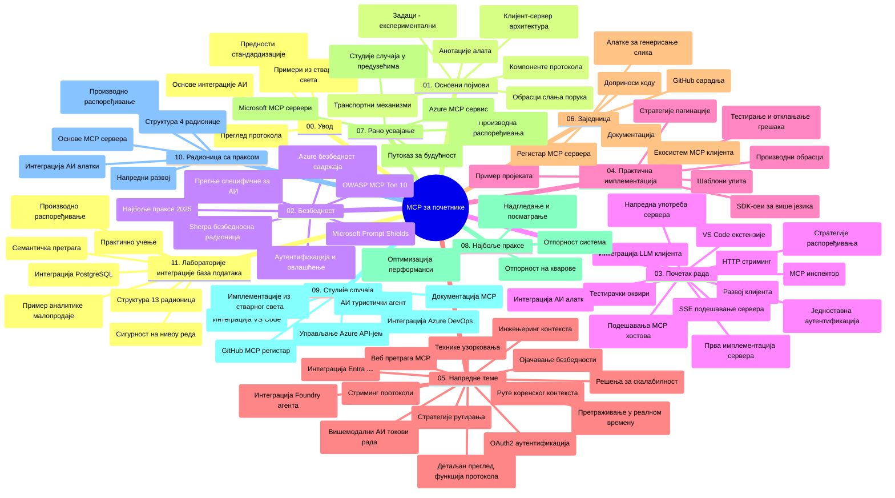

# Протокол Контекста Модела (MCP) за Почетнике - Студијски Водич

Овај студијски водич пружа преглед структуре и садржаја репозиторијума за курс „Протокол Контекста Модела (MCP) за Почетнике“. Користите овај водич за ефикасно сналажење у репозиторијуму и максимално коришћење доступних ресурса.

## Преглед Репозиторијума

Протокол Контекста Модела (MCP) је стандардизовани оквир за интеракције између AI модела и клијент апликација. Првобитно га је креирала компанија Anthropic, а сада MCP одржава шира MCP заједница кроз званичну GitHub организацију. Овај репозиторијум пружа свеобухватну наставну целину са практичним примерима кода у C#, Java, JavaScript, Python и TypeScript, дизајниран за AI програмере, системске архитектe и софтверске инжењере.

## Визуелна Мапа Курикулума

## Структура Репозиторијума

Репозиторијум је организован у једанаест главних секција, од којих се свака фокусира на различите аспекте MCP:

1. **Увод (00-Introduction/)**
   - Преглед Протокола Контекста Модела
   - Зашто је стандардизација важна у AI пипелинима
   - Практичне примене и бенефити

2. **Основни Концепти (01-CoreConcepts/)**
   - Клијент-сервер архитектура
   - Кључне компоненте протокола
   - Обрасци слања порука у MCP

3. **Безбедност (02-Security/)**
   - Безбедносне претње у системима заснованим на MCP
   - Најбоље праксе за обезбеђење имплементација
   - Стратегије аутентификације и ауторизације
   - **Свеобухватна Безбедносна Документација**:
     - Најбоље MCP Безбедносне Праксе 2025
     - Водич за имплементацију Azure Content Safety-а
     - MCP Безбедносне Контроле и Технике
     - Брзи Преглед MCP Најбољих Пракси
   - **Кључне Безбедносне Теме**:
     - Напади убризгавања промпта и отровања алата
     - Отимање сесије и проблем „confused deputy“
     - Ранљивости проласка токена
     - Претерана права и контролa приступа
     - Безбедност ланца снабдевања AI компоненти
     - Интеграција Microsoft Prompt Shields-а

4. **Започињање (03-GettingStarted/)**
   - Подешавање и конфигурација окружења
   - Креирање основних MCP сервера и клијената
   - Интеграција са постојећим апликацијама
   - Обухвата делове за:
     - Прву имплементацију сервера
     - Развој клијента
     - Интеграцију LLM клијента
     - Интеграцију у VS Code
     - SSE сервер (Server-Sent Events)
     - Напредну употребу сервера
     - HTTP стримовање
     - Интеграцију AI Toolkit-а
     - Стратегије тестирања
     - Упутства за деплојмент

5. **Практична Имплементација (04-PracticalImplementation/)**
   - Коришћење SDK-ова у различитим програмским језицима
   - Технике дебаговања, тестирања и валидације
   - Израда поново употребљивих шаблона промпта и токова рада
   - Пример пројеката са имплементационим примерима

6. **Напредне Теме (05-AdvancedTopics/)**
   - Технике контекст инжењеринга
   - Интеграција Foundry агената
   - Мултимодални AI токови рада
   - Демо аутентификације OAuth2
   - Претрага у реалном времену
   - Стримовање у реалном времену
   - Имплементација коренских контекста
   - Стратегије рутирања
   - Технике узорковања
   - Приступи скалирању
   - Безбедносни аспекти
   - Интеграција Entra ID безбедности
   - Интеграција веб претраге

7. **Заједнички Доприноси (06-CommunityContributions/)**
   - Како допринети коду и документацији
   - Сарадња преко GitHub-а
   - Побољшања и повратне информације вођене заједницом
   - Коришћење различитих MCP клијената (Claude Desktop, Cline, VSCode)
   - Рад са популарним MCP серверима укључујући генерисање слика

8. **Упутства из Ране Употребе (07-LessonsfromEarlyAdoption/)**
   - Имплементације из стварног света и успешне приче
   - Изградња и деплој MCP базираних решења
   - Трендови и будућа мапа пута
   - **Vодич за Microsoft MCP Сервере**: Комплетан водич за 10 продукцијски спремних Microsoft MCP сервера укључујући:
     - Microsoft Learn Docs MCP Server
     - Azure MCP Server (више од 15 специјализованих конектора)
     - GitHub MCP Server
     - Azure DevOps MCP Server
     - MarkItDown MCP Server
     - SQL Server MCP Server
     - Playwright MCP Server
     - Dev Box MCP Server
     - Azure AI Foundry MCP Server
     - Microsoft 365 Agents Toolkit MCP Server

9. **Најбоље Праксе (08-BestPractices/)**
   - Постављање перформанси и оптимизација
   - Дизајн поузданих MCP система
   - Стратегије тестирања и отпорности

10. **Студије Случаја (09-CaseStudy/)**
    - **Седам свеобухватних студија случаја** које показују флексибилност MCP у различитим сценаријима:
    - **Azure AI Travel Agents**: Оркестрација више агената са Azure OpenAI и AI Search
    - **Azure DevOps Интеграција**: Аутоматизација радних токова ажурирањем YouTube података
    - **Претраживање Документације у Реалном Времену**: Python конзолни клијент са HTTP стримовањем
    - **Интерактивни Генератор Плана Ученија**: Chainlit веб апликација са конверзационим AI-ом
    - **Документација у Уреднику**: Интеграција у VS Code са GitHub Copilot токовима рада
    - **Azure API Management**: Интеграција корпоративних API-ja са креирањем MCP сервера
    - **GitHub MCP Регистар**: Платформа за развој екосистема и агенцијску интеграцију
    - Примери имплементација који обухватају интеграцију у предузећа, продуктивност програмера и развој екосистема

11. **Практичне Радионице (10-StreamliningAIWorkflowsBuildingAnMCPServerWithAIToolkit/)**
    - Свеобухватна практична радионица која комбинује MCP са AI Toolkit-ом
    - Изградња интелигентних апликација које повезују AI моделе са стварним алатима
    - Практични модули који покривају основе, развој прилагођених сервера и стратегије продукцијског деплојмента
    - **Структура Лабораторија**:
      - Лабораторија 1: Основи MCP сервера
      - Лабораторија 2: Напредни развој MCP сервера
      - Лабораторија 3: Интеграција AI Toolkit-а
      - Лабораторија 4: Продукцијски деплојмент и скалирање
    - Приступ учењу заснован на лабораторијама са корак-по-корак упутствима

12. **MCP Сервер Интеграција Лабораторије Базе Података (11-MCPServerHandsOnLabs/)**
    - **Свеобухватних 13 лабораторија** за изградњу продукцијски спремних MCP сервера са PostgreSQL интеграцијом
    - **Имплементација реалног продајног аналитичког случаја коришћењем Zava Retail**
    - **Патерни корпоративног нивоа** укључујући РЛС (Row Level Security), семантичку претрагу и приступ више корисника подацима
    - **Комплетна Структура Лабораторија**:
      - **Лабораторије 00-03: Основа** - Увод, Архитектура, Безбедност, Подешавање окружења
      - **Лабораторије 04-06: Изградња MCP Серверa** - Дизајн базе, Имплементација MCP сервера, Развој алата
      - **Лабораторије 07-09: Напредне Функције** - Семантичка претрага, Тестирање и дебаговање, Интеграција у VS Code
      - **Лабораторије 10-12: Продукција и Најбоље Праксе** - Деплојмент, Надгледање, Оптимизација
    - **Обухваћене Технологије**: FastMCP фрејмворк, PostgreSQL, Azure OpenAI, Azure Container Apps, Application Insights
    - **Резултати Учeња**: Продукцијски спремни MCP сервери, патерни интеграције базе података, AI подржана аналитика, корпоративна безбедност

## Додатни Ресурси

Репозиторијум укључује пратеће ресурсе:

- **Фолдер слика**: Садржи дијаграме и илустрације коришћене кроз цео курс
- **Преводи**: Подршка више језика са аутоматизованим преводима документације
- **Званични MCP Ресурси**:
  - [MCP Документација](https://modelcontextprotocol.io/)
  - [MCP Спецификација](https://spec.modelcontextprotocol.io/)
  - [MCP GitHub Репозиторијум](https://github.com/modelcontextprotocol)

## Како Користити Овај Репозиторијум

1. **Секвенцијално Учење**: Пратите поглавља по редоследу (од 00 до 11) ради структурираног учења.
2. **Фокус на Језик**: Ако вас занима одређени програмски језик, истражите директоријуме са примерима за имплементације на језику по вашем избору.
3. **Практична Имплементација**: Започните са одељком „Започињање“ да подесите окружење и направите свој први MCP сервер и клијента.
4. **Напредно Истраживање**: Када савладате основе, пређите на напредне теме да проширите своје знање.
5. **Учествовање у Заједници**: Придружите се MCP заједници кроз GitHub дискусије и Discord канале да се повежете са стручњацима и другим програмерима.

## MCP Клијенти и Алати

Курс покрива различите MCP клијенте и алате:

1. **Званични Клијенти**:
   - Visual Studio Code
   - MCP у Visual Studio Code-у
   - Claude Desktop
   - Claude у VSCode-у
   - Claude API

2. **Заједнички Клијенти**:
   - Cline (терминалски базиран)
   - Cursor (уређивач кода)
   - ChatMCP
   - Windsurf

3. **Алатке за Управљање MCP-ом**:
   - MCP CLI
   - MCP Manager
   - MCP Linker
   - MCP Router

## Популарни MCP Сервери

Репозиторијум представља различите MCP сервере, укључујући:

1. **Званични Microsoft MCP Сервери**:
   - Microsoft Learn Docs MCP Server
   - Azure MCP Server (15+ специјализованих конектора)
   - GitHub MCP Server
   - Azure DevOps MCP Server
   - MarkItDown MCP Server
   - SQL Server MCP Server
   - Playwright MCP Server
   - Dev Box MCP Server
   - Azure AI Foundry MCP Server
   - Microsoft 365 Agents Toolkit MCP Server

2. **Званични Референтни Сервери**:
   - Filesystem
   - Fetch
   - Memory
   - Sequential Thinking

3. **Генерисање Слика**:
   - Azure OpenAI DALL-E 3
   - Stable Diffusion WebUI
   - Replicate

4. **Алати за Развој**:
   - Git MCP
   - Terminal Control
   - Code Assistant

5. **Специјализовани Сервери**:
   - Salesforce
   - Microsoft Teams
   - Jira & Confluence

## Допринос

Овај репозиторијум поздравља доприносе из заједнице. Погледајте одељак Заједнички Доприноси за смернице како ефективно допринети MCP екосистему.

----

*Овај студијски водич је последњи пут ажуриран 5. фебруара 2026. године, одражавајући најновију MCP Спецификацију 2025-11-25 и пружа преглед садржаја репозиторијума до тог датума. Садржај репозиторијума може бити ажуриран након тог датума.*

---

<!-- CO-OP TRANSLATOR DISCLAIMER START -->
**Изјава о одрицању одговорности**:
Овај документ је преведен коришћењем AI преводилачке услуге [Co-op Translator](https://github.com/Azure/co-op-translator). Иако тежимо прецизности, имајте на уму да аутоматизовани преводи могу садржати грешке или нетачности. Оригинални документ на његовом изворном језику треба сматрати ауторитетом. За критичне информације препоручује се професионалан људски превод. Не сносимо одговорност за било каква неспоразума или погрешне тумачења настала коришћењем овог превода.
<!-- CO-OP TRANSLATOR DISCLAIMER END -->