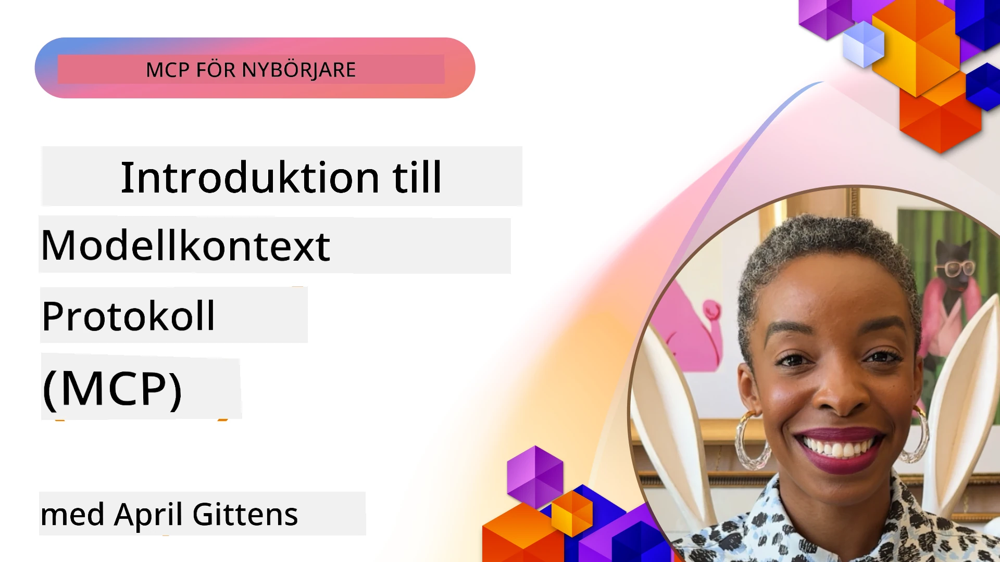
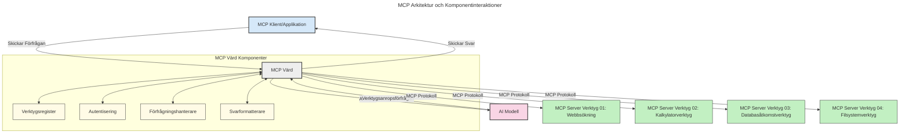

# Introduktion till Model Context Protocol (MCP): Varför det är viktigt för skalbara AI-applikationer

[](https://youtu.be/agBbdiOPLQA)

_(Klicka på bilden ovan för att se videon av denna lektion)_

Generativa AI-applikationer är ett stort framsteg eftersom de ofta låter användaren interagera med appen med hjälp av naturliga språk-promptar. Men när mer tid och resurser investeras i sådana appar vill du se till att du enkelt kan integrera funktioner och resurser på ett sätt som är lätt att utöka, att din app kan hantera mer än en modell som används och hantera olika modellkomplexiteter. Kort sagt, att bygga Gen AI-appar är lätt i början, men när de växer och blir mer komplexa behöver du börja definiera en arkitektur och kommer sannolikt behöva förlita dig på en standard för att säkerställa att dina appar byggs på ett konsekvent sätt. Här kommer MCP in för att organisera saker och ge en standard.

---

## **🔍 Vad är Model Context Protocol (MCP)?**

**Model Context Protocol (MCP)** är ett **öppet, standardiserat gränssnitt** som tillåter stora språkmodeller (LLMs) att sömlöst interagera med externa verktyg, API:er och datakällor. Det tillhandahåller en konsekvent arkitektur för att förbättra AI-modellers funktionalitet bortom deras träningsdata, vilket möjliggör smartare, skalbara och mer responsiva AI-system.

---

## **🎯 Varför standardisering inom AI är viktigt**

När generativa AI-applikationer blir mer komplexa är det viktigt att anta standarder som säkerställer **skalbarhet, utbyggbarhet, underhållbarhet** och **undviker leverantörslåsning**. MCP tar itu med dessa behov genom att:

- Enhetliggöra modell-verktygsintegrationer
- Minska bräckliga, enstaka anpassade lösningar
- Tillåta flera modeller från olika leverantörer att samexistera inom ett ekosystem

**Notera:** Även om MCP presenterar sig som en öppen standard finns det inga planer på att standardisera MCP genom några befintliga standardiseringsorgan som IEEE, IETF, W3C, ISO eller något annat standardorgan.

---

## **📚 Lärandemål**

I slutet av denna artikel kommer du att kunna:

- Definiera **Model Context Protocol (MCP)** och dess användningsområden
- Förstå hur MCP standardiserar kommunikation mellan modell och verktyg
- Identifiera kärnkomponenterna i MCP-arkitekturen
- Utforska verkliga tillämpningar av MCP inom företag och utvecklingssammanhang

---

## **💡 Varför Model Context Protocol (MCP) är en spelväxlare**

### **🔗 MCP löser fragmenteringen i AI-interaktioner**

Före MCP krävde integration av modeller med verktyg:

- Anpassad kod för varje verktygs-modellpar
- Icke-standardiserade API:er för varje leverantör
- Frekventa avbrott på grund av uppdateringar
- Dålig skalbarhet med fler verktyg

### **✅ Fördelar med MCP-standardisering**

| **Fördel**              | **Beskrivning**                                                                |
|--------------------------|--------------------------------------------------------------------------------|
| Interoperabilitet        | LLM:er fungerar sömlöst med verktyg från olika leverantörer                   |
| Konsekvens               | Enhetligt beteende över plattformar och verktyg                               |
| Återanvändbarhet         | Verktyg som byggs en gång kan användas över projekt och system                |
| Acceleration av utveckling | Minska utvecklingstid med standardiserade, plug-and-play-gränssnitt         |

---

## **🧱 Översikt över MCP:s hög-nivå arkitektur**

MCP följer en **klient-server-modell**, där:

- **MCP Hosts** kör AI-modellerna
- **MCP Clients** initierar förfrågningar
- **MCP Servers** tillhandahåller kontext, verktyg och kapabiliteter

### **Nyckelkomponenter:**

- **Resurser** – Statisk eller dynamisk data för modeller  
- **Promptar** – Fördefinierade arbetsflöden för guidad generering  
- **Verktyg** – Exekverbara funktioner som sökning, beräkningar  
- **Sampling** – Agentiskt beteende via rekursiva interaktioner  
- **Elicitering** – Serverinitierade förfrågningar för användarinmatning  
- **Roots** – Filssystemgränser för serveråtkomstkontroll

### **Protokollarkitektur:**

MCP använder en tvålagerarkitektur:
- **Datalager**: Kommunikation baserad på JSON-RPC 2.0 med livscykelhantering och primitiva operationer
- **Transportlager**: STDIO (lokalt) och strömningsbar HTTP med SSE (fjärran) kommunikationskanaler

---

## Hur MCP-servrar fungerar

MCP-servrar fungerar på följande sätt:

- **Förfrågningsflöde**:
    1. En förfrågan initieras av en slutanvändare eller mjukvara som agerar på dennes vägnar.
    2. **MCP Client** skickar förfrågan till en **MCP Host**, som hanterar AI-modellens körning.
    3. **AI-modellen** tar emot användarens prompt och kan begära tillgång till externa verktyg eller data genom en eller flera verktygsanrop.
    4. **MCP Host**, inte modellen direkt, kommunicerar med lämpliga **MCP Server(s)** med hjälp av det standardiserade protokollet.
- **MCP Host-funktionalitet**:
    - **Verktygsregister**: Underhåller en katalog över tillgängliga verktyg och deras kapabiliteter.
    - **Autentisering**: Verifierar behörigheter för verktygsåtkomst.
    - **Förfrågningshanterare**: Bearbetar inkommande verktygsförfrågningar från modellen.
    - **Svarformatskapare**: Strukturerar verktygsutdata i ett format som modellen kan förstå.
- **MCP Server-exekvering**:
    - **MCP Host** dirigerar verktygsanrop till en eller flera **MCP Servrar**, som var och en exponerar specialiserade funktioner (t.ex. sökning, beräkningar, databasfrågor).
    - **MCP Servrar** utför sina respektive operationer och returnerar resultat till **MCP Host** i ett konsekvent format.
    - **MCP Host** formaterar och vidarebefordrar dessa resultat till **AI-modellen**.
- **Slutförande av svar**:
    - **AI-modellen** införlivar verktygsutdata i ett slutgiltigt svar.
    - **MCP Host** skickar detta svar tillbaka till **MCP Client**, som levererar det till slutanvändaren eller anropande mjukvara.
    


## 👨‍💻 Hur man bygger en MCP-server (med exempel)

MCP-servrar låter dig utöka LLM-kapaciteter genom att tillhandahålla data och funktionalitet. 

Redo att prova? Här är språk- och/eller stack-specifika SDK:er med exempel på hur man skapar enkla MCP-servrar i olika språk/stacks:

- **Python SDK**: https://github.com/modelcontextprotocol/python-sdk

- **TypeScript SDK**: https://github.com/modelcontextprotocol/typescript-sdk

- **Java SDK**: https://github.com/modelcontextprotocol/java-sdk

- **C#/.NET SDK**: https://github.com/modelcontextprotocol/csharp-sdk


## 🌍 Verkliga användningsfall för MCP

MCP möjliggör ett brett utbud av applikationer genom att utöka AI:s kapacitet:

| **Användning**               | **Beskrivning**                                                            |
|------------------------------|----------------------------------------------------------------------------|
| Företagsdataintegration      | Koppla LLM:er till databaser, CRM:er eller interna verktyg                 |
| Agentiska AI-system          | Möjliggör autonoma agenter med verktygsåtkomst och beslutsarbetsflöden    |
| Multimodala applikationer    | Kombinera text-, bild- och ljudverktyg inom en enda enhetlig AI-app        |
| Realtidsdataintegration      | Ta in levande data i AI-interaktioner för mer exakta, aktuella svar       |


### 🧠 MCP = Universell standard för AI-interaktioner

Model Context Protocol (MCP) fungerar som en universell standard för AI-interaktioner, ungefär som USB-C standardiserade fysiska anslutningar för enheter. Inom AI-världen ger MCP ett konsekvent gränssnitt som tillåter modeller (klienter) att sömlöst integreras med externa verktyg och dataleverantörer (servrar). Detta eliminerar behovet av olika, anpassade protokoll för varje API eller datakälla.

Under MCP följer ett MCP-kompatibelt verktyg (kallat MCP-server) en enhetlig standard. Dessa servrar kan lista de verktyg eller åtgärder de erbjuder och utföra dessa åtgärder när de begärs av en AI-agent. AI-agentplattformar som stöder MCP kan upptäcka tillgängliga verktyg från servrarna och anropa dem genom detta standardiserade protokoll.

### 💡 Underlättar tillgång till kunskap

Utöver att erbjuda verktyg underlättar MCP även tillgång till kunskap. Det möjliggör att applikationer kan ge kontext till stora språkmodeller (LLMs) genom att koppla dem till olika datakällor. Till exempel kan en MCP-server representera ett företags dokumentarkiv, vilket gör det möjligt för agenter att på begäran hämta relevant information. En annan server kan hantera specifika åtgärder som att skicka e-post eller uppdatera register. Ur agentens perspektiv är dessa helt enkelt verktyg den kan använda — vissa verktyg returnerar data (kunskapskontext), medan andra utför åtgärder. MCP hanterar effektivt båda.

En agent som ansluter till en MCP-server lär sig automatiskt serverns tillgängliga kapabiliteter och tillgängliga data genom ett standardformat. Denna standardisering möjliggör dynamisk verktygstillgänglighet. Till exempel gör tillägg av en ny MCP-server till en agents system dess funktioner omedelbart användbara utan att kräva ytterligare anpassning av agentens instruktioner.

Denna strömlinjeformade integration stämmer överens med flödet som visas i följande diagram, där servrar tillhandahåller både verktyg och kunskap, vilket säkerställer sömlöst samarbete mellan system. 

### 👉 Exempel: Skalbar agentlösning

```mermaid
---
title: Skalbar agentlösning med MCP
description: Ett diagram som illustrerar hur en användare interagerar med en LLM som ansluter till flera MCP-servrar, där varje server tillhandahåller både kunskap och verktyg, vilket skapar en skalbar AI-systemarkitektur
---
graph TD
    User -->|Fråga| LLM
    LLM -->|Svar| User
    LLM -->|MCP| ServerA
    LLM -->|MCP| ServerB
    ServerA -->|Universell koppling| ServerB
    ServerA --> KunskapA
    ServerA --> VerktygA
    ServerB --> KunskapB
    ServerB --> VerktygB

    subgraph Server A
        KunskapA[Kunskap]
        VerktygA[Verktyg]
    end

    subgraph Server B
        KunskapB[Kunskap]
        VerktygB[Verktyg]
    end
```Den universella kopplaren gör det möjligt för MCP-servrar att kommunicera och dela kapabiliteter med varandra, vilket tillåter ServerA att delegera uppgifter till ServerB eller få tillgång till dess verktyg och kunskap. Detta federerar verktyg och data över servrar, vilket stödjer skalbara och modulära agentarkitekturer. Eftersom MCP standardiserar exponering av verktyg kan agenter dynamiskt upptäcka och dirigera förfrågningar mellan servrar utan hårdkodade integrationer.


Federering av verktyg och kunskap: Verktyg och data kan nås över servrar, vilket möjliggör mer skalbara och modulära agentiska arkitekturer.

### 🔄 Avancerade MCP-scenarier med klientintegrerad LLM

Utöver den grundläggande MCP-arkitekturen finns avancerade scenarier där både klient och server innehåller LLM:er, vilket möjliggör mer sofistikerade interaktioner. I följande diagram kan **Client App** vara en IDE med ett antal MCP-verktyg tillgängliga för användning av LLM:

```mermaid
---
title: Avancerade MCP-scenarier med klient-server LLM-integration
description: Ett sekvensdiagram som visar den detaljerade interaktionsflödet mellan användare, klientapplikation, klient LLM, flera MCP-servrar och server LLM, som illustrerar verktygsupptäckt, användarinteraktion, direkt verktygsanrop och förhandlingsfaser för funktioner
---
sequenceDiagram
    autonumber
    actor User as 👤 Användare
    participant ClientApp as 🖥️ Klientapp
    participant ClientLLM as 🧠 Klient LLM
    participant Server1 as 🔧 MCP-server 1
    participant Server2 as 📚 MCP-server 2
    participant ServerLLM as 🤖 Server LLM
    
    %% Discovery Phase
    rect rgb(220, 240, 255)
        Note over ClientApp, Server2: VERKTYGSUPPTÄCKTSFAS
        ClientApp->>+Server1: Begär tillgängliga verktyg/resurser
        Server1-->>-ClientApp: Returnera verktygslista (JSON)
        ClientApp->>+Server2: Begär tillgängliga verktyg/resurser
        Server2-->>-ClientApp: Returnera verktygslista (JSON)
        Note right of ClientApp: Spara kombinerad verktygskatalog<br/>lokalt
    end
    
    %% User Interaction
    rect rgb(255, 240, 220)
        Note over User, ClientLLM: ANVÄNDARINTERAKTIONSFAS
        User->>+ClientApp: Ange prompt på naturligt språk
        ClientApp->>+ClientLLM: Vidarebefordra prompt + verktygskatalog
        ClientLLM->>-ClientLLM: Analysera prompt & välj verktyg
    end
    
    %% Scenario A: Direct Tool Calling
    alt Direkt verktygsanrop
        rect rgb(220, 255, 220)
            Note over ClientApp, Server1: SCENARIO A: DIREKT VERKTYGSANROP
            ClientLLM->>+ClientApp: Begär verktygsexekvering
            ClientApp->>+Server1: Kör specifikt verktyg
            Server1-->>-ClientApp: Returnera resultat
            ClientApp->>+ClientLLM: Bearbeta resultat
            ClientLLM-->>-ClientApp: Generera svar
            ClientApp-->>-User: Visa slutligt svar
        end
    
    %% Scenario B: Feature Negotiation (VS Code style)
    else Förhandling av funktioner (VS Code-stil)
        rect rgb(255, 220, 220)
            Note over ClientApp, ServerLLM: SCENARIO B: FÖRHANDLING AV FUNKTIONER
            ClientLLM->>+ClientApp: Identifiera behövda funktioner
            ClientApp->>+Server2: Förhandla funktioner/möjligheter
            Server2->>+ServerLLM: Begär ytterligare kontext
            ServerLLM-->>-Server2: Ge kontext
            Server2-->>-ClientApp: Returnera tillgängliga funktioner
            ClientApp->>+Server2: Anropa förhandlade verktyg
            Server2-->>-ClientApp: Returnera resultat
            ClientApp->>+ClientLLM: Bearbeta resultat
            ClientLLM-->>-ClientApp: Generera svar
            ClientApp-->>-User: Visa slutligt svar
        end
    end
```
## 🔐 Praktiska fördelar med MCP

Här är de praktiska fördelarna med att använda MCP:

- **Färskhet**: Modeller kan få tillgång till aktuell information bortom deras träningsdata
- **Kapabilitetsutökning**: Modeller kan dra nytta av specialiserade verktyg för uppgifter de inte tränats för
- **Minskade hallucinationer**: Externa datakällor ger faktabaserad grund
- **Sekretess**: Känslig data kan stanna inom säkra miljöer istället för att bäddas in i promptar

## 📌 Viktiga insikter

Följande är viktiga insikter för att använda MCP:

- **MCP** standardiserar hur AI-modeller interagerar med verktyg och data
- Främjar **utbyggbarhet, konsekvens och interoperabilitet**
- MCP hjälper till att **minska utvecklingstid, förbättra tillförlitlighet och utöka modellers kapabiliteter**
- Klient-server-arkitekturen **möjliggör flexibla, utbyggbara AI-applikationer**

## 🧠 Övning

Tänk på en AI-applikation du är intresserad av att bygga.

- Vilka **externa verktyg eller data** kan förbättra dess funktioner?
- Hur kan MCP göra integrationen **enklare och mer pålitlig?**

## Ytterligare resurser

- [MCP GitHub Repository](https://github.com/modelcontextprotocol)


## Vad händer härnäst

Nästa: [Kapitel 1: Kärnkoncept](../01-CoreConcepts/README.md)

---

<!-- CO-OP TRANSLATOR DISCLAIMER START -->
**Ansvarsfriskrivning**:
Detta dokument har översatts med hjälp av AI-översättningstjänsten [Co-op Translator](https://github.com/Azure/co-op-translator). Även om vi strävar efter noggrannhet, vänligen notera att automatiska översättningar kan innehålla fel eller brister. Det ursprungliga dokumentet på dess originalspråk ska betraktas som den auktoritativa källan. För kritisk information rekommenderas professionell mänsklig översättning. Vi ansvarar inte för eventuella missförstånd eller feltolkningar som uppstår vid användning av denna översättning.
<!-- CO-OP TRANSLATOR DISCLAIMER END -->