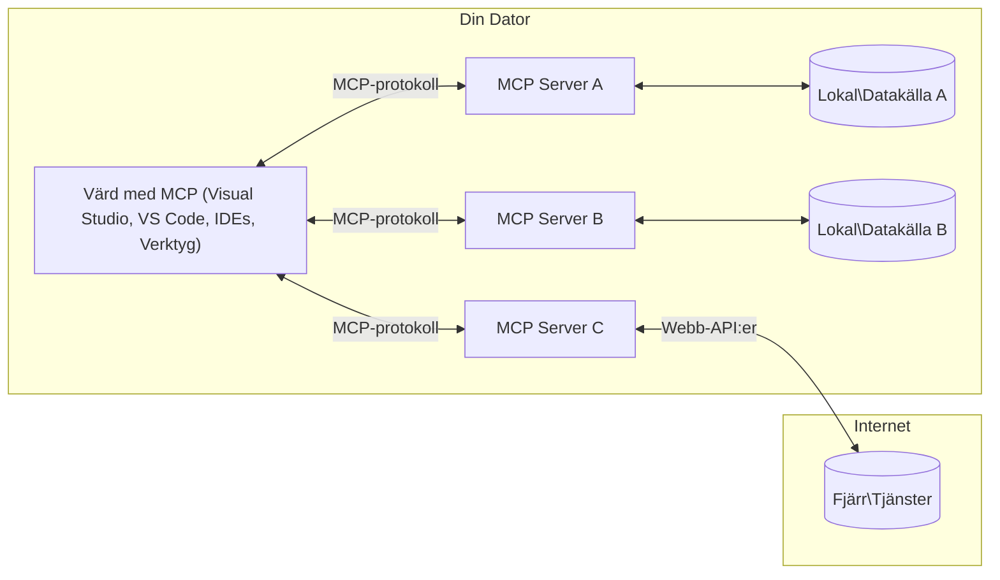

# MCP Core Concepts: Mästra Model Context Protocol för AI-integration

[](https://youtu.be/earDzWGtE84)

_(Klicka på bilden ovan för att se videon av denna lektion)_

[Model Context Protocol (MCP)](https://github.com/modelcontextprotocol) är ett kraftfullt, standardiserat ramverk som optimerar kommunikationen mellan stora språkmodeller (LLM) och externa verktyg, applikationer och datakällor.  
Denna guide tar dig igenom de grundläggande koncepten i MCP. Du kommer att lära dig om dess klient-serverarkitektur, viktiga komponenter, kommunikationsmekanismer och bästa praxis för implementering.

- **Explicit användarsamtycke**: All dataåtkomst och alla operationer kräver uttryckligt användarens godkännande innan de utförs. Användare måste tydligt förstå vilken data som kommer att nås och vilka åtgärder som kommer att genomföras, med detaljerad kontroll över behörigheter och auktorisationer.

- **Skydd av dataintegritet**: Användardata exponeras endast med uttryckligt samtycke och måste skyddas av robusta åtkomstkontroller under hela interaktionslivscykeln. Implementationer måste förhindra obehörig dataöverföring och bibehålla strikt sekretess.

- **Säker verktygsexekvering**: Varje verktygsanrop kräver uttryckligt användarsamtycke med klar förståelse av verktygets funktionalitet, parametrar och potentiell påverkan. Robusta säkerhetsgränser måste förhindra oavsiktlig, osäker eller illvillig verktygsexekvering.

- **Transportlagersäkerhet**: Alla kommunikationskanaler ska använda lämplig kryptering och autentiseringsmekanismer. Fjärranslutningar ska implementera säkra transportprotokoll och korrekt hantering av autentiseringsuppgifter.

#### Implementationsriktlinjer:

- **Behörighetshantering**: Implementera finskiktade behörighetssystem som låter användare kontrollera vilka servrar, verktyg och resurser som är tillgängliga  
- **Autentisering & Auktorisation**: Använd säkra autentiseringsmetoder (OAuth, API-nycklar) med korrekt tokenhantering och utgång  
- **Inmatningsvalidering**: Validera alla parametrar och datainmatningar enligt definierade scheman för att undvika injektionsattacker  
- **Revisionsloggning**: Behåll omfattande loggar över alla operationer för säkerhetsövervakning och efterlevnad

## Översikt

Denna lektion utforskar den grundläggande arkitekturen och komponenterna som utgör Model Context Protocol (MCP) ekosystemet. Du lär dig om klient-serverarkitekturen, nyckelkomponenter och kommunikationsmekanismer som driver MCP-interaktioner.

## Viktiga mål

I slutet av denna lektion kommer du att:

- Förstå MCP:s klient-serverarkitektur.  
- Identifiera roller och ansvar för Hosts, Clients och Servers.  
- Analysera kärnfunktioner som gör MCP till ett flexibelt integrationslager.  
- Lära dig hur information flödar inom MCP-ekosystemet.  
- Få praktiska insikter genom kodexempel i .NET, Java, Python, och JavaScript.

## MCP-arkitektur: En djupare titt

MCP-ekosystemet bygger på en klient-servermodell. Denna modulära struktur gör det möjligt för AI-applikationer att effektivt interagera med verktyg, databaser, API:er och kontextuella resurser. Låt oss bryta ned denna arkitektur i dess kärnkomponenter.

I sin kärna följer MCP en klient-serverarkitektur där en värdapplikation kan ansluta till flera servrar:


- **MCP Hosts**: Program som VSCode, Claude Desktop, IDEs eller AI-verktyg som vill få åtkomst till data via MCP  
- **MCP Clients**: Protokollklienter som upprätthåller 1:1-anslutningar med servrar  
- **MCP Servers**: Lättviktiga program som var och en exponerar specifika funktioner genom det standardiserade Model Context Protocol  
- **Lokala datakällor**: Din dators filer, databaser och tjänster som MCP-servrar kan nå på ett säkert sätt  
- **Fjärrtjänster**: Externa system tillgängliga via internet som MCP-servrar kan ansluta till via API:er

MCP-protokollet är en utvecklande standard med datum-baserad versionshantering (YYYY-MM-DD-format). Den aktuella protokollversionen är **2025-11-25**. Du kan se senaste uppdateringarna i [protokollspecificeringen](https://modelcontextprotocol.io/specification/2025-11-25/).

### 1. Hosts

I Model Context Protocol (MCP) är **Hosts** AI-applikationer som fungerar som huvudsakligt gränssnitt där användare interagerar med protokollet. Hosts koordinerar och hanterar anslutningar till flera MCP-servrar genom att skapa dedikerade MCP-klienter för varje serveranslutning. Exempel på Hosts är:

- **AI-applikationer**: Claude Desktop, Visual Studio Code, Claude Code  
- **Utvecklingsmiljöer**: IDEs och kodredigerare med MCP-integration  
- **Anpassade applikationer**: Specialbyggda AI-agenter och verktyg

**Hosts** är applikationer som samordnar AI-modellinteraktioner. De:

- **Orkestrerar AI-modeller**: Kör eller interagerar med LLM för att generera svar och samordna AI-arbetsflöden  
- **Hantera klientanslutningar**: Skapar och underhåller en MCP-klient per MCP-serveranslutning  
- **Kontrollerar användargränssnitt**: Hanterar samtalsflöde, användarinteraktioner och presentationslogik  
- **Genomdriver säkerhet**: Kontrollerar behörigheter, säkerhetsbegränsningar och autentisering  
- **Hantera användarsamtycke**: Sköter användargodkännande för datadelning och verktygsexekvering

### 2. Clients

**Clients** är centrala komponenter som upprätthåller dedikerade en-till-en-anslutningar mellan Hosts och MCP-servrar. Varje MCP-klient skapas av Host för att ansluta till en specifik MCP-server, vilket säkerställer organiserade och säkra kommunikationskanaler. Flera klienter möjliggör för Hosts att ansluta till flera servrar samtidigt.

**Clients** är anslutarkomponenter inom värdapplikationen. De:

- **Protokollkommunikation**: Skickar JSON-RPC 2.0-förfrågningar till servrar med promptar och instruktioner  
- **Funktionalitetsförhandling**: Förhandlar vilka funktioner och protokollversioner som stöds med servrar vid initiering  
- **Verktygsexekvering**: Hanterar verktygsanropsförfrågningar från modeller och bearbetar svar  
- **Real-tidsuppdateringar**: Hanterar notifieringar och realtidsuppdateringar från servrar  
- **Svarshantering**: Bearbetar och formaterar serversvar för att visas för användare

### 3. Servers

**Servers** är program som tillhandahåller kontext, verktyg och funktioner till MCP-klienter. De kan köras lokalt (på samma maskin som Host) eller fjärrstyrt (på externa plattformar) och ansvarar för att hantera klientförfrågningar och leverera strukturerade svar. Servrar exponerar specifik funktionalitet genom det standardiserade Model Context Protocol.

**Servers** är tjänster som tillhandahåller kontext och kapabiliteter. De:

- **Funktionregistrering**: Registrerar och exponerar tillgängliga primitiver (resurser, promptar, verktyg) för klienter  
- **Förfrågningshantering**: Tar emot och exekverar verktygsanrop, resursförfrågningar och promptförfrågningar från klienter  
- **Kontexttillhandahållande**: Levererar kontextuell information och data för att förbättra modelsvar  
- **Statushantering**: Upprätthåller sessionsstatus och hanterar tillståndsberoende interaktioner när det behövs  
- **Real-tidsnotifikationer**: Skickar notifieringar om förändringar och uppdateringar till anslutna klienter

Servrar kan utvecklas av vem som helst för att utöka modellkapabiliteter med specialfunktioner, och de stödjer både lokal och fjärrdistribution.

### 4. Serverprimitiver

Servrar i Model Context Protocol (MCP) tillhandahåller tre kärn**primitiver** som definierar grundläggande byggstenar för rika interaktioner mellan klienter, hosts och språkmodeller. Dessa primitiver specificerar typer av kontextuell information och tillgängliga åtgärder via protokollet.

MCP-servrar kan exponera vilken kombination som helst av följande tre kärnprimitiver:

#### Resurser 

**Resurser** är datakällor som tillhandahåller kontextuell information till AI-applikationer. De representerar statiskt eller dynamiskt innehåll som kan förbättra modellens förståelse och beslutsfattande:

- **Kontextuell data**: Strukturerad information och kontext för AI-modellens konsumtion  
- **Kunskapsbaser**: Dokumentarkiv, artiklar, manualer och forskningsrapporter  
- **Lokala datakällor**: Filer, databaser och lokal systeminformation  
- **Extern data**: API-svar, webb-tjänster och data från fjärrsystem  
- **Dynamiskt innehåll**: Realtidsdata som uppdateras beroende på externa förhållanden

Resurser identifieras med URI:er och stödjer upptäckt genom metoderna `resources/list` och hämtning genom `resources/read`:

```text
file://documents/project-spec.md
database://production/users/schema
api://weather/current
```

#### Prompter

**Prompter** är återanvändbara mallar som hjälper till att strukturera interaktioner med språkmodeller. De tillhandahåller standardiserade interaktionsmönster och mallbaserade arbetsflöden:

- **Mallbaserade interaktioner**: Förstrukturerade meddelanden och samtalsstartare  
- **Arbetsflödesmallar**: Standardiserade sekvenser för vanliga uppgifter och interaktioner  
- **Få-skottsexempel**: Exempelbaserade mallar för modellinstruktioner  
- **Systempromptar**: Grundläggande promptar som definierar modellbeteende och kontext  
- **Dynamiska mallar**: Parametriserade promptar som anpassar sig till specifika kontexter

Prompter stödjer variabelsubstitution och kan upptäckas via `prompts/list` och hämtas med `prompts/get`:

```markdown
Generate a {{task_type}} for {{product}} targeting {{audience}} with the following requirements: {{requirements}}
```

#### Verktyg

**Verktyg** är exekverbara funktioner som AI-modeller kan anropa för att utföra specifika åtgärder. De representerar MCP-ekosystemets "verb" och möjliggör att modeller kan interagera med externa system:

- **Exekverbara funktioner**: Diskreta operationer som modeller kan anropa med specifika parametrar  
- **Integration med externa system**: API-anrop, databasfrågor, filoperationer, beräkningar  
- **Unik identitet**: Varje verktyg har ett distinkt namn, beskrivning och parameterschema  
- **Strukturerad I/O**: Verktyg accepterar validerade parametrar och returnerar strukturerade, typade svar  
- **Åtgärdskapabiliteter**: Möjliggör för modeller att utföra verkliga åtgärder och hämta live-data

Verktyg definieras med JSON Schema för parameter-validering och upptäcks genom `tools/list` och exekveras via `tools/call`. Verktyg kan också inkludera **ikoner** som ytterligare metadata för bättre UI-presentation.

**Verktygsanvisningar**: Verktyg stödjer beteendeannoteringar (t.ex. `readOnlyHint`, `destructiveHint`) som beskriver om ett verktyg är skrivskyddat eller destruktivt, vilket hjälper klienter att fatta välinformerade beslut om verktygsexekvering.

Exempel på verktygsdefinition:

```typescript
server.tool(
  "search_products", 
  {
    query: z.string().describe("Search query for products"),
    category: z.string().optional().describe("Product category filter"),
    max_results: z.number().default(10).describe("Maximum results to return")
  }, 
  async (params) => {
    // Utför sökning och returnera strukturerade resultat
    return await productService.search(params);
  }
);
```

## Klientprimitiver

I Model Context Protocol (MCP) kan **klienter** exponera primitiver som gör det möjligt för servrar att begära ytterligare kapabiliteter från värdapplikationen. Dessa klient-sidiga primitiver möjliggör rikare, mer interaktiva serverimplementationer som kan komma åt AI-modellfunktioner och användarinteraktioner.

### Sampling

**Sampling** låter servrar begära språkmodellkompletteringar från klientens AI-applikation. Denna primitiv gör det möjligt för servrar att komma åt LLM-funktioner utan att bädda in egna modellberoenden:

- **Modelloberoende åtkomst**: Servrar kan begära kompletteringar utan att inkludera LLM-SDK:er eller hantera modellåtkomst  
- **Serverinitierad AI**: Möjliggör att servrar autonomt kan generera innehåll med hjälp av klientens AI-modell  
- **Rekursiva LLM-interaktioner**: Stödjer komplexa scenarier där servrar behöver AI-assistans för bearbetning  
- **Dynamisk innehållsgenerering**: Tillåter servrar att skapa kontextuella svar med värdens modell  
- **Verktygsanropsstöd**: Servrar kan inkludera parametrarna `tools` och `toolChoice` för att låta klientens modell anropa verktyg under sampling

Sampling initieras genom metoden `sampling/complete`, där servrar skickar kompletteringsförfrågningar till klienter.

### Rötter

**Rötter** ger ett standardiserat sätt för klienter att exponera filsystemgränser till servrar, vilket hjälper servrar att förstå vilka kataloger och filer de har åtkomst till:

- **Filsystemgränser**: Definierar gränserna där servrar kan operera inom filsystemet  
- **Åtkomstkontroll**: Hjälper servrar att förstå vilka kataloger och filer de har behörighet att nå  
- **Dynamiska uppdateringar**: Klienter kan notifiera servrar när listan över rötter ändras  
- **URI-baserad identifiering**: Rötter använder `file://`-URI:er för att identifiera åtkomliga kataloger och filer

Rötter upptäcks genom metoden `roots/list`, och klienter skickar `notifications/roots/list_changed` när rötter förändras.

### Elicitation  

**Elicitation** gör det möjligt för servrar att be om ytterligare information eller bekräftelse från användare via klientgränssnittet:

- **Användarinmatningsförfrågningar**: Servrar kan be om mer information när det behövs för verktygsexekvering  
- **Bekräftelsedialoger**: Begär användarens godkännande för känsliga eller ingripande operationer  
- **Interaktiva arbetsflöden**: Tillåter servrar att skapa steg-för-steg användarinteraktioner  
- **Dynamisk parameterinsamling**: Samlar in saknade eller valfria parametrar under verktygsexekvering

Elicitation-förfrågningar görs med metoden `elicitation/request` för att samla in användarinmatning via klientens gränssnitt.

**URL-lägeselicitation**: Servrar kan också begära URL-baserade användarinteraktioner, vilket gör att servrar kan leda användare till externa webbsidor för autentisering, bekräftelse eller dataregistrering.

### Loggning

**Loggning** gör det möjligt för servrar att skicka strukturerade loggmeddelanden till klienter för felsökning, övervakning och operationell insyn:

- **Felsökningsstöd**: Möjliggör för servrar att tillhandahålla detaljerade exekveringsloggar för felsökning  
- **Operationell övervakning**: Skickar statusuppdateringar och prestandamått till klienter  
- **Felrapportering**: Levererar detaljerad felkontext och diagnostisk information  
- **Revisionsspår**: Skapar omfattande loggar över serveroperationer och beslut

Loggmeddelanden skickas till klienter för att ge insyn i serverns operationer och underlätta felsökning.

## Informationsflöde i MCP

Model Context Protocol (MCP) definierar ett strukturerat informationsflöde mellan hosts, clients, servrar och modeller. Att förstå detta flöde hjälper till att klargöra hur användarförfrågningar bearbetas och hur externa verktyg och data integreras i modelsvar.

- **Host initierar anslutning**  
  Värdapplikationen (som en IDE eller chattgränssnitt) etablerar en anslutning till en MCP-server, vanligtvis via STDIO, WebSocket eller ett annat understött transportlager.

- **Funktionalitetsförhandling**  
  Klienten (inbäddad i värden) och servern utbyter information om sina stödda funktioner, verktyg, resurser och protokollversioner. Detta säkerställer att båda sidor förstår vilka kapabiliteter som finns tillgängliga för sessionen.

- **Användarförfrågan**  
  Användaren interagerar med värden (t.ex. matar in en prompt eller kommando). Värden samlar in denna inmatning och skickar den vidare till klienten för bearbetning.

- **Användning av resurser eller verktyg**  
  - Klienten kan begära ytterligare kontext eller resurser från servern (som filer, databasposter eller artiklar från kunskapsbas) för att berika modellens förståelse.  
  - Om modellen avgör att ett verktyg behövs (t.ex. för att hämta data, utföra beräkningar eller anropa API) skickar klienten en verktygsanropsförfrågan till servern, med specificering av verktygets namn och parametrar.

- **Serverexekvering**  

Servern tar emot resurs- eller verktygsbegäran, utför nödvändiga operationer (såsom att köra en funktion, fråga en databas eller hämta en fil) och returnerar resultaten till klienten i ett strukturerat format.

- **Svarsgenerering**  
  Klienten integrerar serverns svar (resursdata, verktygsutgångar etc.) i den pågående modellinteraktionen. Modellen använder denna information för att generera ett omfattande och kontextuellt relevant svar.

- **Resultatpresentation**  
  Värden tar emot det slutliga svaret från klienten och presenterar det för användaren, ofta inklusive både den genererade texten från modellen och eventuella resultat från verktygskörningar eller resursuppslagningar.

Denna flöde möjliggör för MCP att stödja avancerade, interaktiva och kontextmedvetna AI-applikationer genom att sömlöst koppla samman modeller med externa verktyg och datakällor.

## Protokollarkitektur & Lager

MCP består av två distinkta arkitekturlager som samarbetar för att tillhandahålla en komplett kommunikationsram:

### Datalager

**Datalagret** implementerar kärnprotokollet MCP med **JSON-RPC 2.0** som grund. Detta lager definierar meddelandets struktur, semantik och interaktionsmönster:

#### Kärnkomponenter:

- **JSON-RPC 2.0-protokoll**: All kommunikation använder standardiserat JSON-RPC 2.0-meddelandformat för metodanrop, svar och notifieringar  
- **Livscykelhantering**: Hanterar anslutningsinitiering, kapabilitetsförhandling och sessionsavslut mellan klienter och servrar  
- **Serverprimitiver**: Möjliggör att servrar tillhandahåller kärnfunktionalitet via verktyg, resurser och prompts  
- **Klientprimitiver**: Gör det möjligt för servrar att begära sampling från LLM, efterfråga användarinmatning och skicka loggmeddelanden  
- **Notifieringar i realtid**: Stöder asynkrona notifieringar för dynamiska uppdateringar utan polling

#### Nyckelfunktioner:

- **Protokollversionsförhandling**: Använder datum-baserad versionshantering (ÅÅÅÅ-MM-DD) för att säkerställa kompatibilitet  
- **Kapabilitetsupptäckt**: Klienter och servrar utbyter information om stödda funktioner under initiering  
- **Statefulla sessioner**: Upprätthåller anslutningstillstånd över flera interaktioner för kontinuitet i kontext

### Transportlager

**Transportlagret** hanterar kommunikationskanaler, meddelanderamning och autentisering mellan MCP-deltagare:

#### Stödda transportmekanismer:

1. **STDIO-transport**:  
   - Använder standard in-/utströmmar för direkt processkommunikation  
   - Optimalt för lokala processer på samma maskin utan nätverksöverlapp  
   - Vanligt vid lokala MCP-serverimplementeringar  

2. **Streambar HTTP-transport**:  
   - Använder HTTP POST för klient-till-server-meddelanden  
   - Valfri Server-Sent Events (SSE) för server-till-klient-streaming  
   - Möjliggör fjärrserverkommunikation över nätverk  
   - Stöder standard HTTP-autentisering (bearer tokens, API-nycklar, anpassade headers)  
   - MCP rekommenderar OAuth för säker tokenbaserad autentisering  

#### Transportabstraktion:

Transportlagret abstraherar kommunikationsdetaljer från datalagret och möjliggör samma JSON-RPC 2.0 meddelandeformat över alla transportmekanismer. Denna abstraktion låter applikationer sömlöst byta mellan lokala och fjärrservrar.

### Säkerhetsaspekter

MCP-implementationer måste följa flera viktiga säkerhetsprinciper för att säkerställa trygga, betrodda och säkra interaktioner i alla protokolloperationer:

- **Användarsamtycke och kontroll**: Användare måste ge uttryckligt samtycke innan data nås eller operationer utförs. De ska ha tydlig kontroll över vilken data som delas och vilka åtgärder som är auktoriserade, med intuitiva användargränssnitt för granskning och godkännande.

- **Dataskydd**: Användardata bör endast exponeras med uttryckligt samtycke och måste skyddas med lämpliga åtkomstkontroller. MCP-implementationer måste förhindra obehörig datatransmission och säkerställa att integritet upprätthålls under alla interaktioner.

- **Verktygssäkerhet**: Innan ett verktyg anropas krävs uttryckligt användarsamtycke. Användare ska ha klar förståelse för varje verktygs funktionalitet och robusta säkerhetsgränser måste upprätthållas för att förhindra oavsiktlig eller osäker verktygskörning.

Genom att följa dessa säkerhetsprinciper säkerställer MCP användarförtroende, integritet och säkerhet över alla protokollinteraktioner samtidigt som kraftfulla AI-integrationer möjliggörs.

## Kodexempel: Nyckelkomponenter

Nedan visas kodexempel i flera populära programmeringsspråk som illustrerar hur viktiga MCP-serverkomponenter och verktyg kan implementeras.

### .NET-exempel: Skapa en enkel MCP-server med verktyg

Här är ett praktiskt .NET-kodexempel som visar hur man implementerar en enkel MCP-server med anpassade verktyg. Detta exempel demonstrerar hur man definierar och registrerar verktyg, hanterar förfrågningar och kopplar servern med Model Context Protocol.

```csharp
using System;
using System.Threading.Tasks;
using ModelContextProtocol.Server;
using ModelContextProtocol.Server.Transport;
using ModelContextProtocol.Server.Tools;

public class WeatherServer
{
    public static async Task Main(string[] args)
    {
        // Create an MCP server
        var server = new McpServer(
            name: "Weather MCP Server",
            version: "1.0.0"
        );
        
        // Register our custom weather tool
        server.AddTool<string, WeatherData>("weatherTool", 
            description: "Gets current weather for a location",
            execute: async (location) => {
                // Call weather API (simplified)
                var weatherData = await GetWeatherDataAsync(location);
                return weatherData;
            });
        
        // Connect the server using stdio transport
        var transport = new StdioServerTransport();
        await server.ConnectAsync(transport);
        
        Console.WriteLine("Weather MCP Server started");
        
        // Keep the server running until process is terminated
        await Task.Delay(-1);
    }
    
    private static async Task<WeatherData> GetWeatherDataAsync(string location)
    {
        // This would normally call a weather API
        // Simplified for demonstration
        await Task.Delay(100); // Simulate API call
        return new WeatherData { 
            Temperature = 72.5,
            Conditions = "Sunny",
            Location = location
        };
    }
}

public class WeatherData
{
    public double Temperature { get; set; }
    public string Conditions { get; set; }
    public string Location { get; set; }
}
```

### Java-exempel: MCP-serverkomponenter

Detta exempel visar samma MCP-server och verktygsregistrering som .NET-exemplet ovan, men implementerat i Java.

```java
import io.modelcontextprotocol.server.McpServer;
import io.modelcontextprotocol.server.McpToolDefinition;
import io.modelcontextprotocol.server.transport.StdioServerTransport;
import io.modelcontextprotocol.server.tool.ToolExecutionContext;
import io.modelcontextprotocol.server.tool.ToolResponse;

public class WeatherMcpServer {
    public static void main(String[] args) throws Exception {
        // Skapa en MCP-server
        McpServer server = McpServer.builder()
            .name("Weather MCP Server")
            .version("1.0.0")
            .build();
            
        // Registrera ett väderverktyg
        server.registerTool(McpToolDefinition.builder("weatherTool")
            .description("Gets current weather for a location")
            .parameter("location", String.class)
            .execute((ToolExecutionContext ctx) -> {
                String location = ctx.getParameter("location", String.class);
                
                // Hämta väderdata (förenklad)
                WeatherData data = getWeatherData(location);
                
                // Returnera formaterat svar
                return ToolResponse.content(
                    String.format("Temperature: %.1f°F, Conditions: %s, Location: %s", 
                    data.getTemperature(), 
                    data.getConditions(), 
                    data.getLocation())
                );
            })
            .build());
        
        // Anslut servern med stdio-transport
        try (StdioServerTransport transport = new StdioServerTransport()) {
            server.connect(transport);
            System.out.println("Weather MCP Server started");
            // Håll servern igång tills processen avslutas
            Thread.currentThread().join();
        }
    }
    
    private static WeatherData getWeatherData(String location) {
        // Implementering skulle anropa en väder-API
        // Förenklad för exemplet
        return new WeatherData(72.5, "Sunny", location);
    }
}

class WeatherData {
    private double temperature;
    private String conditions;
    private String location;
    
    public WeatherData(double temperature, String conditions, String location) {
        this.temperature = temperature;
        this.conditions = conditions;
        this.location = location;
    }
    
    public double getTemperature() {
        return temperature;
    }
    
    public String getConditions() {
        return conditions;
    }
    
    public String getLocation() {
        return location;
    }
}
```

### Python-exempel: Bygga en MCP-server

Detta exempel använder fastmcp, så se till att installera det först:

```python
pip install fastmcp
```
Kodexempel:

```python
#!/usr/bin/env python3
import asyncio
from fastmcp import FastMCP
from fastmcp.transports.stdio import serve_stdio

# Skapa en FastMCP-server
mcp = FastMCP(
    name="Weather MCP Server",
    version="1.0.0"
)

@mcp.tool()
def get_weather(location: str) -> dict:
    """Gets current weather for a location."""
    return {
        "temperature": 72.5,
        "conditions": "Sunny",
        "location": location
    }

# Alternativ metod som använder en klass
class WeatherTools:
    @mcp.tool()
    def forecast(self, location: str, days: int = 1) -> dict:
        """Gets weather forecast for a location for the specified number of days."""
        return {
            "location": location,
            "forecast": [
                {"day": i+1, "temperature": 70 + i, "conditions": "Partly Cloudy"}
                for i in range(days)
            ]
        }

# Registrera klassverktyg
weather_tools = WeatherTools()

# Starta servern
if __name__ == "__main__":
    asyncio.run(serve_stdio(mcp))
```

### JavaScript-exempel: Skapa en MCP-server

Detta exempel visar MCP-serveruppbyggnad i JavaScript och hur man registrerar två väderrelaterade verktyg.

```javascript
// Använder det officiella Model Context Protocol SDK
import { McpServer } from "@modelcontextprotocol/sdk/server/mcp.js";
import { StdioServerTransport } from "@modelcontextprotocol/sdk/server/stdio.js";
import { z } from "zod"; // För parameterverifiering

// Skapa en MCP-server
const server = new McpServer({
  name: "Weather MCP Server",
  version: "1.0.0"
});

// Definiera ett väderverktyg
server.tool(
  "weatherTool",
  {
    location: z.string().describe("The location to get weather for")
  },
  async ({ location }) => {
    // Detta skulle normalt anropa en väder-API
    // Förenklat för demonstration
    const weatherData = await getWeatherData(location);
    
    return {
      content: [
        { 
          type: "text", 
          text: `Temperature: ${weatherData.temperature}°F, Conditions: ${weatherData.conditions}, Location: ${weatherData.location}` 
        }
      ]
    };
  }
);

// Definiera ett prognosverktyg
server.tool(
  "forecastTool",
  {
    location: z.string(),
    days: z.number().default(3).describe("Number of days for forecast")
  },
  async ({ location, days }) => {
    // Detta skulle normalt anropa en väder-API
    // Förenklat för demonstration
    const forecast = await getForecastData(location, days);
    
    return {
      content: [
        { 
          type: "text", 
          text: `${days}-day forecast for ${location}: ${JSON.stringify(forecast)}` 
        }
      ]
    };
  }
);

// Hjälpfunktioner
async function getWeatherData(location) {
  // Simulera API-anrop
  return {
    temperature: 72.5,
    conditions: "Sunny",
    location: location
  };
}

async function getForecastData(location, days) {
  // Simulera API-anrop
  return Array.from({ length: days }, (_, i) => ({
    day: i + 1,
    temperature: 70 + Math.floor(Math.random() * 10),
    conditions: i % 2 === 0 ? "Sunny" : "Partly Cloudy"
  }));
}

// Anslut servern med stdio-transport
const transport = new StdioServerTransport();
server.connect(transport).catch(console.error);

console.log("Weather MCP Server started");
```

Detta JavaScript-exempel demonstrerar hur man skapar en MCP-klient som ansluter till en server, skickar en prompt och bearbetar svaret inklusive eventuella verktygsanrop som gjorts.

## Säkerhet och auktorisering

MCP inkluderar flera inbyggda koncept och mekanismer för att hantera säkerhet och auktorisation över protokollet:

1. **Verktygstillämpningskontroll**:  
  Klienter kan specificera vilka verktyg en modell får använda under en session. Detta säkerställer att endast uttryckligen auktoriserade verktyg är tillgängliga, vilket minskar risken för oavsiktliga eller osäkra operationer. Behörigheter kan konfigureras dynamiskt baserat på användarpreferenser, organisationspolicyer eller interaktionskontext.

2. **Autentisering**:  
  Servrar kan kräva autentisering innan åtkomst till verktyg, resurser eller känsliga operationer ges. Detta kan involvera API-nycklar, OAuth-token eller andra autentiseringsmetoder. Korrekt autentisering säkerställer att endast betrodda klienter och användare kan anropa serverfunktioner.

3. **Validering**:  
  Parameterkontroll tillämpas på alla verktygsanrop. Varje verktyg definierar förväntade typer, format och begränsningar för sina parametrar, och servern validerar inkommande förfrågningar därefter. Detta förebygger malformed eller illvilliga indata och hjälper till att upprätthålla operationernas integritet.

4. **Begränsning av anrop (rate limiting)**:  
  För att förhindra missbruk och säkerställa rättvis användning av serverresurser kan MCP-servrar implementera begränsningar på verktygsanrop och resursåtkomst. Gränser kan tillämpas per användare, session eller globalt, och skyddar mot denial-of-service-attacker eller överdriven resursanvändning.

Genom att kombinera dessa mekanismer tillhandahåller MCP en säker grund för integration av språkmodeller med externa verktyg och datakällor, samtidigt som användare och utvecklare får finjusterad kontroll över åtkomst och användning.

## Protokollmeddelanden & Kommunikationsflöde

MCP-kommunikation använder strukturerade **JSON-RPC 2.0**-meddelanden för att möjliggöra tydliga och pålitliga interaktioner mellan värdar, klienter och servrar. Protokollet definierar specifika meddelandemönster för olika typer av operationer:

### Kärntyp av meddelanden:

#### **Initieringsmeddelanden**
- **`initialize`-begäran**: Etablerar anslutning och förhandlar protokollversion och kapabiliteter  
- **`initialize`-svar**: Bekräftar stödda funktioner och serverinformation  
- **`notifications/initialized`**: Signalera att initiering är klar och sessionen är redo

#### **Upptäcktsmeddelanden**
- **`tools/list`-begäran**: Upptäcker tillgängliga verktyg från servern  
- **`resources/list`-begäran**: Lista tillgängliga resurser (datakällor)  
- **`prompts/list`-begäran**: Hämtar tillgängliga promptmallar

#### **Körningsmeddelanden**  
- **`tools/call`-begäran**: Kör ett specifikt verktyg med angivna parametrar  
- **`resources/read`-begäran**: Hämtar innehåll från en specifik resurs  
- **`prompts/get`-begäran**: Hämtar en promptmall med valfria parametrar

#### **Klientsidemedelanden**
- **`sampling/complete`-begäran**: Servern begär LLM-komplettering från klienten  
- **`elicitation/request`**: Servern begär användarinmatning via klientgränssnitt  
- **Loggningsmeddelanden**: Servern skickar strukturerade loggmeddelanden till klienten

#### **Notifieringsmeddelanden**
- **`notifications/tools/list_changed`**: Servern meddelar klient om verktygsändringar  
- **`notifications/resources/list_changed`**: Servern meddelar klient om resursändringar  
- **`notifications/prompts/list_changed`**: Servern meddelar klient om promptändringar

### Meddelandestruktur:

Alla MCP-meddelanden följer JSON-RPC 2.0-format med:  
- **Begäran**: Inkluderar `id`, `method` och valfria `params`  
- **Svar**: Inkluderar `id` och antingen `result` eller `error`  
- **Notifiering**: Innehåller `method` och valfria `params` (utan `id` eller förväntat svar)

Denna strukturerade kommunikation säkerställer pålitliga, spårbara och utbyggbara interaktioner som stöder avancerade scenarier som realtidsuppdateringar, kedjning av verktyg och robust felhantering.

### Uppgifter (Experimentella)

**Uppgifter** är en experimentell funktion som tillhandahåller hållbara exekveringsramar för att möjliggöra uppskjuten resultatåtkomst och statusspårning för MCP-begäran:

- **Långvariga operationer**: Spåra kostsamma beräkningar, arbetsflödesautomatisering och batchbearbetning  
- **Uppskjutna resultat**: Pollning för uppgiftsstatus och hämtning av resultat när operationer slutförs  
- **Statusspårning**: Övervaka uppgiftsframsteg genom definierade livscykelstadier  
- **Flerstegsoperationer**: Stöd för komplexa arbetsflöden som sträcker sig över flera interaktioner

Uppgifter kapslar in standard MCP-begäranden för att möjliggöra asynkrona exekveringsmönster för operationer som inte kan slutföras direkt.

## Viktiga insikter

- **Arkitektur**: MCP använder en klient-serverarkitektur där värdar hanterar flera klientanslutningar till servrar  
- **Deltagare**: Ekosystemet inkluderar värdar (AI-applikationer), klienter (protokollkopplingar) och servrar (kapabilitetsleverantörer)  
- **Transportmekanismer**: Kommunikation stöder STDIO (lokal) och Streambar HTTP med valfri SSE (fjärr)  
- **Kärnprimitiver**: Servrar exponerar verktyg (exekverbara funktioner), resurser (datakällor) och prompts (mallar)  
- **Klientprimitiver**: Servrar kan begära sampling (LLM-kompletteringar med verktygsanropsstöd), elicitation (användarinmatning inkluderande URL-läge), roots (filsystemgränser) och loggning från klienter  
- **Experimentella funktioner**: Uppgifter tillhandahåller hållbara exekveringsramar för långvariga operationer  
- **Protokollgrund**: Byggt på JSON-RPC 2.0 med datum-baserad versionshantering (nuvarande: 2025-11-25)  
- **Real-tidskapabiliteter**: Stöder notifieringar för dynamiska uppdateringar och realtidssynkronisering  
- **Säkerhet i första hand**: Uttryckligt användarsamtycke, dataskydd och säker transport är kärnkrav

## Övning

Designa ett enkelt MCP-verktyg som skulle vara användbart i ditt område. Definiera:  
1. Vad verktyget skulle heta  
2. Vilka parametrar det skulle acceptera  
3. Vilket output det skulle returnera  
4. Hur en modell skulle kunna använda detta verktyg för att lösa användarproblem


---

## Vad som kommer härnäst

Nästa: [Kapitel 2: Säkerhet](../02-Security/README.md)

---

<!-- CO-OP TRANSLATOR DISCLAIMER START -->
**Ansvarsfriskrivning**:
Detta dokument har översatts med hjälp av AI-översättningstjänsten [Co-op Translator](https://github.com/Azure/co-op-translator). Även om vi strävar efter noggrannhet, bör du vara medveten om att automatiska översättningar kan innehålla fel eller brister. Det ursprungliga dokumentet på dess modersmål bör betraktas som den auktoritativa källan. För kritisk information rekommenderas professionell mänsklig översättning. Vi ansvarar inte för några missförstånd eller feltolkningar som uppstår vid användning av denna översättning.
<!-- CO-OP TRANSLATOR DISCLAIMER END -->