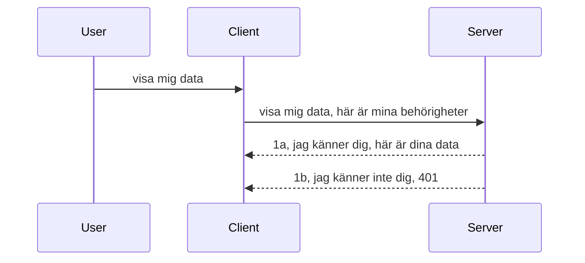

# Enkel autentisering

MCP SDK:er stöder användning av OAuth 2.1 vilket, för att vara ärlig, är en ganska invecklad process som involverar koncept som auth-server, resurserver, skicka inloggningsuppgifter, få en kod, byta ut koden mot en bärartoken tills du slutligen kan hämta dina resursdata. Om du inte är van vid OAuth som är väldigt bra att implementera, är det en bra idé att börja med någon grundläggande nivå av autentisering och bygga upp till bättre och bättre säkerhet. Det är därför detta kapitel finns, för att bygga upp dig till mer avancerad autentisering.

## Autentisering, vad menar vi?

Auth är en förkortning för autentisering och auktorisering. Idén är att vi behöver göra två saker:

- **Autentisering**, vilket är processen att ta reda på om vi låter en person komma in i vårt hus, att de har rätt att vara "här", det vill säga ha tillgång till vår resurserver där våra MCP Server-funktioner finns.
- **Auktorisering**, är processen att avgöra om en användare ska ha tillgång till just dessa specifika resurser de efterfrågar, till exempel dessa order eller dessa produkter, eller om de tillåts läsa innehållet men inte radera, som ett annat exempel.

## Inloggningsuppgifter: hur vi talar om för systemet vem vi är

De flesta webbutvecklare där ute börjar tänka i termer av att tillhandahålla en inloggningsuppgift till servern, vanligtvis en hemlighet som talar om ifall de får vara här "Autentisering". Denna inloggningsuppgift är vanligtvis en base64-kodad version av användarnamn och lösenord eller en API-nyckel som unikt identifierar en specifik användare.

Detta involverar att skicka den via en header som heter "Authorization" på följande sätt:

```json
{ "Authorization": "secret123" }
```

Detta kallas vanligtvis för basic authentication. Hur den övergripande processen sedan fungerar är på följande vis:


Nu när vi förstår hur det fungerar från ett flödesperspektiv, hur implementerar vi det? De flesta webbservrar har ett koncept som kallas middleware, en kodbit som körs som en del av förfrågan och kan verifiera inloggningsuppgifter, och om uppgifterna är giltiga kan låta förfrågan gå igenom. Om förfrågan inte har giltiga uppgifter får du ett autentiseringsfel. Låt oss se hur detta kan implementeras:

**Python**

```python
class AuthMiddleware(BaseHTTPMiddleware):
    async def dispatch(self, request, call_next):

        has_header = request.headers.get("Authorization")
        if not has_header:
            print("-> Missing Authorization header!")
            return Response(status_code=401, content="Unauthorized")

        if not valid_token(has_header):
            print("-> Invalid token!")
            return Response(status_code=403, content="Forbidden")

        print("Valid token, proceeding...")
       
        response = await call_next(request)
        # lägg till eventuella kundhuvuden eller ändra svaret på något sätt
        return response


starlette_app.add_middleware(CustomHeaderMiddleware)
```

Här har vi:

- Skapat ett middleware som heter `AuthMiddleware` där dess `dispatch`-metod anropas av webbservern.
- Lagt till middleware i webbservern:

    ```python
    starlette_app.add_middleware(AuthMiddleware)
    ```

- Skrivit valideringslogik som kontrollerar om Authorization-headern är närvarande och om hemligheten som skickas är giltig:

    ```python
    has_header = request.headers.get("Authorization")
    if not has_header:
        print("-> Missing Authorization header!")
        return Response(status_code=401, content="Unauthorized")

    if not valid_token(has_header):
        print("-> Invalid token!")
        return Response(status_code=403, content="Forbidden")
    ```

    om hemligheten finns och är giltig låter vi förfrågan gå igenom genom att anropa `call_next` och returnerar svaret.

    ```python
    response = await call_next(request)
    # lägg till eventuella kundhuvuden eller ändra svaret på något sätt
    return response
    ```

Så här fungerar det: om en webbförfrågan görs mot servern anropas middleware, och med dess implementation kommer den antingen låta förfrågan gå igenom eller returnera ett fel som indikerar att klienten inte får fortsätta.

**TypeScript**

Här skapar vi ett middleware med det populära ramverket Express och avlyssnar förfrågan innan den når MCP Server. Här är koden för det:

```typescript
function isValid(secret) {
    return secret === "secret123";
}

app.use((req, res, next) => {
    // 1. Är auktoriseringshuvudet närvarande?
    if(!req.headers["Authorization"]) {
        res.status(401).send('Unauthorized');
    }
    
    let token = req.headers["Authorization"];

    // 2. Kontrollera giltighet.
    if(!isValid(token)) {
        res.status(403).send('Forbidden');
    }

   
    console.log('Middleware executed');
    // 3. Skicka vidare förfrågan till nästa steg i förfrågningsflödet.
    next();
});
```

I denna kod gör vi:

1. Kontrollerar om Authorization-headern finns från början, om inte skickar vi ett 401-fel.
2. Säkerställer att inloggningsuppgiften/token är giltig, om inte skickar vi ett 403-fel.
3. Slutligen skickas förfrågan vidare i förfrågningskedjan och returnerar den efterfrågade resursen.

## Övning: Implementera autentisering

Låt oss ta vår kunskap och försöka implementera det. Här är planen:

Server

- Skapa en webbserver och MCP-instans.
- Implementera ett middleware för servern.

Klient

- Skicka webbförfrågan med inloggningsuppgifter via header.

### -1- Skapa en webbserver och MCP-instans

I vårt första steg behöver vi skapa webbserverinstansen och MCP Server.

**Python**

Här skapar vi en MCP-serverinstans, skapar en starlette webapp och hostar den med uvicorn.

```python
# skapar MCP-server

app = FastMCP(
    name="MCP Resource Server",
    instructions="Resource Server that validates tokens via Authorization Server introspection",
    host=settings["host"],
    port=settings["port"],
    debug=True
)

# skapar starlette webapp
starlette_app = app.streamable_http_app()

# serverar app via uvicorn
async def run(starlette_app):
    import uvicorn
    config = uvicorn.Config(
            starlette_app,
            host=app.settings.host,
            port=app.settings.port,
            log_level=app.settings.log_level.lower(),
        )
    server = uvicorn.Server(config)
    await server.serve()

run(starlette_app)
```

I denna kod:

- Skapar vi MCP Server.
- Konstruerar starlette webapp från MCP Server, `app.streamable_http_app()`.
- Hostar och serverar webappen med uvicorn `server.serve()`.

**TypeScript**

Här skapar vi en MCP Server-instans.

```typescript
const server = new McpServer({
      name: "example-server",
      version: "1.0.0"
    });

    // ... ställa in serverresurser, verktyg och uppmaningar ...
```

Denna skapande av MCP Server behöver ske inom vår POST /mcp ruttdefinition, så låt oss ta ovanstående kod och flytta den så här:

```typescript
import express from "express";
import { randomUUID } from "node:crypto";
import { McpServer } from "@modelcontextprotocol/sdk/server/mcp.js";
import { StreamableHTTPServerTransport } from "@modelcontextprotocol/sdk/server/streamableHttp.js";
import { isInitializeRequest } from "@modelcontextprotocol/sdk/types.js"

const app = express();
app.use(express.json());

// Karta för att lagra transporter efter sessions-ID
const transports: { [sessionId: string]: StreamableHTTPServerTransport } = {};

// Hantera POST-förfrågningar för kommunikation från klient till server
app.post('/mcp', async (req, res) => {
  // Kontrollera om sessions-ID redan finns
  const sessionId = req.headers['mcp-session-id'] as string | undefined;
  let transport: StreamableHTTPServerTransport;

  if (sessionId && transports[sessionId]) {
    // Återanvänd befintlig transport
    transport = transports[sessionId];
  } else if (!sessionId && isInitializeRequest(req.body)) {
    // Ny initialiseringsförfrågan
    transport = new StreamableHTTPServerTransport({
      sessionIdGenerator: () => randomUUID(),
      onsessioninitialized: (sessionId) => {
        // Spara transporten efter sessions-ID
        transports[sessionId] = transport;
      },
      // DNS-ombindningsskydd är som standard avstängt för bakåtkompatibilitet. Om du kör denna server
      // lokalt, se till att ange:
      // enableDnsRebindingProtection: true,
      // allowedHosts: ['127.0.0.1'],
    });

    // Rensa upp transporten när den stängs
    transport.onclose = () => {
      if (transport.sessionId) {
        delete transports[transport.sessionId];
      }
    };
    const server = new McpServer({
      name: "example-server",
      version: "1.0.0"
    });

    // ... konfigurera serverresurser, verktyg och promptar ...

    // Anslut till MCP-servern
    await server.connect(transport);
  } else {
    // Ogiltig förfrågan
    res.status(400).json({
      jsonrpc: '2.0',
      error: {
        code: -32000,
        message: 'Bad Request: No valid session ID provided',
      },
      id: null,
    });
    return;
  }

  // Hantera förfrågan
  await transport.handleRequest(req, res, req.body);
});

// Återanvändbar hanterare för GET- och DELETE-förfrågningar
const handleSessionRequest = async (req: express.Request, res: express.Response) => {
  const sessionId = req.headers['mcp-session-id'] as string | undefined;
  if (!sessionId || !transports[sessionId]) {
    res.status(400).send('Invalid or missing session ID');
    return;
  }
  
  const transport = transports[sessionId];
  await transport.handleRequest(req, res);
};

// Hantera GET-förfrågningar för server-till-klient-notifikationer via SSE
app.get('/mcp', handleSessionRequest);

// Hantera DELETE-förfrågningar för att avsluta sessionen
app.delete('/mcp', handleSessionRequest);

app.listen(3000);
```

Nu ser du hur MCP Server-skapandet flyttades in i `app.post("/mcp")`.

Låt oss gå vidare till nästa steg att skapa middleware så vi kan validera inkommande inloggningsuppgifter.

### -2- Implementera ett middleware för servern

Nästa steg är middleware-delen. Här skapar vi ett middleware som söker efter inloggningsuppgift i `Authorization`-headern och validerar den. Om den är acceptabel kommer förfrågan att fortsätta och göra det den behöver (t.ex. lista verktyg, läsa en resurs eller vad MCP-funktionaliteten klienten efterfrågade).

**Python**

För att skapa middleware behöver vi skapa en klass som ärver från `BaseHTTPMiddleware`. Det finns två intressanta bitar:

- Förfrågan `request`, som vi läser header-informationen från.
- `call_next` callback som vi behöver anropa om klienten skickat en inloggningsuppgift som vi accepterar.

Först behöver vi hantera fallet om `Authorization`-header saknas:

```python
has_header = request.headers.get("Authorization")

# inget header närvarande, misslyckas med 401, annars fortsätt.
if not has_header:
    print("-> Missing Authorization header!")
    return Response(status_code=401, content="Unauthorized")
```

Här skickar vi ett 401 unauthorized-meddelande eftersom klienten misslyckas med autentiseringen.

Nästa, om inloggningsuppgift skickats in, behöver vi kontrollera dess giltighet så här:

```python
 if not valid_token(has_header):
    print("-> Invalid token!")
    return Response(status_code=403, content="Forbidden")
```

Observera att vi skickar ett 403 forbidden-meddelande ovan. Låt oss se hela middleware nedan som implementerar allt vi nämnt ovan:

```python
class AuthMiddleware(BaseHTTPMiddleware):
    async def dispatch(self, request, call_next):

        has_header = request.headers.get("Authorization")
        if not has_header:
            print("-> Missing Authorization header!")
            return Response(status_code=401, content="Unauthorized")

        if not valid_token(has_header):
            print("-> Invalid token!")
            return Response(status_code=403, content="Forbidden")

        print("Valid token, proceeding...")
        print(f"-> Received {request.method} {request.url}")
        response = await call_next(request)
        response.headers['Custom'] = 'Example'
        return response

```

Bra, men vad är `valid_token`-funktionen? Här är den nedan:

```python
# ANVÄND INTE för produktion - förbättra det !!
def valid_token(token: str) -> bool:
    # ta bort prefixet "Bearer "
    if token.startswith("Bearer "):
        token = token[7:]
        return token == "secret-token"
    return False
```

Detta bör självklart förbättras.

VIKTIGT: Du ska ALDRIG ha hemligheter sådana här i koden. Du bör i idealfallet hämta värdet att jämföra mot från en datakälla eller från en IDP (identity service provider) eller ännu bättre, låta IDPn göra valideringen.

**TypeScript**

För att implementera detta med Express behöver vi anropa `use`-metoden som tar middleware-funktioner.

Vi behöver:

- Interagera med förfrågan för att kolla den skickade inloggningsuppgiften i `Authorization`-egenskapen.
- Validera inloggningsuppgiften, och om den är giltig låta förfrågan fortsätta och låta klientens MCP-förfrågan göra vad den ska (t.ex. lista verktyg, läsa resurs eller annat MCP-relaterat).

Här kontrollerar vi om `Authorization` headern finns, om inte avbryts förfrågan:

```typescript
if(!req.headers["authorization"]) {
    res.status(401).send('Unauthorized');
    return;
}
```

Om headern inte alls skickas får du ett 401.

Nästa, vi kontrollerar om inloggningsuppgiften är giltig, om inte stoppar vi förfrågan igen men med ett något annorlunda meddelande:

```typescript
if(!isValid(token)) {
    res.status(403).send('Forbidden');
    return;
} 
```

Observera att du nu får ett 403-fel.

Här är hela koden:

```typescript
app.use((req, res, next) => {
    console.log('Request received:', req.method, req.url, req.headers);
    console.log('Headers:', req.headers["authorization"]);
    if(!req.headers["authorization"]) {
        res.status(401).send('Unauthorized');
        return;
    }
    
    let token = req.headers["authorization"];

    if(!isValid(token)) {
        res.status(403).send('Forbidden');
        return;
    }  

    console.log('Middleware executed');
    next();
});
```

Vi har satt upp webbservern att acceptera ett middleware som kollar uppgifterna som klienten förhoppningsvis skickar oss. Men hur är det med klienten själv?

### -3- Skicka webbförfrågan med inloggningsuppgifter via header

Vi behöver säkerställa att klienten skickar med inloggningsuppgifterna via headern. Eftersom vi ska använda en MCP-klient för detta behöver vi ta reda på hur det görs.

**Python**

För klienten behöver vi skicka med en header med våra inloggningsuppgifter så här:

```python
# SKRIV INTE värdet direkt i koden, ha det minst i en miljövariabel eller en säkrare lagring
token = "secret-token"

async with streamablehttp_client(
        url = f"http://localhost:{port}/mcp",
        headers = {"Authorization": f"Bearer {token}"}
    ) as (
        read_stream,
        write_stream,
        session_callback,
    ):
        async with ClientSession(
            read_stream,
            write_stream
        ) as session:
            await session.initialize()
      
            # TODO, vad du vill ha gjort i klienten, t.ex lista verktyg, kalla verktyg etc.
```

Observera hur vi fyller i `headers`-egenskapen så här ` headers = {"Authorization": f"Bearer {token}"}`.

**TypeScript**

Vi kan lösa detta i två steg:

1. Fyll en konfigurationsobjekt med vår inloggningsuppgift.
2. Skicka konfigurationsobjektet till transporten.

```typescript

// ANVÄND INTE hårdkodat värdet som visas här. Ha det åtminstone som en miljövariabel och använd något som dotenv (i utvecklingsläge).
let token = "secret123"

// definiera ett klienttransportalternativobjekt
let options: StreamableHTTPClientTransportOptions = {
  sessionId: sessionId,
  requestInit: {
    headers: {
      "Authorization": "secret123"
    }
  }
};

// skicka options-objektet till transporten
async function main() {
   const transport = new StreamableHTTPClientTransport(
      new URL(serverUrl),
      options
   );
```

Här ser du ovan hur vi var tvungna att skapa ett `options`-objekt och placera våra headers under `requestInit`-egenskapen.

VIKTIGT: Hur förbättrar vi sedan detta? Den nuvarande implementationen har några problem. Först och främst är det ganska riskabelt att skicka inloggningsuppgift så här om du inte minst har HTTPS. Även då kan uppgiften stjälas, så du behöver ett system där du enkelt kan återkalla token och lägga till ytterligare kontroller såsom var i världen den kommer ifrån, sker förfrågningar för ofta (bot-liknande beteende), kort sagt, det finns en hel del aspekter. 

Det ska dock sägas att för väldigt enkla API:er där du inte vill att någon anropar ditt API utan autentisering och det vi har här är en bra start.

Med det sagt, låt oss försöka stärka säkerheten lite genom att använda ett standardiserat format som JSON Web Token, även känt som JWT eller "JOT" tokens.

## JSON Web Tokens, JWT

Så, vi försöker förbättra saker från att skicka mycket enkla inloggningsuppgifter. Vilka är de omedelbara förbättringarna vi får genom att anta JWT?

- **Säkerhetsförbättringar**. Vid basic auth skickar du användarnamn och lösenord som en base64-kodad token (eller en API-nyckel) om och om igen vilket ökar risken. Med JWT skickar du ditt användarnamn och lösenord och får en token tillbaka som också är tidsbegränsad, vilket betyder att den går ut. JWT låter dig enkelt använda finmaskig åtkomstkontroll med roller, scopes och behörigheter.
- **Statelessness och skalbarhet**. JWT är självförsörjande, de bär all användarinformation och eliminerar behovet av serverbaserad sessionslagring. Token kan också valideras lokalt.
- **Interoperabilitet och federation**. JWT är kärnan i Open ID Connect och används med kända identitetsleverantörer som Entra ID, Google Identity och Auth0. De möjliggör även single sign-on och mycket mer vilket gör det företagssäkert.
- **Modularitet och flexibilitet**. JWT kan även användas med API Gateways som Azure API Management, NGINX och fler. Det stöder också användarautentiseringsscenarier och server-till-tjänst-kommunikation inklusive impersonation och delegering.
- **Prestanda och cachelagring**. JWT kan cachelagras efter avkodning vilket minskar behovet av parsning. Detta hjälper särskilt med högtrafikerade appar då det ökar genomströmningen och minskar belastningen på din infrastruktur.
- **Avancerade funktioner**. Det stöder även introspektion (kontroll av giltighet på servern) och återkallande (att göra en token ogiltig).

Med alla dessa fördelar, låt oss se hur vi kan ta vår implementation till nästa nivå.

## Att göra om basic auth till JWT

De ändringar vi behöver göra på hög nivå är att:

- **Lära oss att konstruera en JWT-token** och göra den redo att skickas från klient till server.
- **Validera en JWT-token**, och om så, låta klienten få våra resurser.
- **Säker tokenlagring**. Hur vi lagrar denna token.
- **Skydda rutter**. Vi behöver skydda rutterna, i vårt fall behöver vi skydda rutter och specifika MCP-funktioner.
- **Lägga till refresh tokens**. Säkerställ att vi skapar tokens som är kortlivade men refresh tokens som är långlivade och kan användas för att skaffa nya tokens om de går ut. Se även till att det finns en refresh-endpoint och en rotationsstrategi.

### -1- Konstruera en JWT-token

Först och främst har en JWT-token följande delar:

- **header**, algoritm och token-typ.
- **payload**, claims, som sub (användaren eller entiteten som token representerar. I en auth-scenario är detta vanligtvis userid), exp (när den går ut), role (rollen)
- **signature**, signerad med en hemlighet eller privat nyckel.

För detta behöver vi konstruera headern, payload och den kodade token.

**Python**

```python

import jwt
import jwt
from jwt.exceptions import ExpiredSignatureError, InvalidTokenError
import datetime

# Hemlig nyckel som används för att signera JWT
secret_key = 'your-secret-key'

header = {
    "alg": "HS256",
    "typ": "JWT"
}

# användarinformation och dess påståenden samt utgångstid
payload = {
    "sub": "1234567890",               # Ämne (användar-ID)
    "name": "User Userson",                # Egen påstående
    "admin": True,                     # Egen påstående
    "iat": datetime.datetime.utcnow(),# Utfärdad vid
    "exp": datetime.datetime.utcnow() + datetime.timedelta(hours=1)  # Utgång
}

# koda den
encoded_jwt = jwt.encode(payload, secret_key, algorithm="HS256", headers=header)
```

I koden ovan har vi:

- Definierat en header med algoritmen HS256 och typ som JWT.
- Konstruerat en payload som innehåller ett subject eller användar-id, ett användarnamn, en roll, när den utfärdades och när den ska gå ut, vilket implementerar den tidsbegränsade aspekten vi nämnde tidigare.

**TypeScript**

Här behöver vi några beroenden som hjälper oss att konstruera JWT-token.

Beroenden

```sh

npm install jsonwebtoken
npm install --save-dev @types/jsonwebtoken
```

Nu när vi har det på plats, låt oss skapa header, payload och genom det skapa den kodade token.

```typescript
import jwt from 'jsonwebtoken';

const secretKey = 'your-secret-key'; // Använd miljövariabler i produktion

// Definiera nyttolasten
const payload = {
  sub: '1234567890',
  name: 'User usersson',
  admin: true,
  iat: Math.floor(Date.now() / 1000), // Utfärdat vid
  exp: Math.floor(Date.now() / 1000) + 60 * 60 // Går ut om 1 timme
};

// Definiera headern (valfritt, jsonwebtoken sätter standardvärden)
const header = {
  alg: 'HS256',
  typ: 'JWT'
};

// Skapa token
const token = jwt.sign(payload, secretKey, {
  algorithm: 'HS256',
  header: header
});

console.log('JWT:', token);
```

Denna token är:

Signerad med HS256
Giltig i 1 timme
Inkluderar claims som sub, name, admin, iat och exp.

### -2- Validera en token

Vi behöver också validera en token, detta bör göras på servern för att säkerställa att det klienten skickar oss är giltigt. Det finns många kontroller vi bör göra här från att validera strukturen till giltigheten. Du uppmuntras också att lägga till andra kontroller för att se om användaren finns i systemet och mer.

För att validera en token behöver vi avkoda den så vi kan läsa den och börja kontrollera dess giltighet:

**Python**

```python

# Avkoda och verifiera JWT
try:
    decoded = jwt.decode(token, secret_key, algorithms=["HS256"])
    print("✅ Token is valid.")
    print("Decoded claims:")
    for key, value in decoded.items():
        print(f"  {key}: {value}")
except ExpiredSignatureError:
    print("❌ Token has expired.")
except InvalidTokenError as e:
    print(f"❌ Invalid token: {e}")

```

I denna kod anropar vi `jwt.decode` med token, den hemliga nyckeln och vald algoritm som indata. Observera att vi använder en try-catch-konstruktion eftersom misslyckad validering leder till ett fel.

**TypeScript**

Här behöver vi anropa `jwt.verify` för att få en avkodad version av token som vi kan analysera vidare. Om detta anrop misslyckas betyder det att token-strukturen är felaktig eller att den inte längre är giltig.

```typescript

try {
  const decoded = jwt.verify(token, secretKey);
  console.log('Decoded Payload:', decoded);
} catch (err) {
  console.error('Token verification failed:', err);
}
```

OBS: som tidigare nämnt bör vi göra ytterligare kontroller för att säkerställa att denna token pekar ut en användare i vårt system och se till att användaren har de rättigheter den påstår sig ha.
Nästa, låt oss titta på rollbaserad åtkomstkontroll, även känt som RBAC.

## Lägga till rollbaserad åtkomstkontroll

Idén är att vi vill uttrycka att olika roller har olika behörigheter. Till exempel antar vi att en admin kan göra allt, att en vanlig användare kan läsa/skiva och att en gäst bara kan läsa. Därför finns här några möjliga behörighetsnivåer:

- Admin.Write
- User.Read
- Guest.Read

Låt oss titta på hur vi kan implementera en sådan kontroll med middleware. Middleware kan läggas till per rutt såväl som för alla rutter.

**Python**

```python
from starlette.middleware.base import BaseHTTPMiddleware
from starlette.responses import JSONResponse
import jwt

# HA INTE hemligheten i koden som detta, det är endast för demonstrationsändamål. Läs det från en säker plats.
SECRET_KEY = "your-secret-key" # lägg detta i en miljövariabel
REQUIRED_PERMISSION = "User.Read"

class JWTPermissionMiddleware(BaseHTTPMiddleware):
    async def dispatch(self, request, call_next):
        auth_header = request.headers.get("Authorization")
        if not auth_header or not auth_header.startswith("Bearer "):
            return JSONResponse({"error": "Missing or invalid Authorization header"}, status_code=401)

        token = auth_header.split(" ")[1]
        try:
            decoded = jwt.decode(token, SECRET_KEY, algorithms=["HS256"])
        except jwt.ExpiredSignatureError:
            return JSONResponse({"error": "Token expired"}, status_code=401)
        except jwt.InvalidTokenError:
            return JSONResponse({"error": "Invalid token"}, status_code=401)

        permissions = decoded.get("permissions", [])
        if REQUIRED_PERMISSION not in permissions:
            return JSONResponse({"error": "Permission denied"}, status_code=403)

        request.state.user = decoded
        return await call_next(request)


```

Det finns några olika sätt att lägga till middleware som nedan:

```python

# Alt 1: lägg till middleware medan starlette-appen byggs
middleware = [
    Middleware(JWTPermissionMiddleware)
]

app = Starlette(routes=routes, middleware=middleware)

# Alt 2: lägg till middleware efter att starlette-appen redan har byggts
starlette_app.add_middleware(JWTPermissionMiddleware)

# Alt 3: lägg till middleware per rutt
routes = [
    Route(
        "/mcp",
        endpoint=..., # hanterare
        middleware=[Middleware(JWTPermissionMiddleware)]
    )
]
```

**TypeScript**

Vi kan använda `app.use` och en middleware som körs för alla förfrågningar.

```typescript
app.use((req, res, next) => {
    console.log('Request received:', req.method, req.url, req.headers);
    console.log('Headers:', req.headers["authorization"]);

    // 1. Kontrollera om auktoriseringshuvudet har skickats

    if(!req.headers["authorization"]) {
        res.status(401).send('Unauthorized');
        return;
    }
    
    let token = req.headers["authorization"];

    // 2. Kontrollera om token är giltig
    if(!isValid(token)) {
        res.status(403).send('Forbidden');
        return;
    }  

    // 3. Kontrollera om token-användaren finns i vårt system
    if(!isExistingUser(token)) {
        res.status(403).send('Forbidden');
        console.log("User does not exist");
        return;
    }
    console.log("User exists");

    // 4. Verifiera att token har rätt behörigheter
    if(!hasScopes(token, ["User.Read"])){
        res.status(403).send('Forbidden - insufficient scopes');
    }

    console.log("User has required scopes");

    console.log('Middleware executed');
    next();
});

```

Det finns ganska många saker vi kan låta vår middleware göra och som vår middleware SKA göra, nämligen:

1. Kontrollera om auktoriseringshuvud finns
2. Kontrollera om token är giltig, vi kallar `isValid` som är en metod vi skrev som kontrollerar integriteten och giltigheten av JWT-token.
3. Verifiera att användaren finns i vårt system, detta bör vi kontrollera.

   ```typescript
    // användare i databasen
   const users = [
     "user1",
     "User usersson",
   ]

   function isExistingUser(token) {
     let decodedToken = verifyToken(token);

     // TODO, kontrollera om användaren finns i databasen
     return users.includes(decodedToken?.name || "");
   }
   ```

   Ovan har vi skapat en väldigt enkel `users`-lista, som förstås borde finnas i en databas.

4. Dessutom bör vi även kontrollera att token har rätt behörigheter.

   ```typescript
   if(!hasScopes(token, ["User.Read"])){
        res.status(403).send('Forbidden - insufficient scopes');
   }
   ```

   I ovanstående kod från middleware kontrollerar vi att token innehåller User.Read-behörighet, om inte skickar vi ett 403-fel. Nedan är hjälpfunktionen `hasScopes`.

   ```typescript
   function hasScopes(scope: string, requiredScopes: string[]) {
     let decodedToken = verifyToken(scope);
    return requiredScopes.every(scope => decodedToken?.scopes.includes(scope));
  }
   ```

Have a think which additional checks you should be doing, but these are the absolute minimum of checks you should be doing.

Using Express as a web framework is a common choice. There are helpers library when you use JWT so you can write less code.

- `express-jwt`, helper library that provides a middleware that helps decode your token.
- `express-jwt-permissions`, this provides a middleware `guard` that helps check if a certain permission is on the token.

Here's what these libraries can look like when used:

```typescript
const express = require('express');
const jwt = require('express-jwt');
const guard = require('express-jwt-permissions')();

const app = express();
const secretKey = 'your-secret-key'; // put this in env variable

// Decode JWT and attach to req.user
app.use(jwt({ secret: secretKey, algorithms: ['HS256'] }));

// Check for User.Read permission
app.use(guard.check('User.Read'));

// multiple permissions
// app.use(guard.check(['User.Read', 'Admin.Access']));

app.get('/protected', (req, res) => {
  res.json({ message: `Welcome ${req.user.name}` });
});

// Error handler
app.use((err, req, res, next) => {
  if (err.code === 'permission_denied') {
    return res.status(403).send('Forbidden');
  }
  next(err);
});

```

Nu har du sett hur middleware kan användas både för autentisering och auktorisering, men vad sägs om MCP, ändrar det hur vi gör auth? Låt oss ta reda på det i nästa avsnitt.

### -3- Lägg till RBAC till MCP

Du har hittills sett hur du kan lägga till RBAC via middleware, men för MCP finns det inget enkelt sätt att lägga till RBAC per MCP-funktion, så vad gör vi? Jo, vi måste helt enkelt lägga till kod som i detta fall kontrollerar om klienten har rättigheter att anropa ett specifikt verktyg:

Du har några olika val för att uppnå RBAC per funktion, här är några:

- Lägg till en kontroll för varje verktyg, resurs, prompt där du behöver kontrollera behörighetsnivå.

   **python**

   ```python
   @tool()
   def delete_product(id: int):
      try:
          check_permissions(role="Admin.Write", request)
      catch:
        pass # klient misslyckades med auktorisering, kasta auktoriseringsfel
   ```

   **typescript**

   ```typescript
   server.registerTool(
    "delete-product",
    {
      title: Delete a product",
      description: "Deletes a product",
      inputSchema: { id: z.number() }
    },
    async ({ id }) => {
      
      try {
        checkPermissions("Admin.Write", request);
        // todo, skicka id till productService och fjärrinmatning
      } catch(Exception e) {
        console.log("Authorization error, you're not allowed");  
      }

      return {
        content: [{ type: "text", text: `Deletected product with id ${id}` }]
      };
    }
   );
   ```


- Använd avancerad servermetod och hantera anropen så att du minimerar hur många ställen du behöver göra kontrollen på.

   **Python**

   ```python
   
   tool_permission = {
      "create_product": ["User.Write", "Admin.Write"],
      "delete_product": ["Admin.Write"]
   }

   def has_permission(user_permissions, required_permissions) -> bool:
      # user_permissions: lista över behörigheter som användaren har
      # required_permissions: lista över behörigheter som krävs för verktyget
      return any(perm in user_permissions for perm in required_permissions)

   @server.call_tool()
   async def handle_call_tool(
     name: str, arguments: dict[str, str] | None
   ) -> list[types.TextContent]:
    # Anta att request.user.permissions är en lista över behörigheter för användaren
     user_permissions = request.user.permissions
     required_permissions = tool_permission.get(name, [])
     if not has_permission(user_permissions, required_permissions):
        # Kasta fel "Du har inte behörighet att använda verktyget {name}"
        raise Exception(f"You don't have permission to call tool {name}")
     # fortsätt och anropa verktyget
     # ...
   ```   
   

   **TypeScript**

   ```typescript
   function hasPermission(userPermissions: string[], requiredPermissions: string[]): boolean {
       if (!Array.isArray(userPermissions) || !Array.isArray(requiredPermissions)) return false;
       // Returnera sant om användaren har minst en nödvändig behörighet
       
       return requiredPermissions.some(perm => userPermissions.includes(perm));
   }
  
   server.setRequestHandler(CallToolRequestSchema, async (request) => {
      const { params: { name } } = request;
  
      let permissions = request.user.permissions;
  
      if (!hasPermission(permissions, toolPermissions[name])) {
         return new Error(`You don't have permission to call ${name}`);
      }
  
      // fortsätt..
   });
   ```

   Observera, du måste se till att din middleware tilldelar en avkodad token till förfrågans user-egenskap så att koden ovan förenklas.

### Sammanfattning

Nu när vi har diskuterat hur man lägger till stöd för RBAC generellt och för MCP specifikt, är det dags att försöka implementera säkerhet på egen hand för att säkerställa att du förstått de koncept som presenterats.

## Uppgift 1: Bygg en mcp-server och mcp-klient med grundläggande autentisering

Här tar du det du har lärt dig med att skicka referenser via headers.

## Lösning 1

[Lösning 1](./code/basic/README.md)

## Uppgift 2: Uppgradera lösningen från Uppgift 1 till att använda JWT

Ta den första lösningen men förbättra den denna gång.

Istället för att använda Basic Auth, låt oss använda JWT.

## Lösning 2

[Lösning 2](./solution/jwt-solution/README.md)

## Utmaning

Lägg till RBAC per verktyg som vi beskriver i avsnittet "Lägg till RBAC till MCP".

## Sammanfattning

Förhoppningsvis har du lärt dig mycket i detta kapitel, från ingen säkerhet alls, till grundläggande säkerhet, till JWT och hur det kan läggas till i MCP.

Vi har byggt en solid grund med anpassade JWT, men när vi växer går vi mot en standardbaserad identitetsmodell. Att anta en IdP som Entra eller Keycloak låter oss avlasta tokenutgivning, validering och livscykelhantering till en betrodd plattform – vilket frigör oss att fokusera på applikationslogik och användarupplevelse.

För det har vi ett mer [avancerat kapitel om Entra](../../05-AdvancedTopics/mcp-security-entra/README.md)

## Vad är nästa

- Nästa: [Ställa in MCP Hosts](../12-mcp-hosts/README.md)

---

<!-- CO-OP TRANSLATOR DISCLAIMER START -->
**Friskrivning**:
Detta dokument har översatts med hjälp av AI-översättningstjänsten [Co-op Translator](https://github.com/Azure/co-op-translator). Även om vi strävar efter noggrannhet, bör du vara medveten om att automatiska översättningar kan innehålla fel eller brister. Originaldokumentet på dess ursprungliga språk ska betraktas som den auktoritativa källan. För kritisk information rekommenderas professionell mänsklig översättning. Vi ansvarar inte för några missförstånd eller feltolkningar som uppstår från användningen av denna översättning.
<!-- CO-OP TRANSLATOR DISCLAIMER END -->