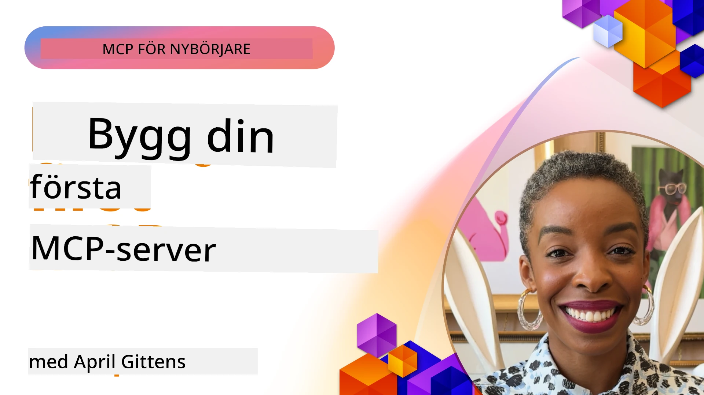

## Komma igång  

_(Klicka på bilden ovan för att se videon för denna lektion)_

Det här avsnittet består av flera lektioner:

- **1 Din första server**, i denna första lektion kommer du att lära dig hur du skapar din första server och inspekterar den med inspektörverktyget, ett värdefullt sätt att testa och felsöka din server, [till lektionen](01-first-server/README.md)

- **2 Klient**, i denna lektion kommer du att lära dig att skriva en klient som kan ansluta till din server, [till lektionen](02-client/README.md)

- **3 Klient med LLM**, ett ännu bättre sätt att skriva en klient är genom att lägga till en LLM så att den kan "förhandla" med din server om vad som ska göras, [till lektionen](03-llm-client/README.md)

- **4 Använda serverläge med GitHub Copilot Agent i Visual Studio Code**. Här tittar vi på att köra vår MCP Server från Visual Studio Code, [till lektionen](04-vscode/README.md)

- **5 stdio Transport Server** stdio-transport är den rekommenderade standarden för lokal MCP server-till-klient kommunikation och ger säker kommunikation via subprocess med inbyggd process-isolering [till lektionen](05-stdio-server/README.md)

- **6 HTTP-strömning med MCP (Strömningsbart HTTP)**. Lär dig om modern HTTP-strömnings-transport (den rekommenderade metoden för fjärrstyrda MCP-servrar enligt [MCP Specification 2025-11-25](https://spec.modelcontextprotocol.io/specification/2025-11-25/basic/transports/#streamable-http)), progress-notiser och hur man implementerar skalbara, realtids MCP-servrar och klienter med Streamable HTTP. [till lektionen](06-http-streaming/README.md)

- **7 Använda AI Toolkit för VSCode** för att konsumera och testa dina MCP-klienter och -servrar [till lektionen](07-aitk/README.md)

- **8 Testning**. Här fokuserar vi särskilt på hur vi kan testa vår server och klient på olika sätt, [till lektionen](08-testing/README.md)

- **9 Distribution**. Detta kapitel tittar på olika sätt att distribuera dina MCP-lösningar, [till lektionen](09-deployment/README.md)

- **10 Avancerad serveranvändning**. Detta kapitel täcker avancerad serveranvändning, [till lektionen](./10-advanced/README.md)

- **11 Auth**. Detta kapitel beskriver hur man lägger till enkel autentisering, från Basic Auth till att använda JWT och RBAC. Du uppmuntras att börja här och sedan titta på avancerade ämnen i kapitel 5 samt utföra ytterligare säkerhetshärdning enligt rekommendationerna i kapitel 2, [till lektionen](./11-simple-auth/README.md)

- **12 MCP Hosts**. Konfigurera och använd populära MCP-hostklienter inklusive Claude Desktop, Cursor, Cline och Windsurf. Lär dig om transporttyper och felsökning, [till lektionen](./12-mcp-hosts/README.md)

- **13 MCP Inspector**. Felsök och testa dina MCP-servrar interaktivt med MCP Inspector-verktyget. Lär dig felsökningsverktyg, resurser och protokollmeddelanden, [till lektionen](./13-mcp-inspector/README.md)

Model Context Protocol (MCP) är ett öppet protokoll som standardiserar hur applikationer tillhandahåller kontext till LLM:er. Tänk på MCP som en USB-C-port för AI-applikationer – det ger ett standardiserat sätt att koppla AI-modeller till olika datakällor och verktyg.

## Lärandemål

I slutet av denna lektion kommer du kunna:

- Sätta upp utvecklingsmiljöer för MCP i C#, Java, Python, TypeScript och JavaScript
- Bygga och distribuera grundläggande MCP-servrar med anpassade funktioner (resurser, prompts och verktyg)
- Skapa host-applikationer som ansluter till MCP-servrar
- Testa och felsöka MCP-implementationer
- Förstå vanliga uppsättningsutmaningar och deras lösningar
- Ansluta dina MCP-implementationer till populära LLM-tjänster

## Sätta upp din MCP-miljö

Innan du börja arbeta med MCP är det viktigt att förbereda din utvecklingsmiljö och förstå grundläggande arbetsflöde. Detta avsnitt guidar dig genom de första installationsstegen för att säkerställa en smidig start med MCP.

### Förutsättningar

Innan du börjar med MCP-utveckling, säkerställ att du har:

- **Utvecklingsmiljö**: För ditt valda språk (C#, Java, Python, TypeScript eller JavaScript)
- **IDE/Editor**: Visual Studio, Visual Studio Code, IntelliJ, Eclipse, PyCharm eller någon modern kodredigerare
- **Paketförvaltare**: NuGet, Maven/Gradle, pip eller npm/yarn
- **API-nycklar**: För de AI-tjänster du planerar att använda i dina host-applikationer

### Officiella SDK:er

I kommande kapitel kommer du att se lösningar byggda med Python, TypeScript, Java och .NET. Här är alla officiellt stödjade SDK:er.

MCP tillhandahåller officiella SDK:er för flera språk (i linje med [MCP Specification 2025-11-25](https://spec.modelcontextprotocol.io/specification/2025-11-25/)):
- [C# SDK](https://github.com/modelcontextprotocol/csharp-sdk) - Underhålls i samarbete med Microsoft
- [Java SDK](https://github.com/modelcontextprotocol/java-sdk) - Underhålls i samarbete med Spring AI
- [TypeScript SDK](https://github.com/modelcontextprotocol/typescript-sdk) - Den officiella TypeScript-implementationen
- [Python SDK](https://github.com/modelcontextprotocol/python-sdk) - Den officiella Python-implementationen (FastMCP)
- [Kotlin SDK](https://github.com/modelcontextprotocol/kotlin-sdk) - Den officiella Kotlin-implementationen
- [Swift SDK](https://github.com/modelcontextprotocol/swift-sdk) - Underhålls i samarbete med Loopwork AI
- [Rust SDK](https://github.com/modelcontextprotocol/rust-sdk) - Den officiella Rust-implementationen
- [Go SDK](https://github.com/modelcontextprotocol/go-sdk) - Den officiella Go-implementationen

## Viktiga slutsatser

- Att sätta upp en MCP-utvecklingsmiljö är enkelt med språksspecifika SDK:er
- Att bygga MCP-servrar innebär att skapa och registrera verktyg med tydliga scheman
- MCP-klienter ansluter till servrar och modeller för att utnyttja utökade funktioner
- Testning och felsökning är avgörande för pålitliga MCP-implementationer
- Distribueringsalternativ varierar från lokal utveckling till molnbaserade lösningar

## Övning

Vi har ett set med exempel som kompletterar övningarna du kommer att se i alla kapitel i detta avsnitt. Dessutom har varje kapitel sina egna övningar och uppgifter

- [Java Kalkylator](./samples/java/calculator/README.md)
- [.Net Kalkylator](../../../03-GettingStarted/samples/csharp)
- [JavaScript Kalkylator](./samples/javascript/README.md)
- [TypeScript Kalkylator](./samples/typescript/README.md)
- [Python Kalkylator](../../../03-GettingStarted/samples/python)

## Ytterligare resurser

- [Bygg agenter med Model Context Protocol på Azure](https://learn.microsoft.com/azure/developer/ai/intro-agents-mcp)
- [Fjärr-MCP med Azure Container Apps (Node.js/TypeScript/JavaScript)](https://learn.microsoft.com/samples/azure-samples/mcp-container-ts/mcp-container-ts/)
- [.NET OpenAI MCP Agent](https://learn.microsoft.com/samples/azure-samples/openai-mcp-agent-dotnet/openai-mcp-agent-dotnet/)

## Vad händer härnäst

Börja med första lektionen: [Skapa din första MCP-server](01-first-server/README.md)

När du har slutfört denna modul, fortsätt till: [Modul 4: Praktisk implementering](../04-PracticalImplementation/README.md)

---

<!-- CO-OP TRANSLATOR DISCLAIMER START -->
**Ansvarsfriskrivning**:  
Detta dokument har översatts med hjälp av AI-översättningstjänsten [Co-op Translator](https://github.com/Azure/co-op-translator). Även om vi strävar efter noggrannhet, var vänlig observera att automatiska översättningar kan innehålla fel eller brister. Det ursprungliga dokumentet på dess modersmål bör betraktas som den auktoritativa källan. För kritisk information rekommenderas professionell mänsklig översättning. Vi ansvarar inte för eventuella missförstånd eller feltolkningar som uppstår vid användning av denna översättning.
<!-- CO-OP TRANSLATOR DISCLAIMER END -->