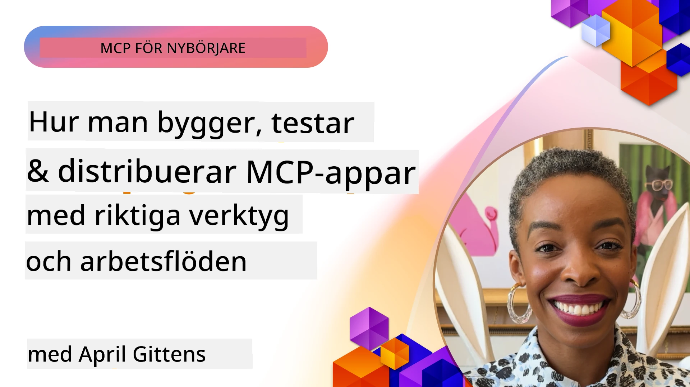
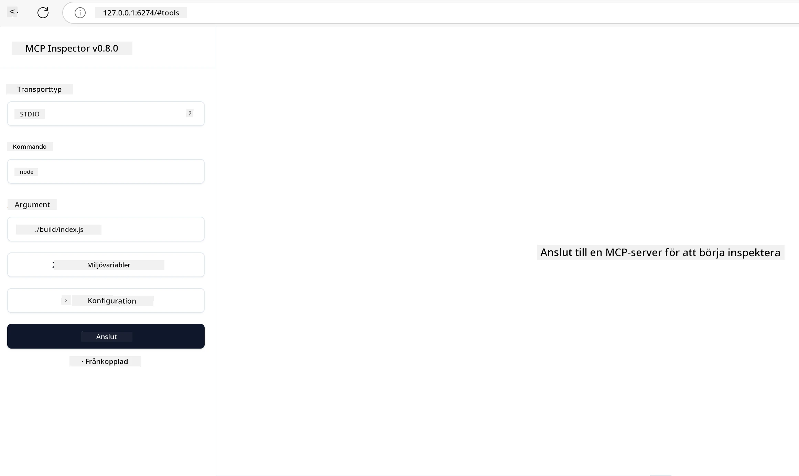

# Praktisk Implementation

[](https://youtu.be/vCN9-mKBDfQ)

_(Klicka på bilden ovan för att se videon till denna lektion)_

Praktisk implementation är där kraften i Model Context Protocol (MCP) blir påtaglig. Medan förståelsen av teorin och arkitekturen bakom MCP är viktig, framträder det verkliga värdet när du tillämpar dessa koncept för att bygga, testa och distribuera lösningar som löser verkliga problem. Detta kapitel överbryggar gapet mellan konceptuell kunskap och praktisk utveckling och vägleder dig genom processen att ge liv åt MCP-baserade applikationer.

Oavsett om du utvecklar intelligenta assistenter, integrerar AI i affärsarbetsflöden eller bygger anpassade verktyg för databehandling, erbjuder MCP en flexibel grund. Dess språk-oberoende design och officiella SDK:er för populära programmeringsspråk gör det tillgängligt för många utvecklare. Genom att utnyttja dessa SDK:er kan du snabbt skapa prototyper, iterera och skala dina lösningar över olika plattformar och miljöer.

I följande sektioner hittar du praktiska exempel, exempel på kod och distributionsstrategier som visar hur du implementerar MCP i C#, Java med Spring, TypeScript, JavaScript och Python. Du kommer också lära dig hur du felsöker och testar dina MCP-servrar, hanterar API:er och distribuerar lösningar till molnet med Azure. Dessa praktiska resurser är utformade för att påskynda ditt lärande och hjälpa dig bygga robusta, produktionsklara MCP-applikationer med självförtroende.

## Översikt

Denna lektion fokuserar på praktiska aspekter av MCP-implementation över flera programmeringsspråk. Vi kommer att utforska hur du använder MCP SDK:er i C#, Java med Spring, TypeScript, JavaScript och Python för att bygga robusta applikationer, felsöka och testa MCP-servrar samt skapa återanvändbara resurser, prompts och verktyg.

## Lärandemål

I slutet av denna lektion kommer du att kunna:

- Implementera MCP-lösningar med officiella SDK:er i olika programmeringsspråk
- Felsöka och testa MCP-servrar systematiskt
- Skapa och använda serverfunktioner (Resurser, Prompts och Verktyg)
- Designa effektiva MCP-arbetsflöden för komplexa uppgifter
- Optimera MCP-implementationer för prestanda och tillförlitlighet

## Officiella SDK-resurser

Model Context Protocol erbjuder officiella SDK:er för flera språk (i enlighet med [MCP Specification 2025-11-25](https://spec.modelcontextprotocol.io/specification/2025-11-25/)):

- [C# SDK](https://github.com/modelcontextprotocol/csharp-sdk)
- [Java med Spring SDK](https://github.com/modelcontextprotocol/java-sdk) **Obs:** kräver beroende på [Project Reactor](https://projectreactor.io). (Se [diskussionsärende 246](https://github.com/orgs/modelcontextprotocol/discussions/246).)
- [TypeScript SDK](https://github.com/modelcontextprotocol/typescript-sdk)
- [Python SDK](https://github.com/modelcontextprotocol/python-sdk)
- [Kotlin SDK](https://github.com/modelcontextprotocol/kotlin-sdk)
- [Go SDK](https://github.com/modelcontextprotocol/go-sdk)

## Arbeta med MCP SDK:er

Denna sektion erbjuder praktiska exempel på implementering av MCP i flera programmeringsspråk. Du kan hitta exempel på kod i `samples`-katalogen organiserad per språk.

### Tillgängliga exempel

Förrådet innehåller [exempel på implementationer](../../../04-PracticalImplementation/samples) i följande språk:

- [C#](./samples/csharp/README.md)
- [Java med Spring](./samples/java/containerapp/README.md)
- [TypeScript](./samples/typescript/README.md)
- [JavaScript](./samples/javascript/README.md)
- [Python](./samples/python/README.md)

Varje exempel demonstrerar viktiga MCP-koncept och implementationsmönster för det specifika språket och ekosystemet.

### Praktiska guider

Ytterligare guider för praktisk MCP-implementation:

- [Paginering och stora resultatset](./pagination/README.md) - Hantera kursorbasserad paginering för verktyg, resurser och stora datasätt

## Kärnserverfunktioner

MCP-servrar kan implementera valfri kombination av dessa funktioner:

### Resurser

Resurser tillhandahåller kontext och data för användaren eller AI-modellen att använda:

- Dokumentarkiv
- Kunskapsbaser
- Strukturerade datakällor
- Filsystem

### Prompts

Prompts är mallade meddelanden och arbetsflöden för användare:

- Fördefinierade samtalsmallar
- Vägledda interaktionsmönster
- Specialiserade dialogstrukturer

### Verktyg

Verktyg är funktioner för AI-modellen att utföra:

- Datasäkerhet/hantering
- Externa API-integrationer
- Beräkningsförmågor
- Sökningsfunktionalitet

## Exempel på implementationer: C# Implementation

Den officiella C# SDK-förrådet innehåller flera exempel på implementationer som demonstrerar olika aspekter av MCP:

- **Grundläggande MCP-klient**: Enkelt exempel som visar hur man skapar en MCP-klient och anropar verktyg
- **Grundläggande MCP-server**: Minimal serverimplementation med grundläggande verktygsregistrering
- **Avancerad MCP-server**: Fullfjädrad server med verktygsregistrering, autentisering och felhantering
- **ASP.NET Integration**: Exempel som visar integration med ASP.NET Core
- **Verktygsimplementationsmönster**: Olika mönster för att implementera verktyg med olika komplexitetsnivåer

MCP C# SDK är i förhandsvisning och API:er kan komma att ändras. Vi kommer att kontinuerligt uppdatera denna blogg efterhand som SDK:n utvecklas.

### Nyckelfunktioner

- [C# MCP Nuget ModelContextProtocol](https://www.nuget.org/packages/ModelContextProtocol)
- Bygga din [första MCP-server](https://devblogs.microsoft.com/dotnet/build-a-model-context-protocol-mcp-server-in-csharp/).

För kompletta C# implementationsexempel, besök det [officiella C# SDK-exempelförrådet](https://github.com/modelcontextprotocol/csharp-sdk)

## Exempel på implementation: Java med Spring Implementation

Java med Spring SDK erbjuder robusta MCP-implementationsmöjligheter med företagsklassade funktioner.

### Nyckelfunktioner

- Integration med Spring Framework
- Stark typ-säkerhet
- Stöd för reaktiv programmering
- Omfattande felhantering

För ett komplett Java med Spring implementeringsexempel, se [Java med Spring-exempel](samples/java/containerapp/README.md) i katalogen med exempel.

## Exempel på implementation: JavaScript Implementation

JavaScript SDK erbjuder ett lättviktigt och flexibelt tillvägagångssätt för MCP-implementation.

### Nyckelfunktioner

- Stöd för Node.js och webbläsare
- Promise-baserat API
- Enkel integration med Express och andra ramverk
- WebSocket-stöd för streaming

För ett komplett JavaScript-implementeringsexempel, se [JavaScript-exempel](samples/javascript/README.md) i katalogen med exempel.

## Exempel på implementation: Python Implementation

Python SDK erbjuder ett Pythoniskt tillvägagångssätt för MCP-implementation med utmärkta integrationer för ML-ramverk.

### Nyckelfunktioner

- Async/await-stöd med asyncio
- FastAPI-integration``
- Enkel verktygsregistrering
- Inbyggd integration med populära ML-bibliotek

För ett komplett Python-implementeringsexempel, se [Python-exempel](samples/python/README.md) i katalogen med exempel.

## API-hantering

Azure API Management är en utmärkt lösning för hur vi kan säkra MCP-servrar. Idén är att sätta en Azure API Management-instans framför din MCP-server och låta den hantera funktioner som du sannolikt vill ha som:

- hastighetsbegränsning
- tokenhantering
- övervakning
- lastbalansering
- säkerhet

### Azure-exempel

Här är ett Azure-exempel som gör precis det, alltså [skapar en MCP-server och säkrar den med Azure API Management](https://github.com/Azure-Samples/remote-mcp-apim-functions-python).

Se hur auktoriseringsflödet sker i bilden nedan:


I bilden ovan sker följande:

- Autentisering/Auktorisering sker med Microsoft Entra.
- Azure API Management fungerar som en gateway och använder policys för att styra och hantera trafik.
- Azure Monitor loggar alla förfrågningar för vidare analys.

#### Auktoriseringsflöde

Låt oss titta närmare på auktoriseringsflödet:


#### MCP-auktoriseringsspecifikation

Läs mer om [MCP Authorization specification](https://spec.modelcontextprotocol.io/specification/2025-11-25/basic/authorization/)

## Distribuera fjärr-MCP-server till Azure

Låt oss se om vi kan distribuera exemplet vi nämnde tidigare:

1. Klona repot

    ```bash
    git clone https://github.com/Azure-Samples/remote-mcp-apim-functions-python.git
    cd remote-mcp-apim-functions-python
    ```

1. Registrera resursleverantören `Microsoft.App`.

   - Om du använder Azure CLI, kör `az provider register --namespace Microsoft.App --wait`.
   - Om du använder Azure PowerShell, kör `Register-AzResourceProvider -ProviderNamespace Microsoft.App`. Kör sedan `(Get-AzResourceProvider -ProviderNamespace Microsoft.App).RegistrationState` efter en stund för att kontrollera om registreringen är klar.

1. Kör detta [azd](https://aka.ms/azd)-kommando för att provisionera API Management-tjänsten, function app (med kod) och alla andra nödvändiga Azure-resurser

    ```shell
    azd up
    ```

    Detta kommando ska distribuera alla molnresurser på Azure

### Testa din server med MCP Inspector

1. I ett **nytt terminalfönster**, installera och kör MCP Inspector

    ```shell
    npx @modelcontextprotocol/inspector
    ```

    Du bör se ett gränssnitt som liknar:

    

1. CTRL-klicka för att ladda MCP Inspector webbappen från den URL som appen visar (t.ex. [http://127.0.0.1:6274/#resources](http://127.0.0.1:6274/#resources))
1. Sätt transporttyp till `SSE`
1. Sätt URL till din körande API Management SSE-endpoint som visas efter `azd up` och **Connect**:

    ```shell
    https://<apim-servicename-from-azd-output>.azure-api.net/mcp/sse
    ```

1. **Lista verktyg**. Klicka på ett verktyg och **Kör verktyg**.  

Om alla stegen fungerade bör du nu vara ansluten till MCP-servern och ha kunnat anropa ett verktyg.

## MCP-servrar för Azure

[Remote-mcp-functions](https://github.com/Azure-Samples/remote-mcp-functions-dotnet): Denna uppsättning förråd är snabbstartsmallar för att bygga och distribuera anpassade fjärr-MCP (Model Context Protocol) servrar med Azure Functions med Python, C# .NET eller Node/TypeScript.

Exemplen erbjuder en komplett lösning som gör det möjligt för utvecklare att:

- Bygga och köra lokalt: Utveckla och felsöka en MCP-server på en lokal maskin
- Distribuera till Azure: Enkelt distribuera till molnet med ett enkelt azd up-kommando
- Ansluta från klienter: Ansluta till MCP-servern från olika klienter inklusive VS Codes Copilot agent-läge och MCP Inspector-verktyget

### Nyckelfunktioner

- Säkerhet som design: MCP-servern säkras med nycklar och HTTPS
- Autentiseringsalternativ: Stödjer OAuth med inbyggd autentisering och/eller API Management
- Nätverksisolering: Möjliggör nätverksisolering med Azure Virtual Networks (VNET)
- Serverlös arkitektur: Använder Azure Functions för skalbar, händelsestyrd exekvering
- Lokal utveckling: Omfattande lokal utveckling och felsökningsstöd
- Enkel distribution: Strömlinjeformad distributionsprocess till Azure

Förrådet inkluderar alla nödvändiga konfigurationsfiler, källkod och infrastrukturbeskrivningar för att snabbt komma igång med en produktionsklar MCP-serverimplementation.

- [Azure Remote MCP Functions Python](https://github.com/Azure-Samples/remote-mcp-functions-python) - Exempel på MCP-implementation med Azure Functions i Python

- [Azure Remote MCP Functions .NET](https://github.com/Azure-Samples/remote-mcp-functions-dotnet) - Exempel på MCP-implementation med Azure Functions i C# .NET

- [Azure Remote MCP Functions Node/Typescript](https://github.com/Azure-Samples/remote-mcp-functions-typescript) - Exempel på MCP-implementation med Azure Functions i Node/TypeScript.

## Viktiga slutsatser

- MCP SDK:er tillhandahåller språk-specifika verktyg för att implementera robusta MCP-lösningar
- Felsöknings- och testprocessen är avgörande för pålitliga MCP-applikationer
- Återanvändbara promptmallar möjliggör konsekventa AI-interaktioner
- Väl utformade arbetsflöden kan orkestrera komplexa uppgifter med flera verktyg
- Implementering av MCP-lösningar kräver hänsyn till säkerhet, prestanda och felhantering

## Övning

Designa ett praktiskt MCP-arbetsflöde som adresserar ett verkligt problem inom ditt område:

1. Identifiera 3-4 verktyg som skulle vara användbara för att lösa detta problem
2. Skapa ett arbetsflödesdiagram som visar hur dessa verktyg samverkar
3. Implementera en grundläggande version av ett av verktygen med ditt föredragna språk
4. Skapa en promptmall som kan hjälpa modellen att använda ditt verktyg effektivt

## Ytterligare resurser

---

## Vad är nästa

Nästa: [Avancerade ämnen](../05-AdvancedTopics/README.md)

---

<!-- CO-OP TRANSLATOR DISCLAIMER START -->
**Ansvarsfriskrivning**:
Detta dokument har översatts med hjälp av AI-översättningstjänsten [Co-op Translator](https://github.com/Azure/co-op-translator). Även om vi strävar efter noggrannhet, var vänlig observera att automatiska översättningar kan innehålla fel eller brister. Det ursprungliga dokumentet på dess ursprungliga språk bör betraktas som den auktoritativa källan. För kritisk information rekommenderas professionell mänsklig översättning. Vi ansvarar inte för några missförstånd eller feltolkningar som uppstår från användningen av denna översättning.
<!-- CO-OP TRANSLATOR DISCLAIMER END -->