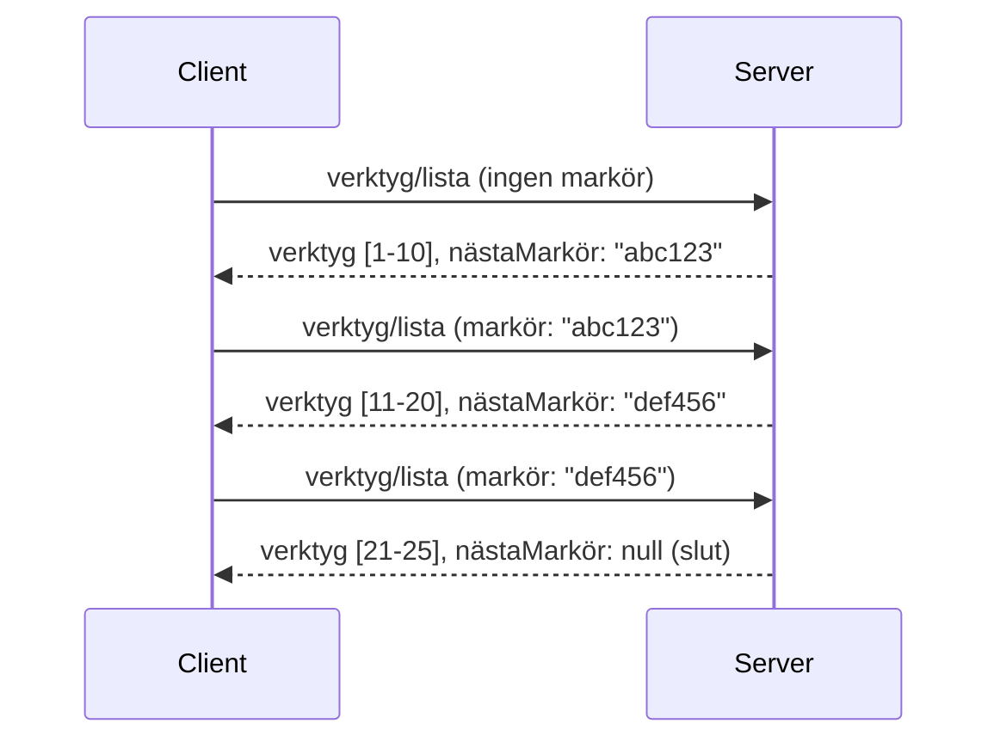

# Paginering och Stora Resultatset i MCP

När din MCP-server hanterar stora datamängder - oavsett om det är tusentals filer, databasposter eller sökresultat - behöver du paginering för att hantera minnet effektivt och ge en responsiv användarupplevelse. Denna guide täcker hur man implementerar och använder paginering i MCP.

## Varför Paginering Är Viktigt

Utan paginering kan stora svar orsaka:

- **Minnesutarmning** - Läser in miljontals poster på en gång
- **Långa svarstider** - Användare väntar medan all data laddas
- **Timeout-fel** - Förfrågningar överskrider tidsgränser
- **Dålig AI-prestanda** - LLM:er har svårt med massiv kontext

MCP använder **kursorbaserad paginering** för pålitlig, konsekvent sidindelning genom resultatset.

---

## Hur MCP Paginering Fungerar

### Kursorbegreppet

En **kursor** är en ogenomskinlig sträng som markerar din position i ett resultatset. Tänk på det som en bokmärke i en tjock bok.


### Paginering i MCP-metoder

Dessa MCP-metoder stödjer paginering:

| Metod | Returnerar | Cursor-support |
|--------|---------|----------------|
| `tools/list` | Verktygsdefinitioner | ✅ |
| `resources/list` | Resursdefinitioner | ✅ |
| `prompts/list` | Prompt-definitioner | ✅ |
| `resources/templates/list` | Resursmallar | ✅ |

---

## Serverimplementation

### Python (FastMCP)

```python
from mcp.server import Server
from mcp.types import Tool, ListToolsResult
import math

app = Server("paginated-server")

# Simulerad stor datamängd
ALL_TOOLS = [
    Tool(name=f"tool_{i}", description=f"Tool number {i}", inputSchema={})
    for i in range(100)
]

PAGE_SIZE = 10

@app.list_tools()
async def list_tools(cursor: str | None = None) -> ListToolsResult:
    """List tools with pagination support."""
    
    # Avkoda markör för att få startindex
    start_index = 0
    if cursor:
        try:
            start_index = int(cursor)
        except ValueError:
            start_index = 0
    
    # Hämta resultatsida
    end_index = min(start_index + PAGE_SIZE, len(ALL_TOOLS))
    page_tools = ALL_TOOLS[start_index:end_index]
    
    # Beräkna nästa markör
    next_cursor = None
    if end_index < len(ALL_TOOLS):
        next_cursor = str(end_index)
    
    return ListToolsResult(
        tools=page_tools,
        nextCursor=next_cursor
    )
```

### TypeScript

```typescript
import { Server } from "@modelcontextprotocol/sdk/server/index.js";
import { ListToolsResultSchema } from "@modelcontextprotocol/sdk/types.js";

const server = new Server({
  name: "paginated-server",
  version: "1.0.0"
});

// Simulerad stor dataset
const ALL_TOOLS = Array.from({ length: 100 }, (_, i) => ({
  name: `tool_${i}`,
  description: `Tool number ${i}`,
  inputSchema: { type: "object", properties: {} }
}));

const PAGE_SIZE = 10;

server.setRequestHandler(ListToolsResultSchema, async (request) => {
  // Avkoda markör
  let startIndex = 0;
  if (request.params?.cursor) {
    startIndex = parseInt(request.params.cursor, 10) || 0;
  }
  
  // Hämta sida med resultat
  const endIndex = Math.min(startIndex + PAGE_SIZE, ALL_TOOLS.length);
  const pageTools = ALL_TOOLS.slice(startIndex, endIndex);
  
  // Beräkna nästa markör
  const nextCursor = endIndex < ALL_TOOLS.length ? String(endIndex) : undefined;
  
  return {
    tools: pageTools,
    nextCursor
  };
});
```

### Java (Spring MCP)

```java
@Service
public class PaginatedToolService {
    
    private static final int PAGE_SIZE = 10;
    private final List<Tool> allTools;
    
    public PaginatedToolService() {
        // Initiera stor dataset
        this.allTools = IntStream.range(0, 100)
            .mapToObj(i -> new Tool("tool_" + i, "Tool number " + i, Map.of()))
            .collect(Collectors.toList());
    }
    
    @McpMethod("tools/list")
    public ListToolsResult listTools(@Param("cursor") String cursor) {
        // Avkoda markören
        int startIndex = 0;
        if (cursor != null && !cursor.isEmpty()) {
            try {
                startIndex = Integer.parseInt(cursor);
            } catch (NumberFormatException e) {
                startIndex = 0;
            }
        }
        
        // Hämta sida med resultat
        int endIndex = Math.min(startIndex + PAGE_SIZE, allTools.size());
        List<Tool> pageTools = allTools.subList(startIndex, endIndex);
        
        // Beräkna nästa markör
        String nextCursor = endIndex < allTools.size() ? String.valueOf(endIndex) : null;
        
        return new ListToolsResult(pageTools, nextCursor);
    }
}
```

---

## Klientimplementation

### Python-klient

```python
from mcp import ClientSession

async def get_all_tools(session: ClientSession) -> list:
    """Fetch all tools using pagination."""
    all_tools = []
    cursor = None
    
    while True:
        result = await session.list_tools(cursor=cursor)
        all_tools.extend(result.tools)
        
        if result.nextCursor is None:
            break
        cursor = result.nextCursor
    
    return all_tools

# Användning
async with client_session as session:
    tools = await get_all_tools(session)
    print(f"Found {len(tools)} tools")
```

### TypeScript-klient

```typescript
import { Client } from "@modelcontextprotocol/sdk/client/index.js";

async function getAllTools(client: Client): Promise<Tool[]> {
  const allTools: Tool[] = [];
  let cursor: string | undefined = undefined;
  
  do {
    const result = await client.listTools({ cursor });
    allTools.push(...result.tools);
    cursor = result.nextCursor;
  } while (cursor);
  
  return allTools;
}

// Användning
const tools = await getAllTools(client);
console.log(`Found ${tools.length} tools`);
```

### Lazy Loading-mönster

För mycket stora datamängder, ladda sidor vid behov:

```python
class PaginatedToolIterator:
    """Lazily iterate through paginated tools."""
    
    def __init__(self, session: ClientSession):
        self.session = session
        self.cursor = None
        self.buffer = []
        self.exhausted = False
    
    async def __anext__(self):
        # Returnera från bufferten om tillgänglig
        if self.buffer:
            return self.buffer.pop(0)
        
        # Kontrollera om vi har gått igenom alla sidor
        if self.exhausted:
            raise StopAsyncIteration
        
        # Hämta nästa sida
        result = await self.session.list_tools(cursor=self.cursor)
        self.buffer = list(result.tools)
        self.cursor = result.nextCursor
        
        if self.cursor is None:
            self.exhausted = True
        
        if not self.buffer:
            raise StopAsyncIteration
        
        return self.buffer.pop(0)
    
    def __aiter__(self):
        return self

# Användning - minnes-effektivt för stora datamängder
async for tool in PaginatedToolIterator(session):
    process_tool(tool)
```

---

## Paginering för Resurser

Resurser behöver ofta paginering för kataloger eller stora dataset:

```python
from mcp.server import Server
from mcp.types import Resource, ListResourcesResult
import os

app = Server("file-server")

@app.list_resources()
async def list_resources(cursor: str | None = None) -> ListResourcesResult:
    """List files in directory with pagination."""
    
    directory = "/data/files"
    all_files = sorted(os.listdir(directory))
    
    # Avkoda markör (filindex)
    start_index = int(cursor) if cursor else 0
    page_size = 20
    end_index = min(start_index + page_size, len(all_files))
    
    # Skapa resurslista för denna sida
    resources = []
    for filename in all_files[start_index:end_index]:
        filepath = os.path.join(directory, filename)
        resources.append(Resource(
            uri=f"file://{filepath}",
            name=filename,
            mimeType="application/octet-stream"
        ))
    
    # Beräkna nästa markör
    next_cursor = str(end_index) if end_index < len(all_files) else None
    
    return ListResourcesResult(
        resources=resources,
        nextCursor=next_cursor
    )
```

---

## Kursor-Designstrategier

### Strategi 1: Index-baserad (Enkel)

```python
# Markören är bara indexet
cursor = "50"  # Börja vid objekt 50
```

**Fördelar:** Enkel, statslös  
**Nackdelar:** Resultat kan skifta om objekt läggs till/tas bort

### Strategi 2: ID-baserad (Stabil)

```python
# Markören är det senast sedda ID:t
cursor = "item_abc123"  # Börja efter denna post
```

**Fördelar:** Stabil även om objekt ändras  
**Nackdelar:** Kräver ordnade ID:n

### Strategi 3: Kodad Status (Komplex)

```python
import base64
import json

def encode_cursor(state: dict) -> str:
    return base64.b64encode(json.dumps(state).encode()).decode()

def decode_cursor(cursor: str) -> dict:
    return json.loads(base64.b64decode(cursor).decode())

# Markören innehåller flera statusfält
cursor = encode_cursor({
    "offset": 50,
    "filter": "active",
    "sort": "name"
})
```

**Fördelar:** Kan koda komplex status  
**Nackdelar:** Mer komplex, större kursorsträngar

---

## Bästa Praxis

### 1. Välj Passande Sidstorlekar

```python
# Tänk på datas storlek
PAGE_SIZE_SMALL_ITEMS = 100   # Enkel metadata
PAGE_SIZE_MEDIUM_ITEMS = 20   # Mer detaljerade objekt
PAGE_SIZE_LARGE_ITEMS = 5     # Komplext innehåll
```

### 2. Hantera Ogiltiga Kursorer Smidigt

```python
@app.list_tools()
async def list_tools(cursor: str | None = None) -> ListToolsResult:
    try:
        start_index = int(cursor) if cursor else 0
        if start_index < 0 or start_index >= len(ALL_TOOLS):
            start_index = 0  # Återställ till början
    except (ValueError, TypeError):
        start_index = 0  # Ogiltig markör, börja om
    # ...
```

### 3. Inkludera Totalt Antal (Valfritt)

```python
return ListToolsResult(
    tools=page_tools,
    nextCursor=next_cursor,
    # Vissa implementationer inkluderar totalt för UI-framsteg
    _meta={"total": len(ALL_TOOLS)}
)
```

### 4. Testa Gränsfall

```python
async def test_pagination():
    # Tomt resultatuppsättning
    result = await session.list_tools()
    assert result.tools == []
    assert result.nextCursor is None
    
    # Enkel sida
    result = await session.list_tools()
    assert len(result.tools) <= PAGE_SIZE
    
    # Ogiltig markör
    result = await session.list_tools(cursor="invalid")
    assert result.tools  # Bör returnera första sidan
```

---

## Vanliga Fallgropar

### ❌ Returnera Alla Resultat och Paginerar på Klientsidan

```python
# DÅLIGT: Laddar allt till minnet
@app.list_tools()
async def list_tools() -> ListToolsResult:
    all_tools = load_all_tools()  # 1 miljon verktyg!
    return ListToolsResult(tools=all_tools)
```

### ✅ Paginerar vid Datakällan

```python
# BRA: Laddar bara det som behövs
@app.list_tools()
async def list_tools(cursor: str | None = None) -> ListToolsResult:
    offset = int(cursor) if cursor else 0
    tools = await db.query_tools(offset=offset, limit=PAGE_SIZE)
    return ListToolsResult(tools=tools, nextCursor=...)
```

---

## Vad Är Nästa

- [Modul 5.14 - Kontextteknik](../../05-AdvancedTopics/mcp-contextengineering/README.md)
- [Modul 8 - Bästa Praxis](../../08-BestPractices/README.md)
- [3.8 - Testa Din MCP-server](../../03-GettingStarted/08-testing/README.md)

---

## Ytterligare Resurser

- [MCP-specifikation - Paginering](https://spec.modelcontextprotocol.io/specification/2025-11-25/)
- [Kursorbaserad Paginering Förklarad](https://slack.engineering/evolving-api-pagination-at-slack/)
- [Python SDK paginerings tester](https://github.com/modelcontextprotocol/python-sdk/blob/main/tests/client/test_list_methods_cursor.py)

---

<!-- CO-OP TRANSLATOR DISCLAIMER START -->
**Ansvarsfriskrivning**:
Detta dokument har översatts med hjälp av AI-översättningstjänsten [Co-op Translator](https://github.com/Azure/co-op-translator). Trots att vi strävar efter noggrannhet kan automatiska översättningar innehålla fel eller brister. Det ursprungliga dokumentet på dess ursprungliga språk bör betraktas som den auktoritativa källan. För kritisk information rekommenderas professionell mänsklig översättning. Vi ansvarar inte för några missförstånd eller feltolkningar som uppstår vid användning av denna översättning.
<!-- CO-OP TRANSLATOR DISCLAIMER END -->