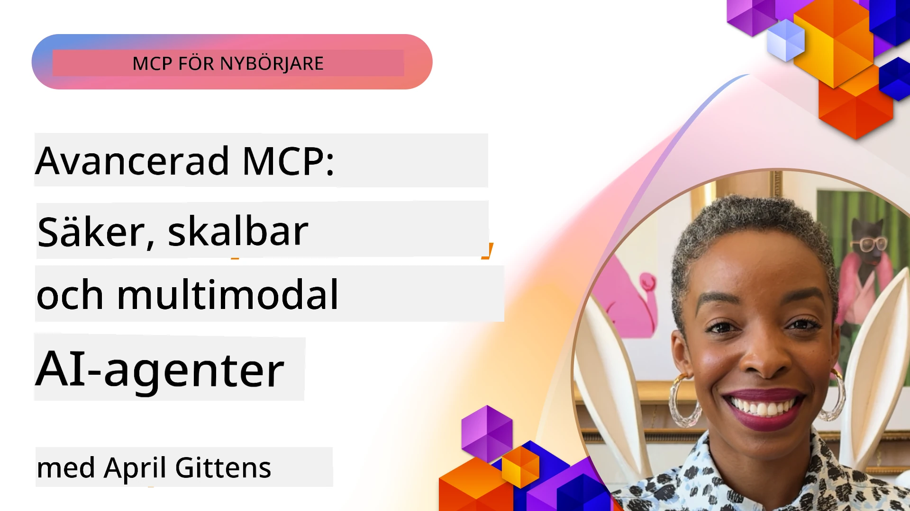

# Avancerade ämnen i MCP

_(Klicka på bilden ovan för att se videon av denna lektion)_

Detta kapitel täcker en serie avancerade ämnen inom implementering av Model Context Protocol (MCP), inklusive multimodal integration, skalbarhet, säkerhetsbästa praxis och företagsintegration. Dessa ämnen är avgörande för att bygga robusta och produktionsklara MCP-applikationer som kan möta kraven från moderna AI-system.

## Översikt

Denna lektion utforskar avancerade koncept inom implementering av Model Context Protocol med fokus på multimodal integration, skalbarhet, säkerhetsbästa praxis och företagsintegration. Dessa ämnen är viktiga för att bygga produktionsmogna MCP-applikationer som kan hantera komplexa krav i företagsmiljöer.

## Lärandemål

I slutet av denna lektion kommer du att kunna:

- Implementera multimodala möjligheter inom MCP-ramverk
- Designa skalbara MCP-arkitekturer för högbelastade scenarier
- Tillämpa säkerhetsbästa praxis i linje med MCP:s säkerhetsprinciper
- Integrera MCP med företags-AI-system och ramverk
- Optimera prestanda och tillförlitlighet i produktionsmiljöer

## Lektioner och exempelprojekt

| Länk | Titel | Beskrivning |
|------|-------|-------------|
| [5.1 Integration with Azure](./mcp-integration/README.md) | Integrera med Azure | Lär dig hur du integrerar din MCP-server på Azure |
| [5.2 Multi modal sample](./mcp-multi-modality/README.md) | MCP Multimodala exempel | Exempel för ljud, bild och multimodala svar |
| [5.3 MCP OAuth2 sample](../../../05-AdvancedTopics/mcp-oauth2-demo) | MCP OAuth2 Demo | Minimal Spring Boot-app som visar OAuth2 med MCP, både som auktorisations- och resursserver. Demonstrerar säker tokenutfärdande, skyddade slutpunkter, distribution till Azure Container Apps, och API Management-integration. |
| [5.4 Root Contexts](./mcp-root-contexts/README.md) | Root contexts | Lär dig mer om root context och hur du implementerar dem |
| [5.5 Routing](./mcp-routing/README.md) | Routing | Lär dig olika typer av routing |
| [5.6 Sampling](./mcp-sampling/README.md) | Sampling | Lär dig hur du arbetar med sampling |
| [5.7 Scaling](./mcp-scaling/README.md) | Skalning | Lär dig om skalning |
| [5.8 Security](./mcp-security/README.md) | Säkerhet | Säkra din MCP-server |
| [5.9 Web Search sample](./web-search-mcp/README.md) | Webbsearch MCP | Python MCP-server och klient som integrerar med SerpAPI för realtidswebb-, nyhets-, produkt-sökning och Q&A. Demonstrerar multitoolsorkestrering, extern API-integration och robust felhantering. |
| [5.10 Realtime Streaming](./mcp-realtimestreaming/README.md) | Streaming | Realtidsdata-streaming har blivit essentiellt i dagens datadrivna värld där företag och applikationer kräver omedelbar tillgång till information för att fatta snabba beslut. |
| [5.11 Realtime Web Search](./mcp-realtimesearch/README.md) | Webbsearch | Realtidswebbsökning - hur MCP förändrar realtidswebbsökning genom att tillhandahålla ett standardiserat tillvägagångssätt för kontexthantering över AI-modeller, sökmotorer och applikationer. |
| [5.12 Entra ID Authentication for Model Context Protocol Servers](./mcp-security-entra/README.md) | Entra ID-autentisering | Microsoft Entra ID erbjuder en robust molnbaserad lösning för identitets- och åtkomsthantering som hjälper till att säkerställa att endast auktoriserade användare och applikationer kan interagera med din MCP-server. |
| [5.13 Azure AI Foundry Agent Integration](./mcp-foundry-agent-integration/README.md) | Azure AI Foundry-integration | Lär dig hur du integrerar Model Context Protocol-servrar med Azure AI Foundry-agent, vilket möjliggör kraftfull orkestrering av verktyg och företags-AI-kapabiliteter med standardiserade anslutningar till externa datakällor. |
| [5.14 Context Engineering](./mcp-contextengineering/README.md) | Kontextteknik | Framtida möjligheter med kontextteknik för MCP-servrar, inklusive kontextoptimering, dynamisk kontexthantering och strategier för effektiv prompt-engineering inom MCP-ramverk. |
| [5.15 MCP Custom Transport](./mcp-transport/README.md) | Anpassad transport | Lär dig hur du implementerar anpassade transportmekanismer för specialiserade MCP-kommunikationsscenarier. |
| [5.16 Protocol Features Deep Dive](./mcp-protocol-features/README.md) | Protokollfunktioner | Bemästra avancerade protokollfunktioner inklusive progressnotifikationer, avbokning av förfrågningar, resursmallar och felhanteringsmönster. |

> **Nyhet i MCP-specifikation 2025-11-25**: Specifikationen inkluderar nu experimentellt stöd för **Uppgifter** (långvariga operationer med framstegsspårning), **Verktygsanteckningar** (metadata om verktygsbeteende för säkerhet), **URL Mode Elicitation** (begäran om specifikt URL-innehåll från klienter) och förbättrade **Roots** (för hantering av arbetsytans kontext). Se [MCP Specification changelog](https://spec.modelcontextprotocol.io/) för fullständiga detaljer.

## Ytterligare referenser

För den mest aktuella informationen om avancerade MCP-ämnen, hänvisa till:
- [MCP-dokumentation](https://modelcontextprotocol.io/)
- [MCP-specifikation (2025-11-25)](https://spec.modelcontextprotocol.io/specification/2025-11-25/)
- [GitHub Repository](https://github.com/modelcontextprotocol)
- [OWASP MCP Top 10](https://microsoft.github.io/mcp-azure-security-guide/mcp/) - Säkerhetsrisker och åtgärder
- [MCP Security Summit Workshop (Sherpa)](https://azure-samples.github.io/sherpa/) - Praktisk säkerhetsutbildning

## Viktiga lärdomar

- Multimodala MCP-implementeringar utökar AI:s kapabiliteter bortom textbearbetning
- Skalbarhet är avgörande för företagsdistributioner och kan lösas genom horisontell och vertikal skalning
- Omfattande säkerhetsåtgärder skyddar data och säkerställer korrekt åtkomstkontroll
- Företagsintegration med plattformar som Azure OpenAI och Microsoft AI Foundry förbättrar MCP-kapabiliteter
- Avancerade MCP-implementeringar gynnas av optimerade arkitekturer och noggrann resursförvaltning

## Övning

Designa en företagsklassad MCP-implementation för ett specifikt användningsfall:

1. Identifiera multimodala krav för ditt användningsfall
2. Skissera säkerhetskontroller som behövs för att skydda känslig data
3. Designa en skalbar arkitektur som kan hantera varierande belastning
4. Planera integrationspunkter med företags-AI-system
5. Dokumentera potentiella prestandaflaskhalsar och åtgärdsstrategier

## Ytterligare resurser

- [Azure OpenAI-dokumentation](https://learn.microsoft.com/en-us/azure/ai-services/openai/)
- [Microsoft AI Foundry-dokumentation](https://learn.microsoft.com/en-us/ai-services/)

---

## Vad händer härnäst

Utforska lektionsserien i denna modul med start från: [5.1 MCP Integration](./mcp-integration/README.md)

När du har slutfört denna modul, fortsätt till: [Modul 6: Community Contributions](../06-CommunityContributions/README.md)

---

<!-- CO-OP TRANSLATOR DISCLAIMER START -->
**Disclaimer**:
Detta dokument har översatts med hjälp av AI-översättningstjänsten [Co-op Translator](https://github.com/Azure/co-op-translator). Vi strävar efter noggrannhet, men var medveten om att automatiska översättningar kan innehålla fel eller brister. Det ursprungliga dokumentet på dess ursprungliga språk ska betraktas som den auktoritativa källan. För kritisk information rekommenderas professionell mänsklig översättning. Vi ansvarar inte för eventuella missförstånd eller feltolkningar som uppstår genom användning av denna översättning.
<!-- CO-OP TRANSLATOR DISCLAIMER END -->