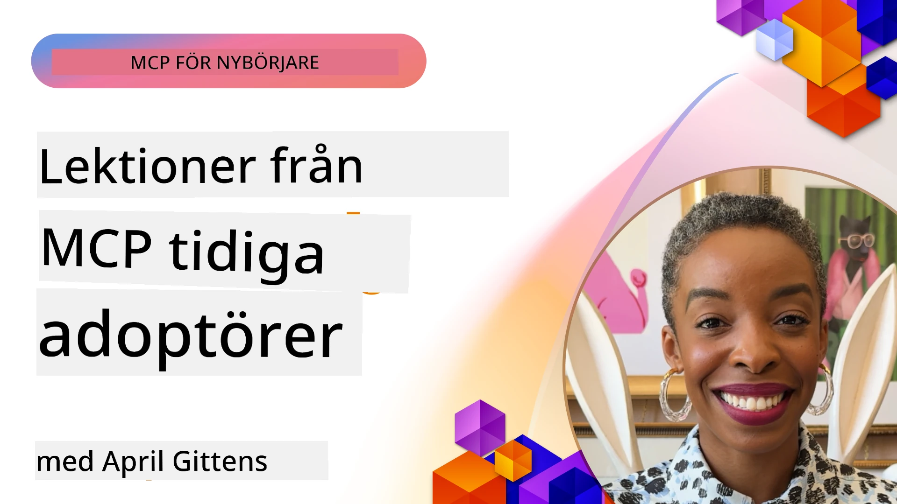

# 🌟 Lärdomar från tidiga användare

[](https://youtu.be/jds7dSmNptE)

_(Klicka på bilden ovan för att se videon av denna lektion)_

## 🎯 Vad den här modulen täcker

Den här modulen utforskar hur riktiga organisationer och utvecklare använder Model Context Protocol (MCP) för att lösa verkliga utmaningar och driva innovation. Genom detaljerade fallstudier, praktiska projekt och konkreta exempel upptäcker du hur MCP möjliggör säker, skalbar AI-integration som kopplar samman språkmodeller, verktyg och företagsdata.

### 📚 Se MCP i praktiken

Vill du se dessa principer tillämpas på produktionsklara verktyg? Kolla in våra [**10 Microsoft MCP-servrar som transformerar utvecklarproduktivitet**](microsoft-mcp-servers.md), som visar verkliga Microsoft MCP-servrar du kan använda idag.

## Översikt

Denna lektion utforskar hur tidiga användare har använt Model Context Protocol (MCP) för att lösa verkliga problem och driva innovation inom olika branscher. Genom detaljerade fallstudier och praktiska projekt får du se hur MCP möjliggör standardiserad, säker och skalbar AI-integration—med en enhetlig ram som kopplar samman stora språkmodeller, verktyg och företagsdata. Du får praktisk erfarenhet av att designa och bygga lösningar baserade på MCP, lära dig av beprövade implementationsmönster och upptäcka bästa praxis för driftsättning av MCP i produktionsmiljöer. Lektionen lyfter också fram nya trender, framtida riktningar och open source-resurser för att hjälpa dig att ligga i framkant av MCP-tekniken och dess utvecklande ekosystem.

## Lärandemål

- Analysera verkliga MCP-implementationer inom olika branscher  
- Designa och bygg kompletta MCP-baserade applikationer  
- Utforska framväxande trender och framtida riktningar inom MCP-teknologi  
- Tillämpa bästa praxis i faktiska utvecklingsscenarier  

## Verkliga MCP-implementationer

### Fallstudie 1: Automatisering av kundsupport för företag

Ett multinationellt företag implementerade en MCP-baserad lösning för att standardisera AI-interaktioner inom sina kundsupportsystem. Detta gjorde det möjligt för dem att:

- Skapa ett enhetligt gränssnitt för flera LLM-leverantörer  
- Bibehålla konsekvent prompt-hantering över avdelningar  
- Implementera robusta säkerhets- och efterlevnadskontroller  
- Enkelt byta mellan olika AI-modeller baserat på specifika behov  

**Teknisk implementation:**

```python
# Python MCP-serverimplementation för kundsupport
import logging
import asyncio
from modelcontextprotocol import create_server, ServerConfig
from modelcontextprotocol.server import MCPServer
from modelcontextprotocol.transports import create_http_transport
from modelcontextprotocol.resources import ResourceDefinition
from modelcontextprotocol.prompts import PromptDefinition
from modelcontextprotocol.tool import ToolDefinition

# Konfigurera loggning
logging.basicConfig(level=logging.INFO)

async def main():
    # Skapa serverkonfiguration
    config = ServerConfig(
        name="Enterprise Customer Support Server",
        version="1.0.0",
        description="MCP server for handling customer support inquiries"
    )
    
    # Initiera MCP-server
    server = create_server(config)
    
    # Registrera kunskapsbasresurser
    server.resources.register(
        ResourceDefinition(
            name="customer_kb",
            description="Customer knowledge base documentation"
        ),
        lambda params: get_customer_documentation(params)
    )
    
    # Registrera promptmallar
    server.prompts.register(
        PromptDefinition(
            name="support_template",
            description="Templates for customer support responses"
        ),
        lambda params: get_support_templates(params)
    )
    
    # Registrera supportverktyg
    server.tools.register(
        ToolDefinition(
            name="ticketing",
            description="Create and update support tickets"
        ),
        handle_ticketing_operations
    )
    
    # Starta server med HTTP-transport
    transport = create_http_transport(port=8080)
    await server.run(transport)

if __name__ == "__main__":
    asyncio.run(main())
```
  
**Resultat:** 30 % minskning av modellkostnader, 45 % förbättring av svarskonsekvens och förbättrad efterlevnad globalt.

### Fallstudie 2: Diagnostisk assistent för vården

En vårdgivare utvecklade en MCP-infrastruktur för att integrera flera specialiserade medicinska AI-modeller samtidigt som känslig patientdata skyddades:

- Sömlös växling mellan generalist- och specialistmodeller inom medicin  
- Strikta integritetskontroller och revisionsspår  
- Integration med befintliga elektroniska patientjournalssystem (EHR)  
- Konsekvent prompt-engineering för medicinsk terminologi  

**Teknisk implementation:**

```csharp
// C# MCP host application implementation in healthcare application
using Microsoft.Extensions.DependencyInjection;
using ModelContextProtocol.SDK.Client;
using ModelContextProtocol.SDK.Security;
using ModelContextProtocol.SDK.Resources;

public class DiagnosticAssistant
{
    private readonly MCPHostClient _mcpClient;
    private readonly PatientContext _patientContext;
    
    public DiagnosticAssistant(PatientContext patientContext)
    {
        _patientContext = patientContext;
        
        // Configure MCP client with healthcare-specific settings
        var clientOptions = new ClientOptions
        {
            Name = "Healthcare Diagnostic Assistant",
            Version = "1.0.0",
            Security = new SecurityOptions
            {
                Encryption = EncryptionLevel.Medical,
                AuditEnabled = true
            }
        };
        
        _mcpClient = new MCPHostClientBuilder()
            .WithOptions(clientOptions)
            .WithTransport(new HttpTransport("https://healthcare-mcp.example.org"))
            .WithAuthentication(new HIPAACompliantAuthProvider())
            .Build();
    }
    
    public async Task<DiagnosticSuggestion> GetDiagnosticAssistance(
        string symptoms, string patientHistory)
    {
        // Create request with appropriate resources and tool access
        var resourceRequest = new ResourceRequest
        {
            Name = "patient_records",
            Parameters = new Dictionary<string, object>
            {
                ["patientId"] = _patientContext.PatientId,
                ["requestingProvider"] = _patientContext.ProviderId
            }
        };
        
        // Request diagnostic assistance using appropriate prompt
        var response = await _mcpClient.SendPromptRequestAsync(
            promptName: "diagnostic_assistance",
            parameters: new Dictionary<string, object>
            {
                ["symptoms"] = symptoms,
                patientHistory = patientHistory,
                relevantGuidelines = _patientContext.GetRelevantGuidelines()
            });
            
        return DiagnosticSuggestion.FromMCPResponse(response);
    }
}
```
  
**Resultat:** Förbättrade diagnosförslag för läkare samtidigt som full HIPAA-efterlevnad bibehölls och betydande minskning av kontextbyten mellan system.

### Fallstudie 3: Riskanalys inom finanssektorn

En finansinstitution implementerade MCP för att standardisera sina riskanalysprocesser över olika avdelningar:

- Skapade ett enhetligt gränssnitt för kreditrisk, bedrägeridetektion och investeringsriskmodeller  
- Implementerade strikta åtkomstkontroller och modellversionering  
- Säkerställde revisionsbarhet för alla AI-rekommendationer  
- Bibehöll konsekvent dataformat över olika system  

**Teknisk implementation:**

```java
// Java MCP-server för finansiell riskbedömning
import org.mcp.server.*;
import org.mcp.security.*;

public class FinancialRiskMCPServer {
    public static void main(String[] args) {
        // Skapa MCP-server med funktioner för finansiell efterlevnad
        MCPServer server = new MCPServerBuilder()
            .withModelProviders(
                new ModelProvider("risk-assessment-primary", new AzureOpenAIProvider()),
                new ModelProvider("risk-assessment-audit", new LocalLlamaProvider())
            )
            .withPromptTemplateDirectory("./compliance/templates")
            .withAccessControls(new SOCCompliantAccessControl())
            .withDataEncryption(EncryptionStandard.FINANCIAL_GRADE)
            .withVersionControl(true)
            .withAuditLogging(new DatabaseAuditLogger())
            .build();
            
        server.addRequestValidator(new FinancialDataValidator());
        server.addResponseFilter(new PII_RedactionFilter());
        
        server.start(9000);
        
        System.out.println("Financial Risk MCP Server running on port 9000");
    }
}
```
  
**Resultat:** Förbättrad regulatorisk efterlevnad, 40 % snabbare cykler för modellimplementering och förbättrad konsekvens i riskbedömningar över avdelningar.

### Fallstudie 4: Microsoft Playwright MCP-server för browserautomatisering

Microsoft utvecklade [Playwright MCP-servern](https://github.com/microsoft/playwright-mcp) för att möjliggöra säker, standardiserad browserautomatisering genom Model Context Protocol. Denna produktionsklara server tillåter AI-agenter och LLM:er att interagera med webbläsare på ett kontrollerat, granskningsbart och utbyggbart sätt—möjliggör användningsfall som automatiserad webbtestning, datautvinning och ända-till-ända-arbetsflöden.

> **🎯 Produktionsklart verktyg**  
>  
> Denna fallstudie visar upp en riktig MCP-server som du kan använda idag! Läs mer om Playwright MCP Server och 9 andra produktionsklara Microsoft MCP-servrar i vår [**Microsoft MCP Servers Guide**](microsoft-mcp-servers.md#8--playwright-mcp-server).

**Nyckelfunktioner:**  
- Exponerar browserautomationsfunktioner (navigering, formulärfyllning, skärmdumpsupptagning, etc.) som MCP-verktyg  
- Implementerar strikta åtkomstkontroller och sandboxing för att förhindra obehöriga åtgärder  
- Levererar detaljerade granskningsloggar för alla browserinteraktioner  
- Stöder integration med Azure OpenAI och andra LLM-leverantörer för agentdriven automation  
- Driver GitHub Copilots Coding Agent med webbläsarfunktioner  

**Teknisk implementation:**

```typescript
// TypeScript: Registrerar Playwright webbläsarautomationsverktyg i en MCP-server
import { createServer, ToolDefinition } from 'modelcontextprotocol';
import { launch } from 'playwright';

const server = createServer({
  name: 'Playwright MCP Server',
  version: '1.0.0',
  description: 'MCP server for browser automation using Playwright'
});

// Registrera ett verktyg för att navigera till en URL och ta en skärmdump
server.tools.register(
  new ToolDefinition({
    name: 'navigate_and_screenshot',
    description: 'Navigate to a URL and capture a screenshot',
    parameters: {
      url: { type: 'string', description: 'The URL to visit' }
    }
  }),
  async ({ url }) => {
    const browser = await launch();
    const page = await browser.newPage();
    await page.goto(url);
    const screenshot = await page.screenshot();
    await browser.close();
    return { screenshot };
  }
);

// Starta MCP-servern
server.listen(8080);
```
  
**Resultat:**  

- Möjliggjorde säker, programmerbar browserautomatisering för AI-agenter och LLM:er  
- Minskat manuellt testarbete och förbättrad testtäckning för webbapplikationer  
- Levererade en återanvändbar, utbyggbar ram för verktygsintegration baserad på webbläsare i företagsmiljöer  
- Driver GitHub Copilots webbläsarfunktioner

**Referenser:**

- [Playwright MCP Server GitHub Repository](https://github.com/microsoft/playwright-mcp)  
- [Microsoft AI och Automationslösningar](https://azure.microsoft.com/en-us/products/ai-services/)

### Fallstudie 5: Azure MCP – Företagsklassad Model Context Protocol som en tjänst

Azure MCP Server ([https://aka.ms/azmcp](https://aka.ms/azmcp)) är Microsofts hanterade, företagsklassade implementation av Model Context Protocol, designad för att erbjuda skalbara, säkra och efterlevnadsmässiga MCP-serverfunktioner som en molntjänst. Azure MCP gör det möjligt för organisationer att snabbt driftsätta, hantera och integrera MCP-servrar med Azure AI, data- och säkerhetstjänster, vilket minskar operativ börda och påskyndar AI-antagande.

> **🎯 Produktionsklart verktyg**  
>  
> Detta är en riktig MCP-server som du kan använda idag! Läs mer om Azure AI Foundry MCP Server i vår [**Microsoft MCP Servers Guide**](microsoft-mcp-servers.md).

- Fullt hanterad MCP-serverhosting med inbyggd skalning, övervakning och säkerhet  
- Naturlig integration med Azure OpenAI, Azure AI Search och andra Azure-tjänster  
- Företagsautentisering och auktorisation via Microsoft Entra ID  
- Stöd för anpassade verktyg, promptmallar och resurskopplingar  
- Efterlevnad av företags säkerhet och regulatoriska krav  

**Teknisk implementation:**

```yaml
# Example: Azure MCP server deployment configuration (YAML)
apiVersion: mcp.microsoft.com/v1
kind: McpServer
metadata:
  name: enterprise-mcp-server
spec:
  modelProviders:
    - name: azure-openai
      type: AzureOpenAI
      endpoint: https://<your-openai-resource>.openai.azure.com/
      apiKeySecret: <your-azure-keyvault-secret>
  tools:
    - name: document_search
      type: AzureAISearch
      endpoint: https://<your-search-resource>.search.windows.net/
      apiKeySecret: <your-azure-keyvault-secret>
  authentication:
    type: EntraID
    tenantId: <your-tenant-id>
  monitoring:
    enabled: true
    logAnalyticsWorkspace: <your-log-analytics-id>
```
  
**Resultat:**  
- Reducerad tid till värde för företags-AI-projekt genom att erbjuda en färdig MCP-serverplattform  
- Förenklad integration av LLM, verktyg och företagsdatakällor  
- Förbättrad säkerhet, observerbarhet och operativ effektivitet för MCP-arbetsbelastningar  
- Förbättrad kodkvalitet med Azure SDK bästa praxis och aktuella autentiseringsmönster  

**Referenser:**  
- [Azure MCP Dokumentation](https://aka.ms/azmcp)  
- [Azure MCP Server GitHub Repository](https://github.com/Azure/azure-mcp)  
- [Azure AI-tjänster](https://azure.microsoft.com/en-us/products/ai-services/)  
- [Microsoft MCP Center](https://mcp.azure.com)

## Fallstudie 6: NLWeb  
MCP (Model Context Protocol) är ett framväxande protokoll för chattbotar och AI-assistenter att interagera med verktyg. Varje NLWeb-instans är också en MCP-server, som stödjer en kärnmetod, ask, som används för att ställa en webbplats en fråga på naturligt språk. Det returnerade svaret använder schema.org, ett allmänt använt vokabulär för att beskriva webbdatan. Löst uttryckt är MCP för NLWeb som Http är för HTML. NLWeb kombinerar protokoll, Schema.org-format och exempelkod för att hjälpa webbplatser att snabbt skapa dessa slutpunkter, vilket gynnar både människor genom konversationsgränssnitt och maskiner genom naturlig agent-till-agent-interaktion.

Det finns två distinkta komponenter i NLWeb.  
- Ett protokoll, mycket enkelt från början, för att gränssnitt med en webbplats på naturligt språk och ett format som använder json och schema.org för det returnerade svaret. Se dokumentationen om REST API för mer detaljer.  
- En enkel implementation av (1) som använder befintlig markup för webbplatser som kan abstraheras som listor med objekt (produkter, recept, attraktioner, recensioner etc.). Tillsammans med en uppsättning användargränssnitts-widgets kan webbplatser enkelt tillhandahålla konversationsgränssnitt till sitt innehåll. Se dokumentationen om Life of a chat query för mer detaljer om hur detta fungerar.  

**Referenser:**  
- [Azure MCP Dokumentation](https://aka.ms/azmcp)  
- [NLWeb](https://github.com/microsoft/NlWeb)

### Fallstudie 7: Azure AI Foundry MCP Server – Enterprise AI-agentintegration

Azure AI Foundry MCP-servrar visar hur MCP kan användas för att orkestrera och hantera AI-agenter och arbetsflöden i företagsmiljöer. Genom att integrera MCP med Azure AI Foundry kan organisationer standardisera agentinteraktioner, utnyttja Foundrys arbetsflödeshantering och säkerställa säkra, skalbara driftsättningar.

> **🎯 Produktionsklart verktyg**  
>  
> Detta är en riktig MCP-server som du kan använda idag! Läs mer om Azure AI Foundry MCP Server i vår [**Microsoft MCP Servers Guide**](microsoft-mcp-servers.md#9--azure-ai-foundry-mcp-server).

**Nyckelfunktioner:**  
- Omfattande tillgång till Azures AI-ekosystem, inklusive modellkataloger och driftsättningshantering  
- Kunskapsindexering med Azure AI Search för RAG-applikationer  
- Utvärderingsverktyg för AI-modellprestanda och kvalitetskontroll  
- Integration med Azure AI Foundry Catalog och Labs för banbrytande forskningsmodeller  
- Agenthantering och utvärderingsfunktioner för produktionsscenarier  

**Resultat:**  
- Snabb prototypframtagning och robust övervakning av AI-agenters arbetsflöden  
- Sömlös integration med Azure AI-tjänster för avancerade scenarier  
- Enhetligt gränssnitt för att bygga, driftsätta och övervaka agentpipelines  
- Förbättrad säkerhet, efterlevnad och operativ effektivitet för företag  
- Accelererat AI-antagande samtidigt som kontroll bibehålls över komplexa agentdrivna processer  

**Referenser:**  
- [Azure AI Foundry MCP Server GitHub Repository](https://github.com/azure-ai-foundry/mcp-foundry)  
- [Integrera Azure AI Agents med MCP (Microsoft Foundry Blog)](https://devblogs.microsoft.com/foundry/integrating-azure-ai-agents-mcp/)

### Fallstudie 8: Foundry MCP Playground – Experiment och prototyping

Foundry MCP Playground erbjuder en färdiganvänd miljö för experiment med MCP-servrar och Azure AI Foundry-integrationer. Utvecklare kan snabbt prototypa, testa och utvärdera AI-modeller och agentarbetsflöden med resurser från Azure AI Foundry Catalog och Labs. Playground förenklar uppstart, tillhandahåller exempellösningar och stödjer samarbetsutveckling, vilket gör det enkelt att utforska bästa praxis och nya scenarier med minimal overhead. Det är särskilt användbart för team som vill validera idéer, dela experiment och påskynda lärande utan behov av komplex infrastruktur. Genom att sänka tröskeln för inträde främjar playground innovation och samhällsbidrag inom MCP och Azure AI Foundry-ekosystemet.

**Referenser:**

- [Foundry MCP Playground GitHub Repository](https://github.com/azure-ai-foundry/foundry-mcp-playground)

### Fallstudie 9: Microsoft Learn Docs MCP Server – AI-driven dokumentationsåtkomst

Microsoft Learn Docs MCP Server är en molnhostad tjänst som ger AI-assistenter realtidsåtkomst till officiell Microsoft-dokumentation via Model Context Protocol. Denna produktionsklara server kopplas till det omfattande Microsoft Learn-ekosystemet och möjliggör semantisk sökning över alla officiella Microsoft-källor.

> **🎯 Produktionsklart verktyg**  
>  
> Detta är en riktig MCP-server som du kan använda idag! Läs mer om Microsoft Learn Docs MCP Server i vår [**Microsoft MCP Servers Guide**](microsoft-mcp-servers.md#1--microsoft-learn-docs-mcp-server).

**Nyckelfunktioner:**  
- Realtidsåtkomst till officiell Microsoft-dokumentation, Azure-dokumentation och Microsoft 365-dokumentation  
- Avancerade semantiska sökfunktioner som förstår kontext och avsikt  
- Alltid uppdaterad information i takt med att Microsoft Learn-innehåll publiceras  
- Omfattande täckning över Microsoft Learn, Azure-dokumentation och Microsoft 365-källor  
- Returnerar upp till 10 högkvalitativa innehållsbitar med artikelrubriker och URL:er  

**Varför det är kritiskt:**  
- Löser problemet med "åldrad AI-kunskap" för Microsoft-teknologier  
- Säkerställer att AI-assistenter har tillgång till de senaste .NET-, C#-, Azure- och Microsoft 365-funktionerna  
- Tillhandahåller auktoritativ, förstapartsinformation för korrekt kodgenerering  
- Avgörande för utvecklare som arbetar med snabbt föränderliga Microsoft-teknologier  

**Resultat:**  
- Dramatiskt förbättrad noggrannhet i AI-genererad kod för Microsoft-teknologier  
- Minskat tidsspill för att söka aktuell dokumentation och bästa praxis  
- Ökad utvecklarproduktivitet med kontextmedveten dokumentationshämtning  
- Sömlös integration i utvecklingsarbetsflöden utan att lämna IDE  

**Referenser:**  
- [Microsoft Learn Docs MCP Server GitHub Repository](https://github.com/MicrosoftDocs/mcp)  
- [Microsoft Learn Documentation](https://learn.microsoft.com/)

## Praktiska projekt

### Projekt 1: Bygg en MCP-server med flera leverantörer

**Mål:** Skapa en MCP-server som kan dirigera förfrågningar till flera AI-modellleverantörer baserat på specifika kriterier.

**Krav:**

- Stöd för minst tre olika modellleverantörer (t.ex. OpenAI, Anthropic, lokala modeller)  
- Implementera en dirigering baserad på metadata i förfrågningar  
- Skapa ett konfigurationssystem för att hantera leverantörsbehörigheter  
- Lägg till caching för att optimera prestanda och kostnader  
- Bygg en enkel instrumentpanel för övervakning av användning  

**Implementeringssteg:**

1. Sätt upp grundläggande MCP-serverinfrastruktur  
2. Implementera leverantörsadaptrar för varje AI-modelltjänst  
3. Skapa dirigeringslogik baserat på förfrågningsattribut  
4. Lägg till cachningsmekanismer för frekventa förfrågningar  
5. Utveckla övervakningsinstrumentpanelen  
6. Testa med olika förfrågningsmönster  

**Teknologier:** Välj mellan Python (.NET/Java/Python beroende på ditt val), Redis för caching och ett enkelt webbframework för instrumentpanelen.

### Projekt 2: Företagsomfattande prompt-hanteringssystem
**Mål:** Utveckla ett MCP-baserat system för hantering, versionskontroll och distribution av promptmallar inom en organisation.

**Krav:**

- Skapa ett centraliserat arkiv för promptmallar
- Implementera versionshantering och godkännandeprocesser
- Bygg testfunktioner för mallar med exempelinmatningar
- Utveckla rollbaserade åtkomstkontroller
- Skapa ett API för hämtning och distribution av mallar

**Implementeringssteg:**

1. Designa databasschemat för malllagring
2. Skapa kärn-API för CRUD-operationer på mallar
3. Implementera versionshanteringssystemet
4. Bygg godkännandeprocessen
5. Utveckla testramverket
6. Skapa ett enkelt webbgränssnitt för hantering
7. Integrera med en MCP-server

**Teknologier:** Val av backend-ramverk, SQL- eller NoSQL-databas samt frontend-ramverk för hanteringsgränssnittet.

### Projekt 3: MCP-Baserad Plattform för Innehållsgenerering

**Mål:** Bygg en plattform för innehållsgenerering som använder MCP för att ge konsekventa resultat över olika innehållstyper.

**Krav:**

- Stöd för flera innehållsformat (blogginlägg, sociala medier, marknadsföringstexter)
- Implementera mallbaserad generering med anpassningsmöjligheter
- Skapa system för innehållsgranskning och återkoppling
- Spåra innehållets prestationsmått
- Stöd för innehållsversionering och iteration

**Implementeringssteg:**

1. Sätt upp MCP-klientinfrastruktur
2. Skapa mallar för olika innehållstyper
3. Bygg innehållsgenereringspipeline
4. Implementera granskningssystemet
5. Utveckla system för prestationsmätning
6. Skapa användargränssnitt för mallhantering och innehållsgenerering

**Teknologier:** Valfritt programmeringsspråk, webb-ramverk och databassystem.

## Framtida Riktningar för MCP-teknologi

### Framväxande Trender

1. **Multi-Modell MCP**
   - Utvidgning av MCP för att standardisera interaktioner med bild-, ljud- och videomodeller
   - Utveckling av tvärmodal resonemangsförmåga
   - Standardiserade promptformat för olika modaliteter

2. **Federerad MCP-Infrastruktur**
   - Distribuerade MCP-nätverk som kan dela resurser mellan organisationer
   - Standardiserade protokoll för säker modell-delning
   - Integritetsbevarande beräkningstekniker

3. **MCP-Marknadsplatser**
   - Ekosystem för delning och monetisering av MCP-mallar och plugins
   - Kvalitetssäkring och certifieringsprocesser
   - Integration med modellmarknadsplatser

4. **MCP för Edge Computing**
   - Anpassning av MCP-standarder för resursbegränsade edge-enheter
   - Optimerade protokoll för miljöer med låg bandbredd
   - Specialiserade MCP-implementationer för IoT-ekosystem

5. **Regulatoriska Ramverk**
   - Utveckling av MCP-tillägg för regulatorisk efterlevnad
   - Standardiserade revisionsspår och förklaringsgränssnitt
   - Integration med framväxande AI-styrningsramverk

### MCP-lösningar från Microsoft

Microsoft och Azure har utvecklat flera open-source-repositorier för att hjälpa utvecklare implementera MCP i olika scenarier:

#### Microsoft-organisationen

1. [playwright-mcp](https://github.com/microsoft/playwright-mcp) - En Playwright MCP-server för webbläsarautomatisering och testning
2. [files-mcp-server](https://github.com/microsoft/files-mcp-server) - En OneDrive MCP-serverimplementation för lokal testning och communitybidrag
3. [NLWeb](https://github.com/microsoft/NlWeb) - NLWeb är en samling öppna protokoll och associerade open source-verktyg. Huvudfokus är att etablera ett grundläggande lager för AI-webben

#### Azure-Samples-organisationen

1. [mcp](https://github.com/Azure-Samples/mcp) - Länkar till exempel, verktyg och resurser för att bygga och integrera MCP-servrar på Azure med flera språk
2. [mcp-auth-servers](https://github.com/Azure-Samples/mcp-auth-servers) - Referensservrar för MCP som visar autentisering med nuvarande Model Context Protocol-specifikation
3. [remote-mcp-functions](https://github.com/Azure-Samples/remote-mcp-functions) - Startsida för Remote MCP Server-implementationer i Azure Functions med länkar till språk-specifika repos
4. [remote-mcp-functions-python](https://github.com/Azure-Samples/remote-mcp-functions-python) - Snabbstartsmall för att bygga och distribuera anpassade Remote MCP-servrar med Azure Functions och Python
5. [remote-mcp-functions-dotnet](https://github.com/Azure-Samples/remote-mcp-functions-dotnet) - Snabbstartsmall för att bygga och distribuera anpassade Remote MCP-servrar med Azure Functions och .NET/C#
6. [remote-mcp-functions-typescript](https://github.com/Azure-Samples/remote-mcp-functions-typescript) - Snabbstartsmall för att bygga och distribuera anpassade Remote MCP-servrar med Azure Functions och TypeScript
7. [remote-mcp-apim-functions-python](https://github.com/Azure-Samples/remote-mcp-apim-functions-python) - Azure API Management som AI-gateway till Remote MCP-servrar med Python
8. [AI-Gateway](https://github.com/Azure-Samples/AI-Gateway) - APIM ❤️ AI-experiment inklusive MCP-funktioner, integrerat med Azure OpenAI och AI Foundry

Dessa repositorier erbjuder olika implementationer, mallar och resurser för arbete med Model Context Protocol på flera programmeringsspråk och Azure-tjänster. De täcker en rad användningsfall från grundläggande serverimplementationer till autentisering, molndistribution och företagsintegration.

#### MCP Resources Directory

Direktorn [MCP Resources directory](https://github.com/microsoft/mcp/tree/main/Resources) i Microsofts officiella MCP-repository tillhandahåller en noggrant utvald samling av exempelresurser, promptmallar och verktygsdefinitioner för användning med Model Context Protocol-servrar. Denna katalog är utformad för att hjälpa utvecklare att snabbt komma igång med MCP genom att erbjuda återanvändbara byggstenar och bästa praxis-exempel för:

- **Promptmallar:** Färdiga promptmallar för vanliga AI-uppgifter och scenarier, som kan anpassas för egna MCP-serverimplementationer.
- **Verktygsdefinitioner:** Exempel på verktygsscheman och metadata för att standardisera integrering och anrop av verktyg över olika MCP-servrar.
- **Resursprover:** Exempelresursdefinitioner för anslutning till datakällor, API:er och externa tjänster inom MCP-ramverket.
- **Referensimplementationer:** Praktiska exempel som visar hur man strukturerar och organiserar resurser, prompts och verktyg i verkliga MCP-projekt.

Dessa resurser påskyndar utveckling, främjar standardisering och hjälper till att säkerställa bästa praxis vid byggande och distribution av MCP-baserade lösningar.

#### MCP Resources Directory

- [MCP Resources (Exempel på Promptar, Verktyg och Resursdefinitioner)](https://github.com/microsoft/mcp/tree/main/Resources)

### Forskningsmöjligheter

- Effektiva tekniker för promptoptimering inom MCP-ramverk
- Säkerhetsmodeller för multi-tenant MCP-distributioner
- Prestandajämförelser av olika MCP-implementationer
- Formella verifieringsmetoder för MCP-servrar

## Slutsats

Model Context Protocol (MCP) formar snabbt framtiden för standardiserad, säker och interoperabel AI-integration i olika branscher. Genom fallstudierna och de praktiska projekten i denna lektion har du sett hur tidiga användare — inklusive Microsoft och Azure — utnyttjar MCP för att lösa verkliga problem, påskynda AI-användning och säkerställa efterlevnad, säkerhet och skalbarhet. MCP:s modulära tillvägagångssätt möjliggör för organisationer att koppla samman stora språkmodeller, verktyg och företagsdata i en enhetlig och reviderbar struktur. När MCP fortsätter utvecklas är engagemang i communityn, utforskning av open-source-resurser och tillämpning av bästa praxis nyckeln till att bygga robusta och framtidssäkra AI-lösningar.

## Ytterligare Resurser

- [MCP Foundry GitHub Repository](https://github.com/azure-ai-foundry/mcp-foundry)
- [Foundry MCP Playground](https://github.com/azure-ai-foundry/foundry-mcp-playground)
- [Integrera Azure AI-agenter med MCP (Microsoft Foundry Blog)](https://devblogs.microsoft.com/foundry/integrating-azure-ai-agents-mcp/)
- [MCP GitHub Repository (Microsoft)](https://github.com/microsoft/mcp)
- [MCP Resources Directory (Exempel på promptar, verktyg och resursdefinitioner)](https://github.com/microsoft/mcp/tree/main/Resources)
- [MCP Community & Dokumentation](https://modelcontextprotocol.io/introduction)
- [MCP-specifikation (2025-11-25)](https://spec.modelcontextprotocol.io/specification/2025-11-25/)
- [Azure MCP-dokumentation](https://aka.ms/azmcp)
- [OWASP MCP Top 10](https://microsoft.github.io/mcp-azure-security-guide/mcp/) - Säkerhetsbästa praxis
- [Playwright MCP Server GitHub Repository](https://github.com/microsoft/playwright-mcp)
- [Files MCP Server (OneDrive)](https://github.com/microsoft/files-mcp-server)
- [Azure-Samples MCP](https://github.com/Azure-Samples/mcp)
- [MCP Auth Servers (Azure-Samples)](https://github.com/Azure-Samples/mcp-auth-servers)
- [Remote MCP Functions (Azure-Samples)](https://github.com/Azure-Samples/remote-mcp-functions)
- [Remote MCP Functions Python (Azure-Samples)](https://github.com/Azure-Samples/remote-mcp-functions-python)
- [Remote MCP Functions .NET (Azure-Samples)](https://github.com/Azure-Samples/remote-mcp-functions-dotnet)
- [Remote MCP Functions TypeScript (Azure-Samples)](https://github.com/Azure-Samples/remote-mcp-functions-typescript)
- [Remote MCP APIM Functions Python (Azure-Samples)](https://github.com/Azure-Samples/remote-mcp-apim-functions-python)
- [AI-Gateway (Azure-Samples)](https://github.com/Azure-Samples/AI-Gateway)
- [Microsoft AI- och Automationslösningar](https://azure.microsoft.com/en-us/products/ai-services/)

## Övningar

1. Analysera en av fallstudierna och föreslå en alternativ implementationsmetod.
2. Välj en av projektidéerna och skapa en detaljerad teknisk specifikation.
3. Undersök en bransch som inte täcks i fallstudierna och skissera hur MCP kan adressera dess specifika utmaningar.
4. Utforska en av framtidsriktningarna och skapa ett koncept för en ny MCP-tillägg för stöd.

## Vad är Nästa Steg

Utforska mer: [Microsoft MCP Servers](./microsoft-mcp-servers.md)

Fortsätt till: [Modul 8: Bästa Praxis](../08-BestPractices/README.md)

---

<!-- CO-OP TRANSLATOR DISCLAIMER START -->
**Ansvarsfriskrivning**:
Detta dokument har översatts med hjälp av AI-översättningstjänsten [Co-op Translator](https://github.com/Azure/co-op-translator). Även om vi strävar efter noggrannhet bör du vara medveten om att automatiska översättningar kan innehålla fel eller brister. Det ursprungliga dokumentet på dess ursprungsspråk bör betraktas som den auktoritativa källan. För kritisk information rekommenderas professionell mänsklig översättning. Vi åtar oss inget ansvar för missförstånd eller feltolkningar som uppstår genom användningen av denna översättning.
<!-- CO-OP TRANSLATOR DISCLAIMER END -->