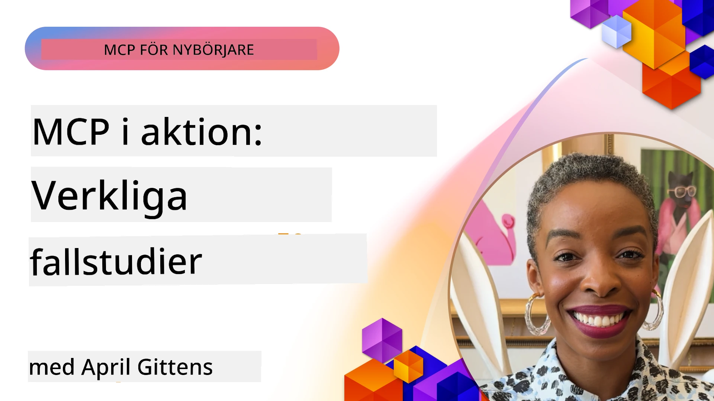

# MCP i praktiken: Fallstudier från verkliga världen

_(Klicka på bilden ovan för att se videon till denna lektion)_

Model Context Protocol (MCP) förändrar hur AI-applikationer interagerar med data, verktyg och tjänster. Detta avsnitt presenterar verkliga fallstudier som visar praktiska tillämpningar av MCP i olika företagsmiljöer.

## Översikt

Detta avsnitt visar konkreta exempel på MCP-implementeringar som framhäver hur organisationer använder detta protokoll för att lösa komplexa affärsutmaningar. Genom att granska dessa fallstudier får du insikter i MCP:s mångsidighet, skalbarhet och praktiska fördelar i verkliga situationer.

## Viktiga lärandemål

Genom att utforska dessa fallstudier kommer du att:

- Förstå hur MCP kan användas för att lösa specifika affärsproblem
- Lära dig om olika integrationsmönster och arkitektoniska tillvägagångssätt
- Känna igen bästa praxis för att implementera MCP i företagsmiljöer
- Få insikter i utmaningar och lösningar som uppstått vid verkliga implementationer
- Identifiera möjligheter att tillämpa liknande mönster i dina egna projekt

## Utvalda fallstudier

### 1. [Azure AI Travel Agents – Referensimplementering](./travelagentsample.md)

Denna fallstudie undersöker Microsofts omfattande referenslösning som visar hur man bygger en multi-agent, AI-driven reseplaneringsapplikation med MCP, Azure OpenAI och Azure AI Search. Projektet visar:

- Multi-agent orkestrering genom MCP
- Företagsdataintegration med Azure AI Search
- Säker och skalbar arkitektur med Azure-tjänster
- Utbyggbara verktyg med återanvändbara MCP-komponenter
- Konversationsbaserad användarupplevelse driven av Azure OpenAI

Arkitektur- och implementeringsdetaljer ger värdefulla insikter i att bygga komplexa multi-agent system med MCP som koordineringslager.

### 2. [Uppdatera Azure DevOps-objekt från YouTube-data](./UpdateADOItemsFromYT.md)

Denna fallstudie visar en praktisk användning av MCP för att automatisera arbetsflöden. Den visar hur MCP-verktyg kan användas för att:

- Extrahera data från onlineplattformar (YouTube)
- Uppdatera arbetsobjekt i Azure DevOps-system
- Skapa upprepbara automatiseringsarbetsflöden
- Integrera data över olika system

Exemplet illustrerar hur även relativt enkla MCP-implementeringar kan ge betydande effektivitetsvinster genom att automatisera rutinuppgifter och förbättra datakonsistensen mellan system.

### 3. [Dokumentationshämtning i realtid med MCP](./docs-mcp/README.md)

Denna fallstudie guidar dig genom att koppla en Python-klient i konsolen till en Model Context Protocol (MCP)-server för att hämta och logga Microsoft-dokumentation i realtid med kontextmedvetenhet. Du lär dig hur du:

- Ansluter till en MCP-server med en Python-klient och offciella MCP SDK
- Använder strömmande HTTP-klienter för effektiv datainsamling i realtid
- Anropar dokumentationsverktyg på servern och loggar svar direkt i konsolen
- Integrerar uppdaterad Microsoft-dokumentation i ditt arbetsflöde utan att lämna terminalen

Kapitel inkluderar en praktisk uppgift, ett minimalt fungerande kodexempel samt länkar till ytterligare resurser för fördjupning. Se hela genomgången och koden i det länkade kapitlet för att förstå hur MCP kan transformera dokumentationsåtkomst och utvecklarproduktivitet i konsolmiljöer.

### 4. [Interaktiv studieplansgeneratorwebbapp med MCP](./docs-mcp/README.md)

Denna fallstudie visar hur man bygger en interaktiv webbapplikation med Chainlit och Model Context Protocol (MCP) för att generera personliga studieplaner för valfritt ämne. Användare kan specificera ett ämne (som "AI-900-certifiering") och studietid (t.ex. 8 veckor), och appen ger en vecka-för-vecka-uppdelning av rekommenderat innehåll. Chainlit möjliggör en konversationsbaserad chattgränssnitt, vilket gör upplevelsen engagerande och anpassningsbar.

- Konversationsbaserad webbapp driven av Chainlit
- Användardrivna promptar för ämne och tidslängd
- Vecka-för-vecka innehållsrekommendationer med MCP
- Realtidsanpassade svar i chattgränssnitt

Projektet illustrerar hur konverserande AI och MCP kan kombineras för att skapa dynamiska, användardrivna utbildningsverktyg i en modern webbmijö.

### 5. [In-editor dokumentation med MCP-server i VS Code](./docs-mcp/README.md)

Denna fallstudie visar hur du kan få Microsoft Learn Docs direkt i din VS Code-miljö med MCP-servern — inget behov av att byta mellan webbläsarflikar! Du får se hur du kan:

- Söka och läsa dokumentation direkt i VS Code via MCP-panelen eller kommandopaletten
- Referera dokumentation och infoga länkar direkt i README- eller kursmardownfiler
- Använda GitHub Copilot och MCP tillsammans för sömlösa AI-drivna dokumentations- och kodarbetsflöden
- Validera och förbättra din dokumentation med realtidsåterkoppling och Microsoft-källsäkerhet
- Integrera MCP med GitHub-arbetsflöden för kontinuerlig dokumentationsvalidering

Implementeringen inkluderar:

- Exempel på `.vscode/mcp.json`-konfiguration för enkel uppsättning
- Skärmdumpsbaserade genomgångar av in-editor-upplevelsen
- Tips för att kombinera Copilot och MCP för maximal produktivitet

Det här scenariot är idealiskt för kursförfattare, dokumentationsskrivare och utvecklare som vill hålla fokus i sin editor samtidigt som de arbetar med dokumentation, Copilot och valideringsverktyg — allt drivet av MCP.

### 6. [Skapande av APIM MCP-server](./apimsample.md)

Denna fallstudie erbjuder en steg-för-steg-guide om hur man skapar en MCP-server med Azure API Management (APIM). Den täcker:

- Konfigurering av en MCP-server i Azure API Management
- Exponering av API-operationer som MCP-verktyg
- Policies för hastighetsbegränsning och säkerhet
- Testning av MCP-servern med Visual Studio Code och GitHub Copilot

Exemplet visar hur man använder Azures kapaciteter för att skapa en robust MCP-server som kan användas i olika tillämpningar och förbättra integrationen av AI-system med företags-API:er.

### 7. [GitHub MCP Registry — Accelererar agentintegration](https://github.com/mcp)

Denna fallstudie undersöker hur GitHubs MCP Registry, lanserat i september 2025, löser en kritisk utmaning i AI-ekosystemet: den fragmenterade upptäckten och distributionen av Model Context Protocol (MCP)-servrar.

#### Översikt
**MCP Registry** löser det växande problemet med spridda MCP-servrar över olika förvar och register, vilket tidigare fördröjde och försvårade integration. Dessa servrar tillåter AI-agenter att interagera med externa system som API:er, databaser och dokumentationskällor.

#### Problemformulering
Utvecklare som bygger agentbaserade arbetsflöden stod inför flera utmaningar:
- **Dålig upptäckbarhet** av MCP-servrar på olika plattformar
- **Överflöd av frågor** om uppsättning spridda på forum och dokumentation
- **Säkerhetsrisker** från icke verifierade och icke betrodda källor
- **Brist på standardisering** i serverkvalitet och kompatibilitet

#### Lösningsarkitektur
GitHub MCP Registry centraliserar betrodda MCP-servrar med viktiga funktioner:
- **Ett-klicks-installation** via VS Code för smidig uppsättning
- **Signal-över-brus-sortering** baserat på stjärnor, aktivitet och samhällsvalidering
- **Direkt integration** med GitHub Copilot och andra MCP-kompatibla verktyg
- **Öppen bidragsmodell** som möjliggör insatser från både community och företagsparter

#### Affärspåverkan
Registret har medfört mätbara förbättringar:
- **Snabbare onboarding** för utvecklare som använder verktyg som Microsoft Learn MCP Server, som strömmar officiell dokumentation direkt till agenter
- **Förbättrad produktivitet** via specialiserade servrar som `github-mcp-server`, som möjliggör naturlig språkautomation för GitHub (PR-skapande, CI-omkörning, kodscanning)
- **Stärkt ekosystemtillit** genom kurerade listor och transparenta konfigurationsstandarder

#### Strategiskt värde
För praktiker specialiserade på agentlivscykelhantering och reproducerbara arbetsflöden erbjuder MCP Registry:
- **Modulär agentdistribution** med standardiserade komponenter
- **Registret-stödda utvärderingspipelines** för konsekvent testning och validering
- **Tvärverktygsinteropabilitet** som möjliggör smidig integration mellan olika AI-plattformar

Denna fallstudie visar att MCP Registry är mer än bara en katalog — det är en grundläggande plattform för skalbar, verklig modellintegration och agentbaserad systemdistribution.

## Slutsats

Dessa sju omfattande fallstudier visar den anmärkningsvärda mångsidigheten och de praktiska tillämpningarna av Model Context Protocol i olika verkliga scenarier. Från komplexa multi-agent reseplaneringssystem och företags-API-hantering till effektiva dokumentationsarbetsflöden och den revolutionerande GitHub MCP Registry, visar dessa exempel hur MCP tillhandahåller en standardiserad, skalbar metod för att koppla AI-system med de verktyg, data och tjänster de behöver för att leverera exceptionellt värde.

Fallstudierna täcker flera dimensioner av MCP-implementering:
- **Företagsintegration**: Azure API Management och Azure DevOps-automation
- **Multi-agent orkestrering**: Reseplanering med koordinerade AI-agenter
- **Utvecklarproduktivitet**: VS Code-integration och dokumentationsåtkomst i realtid
- **Ekosystemutveckling**: GitHub MCP Registry som grundplattform
- **Utbildningstillämpningar**: Interaktiva studieplansgeneratorer och konversationsgränssnitt

Genom att studera dessa implementationer får du viktiga insikter i:
- **Arkitekturmönster** för olika skala och användningsfall
- **Implementeringsstrategier** som balanserar funktionalitet och underhållbarhet
- **Säkerhets- och skalbarhetsaspekter** för produktionsdrift
- **Bästa praxis** för MCP-serverutveckling och klientintegration
- **Ekosystemtänkande** för att bygga sammanlänkade AI-drivna lösningar

Dessa exempel visar tillsammans att MCP inte bara är ett teoretiskt ramverk utan ett moget, produktionsklart protokoll som möjliggör praktiska lösningar på komplexa affärsutmaningar. Oavsett om du bygger enkla automatiseringsverktyg eller avancerade multi-agent system, ger de mönster och tillvägagångssätt som illustreras här en stabil grund för dina egna MCP-projekt.

## Ytterligare resurser

- [Azure AI Travel Agents GitHub-förråd](https://github.com/Azure-Samples/azure-ai-travel-agents)
- [Azure DevOps MCP Tool](https://github.com/microsoft/azure-devops-mcp)
- [Playwright MCP Tool](https://github.com/microsoft/playwright-mcp)
- [Microsoft Docs MCP Server](https://github.com/MicrosoftDocs/mcp)
- [GitHub MCP Registry — Accelererar agentintegration](https://github.com/mcp)
- [MCP Community Examples](https://github.com/microsoft/mcp)

## Vad kommer härnäst

- Föregående: [Modul 8: Bästa praxis](../08-BestPractices/README.md)
- Nästa: [Modul 10: Effektivisera AI-arbetsflöden: Bygga en MCP-server med AI Toolkit](../10-StreamliningAIWorkflowsBuildingAnMCPServerWithAIToolkit/README.md)

---

<!-- CO-OP TRANSLATOR DISCLAIMER START -->
**Ansvarsfriskrivning**:  
Detta dokument har översatts med hjälp av AI-översättningstjänsten [Co-op Translator](https://github.com/Azure/co-op-translator). Även om vi strävar efter noggrannhet, vänligen observera att automatiska översättningar kan innehålla fel eller brister. Originaldokumentet på dess ursprungliga språk bör betraktas som den auktoritativa källan. För kritisk information rekommenderas professionell mänsklig översättning. Vi ansvarar inte för några missförstånd eller feltolkningar som uppstår från användningen av denna översättning.
<!-- CO-OP TRANSLATOR DISCLAIMER END -->