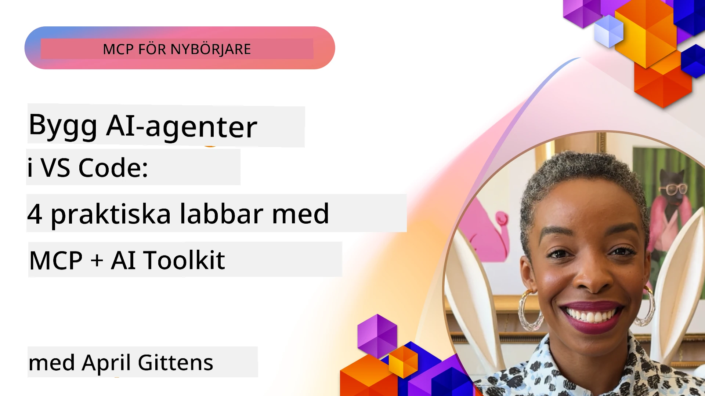

# Effektivisering av AI-arbetsflöden: Bygga en MCP-server med AI Toolkit

## 🎯  Översikt

_(Klicka på bilden ovan för att se videon för denna lektion)_

Välkommen till **Model Context Protocol (MCP) Workshop**! Denna omfattande praktiska workshop kombinerar två banbrytande teknologier för att revolutionera utvecklingen av AI-applikationer:

- **🔗 Model Context Protocol (MCP)**: En öppen standard för sömlös AI-verktygsintegration
- **🛠️ AI Toolkit för Visual Studio Code (AITK)**: Microsofts kraftfulla AI-utvecklingsutökning

### 🎓 Vad du kommer lära dig

I slutet av denna workshop kommer du att bemästra konsten att bygga intelligenta applikationer som förenar AI-modeller med verkliga verktyg och tjänster. Från automatiserade tester till anpassade API-integrationer, kommer du erhålla praktiska färdigheter för att lösa komplexa affärsutmaningar.

## 🏗️ Teknologistack

### 🔌 Model Context Protocol (MCP)

MCP är **"USB-C för AI"** – en universell standard som kopplar AI-modeller till externa verktyg och datakällor.

**✨ Huvudfunktioner:**

- 🔄 **Standardiserad integration**: Universellt gränssnitt för AI-verktygskopplingar
- 🏛️ **Flexibel arkitektur**: Lokala och fjärrservrar via stdio/SSE-transport
- 🧰 **Rikt ekosystem**: Verktyg, promptar och resurser i ett protokoll
- 🔒 **Företagsredo**: Inbyggd säkerhet och tillförlitlighet

**🎯 Varför MCP är viktigt:**
Precis som USB-C eliminerade kabelkaos, tar MCP bort komplexiteten i AI-integrationer. Ett protokoll, oändliga möjligheter.

### 🤖 AI Toolkit för Visual Studio Code (AITK)

Microsofts flaggskeppsutökning för AI-utveckling som förvandlar VS Code till en AI-kraftstation.

**🚀 Kärnfunktioner:**

- 📦 **Modellkatalog**: Tillgång till modeller från Azure AI, GitHub, Hugging Face, Ollama
- ⚡ **Lokal inferens**: ONNX-optimerad CPU/GPU/NPU-exekvering
- 🏗️ **Agent Builder**: Visuell AI-agentutveckling med MCP-integration
- 🎭 **Multimodal**: Stöd för text, bild och strukturerad utdata

**💡 Utvecklingsfördelar:**

- Noll-konfigurerad modellimplementering
- Visuell promptdesign
- Realtidstestningsmiljö
- Sömlös MCP-serverintegration

## 📚 Läranderesa

### [🚀 Modul 1: AI Toolkit Grundläggande](./lab1/README.md)

**Varaktighet**: 15 minuter

- 🛠️ Installera och konfigurera AI Toolkit för VS Code
- 🗂️ Utforska Modellkatalogen (100+ modeller från GitHub, ONNX, OpenAI, Anthropic, Google)
- 🎮 Bemästra den interaktiva testmiljön för realtidstestning av modeller
- 🤖 Bygg din första AI-agent med Agent Builder
- 📊 Utvärdera modellprestanda med inbyggda mått (F1, relevans, likhet, koherens)
- ⚡ Lär dig batchbearbetning och multimodalt stöd

**🎯 Lärandemål**: Skapa en funktionell AI-agent med en omfattande förståelse för AITK-funktioner

### [🌐 Modul 2: MCP med AI Toolkit Grundläggande](./lab2/README.md)

**Varaktighet**: 20 minuter

- 🧠 Bemästra Model Context Protocol (MCP) arkitektur och koncept
- 🌐 Utforska Microsofts MCP-serverekosystem
- 🤖 Bygg en webbläsarautomationsagent med Playwright MCP-server
- 🔧 Integrera MCP-servrar med AI Toolkit Agent Builder
- 📊 Konfigurera och testa MCP-verktyg inom dina agenter
- 🚀 Exportera och distribuera MCP-drivna agenter för produktionsanvändning

**🎯 Lärandemål**: Distribuera en AI-agent med extern verktygsstöd via MCP

### [🔧 Modul 3: Avancerad MCP-utveckling med AI Toolkit](./lab3/README.md)

**Varaktighet**: 20 minuter

- 💻 Skapa anpassade MCP-servrar med AI Toolkit
- 🐍 Konfigurera och använd senaste MCP Python SDK (v1.9.3)
- 🔍 Sätt upp och använd MCP Inspector för felsökning
- 🛠️ Bygg en Weather MCP Server med professionella felsökningsarbetsflöden
- 🧪 Felsök MCP-servrar i både Agent Builder och Inspector-miljöer

**🎯 Lärandemål**: Utveckla och felsök anpassade MCP-servrar med moderna verktyg

### [🐙 Modul 4: Praktisk MCP-utveckling – Anpassad GitHub Clone Server](./lab4/README.md)

**Varaktighet**: 30 minuter

- 🏗️ Bygg en verklighetsnära GitHub Clone MCP Server för utvecklingsarbetsflöden
- 🔄 Implementera smarta repositorie-kloningar med validering och felhantering
- 📁 Skapa intelligent kataloghantering och VS Code-integration
- 🤖 Använd GitHub Copilot Agent Mode med anpassade MCP-verktyg
- 🛡️ Tillämpa produktionsklar tillförlitlighet och plattformsoberoende

**🎯 Lärandemål**: Distribuera en produktionsredo MCP-server som effektiviserar verkliga utvecklingsarbetsflöden

## 💡 Verkliga tillämpningar & påverkan

### 🏢 Företagsanvändningsfall

#### 🔄 DevOps-automation

Transformera ditt utvecklingsarbetsflöde med intelligent automation:

- **Smart repositoriehantering**: AI-driven kodgranskning och sammanslagningsbeslut
- **Intelligent CI/CD**: Automatiserad pipelineoptimering baserad på kodändringar
- **Issue-triage**: Automatisk buggklassificering och tilldelning

#### 🧪 Kvalitetssäkringens revolution

Höj testningen med AI-driven automation:

- **Intelligent testgenerering**: Skapa omfattande testsuites automatiskt
- **Visuell regressionstestning**: AI-driven UI-ändringsdetektion
- **Prestandaövervakning**: Proaktiv identifiering och lösning av problem

#### 📊 Intelligenta datapipelines

Bygg smartare datahanteringsarbetsflöden:

- **Adaptiva ETL-processer**: Självoptimerande datatransformationer
- **Avvikelsedetektion**: Realtidsövervakning av datakvalitet
- **Intelligent routing**: Smart dataflödeshantering

#### 🎧 Förbättrad kundupplevelse

Skapa exceptionella kundinteraktioner:

- **Kontextmedveten support**: AI-agenter med tillgång till kundhistorik
- **Proaktiv problemlösning**: Prediktiv kundservice
- **Multikanalsintegration**: Enhetlig AI-upplevelse över plattformar

## 🛠️ Förutsättningar & installation

### 💻 Systemkrav

| Komponent            | Krav              | Anteckningar              |
|----------------------|-------------------|--------------------------|
| **Operativsystem**   | Windows 10+, macOS 10.15+, Linux | Alla moderna OS          |
| **Visual Studio Code**| Senaste stabila versionen | Krävs för AITK          |
| **Node.js**          | v18.0+ och npm    | För MCP-serverutveckling  |
| **Python**           | 3.10+             | Valfritt för Python MCP-servrar |
| **Minne**            | Minst 8 GB RAM    | 16 GB rekommenderas för lokala modeller |

### 🔧 Utvecklingsmiljö

#### Rekommenderade VS Code-utökningar

- **AI Toolkit** (ms-windows-ai-studio.windows-ai-studio)
- **Python** (ms-python.python)
- **Python Debugger** (ms-python.debugpy)
- **GitHub Copilot** (GitHub.copilot) – Valfritt men användbart

#### Valfria verktyg

- **uv**: Modern Python pakethanterare
- **MCP Inspector**: Visuellt felsökningsverktyg för MCP-servrar
- **Playwright**: För webautomationsexempel

## 🎖️ Lärandemål & certifieringsspår

### 🏆 Kompetenschecklista

Genom att slutföra denna workshop uppnår du mästerskap inom:

#### 🎯 Kärnkompetenser

- [ ] **MCP-protokollmästerskap**: Djup förståelse för arkitektur och implementeringsmönster
- [ ] **AITK-färdigheter**: Expertanvändning av AI Toolkit för snabb utveckling
- [ ] **Anpassad serverutveckling**: Bygg, distribuera och underhåll produktions-MCP-servrar
- [ ] **Verktygsintegrations-excellens**: Sömlös koppling av AI med befintliga utvecklingsarbetsflöden
- [ ] **Problemhantering**: Tillämpa lärda färdigheter på verkliga affärsutmaningar

#### 🔧 Tekniska färdigheter

- [ ] Sätt upp och konfigurera AI Toolkit i VS Code
- [ ] Designa och implementera anpassade MCP-servrar
- [ ] Integrera GitHub-modeller med MCP-arkitektur
- [ ] Bygg automatiserade testarbetsflöden med Playwright
- [ ] Distribuera AI-agenter för produktionsanvändning
- [ ] Felsök och optimera prestanda för MCP-servrar

#### 🚀 Avancerade kapaciteter

- [ ] Arkitektera AI-integrationer i företagsklass
- [ ] Implementera säkerhetsbästa praxis för AI-applikationer
- [ ] Designa skalbara MCP-serverarkitekturer
- [ ] Skapa anpassade verktygskedjor för specifika domäner
- [ ] Vara mentor för andra inom AI-native utveckling

## 📖 Ytterligare resurser

- [MCP Specification (2025-11-25)](https://spec.modelcontextprotocol.io/specification/2025-11-25/)
- [AI Toolkit GitHub Repository](https://github.com/microsoft/vscode-ai-toolkit)
- [Sample MCP Servers Collection](https://github.com/modelcontextprotocol/servers)
- [Best Practices Guide](https://modelcontextprotocol.io/docs/best-practices)
- [OWASP MCP Top 10](https://microsoft.github.io/mcp-azure-security-guide/mcp/) – Säkerhetsbästa praxis

---

**🚀 Redo att revolutionera ditt AI-utvecklingsarbetsflöde?**

Låt oss bygga framtidens intelligenta applikationer tillsammans med MCP och AI Toolkit!

## Vad är nästa steg

Fortsätt till: [Modul 11: MCP Server Hands-On Labs](../11-MCPServerHandsOnLabs/README.md)

---

<!-- CO-OP TRANSLATOR DISCLAIMER START -->
**Ansvarsfriskrivning**:
Detta dokument har översatts med hjälp av AI-översättningstjänsten [Co-op Translator](https://github.com/Azure/co-op-translator). Även om vi strävar efter noggrannhet, var vänlig observera att automatiska översättningar kan innehålla fel eller felaktigheter. Det ursprungliga dokumentet på dess ursprungliga språk ska betraktas som den auktoritativa källan. För viktig information rekommenderas professionell mänsklig översättning. Vi ansvarar inte för några missförstånd eller feltolkningar som uppstår till följd av användningen av denna översättning.
<!-- CO-OP TRANSLATOR DISCLAIMER END -->