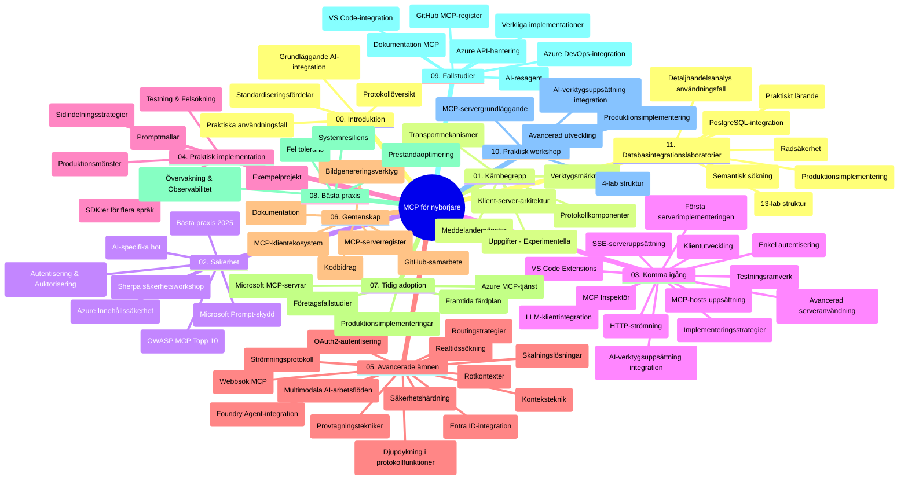

# Model Context Protocol (MCP) för nybörjare - Studievägledning

Denna studievägledning ger en översikt över arkivets struktur och innehåll för kursen "Model Context Protocol (MCP) för nybörjare". Använd denna guide för att navigera i arkivet effektivt och få ut det mesta av de tillgängliga resurserna.

## Arkivöversikt

Model Context Protocol (MCP) är en standardiserad ram för interaktioner mellan AI-modeller och klientapplikationer. Ursprungligen skapad av Anthropic, underhålls MCP nu av den bredare MCP-gemenskapen genom den officiella GitHub-organisationen. Detta arkiv erbjuder en omfattande kursplan med praktiska kodexempel i C#, Java, JavaScript, Python och TypeScript, utformade för AI-utvecklare, systemarkitekter och mjukvaruingenjörer.

## Visuell kurskarta

## Arkivstruktur

Arkivet är organiserat i elva huvudsektioner som vardera fokuserar på olika aspekter av MCP:

1. **Introduktion (00-Introduction/)**
   - Översikt av Model Context Protocol
   - Varför standardisering är viktigt i AI-flöden
   - Praktiska användningsområden och fördelar

2. **Kärnkoncept (01-CoreConcepts/)**
   - Klient-server-arkitektur
   - Nyckelkomponenter i protokollet
   - Meddelandemönster i MCP

3. **Säkerhet (02-Security/)**
   - Säkerhetshot i MCP-baserade system
   - Bästa metoder för säkra implementationer
   - Autentisering och auktoriseringsstrategier
   - **Omfattande säkerhetsdokumentation**:
     - MCP Security Best Practices 2025
     - Azure Content Safety Implementation Guide
     - MCP Security Controls and Techniques
     - MCP Best Practices Quick Reference
   - **Viktiga säkerhetsämnen**:
     - Prompt-injektion och tool poisoning-attacker
     - Sessionkapning och confused deputy-problem
     - Sårbarheter i tokenpassthrough
     - Överdrivna rättigheter och åtkomstkontroll
     - Säkerhet i leverantörskedjan för AI-komponenter
     - Microsoft Prompt Shields-integration

4. **Kom igång (03-GettingStarted/)**
   - Miljöinstallation och konfiguration
   - Skapa grundläggande MCP-servrar och klienter
   - Integration med befintliga applikationer
   - Innehåller avsnitt för:
     - Första serverimplementationen
     - Klientutveckling
     - LLM-klientintegration
     - VS Code-integration
     - Server-Sent Events (SSE) server
     - Avancerad serveranvändning
     - HTTP-strömning
     - AI Toolkit-integration
     - Teststrategier
     - Deployeringsriktlinjer

5. **Praktisk implementering (04-PracticalImplementation/)**
   - Användning av SDK:er i olika programmeringsspråk
   - Felsökning, testning och valideringstekniker
   - Skapa återanvändbara promptmallar och arbetsflöden
   - Exempelprojekt med implementationskod

6. **Avancerade ämnen (05-AdvancedTopics/)**
   - Kontextteknik
   - Foundry-agentintegration
   - Multimodala AI-arbetsflöden
   - OAuth2-autentiseringsdemonstrationer
   - Realtids sökfunktionalitet
   - Realtidsströmning
   - Implementering av root contexts
   - Routingstrategier
   - Samplingtekniker
   - Skalningsmetoder
   - Säkerhetsaspekter
   - Entra ID-säkerhetsintegration
   - Webb-sökintegration

7. **Community-bidrag (06-CommunityContributions/)**
   - Hur man bidrar med kod och dokumentation
   - Samarbete via GitHub
   - Communitydrivna förbättringar och återkoppling
   - Användning av olika MCP-klienter (Claude Desktop, Cline, VSCode)
   - Arbeta med populära MCP-servrar inklusive bildgenerering

8. **Lärdomar från tidig adoption (07-LessonsfromEarlyAdoption/)**
   - Verkliga implementationer och framgångshistorier
   - Bygga och distribuera MCP-baserade lösningar
   - Trender och framtida färdplan
   - **Microsoft MCP Servers Guide**: Omfattande guide till 10 produktionsklara Microsoft MCP-servrar inklusive:
     - Microsoft Learn Docs MCP Server
     - Azure MCP Server (15+ specialiserade connectors)
     - GitHub MCP Server
     - Azure DevOps MCP Server
     - MarkItDown MCP Server
     - SQL Server MCP Server
     - Playwright MCP Server
     - Dev Box MCP Server
     - Azure AI Foundry MCP Server
     - Microsoft 365 Agents Toolkit MCP Server

9. **Bästa metoder (08-BestPractices/)**
   - Prestandaförbättring och optimering
   - Design av feltoleranta MCP-system
   - Test- och robusthetsstrategier

10. **Fallstudier (09-CaseStudy/)**
    - **Sju omfattande fallstudier** som visar MCP:s mångsidighet över olika scenarier:
    - **Azure AI Travel Agents**: Multi-agent orkestrering med Azure OpenAI och AI Search
    - **Azure DevOps-integration**: Automatisering av arbetsflöden med YouTube-datauppdateringar
    - **Realtids dokumenthämtning**: Python-konsult med HTTP-strömning
    - **Interaktiv studieplan-generator**: Chainlit webbapp med konverserande AI
    - **Dokumentation i redigerare**: VS Code-integration med GitHub Copilot arbetsflöden
    - **Azure API Management**: Företags-API-integration med skapande av MCP-server
    - **GitHub MCP Registry**: Ekosystemsutveckling och agentisk integrationsplattform
    - Implementationsexempel över företagsintegration, utvecklarproduktivitet och ekosystemutveckling

11. **Praktiskt workshop (10-StreamliningAIWorkflowsBuildingAnMCPServerWithAIToolkit/)**
    - Omfattande praktiskt workshop som kombinerar MCP med AI Toolkit
    - Bygga intelligenta applikationer som kopplar AI-modeller till verkliga verktyg
    - Praktiska moduler som täcker grunder, egen serverutveckling och produktionsdeployering
    - **Labstruktur**:
      - Lab 1: MCP Server Fundamentals
      - Lab 2: Avancerad MCP-serverutveckling
      - Lab 3: AI Toolkit-integration
      - Lab 4: Produktionsdistribution och skalning
    - Lab-baserad inlärningsmetod med steg-för-steg-instruktioner

12. **MCP Server databasintegrationslabs (11-MCPServerHandsOnLabs/)**
    - **Omfattande 13-labs inlärningsväg** för att bygga produktionsfärdiga MCP-servrar med PostgreSQL-integration
    - **Verklig implementering av retail-analys** med Zava Retail användningsfall
    - **Företagsmönster** inklusive Row Level Security (RLS), semantisk sökning och multi-tenant dataåtkomst
    - **Fullständig labstruktur**:
      - **Labs 00-03: Grunder** - Introduktion, arkitektur, säkerhet, miljöinstallation
      - **Labs 04-06: Bygga MCP-servern** - Databasdesign, serverimplementation, verktygsutveckling
      - **Labs 07-09: Avancerade funktioner** - Semantisk sökning, test & felsökning, VS Code-integration
      - **Labs 10-12: Produktion & bästa metoder** - Distribution, övervakning, optimering
    - **Teknologier som täcks**: FastMCP-ramverk, PostgreSQL, Azure OpenAI, Azure Container Apps, Application Insights
    - **Lärandemål**: Produktionsklara MCP-servrar, databasintegrationsmönster, AI-driven analys, företagsäkerhet

## Ytterligare resurser

Arkivet innehåller stödresurser:

- **Mappen Images**: Innehåller diagram och illustrationer som används genom kursplanen
- **Översättningar**: Flerspråkigt stöd med automatiska översättningar av dokumentation
- **Officiella MCP-resurser**:
  - [MCP Documentation](https://modelcontextprotocol.io/)
  - [MCP Specification](https://spec.modelcontextprotocol.io/)
  - [MCP GitHub Repository](https://github.com/modelcontextprotocol)

## Hur man använder detta arkiv

1. **Sekventiellt lärande**: Följ kapitlen i ordning (00 till 11) för en strukturerad inlärning.
2. **Språkspecifikt fokus**: Utforska samples-mapparna för implementationer i ditt föredragna programmeringsspråk.
3. **Praktisk implementering**: Börja med avsnittet "Kom igång" för att sätta upp din miljö och skapa din första MCP-server och klient.
4. **Avancerad utforskning**: När du känner dig bekväm med grunderna, fördjupa dig i avancerade ämnen för att utöka din kunskap.
5. **Community-engagemang**: Gå med i MCP-gemenskapen via GitHub-diskussioner och Discord-kanaler för att koppla ihop med experter och andra utvecklare.

## MCP-klienter och verktyg

Kursplanen täcker olika MCP-klienter och verktyg:

1. **Officiella klienter**:
   - Visual Studio Code
   - MCP i Visual Studio Code
   - Claude Desktop
   - Claude i VSCode
   - Claude API

2. **Community-klienter**:
   - Cline (terminalbaserad)
   - Cursor (kodredigerare)
   - ChatMCP
   - Windsurf

3. **MCP Management Verktyg**:
   - MCP CLI
   - MCP Manager
   - MCP Linker
   - MCP Router

## Populära MCP-servrar

Arkivet presenterar olika MCP-servrar, inklusive:

1. **Officiella Microsoft MCP-servrar**:
   - Microsoft Learn Docs MCP Server
   - Azure MCP Server (15+ specialiserade connectors)
   - GitHub MCP Server
   - Azure DevOps MCP Server
   - MarkItDown MCP Server
   - SQL Server MCP Server
   - Playwright MCP Server
   - Dev Box MCP Server
   - Azure AI Foundry MCP Server
   - Microsoft 365 Agents Toolkit MCP Server

2. **Officiella referensservrar**:
   - Filesystem
   - Fetch
   - Memory
   - Sequential Thinking

3. **Bildgenerering**:
   - Azure OpenAI DALL-E 3
   - Stable Diffusion WebUI
   - Replicate

4. **Utvecklingsverktyg**:
   - Git MCP
   - Terminal Control
   - Code Assistant

5. **Specialiserade servrar**:
   - Salesforce
   - Microsoft Teams
   - Jira & Confluence

## Bidra

Detta arkiv välkomnar bidrag från communityn. Se avsnittet Community Contributions för vägledning om hur du kan bidra effektivt till MCP-ekosystemet.

----

*Denna studievägledning uppdaterades senast den 5 februari 2026, reflekterande den senaste MCP Specification 2025-11-25 och ger en översikt över arkivet från detta datum. Arkivets innehåll kan uppdateras efter detta datum.*

---

<!-- CO-OP TRANSLATOR DISCLAIMER START -->
**Ansvarsfriskrivning**:
Detta dokument har översatts med hjälp av AI-översättningstjänsten [Co-op Translator](https://github.com/Azure/co-op-translator). Även om vi strävar efter noggrannhet, vänligen var medveten om att automatiska översättningar kan innehålla fel eller brister. Det ursprungliga dokumentet på dess modersmål ska anses vara den auktoritativa källan. För kritisk information rekommenderas professionell mänsklig översättning. Vi ansvarar inte för några missförstånd eller feltolkningar som uppstår från användningen av denna översättning.
<!-- CO-OP TRANSLATOR DISCLAIMER END -->