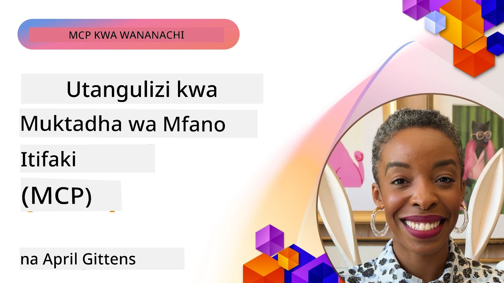
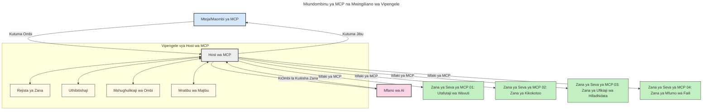

# Utangulizi wa Itifaki ya Muktadha wa Mfano (MCP): Kwa Nini Inajali kwa Maombi ya AI Yanayoweza Kupanuka

[](https://youtu.be/agBbdiOPLQA)

_(Bonyeza picha hapo juu kutazama video ya somo hili)_

Maombi ya AI ya kizazi ni hatua nzuri mbele kwani mara nyingi huruhusu mtumiaji kuingiliana na programu kwa kutumia maagizo ya lugha asilia. Hata hivyo, kadri muda na rasilimali zinavyoingizwa katika programu kama hizo, unataka kuhakikisha unaweza kuunganisha kwa urahisi utendaji na rasilimali kwa njia ambayo ni rahisi kupanua, kwamba programu yako inaweza kuhudumia zaidi ya mfano mmoja unaotumika, na kushughulikia undani mbalimbali wa mifano. Kwa ufupi, kujenga programu za AI za kizazi ni rahisi kuanzia, lakini zinapokua na kuwa ngumu zaidi, unahitaji kuanza kufafanua usanifu na kuna uwezekano unahitaji kutegemea kiwango cha kawaida ili kuhakikisha programu zako zinajengwa kwa njia thabiti. Hapa ndipo MCP inakuja kuweka mambo mpangilio na kutoa kiwango cha kawaida.

---

## **🔍 Itifaki ya Muktadha wa Mfano (MCP) ni Nini?**

**Itifaki ya Muktadha wa Mfano (MCP)** ni **kiolesura kilichofunguliwa, cha kiwango cha kawaida** kinachoruhusu Mifano Mikubwa ya Lugha (LLMs) kuingiliana kwa urahisi na zana za nje, API, na vyanzo vya data. Inatoa usanifu thabiti wa kuboresha utendaji wa mfano wa AI zaidi ya data zao za mafunzo, kuwezesha mifumo ya AI yenye akili zaidi, inayoweza kupanuka, na inayojibu haraka.

---

## **🎯 Kwa Nini Ubora wa Kawaida katika AI Unajali**

Kadri maombi ya AI ya kizazi yanavyokuwa magumu zaidi, ni muhimu kutumia viwango vinavyohakikisha **uwezo wa kupanuka, upanuzi, utunzaji,** na **kuepuka mtego wa muuzaji mmoja**. MCP inashughulikia mahitaji haya kwa:

- Kuunganisha kwa pamoja zana na mifano
- Kupunguza suluhisho dhaifu na za kipekee
- Kuruhusu mifano mingi kutoka kwa wauzaji tofauti kuishi ndani ya mfumo mmoja

**Kumbuka:** Ingawa MCP inajitangaza kama kiwango cha wazi, hakuna mipango ya kuweka MCP kama kiwango cha kawaida kupitia taasisi yoyote zilizopo za viwango kama IEEE, IETF, W3C, ISO, au taasisi nyingine yoyote ya viwango.

---

## **📚 Malengo ya Kujifunza**

Mwisho wa makala hii, utaweza:

- Kufafanua **Itifaki ya Muktadha wa Mfano (MCP)** na matumizi yake
- Kuelewa jinsi MCP inavyoboresha mawasiliano kati ya mfano na zana
- Kubainisha vipengele vikuu vya usanifu wa MCP
- Kuchunguza matumizi halisi ya MCP katika muktadha wa biashara na maendeleo

---

## **💡 Kwa Nini Itifaki ya Muktadha wa Mfano (MCP) ni Mabadiliko Makubwa**

### **🔗 MCP Inatatua Ugawanyiko katika Mwingiliano wa AI**

Kabla ya MCP, kuunganisha mifano na zana kunahitaji:

- Msimbo wa kawaida kwa kila jozi ya zana-mfano
- API zisizo za kawaida kwa kila muuzaji
- Kuvunjwa mara kwa mara kwa sababu za masasisho
- Ugumu wa kupanuka kwa zana nyingi zaidi

### **✅ Manufaa ya Ubora wa Kawaida wa MCP**

| **Manufaa**              | **Maelezo**                                                                 |
|--------------------------|------------------------------------------------------------------------------|
| Uwezo wa Kuingiliana     | LLMs hufanya kazi kwa urahisi na zana kutoka kwa wauzaji tofauti             |
| Mwelekeo wa Kuwa Thabiti | Tabia ya umoja kote majukwaa na zana                                         |
| Matumizi ya Upya         | Zana zilizojengwa mara moja zinaweza kutumika kwa miradi na mifumo mingine    |
| Kuendesha Maendeleo Haraka | Punguza muda wa maendeleo kwa kutumia violesura vya kawaida, plug-and-play    |

---

## **🧱 Muhtasari wa Usanifu wa Juu wa MCP**

MCP hufuata **mfano wa mteja-mtumiaji**, ambapo:

- **Wenyeji wa MCP** wanaendesha mifano ya AI
- **Wateja wa MCP** huanzisha maombi
- **Seva za MCP** hutoa muktadha, zana, na uwezo

### **Vipengele Muhimu:**

- **Rasilimali** – Data kavu au inayobadilika kwa mifano  
- **Maagizo** – Mipango iliyoandaliwa kwa ajili ya kizazi kilichoongozwa  
- **Zana** – Kazi zinazotekelezeka kama utafutaji, hesabu  
- **Kupima Sampuli** – Tabia za wakala kupitia mwingiliano wa mara kwa mara  
- **Uhamasishaji** – Maombi yanayotolewa na seva kwa ajili ya maoni ya mtumiaji  
- **Mizizi** – Mipaka ya mfumo wa faili kwa udhibiti wa upatikanaji seva  

### **Usanifu wa Itifaki:**

MCP inatumia usanifu wa tabaka mbili:
- **Tabaka la Data**: Mawasiliano kwa kutumia JSON-RPC 2.0 pamoja na usimamizi wa mzunguko wa maisha na kanuni msingi
- **Tabaka la Usafirishaji**: Mawasiliano ya STDIO (ndani) na HTTP inayoweza kuendelea na SSE (kwa mbali)

---

## Jinsi Seva za MCP Zinavyofanya Kazi

Seva za MCP hufanya kazi kwa njia ifuatayo:

- **Mtiririko wa Maombi**:
    1. Ombi linaanzishwa na mtumiaji wa mwisho au programu inayotenda kwa niaba yake.
    2. **Mteja wa MCP** hutuma ombi kwa **Mwenyeji wa MCP**, ambaye hushughulikia uendeshaji wa Mfano wa AI.
    3. **Mfano wa AI** hupokea maagizo ya mtumiaji na unaweza kuomba upatikanaji wa zana za nje au data kupitia simu moja au zaidi za zana.
    4. **Mwenyeji wa MCP**, si moja kwa moja mfano, hukutana na **Seva za MCP** zinazofaa kwa kutumia itifaki ya kawaida.
- **Utendaji wa Mwenyeji wa MCP**:
    - **Kumbukumbu ya Zana**: Inahifadhi orodha ya zana zilizopo na uwezo wao.
    - **Uthibitishaji**: Huthibitisha ruhusa za upatikanaji wa zana.
    - **Mshughulikiaji wa Maombi**: Husindika maombi yanayokuja ya zana kutoka kwa mfano.
    - **Mfinyazo wa Majibu**: Huunda mwonekano wa matokeo ya zana kwa mfano kuelewa.
- **Utekelezaji wa Seva za MCP**:
    - **Mwenyeji wa MCP** hupeleka simu za zana kwa seva moja au zaidi za MCP, kila moja ikionyesha kazi maalum (mfano, utafutaji, hesabu, maswali ya hifadhidata).
    - **Seva za MCP** hufanya kazi zao husika na kurudisha matokeo kwa **Mwenyeji wa MCP** kwa muundo thabiti.
    - **Mwenyeji wa MCP** huunda na kuwasilisha matokeo haya kwa **Mfano wa AI**.
- **Ukomo wa Jibu**:
    - **Mfano wa AI** huingiza matokeo ya zana katika jibu la mwisho.
    - **Mwenyeji wa MCP** hutuma jibu hili tena kwa **Mteja wa MCP**, ambaye humfikishia kwa mtumiaji wa mwisho au programu inayoitisha.
    


## 👨‍💻 Jinsi ya Kujenga Seva ya MCP (Kwa Mifano)

Seva za MCP huruhusu kupanua uwezo wa LLM kwa kutoa data na utendaji.

Uko tayari kujaribu? Hapa kuna SDK za lugha na/au stack maalum zilizo na mifano ya kuunda seva rahisi za MCP kwa lugha/stacks tofauti:

- **Python SDK**: https://github.com/modelcontextprotocol/python-sdk

- **TypeScript SDK**: https://github.com/modelcontextprotocol/typescript-sdk

- **Java SDK**: https://github.com/modelcontextprotocol/java-sdk

- **C#/.NET SDK**: https://github.com/modelcontextprotocol/csharp-sdk


## 🌍 Matumizi Halisi ya Dunia ya MCP

MCP inaruhusu matumizi mbalimbali kwa kupanua uwezo wa AI:

| **Matumizi**                | **Maelezo**                                                                  |
|-----------------------------|------------------------------------------------------------------------------|
| Uunganishaji wa Data Biashara | Kuunganisha LLM na hifadhidata, CRM, au zana za ndani                        |
| Mifumo ya AI ya Wakala       | Kuwezesha mawakala huru kwa upatikanaji wa zana na mchakato wa maamuzi      |
| Maombi ya Multi-modal        | Kuunganisha zana za maandishi, picha, na sauti ndani ya programu moja ya AI |
| Uunganishaji wa Data kwa Wakati Halisi | Kuleta data ya moja kwa moja katika mwingiliano wa AI kwa matokeo sahihi na ya sasa |

### 🧠 MCP = Kiwango cha Kawaida kwa Mwingiliano wa AI

Itifaki ya Muktadha wa Mfano (MCP) hutumikia kama kiwango cha kawaida cha ulimwengu wa AI, kama vile USB-C ilivyoleta kiwango cha viunganishi vya vifaa. Katika ulimwengu wa AI, MCP hutoa kiolesura cha kawaida, kuruhusu mifano (wateja) kuunganishwa kwa urahisi na zana za nje na watoa data (seva). Hii inaondoa haja ya itifaki tofauti za kipekee kwa kila API au chanzo cha data.

Chini ya MCP, zana inayoungwa mkono na MCP (inayojulikana kama seva ya MCP) hufuata kiwango kimoja cha pamoja. Seva hizi zinaweza kuorodhesha zana au vitendo vinavyotoa na kutekeleza vitendo hivyo wanapoombwa na wakala wa AI. Jukwaa za wakala wa AI zinazounga mkono MCP zina uwezo wa kugundua zana zilizopo kutoka kwa seva na kuzitumia kupitia itifaki hii ya kawaida.

### 💡 Huwezesha upatikanaji wa maarifa

Zaidi ya kutoa zana, MCP pia huwezesha upatikanaji wa maarifa. Inaruhusu maombi kutoa muktadha kwa mifano mikubwa ya lugha (LLMs) kwa kuziunganisha na vyanzo mbalimbali vya data. Kwa mfano, seva ya MCP inaweza kuwakilisha hazina ya nyaraka ya kampuni, kuruhusu mawakala kupata taarifa muhimu kwa mahitaji. Seva nyingine inaweza kushughulikia vitendo maalum kama kutuma barua pepe au kusasisha rekodi. Kutazama kwa wakala, hizi ni zana ambazo anaweza kutumia—baadhi ya zana hurudisha data (muktadha wa maarifa), wengine hutekeleza vitendo. MCP husimamia vyote kwa ufanisi.

Wakala anayejumuika na seva ya MCP hujifunza moja kwa moja uwezo wa seva na data inayopatikana kupitia muundo mmoja wa kawaida. Ubora huu huwezesha upatikanaji wa zana kisicho na kikomo. Kwa mfano, kuongezwa kwa seva mpya ya MCP kwenye mfumo wa wakala humfanya zana zake zitumike mara moja bila hitaji la kurekebisha maagizo ya wakala.

Uunganishaji huu uliorahisishwa unalingana na mtiririko unaoonyeshwa kwenye mchoro ufuatao, ambapo seva hutoa zana na maarifa, kuhakikisha ushirikiano rahisi kati ya mifumo.

### 👉 Mfano: Suluhisho la Wakala Unaoweza Kupanuka

```mermaid
---
title: Suluhisho la Wakala Linaloweza Kupanuka na MCP
description: Mchoro unaoonyesha jinsi mtumiaji anavyoshirikiana na LLM inayounganisha na seva nyingi za MCP, kila seva ikitoa maarifa na zana, ikianzisha usanifu wa mfumo wa AI unaoweza kupanuka
---
graph TD
    User -->|Agizo| LLM
    LLM -->|Jibu| User
    LLM -->|MCP| ServerA
    LLM -->|MCP| ServerB
    ServerA -->|Konekteta wa ulimwengu| ServerB
    ServerA --> KnowledgeA
    ServerA --> ToolsA
    ServerB --> KnowledgeB
    ServerB --> ToolsB

    subgraph Server A
        KnowledgeA[Maarifa]
        ToolsA[Vifaa]
    end

    subgraph Server B
        KnowledgeB[Maarifa]
        ToolsB[Vifaa]
    end
```Kifunganishi cha Ulimwenguni huriwezesha seva za MCP kuungumza na kushirikiana uwezo, kuruhusu ServerA kuwasilisha kazi kwa ServerB au kupata zana na maarifa yake. Hii inafedhesha zana na data kati ya seva, kuunga mkono usanifu wa wakala unaoweza kupanuka na wa moduli. Kwa sababu MCP huweka kiwango cha wazi cha kuonyesha zana, mawakala wanaweza kugundua na kupeleka maombi kati ya seva bila kuingizwa kwa mikono.

Ufadhili wa zana na maarifa: Zana na data zinaweza kupatikana kati ya seva, kuwezesha usanifu wa wakala unaoweza kupanuka na wa moduli zaidi.

### 🔄 Hali Zinazoendelea Za MCP na Muunganisho wa LLM Upande wa Mteja

Mbali na usanifu wa msingi wa MCP, kuna hali juu ambapo mteja na seva wote wana LLMs, kuruhusu mwingiliano zaidi ya hali ya juu. Katika mchoro ufuatao, **Programu ya Mteja** inaweza kuwa IDE yenye zana kadhaa za MCP zinazopatikana kwa mtumiaji na LLM:

```mermaid
---
title: Hali Zinazoendelea za MCP na Muunganisho wa LLM wa Mteja-Seva
description: Mchoro wa mfululizo unaoonyesha mtiririko wa mwingiliano wa kina kati ya mtumiaji, programu ya mteja, LLM ya mteja, seva nyingi za MCP, na LLM ya seva, ukionyesha ugunduzi wa zana, mwingiliano wa mtumiaji, kupiga simu moja kwa moja kwa zana, na hatua za mazungumzo ya vipengele
---
sequenceDiagram
    autonumber
    actor User as 👤 Mtumiaji
    participant ClientApp as 🖥️ Programu ya Mteja
    participant ClientLLM as 🧠 LLM ya Mteja
    participant Server1 as 🔧 Seva ya MCP 1
    participant Server2 as 📚 Seva ya MCP 2
    participant ServerLLM as 🤖 LLM ya Seva
    
    %% Discovery Phase
    rect rgb(220, 240, 255)
        Note over ClientApp, Server2: HATUA YA UGUNDUZI WA ZANA
        ClientApp->>+Server1: Omba zana/rasilimali zilizopo
        Server1-->>-ClientApp: Rudisha orodha ya zana (JSON)
        ClientApp->>+Server2: Omba zana/rasilimali zilizopo
        Server2-->>-ClientApp: Rudisha orodha ya zana (JSON)
        Note right of ClientApp: Hifadhi orodha ya zana<br/>iliyokunjwa eneo la mteja
    end
    
    %% User Interaction
    rect rgb(255, 240, 220)
        Note over User, ClientLLM: HATUA YA MWINGILIANO WA MTUMIAJI
        User->>+ClientApp: Ingiza ombi kwa lugha asilia
        ClientApp->>+ClientLLM: Wasilisha ombi + orodha ya zana
        ClientLLM->>-ClientLLM: Changanua ombi & chagua zana
    end
    
    %% Scenario A: Direct Tool Calling
    alt Kupiga Simu Moja kwa Moja kwa Zana
        rect rgb(220, 255, 220)
            Note over ClientApp, Server1: NJIA A: KUPIGA SIMU MOJA KWA MOJA KWA ZANA
            ClientLLM->>+ClientApp: Omba utekelezaji wa zana
            ClientApp->>+Server1: Tekeleza zana maalum
            Server1-->>-ClientApp: Rudisha matokeo
            ClientApp->>+ClientLLM: Chakata matokeo
            ClientLLM-->>-ClientApp: Tengeneza jibu
            ClientApp-->>-User: Onyesha jibu la mwisho
        end
    
    %% Scenario B: Feature Negotiation (VS Code style)
    else Mazungumzo ya Vipengele (mtindo wa VS Code)
        rect rgb(255, 220, 220)
            Note over ClientApp, ServerLLM: NJIA B: MAZUNGUMZO YA VIPENGELE
            ClientLLM->>+ClientApp: Tambua uwezo unaohitajika
            ClientApp->>+Server2: Jadili vipengele/u uwezo
            Server2->>+ServerLLM: Omba muktadha wa ziada
            ServerLLM-->>-Server2: Toa muktadha
            Server2-->>-ClientApp: Rudisha vipengele vilivyopo
            ClientApp->>+Server2: Piga simu kwa zana zilizojadiliana
            Server2-->>-ClientApp: Rudisha matokeo
            ClientApp->>+ClientLLM: Chakata matokeo
            ClientLLM-->>-ClientApp: Tengeneza jibu
            ClientApp-->>-User: Onyesha jibu la mwisho
        end
    end
```
## 🔐 Manufaa Halisi ya MCP

Hapa kuna manufaa halisi ya kutumia MCP:

- **Uhai wa Taarifa**: Mifano inaweza kupata taarifa za kisasa zaidi zaidi ya data zao za mafunzo
- **Kupanua Uwezo**: Mifano inaweza kutumia zana maalum kwa kazi ambazo hawajafunzwa
- **Kupunguza Holabaluba**: Vyanzo vya data vya nje hutoa msingi wa ukweli
- **Faragha**: Data nyeti inaweza kubaki ndani ya mazingira salama badala ya kuingizwa katika maagizo

## 📌 Mambo Muhimu ya Kumbuka

Haya ni mambo muhimu ya kumbuka kwa kutumia MCP:

- **MCP** hutangaza jinsi mifano ya AI inavyoingiliana na zana na data
- Huongeza **upanzi, uthabiti, na uwezo wa kuingiliana**
- MCP husaidia **kupunguza muda wa maendeleo, kuboresha kuaminika, na kupanua uwezo wa mfano**
- Usanifu wa mteja-mtumiaji **huwezesha maombi ya AI yenye kubadilika na upanuzi**

## 🧠 Zoeee

Fikiria kuhusu programu ya AI unayovutiwa kuijenga.

- Ni **zifo gani za nje au data** zinaweza kuongeza uwezo wake?
- MCP ingeweza kuifanya muunganisho kuwa **rahisi na wa kuaminika zaidi?**

## Rasilimali Zaidi

- [Hifadhi ya MCP GitHub](https://github.com/modelcontextprotocol)


## Nini Kifuatavyo

Kifuatavyo: [Sura ya 1: Dhana Msingi](../01-CoreConcepts/README.md)

---

<!-- CO-OP TRANSLATOR DISCLAIMER START -->
**Kiadhabu**:
Nyaraka hii imetafsiriwa kwa kutumia huduma ya tafsiri ya AI [Co-op Translator](https://github.com/Azure/co-op-translator). Ingawa tunajitahidi kwa usahihi, tafadhali fahamu kuwa tafsiri za kiotomatiki zinaweza kuwa na makosa au kasoro. Nyaraka ya asili katika lugha yake ya asili inapaswa kuzingatiwa kama chanzo cha mamlaka. Kwa taarifa muhimu, tafsiri ya mtaalamu wa binadamu inapendekezwa. Hatubebei lawama kwa kutoelewana au tafsiri potofu zinazotokana na matumizi ya tafsiri hii.
<!-- CO-OP TRANSLATOR DISCLAIMER END -->