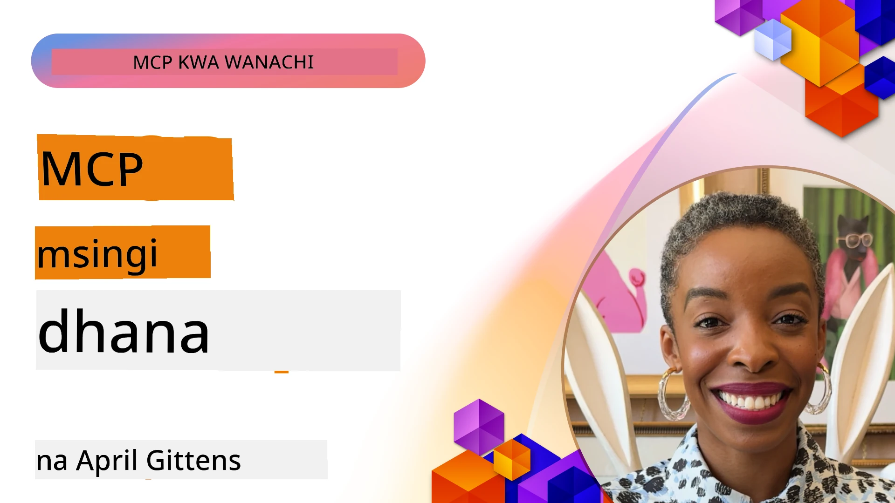
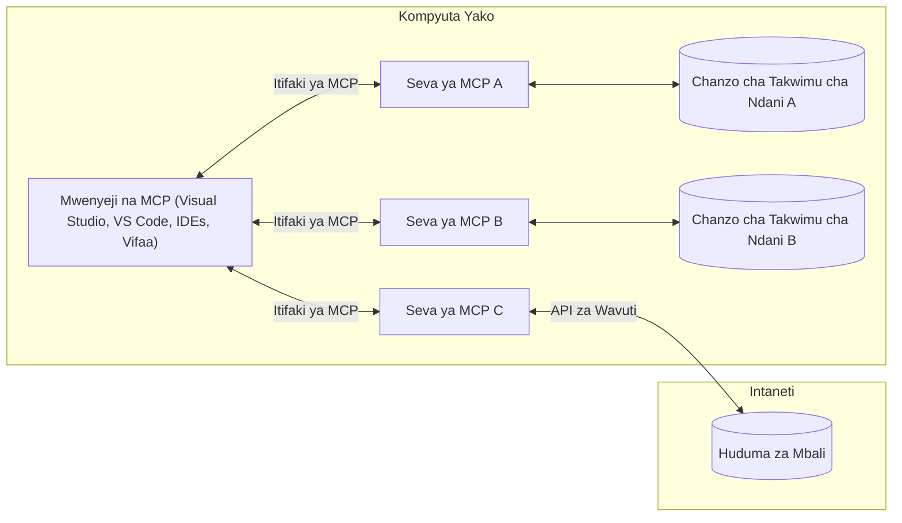

# Dhana za Msingi za MCP: Kufanikisha Itifaki ya Muktadha wa Mfano kwa Muunganisho wa AI

[](https://youtu.be/earDzWGtE84)

_(Bonyeza picha hapa juu kutazama video ya somo hili)_

[Itifaki ya Muktadha wa Mfano (MCP)](https://github.com/modelcontextprotocol) ni mfumo wenye nguvu, uliopangwa kwa viwango unaoboresha mawasiliano kati ya Modeli Kubwa za Lugha (LLMs) na zana za nje, programu, na vyanzo vya data.  
Mwongozo huu utakuelekeza kupitia dhana za msingi za MCP. Utafundishwa kuhusu usanifu wake wa mteja-server, vipengele muhimu, mbinu za mawasiliano, na mbinu bora za utekelezaji.

- **Idhini ya Mtumiaji Iliyo wazi**: Ufikiaji wote wa data na shughuli zinahitaji idhini wazi kutoka kwa mtumiaji kabla ya utekelezaji. Watumiaji lazima kuelewa wazi data gani itafikiwa na hatua gani zitatekelezwa, pamoja na udhibiti wa kina wa ruhusa na vibali.

- **Ulinzi wa Faragha ya Data**: Data ya mtumiaji inaonyeshwa tu kwa idhini wazi na lazima ilindwe kwa udhibiti madhubuti wa ufikiaji katika mzunguko mzima wa mwingiliano. Utekelezaji lazima uzuiwe usambazaji wa data usioidhinishwa na kudumisha mipaka madhubuti ya faragha.

- **Usalama wa Utekelezaji wa Zana**: Kila kuitishwa kwa zana inahitaji idhini wazi ya mtumiaji na kuelewa wazi utendaji, vigezo, na athari zinazowezekana za zana hiyo. Mipaka thabiti ya usalama lazima izuie utekelezaji usiofaa, usio salama, au mbaya wa zana.

- **Usalama wa Tabaka la Usafirishaji**: Njia zote za mawasiliano zinapaswa kutumia mbinu sahihi za usimbaji na uthibitishaji. Muunganisho wa mbali unapaswa kutumia itifaki salama za usafirishaji na usimamizi sahihi wa vibali.

#### Mwongozo wa Utekelezaji:

- **Usimamizi wa Ruhusa**: Tekeleza mifumo ya ruhusa yenye udhibiti wa kina inayoruhusu watumiaji kudhibiti seva, zana, na rasilimali zinazopatikana  
- **Uthibitishaji & Uhifadhi wa Kibali**: Tumia mbinu salama za uthibitishaji (OAuth, funguo za API) kwa usimamizi sahihi wa tokeni na muda wake wa kumalizika  
- **Uthibitishaji wa Ingizo**: Hakiki vigezo vyote na ingizo la data kulingana na mipangilio iliyowekwa ili kuzuia mashambulizi ya sindano  
- **Kumbukumbu za Ukaguzi**: Dumu kumbukumbu kamili za shughuli zote kwa ajili ya usimamizi wa usalama na ufuatiliaji wa utimilifu

## Muhtasari

Somo hili linachunguza usanifu wa msingi na vipengele vinavyojumuisha mfumo wa Itifaki ya Muktadha wa Mfano (MCP). Utajifunza kuhusu usanifu wa mteja-server, vipengele muhimu, na mbinu za mawasiliano zinazotumika katika mwingiliano wa MCP.

## Malengo Muhimu ya Kujifunza

Mwisho wa somo hili, utakuwa umejifunza:

- Kuelewa usanifu wa MCP wa mteja-server.  
- Kutambua majukumu na wajibu wa Wenyeji, Wateja, na Seva.  
- Kuchambua sifa kuu zinazofanya MCP kuwa tabaka lenye kubadilika la muunganisho.  
- Kujifunza jinsi taarifa zinavyotiririka ndani ya mfumo wa MCP.  
- Kupata maarifa ya vitendo kupitia mifano ya msimbo kwa .NET, Java, Python, na JavaScript.

## Usanifu wa MCP: Mtazamo wa Kina

Mfumo wa MCP umejengwa kwa mfano wa mteja-server. Muundo huu unaowezesha programu za AI kuingiliana na zana, hifadhidata, API, na rasilimali za muktadha kwa ufanisi. Tuangazie usanifu huu vipengele vyake vya msingi.

Kimsingi, MCP hufuata usanifu wa mteja-server ambapo programu mwenyeji inaweza kuunganishwa na seva nyingi:


- **Wenyeji wa MCP**: Programu kama VSCode, Claude Desktop, IDEs, au zana za AI zinazotaka kufikia data kupitia MCP  
- **Wateja wa MCP**: Wateja wa itifaki wanaodumisha miunganiko 1:1 na seva  
- **Seva za MCP**: Programu nyepesi kila moja inaonyesha uwezo maalum kupitia Itifaki ya Muktadha wa Mfano  
- **Vyanzo vya Data vya Ndani**: Faili, hifadhidata, na huduma kwenye kompyuta yako ambazo seva za MCP zinaweza kufikia kwa usalama  
- **Huduma za Mbali**: Mifumo ya nje inayopatikana mtandaoni ambayo seva za MCP zinaweza kuunganishwa nayo kupitia API.

Itifaki ya MCP ni kiwango kinachobadilika kwa kutumia matoleo ya tarehe (mfano YYYY-MM-DD). Toleo la sasa la itifaki ni **2025-11-25**. Unaweza kuona masasisho ya hivi karibuni ya [maelezo ya itifaki](https://modelcontextprotocol.io/specification/2025-11-25/)

### 1. Wenyeji

Katika Itifaki ya Muktadha wa Mfano (MCP), **Wenyeji** ni programu za AI zinazotumika kama kiolesura kikuu ambacho watumiaji wanavyoshirikiana nacho. Wenyeji huandaa na kusimamia muunganisho kwa seva nyingi za MCP kwa kuunda wateja wa MCP waliowekwa mahsusi kwa kila muunganisho wa seva. Mifano ya Wenyeji ni pamoja na:

- **Programu za AI**: Claude Desktop, Visual Studio Code, Claude Code  
- **Mazungumzo ya Maendeleo**: IDEs na wahariri wa msimbo wenye muunganisho wa MCP  
- **Programu Maalum**: Wakala wa AI na zana zilizotengenezwa kwa madhumuni maalum

**Wenyeji** ni programu zinazoandaa mwingiliano wa modeli za AI. Wanah:

- **Kuendesha Moduli za AI**: Kutekeleza au kuingiliana na LLMs kutengeneza majibu na kuongoza mtiririko wa kazi za AI  
- **Kusimamia Miunganiko ya Wateja**: Kuunda na kudumisha mteja mmoja wa MCP kwa kila muunganisho wa seva  
- **Kudhibiti Kiolesura cha Mtumiaji**: Kudhibiti mtiririko wa mazungumzo, mwingiliano wa mtumiaji, na uwasilishaji wa majibu  
- **Kutekeleza Usalama**: Kudhibiti ruhusa, vikwazo vya usalama, na uthibitishaji  
- **Kushughulikia Idhini ya Mtumiaji**: Kusimamia idhini ya mtumiaji kwa kushirikiana data na utekelezaji wa zana

### 2. Wateja

**Wateja** ni vipengele muhimu vinavyodumisha miunganiko ya moja kwa moja kati ya Wenyeji na seva za MCP. Kila mteja wa MCP huundwa na Mwenyeji kuunganishwa na seva maalum ya MCP, kuhakikisha njia za mawasiliano zenye mpangilio na usalama. Wateja wengi huruhusu Wenyeji kuunganishwa na seva nyingi kwa wakati mmoja.

**Wateja** ni aina ya kiolesura ndani ya programu mwenyeji. Wanah:

- **Mawasiliano ya Itifaki**: Kutuma maombi ya JSON-RPC 2.0 kwa seva zikiwa na taarifa za maagizo na maelekezo  
- **Mazungumzo ya Uwezo**: Kujadiliana kuhusu vipengele vinavyoungwa mkono na matoleo ya itifaki na seva wakati wa kuanzisha  
- **Utekelezaji wa Zana**: Kusimamia maombi ya utekelezaji wa zana kutoka kwa modeli na kushughulikia majibu  
- **Mabadiliko ya Muda Halisi**: Kushughulikia taarifa na masasisho ya muda halisi kutoka kwa seva  
- **Uchambuzi wa Majibu**: Kuchakata na kupangilia majibu ya seva kwa ajili ya kuonyeshwa kwa watumiaji

### 3. Seva

**Seva** ni programu zinazotoa muktadha, zana, na uwezo kwa wateja wa MCP. Zinaweza kutekelezwa mahali pa karibu (kifaa kimoja na Mwenyeji) au kwa mbali (juu ya majukwaa ya nje), na zinawajibika kushughulikia maombi ya mteja na kutoa majibu yaliyo na muundo. Seva huonyesha utendakazi maalum kupitia Itifaki ya Muktadha wa Mfano iliyosanifiwa.

**Seva** ni huduma zinazotoa muktadha na uwezo. Wanah:

- **Usajili wa Vipengele**: Kusajili na kuonyesha primitive zinazopatikana (rasilimali, maagizo, zana) kwa wateja  
- **Usindikaji wa Maombi**: Kupokea na kutekeleza simu za zana, maombi ya rasilimali, na maombi ya maagizo kutoka kwa wateja  
- **Utayarishaji wa Muktadha**: Kutoa taarifa za muktadha na data ili kuboresha majibu ya modeli  
- **Usimamizi wa Hali**: Kudumisha hali ya kikao na kushughulikia mwingiliano wenye hali inapohitajika  
- **Taarifa za Muda Halisi**: Kutuma taarifa kuhusu mabadiliko ya uwezo na masasisho kwa wateja waliounganishwa

Seva zinaweza kutengenezwa na mtu yeyote kuongeza uwezo wa modeli kwa utendakazi maalum, na zinaunga mkono mazingira za usambazaji wa ndani na za mbali.

### 4. Primitive za Seva

Seva katika Itifaki ya Muktadha wa Mfano (MCP) hutoa primitive tatu za msingi zinazobainisha vipengele vya msingi kwa mwingiliano mzuri kati ya wateja, wenyeji, na modeli za lugha. Primitive hizi zinafafanua aina za taarifa za muktadha na hatua zinazopatikana kupitia itifaki.

Seva za MCP zinaweza kuonyeshwa mchanganyiko wowote wa primitive tatu kuu zifuatazo:

#### Rasilimali

**Rasilimali** ni vyanzo vya data vinavyotoa taarifa za muktadha kwa programu za AI. Zinawakilisha maudhui ya kudumu au yanayobadilika yanayoweza kuongeza ufahamu wa modeli na uamuzi:

- **Data za Muktadha**: Taarifa zilizo na muundo na muktadha kwa matumizi ya modeli za AI  
- **Maktaba za Maarifa**: Maghala ya nyaraka, makala, mikataba, na karatasi za utafiti  
- **Vyanzo vya Data vya Ndani**: Faili, hifadhidata, na taarifa za mfumo wa ndani  
- **Data za Nje**: Majibu ya API, huduma za wavuti, na data ya mifumo ya mbali  
- **Maudhui ya Kusatisha**: Data ya muda halisi inayosasishwa kulingana na hali za nje

Rasilimali hutambuliwa kwa URI na zinaunganishwa kupitia `resources/list` na kupewa kupitia `resources/read`:

```text
file://documents/project-spec.md
database://production/users/schema
api://weather/current
```
  
#### Maagizo

**Maagizo** ni sanamu zinazoweza kutumika tena zinazosaidia kuunda mtiririko wa mwingiliano na modeli za lugha. Zinatoa mifumo iliyopangwa ya mwingiliano na mtiririko wa kazi uliotengenezwa:

- **Mwingiliano wa Kiolezo cha Templeti**: Ujumbe uliowekwa awali na vianzishaji vya mazungumzo  
- **Mifano ya Mtiririko wa Kazi**: Mfululizo uliowekwa wa kawaida kwa kazi na mwingiliano  
- **Mifano ya Few-shot**: Templeti za mfano kwa maelekezo ya modeli  
- **Maagizo ya Mfumo**: Maagizo ya msingi yanayofafanua tabia na muktadha wa modeli  
- **Templeti Zinazobadilika**: Maagizo yaliyo na vigezo yanayobadilika kwa muktadha maalum

Maagizo yanaunga mkono uingizaji wa vigezo na yanaweza kugunduliwa kupitia `prompts/list` na kupatikana kwa `prompts/get`:

```markdown
Generate a {{task_type}} for {{product}} targeting {{audience}} with the following requirements: {{requirements}}
```
  
#### Zana

**Zana** ni kazi zinazoweza kutekelezwa ambazo modeli za AI zinaweza kuitisha kufanya hatua maalum. Zinawakilisha "vitenzi" vya mfumo wa MCP, kiwezesho cha modeli kuingiliana na mifumo ya nje:

- **Kazi Zinazoweza Kutekelezwa**: Operesheni za pekee ambazo modeli zinaweza kuitisha kwa vigezo maalum  
- **Muunganisho wa Mifumo ya Nje**: Simu za API, maswali ya hifadhidata, shughuli za kufungua faili, mahesabu  
- **Utambulisho wa Kipekee**: Kila zana ina jina tofauti, maelezo na muundo wa vigezo  
- **Ingia/Kutoa zenye Muundo**: Zana zinakubali vigezo vilivyohakikiwa na kurudisha majibu yenye muundo na aina maalum  
- **Uwezo wa Hatua**: Kuwawezesha modeli kufanya hatua za ulimwengu halisi na kupata data hai

Zana zimefafanuliwa kwa Schema ya JSON kwa uthibitishaji wa vigezo na kugunduliwa kupitia `tools/list` na kutekelezwa kwa `tools/call`. Zana pia zinaweza kuwa na **ikoni** kama metadata za ziada kwa uwasilishaji bora wa UI.

**Maelezo ya Zana**: Zana zinaunga mkono maelezo ya tabia (mfano, `readOnlyHint`, `destructiveHint`) yanayoeleza kama zana ni ya kusoma tu au ya uharibifu, kusaidia wateja kufanya maamuzi sahihi kuhusu utekelezaji wa zana.

Mfano wa maelezo ya zana:

```typescript
server.tool(
  "search_products", 
  {
    query: z.string().describe("Search query for products"),
    category: z.string().optional().describe("Product category filter"),
    max_results: z.number().default(10).describe("Maximum results to return")
  }, 
  async (params) => {
    // Fanya utafutaji na rudisha matokeo yaliyopangwa
    return await productService.search(params);
  }
);
```
  
## Primitive za Mteja

Katika Itifaki ya Muktadha wa Mfano (MCP), **wateja** wanaweza kuonyesha primitive zinazomruhusu seva kuomba uwezo zaidi kutoka kwa programu mwenyeji. Primitive hizi za upande wa mteja huruhusu utekelezaji tajiri zaidi wa seva unaoweza kupata uwezo wa modeli za AI na mwingiliano wa mtumiaji.

### Sampuli

**Sampuli** inaruhusu seva kuomba ukamilishaji wa modeli za lugha kutoka kwa programu ya AI ya mteja. Primitive hii inawawezesha seva kupata uwezo wa LLM bila kuwaingiza SDK zao au kutegemea modeli zao:

- **Ufikiaji Huru ya Mfano**: Seva zinaweza kuomba ukamilishaji bila kujumuisha SDK za LLM au kusimamia ufikiaji wa modeli  
- **AI Inayonchezwa na Seva**: Inaruhusu seva kuzalisha maudhui kwa kutumia modeli za AI za mteja  
- **Mwingiliano wa Kurudia kwa LLM**: Inaunga mkono matukio magumu ambapo seva zinahitaji msaada wa AI kwa usindikaji  
- **Uundaji wa Maudhui ya Muktadha**: Inaruhusu seva kuunda majibu ya muktadha kwa kutumia modeli ya mwenyeji  
- **Msaada wa Kuitisha Zana**: Seva zinaweza kujumuisha vigezo `tools` na `toolChoice` kuwezesha modeli ya mteja kuitisha zana wakati wa sampuli

Sampuli huanzishwa kupitia njia ya `sampling/complete`, ambapo seva hutuma maombi ya ukamilishaji kwa wateja.

### Mizizi (Roots)

**Mizizi** hutoa njia iliyosanifiwa kwa wateja kuonyesha mipaka ya mfumo wa faili kwa seva, kusaidia seva kuelewa saraka na faili ambazo zinaweza kufikiwa:

- **Mipaka ya Mfumo wa Faili**: Huweka mipaka ya maeneo ambapo seva zinaweza kufanya kazi ndani ya mfumo wa faili  
- **Udhibiti wa Ufikiaji**: Husaidia seva kuelewa saraka na faili ambazo wana ruhusa ya kufikia  
- **Masasisho ya Kusatisha**: Wateja wanaweza kuarifu seva wakati orodha ya mizizi inabadilika  
- **Utambulisho kwa URI**: Mizizi hutumia URI za `file://` kutambua saraka na faili zinazo patikana

Mizizi hugunduliwa kupitia njia ya `roots/list`, na wateja hutuma `notifications/roots/list_changed` wakati mizizi inabadilika.

### Mchochezi (Elicitation)

**Mchochezi** unawawezesha seva kuomba taarifa za ziada au uthibitisho kutoka kwa watumiaji kupitia kiolesura cha mteja:

- **Maombi ya Ingizo la Mtumiaji**: Seva zinaweza kuomba taarifa zaidi zinapohitajika kwa utekelezaji wa zana  
- **Maongezi ya Uthibitisho**: Kuomba idhini ya mtumiaji kwa shughuli nyeti au zenye athari kubwa  
- **Mtiririko wa Kazi wa Kuhusisha**: Inawezesha seva kuunda mwingiliano wa mtumiaji hatua kwa hatua  
- **Ukusanyaji wa Vigezo Vinavyobadilika**: Kukusanya vigezo vilivyokosekana au hiari wakati wa utekelezaji wa zana

Maombi ya mchochezi hufanywa kwa kutumia njia ya `elicitation/request` kukusanya taarifa za mtumiaji kupitia kiolesura cha mteja.

**Mchochezi wa Njia ya URL**: Seva pia zinaweza kuomba mwingiliano wa mtumiaji unaotegemea URL, kuruhusu seva kuelekeza watumiaji kwa kurasa za wavuti za nje kwa uthibitisho, uthibitishaji, au kuingiza data.

### Kumbukumbu (Logging)

**Kumbukumbu** inaruhusu seva kutuma ujumbe wa kumbukumbu wenye muundo kwa wateja kwa madhumuni ya utambuzi kasoro, ufuatiliaji, na kuona hali ya uendeshaji:

- **Msaada wa Utambuzi Kasoro**: Inawezesha seva kutoa kumbukumbu za kina za utekelezaji kwa ajili ya kutatua matatizo  
- **Ufuatiliaji wa Uendeshaji**: Kutuma masasisho ya hali na viashirio vya utendaji kwa wateja  
- **Kuripoti Makosa**: Kutoa muktadha wa makosa na taarifa za uchunguzi  
- **Mifuatilio ya Ukaguzi**: Kuunda kumbukumbu kamili za shughuli na maamuzi ya seva

Ujumbe wa kumbukumbu hutumwa kwa wateja kutoa uwazi wa shughuli za seva na kuwezesha utambuzi kasoro.

## Mtiririko wa Taarifa katika MCP

Itifaki ya Muktadha wa Mfano (MCP) inaelezea mtiririko wenye muundo wa taarifa kati ya wenyeji, wateja, seva, na modeli. Kuelewa mtiririko huu husaidia kufafanua jinsi maombi ya mtumiaji yanavyosindikwa na jinsi zana za nje na data zinavyojumuishwa katika majibu ya modeli.

- **Mwenyeji Anaanzisha Muunganisho**  
  Programu mwenyeji (kama IDE au kiolesura cha mazungumzo) huanzisha muunganisho na seva ya MCP, kawaida kupitia STDIO, WebSocket, au usafirishaji mwingine unaoungwa mkono.

- **Mazungumzo ya Uwezo**  
  Mteja (aliyejengewa ndani ya mwenyeji) na seva hubadilishana taarifa kuhusu vipengele, zana, rasilimali, na matoleo ya itifaki wanayounga mkono. Hii huhakikisha pande zote zinajua uwezo unaopatikana kwa kikao.

- **Ombi la Mtumiaji**  
  Mtumiaji huwa na mwingiliano na mwenyeji (mfano, kuingiza maelekezo au amri). Mwenyeji hukusanya data hii na kuituma kwa mteja kwa usindikaji.

- **Matumizi ya Rasilimali au Zana**  
  - Mteja anaweza kuomba muktadha au rasilimali za ziada kutoka kwa seva (kama faili, rekodi za hifadhidata, au makala za maktaba ya maarifa) ili kuongeza ufahamu wa modeli.  
  - Ikiwa modeli inaona zana inahitajika (mfano, kuleta data, kufanya mahesabu, au kuitisha API), mteja hutuma ombi la kuitisha zana kwa seva, ikieleza jina la zana na vigezo.

- **Utekelezaji wa Seva**  
Server hupokea ombi la rasilimali au kifaa, hufanya shughuli zinazohitajika (kama vile kuendesha kazi, kuuliza hifadhidata, au kupata faili), na hurudisha matokeo kwa mteja kwa muundo uliopangwa.

- **Uundaji wa Majibu**  
  Mteja huunganisha majibu ya seva (data za rasilimali, matokeo ya vifaa, n.k.) katika mwingiliano wa mfano unaoendelea. Mfano hutumia taarifa hii kuunda jibu kamili na linalohusiana na muktadha.

- **Uwasilishaji wa Matokeo**  
  Mwenyeji hupokea matokeo ya mwisho kutoka kwa mteja na kuyaonyesha kwa mtumiaji, mara nyingi ikiwa ni pamoja na maandishi yaliyotengenezwa na mfano na matokeo yoyote kutoka kwa utekelezaji wa zana au utaftaji wa rasilimali.

Mtiririko huu unawawezesha MCP kuunga mkono programu za AI za hali ya juu, zinazojibizana, na zenye ufahamu wa muktadha kwa kuunganisha kwa urahisi mifano na zana za nje na vyanzo vya data.

## Muundo wa Itifaki & Tabaka

MCP ina tabaka mbili tofauti za usanifu zinazofanya kazi pamoja kutoa mfumo kamili wa mawasiliano:

### Tabaka la Data

**Tabaka la Data** hutekeleza itifaki kuu ya MCP kwa kutumia **JSON-RPC 2.0** kama msingi wake. Tabaka hili linafafanua muundo wa ujumbe, semantiki, na mifumo ya mwingiliano:

#### Vipengele Muhimu:

- **Itifaki ya JSON-RPC 2.0**: Mawasiliano yote hutumia muundo wa ujumbe uliowekwa wa JSON-RPC 2.0 kwa simu za mbinu, majibu, na arifa  
- **Usimamizi wa Mzunguko wa Maisha**: Husimamia kuanzishwa kwa muunganisho, majadiliano ya uwezo, na kuisha kwa kikao kati ya wateja na seva  
- **Zana za Seva**: Huiruhusu seva kutoa utendaji wa msingi kupitia zana, rasilimali, na maelekezo  
- **Zana za Mteja**: Huiruhusu seva kuomba sampuli kutoka LLMs, kuomba maingizo ya mtumiaji, na kutuma ujumbe wa kumbukumbu  
- **Arifa za Muda Halisi**: Husaidia arifa zisizo sambazika kwa masasisho ya mabadiliko bila uchunguzi wa mara kwa mara

#### Sifa Muhimu:

- **Majadiliano ya Toleo la Itifaki**: Hutatua toleo kwa tarehe (YYYY-MM-DD) kuhakikisha ulinganifu  
- **Ugunduzi wa Uwezo**: Wateja na seva hubadilishana taarifa za sifa zinazounga mkono wakati wa kuanzishwa  
- **Vikao Vinavyoendelea**: Huhifadhi hali ya muunganisho katika mwingiliano mingi kwa muktadha wa kuendelea

### Tabaka la Usafirishaji

**Tabaka la Usafirishaji** husimamia njia za mawasiliano, upangaji wa ujumbe, na uthibitishaji kati ya washiriki wa MCP:

#### Mbinu Zinazotumika za Usafirishaji:

1. **Usafirishaji wa STDIO**:  
   - Hutumia michango ya kuingiza/kutoka ya kawaida kwa mawasiliano ya moja kwa moja ya mchakato  
   - Ni bora kwa michakato ya ndani katika kompyuta moja bila mzigo wa mtandao  
   - Mara nyingi hutumika katika utekelezaji wa seva za MCP za ndani

2. **Usafirishaji wa HTTP Unaoweza Kupitia (Streamable)**:  
   - Hutumia HTTP POST kwa ujumbe kutoka mteja hadi seva  
   - Tukio la Server-Sent Events (SSE) kwa mtiririko kutoka seva hadi mteja kwa hiari  
   - Huwezesha mawasiliano ya seva za mbali kupitia mitandao  
   - Husaidia uthibitishaji wa kawaida wa HTTP (tokeni za bearer, funguo za API, vichwa maalum)  
   - MCP inapendekeza OAuth kwa uthibitishaji salama unaotumia tokeni

#### Uhusiano wa Usafirishaji:

Tabaka la usafirishaji huficha maelezo ya mawasiliano kutoka tabaka la data, na kuruhusu muundo ule ule wa ujumbe wa JSON-RPC 2.0 kwa njia zote za usafirishaji. Kipengele hiki huruhusu programu kubadilisha kati ya seva za ndani na za mbali kwa urahisi.

### Mambo ya Usalama

Utekelezaji wa MCP lazima uzingatie kanuni kadhaa muhimu za usalama ili kuhakikisha mwingiliano salama, unaoaminika, na ulio salama katika shughuli zote za itifaki:

- **Ridhaa na Udhibiti wa Mtumiaji**: Watumiaji lazima wape ridhaa wazi kabla ya data yoyote kufikiwa au shughuli kufanywa. Wanapaswa kuwa na udhibiti wa wazi juu ya data inayoshirikiwa na hatua zinazoruhusiwa, zikiwa na interfaces za mtumiaji zinazoweza kueleweka kwa uhakiki na idhini ya shughuli.

- **Usiri wa Data**: Data za watumiaji zinapaswa kufichwa tu kwa ridhaa wazi na kulindwa kwa udhibiti unaofaa wa ufikiaji. Utekelezaji wa MCP lazima uzingatie kuzuia usambazaji usioruhusiwa wa data na kuhakikisha usiri unahifadhiwa katika mwingiliano wote.

- **Usalama wa Zana**: Kabla ya kuitisha kifaa chochote, ridhaa wazi ya mtumiaji inahitajika. Watumiaji wanapaswa kuelewa kazi za kila kifaa, na mpaka madhubuti ya usalama yanapaswa kutekelezwa kuzuia utekelezaji usiotarajiwa au hatari wa kifaa.

Kwa kufuata kanuni hizi za usalama, MCP inahakikisha uaminifu wa watumiaji, usiri, na usalama vinahifadhiwa katika mwingiliano wote wa itifaki huku ikiruhusu muunganisho wenye nguvu wa AI.

## Mifano ya Kanuni: Vipengele Muhimu

Hapa kuna mifano ya kanuni katika lugha kadhaa maarufu inayonyesha jinsi ya kutekeleza vipengele muhimu vya seva ya MCP na zana.

### Mfano wa .NET: Kuunda Seva Rahisi ya MCP na Zana

Huu ni mfano wa vitendo wa kanuni za .NET unaoonyesha jinsi ya kutekeleza seva rahisi ya MCP yenye zana maalum. Mfano huu unaonyesha jinsi ya kufafanua na kusajili zana, kushughulikia maombi, na kuunganisha seva kwa kutumia Model Context Protocol.

```csharp
using System;
using System.Threading.Tasks;
using ModelContextProtocol.Server;
using ModelContextProtocol.Server.Transport;
using ModelContextProtocol.Server.Tools;

public class WeatherServer
{
    public static async Task Main(string[] args)
    {
        // Create an MCP server
        var server = new McpServer(
            name: "Weather MCP Server",
            version: "1.0.0"
        );
        
        // Register our custom weather tool
        server.AddTool<string, WeatherData>("weatherTool", 
            description: "Gets current weather for a location",
            execute: async (location) => {
                // Call weather API (simplified)
                var weatherData = await GetWeatherDataAsync(location);
                return weatherData;
            });
        
        // Connect the server using stdio transport
        var transport = new StdioServerTransport();
        await server.ConnectAsync(transport);
        
        Console.WriteLine("Weather MCP Server started");
        
        // Keep the server running until process is terminated
        await Task.Delay(-1);
    }
    
    private static async Task<WeatherData> GetWeatherDataAsync(string location)
    {
        // This would normally call a weather API
        // Simplified for demonstration
        await Task.Delay(100); // Simulate API call
        return new WeatherData { 
            Temperature = 72.5,
            Conditions = "Sunny",
            Location = location
        };
    }
}

public class WeatherData
{
    public double Temperature { get; set; }
    public string Conditions { get; set; }
    public string Location { get; set; }
}
```


### Mfano wa Java: Vipengele vya Seva ya MCP

Mfano huu unaonyesha seva na usajili wa kifaa sawa na mfano wa .NET uliotajwa hapo juu, lakini umeandikwa kwa Java.

```java
import io.modelcontextprotocol.server.McpServer;
import io.modelcontextprotocol.server.McpToolDefinition;
import io.modelcontextprotocol.server.transport.StdioServerTransport;
import io.modelcontextprotocol.server.tool.ToolExecutionContext;
import io.modelcontextprotocol.server.tool.ToolResponse;

public class WeatherMcpServer {
    public static void main(String[] args) throws Exception {
        // Tengeneza seva ya MCP
        McpServer server = McpServer.builder()
            .name("Weather MCP Server")
            .version("1.0.0")
            .build();
            
        // Sajili chombo cha hali ya hewa
        server.registerTool(McpToolDefinition.builder("weatherTool")
            .description("Gets current weather for a location")
            .parameter("location", String.class)
            .execute((ToolExecutionContext ctx) -> {
                String location = ctx.getParameter("location", String.class);
                
                // Pata data ya hali ya hewa (imefupishwa)
                WeatherData data = getWeatherData(location);
                
                // Rejesha jibu lililopangwa
                return ToolResponse.content(
                    String.format("Temperature: %.1f°F, Conditions: %s, Location: %s", 
                    data.getTemperature(), 
                    data.getConditions(), 
                    data.getLocation())
                );
            })
            .build());
        
        // Unganisha seva kwa kutumia usafirishaji wa stdio
        try (StdioServerTransport transport = new StdioServerTransport()) {
            server.connect(transport);
            System.out.println("Weather MCP Server started");
            // Endelea kuendesha seva hadi mchakato uishe
            Thread.currentThread().join();
        }
    }
    
    private static WeatherData getWeatherData(String location) {
        // Utekelezaji ungeita API ya hali ya hewa
        // Imefupishwa kwa madhumuni ya mfano
        return new WeatherData(72.5, "Sunny", location);
    }
}

class WeatherData {
    private double temperature;
    private String conditions;
    private String location;
    
    public WeatherData(double temperature, String conditions, String location) {
        this.temperature = temperature;
        this.conditions = conditions;
        this.location = location;
    }
    
    public double getTemperature() {
        return temperature;
    }
    
    public String getConditions() {
        return conditions;
    }
    
    public String getLocation() {
        return location;
    }
}
```


### Mfano wa Python: Kujenga Seva ya MCP

Mfano huu hutumia fastmcp, hivyo tafadhali hakikisha umeisakinisha kwanza:

```python
pip install fastmcp
```
Code Sample:

```python
#!/usr/bin/env python3
import asyncio
from fastmcp import FastMCP
from fastmcp.transports.stdio import serve_stdio

# Unda seva ya FastMCP
mcp = FastMCP(
    name="Weather MCP Server",
    version="1.0.0"
)

@mcp.tool()
def get_weather(location: str) -> dict:
    """Gets current weather for a location."""
    return {
        "temperature": 72.5,
        "conditions": "Sunny",
        "location": location
    }

# Njia mbadala inayotumia darasa
class WeatherTools:
    @mcp.tool()
    def forecast(self, location: str, days: int = 1) -> dict:
        """Gets weather forecast for a location for the specified number of days."""
        return {
            "location": location,
            "forecast": [
                {"day": i+1, "temperature": 70 + i, "conditions": "Partly Cloudy"}
                for i in range(days)
            ]
        }

# Sajili zana za darasa
weather_tools = WeatherTools()

# Anzisha seva
if __name__ == "__main__":
    asyncio.run(serve_stdio(mcp))
```


### Mfano wa JavaScript: Kuunda Seva ya MCP

Mfano huu unaonyesha uundaji wa seva ya MCP kwa JavaScript na jinsi ya kusajili zana mbili zinazohusiana na hali ya hewa.

```javascript
// Kutumia SDK Rasmi ya Itifaki ya Muktadha wa Mfano
import { McpServer } from "@modelcontextprotocol/sdk/server/mcp.js";
import { StdioServerTransport } from "@modelcontextprotocol/sdk/server/stdio.js";
import { z } from "zod"; // Kwa uthibitishaji wa vigezo

// Tengeneza seva ya MCP
const server = new McpServer({
  name: "Weather MCP Server",
  version: "1.0.0"
});

// Tafsiri chombo cha hali ya hewa
server.tool(
  "weatherTool",
  {
    location: z.string().describe("The location to get weather for")
  },
  async ({ location }) => {
    // Hii kawaida itaita API ya hali ya hewa
    // Imepunguzwa kwa maonyesho
    const weatherData = await getWeatherData(location);
    
    return {
      content: [
        { 
          type: "text", 
          text: `Temperature: ${weatherData.temperature}°F, Conditions: ${weatherData.conditions}, Location: ${weatherData.location}` 
        }
      ]
    };
  }
);

// Tafsiri chombo cha utabiri
server.tool(
  "forecastTool",
  {
    location: z.string(),
    days: z.number().default(3).describe("Number of days for forecast")
  },
  async ({ location, days }) => {
    // Hii kawaida itaita API ya hali ya hewa
    // Imepunguzwa kwa maonyesho
    const forecast = await getForecastData(location, days);
    
    return {
      content: [
        { 
          type: "text", 
          text: `${days}-day forecast for ${location}: ${JSON.stringify(forecast)}` 
        }
      ]
    };
  }
);

// Kazi za usaidizi
async function getWeatherData(location) {
  // Tengeneza simu ya API
  return {
    temperature: 72.5,
    conditions: "Sunny",
    location: location
  };
}

async function getForecastData(location, days) {
  // Tengeneza simu ya API
  return Array.from({ length: days }, (_, i) => ({
    day: i + 1,
    temperature: 70 + Math.floor(Math.random() * 10),
    conditions: i % 2 === 0 ? "Sunny" : "Partly Cloudy"
  }));
}

// Unganisha seva kwa kutumia usafirishaji wa stdio
const transport = new StdioServerTransport();
server.connect(transport).catch(console.error);

console.log("Weather MCP Server started");
```


Mfano huu wa JavaScript unaonyesha jinsi ya kuunda mteja wa MCP anayejumuika na seva, kutuma maelekezo, na kuchakata majibu ikiwa ni pamoja na simu yoyote za kifaa zilizofanyika.

## Usalama na Uidhinishaji

MCP ina dhana kadhaa na mbinu za kijenzi kwa kusimamia usalama na uidhinishaji katika itifaki yote:

1. **Udhibiti wa Idhini ya Kifaa**:  
   Wateja wanaweza kuweka ni zana gani mfano unaruhusiwa kutumia wakati wa kikao. Hii huhakikisha zana zinazoruhusiwa tu ndivyo zinazopatikana, kupunguza hatari ya shughuli zisizotarajiwa au hatari. Idhini inaweza kurekebishwa kwa mujibu wa mapendeleo ya mtumiaji, sera za shirika, au muktadha wa mwingiliano.

2. **Uthibitishaji**:  
   Seva zinaweza kuhitaji uthibitishaji kabla ya kutoa ufikiaji kwa zana, rasilimali, au shughuli nyeti. Hii inaweza kujumuisha funguo za API, tokeni za OAuth, au njia nyingine za uthibitishaji. Uthibitishaji mzuri huhakikisha wateja na watumiaji waliothibitishwa tu hawawezi kuitisha uwezo wa upande wa seva.

3. **Uhakiki**:  
   Ukaguzi wa vigezo hufanywa kwa kila simu ya kifaa. Kifaa kila kimoja hufafanua aina, muundo, na vizingiti vinavyotarajiwa kwa vigezo vyake, na seva huhakiki maombi yanayokuja kwa mujibu. Hii huzuia data iliyopitwa au hatari kufikia utekelezaji wa zana na husaidia kudumisha uadilifu wa shughuli.

4. **Kudhibiti Kasi ya Matumizi**:  
   Ili kuzuia matumizi mabaya na kuhakikisha usawa katika matumizi ya rasilimali za seva, seva za MCP zinaweza kutekeleza mbinu za kudhibiti kasi ya maombi ya zana na ufikiaji wa rasilimali. Vizingiti vinaweza kuwekwa kwa mtumiaji, kikao, au kwa jumla, na husaidia kulinda dhidi ya mashambulizi ya kupunguza huduma au matumizi kupita kiasi.

Kwa kuunganisha mbinu hizi, MCP hutoa msingi salama wa kuunganisha mifano ya lugha na zana za nje na vyanzo vya data, huku ikiwapa watumiaji na waendelezaji udhibiti mkubwa juu ya ufikiaji na matumizi.

## Ujumbe wa Itifaki & Mtiririko wa Mawasiliano

Mawasiliano ya MCP hutumia ujumbe uliopangwa wa **JSON-RPC 2.0** kuwezesha mwingiliano wazi na wa kuaminika kati ya wenyeji, wateja, na seva. Itifaki inaeleza mifumo maalum ya ujumbe kwa aina tofauti za shughuli:

### Aina Muhimu za Ujumbe:

#### **Ujumbe za Kuanzisha**  
- Ombi la **`initialize`**: Huweka muunganisho na kujadiliana toleo na uwezo wa itifaki  
- Jibu la **`initialize`**: Huthibitisha sifa zinazounga mkono na taarifa za seva  
- **`notifications/initialized`**: Inaashiria kuwa kuanzishwa kumekamilika na kikao kiko tayari

#### **Ujumbe za Ugunduzi**  
- Ombi la **`tools/list`**: Huagiza zana zinapatikana kutoka seva  
- Ombi la **`resources/list`**: Huorodhesha rasilimali zinapatikana (vyanzo vya data)  
- Ombi la **`prompts/list`**: Huleta templeti za maelekezo zinapatikana

#### **Ujumbe za Utekelezaji**  
- Ombi la **`tools/call`**: Hutekeleza kifaa maalum kwa vigezo vilivyotolewa  
- Ombi la **`resources/read`**: Huchukua maudhui kutoka rasilimali maalum  
- Ombi la **`prompts/get`**: Huleta templeti ya maelekezo na vigezo chaguo

#### **Ujumbe za Kwenye Mteja**  
- Ombi la **`sampling/complete`**: Seva huomba kukamilika kwa LLM kutoka kwa mteja  
- **`elicitation/request`**: Seva huomba maingizo ya mtumiaji kupitia interface ya mteja  
- Ujumbe wa Kumbukumbu: Seva hutuma ujumbe wa kumbukumbu uliopangwa kwa mteja

#### **Ujumbe za Arifa**  
- **`notifications/tools/list_changed`**: Seva inaarifu mteja kuhusu mabadiliko ya zana  
- **`notifications/resources/list_changed`**: Seva inaarifu mteja kuhusu mabadiliko ya rasilimali  
- **`notifications/prompts/list_changed`**: Seva inaarifu mteja kuhusu mabadiliko ya maelekezo

### Muundo wa Ujumbe:

Ujumbe wote wa MCP hufuata muundo wa JSON-RPC 2.0 na:  
- **Ujumbe za Ombi**: Zinajumuisha `id`, `method`, na chaguo la `params`  
- **Majibu**: Yanajumuisha `id` na matokeo `result` au kosa `error`  
- **Arifa**: Zinajumuisha `method` na chaguo la `params` (bila `id` wala jibu linalotarajiwa)

Mawasiliano yenye muundo huu huhakikisha mwingiliano wa kuaminika, unaoripotiwa, na unaoendelea uliosaidia hali za hali ya juu kama masasisho ya muda halisi, mfuatano wa zana, na kushughulikia makosa kwa ustadi.

### Kazi (Jaribio)

**Kazi** ni kipengele cha majaribio kinachotoa kufunika kwa utekelezaji thabiti kuruhusu upokeaji wa matokeo yaliyocheleweshwa na ufuatiliaji wa hali kwa maombi ya MCP:

- **Shughuli Ndefu**: Kufuatilia hesabu ghali, kiotomatiki cha mtiririko wa kazi, na usindikaji wa kundi  
- **Matokeo yaliyocheleweshwa**: Kuchunguza hali ya kazi na kusanya matokeo baada ya shughuli kukamilika  
- **Ufuatiliaji wa Hali**: Kufuatilia maendeleo ya kazi kupitia hatua za mzunguko wa maisha zilizofafanuliwa  
- **Shughuli za Hatua Nyingi**: Kusaidia michakato tata inayochukua mwingiliano zaidi ya mmoja

Kazi huzunguka maombi ya kawaida ya MCP kuwezesha mifumo isiyozuia ikiwa matokeo hayawezi kutolewa mara moja.

## Muhimu za Kukumbuka

- **Usanifu**: MCP hutumia usanifu wa mteja-seva ambapo wenyeji husimamia muunganisho wa wateja wengi kwa seva  
- **Washiriki**: Eneo lina viongozi (programu za AI), wateja (vionganishi vya itifaki), na seva (watoa uwezo)  
- **Njia za Usafirishaji**: Mawasiliano yanaunga mkono STDIO (ndani) na HTTP Inayoweza Kupitia na SSE ya hiari (mbali)  
- **Vipengele vya Kimsingi**: Seva huonyesha zana (kazi zinazotekelezwa), rasilimali (vyanzo vya data), na maelekezo (templeti)  
- **Zana za Mteja**: Seva zinaweza kuomba sampuli (kutimizwa kwa LLM zikiwa na msaada wa simu za kifaa), maombi ya maingizo (ikiwemo hali ya URL), mipaka ya mizizi (kifurushi cha mfumo wa faili), na kumbukumbu kutoka kwa wateja  
- **Vipengele vya Maajaribio**: Kazi hutoa kufunika kwa utekelezaji thabiti kwa shughuli ndefu  
- **Msingi wa Itifaki**: Imetengenezwa juu ya JSON-RPC 2.0 na toleo la tarehe (sasa: 2025-11-25)  
- **Uwezo wa Muda Halisi**: Inasaidia arifa kwa masasisho ya mabadiliko na ulinganifu wa wakati halisi  
- **Usalama Kwanza**: Ridhaa wazi ya mtumiaji, ulinzi wa usiri wa data, na usafirishaji salama ni mahitaji ya msingi

## Zoefu

Buni kifaa rahisi cha MCP ambacho kingekuwa na manufaa katika eneo lako. Tafsiri:  
1. Kifaa kitaitwaje  
2. Kigezo gani kitabidi kuikubali  
3. Matokeo gani itarudisha  
4. Mfano unaweza kutumia kifaa hiki kutatua matatizo ya mtumiaji vipi

---

## Kinachofuata

Ifuatayo: [Sura ya 2: Usalama](../02-Security/README.md)

---

<!-- CO-OP TRANSLATOR DISCLAIMER START -->
**Kiarifa cha Kutokuwajibika**:
Hati hii imetafsiriwa kwa kutumia huduma ya utafsiri wa AI [Co-op Translator](https://github.com/Azure/co-op-translator). Ingawa tunajitahidi kufanikisha usahihi, tafadhali fahamu kwamba tafsiri za kiotomatiki zinaweza kuwa na makosa au upotoshaji. Hati asili katika lugha yake ya asili inapaswa kuzingatiwa kama chanzo cha mamlaka. Kwa habari muhimu sana, tafsiri ya kitaalamu inayofanywa na binadamu inapendekezwa. Hatuna dhamana kwa kutoelewana au tafsiri potofu zinazotokana na matumizi ya tafsiri hii.
<!-- CO-OP TRANSLATOR DISCLAIMER END -->