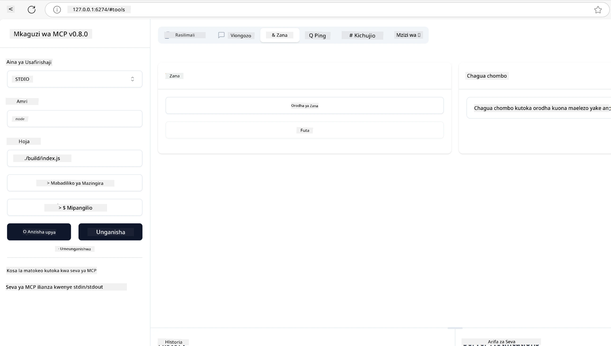
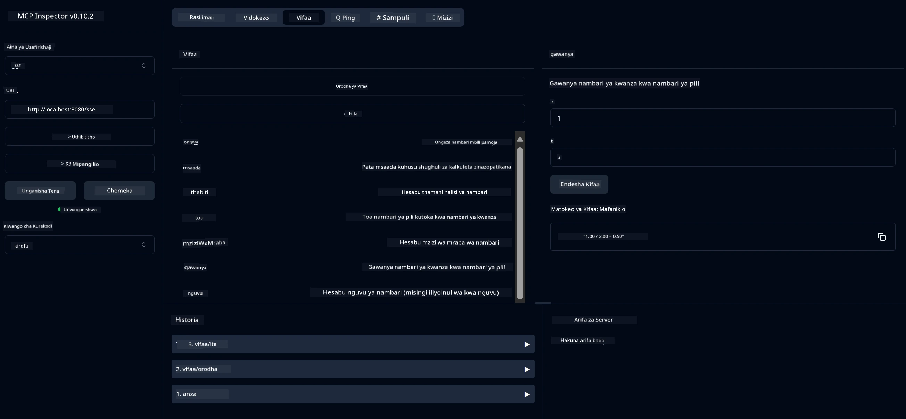
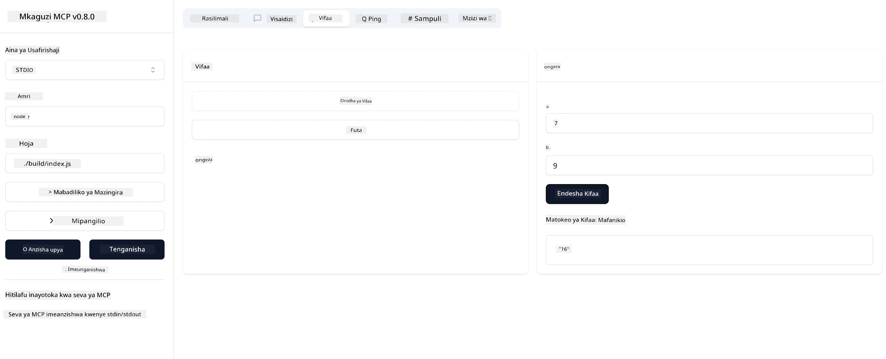

# Kuanzisha na MCP

Karibu kwenye hatua zako za kwanza na Model Context Protocol (MCP)! Iwe wewe ni mpya kwa MCP au unatafuta kuongeza uelewa wako, mwongozo huu utakuelekeza kupitia mchakato muhimu wa usanidi na maendeleo. Utagundua jinsi MCP inavyowezesha muunganisho usio na mshono kati ya mifano ya AI na programu, na kujifunza jinsi ya kuandaa mazingira yako haraka kwa ajili ya kujenga na kujaribu suluhisho zinazotumia MCP.

> TLDR; Ikiwa unajenga programu za AI, unajua kuwa unaweza kuongeza zana na rasilimali nyingine kwenye LLM yako (mfano mkubwa wa lugha), ili kufanya LLM iwe na maarifa zaidi. Hata hivyo, ikiwa utaweka zana na rasilimali hizo kwenye seva, uwezo wa programu na seva unaweza kutumiwa na mteja yeyote akiwa na/au bila LLM.

## Muhtasari

Somo hili linatoa mwongozo wa vitendo juu ya kuanzisha mazingira ya MCP na kujenga programu zako za kwanza za MCP. Utajifunza jinsi ya kusanidi zana na mifumo muhimu, kujenga seva za msingi za MCP, kuunda programu za mwenyeji, na kujaribu utekelezaji wako.

Model Context Protocol (MCP) ni itifaki wazi inayobainisha jinsi programu zinavyotoa muktadha kwa LLMs. Fikiria MCP kama bandari ya USB-C kwa programu za AI - inatoa njia ya kawaida ya kuunganisha mifano ya AI na vyanzo tofauti vya data na zana.

## Malengo ya Kujifunza

Mwisho wa somo hili, utaweza:

- Kuanzisha mazingira ya maendeleo kwa MCP kwa C#, Java, Python, TypeScript, na Rust
- Kujenga na kupeleka seva za msingi za MCP zenye vipengele maalum (rasilimali, maelekezo, na zana)
- Kuunda programu za mwenyeji zinazounganisha na seva za MCP
- Kujaribu na kutatua matatizo ya utekelezaji wa MCP

## Kuandaa Mazingira Yako ya MCP

Kabla ya kuanza kufanya kazi na MCP, ni muhimu kuandaa mazingira yako ya maendeleo na kuelewa mtiririko wa kazi wa msingi. Sehemu hii itakuongoza kupitia hatua za mwanzo za usanidi ili kuhakikisha kuanza kwa MCP kunakuwa laini.

### Mahitaji ya Awali

Kabla ya kuingia kwenye maendeleo ya MCP, hakikisha una:

- **Mazingira ya Maendeleo**: Kwa lugha uliyochagua (C#, Java, Python, TypeScript, au Rust)
- **IDE/Mhariri**: Visual Studio, Visual Studio Code, IntelliJ, Eclipse, PyCharm, au mhariri wa kisasa wa msimbo wowote
- **Wasimamizi wa Pakiti**: NuGet, Maven/Gradle, pip, npm/yarn, au Cargo
- **Vifunguo vya API**: Kwa huduma zozote za AI unazopanga kutumia katika programu zako za mwenyeji

## Muundo wa Msingi wa Seva ya MCP

Seva ya MCP kawaida inajumuisha:

- **Usanidi wa Seva**: Kusanidi bandari, uthibitishaji, na mipangilio mingine
- **Rasilimali**: Data na muktadha unaopatikana kwa LLMs
- **Zana**: Uwezo wa mifano kuitisha
- **Maelekezo**: Violezo vya kuunda au kupanga maandishi

Hapa kuna mfano rahisi kwa TypeScript:

```typescript
import { McpServer, ResourceTemplate } from "@modelcontextprotocol/sdk/server/mcp.js";
import { StdioServerTransport } from "@modelcontextprotocol/sdk/server/stdio.js";
import { z } from "zod";

// Tengeneza seva ya MCP
const server = new McpServer({
  name: "Demo",
  version: "1.0.0"
});

// Ongeza chombo cha kuongeza
server.tool("add",
  { a: z.number(), b: z.number() },
  async ({ a, b }) => ({
    content: [{ type: "text", text: String(a + b) }]
  })
);

// Ongeza rasilimali ya salamu inayobadilika
server.resource(
  "file",
  // Kigezo 'list' kinaamua jinsi rasilimali inavyoorodhesha faili zinazopatikana. Kuweka kuwa undefined kunazuia orodha kwa rasilimali hii.
  new ResourceTemplate("file://{path}", { list: undefined }),
  async (uri, { path }) => ({
    contents: [{
      uri: uri.href,
      text: `File, ${path}!`
    }]
  })
);

// Ongeza rasilimali ya faili inayosoma yaliyomo kwenye faili
server.resource(
  "file",
  new ResourceTemplate("file://{path}", { list: undefined }),
  async (uri, { path }) => {
    let text;
    try {
      text = await fs.readFile(path, "utf8");
    } catch (err) {
      text = `Error reading file: ${err.message}`;
    }
    return {
      contents: [{
        uri: uri.href,
        text
      }]
    };
  }
);

server.prompt(
  "review-code",
  { code: z.string() },
  ({ code }) => ({
    messages: [{
      role: "user",
      content: {
        type: "text",
        text: `Please review this code:\n\n${code}`
      }
    }]
  })
);

// Anza kupokea ujumbe kwenye stdin na kutuma ujumbe kwenye stdout
const transport = new StdioServerTransport();
await server.connect(transport);
```

Katika msimbo uliotangulia tulifanya:

- Kuleta madarasa muhimu kutoka MCP TypeScript SDK.
- Kuunda na kusanidi mfano mpya wa seva ya MCP.
- Kusajili zana maalum (`calculator`) na kazi ya mshughulikiaji.
- Kuanza seva kusikiliza maombi ya MCP yanayoingia.

## Kujifunza na Kutatua Matatizo

Kabla ya kuanza kujaribu seva yako ya MCP, ni muhimu kuelewa zana zinazopatikana na mbinu bora za kutatua matatizo. Upimaji mzuri huhakikisha seva yako inafanya kazi kama inavyotarajiwa na husaidia kutambua na kutatua matatizo haraka. Sehemu inayofuata inaelezea mbinu zinazopendekezwa za kuthibitisha utekelezaji wako wa MCP.

MCP hutoa zana za kusaidia kujaribu na kutatua matatizo ya seva zako:

- **Zana ya Inspector**, kiolesura hiki cha picha hukuwezesha kuungana na seva yako na kujaribu zana, maelekezo na rasilimali zako.
- **curl**, pia unaweza kuungana na seva yako kwa kutumia zana ya mstari wa amri kama curl au wateja wengine wanaoweza kuunda na kuendesha amri za HTTP.

### Kutumia MCP Inspector

[MCP Inspector](https://github.com/modelcontextprotocol/inspector) ni zana ya majaribio ya kuona inayokusaidia:

1. **Gundua Uwezo wa Seva**: Kugundua moja kwa moja rasilimali, zana, na maelekezo yanayopatikana
2. **Jaribu Utekelezaji wa Zana**: Jaribu vigezo tofauti na uone majibu kwa wakati halisi
3. **Tazama Metadata ya Seva**: Chunguza taarifa za seva, skimu, na usanidi

```bash
# mfano TypeScript, kusakinisha na kuendesha MCP Inspector
npx @modelcontextprotocol/inspector node build/index.js
```

Unapotekeleza amri zilizo juu, MCP Inspector itazindua kiolesura cha wavuti cha ndani kwenye kivinjari chako. Unaweza kutarajia kuona dashibodi inayoonyesha seva zako za MCP zilizosajiliwa, zana zao zinazopatikana, rasilimali, na maelekezo. Kiolesura hiki hukuwezesha kujaribu utekelezaji wa zana kwa ushirikiano, kuchunguza metadata ya seva, na kuona majibu kwa wakati halisi, na kufanya iwe rahisi kuthibitisha na kutatua matatizo ya utekelezaji wa seva zako za MCP.

Hapa kuna picha ya skrini inavyoweza kuonekana:



## Masuala ya Kawaida ya Usanidi na Suluhisho

| Tatizo | Suluhisho Linawezekana |
|-------|------------------------|
| Muunganisho umekataliwa | Angalia kama seva inaendesha na bandari ni sahihi |
| Makosa ya utekelezaji wa zana | Kagua uthibitishaji wa vigezo na usimamizi wa makosa |
| Kushindwa kwa uthibitishaji | Thibitisha funguo za API na ruhusa |
| Makosa ya uthibitishaji wa skimu | Hakikisha vigezo vinaendana na skimu iliyobainishwa |
| Seva haianzi | Angalia migongano ya bandari au utegemezi uliokosekana |
| Makosa ya CORS | Sanidi vichwa vya CORS vinavyofaa kwa maombi ya asili tofauti |
| Masuala ya uthibitishaji | Thibitisha uhalali wa tokeni na ruhusa |

## Maendeleo ya Kiasili

Kwa maendeleo na majaribio ya ndani, unaweza kuendesha seva za MCP moja kwa moja kwenye mashine yako:

1. **Anza mchakato wa seva**: Endesha programu yako ya seva ya MCP
2. **Sanidi mtandao**: Hakikisha seva inapatikana kwenye bandari inayotarajiwa
3. **Unganisha wateja**: Tumia URL za muunganisho wa ndani kama `http://localhost:3000`

```bash
# Mfano: Kuendesha seva ya TypeScript MCP kwa ndani
npm run start
# Seva inaendesha kwenye http://localhost:3000
```

## Kujenga Seva yako ya Kwanza ya MCP

Tumejifunza [Misingi ya Msingi](/01-CoreConcepts/README.md) katika somo lililopita, sasa ni wakati wa kutumia maarifa hayo kazini.

### Seva inaweza kufanya nini

Kabla ya kuanza kuandika msimbo, tukumbuke tu seva inaweza kufanya nini:

Seva ya MCP inaweza kwa mfano:

- Kupata faili za ndani na hifadhidata
- Kuungana na API za mbali
- Kufanya mahesabu
- Kuunganishwa na zana na huduma nyingine
- Kutoa kiolesura cha mtumiaji kwa mwingiliano

Nzuri, sasa tunajua tunachoweza kufanya kwa seva, hebu tuanze kuandika msimbo.

## Zoef: Kuunda seva

Ili kuunda seva, unahitaji kufuata hatua hizi:

- Sakinisha MCP SDK.
- Unda mradi na usanidi muundo wa mradi.
- Andika msimbo wa seva.
- Jaribu seva.

### -1- Unda mradi

#### TypeScript

```sh
# Unda saraka ya mradi na anzisha mradi wa npm
mkdir calculator-server
cd calculator-server
npm init -y
```

#### Python

```sh
# Unda saraka ya mradi
mkdir calculator-server
cd calculator-server
# Fungua folda katika Visual Studio Code - Ruka hii ikiwa unatumia IDE tofauti
code .
```

#### .NET

```sh
dotnet new console -n McpCalculatorServer
cd McpCalculatorServer
```

#### Java

Kwa Java, unda mradi wa Spring Boot:

```bash
curl https://start.spring.io/starter.zip \
  -d dependencies=web \
  -d javaVersion=21 \
  -d type=maven-project \
  -d groupId=com.example \
  -d artifactId=calculator-server \
  -d name=McpServer \
  -d packageName=com.microsoft.mcp.sample.server \
  -o calculator-server.zip
```

Fungua faili la zip:

```bash
unzip calculator-server.zip -d calculator-server
cd calculator-server
# hiari ondoa jaribio lisilotumika
rm -rf src/test/java
```

Ongeza usanidi kamili ufuatao kwenye faili yako *pom.xml*:

```xml
<?xml version="1.0" encoding="UTF-8"?>
<project xmlns="http://maven.apache.org/POM/4.0.0"
    xmlns:xsi="http://www.w3.org/2001/XMLSchema-instance"
    xsi:schemaLocation="http://maven.apache.org/POM/4.0.0 http://maven.apache.org/xsd/maven-4.0.0.xsd">
    <modelVersion>4.0.0</modelVersion>
    
    <!-- Spring Boot parent for dependency management -->
    <parent>
        <groupId>org.springframework.boot</groupId>
        <artifactId>spring-boot-starter-parent</artifactId>
        <version>3.5.0</version>
        <relativePath />
    </parent>

    <!-- Project coordinates -->
    <groupId>com.example</groupId>
    <artifactId>calculator-server</artifactId>
    <version>0.0.1-SNAPSHOT</version>
    <name>Calculator Server</name>
    <description>Basic calculator MCP service for beginners</description>

    <!-- Properties -->
    <properties>
        <java.version>21</java.version>
        <maven.compiler.source>21</maven.compiler.source>
        <maven.compiler.target>21</maven.compiler.target>
    </properties>

    <!-- Spring AI BOM for version management -->
    <dependencyManagement>
        <dependencies>
            <dependency>
                <groupId>org.springframework.ai</groupId>
                <artifactId>spring-ai-bom</artifactId>
                <version>1.0.0-SNAPSHOT</version>
                <type>pom</type>
                <scope>import</scope>
            </dependency>
        </dependencies>
    </dependencyManagement>

    <!-- Dependencies -->
    <dependencies>
        <dependency>
            <groupId>org.springframework.ai</groupId>
            <artifactId>spring-ai-starter-mcp-server-webflux</artifactId>
        </dependency>
        <dependency>
            <groupId>org.springframework.boot</groupId>
            <artifactId>spring-boot-starter-actuator</artifactId>
        </dependency>
        <dependency>
         <groupId>org.springframework.boot</groupId>
         <artifactId>spring-boot-starter-test</artifactId>
         <scope>test</scope>
      </dependency>
    </dependencies>

    <!-- Build configuration -->
    <build>
        <plugins>
            <plugin>
                <groupId>org.springframework.boot</groupId>
                <artifactId>spring-boot-maven-plugin</artifactId>
            </plugin>
            <plugin>
                <groupId>org.apache.maven.plugins</groupId>
                <artifactId>maven-compiler-plugin</artifactId>
                <configuration>
                    <release>21</release>
                </configuration>
            </plugin>
        </plugins>
    </build>

    <!-- Repositories for Spring AI snapshots -->
    <repositories>
        <repository>
            <id>spring-milestones</id>
            <name>Spring Milestones</name>
            <url>https://repo.spring.io/milestone</url>
            <snapshots>
                <enabled>false</enabled>
            </snapshots>
        </repository>
        <repository>
            <id>spring-snapshots</id>
            <name>Spring Snapshots</name>
            <url>https://repo.spring.io/snapshot</url>
            <releases>
                <enabled>false</enabled>
            </releases>
        </repository>
    </repositories>
</project>
```

#### Rust

```sh
mkdir calculator-server
cd calculator-server
cargo init
```

### -2- Ongeza utegemezi

Sasa umeunda mradi wako, tuongeze utegemezi:

#### TypeScript

```sh
# Ikiwa bado haijafunguliwa, weka TypeScript kwa kiwango cha ulimwengu
npm install typescript -g

# Sakinisha MCP SDK na Zod kwa ajili ya uthibitishaji wa muundo
npm install @modelcontextprotocol/sdk zod
npm install -D @types/node typescript
```

#### Python

```sh
# Unda mazingira ya virtual na usakinishe utegemezi
python -m venv venv
venv\Scripts\activate
pip install "mcp[cli]"
```

#### Java

```bash
cd calculator-server
./mvnw clean install -DskipTests
```

#### Rust

```sh
cargo add rmcp --features server,transport-io
cargo add serde
cargo add tokio --features rt-multi-thread
```

### -3- Unda faili za mradi

#### TypeScript

Fungua faili *package.json* na badilisha yaliyomo na yafuatayo kuhakikisha unaweza kujenga na kuendesha seva:

```json
{
  "name": "calculator-server",
  "version": "1.0.0",
  "main": "index.js",
  "type": "module",
  "scripts": {
    "build": "tsc",
    "start": "npm run build && node ./build/index.js",
  },
  "keywords": [],
  "author": "",
  "license": "ISC",
  "description": "A simple calculator server using Model Context Protocol",
  "dependencies": {
    "@modelcontextprotocol/sdk": "^1.16.0",
    "zod": "^3.25.76"
  },
  "devDependencies": {
    "@types/node": "^24.0.14",
    "typescript": "^5.8.3"
  }
}
```

Unda *tsconfig.json* na yaliyomo yafuatayo:

```json
{
  "compilerOptions": {
    "target": "ES2022",
    "module": "Node16",
    "moduleResolution": "Node16",
    "outDir": "./build",
    "rootDir": "./src",
    "strict": true,
    "esModuleInterop": true,
    "skipLibCheck": true,
    "forceConsistentCasingInFileNames": true
  },
  "include": ["src/**/*"],
  "exclude": ["node_modules"]
}
```

Unda saraka kwa msimbo wako wa chanzo:

```sh
mkdir src
touch src/index.ts
```

#### Python

Unda faili *server.py*

```sh
touch server.py
```

#### .NET

Sakinisha vifurushi vya NuGet vinavyohitajika:

```sh
dotnet add package ModelContextProtocol --prerelease
dotnet add package Microsoft.Extensions.Hosting
```

#### Java

Kwa miradi ya Java Spring Boot, muundo wa mradi huundwa moja kwa moja.

#### Rust

Kwa Rust, faili *src/main.rs* huundwa kwa chaguo-msingi unapoendesha `cargo init`. Fungua faili na futa msimbo wa chaguo-msingi.

### -4- Andika msimbo wa seva

#### TypeScript

Unda faili *index.ts* na ongeza msimbo ufuatao:

```typescript
import { McpServer, ResourceTemplate } from "@modelcontextprotocol/sdk/server/mcp.js";
import { StdioServerTransport } from "@modelcontextprotocol/sdk/server/stdio.js";
import { z } from "zod";
 
// Tengeneza seva ya MCP
const server = new McpServer({
  name: "Calculator MCP Server",
  version: "1.0.0"
});
```

Sasa una seva, lakini haifanyi mengi, hebu tuirekebishe.

#### Python

```python
# server.py
from mcp.server.fastmcp import FastMCP

# Unda seva ya MCP
mcp = FastMCP("Demo")
```

#### .NET

```csharp
using Microsoft.Extensions.DependencyInjection;
using Microsoft.Extensions.Hosting;
using Microsoft.Extensions.Logging;
using ModelContextProtocol.Server;
using System.ComponentModel;

var builder = Host.CreateApplicationBuilder(args);
builder.Logging.AddConsole(consoleLogOptions =>
{
    // Configure all logs to go to stderr
    consoleLogOptions.LogToStandardErrorThreshold = LogLevel.Trace;
});

builder.Services
    .AddMcpServer()
    .WithStdioServerTransport()
    .WithToolsFromAssembly();
await builder.Build().RunAsync();

// add features
```

#### Java

Kwa Java, unda vipengele vya msingi vya seva. Kwanza, badilisha darasa kuu la programu:

*src/main/java/com/microsoft/mcp/sample/server/McpServerApplication.java*:

```java
package com.microsoft.mcp.sample.server;

import org.springframework.ai.tool.ToolCallbackProvider;
import org.springframework.ai.tool.method.MethodToolCallbackProvider;
import org.springframework.boot.SpringApplication;
import org.springframework.boot.autoconfigure.SpringBootApplication;
import org.springframework.context.annotation.Bean;
import com.microsoft.mcp.sample.server.service.CalculatorService;

@SpringBootApplication
public class McpServerApplication {

    public static void main(String[] args) {
        SpringApplication.run(McpServerApplication.class, args);
    }
    
    @Bean
    public ToolCallbackProvider calculatorTools(CalculatorService calculator) {
        return MethodToolCallbackProvider.builder().toolObjects(calculator).build();
    }
}
```

Unda huduma ya calculator *src/main/java/com/microsoft/mcp/sample/server/service/CalculatorService.java*:

```java
package com.microsoft.mcp.sample.server.service;

import org.springframework.ai.tool.annotation.Tool;
import org.springframework.stereotype.Service;

/**
 * Service for basic calculator operations.
 * This service provides simple calculator functionality through MCP.
 */
@Service
public class CalculatorService {

    /**
     * Add two numbers
     * @param a The first number
     * @param b The second number
     * @return The sum of the two numbers
     */
    @Tool(description = "Add two numbers together")
    public String add(double a, double b) {
        double result = a + b;
        return formatResult(a, "+", b, result);
    }

    /**
     * Subtract one number from another
     * @param a The number to subtract from
     * @param b The number to subtract
     * @return The result of the subtraction
     */
    @Tool(description = "Subtract the second number from the first number")
    public String subtract(double a, double b) {
        double result = a - b;
        return formatResult(a, "-", b, result);
    }

    /**
     * Multiply two numbers
     * @param a The first number
     * @param b The second number
     * @return The product of the two numbers
     */
    @Tool(description = "Multiply two numbers together")
    public String multiply(double a, double b) {
        double result = a * b;
        return formatResult(a, "*", b, result);
    }

    /**
     * Divide one number by another
     * @param a The numerator
     * @param b The denominator
     * @return The result of the division
     */
    @Tool(description = "Divide the first number by the second number")
    public String divide(double a, double b) {
        if (b == 0) {
            return "Error: Cannot divide by zero";
        }
        double result = a / b;
        return formatResult(a, "/", b, result);
    }

    /**
     * Calculate the power of a number
     * @param base The base number
     * @param exponent The exponent
     * @return The result of raising the base to the exponent
     */
    @Tool(description = "Calculate the power of a number (base raised to an exponent)")
    public String power(double base, double exponent) {
        double result = Math.pow(base, exponent);
        return formatResult(base, "^", exponent, result);
    }

    /**
     * Calculate the square root of a number
     * @param number The number to find the square root of
     * @return The square root of the number
     */
    @Tool(description = "Calculate the square root of a number")
    public String squareRoot(double number) {
        if (number < 0) {
            return "Error: Cannot calculate square root of a negative number";
        }
        double result = Math.sqrt(number);
        return String.format("√%.2f = %.2f", number, result);
    }

    /**
     * Calculate the modulus (remainder) of division
     * @param a The dividend
     * @param b The divisor
     * @return The remainder of the division
     */
    @Tool(description = "Calculate the remainder when one number is divided by another")
    public String modulus(double a, double b) {
        if (b == 0) {
            return "Error: Cannot divide by zero";
        }
        double result = a % b;
        return formatResult(a, "%", b, result);
    }

    /**
     * Calculate the absolute value of a number
     * @param number The number to find the absolute value of
     * @return The absolute value of the number
     */
    @Tool(description = "Calculate the absolute value of a number")
    public String absolute(double number) {
        double result = Math.abs(number);
        return String.format("|%.2f| = %.2f", number, result);
    }

    /**
     * Get help about available calculator operations
     * @return Information about available operations
     */
    @Tool(description = "Get help about available calculator operations")
    public String help() {
        return "Basic Calculator MCP Service\n\n" +
               "Available operations:\n" +
               "1. add(a, b) - Adds two numbers\n" +
               "2. subtract(a, b) - Subtracts the second number from the first\n" +
               "3. multiply(a, b) - Multiplies two numbers\n" +
               "4. divide(a, b) - Divides the first number by the second\n" +
               "5. power(base, exponent) - Raises a number to a power\n" +
               "6. squareRoot(number) - Calculates the square root\n" + 
               "7. modulus(a, b) - Calculates the remainder of division\n" +
               "8. absolute(number) - Calculates the absolute value\n\n" +
               "Example usage: add(5, 3) will return 5 + 3 = 8";
    }

    /**
     * Format the result of a calculation
     */
    private String formatResult(double a, String operator, double b, double result) {
        return String.format("%.2f %s %.2f = %.2f", a, operator, b, result);
    }
}
```

**Vipengele vya hiari kwa huduma inayotayarishwa kwa uzalishaji:**

Unda usanidi wa kuanzisha *src/main/java/com/microsoft/mcp/sample/server/config/StartupConfig.java*:

```java
package com.microsoft.mcp.sample.server.config;

import org.springframework.boot.CommandLineRunner;
import org.springframework.context.annotation.Bean;
import org.springframework.context.annotation.Configuration;

@Configuration
public class StartupConfig {
    
    @Bean
    public CommandLineRunner startupInfo() {
        return args -> {
            System.out.println("\n" + "=".repeat(60));
            System.out.println("Calculator MCP Server is starting...");
            System.out.println("SSE endpoint: http://localhost:8080/sse");
            System.out.println("Health check: http://localhost:8080/actuator/health");
            System.out.println("=".repeat(60) + "\n");
        };
    }
}
```

Unda kidhibiti cha afya *src/main/java/com/microsoft/mcp/sample/server/controller/HealthController.java*:

```java
package com.microsoft.mcp.sample.server.controller;

import org.springframework.http.ResponseEntity;
import org.springframework.web.bind.annotation.GetMapping;
import org.springframework.web.bind.annotation.RestController;
import java.time.LocalDateTime;
import java.util.HashMap;
import java.util.Map;

@RestController
public class HealthController {
    
    @GetMapping("/health")
    public ResponseEntity<Map<String, Object>> healthCheck() {
        Map<String, Object> response = new HashMap<>();
        response.put("status", "UP");
        response.put("timestamp", LocalDateTime.now().toString());
        response.put("service", "Calculator MCP Server");
        return ResponseEntity.ok(response);
    }
}
```

Unda mshughulikiaji wa makosa *src/main/java/com/microsoft/mcp/sample/server/exception/GlobalExceptionHandler.java*:

```java
package com.microsoft.mcp.sample.server.exception;

import org.springframework.http.HttpStatus;
import org.springframework.http.ResponseEntity;
import org.springframework.web.bind.annotation.ExceptionHandler;
import org.springframework.web.bind.annotation.RestControllerAdvice;

@RestControllerAdvice
public class GlobalExceptionHandler {

    @ExceptionHandler(IllegalArgumentException.class)
    public ResponseEntity<ErrorResponse> handleIllegalArgumentException(IllegalArgumentException ex) {
        ErrorResponse error = new ErrorResponse(
            "Invalid_Input", 
            "Invalid input parameter: " + ex.getMessage());
        return new ResponseEntity<>(error, HttpStatus.BAD_REQUEST);
    }

    public static class ErrorResponse {
        private String code;
        private String message;

        public ErrorResponse(String code, String message) {
            this.code = code;
            this.message = message;
        }

        // Wapokeaji
        public String getCode() { return code; }
        public String getMessage() { return message; }
    }
}
```

Unda bango maalum *src/main/resources/banner.txt*:

```text
_____      _            _       _             
 / ____|    | |          | |     | |            
| |     __ _| | ___ _   _| | __ _| |_ ___  _ __ 
| |    / _` | |/ __| | | | |/ _` | __/ _ \| '__|
| |___| (_| | | (__| |_| | | (_| | || (_) | |   
 \_____\__,_|_|\___|\__,_|_|\__,_|\__\___/|_|   
                                                
Calculator MCP Server v1.0
Spring Boot MCP Application
```

</details>

#### Rust

Ongeza msimbo ufuatao juu ya faili *src/main.rs*. Hii inaleta maktaba na moduli zinazohitajika kwa seva yako ya MCP.

```rust
use rmcp::{
    handler::server::{router::tool::ToolRouter, tool::Parameters},
    model::{ServerCapabilities, ServerInfo},
    schemars, tool, tool_handler, tool_router,
    transport::stdio,
    ServerHandler, ServiceExt,
};
use std::error::Error;
```

Seva ya calculator itakuwa rahisi inayoweza kuongeza nambari mbili pamoja. Hebu unda struct kuwakilisha ombi la calculator.

```rust
#[derive(Debug, serde::Deserialize, schemars::JsonSchema)]
pub struct CalculatorRequest {
    pub a: f64,
    pub b: f64,
}
```

Ifuatayo, unda struct kuwakilisha seva ya calculator. Struct hii itashikilia router ya zana, inayotumika kusajili zana.

```rust
#[derive(Debug, Clone)]
pub struct Calculator {
    tool_router: ToolRouter<Self>,
}
```

Sasa, tunaweza kutekeleza struct `Calculator` kuunda mfano mpya wa seva na kutekeleza mshughulikiaji wa seva kutoa taarifa za seva.

```rust
#[tool_router]
impl Calculator {
    pub fn new() -> Self {
        Self {
            tool_router: Self::tool_router(),
        }
    }
}

#[tool_handler]
impl ServerHandler for Calculator {
    fn get_info(&self) -> ServerInfo {
        ServerInfo {
            instructions: Some("A simple calculator tool".into()),
            capabilities: ServerCapabilities::builder().enable_tools().build(),
            ..Default::default()
        }
    }
}
```

Mwishowe, tunahitaji kutekeleza kazi kuu kuanzisha seva. Kazi hii itaunda mfano wa struct `Calculator` na kuutumikia kupitia ingizo/mazao ya kawaida.

```rust
#[tokio::main]
async fn main() -> Result<(), Box<dyn Error>> {
    let service = Calculator::new().serve(stdio()).await?;
    service.waiting().await?;
    Ok(())
}
```

Seva sasa imesanidiwa kutoa taarifa za msingi kuhusu yenyewe. Ifuatayo, tutaongeza zana ya kufanya ongezeko.

### -5- Kuongeza zana na rasilimali

Ongeza zana na rasilimali kwa kuongeza msimbo ufuatao:

#### TypeScript

```typescript
server.tool(
  "add",
  { a: z.number(), b: z.number() },
  async ({ a, b }) => ({
    content: [{ type: "text", text: String(a + b) }]
  })
);

server.resource(
  "greeting",
  new ResourceTemplate("greeting://{name}", { list: undefined }),
  async (uri, { name }) => ({
    contents: [{
      uri: uri.href,
      text: `Hello, ${name}!`
    }]
  })
);
```

Zana yako inachukua vigezo `a` na `b` na kuendesha kazi inayotoa jibu kwa muundo:

```typescript
{
  contents: [{
    type: "text", content: "some content"
  }]
}
```

Rasilimali yako inapatikana kupitia mfuatano wa herufi "greeting" na inachukua kigezo `name` na kutoa jibu linalofanana na la zana:

```typescript
{
  uri: "<href>",
  text: "a text"
}
```

#### Python

```python
# Ongeza chombo cha kuongeza
@mcp.tool()
def add(a: int, b: int) -> int:
    """Add two numbers"""
    return a + b


# Ongeza rasilimali ya salamu inayobadilika
@mcp.resource("greeting://{name}")
def get_greeting(name: str) -> str:
    """Get a personalized greeting"""
    return f"Hello, {name}!"
```

Katika msimbo uliotangulia tumefanya:

- Kueleza zana `add` inayochukua vigezo `a` na `b`, vyote ni nambari kamili.
- Kuunda rasilimali iitwayo `greeting` inayochukua kigezo `name`.

#### .NET

Ongeza hii kwenye faili yako Program.cs:

```csharp
[McpServerToolType]
public static class CalculatorTool
{
    [McpServerTool, Description("Adds two numbers")]
    public static string Add(int a, int b) => $"Sum {a + b}";
}
```

#### Java

Zana tayari zimetengenezwa katika hatua iliyopita.

#### Rust

Ongeza zana mpya ndani ya block `impl Calculator`:

```rust
#[tool(description = "Adds a and b")]
async fn add(
    &self,
    Parameters(CalculatorRequest { a, b }): Parameters<CalculatorRequest>,
) -> String {
    (a + b).to_string()
}
```

### -6- Msimbo wa mwisho

Tuweke msimbo wa mwisho unaohitajika ili seva ianze:

#### TypeScript

```typescript
// Anza kupokea ujumbe kwenye stdin na kutuma ujumbe kwenye stdout
const transport = new StdioServerTransport();
await server.connect(transport);
```

Hapa ni msimbo kamili:

```typescript
// index.ts
import { McpServer, ResourceTemplate } from "@modelcontextprotocol/sdk/server/mcp.js";
import { StdioServerTransport } from "@modelcontextprotocol/sdk/server/stdio.js";
import { z } from "zod";

// Unda seva ya MCP
const server = new McpServer({
  name: "Calculator MCP Server",
  version: "1.0.0"
});

// Ongeza chombo cha kuongeza
server.tool(
  "add",
  { a: z.number(), b: z.number() },
  async ({ a, b }) => ({
    content: [{ type: "text", text: String(a + b) }]
  })
);

// Ongeza rasilimali ya salamu inayobadilika
server.resource(
  "greeting",
  new ResourceTemplate("greeting://{name}", { list: undefined }),
  async (uri, { name }) => ({
    contents: [{
      uri: uri.href,
      text: `Hello, ${name}!`
    }]
  })
);

// Anza kupokea ujumbe kwenye stdin na kutuma ujumbe kwenye stdout
const transport = new StdioServerTransport();
server.connect(transport);
```

#### Python

```python
# server.py
from mcp.server.fastmcp import FastMCP

# Unda seva ya MCP
mcp = FastMCP("Demo")


# Ongeza chombo cha kuongeza
@mcp.tool()
def add(a: int, b: int) -> int:
    """Add two numbers"""
    return a + b


# Ongeza rasilimali ya salamu inayobadilika
@mcp.resource("greeting://{name}")
def get_greeting(name: str) -> str:
    """Get a personalized greeting"""
    return f"Hello, {name}!"

# Sehemu kuu ya utekelezaji - hii inahitajika kuendesha seva
if __name__ == "__main__":
    mcp.run()
```

#### .NET

Unda faili Program.cs yenye yaliyomo yafuatayo:

```csharp
using Microsoft.Extensions.DependencyInjection;
using Microsoft.Extensions.Hosting;
using Microsoft.Extensions.Logging;
using ModelContextProtocol.Server;
using System.ComponentModel;

var builder = Host.CreateApplicationBuilder(args);
builder.Logging.AddConsole(consoleLogOptions =>
{
    // Configure all logs to go to stderr
    consoleLogOptions.LogToStandardErrorThreshold = LogLevel.Trace;
});

builder.Services
    .AddMcpServer()
    .WithStdioServerTransport()
    .WithToolsFromAssembly();
await builder.Build().RunAsync();

[McpServerToolType]
public static class CalculatorTool
{
    [McpServerTool, Description("Adds two numbers")]
    public static string Add(int a, int b) => $"Sum {a + b}";
}
```

#### Java

Darasa lako kamili la programu kuu linapaswa kuonekana hivi:

```java
// McpServerApplication.java
package com.microsoft.mcp.sample.server;

import org.springframework.ai.tool.ToolCallbackProvider;
import org.springframework.ai.tool.method.MethodToolCallbackProvider;
import org.springframework.boot.SpringApplication;
import org.springframework.boot.autoconfigure.SpringBootApplication;
import org.springframework.context.annotation.Bean;
import com.microsoft.mcp.sample.server.service.CalculatorService;

@SpringBootApplication
public class McpServerApplication {

    public static void main(String[] args) {
        SpringApplication.run(McpServerApplication.class, args);
    }
    
    @Bean
    public ToolCallbackProvider calculatorTools(CalculatorService calculator) {
        return MethodToolCallbackProvider.builder().toolObjects(calculator).build();
    }
}
```

#### Rust

Msimbo wa mwisho wa seva ya Rust unapaswa kuonekana hivi:

```rust
use rmcp::{
    ServerHandler, ServiceExt,
    handler::server::{router::tool::ToolRouter, tool::Parameters},
    model::{ServerCapabilities, ServerInfo},
    schemars, tool, tool_handler, tool_router,
    transport::stdio,
};
use std::error::Error;

#[derive(Debug, serde::Deserialize, schemars::JsonSchema)]
pub struct CalculatorRequest {
    pub a: f64,
    pub b: f64,
}

#[derive(Debug, Clone)]
pub struct Calculator {
    tool_router: ToolRouter<Self>,
}

#[tool_router]
impl Calculator {
    pub fn new() -> Self {
        Self {
            tool_router: Self::tool_router(),
        }
    }
    
    #[tool(description = "Adds a and b")]
    async fn add(
        &self,
        Parameters(CalculatorRequest { a, b }): Parameters<CalculatorRequest>,
    ) -> String {
        (a + b).to_string()
    }
}

#[tool_handler]
impl ServerHandler for Calculator {
    fn get_info(&self) -> ServerInfo {
        ServerInfo {
            instructions: Some("A simple calculator tool".into()),
            capabilities: ServerCapabilities::builder().enable_tools().build(),
            ..Default::default()
        }
    }
}

#[tokio::main]
async fn main() -> Result<(), Box<dyn Error>> {
    let service = Calculator::new().serve(stdio()).await?;
    service.waiting().await?;
    Ok(())
}
```

### -7- Jaribu seva

Anza seva kwa amri ifuatayo:

#### TypeScript

```sh
npm run build
```

#### Python

```sh
mcp run server.py
```

> Ili kutumia MCP Inspector, tumia `mcp dev server.py` ambayo huanzisha Inspector moja kwa moja na kutoa tokeni ya kikao cha wakala inayohitajika. Ikiwa unatumia `mcp run server.py`, utahitaji kuanzisha Inspector kwa mkono na kusanidi muunganisho.

#### .NET

Hakikisha uko kwenye saraka ya mradi wako:

```sh
cd McpCalculatorServer
dotnet run
```

#### Java

```bash
./mvnw clean install -DskipTests
java -jar target/calculator-server-0.0.1-SNAPSHOT.jar
```

#### Rust

Endesha amri zifuatazo kuandaa na kuendesha seva:

```sh
cargo fmt
cargo run
```

### -8- Endesha kwa kutumia inspector

Inspector ni zana nzuri inayoweza kuanzisha seva yako na kukuruhusu kuingiliana nayo ili kujaribu kama inafanya kazi. Hebu tuianze:

> [!NOTE]
> inaweza kuonekana tofauti katika sehemu ya "command" kwani ina amri ya kuendesha seva na runtime yako maalum/

#### TypeScript

```sh
npx @modelcontextprotocol/inspector node build/index.js
```

au uiongeze kwenye *package.json* yako kama ifuatavyo: `"inspector": "npx @modelcontextprotocol/inspector node build/index.js"` kisha endesha `npm run inspector`

#### Python

Python inazunguka zana ya Node.js iitwayo inspector. Inawezekana kuitisha zana hiyo kama ifuatavyo:

```sh
mcp dev server.py
```

Hata hivyo, haitekelezi njia zote zinazopatikana kwenye zana hiyo hivyo unashauriwa kuendesha zana ya Node.js moja kwa moja kama ifuatavyo:

```sh
npx @modelcontextprotocol/inspector mcp run server.py
```

Ikiwa unatumia zana au IDE inayokuwezesha kusanidi amri na hoja za kuendesha skiripti,
hakikisha kuweka `python` katika uwanja wa `Command` na `server.py` kama `Arguments`. Hii inahakikisha script inafanya kazi ipasavyo.

#### .NET

Hakikisha uko katika saraka ya mradi wako:

```sh
cd McpCalculatorServer
npx @modelcontextprotocol/inspector dotnet run
```

#### Java

Hakikisha server ya calculator yako inaendesha
Kisha endesha inspector:

```cmd
npx @modelcontextprotocol/inspector
```

Katika kiolesura cha wavuti cha inspector:

1. Chagua "SSE" kama aina ya usafirishaji
2. Weka URL kuwa: `http://localhost:8080/sse`
3. Bonyeza "Connect"



**Sasa umeunganishwa na server**
**Sehemu ya majaribio ya server ya Java imekamilika sasa**

Sehemu inayofuata ni kuhusu kuingiliana na server.

Unapaswa kuona kiolesura cha mtumiaji kama ifuatavyo:


1. Unganisha na server kwa kuchagua kitufe cha Connect
  Mara unapo ungana na server, unapaswa sasa kuona yafuatayo:

  

1. Chagua "Tools" na "listTools", unapaswa kuona "Add" inaonekana, chagua "Add" na jaza thamani za vigezo.

  Unapaswa kuona jibu lifuatalo, yaani matokeo kutoka kwa chombo cha "add":

  

Hongera, umefanikiwa kuunda na kuendesha server yako ya kwanza!

#### Rust

Kuendesha server ya Rust kwa MCP Inspector CLI, tumia amri ifuatayo:

```sh
npx @modelcontextprotocol/inspector cargo run --cli --method tools/call --tool-name add --tool-arg a=1 b=2
```

### SDK Rasmi

MCP hutoa SDK rasmi kwa lugha nyingi:

- [C# SDK](https://github.com/modelcontextprotocol/csharp-sdk) - Inasimamiwa kwa ushirikiano na Microsoft
- [Java SDK](https://github.com/modelcontextprotocol/java-sdk) - Inasimamiwa kwa ushirikiano na Spring AI
- [TypeScript SDK](https://github.com/modelcontextprotocol/typescript-sdk) - Utekelezaji rasmi wa TypeScript
- [Python SDK](https://github.com/modelcontextprotocol/python-sdk) - Utekelezaji rasmi wa Python
- [Kotlin SDK](https://github.com/modelcontextprotocol/kotlin-sdk) - Utekelezaji rasmi wa Kotlin
- [Swift SDK](https://github.com/modelcontextprotocol/swift-sdk) - Inasimamiwa kwa ushirikiano na Loopwork AI
- [Rust SDK](https://github.com/modelcontextprotocol/rust-sdk) - Utekelezaji rasmi wa Rust

## Muhimu Kuu

- Kuanzisha mazingira ya maendeleo ya MCP ni rahisi kwa kutumia SDK za lugha maalum
- Kujenga server za MCP kunahusisha kuunda na kusajili zana zenye skimu wazi
- Kupima na kutatua matatizo ni muhimu kwa utekelezaji wa MCP unaotegemewa

## Sampuli

- [Java Calculator](../samples/java/calculator/README.md)
- [.Net Calculator](../../../../03-GettingStarted/samples/csharp)
- [JavaScript Calculator](../samples/javascript/README.md)
- [TypeScript Calculator](../samples/typescript/README.md)
- [Python Calculator](../../../../03-GettingStarted/samples/python)
- [Rust Calculator](../../../../03-GettingStarted/samples/rust)

## Kazi

Unda server rahisi ya MCP na chombo cha uchaguzi wako:

1. Tekeleza chombo katika lugha unayopendelea (.NET, Java, Python, TypeScript, au Rust).
2. Eleza vigezo vya ingizo na thamani za kurudisha.
3. Endesha chombo cha inspector kuhakikisha server inafanya kazi kama inavyotarajiwa.
4. Jaribu utekelezaji kwa viingilio mbalimbali.

## Suluhisho

[Suluhisho](./solution/README.md)

## Rasilimali Zaidi

- [Jenga Wakala kwa kutumia Model Context Protocol kwenye Azure](https://learn.microsoft.com/azure/developer/ai/intro-agents-mcp)
- [MCP ya Mbali na Azure Container Apps (Node.js/TypeScript/JavaScript)](https://learn.microsoft.com/samples/azure-samples/mcp-container-ts/mcp-container-ts/)
- [.NET OpenAI MCP Agent](https://learn.microsoft.com/samples/azure-samples/openai-mcp-agent-dotnet/openai-mcp-agent-dotnet/)

## Nini kinachofuata

Ifuatayo: [Kuanzia na Wateja wa MCP](../02-client/README.md)

---

<!-- CO-OP TRANSLATOR DISCLAIMER START -->
**Kiarifa cha Kukataa**:
Hati hii imetafsiriwa kwa kutumia huduma ya tafsiri ya AI [Co-op Translator](https://github.com/Azure/co-op-translator). Ingawa tunajitahidi kwa usahihi, tafadhali fahamu kuwa tafsiri za kiotomatiki zinaweza kuwa na makosa au upungufu wa usahihi. Hati ya asili katika lugha yake ya asili inapaswa kuchukuliwa kama chanzo cha mamlaka. Kwa taarifa muhimu, tafsiri ya kitaalamu inayofanywa na binadamu inashauriwa. Hatubebei dhamana kwa kutoelewana au tafsiri potofu zinazotokana na matumizi ya tafsiri hii.
<!-- CO-OP TRANSLATOR DISCLAIMER END -->