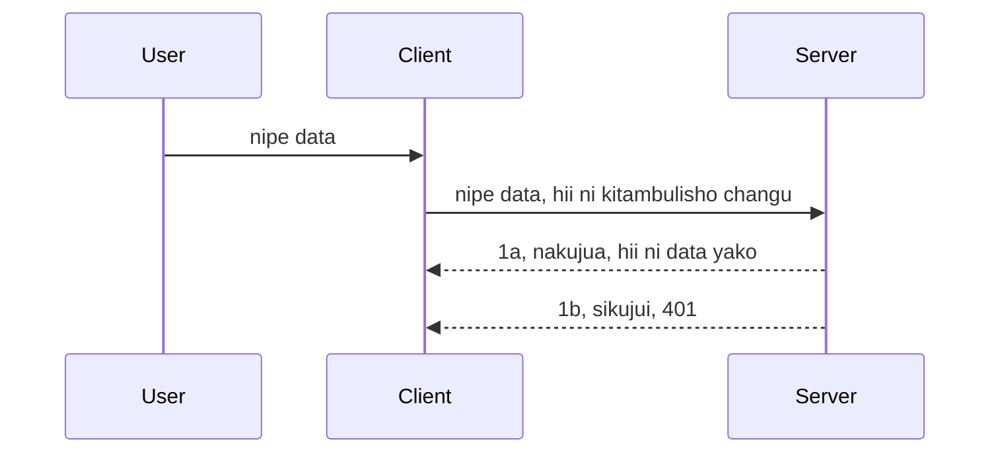

# Uthibitisho rahisi

MCP SDKs zinasaidia matumizi ya OAuth 2.1 ambayo kwa hakika ni mchakato mgumu unaohusisha dhana kama seva ya uthibitishaji, seva ya rasilimali, kutuma taarifa za kuthibitisha, kupata msimbo, kubadilisha msimbo kwa token ya bearer hadi mwisho unaweza kupata data za rasilimali zako. Ikiwa hupatumi sana OAuth ambayo ni jambo zuri kutekeleza, ni wazo zuri kuanza na kiwango cha msingi cha uthibitishaji na kujenga hadi usalama bora zaidi. Ndiyo sababu sura hii ipo, kukuinua hadi uthibitishaji wa hali ya juu.

## Uthibitisho, tunamaanisha nini?

Uthibitisho ni kifupi cha uthibitishaji na idhini. Wazo ni kwamba tunahitaji kufanya mambo mawili:

- **Uthibitishaji**, ni mchakato wa kubaini kama tunamruhusu mtu kuingia nyumbani kwetu, kwamba ana haki ya "kuwa hapa" yaani kufikia seva yetu ya rasilimali ambapo vipengele vya MCP Server vyako viko.
- **Idhini**, ni mchakato wa kugundua kama mtumiaji anapaswa kupata rasilimali hizi maalum anazoomba, kwa mfano maagizo haya au bidhaa hizi au kama wanaruhusiwa kusoma yaliyomo lakini si kufuta kama mfano mwingine.

## Taarifa za kuthibitisha: jinsi tunavyosema mfumo ni nani sisi

Vizuri, watengenezaji wengi wa wavuti hufikiria kwa upande wa kutoa taarifa ya uthibitisho kwa seva, kawaida siri inayosema kama wanaruhusiwa kuwa "hapa" (Uthibitishaji). Taarifa hii kawaida huwa toleo la base64 la jina la mtumiaji na nenosiri au API key inayotambulisha mtumiaji maalum.

Hii inahusisha kuituma kupitia kichwa kinachoitwa "Authorization" kama ifuatavyo:

```json
{ "Authorization": "secret123" }
```

Hii kawaida hujulikana kama uthibitishaji wa msingi. Jinsi mchakato mzima unavyofanya kazi ni kama ifuatavyo:


Sasa tunapoelewa jinsi inavyofanya kazi kwa mtazamo wa mchakato, tunatekelezaje? Vizuri, seva nyingi za wavuti zina dhana inayoitwa middleware, kipande cha msimbo kinachoendeshwa kama sehemu ya ombi ambacho kinaweza kuthibitisha taarifa za uthibitisho, na ikiwa ni halali kinaweza kuruhusu ombi kupitishwa. Ikiwa ombi halina taarifa halali basi unapata kosa la uthibitishaji. Tuchunguze jinsi hii inaweza kutekelezwa:

**Python**

```python
class AuthMiddleware(BaseHTTPMiddleware):
    async def dispatch(self, request, call_next):

        has_header = request.headers.get("Authorization")
        if not has_header:
            print("-> Missing Authorization header!")
            return Response(status_code=401, content="Unauthorized")

        if not valid_token(has_header):
            print("-> Invalid token!")
            return Response(status_code=403, content="Forbidden")

        print("Valid token, proceeding...")
       
        response = await call_next(request)
        # ongeza vichwa vya wateja au badilisha jibu kwa njia fulani
        return response


starlette_app.add_middleware(CustomHeaderMiddleware)
```

Hapa tunao:

- Kuunda middleware inayoitwa `AuthMiddleware` ambapo njia yake ya `dispatch` inaitwa na seva ya wavuti.
- Kuongeza middleware kwenye seva ya wavuti:

    ```python
    starlette_app.add_middleware(AuthMiddleware)
    ```

- Kuandika mantiki ya uthibitishaji inayokagua kama kichwa cha Authorization kipo na kama siri inayotumwa ni halali:

    ```python
    has_header = request.headers.get("Authorization")
    if not has_header:
        print("-> Missing Authorization header!")
        return Response(status_code=401, content="Unauthorized")

    if not valid_token(has_header):
        print("-> Invalid token!")
        return Response(status_code=403, content="Forbidden")
    ```

    ikiwa siri ipo na ni halali basi tunaruhusu ombi liende kwa kuita `call_next` na kurudisha majibu.

    ```python
    response = await call_next(request)
    # ongeza vichwa vya maelezo vya mteja yoyote au badilisha jibu kwa njia fulani
    return response
    ```

Jinsi inavyofanya kazi ni kwamba ikiwa ombi la wavuti limefanywa kuelekea seva, middleware itaitwa na kutokana na utekelezaji wake itaruhusu ombi kupita au hatimaye itarudisha kosa linaloashiria mteja hana ruhusa ya kuendelea.

**TypeScript**

Hapa tunaunda middleware kwa kutumia fremu maarufu ya Express na kuzuia ombi kabla halijafika MCP Server. Huu ndio msimbo wa hilo:

```typescript
function isValid(secret) {
    return secret === "secret123";
}

app.use((req, res, next) => {
    // 1. Kichwa cha idhini kipo?
    if(!req.headers["Authorization"]) {
        res.status(401).send('Unauthorized');
    }
    
    let token = req.headers["Authorization"];

    // 2. Angalia uhalali.
    if(!isValid(token)) {
        res.status(403).send('Forbidden');
    }

   
    console.log('Middleware executed');
    // 3. Inapitisha ombi kwenye hatua inayofuata katika mtiririko wa maombi.
    next();
});
```

Katika msimbo huu tunafanya:

1. Kugundua kama kichwa cha Authorization kipo kabisa, ikiwa hapatiwi, tunatuma kosa 401.
2. Kuhakikisha taarifa/token ni halali, ikiwa sivyo, tunatuma kosa 403.
3. Mwisho hupitisha ombi katika mchakato wa ombi na kurudisha rasilimali iliyohitajika.

## Mazoezi: Tekeleza uthibitishaji

Tuchukue maarifa yetu na tujaribu kuutekeleza. Hapa ni mpango:

Seva

- Unda seva ya wavuti na mfano wa MCP.
- Tekeleza middleware kwa seva.

Mteja 

- Tuma ombi la wavuti, likiwa na taarifa za uthibitisho, kupitia kichwa.

### -1- Unda seva ya wavuti na mfano wa MCP

Katika hatua yetu ya kwanza, tunahitaji kuunda mfano wa seva ya wavuti na MCP Server.

**Python**

Hapa tunaunda mfano wa MCP server, kuunda app ya wavuti ya starlette na kuiendesha kwa uvicorn.

```python
# kuunda seva ya MCP

app = FastMCP(
    name="MCP Resource Server",
    instructions="Resource Server that validates tokens via Authorization Server introspection",
    host=settings["host"],
    port=settings["port"],
    debug=True
)

# kuunda programu ya wavuti ya starlette
starlette_app = app.streamable_http_app()

# kuhudumia programu kupitia uvicorn
async def run(starlette_app):
    import uvicorn
    config = uvicorn.Config(
            starlette_app,
            host=app.settings.host,
            port=app.settings.port,
            log_level=app.settings.log_level.lower(),
        )
    server = uvicorn.Server(config)
    await server.serve()

run(starlette_app)
```

Katika msimbo huu tunafanya:

- Kuunda MCP Server.
- Kujenga app ya wavuti ya starlette kutoka MCP Server, `app.streamable_http_app()`.
- Kuendesha na kuhudumia app ya wavuti kwa kutumia uvicorn `server.serve()`.

**TypeScript**

Hapa tunaunda mfano wa MCP Server.

```typescript
const server = new McpServer({
      name: "example-server",
      version: "1.0.0"
    });

    // ... weka rasilimali za seva, zana, na maelekezo ...
```

Uundaji huu wa MCP Server utahitaji kufanyika ndani ya ufafanuzi wa njia ya POST /mcp, kwa hiyo chukua msimbo hapo juu na kuuhamisha kama ifuatavyo:

```typescript
import express from "express";
import { randomUUID } from "node:crypto";
import { McpServer } from "@modelcontextprotocol/sdk/server/mcp.js";
import { StreamableHTTPServerTransport } from "@modelcontextprotocol/sdk/server/streamableHttp.js";
import { isInitializeRequest } from "@modelcontextprotocol/sdk/types.js"

const app = express();
app.use(express.json());

// Ramani ya kuhifadhi usafirishaji kwa ID ya kikao
const transports: { [sessionId: string]: StreamableHTTPServerTransport } = {};

// Shughulikia maombi ya POST kwa mawasiliano ya mteja-kwa-server
app.post('/mcp', async (req, res) => {
  // Angalia kama ID ya kikao ipo tayari
  const sessionId = req.headers['mcp-session-id'] as string | undefined;
  let transport: StreamableHTTPServerTransport;

  if (sessionId && transports[sessionId]) {
    // Tumia tena usafirishaji uliopo
    transport = transports[sessionId];
  } else if (!sessionId && isInitializeRequest(req.body)) {
    // Ombi jipya la kuanzisha
    transport = new StreamableHTTPServerTransport({
      sessionIdGenerator: () => randomUUID(),
      onsessioninitialized: (sessionId) => {
        // Hifadhi usafirishaji kwa ID ya kikao
        transports[sessionId] = transport;
      },
      // Ulinzi wa DNS rebinding umezimwa kwa default kwa ajili ya ulinganifu wa nyuma. Ikiwa unafanya kazi na server hii
      // kwa karibu, hakikisha kuweka:
      // enableDnsRebindingProtection: true,
      // allowedHosts: ['127.0.0.1'],
    });

    // Safisha usafirishaji wakati umefungwa
    transport.onclose = () => {
      if (transport.sessionId) {
        delete transports[transport.sessionId];
      }
    };
    const server = new McpServer({
      name: "example-server",
      version: "1.0.0"
    });

    // ... panga rasilimali za server, vifaa, na maelekezo ...

    // Unganisha na server ya MCP
    await server.connect(transport);
  } else {
    // Ombi batili
    res.status(400).json({
      jsonrpc: '2.0',
      error: {
        code: -32000,
        message: 'Bad Request: No valid session ID provided',
      },
      id: null,
    });
    return;
  }

  // Shughulikia ombi
  await transport.handleRequest(req, res, req.body);
});

// Mtunzaji wa matumizi tena kwa maombi ya GET na DELETE
const handleSessionRequest = async (req: express.Request, res: express.Response) => {
  const sessionId = req.headers['mcp-session-id'] as string | undefined;
  if (!sessionId || !transports[sessionId]) {
    res.status(400).send('Invalid or missing session ID');
    return;
  }
  
  const transport = transports[sessionId];
  await transport.handleRequest(req, res);
};

// Shughulikia maombi ya GET kwa taarifa za server-kwa-mteja kupitia SSE
app.get('/mcp', handleSessionRequest);

// Shughulikia maombi ya DELETE kwa kumaliza kikao
app.delete('/mcp', handleSessionRequest);

app.listen(3000);
```

Sasa unaona jinsi uundaji wa MCP Server ulivyohamishwa ndani ya `app.post("/mcp")`.

Tuendelee kwa hatua inayofuata ya kuunda middleware ili tuweze kuthibitisha taarifa inayoingia.

### -2- Tekeleza middleware kwa seva

Hebu turudi kwenye sehemu ya middleware sasa. Hapa tutaunda middleware inatafuta taarifa katika kichwa cha `Authorization` na kuithibitisha. Ikiwa inakubalika basi ombi litaenda kutekeleza kile kinachotakiwa (mfano: orodha ya zana, soma rasilimali au shughuli yoyote ya MCP mteja aliyoomba).

**Python**

Ili kuunda middleware, tunahitaji kuunda darasa linalotokea `BaseHTTPMiddleware`. Kuna vipande viwili vya kuvutia:

- Ombi `request` , ambalo tunasoma taarifa ya kichwa kutoka kwake.
- `call_next` kitoaji tunachotakiwa kuitisha ikiwa mteja ameleta taarifa tunazoikubali.

Kwanza, tunahitaji kushughulikia hali ikiwa kichwa cha `Authorization` hakipo:

```python
has_header = request.headers.get("Authorization")

# hakuna kichwa kilicho, shindwa na 401, vinginevyo endelea.
if not has_header:
    print("-> Missing Authorization header!")
    return Response(status_code=401, content="Unauthorized")
```

Hapa tunatuma ujumbe wa 401 unauthorized kwa sababu mteja ameshindwa uthibitishaji.

Ifuatayo, ikiwa taarifa ilitumwa, tunahitaji kuangalia uhalali wake kama ifuatavyo:

```python
 if not valid_token(has_header):
    print("-> Invalid token!")
    return Response(status_code=403, content="Forbidden")
```

Angalia jinsi tunavyotuma ujumbe wa 403 forbidden hapo juu. Tuchunguze middleware kamili hapa chini ikitekeleza kila kitu tulichosema hapo juu:

```python
class AuthMiddleware(BaseHTTPMiddleware):
    async def dispatch(self, request, call_next):

        has_header = request.headers.get("Authorization")
        if not has_header:
            print("-> Missing Authorization header!")
            return Response(status_code=401, content="Unauthorized")

        if not valid_token(has_header):
            print("-> Invalid token!")
            return Response(status_code=403, content="Forbidden")

        print("Valid token, proceeding...")
        print(f"-> Received {request.method} {request.url}")
        response = await call_next(request)
        response.headers['Custom'] = 'Example'
        return response

```

Nzuri, lakini kuhusu kazi ya `valid_token`? Hapa ipo hapa chini:
:

```python
# USITUMIE kwa ajili ya uzalishaji - boresha !!
def valid_token(token: str) -> bool:
    # ondoa kivandiko cha "Bearer "
    if token.startswith("Bearer "):
        token = token[7:]
        return token == "secret-token"
    return False
```

Hii inapaswa kuboreshwa wazi.

MUHIMU: Haipaswi KAMWE kuweka siri kama hizi katika msimbo. Ni vyema kupata thamani ya kulinganisha kutoka kwa chanzo cha data au kutoka kwa IDP (mtoa huduma wa utambulisho) au bora zaidi, ruhusu IDP ifanye uthibitishaji.

**TypeScript**

Ili kutekeleza hili kwa Express, tunahitaji kuitisha njia ya `use` inayochukua middleware functions.

Tunahitaji:

- Kujishughulisha na ombi kuangalia taarifa iliyopita katika mali ya `Authorization`.
- Kuhakikisha taarifa ni halali, na ikiwa hivyo, ruhusu ombi liendelee na ombi la MCP la mteja lifanye kile kinachotakiwa (mfano: orodha ya zana, soma rasilimali au zinginezo zinazohusiana na MCP).

Hapa, tunakagua kama kichwa cha `Authorization` kipo na ikiwa hakipo, tunazuia ombi kupita:

```typescript
if(!req.headers["authorization"]) {
    res.status(401).send('Unauthorized');
    return;
}
```

Kama kichwa hakitumiwi kabisa, unapata 401.

Ifuatayo, tunakagua kama taarifa ni halali, ikiwa sivyo tena tunazuia ombi lakini kwa ujumbe tofauti kidogo:

```typescript
if(!isValid(token)) {
    res.status(403).send('Forbidden');
    return;
} 
```

Angalia sasa unapata kosa 403.

Huu ni msimbo mzima:

```typescript
app.use((req, res, next) => {
    console.log('Request received:', req.method, req.url, req.headers);
    console.log('Headers:', req.headers["authorization"]);
    if(!req.headers["authorization"]) {
        res.status(401).send('Unauthorized');
        return;
    }
    
    let token = req.headers["authorization"];

    if(!isValid(token)) {
        res.status(403).send('Forbidden');
        return;
    }  

    console.log('Middleware executed');
    next();
});
```

Tumeweka seva ya wavuti ili ikubali middleware kuangalia taarifa ambayo mteja tunategemea anaituma. Je, kuhusu mteja mwenyewe?

### -3- Tuma ombi la wavuti kwa kutumia taarifa kupitia kichwa

Tunahitaji kuhakikisha mteja anapitisha taarifa kupitia kichwa. Kwa kuwa tutatumia mteja wa MCP kufanya hivyo, tunahitaji kujua jinsi ya kufanya hivyo.

**Python**

Kwa mteja, tunahitaji kuamsha kichwa na taarifa kama ifuatavyo:

```python
# USIweke thamani moja kwa moja, iwe angalau katika variable ya mazingira au hifadhi salama zaidi
token = "secret-token"

async with streamablehttp_client(
        url = f"http://localhost:{port}/mcp",
        headers = {"Authorization": f"Bearer {token}"}
    ) as (
        read_stream,
        write_stream,
        session_callback,
    ):
        async with ClientSession(
            read_stream,
            write_stream
        ) as session:
            await session.initialize()
      
            # KUFANYA, kile unachotaka kifanyike katika mteja, kwa mfano orodha ya zana, piga simu za zana n.k.
```

Angalia jinsi tunavyojaza mali ya `headers` kama ` headers = {"Authorization": f"Bearer {token}"}`.

**TypeScript**

Hii tunaweza kuitatua kwa hatua mbili:

1. Kujaza kitua cha usanidi na taarifa zetu.
2. Kupitisha kitua cha usanidi kwa usafirishaji.

```typescript

// USIIANDE kodi thamani kama ilivyoonyeshwa hapa. Angalau iwe kama variable ya mazingira na tumia kitu kama dotenv (katika mode ya maendeleo).
let token = "secret123"

// fafanua chaguo la usafirishaji wa mteja
let options: StreamableHTTPClientTransportOptions = {
  sessionId: sessionId,
  requestInit: {
    headers: {
      "Authorization": "secret123"
    }
  }
};

// pitisha kitu cha chaguo kwa usafirishaji
async function main() {
   const transport = new StreamableHTTPClientTransport(
      new URL(serverUrl),
      options
   );
```

Hapa unaona jinsi tulivyohitaji kuunda kitua cha `options` na kuweka vichwa vya habari chini ya mali `requestInit`.

MUHIMU: Tunawezaje kuboresha hili kutoka hapa? Vizuri, utekelezaji wa sasa una changamoto. Kwanza, kupitisha taarifa kama hii ni hatari hasa kama huna HTTPS angalau. Hata hivyo, taarifa zinaweza kuibiwa kwa hiyo unahitaji mfumo unaoweza kuhalalisha token na kuongeza ukaguzi zaidi kama wapi dunia inatokea, ikiwa maombi yanafanyika mara nyingi mno (tabia ya bot), kwa ufupi, kuna masuala mengi ya kufikiria.

Hata hivyo inapaswa kusemwa, kwa API rahisi sana ambako hutaki mtu yeyote aitumie API yako bila kuthibitishwa, kile tunachokiona hapa ni mwanzo mzuri.

Kwa kusema hayo, tujaribu kuongeza usalama kidogo kwa kutumia muundo uliopangwa kama JSON Web Token, pia inajulikana kama JWT au token za "JOT".

## JSON Web Tokens, JWT

Sasa, tunajaribu kuboresha mambo kutoka kwa kutuma taarifa rahisi sana. Maboresho ya haraka tunayotoka kwa kutumia JWT ni yapi?

- **Maboresho ya usalama**. Katika uthibitishaji wa msingi, unatumia jina la mtumiaji na neno la siri kama base64 token (au API key) mara kwa mara ambayo huongeza hatari. Ukiwa na JWT, unatumia jina la mtumiaji na nenosiri na unapata token kama malipo na pia ni ya muda mfupi inayokwisha. JWT inakuwezesha kutumia udhibiti wa upatikanaji wa kina kwa kutumia majukumu, maeneo na ruhusa.
- **Kutoegemea hali na upanuzi**. JWT ni ya kujitegemea, zinabeba habari zote za mtumiaji na kuziondoa haja ya kuhifadhi kikao kwenye seva. Token pia inaweza kuthibitishwa ndani ya mkoa.
- **Ushirikiano na ushirika**. JWT ni msingi wa Open ID Connect na hutumiwa na watoa huduma wa utambulisho kama Entra ID, Google Identity na Auth0. Pia hufanya iwezekane kutumia saini moja tu na mengine mengi kufanya kuwa bora kwa biashara kubwa.
- **Ugawaji na kubadilika**. JWT pia inaweza kutumiwa na Mlangoni wa API kama Azure API Management, NGINX na zaidi. Inasaidia hali za uthibitishaji na mawasiliano ya seva kwa seva ikiwa ni pamoja na kuiga na kutoa mamlaka.
- **Utendaji na kuhifadhi**. JWT inaweza kuhifadhiwa baada ya kutafsiriwa ambayo hupunguza haja ya kuchambua. Hii husaidia hasa kwa programu zilizo na trafiki kubwa kwani huongeza kasi na kupunguza mzigo wa miundombinu uliyochaguliwa.
- **Vipengele vya hali ya juu**. Pia inasaidia uchunguzi (kaguzi la uhalali kwenye seva) na kufuta (kufanya token kuwa batili).

Kwa faida zote hizi, tuchunguze jinsi tunavyoweza kuboresha utekelezaji wetu hadi kiwango kingine.

## Kubadilisha uthibitishaji wa msingi kuwa JWT

Hivyo, mabadiliko tunayotakiwa kufanya kwa muhtasari ni:

- **Jifunze jinsi ya kutengeneza token ya JWT** na kuiandaa kutumwa kutoka mteja hadi seva.
- **Thibitisha token ya JWT**, na ikiwa ni sahihi, ruhusu mteja apate rasilimali zetu.
- **Uhifadhi salama wa token**. Jinsi tunavyohifadhi token hii.
- **Linda njia**. Tunahitaji kulinda njia, katika kesi yetu, kulinda njia na vipengele maalum vya MCP.
- **Ongeza token za kurejesha**. Hakikisha tunaunda token fupi-la mduara lakini pia token za kurejesha za muda mrefu zinazoweza kutumika kupata token mpya ikiwa zinapotea uhalali. Pia hakikisha kuna njia ya kurejesha na mkakati wa mzunguko.

### -1- Tengeneza token ya JWT

Kwanza kabisa, token ya JWT ina sehemu zifuatazo:

- **kichwa**, algoriti inayotumika na aina ya token.
- **mzigo**, madai, kama sub (mtumiaji au kiumbe ambacho token inawakilisha. Katika hali ya uthibitishaji huu kawaida ni userid), exp (wakati utakapoisha) rol (cheo)
- **sahihi**, imesainiwa kwa siri au funguo binafsi.

Kwa hili, tunahitaji kuunda kichwa, mzigo na token iliyosimbwa.

**Python**

```python

import jwt
import jwt
from jwt.exceptions import ExpiredSignatureError, InvalidTokenError
import datetime

# Funguo ya siri inayotumika kusaini JWT
secret_key = 'your-secret-key'

header = {
    "alg": "HS256",
    "typ": "JWT"
}

# taarifa za mtumiaji na madai yake na muda wa kumalizika
payload = {
    "sub": "1234567890",               # Mada (kitambulisho cha mtumiaji)
    "name": "User Userson",                # Dawa ya kawaida
    "admin": True,                     # Dawa ya kawaida
    "iat": datetime.datetime.utcnow(),# Ilitolewa saa
    "exp": datetime.datetime.utcnow() + datetime.timedelta(hours=1)  # Muda wa kumalizika
}

# yafanye usimbaji
encoded_jwt = jwt.encode(payload, secret_key, algorithm="HS256", headers=header)
```

Katika msimbo huu wa juu tume:

- Kubainisha kichwa kinachotumia HS256 kama algoriti na aina kuwa JWT.
- Kuunda mzigo unaojumuisha somo au utambulisho wa mtumiaji, jina la mtumiaji, cheo, wakati ilitolewa na wakati inatarajiwa kuisha kwa hivyo ikiingiza kipengele cha muda tulichotaja hapo awali.

**TypeScript**

Hapa tutahitaji baadhi ya utegemezi utakaotusaidia kuunda token ya JWT.

Utegemezi

```sh

npm install jsonwebtoken
npm install --save-dev @types/jsonwebtoken
```

Sasa tumepanga hayo, tuunde kichwa, mzigo na kupitia hilo tujenge token iliyosimbwa.

```typescript
import jwt from 'jsonwebtoken';

const secretKey = 'your-secret-key'; // Tumia mabadiliko ya mazingira katika uzalishaji

// Fafanua mzigo
const payload = {
  sub: '1234567890',
  name: 'User usersson',
  admin: true,
  iat: Math.floor(Date.now() / 1000), // Imetolewa saa
  exp: Math.floor(Date.now() / 1000) + 60 * 60 // Inaisha baada ya saa 1
};

// Fafanua kichwa (hiari, jsonwebtoken huweka chaguo-msingi)
const header = {
  alg: 'HS256',
  typ: 'JWT'
};

// Unda tokeni
const token = jwt.sign(payload, secretKey, {
  algorithm: 'HS256',
  header: header
});

console.log('JWT:', token);
```

Token hii ni:

Imesainiwa kwa kutumia HS256  
Inatumika kwa saa 1  
Inajumuisha madai kama sub, name, admin, iat, na exp.

### -2- Thibitisha token

Pia tutahitaji kuthibitisha token, hili ni jambo tunalopaswa kufanya kwenye seva ili kuhakikisha kile mteja anachotuma ni halali. Kuna ukaguzi mwingi tunalopaswa kufanya hapa kutoka kuthibitisha muundo hadi uhalali wake. Pia unahimizwa kuongeza ukaguzi mwingine kama mtumiaji yuko mfumo wetu na zaidi.

Ili kuthibitisha token, tunahitaji kuitafsiri (decode) ili tuipe usomaji kisha kuanza kuangalia uhalali wake:

**Python**

```python

# Tafsiri na hakiki JWT
try:
    decoded = jwt.decode(token, secret_key, algorithms=["HS256"])
    print("✅ Token is valid.")
    print("Decoded claims:")
    for key, value in decoded.items():
        print(f"  {key}: {value}")
except ExpiredSignatureError:
    print("❌ Token has expired.")
except InvalidTokenError as e:
    print(f"❌ Invalid token: {e}")

```

Katika msimbo huu, tunaita `jwt.decode` tukitumia token, funguo ya siri na algoriti iliyochaguliwa kama ingizo. Angalia jinsi tunavyotumia jaribu-kamata (try-catch) kwani majaribu yaliyoshindwa hufanikisha kosa.

**TypeScript**

Hapa tunahitaji kuitisha `jwt.verify` kupata toleo lililotafsiriwa la token ambalo tunaweza kuchambua zaidi. Ikiwa wito huu utashindwa, maana muundo wa token sio sahihi au hauna uhalali tena.

```typescript

try {
  const decoded = jwt.verify(token, secretKey);
  console.log('Decoded Payload:', decoded);
} catch (err) {
  console.error('Token verification failed:', err);
}
```

KUMBUKUMBU: kama ilivyosemwa hapo awali, tunapaswa kufanya ukaguzi zaidi kuhakikisha token hii inaashiria mtumiaji katika mfumo wetu na kuhakikisha mtumiaji ana haki anazodai kuwa nazo.
Next, tutaangalia udhibiti wa upatikanaji wa msingi wa majukumu, unaojulikana pia kama RBAC.

## Kuongeza udhibiti wa upatikanaji wa msingi wa majukumu

Wazo ni kwamba tunataka kueleza kuwa majukumu tofauti yana idhini tofauti. Kwa mfano, tunadhani msimamizi anaweza kufanya kila kitu na watumiaji wa kawaida wanaweza kusoma/kuandika na mgeni anaweza kusoma tu. Kwa hiyo, hapa kuna viwango vya ruhusa vinavyowezekana:

- Admin.Write 
- User.Read
- Guest.Read

Tuchunguze jinsi tunavyoweza kutekeleza udhibiti kama huo kwa kutumia middleware. Middleware zinaweza kuongezwa kwa kila njia pamoja na kwa njia zote.

**Python**

```python
from starlette.middleware.base import BaseHTTPMiddleware
from starlette.responses import JSONResponse
import jwt

# USIWE na siri ndani ya msimbo kama hii, hii ni kwa madhumuni ya maonyesho tu. Soma kutoka mahali salama.
SECRET_KEY = "your-secret-key" # weka hii katika variable ya env
REQUIRED_PERMISSION = "User.Read"

class JWTPermissionMiddleware(BaseHTTPMiddleware):
    async def dispatch(self, request, call_next):
        auth_header = request.headers.get("Authorization")
        if not auth_header or not auth_header.startswith("Bearer "):
            return JSONResponse({"error": "Missing or invalid Authorization header"}, status_code=401)

        token = auth_header.split(" ")[1]
        try:
            decoded = jwt.decode(token, SECRET_KEY, algorithms=["HS256"])
        except jwt.ExpiredSignatureError:
            return JSONResponse({"error": "Token expired"}, status_code=401)
        except jwt.InvalidTokenError:
            return JSONResponse({"error": "Invalid token"}, status_code=401)

        permissions = decoded.get("permissions", [])
        if REQUIRED_PERMISSION not in permissions:
            return JSONResponse({"error": "Permission denied"}, status_code=403)

        request.state.user = decoded
        return await call_next(request)


```

Kuna njia kadhaa tofauti za kuongeza middleware kama ifuatavyo:

```python

# Alt 1: ongeza middleware wakati wa kujenga app ya starlette
middleware = [
    Middleware(JWTPermissionMiddleware)
]

app = Starlette(routes=routes, middleware=middleware)

# Alt 2: ongeza middleware baada ya app ya starlette kujengwa tayari
starlette_app.add_middleware(JWTPermissionMiddleware)

# Alt 3: ongeza middleware kwa kila njia
routes = [
    Route(
        "/mcp",
        endpoint=..., # mshughulikiaji
        middleware=[Middleware(JWTPermissionMiddleware)]
    )
]
```

**TypeScript**

Tunaweza kutumia `app.use` na middleware itakayotekelezwa kwa maombi yote. 

```typescript
app.use((req, res, next) => {
    console.log('Request received:', req.method, req.url, req.headers);
    console.log('Headers:', req.headers["authorization"]);

    // 1. Angalia kama kichwa cha idhini kimetumwa

    if(!req.headers["authorization"]) {
        res.status(401).send('Unauthorized');
        return;
    }
    
    let token = req.headers["authorization"];

    // 2. Angalia kama tokeni ni halali
    if(!isValid(token)) {
        res.status(403).send('Forbidden');
        return;
    }  

    // 3. Angalia kama mtumiaji wa tokeni yupo katika mfumo wetu
    if(!isExistingUser(token)) {
        res.status(403).send('Forbidden');
        console.log("User does not exist");
        return;
    }
    console.log("User exists");

    // 4. Thibitisha tokeni ina ruhusa sahihi
    if(!hasScopes(token, ["User.Read"])){
        res.status(403).send('Forbidden - insufficient scopes');
    }

    console.log("User has required scopes");

    console.log('Middleware executed');
    next();
});

```

Kuna mambo mengi tunaweza kuruhusu middleware yetu na middleware yetu INASTAHILI kufanya, yaani:

1. Angalia ikiwa kichwa cha idhini kipo
2. Angalia ikiwa token ni halali, tunaita `isValid` ambayo ni njia tuliyoandika ambayo inakagua uhalali na uhalisia wa token ya JWT.
3. Thibitisha kuwa mtumiaji yuko katika mfumo wetu, tunapaswa kukagua hili.

   ```typescript
    // watumiaji katika hifadhidata
   const users = [
     "user1",
     "User usersson",
   ]

   function isExistingUser(token) {
     let decodedToken = verifyToken(token);

     // TODO, hakiki kama mtumiaji yupo katika hifadhidata
     return users.includes(decodedToken?.name || "");
   }
   ```

   Juu, tumetengeneza orodha rahisi ya `users`, ambayo kwa kawaida inapaswa kuwa katika hifadhidata.

4. Zaidi ya hayo, tunapaswa pia kukagua token ina ruhusa sahihi.

   ```typescript
   if(!hasScopes(token, ["User.Read"])){
        res.status(403).send('Forbidden - insufficient scopes');
   }
   ```

   Katika msimbo huu hapo juu kutoka kwa middleware, tunakagua kuwa token ina ruhusa ya User.Read, ikiwa haina tunatuma kosa la 403. Hapa chini ni njia ya msaada `hasScopes`.

   ```typescript
   function hasScopes(scope: string, requiredScopes: string[]) {
     let decodedToken = verifyToken(scope);
    return requiredScopes.every(scope => decodedToken?.scopes.includes(scope));
  }
   ```

Have a think which additional checks you should be doing, but these are the absolute minimum of checks you should be doing.

Using Express as a web framework is a common choice. There are helpers library when you use JWT so you can write less code.

- `express-jwt`, helper library that provides a middleware that helps decode your token.
- `express-jwt-permissions`, this provides a middleware `guard` that helps check if a certain permission is on the token.

Here's what these libraries can look like when used:

```typescript
const express = require('express');
const jwt = require('express-jwt');
const guard = require('express-jwt-permissions')();

const app = express();
const secretKey = 'your-secret-key'; // put this in env variable

// Decode JWT and attach to req.user
app.use(jwt({ secret: secretKey, algorithms: ['HS256'] }));

// Check for User.Read permission
app.use(guard.check('User.Read'));

// multiple permissions
// app.use(guard.check(['User.Read', 'Admin.Access']));

app.get('/protected', (req, res) => {
  res.json({ message: `Welcome ${req.user.name}` });
});

// Error handler
app.use((err, req, res, next) => {
  if (err.code === 'permission_denied') {
    return res.status(403).send('Forbidden');
  }
  next(err);
});

```

Sasa umeona jinsi middleware inaweza kutumika kwa uthibitishaji na idhini, vipi kuhusu MCP, je, hubadilisha jinsi tunavyofanya uthibitishaji? Tutarifahamu katika sehemu inayofuata.

### -3- Ongeza RBAC kwa MCP

Umeona hadi sasa jinsi unavyoweza kuongeza RBAC kupitia middleware, hata hivyo, kwa MCP hakuna njia rahisi ya kuongeza RBAC kwa kila kipengele cha MCP, basi tunafanya nini? Vizuri, tunapaswa tu kuongeza msimbo kama huu unaokagua ikiwa mteja ana haki ya kutumia kifaa fulani:

Una chaguzi mbalimbali juu ya jinsi ya kufanikisha RBAC kwa kila kipengele, hapa ni baadhi:

- Ongeza ukaguzi kwa kila kifaa, rasilimali, ombi ambapo unahitaji kukagua kiwango cha ruhusa.

   **python**

   ```python
   @tool()
   def delete_product(id: int):
      try:
          check_permissions(role="Admin.Write", request)
      catch:
        pass # mteja alishindwa kupata idhini, onyesha hitilafu ya idhini
   ```

   **typescript**

   ```typescript
   server.registerTool(
    "delete-product",
    {
      title: Delete a product",
      description: "Deletes a product",
      inputSchema: { id: z.number() }
    },
    async ({ id }) => {
      
      try {
        checkPermissions("Admin.Write", request);
        // kufanya, tuma kitambulisho kwa productService na sehemu ya mbali
      } catch(Exception e) {
        console.log("Authorization error, you're not allowed");  
      }

      return {
        content: [{ type: "text", text: `Deletected product with id ${id}` }]
      };
    }
   );
   ```


- Tumia mbinu ya seva ya hali ya juu na watendaji wa ombi ili kupunguza idadi ya maeneo unayohitaji kufanya ukaguzi.

   **Python**

   ```python
   
   tool_permission = {
      "create_product": ["User.Write", "Admin.Write"],
      "delete_product": ["Admin.Write"]
   }

   def has_permission(user_permissions, required_permissions) -> bool:
      # user_permissions: orodha ya ruhusa ambazo mtumiaji ana
      # required_permissions: orodha ya ruhusa zinazohitajika kwa zana
      return any(perm in user_permissions for perm in required_permissions)

   @server.call_tool()
   async def handle_call_tool(
     name: str, arguments: dict[str, str] | None
   ) -> list[types.TextContent]:
    # Kubali request.user.permissions ni orodha ya ruhusa za mtumiaji
     user_permissions = request.user.permissions
     required_permissions = tool_permission.get(name, [])
     if not has_permission(user_permissions, required_permissions):
        # Toa kosa "Huna ruhusa ya kutumia zana {name}"
        raise Exception(f"You don't have permission to call tool {name}")
     # endelea na uitumie zana
     # ...
   ```   
   

   **TypeScript**

   ```typescript
   function hasPermission(userPermissions: string[], requiredPermissions: string[]): boolean {
       if (!Array.isArray(userPermissions) || !Array.isArray(requiredPermissions)) return false;
       // Rudisha kweli ikiwa mtumiaji ana angalau ruhusa moja inayohitajika
       
       return requiredPermissions.some(perm => userPermissions.includes(perm));
   }
  
   server.setRequestHandler(CallToolRequestSchema, async (request) => {
      const { params: { name } } = request;
  
      let permissions = request.user.permissions;
  
      if (!hasPermission(permissions, toolPermissions[name])) {
         return new Error(`You don't have permission to call ${name}`);
      }
  
      // endelea..
   });
   ```

   Kumbuka, utahitaji kuhakikisha middleware yako inaweka token iliyotafsiriwa kwenye mali ya mtumiaji ya ombi ili msimbo hapo juu uwe rahisi.

### Kuhitimisha

Sasa tunapojadili jinsi ya kuongeza msaada wa RBAC kwa ujumla na kwa MCP kwa undani zaidi, ni wakati wa kujaribu kutekeleza usalama kwa wenyewe ili kuhakikisha umeelewa dhana zilizokupasilishwa.

## Kazi ya Nyumbani 1: Jenga seva ya mcp na mteja wa mcp ukitumia uthibitishaji wa msingi

Hapa utachukua kile ulichojifunza kuhusu kutuma taarifa za uthibitishaji kupitia vichwa.

## Suluhisho 1

[Solution 1](./code/basic/README.md)

## Kazi ya Nyumbani 2: Boresha suluhisho kutoka Kazi ya Nyumbani 1 kutumia JWT

Chukua suluhisho la kwanza lakini wakati huu, tuiboreshe.

Badala ya kutumia Basic Auth, tumia JWT.

## Suluhisho 2

[Solution 2](./solution/jwt-solution/README.md)

## Changamoto

Ongeza RBAC kwa kila kifaa kama tulivyoeleza katika sehemu "Add RBAC to MCP".

## Muhtasari

Unatarajiwa umejifunza mengi katika sura hii, kutoka kwa ukosefu wa usalama kabisa, hadi usalama wa msingi, hadi JWT na jinsi inaweza kuongezwa kwenye MCP.

Tumejenga msingi thabiti na JWT zilizobinafsishwa, lakini tukikua tunasogea kuelekea kwa mfano wa utambulisho unaotegemea viwango. Kupitisha IdP kama Entra au Keycloak kunaturuhusu kupunguza mzigo wa utoaji token, ukaguzi, na usimamizi wa maisha ya token kwa jukwaa la kuaminiwa — ikituachia kuzingatia mantiki ya programu na uzoefu wa mtumiaji.

Kwa hiyo, tuna sura zaidi [ya hali ya juu juu ya Entra](../../05-AdvancedTopics/mcp-security-entra/README.md)

## Nini Kifuatacho

- Ifuatayo: [Kuweka MCP Hosts](../12-mcp-hosts/README.md)

---

<!-- CO-OP TRANSLATOR DISCLAIMER START -->
**Kiarifu cha Kunyang’anya**:
Hati hii imetafsiriwa kwa kutumia huduma ya tafsiri ya AI [Co-op Translator](https://github.com/Azure/co-op-translator). Ingawa tunajitahidi kwa usahihi, tafadhali fahamu kuwa tafsiri za kiotomatiki zinaweza kuwa na makosa au kutokukamilika. Hati ya asili katika lugha yake ya asili inapaswa kuzingatiwa kama chanzo cha mamlaka. Kwa taarifa muhimu, tafsiri ya kitaalamu ya binadamu inahimizwa. Hatuna dhamana kwa kutokuelewana au tafsiri mbaya zitokanazo na matumizi ya tafsiri hii.
<!-- CO-OP TRANSLATOR DISCLAIMER END -->